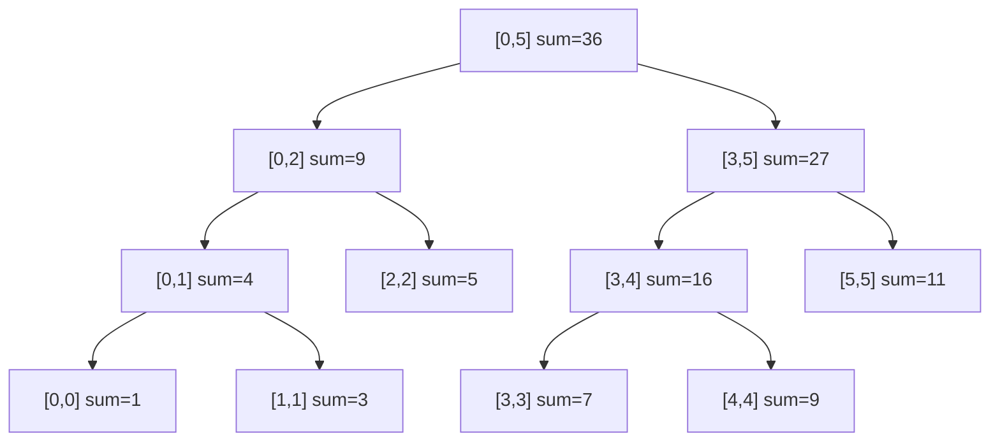

---
数据结构教程 — 线段树 (Segment Tree)
---

##  章节概述

线段树（Segment Tree）是一种用于高效处理区间查询和区间修改的树形数据结构。
它将一个数组划分为若干区间，每个节点维护对应区间的聚合信息（如区间和、最大值、最小值等），
支持在O(log n)时间内完成单点修改、区间修改和区间查询。

线段树在竞赛编程和工程实践中应用广泛，如数据库范围查询、图形渲染中的区间重叠检测、
时间序列数据聚合等。本章将从线段树的基本原理讲起，深入懒标记的实现，
全面覆盖各种变体，最后通过实例和习题巩固所学知识。

>  **底层实现参考**：如果需要深入理解本章数据结构的底层实现（纯C手写、内存布局、指针操作），请参阅 [[../../C语言深化教程/3数据结构/09_高级数据结构|C语言教程: 高级数据结构]]。C教程侧重手动实现与内存本质，本教程侧重STL使用与算法优化，两者互补。

---
###  第一节: 基础语法 + 计算机底层原理
---

1.1 线段树的基本概念
-----------------------

线段树是一棵完全二叉树，对于一个长度为n的数组：
- 每个叶子节点存储原数组中一个元素的信息
- 每个内部节点存储其对应区间的聚合信息
- 根节点对应整个数组区间[0, n-1]
- 左子节点对应左半区间，右子节点对应右半区间

时间复杂度：
- 建树：O(n)
- 单点修改：O(log n)
- 区间查询：O(log n)
- 区间修改（带懒标记）：O(log n)

空间复杂度：O(4n)

1.2 线段树的结构示意

数组 [1, 3, 5, 7, 9, 11]，建立区间和线段树：



> 每个节点对应一个区间 [l, r]，存储该区间的聚合值（如和、最大值）。
> 查询 [1,4] 的区间和时，只需合并 [0,1] + [2,2] + [3,4] 三个节点的值，
> 而不需要遍历 4 个元素。

| 操作 | 复杂度 | 说明 |
|------|--------|------|
| build | O(n) | 自底向上构建，每个节点计算一次 |
| query(l,r) | O(log n) | 目标区间最多被拆成 2log n 个节点区间 |
| update(i,v) | O(log n) | 从叶到根更新路径上的节点 |
| range_add(l,r,v) | O(log n) | 懒标记延迟下推，不立即更新所有子孙 |

1.3 基本线段树（区间和 + 单点修改）

```pseudocode
CLASS SegmentTree:
    tree    // 数组（长度 4n），存储区间和
    n       // 原数组长度

    FUNCTION build(arr, node, start, end):
        IF start == end THEN
            tree[node] = arr[start]
            RETURN
        END IF
        mid = (start + end) // 2
        build(arr, 2 * node, start, mid)
        build(arr, 2 * node + 1, mid + 1, end)
        tree[node] = tree[2 * node] + tree[2 * node + 1]
    END FUNCTION

    FUNCTION update(node, start, end, idx, val):
        IF start == end THEN
            tree[node] = val
            RETURN
        END IF
        mid = (start + end) // 2
        IF idx <= mid THEN
            update(2 * node, start, mid, idx, val)
        ELSE
            update(2 * node + 1, mid + 1, end, idx, val)
        END IF
        tree[node] = tree[2 * node] + tree[2 * node + 1]
    END FUNCTION

    FUNCTION query(node, start, end, l, r):
        IF r < start OR end < l THEN
            RETURN 0
        END IF
        IF l <= start AND end <= r THEN
            RETURN tree[node]
        END IF
        mid = (start + end) // 2
        RETURN query(2 * node, start, mid, l, r) +
               query(2 * node + 1, mid + 1, end, l, r)
    END FUNCTION

    CONSTRUCTOR(arr):
        n = LENGTH(arr)
        tree = ARRAY of size 4 * n, filled with 0
        build(arr, 1, 0, n - 1)
    END CONSTRUCTOR

    FUNCTION update(idx, val):
        update(1, 0, n - 1, idx, val)
    END FUNCTION

    FUNCTION query(l, r):
        RETURN query(1, 0, n - 1, l, r)
    END FUNCTION
END CLASS

// 使用示例:
arr = [1, 3, 5, 7, 9, 11]
st = SegmentTree(arr)
DISPLAY st.query(1, 4)   // 输出区间[1,4]的和
st.update(2, 10)
DISPLAY st.query(1, 4)   // 输出修改后的和
```

---
**实现练习**: 用 C 或 C++ 自行实现上述结构。完成后与 AI 对话检查正确性。
---

1.4 带懒标记的线段树（区间修改 + 区间查询）

```pseudocode
CLASS LazySegmentTree:
    tree    // 数组，存储区间和
    lazy    // 数组，存储懒标记（待下传的加法值）
    n       // 原数组长度

    FUNCTION build(arr, node, start, end):
        IF start == end THEN
            tree[node] = arr[start]
            RETURN
        END IF
        mid = (start + end) // 2
        build(arr, 2 * node, start, mid)
        build(arr, 2 * node + 1, mid + 1, end)
        tree[node] = tree[2 * node] + tree[2 * node + 1]
    END FUNCTION

    FUNCTION pushDown(node, start, end):
        IF lazy[node] != 0 THEN
            mid = (start + end) // 2
            tree[2 * node] = tree[2 * node] + lazy[node] * (mid - start + 1)
            tree[2 * node + 1] = tree[2 * node + 1] + lazy[node] * (end - mid)
            lazy[2 * node] = lazy[2 * node] + lazy[node]
            lazy[2 * node + 1] = lazy[2 * node + 1] + lazy[node]
            lazy[node] = 0
        END IF
    END FUNCTION

    FUNCTION rangeUpdate(node, start, end, l, r, val):
        IF r < start OR end < l THEN
            RETURN
        END IF
        IF l <= start AND end <= r THEN
            tree[node] = tree[node] + val * (end - start + 1)
            lazy[node] = lazy[node] + val
            RETURN
        END IF
        pushDown(node, start, end)
        mid = (start + end) // 2
        rangeUpdate(2 * node, start, mid, l, r, val)
        rangeUpdate(2 * node + 1, mid + 1, end, l, r, val)
        tree[node] = tree[2 * node] + tree[2 * node + 1]
    END FUNCTION

    FUNCTION rangeQuery(node, start, end, l, r):
        IF r < start OR end < l THEN
            RETURN 0
        END IF
        IF l <= start AND end <= r THEN
            RETURN tree[node]
        END IF
        pushDown(node, start, end)
        mid = (start + end) // 2
        RETURN rangeQuery(2 * node, start, mid, l, r) +
               rangeQuery(2 * node + 1, mid + 1, end, l, r)
    END FUNCTION

    CONSTRUCTOR(arr):
        n = LENGTH(arr)
        tree = ARRAY of size 4 * n, filled with 0
        lazy = ARRAY of size 4 * n, filled with 0
        build(arr, 1, 0, n - 1)
    END CONSTRUCTOR

    FUNCTION rangeUpdate(l, r, val):
        rangeUpdate(1, 0, n - 1, l, r, val)
    END FUNCTION

    FUNCTION rangeQuery(l, r):
        RETURN rangeQuery(1, 0, n - 1, l, r)
    END FUNCTION
END CLASS

// 使用示例:
arr = [1, 3, 5, 7, 9, 11]
st = LazySegmentTree(arr)
DISPLAY st.rangeQuery(1, 4)
st.rangeUpdate(1, 3, 5)
DISPLAY st.rangeQuery(1, 4)
```

---
**实现练习**: 用 C 或 C++ 自行实现上述结构。完成后与 AI 对话检查正确性。
---

---
###  第二节: 实现思路
---

2.1 区间最大值/最小值线段树

```pseudocode
STRUCT Node:
    maxVal, minVal    // 同时存储最大和最小值
END STRUCT

CLASS MinMaxSegTree:
    tree    // 数组，存储 Node（每个节点含 maxVal 和 minVal）
    n       // 原数组长度

    FUNCTION build(arr, node, start, end):
        IF start == end THEN
            tree[node].maxVal = arr[start]
            tree[node].minVal = arr[start]
            RETURN
        END IF
        mid = (start + end) // 2
        build(arr, 2 * node, start, mid)
        build(arr, 2 * node + 1, mid + 1, end)
        tree[node].maxVal = MAX(tree[2 * node].maxVal, tree[2 * node + 1].maxVal)
        tree[node].minVal = MIN(tree[2 * node].minVal, tree[2 * node + 1].minVal)
    END FUNCTION

    FUNCTION queryMax(node, start, end, l, r):
        IF r < start OR end < l THEN
            RETURN NEGATIVE_INFINITY
        END IF
        IF l <= start AND end <= r THEN
            RETURN tree[node].maxVal
        END IF
        mid = (start + end) // 2
        RETURN MAX(queryMax(2 * node, start, mid, l, r),
                   queryMax(2 * node + 1, mid + 1, end, l, r))
    END FUNCTION

    FUNCTION queryMin(node, start, end, l, r):
        IF r < start OR end < l THEN
            RETURN POSITIVE_INFINITY
        END IF
        IF l <= start AND end <= r THEN
            RETURN tree[node].minVal
        END IF
        mid = (start + end) // 2
        RETURN MIN(queryMin(2 * node, start, mid, l, r),
                   queryMin(2 * node + 1, mid + 1, end, l, r))
    END FUNCTION

    CONSTRUCTOR(arr):
        n = LENGTH(arr)
        tree = ARRAY of size 4 * n (Node type)
        build(arr, 1, 0, n - 1)
    END CONSTRUCTOR

    FUNCTION queryMax(l, r):
        RETURN queryMax(1, 0, n - 1, l, r)
    END FUNCTION

    FUNCTION queryMin(l, r):
        RETURN queryMin(1, 0, n - 1, l, r)
    END FUNCTION
END CLASS
```

---
**实现练习**: 用 C 或 C++ 自行实现上述结构。完成后与 AI 对话检查正确性。
---

2.2 区间乘法+加法的线段树（双懒标记）

```pseudocode
CLASS MulAddSegTree:
    tree       // 数组，存储区间和（对 mod 取模）
    lazyMul    // 数组，存储乘法懒标记
    lazyAdd    // 数组，存储加法懒标记
    mod        // 模数
    n          // 原数组长度

    FUNCTION build(arr, node, start, end):
        lazyMul[node] = 1
        lazyAdd[node] = 0
        IF start == end THEN
            tree[node] = arr[start] MOD mod
            RETURN
        END IF
        mid = (start + end) // 2
        build(arr, 2 * node, start, mid)
        build(arr, 2 * node + 1, mid + 1, end)
        tree[node] = (tree[2 * node] + tree[2 * node + 1]) MOD mod
    END FUNCTION

    FUNCTION apply(node, start, end, mul, add):
        tree[node] = (tree[node] * mul MOD mod + add * (end - start + 1) MOD mod) MOD mod
        lazyMul[node] = lazyMul[node] * mul MOD mod
        lazyAdd[node] = (lazyAdd[node] * mul MOD mod + add) MOD mod
    END FUNCTION

    FUNCTION pushDown(node, start, end):
        mid = (start + end) // 2
        apply(2 * node, start, mid, lazyMul[node], lazyAdd[node])
        apply(2 * node + 1, mid + 1, end, lazyMul[node], lazyAdd[node])
        lazyMul[node] = 1
        lazyAdd[node] = 0
    END FUNCTION

    FUNCTION rangeMultiply(node, start, end, l, r, val):
        IF r < start OR end < l THEN
            RETURN
        END IF
        IF l <= start AND end <= r THEN
            apply(node, start, end, val, 0)
            RETURN
        END IF
        pushDown(node, start, end)
        mid = (start + end) // 2
        rangeMultiply(2 * node, start, mid, l, r, val)
        rangeMultiply(2 * node + 1, mid + 1, end, l, r, val)
        tree[node] = (tree[2 * node] + tree[2 * node + 1]) MOD mod
    END FUNCTION

    FUNCTION rangeAdd(node, start, end, l, r, val):
        IF r < start OR end < l THEN
            RETURN
        END IF
        IF l <= start AND end <= r THEN
            apply(node, start, end, 1, val)
            RETURN
        END IF
        pushDown(node, start, end)
        mid = (start + end) // 2
        rangeAdd(2 * node, start, mid, l, r, val)
        rangeAdd(2 * node + 1, mid + 1, end, l, r, val)
        tree[node] = (tree[2 * node] + tree[2 * node + 1]) MOD mod
    END FUNCTION

    FUNCTION rangeQuery(node, start, end, l, r):
        IF r < start OR end < l THEN
            RETURN 0
        END IF
        IF l <= start AND end <= r THEN
            RETURN tree[node]
        END IF
        pushDown(node, start, end)
        mid = (start + end) // 2
        RETURN (rangeQuery(2 * node, start, mid, l, r) +
                rangeQuery(2 * node + 1, mid + 1, end, l, r)) MOD mod
    END FUNCTION

    CONSTRUCTOR(arr, p):
        mod = p
        n = LENGTH(arr)
        tree = ARRAY of size 4 * n, filled with 0
        lazyMul = ARRAY of size 4 * n, filled with 1
        lazyAdd = ARRAY of size 4 * n, filled with 0
        build(arr, 1, 0, n - 1)
    END CONSTRUCTOR

    FUNCTION rangeMultiply(l, r, val):
        rangeMultiply(1, 0, n - 1, l, r, val)
    END FUNCTION

    FUNCTION rangeAdd(l, r, val):
        rangeAdd(1, 0, n - 1, l, r, val)
    END FUNCTION

    FUNCTION rangeQuery(l, r):
        RETURN rangeQuery(1, 0, n - 1, l, r)
    END FUNCTION
END CLASS
```

---
**实现练习**: 用 C 或 C++ 自行实现上述结构。完成后与 AI 对话检查正确性。
---

2.3 动态开点线段树

```pseudocode
STRUCT Node:
    sum = 0      // 区间和
    lazy = 0     // 懒标记
    left = 0     // 左子节点编号
    right = 0    // 右子节点编号
END STRUCT

CLASS DynamicSegTree:
    nodes     // 动态数组，存储 Node
    root      // 根节点编号
    L, R      // 值域范围 [L, R]

    FUNCTION newNode():
        APPEND new Node to nodes
        RETURN LENGTH(nodes) - 1
    END FUNCTION

    FUNCTION pushDown(node, start, end):
        IF nodes[node].lazy == 0 THEN RETURN
        IF nodes[node].left == 0 THEN
            nodes[node].left = newNode()
        END IF
        IF nodes[node].right == 0 THEN
            nodes[node].right = newNode()
        END IF
        mid = (start + end) // 2
        lc = nodes[node].left
        rc = nodes[node].right
        nodes[lc].sum = nodes[lc].sum + nodes[node].lazy * (mid - start + 1)
        nodes[lc].lazy = nodes[lc].lazy + nodes[node].lazy
        nodes[rc].sum = nodes[rc].sum + nodes[node].lazy * (end - mid)
        nodes[rc].lazy = nodes[rc].lazy + nodes[node].lazy
        nodes[node].lazy = 0
    END FUNCTION

    FUNCTION update(node, start, end, l, r, val):    // node 传引用
        IF node == 0 THEN
            node = newNode()
        END IF
        IF l <= start AND end <= r THEN
            nodes[node].sum = nodes[node].sum + val * (end - start + 1)
            nodes[node].lazy = nodes[node].lazy + val
            RETURN
        END IF
        pushDown(node, start, end)
        mid = (start + end) // 2
        IF l <= mid THEN
            update(nodes[node].left, start, mid, l, r, val)
        END IF
        IF r > mid THEN
            update(nodes[node].right, mid + 1, end, l, r, val)
        END IF
        nodes[node].sum = 0
        IF nodes[node].left != 0 THEN
            nodes[node].sum = nodes[node].sum + nodes[nodes[node].left].sum
        END IF
        IF nodes[node].right != 0 THEN
            nodes[node].sum = nodes[node].sum + nodes[nodes[node].right].sum
        END IF
    END FUNCTION

    FUNCTION query(node, start, end, l, r):
        IF node == 0 THEN
            RETURN 0
        END IF
        IF l <= start AND end <= r THEN
            RETURN nodes[node].sum
        END IF
        pushDown(node, start, end)
        mid = (start + end) // 2
        result = 0
        IF l <= mid THEN
            result = result + query(nodes[node].left, start, mid, l, r)
        END IF
        IF r > mid THEN
            result = result + query(nodes[node].right, mid + 1, end, l, r)
        END IF
        RETURN result
    END FUNCTION

    CONSTRUCTOR(l, r):
        L = l; R = r
        nodes = []  // 空数组，下标 0 不使用
        APPEND empty Node to nodes  // 占位符
        root = newNode()
    END CONSTRUCTOR

    FUNCTION update(l, r, val):
        update(root, L, R, l, r, val)
    END FUNCTION

    FUNCTION query(l, r):
        RETURN query(root, L, R, l, r)
    END FUNCTION
END CLASS
```

---
**实现练习**: 用 C 或 C++ 自行实现上述结构。完成后与 AI 对话检查正确性。
---

2.4 持久化线段树（主席树）

```pseudocode
STRUCT Node:
    left, right    // 左右子节点编号
    count          // 该节点代表的值域区间内的元素个数
END STRUCT

CLASS PersistentSegTree:
    nodes    // 动态数组，存储 Node（所有历史版本共享）
    roots    // 数组，存每个历史版本的根节点编号

    FUNCTION newNode(l=0, r=0, cnt=0):
        node = Node(left=l, right=r, count=cnt)
        APPEND node to nodes
        RETURN LENGTH(nodes) - 1
    END FUNCTION

    FUNCTION build(start, end):
        node = newNode()
        IF start == end THEN
            RETURN node
        END IF
        mid = (start + end) // 2
        nodes[node].left = build(start, mid)
        nodes[node].right = build(mid + 1, end)
        RETURN node
    END FUNCTION

    FUNCTION update(prev, start, end, pos):
        node = newNode(nodes[prev].left, nodes[prev].right, nodes[prev].count + 1)
        IF start == end THEN
            RETURN node
        END IF
        mid = (start + end) // 2
        IF pos <= mid THEN
            nodes[node].left = update(nodes[prev].left, start, mid, pos)
        ELSE
            nodes[node].right = update(nodes[prev].right, mid + 1, end, pos)
        END IF
        RETURN node
    END FUNCTION

    FUNCTION query(u, v, start, end, k):   // u: 左端点版本, v: 右端点版本
        IF start == end THEN
            RETURN start
        END IF
        mid = (start + end) // 2
        leftCount = nodes[nodes[v].left].count - nodes[nodes[u].left].count
        IF k <= leftCount THEN
            RETURN query(nodes[u].left, nodes[v].left, start, mid, k)
        ELSE
            RETURN query(nodes[u].right, nodes[v].right, mid + 1, end, k - leftCount)
        END IF
    END FUNCTION

    FUNCTION queryKth(arr, l, r, k):
        sorted = SORT(UNIQUE(arr))   // 排序去重
        m = LENGTH(sorted)
        nodes = []; roots = []
        APPEND build(0, m - 1) to roots
        FOR EACH x IN arr:
            pos = LOWER_BOUND(sorted, x)   // 偏移排序后的位置
            APPEND update(roots[LAST], 0, m - 1, pos) to roots
        END FOR
        idx = query(roots[l], roots[r + 1], 0, m - 1, k)
        RETURN sorted[idx]
    END FUNCTION
END CLASS
```

---
**实现练习**: 用 C 或 C++ 自行实现上述结构。完成后与 AI 对话检查正确性。
---

---
###  第三节: 应用场景
---

3.1 案例一：区间染色问题

```pseudocode
CLASS IntervalColoring:
    tree    // 数组，存储区间颜色（-1 表示混合色）
    lazy    // 数组，存储懒标记（待下传的颜色值）
    n       // 区间长度

    FUNCTION pushDown(node):
        IF lazy[node] != 0 THEN
            tree[2 * node] = lazy[node]
            tree[2 * node + 1] = lazy[node]
            lazy[2 * node] = lazy[node]
            lazy[2 * node + 1] = lazy[node]
            lazy[node] = 0
        END IF
    END FUNCTION

    FUNCTION update(node, start, end, l, r, color):
        IF l <= start AND end <= r THEN
            tree[node] = color
            lazy[node] = color
            RETURN
        END IF
        pushDown(node)
        mid = (start + end) // 2
        IF l <= mid THEN
            update(2 * node, start, mid, l, r, color)
        END IF
        IF r > mid THEN
            update(2 * node + 1, mid + 1, end, l, r, color)
        END IF
        IF tree[2 * node] == tree[2 * node + 1] THEN
            tree[node] = tree[2 * node]
        ELSE
            tree[node] = -1
        END IF
    END FUNCTION

    FUNCTION queryColors(node, start, end, l, r, colors):
        IF l <= start AND end <= r AND tree[node] > 0 THEN
            ADD tree[node] to colors     // 加入 set，自动去重
            RETURN
        END IF
        IF start == end THEN RETURN
        pushDown(node)
        mid = (start + end) // 2
        IF l <= mid THEN
            queryColors(2 * node, start, mid, l, r, colors)
        END IF
        IF r > mid THEN
            queryColors(2 * node + 1, mid + 1, end, l, r, colors)
        END IF
    END FUNCTION

    CONSTRUCTOR(size):
        n = size
        tree = ARRAY of size 4 * n, filled with 1
        lazy = ARRAY of size 4 * n, filled with 0
    END CONSTRUCTOR

    FUNCTION paint(l, r, color):
        update(1, 1, n, l, r, color)
    END FUNCTION

    FUNCTION countColors(l, r):
        colors = EMPTY_SET
        queryColors(1, 1, n, l, r, colors)
        RETURN LENGTH(colors)
    END FUNCTION
END CLASS
```

---
**实现练习**: 用 C 或 C++ 自行实现上述结构。完成后与 AI 对话检查正确性。
---

3.2 案例二：逆序对计数

```pseudocode
CLASS InversionCount:
    tree    // 树状数组（BIT）
    n       // 值域大小

    FUNCTION update(pos):
        pos = pos + 1    // BIT 下标从 1 开始
        WHILE pos <= n:
            tree[pos] = tree[pos] + 1
            pos = pos + (pos & -pos)     // lowbit
        END WHILE
    END FUNCTION

    FUNCTION query(pos):
        sum = 0
        pos = pos + 1
        WHILE pos > 0:
            sum = sum + tree[pos]
            pos = pos - (pos & -pos)
        END WHILE
        RETURN sum
    END FUNCTION

    FUNCTION count(arr):
        sorted = SORT(UNIQUE(arr))
        n = LENGTH(sorted)
        tree = ARRAY of size n + 1, filled with 0
        inversions = 0
        FOR i FROM LENGTH(arr) - 1 DOWNTO 0:
            rank = LOWER_BOUND(sorted, arr[i])
            inversions = inversions + query(rank - 1)
            update(rank)
        END FOR
        RETURN inversions
    END FUNCTION
END CLASS
```

---
**实现练习**: 用 C 或 C++ 自行实现上述结构。完成后与 AI 对话检查正确性。
---

3.3 案例三：区间GCD查询

```pseudocode
FUNCTION gcd(a, b):
    WHILE b != 0:
        temp = b
        b = a MOD b
        a = temp
    END WHILE
    RETURN a
END FUNCTION

CLASS GCDSegTree:
    tree    // 数组，存储区间 GCD
    n       // 原数组长度

    FUNCTION build(arr, node, start, end):
        IF start == end THEN
            tree[node] = arr[start]
            RETURN
        END IF
        mid = (start + end) // 2
        build(arr, 2 * node, start, mid)
        build(arr, 2 * node + 1, mid + 1, end)
        tree[node] = gcd(tree[2 * node], tree[2 * node + 1])
    END FUNCTION

    FUNCTION query(node, start, end, l, r):
        IF r < start OR end < l THEN
            RETURN 0
        END IF
        IF l <= start AND end <= r THEN
            RETURN tree[node]
        END IF
        mid = (start + end) // 2
        RETURN gcd(query(2 * node, start, mid, l, r),
                   query(2 * node + 1, mid + 1, end, l, r))
    END FUNCTION

    FUNCTION update(node, start, end, idx, val):
        IF start == end THEN
            tree[node] = val
            RETURN
        END IF
        mid = (start + end) // 2
        IF idx <= mid THEN
            update(2 * node, start, mid, idx, val)
        ELSE
            update(2 * node + 1, mid + 1, end, idx, val)
        END IF
        tree[node] = gcd(tree[2 * node], tree[2 * node + 1])
    END FUNCTION

    CONSTRUCTOR(arr):
        n = LENGTH(arr)
        tree = ARRAY of size 4 * n, filled with 0
        build(arr, 1, 0, n - 1)
    END CONSTRUCTOR

    FUNCTION query(l, r):
        RETURN query(1, 0, n - 1, l, r)
    END FUNCTION

    FUNCTION update(idx, val):
        update(1, 0, n - 1, idx, val)
    END FUNCTION
END CLASS
```

---
**实现练习**: 用 C 或 C++ 自行实现上述结构。完成后与 AI 对话检查正确性。
---

---
###  第四节: 课后习题
---

1. 基础题：实现一棵支持区间加法和区间求和的线段树（带懒标记）。

2. 应用题：使用线段树解决RMQ（Range Minimum Query）问题。
   - 支持单点修改和区间最小值查询

3. 进阶题：实现一棵支持区间乘法、区间加法和区间求和的线段树（双懒标记）。

4. 洛谷练习：
   - [P3372 线段树1](https://www.luogu.com.cn/problem/P3372)（区间加+区间和）
   - [P3373 线段树2](https://www.luogu.com.cn/problem/P3373)（区间乘+区间加+区间和）

---


***
##  知识网络
***

- **上一章**: [[K_并查集_UnionFind]] | **下一章**: [[M_树状数组_BIT]] | **返回**: [[DSA学习路线]] (Phase 5 选修)
- **算法技巧**: [[../算法技巧/优化]] | [[../算法技巧/前缀和]]
- **相关**: [[数据结构/M_树状数组_BIT]] | [[算法技巧/分治]] | [[区间问题]]

---
## 章节测试
---

### 判断题

> [!question] 判断题 1
> 线段树的空间复杂度为O(2n)，其中n为数组长度。（ ）
> - [ ]  正确
> - [ ]  错误
>
> > [!success]- 点击查看答案
> > 答案: 错误
> > 
> > **解析**: 线段树通常需要开4n大小的数组来保证空间足够（因为最后一层可能不满），空间复杂度为O(4n)。

> [!question] 判断题 2
> 线段树的建树时间复杂度为O(n)。（ ）
> - [ ]  正确
> - [ ]  错误
>
> > [!success]- 点击查看答案
> > 答案: 正确
> > 
> > **解析**: 建树时每个节点只访问一次，共有约2n个节点，因此建树时间为O(n)。

> [!question] 判断题 3
> 懒标记（Lazy Propagation）的作用是将区间修改延迟到需要时才下传。（ ）
> - [ ]  正确
> - [ ]  错误
>
> > [!success]- 点击查看答案
> > 答案: 正确
> > 
> > **解析**: 懒标记将修改"懒惰地"存储在节点上，只有当需要访问子节点时才将修改下传（pushDown），从而保证区间修改的O(log n)复杂度。

> [!question] 判断题 4
> 线段树只能维护满足结合律的运算（如加法、取max、取min）。（ ）
> - [ ]  正确
> - [ ]  错误
>
> > [!success]- 点击查看答案
> > 答案: 正确
> > 
> > **解析**: 线段树合并子区间信息时需要使用区间合并操作，这要求该操作满足结合律，否则无法正确合并。

> [!question] 判断题 5
> 动态开点线段树可以处理值域为[1, 10^9]的问题。（ ）
> - [ ]  正确
> - [ ]  错误
>
> > [!success]- 点击查看答案
> > 答案: 正确
> > 
> > **解析**: 动态开点线段树只在需要时创建节点，不需要预先开辟整个值域大小的空间，因此可以处理大值域问题。

> [!question] 判断题 6
> 主席树（持久化线段树）可以查询区间第k小元素。（ ）
> - [ ]  正确
> - [ ]  错误
>
> > [!success]- 点击查看答案
> > 答案: 正确
> > 
> > **解析**: 主席树对每个前缀建立一棵权值线段树，利用前缀相减的思想可以得到任意区间的权值分布，从而查询区间第k小。

> [!question] 判断题 7
> 线段树可以处理不等长区间的查询（如查询第k个位置到第m个位置）。（ ）
> - [ ]  正确
> - [ ]  错误
>
> > [!success]- 点击查看答案
> > 答案: 正确
> > 
> > **解析**: 线段树的区间查询可以处理任意[l,r]区间，通过递归将查询分解为若干完整区间的合并。

> [!question] 判断题 8
> 对同一个区间同时进行乘法和加法修改时，必须使用双懒标记。（ ）
> - [ ]  正确
> - [ ]  错误
>
> > [!success]- 点击查看答案
> > 答案: 正确
> > 
> > **解析**: 乘法和加法的组合不满足简单的可加性，需要分别维护乘法懒标记和加法懒标记，且下传时先乘后加。

> [!question] 判断题 9
> 线段树的每次查询最多访问O(4 log n)个节点。（ ）
> - [ ]  正确
> - [ ]  错误
>
> > [!success]- 点击查看答案
> > 答案: 正确
> > 
> > **解析**: 线段树每层最多访问常数个节点（通常不超过4个），树高为O(log n)，因此总访问节点数为O(log n)。

> [!question] 判断题 10
> 线段树无法支持在数组中间插入或删除元素的操作。（ ）
> - [ ]  正确
> - [ ]  错误
>
> > [!success]- 点击查看答案
> > 答案: 错误
> > 
> > **解析**: 使用平衡树型线段树（如FHQ Treap维护的线段树）可以支持插入和删除操作，但标准数组型线段树确实不支持。

### 选择题

> [!question] 选择题 1
> 对于一个长度为n的数组，线段树的树高为？
> - [ ] A. n
> - [ ] B. log₂n
> - [ ] C. ⌈log₂n⌉ + 1
> - [ ] D. 2n
>
> > [!success]- 点击查看答案
> > 正确答案: C
> > 
> > **解析**: 线段树是一棵近似完全二叉树，叶子节点n个，树高为⌈log₂n⌉+1（包含根节点层）。

> [!question] 选择题 2
> 线段树节点编号采用"左子=2i，右子=2i+1"的方式存储，对于n=5的数组，至少需要开多大的数组？
> - [ ] A. 10
> - [ ] B. 16
> - [ ] C. 20
> - [ ] D. 32
>
> > [!success]- 点击查看答案
> > 正确答案: C
> > 
> > **解析**: 实践中通常开4n大小的数组以保证安全，4×5=20。理论上最大编号可达2^(⌈log₂n⌉+1)-1。

> [!question] 选择题 3
> 懒标记pushDown的时机是？
> - [ ] A. 每次修改操作后立即下传
> - [ ] B. 需要访问子节点的信息时下传
> - [ ] C. 查询操作时永远不需要下传
> - [ ] D. 只在建树时下传
>
> > [!success]- 点击查看答案
> > 正确答案: B
> > 
> > **解析**: 懒标记在需要进入子节点（无论是修改还是查询）时才下传，这是"懒"的核心思想——延迟更新直到必要时。

> [!question] 选择题 4
> 以下哪个操作不能用线段树在O(log n)时间内完成？
> - [ ] A. 区间求和
> - [ ] B. 区间求最大值
> - [ ] C. 区间求中位数
> - [ ] D. 区间求GCD
>
> > [!success]- 点击查看答案
> > 正确答案: C
> > 
> > **解析**: 中位数不满足"可合并性"——两个子区间的中位数无法直接合并得到整体中位数。需要结合其他技术（如二分+线段树）来解决。

> [!question] 选择题 5
> 区间加法的懒标记下传时，子节点的sum应该增加多少？
> - [ ] A. lazy[父]
> - [ ] B. lazy[父] × 子区间长度
> - [ ] C. lazy[父] / 2
> - [ ] D. lazy[父] × 父区间长度
>
> > [!success]- 点击查看答案
> > 正确答案: B
> > 
> > **解析**: 区间加操作对每个元素加lazy值，子区间的sum增量 = lazy × 子区间长度。

> [!question] 选择题 6
> 主席树相比普通线段树的空间复杂度为？
> - [ ] A. O(n)
> - [ ] B. O(n log n)
> - [ ] C. O(n²)
> - [ ] D. O(4n)
>
> > [!success]- 点击查看答案
> > 正确答案: B
> > 
> > **解析**: 主席树每次插入创建O(log n)个新节点（沿路径复制），共n次插入，总空间O(n log n)。

> [!question] 选择题 7
> 线段树与树状数组相比，以下说法正确的是？
> - [ ] A. 树状数组能做的线段树都能做
> - [ ] B. 线段树的常数因子比树状数组小
> - [ ] C. 两者的时间复杂度完全相同
> - [ ] D. 线段树无法进行区间修改
>
> > [!success]- 点击查看答案
> > 正确答案: A
> > 
> > **解析**: 线段树功能更强大，树状数组能做的（前缀和、单点修改等）线段树都可以做，但线段树常数更大、代码更长。

> [!question] 选择题 8
> 对于区间赋值操作（将[l,r]所有元素设为v），懒标记的合并策略是？
> - [ ] A. 新旧懒标记相加
> - [ ] B. 新懒标记直接覆盖旧懒标记
> - [ ] C. 取新旧懒标记的最大值
> - [ ] D. 需要先下传旧标记再设置新标记
>
> > [!success]- 点击查看答案
> > 正确答案: B
> > 
> > **解析**: 区间赋值是覆盖操作，新的赋值会完全覆盖之前的修改，因此新标记直接替换旧标记即可。

> [!question] 选择题 9
> 线段树上二分（在线段树上找第一个大于k的位置）的时间复杂度为？
> - [ ] A. O(n)
> - [ ] B. O(log n)
> - [ ] C. O(log²n)
> - [ ] D. O(n log n)
>
> > [!success]- 点击查看答案
> > 正确答案: B
> > 
> > **解析**: 线段树上二分从根开始，每层只进入一个子树，沿树高走一遍即可，时间O(log n)。

> [!question] 选择题 10
> 以下哪种线段树变体可以支持区间第k小查询？
> - [ ] A. 懒标记线段树
> - [ ] B. 动态开点线段树
> - [ ] C. 持久化线段树（主席树）
> - [ ] D. 最大值线段树
>
> > [!success]- 点击查看答案
> > 正确答案: C
> > 
> > **解析**: 主席树对每个前缀维护一棵权值线段树，通过前缀相减得到区间内的值域分布，从而支持区间第k小查询。

### 编程大题

> [!question] 编程大题 1
> **题目**: 洛谷 [P3372 线段树1](https://www.luogu.com.cn/problem/P3372)
> 
> 给定n个数的序列，支持两种操作：1. 将区间[l,r]的每个数加上k；2. 查询区间[l,r]的和。
>
> > [!success]- 点击查看提示
> > 使用带懒标记的线段树，维护区间和。pushDown时子节点的sum增加lazy×子区间长度，子节点的lazy累加父节点的lazy。注意使用long long避免溢出。

> [!question] 编程大题 2
> **题目**: 洛谷 [P3373 线段树2](https://www.luogu.com.cn/problem/P3373)
> 
> 给定n个数的序列和模数p，支持三种操作：1. 区间乘k；2. 区间加k；3. 区间求和(mod p)。
>
> > [!success]- 点击查看提示
> > 使用双懒标记（乘法标记mul和加法标记add）。pushDown时先处理乘法再处理加法：子节点sum = sum×mul + add×len，子节点mul = mul×父mul，子节点add = add×父mul + 父add。所有运算对p取模。

> [!question] 编程大题 3
> **题目**: 实现一个动态区间中位数查询系统。给定n个数的序列，支持：1. 单点修改；2. 查询区间[l,r]的中位数。
>
> > [!success]- 点击查看提示
> > 方法一：二分答案+线段树。二分中位数值mid，用线段树查询区间内≤mid的数的个数，判断是否≥(r-l+2)/2。方法二：值域线段树+区间第k小（主席树思路）。
