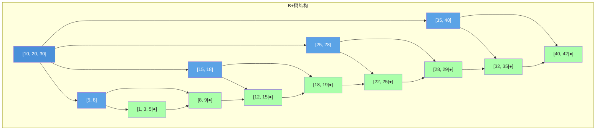
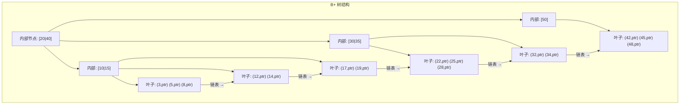

# O B树 B-Tree / B+ Tree

建议先阅读: [[J_树_Tree_BST_AVL|J 树 BST AVL]]

---

## 原理

B 树是为磁盘存储优化的自平衡多路搜索树。与二叉树不同，B 树的每个节点可以有多个子节点和多个键值，使得树更"扁平"，大幅减少磁盘 IO 次数。

### 设计动机

磁盘访问比内存慢约 10^5 倍，以页为单位（通常 4KB）读写。二叉搜索树高度为 log2(n)，100 万数据需要约 20 次 IO；而 B 树一个节点可存数百个键，同样数据量只需 2-3 次 IO。

```mermaid
graph TD
    subgraph 3阶B树示例（t=2）
        R["[10, 20]"] --> C1["[3, 5, 7]"]
        R --> C2["[15, 18]"]
        R --> C3["[25, 30, 35]"]
        C1 --> L1["[1, 2]"]
        C1 --> L2["[4]"]
        C1 --> L3["[6]"]
        C1 --> L4["[8, 9]"]
        C2 --> L5["[13, 14]"]
        C2 --> L6["[16, 17]"]
        C2 --> L7["[19]"]
        C3 --> L8["[22, 24]"]
        C3 --> L9["[27, 28]"]
        C3 --> L10["[32, 33]"]
        C3 --> L11["[37, 40]"]
    end
    style R fill:#4a90d9,color:#fff
    style C1 fill:#5ba3e6,color:#fff
    style C2 fill:#5ba3e6,color:#fff
    style C3 fill:#5ba3e6,color:#fff
```

### B 树的定义（m 阶）

1. 每个节点最多 m 个子节点
2. 非根非叶节点至少有 ceil(m/2) 个子节点
3. 根至少 2 个子节点（除非是叶子）
4. 有 k 个子节点的节点包含 k-1 个键
5. 所有叶子在同一层

### B 树的高度分析

设 B 树阶数为 m（每个节点最多 m 个子节点），最小度数 t = ceil(m/2)，n 为键总数：

**最小高度**（所有节点满）：

- 第 1 层：1 个节点，最多 $m - 1$ 个键
- 第 2 层：$m$ 个节点，最多 $m(m - 1)$ 个键
- 第 $h$ 层：$m^{h-1}$ 个节点，最多 $m^{h-1}(m - 1)$ 个键

整理得到：

$$
n \leq (m - 1)(1 + m + m^2 + \cdots + m^{h-1}) = m^h - 1
$$

$$
h \geq \log_m(n + 1)
$$

**最大高度**（所有节点半满）：

- 根至少 1 个键，其余节点至少 $t - 1$ 个键
- 总键数下界：$n \geq 1 + (t - 1)(2t^0 + 2t^1 + \cdots + 2t^{h-2})$

整理得到：

$$
h \leq 1 + \log_t\left(\frac{n + 1}{2}\right)
$$

**实例**：当 $m = 1000$，$n = 10^6$ 时：

$$
h \geq \log_{1000}(10^6 + 1) \approx 2
$$

即 B 树高度最多 2-3 层
- 二叉树高度：h ≤ log_2(10^6) ≈ 20 层
- B 树 IO 次数 ≈ 树高，即节省约 10 倍磁盘 IO

### B 树 vs B+ 树

| 特性 | B 树 | B+ 树 |
|------|------|-------|
| 数据存储 | 所有节点存数据 | 仅叶子存数据，内部只存键 |
| 叶子链接 | 无 | 叶子用链表相连 |
| 范围查询 | 需中序遍历 | O(log n + k)，k 为结果数 |
| 内部节点容量 | 较小 | 更大（树更矮） |
| 典型应用 | 文件系统（HFS+） | 数据库索引（MySQL InnoDB） |



(Note: B+树中只有叶子节点存实际数据，内部节点只存键用于路由。叶子通过 next 指针相连，支持高效范围查询。)

---

## 实现

### B 树插入

```c
#include <stdlib.h>

#define BT_MIN_DEGREE 2   // 最小度数 t，节点键数在 [t-1, 2t-1]

typedef struct BTNode {
    int* keys;
    struct BTNode** children;
    int num_keys;
    int is_leaf;
} BTNode;

typedef struct {
    BTNode* root;
    int t;   // 最小度数
} BTree;

BTNode* bt_create_node(int t, int is_leaf) {
    BTNode* node = malloc(sizeof(BTNode));
    node->keys = malloc((2 * t - 1) * sizeof(int));
    node->children = malloc(2 * t * sizeof(BTNode*));
    node->num_keys = 0;
    node->is_leaf = is_leaf;
    return node;
}

void bt_init(BTree* tree, int degree) {
    tree->t = degree;
    tree->root = NULL;
}

// 分裂满子节点 child = parent->children[idx]
static void bt_split_child(BTree* tree, BTNode* parent, int idx) {
    int t = tree->t;
    BTNode* child = parent->children[idx];
    BTNode* new_node = bt_create_node(t, child->is_leaf);
    new_node->num_keys = t - 1;

    // 后半部分键移入新节点
    for (int i = 0; i < t - 1; i++)
        new_node->keys[i] = child->keys[i + t];
    // 非叶子则移动子节点
    if (!child->is_leaf)
        for (int i = 0; i < t; i++)
            new_node->children[i] = child->children[i + t];
    child->num_keys = t - 1;

    // 中间键提升到父节点
    for (int i = parent->num_keys; i > idx; i--)
        parent->children[i + 1] = parent->children[i];
    parent->children[idx + 1] = new_node;
    for (int i = parent->num_keys - 1; i >= idx; i--)
        parent->keys[i + 1] = parent->keys[i];
    parent->keys[idx] = child->keys[t - 1];
    parent->num_keys++;
}

// 插入到非满节点
static void bt_insert_non_full(BTree* tree, BTNode* node, int key) {
    int i = node->num_keys - 1;
    if (node->is_leaf) {
        while (i >= 0 && key < node->keys[i]) {
            node->keys[i + 1] = node->keys[i];
            i--;
        }
        node->keys[i + 1] = key;
        node->num_keys++;
    } else {
        while (i >= 0 && key < node->keys[i]) i--;
        i++;
        if (node->children[i]->num_keys == 2 * tree->t - 1) {
            bt_split_child(tree, node, i);
            if (key > node->keys[i]) i++;
        }
        bt_insert_non_full(tree, node->children[i], key);
    }
}

void bt_insert(BTree* tree, int key) {
    int t = tree->t;
    if (!tree->root) {
        tree->root = bt_create_node(t, 1);
        tree->root->keys[0] = key;
        tree->root->num_keys = 1;
        return;
    }
    if (tree->root->num_keys == 2 * t - 1) {
        BTNode* new_root = bt_create_node(t, 0);
        new_root->children[0] = tree->root;
        bt_split_child(tree, new_root, 0);
        tree->root = new_root;
    }
    bt_insert_non_full(tree, tree->root, key);
}

static int bt_search_node(BTNode* node, int key) {
    int i = 0;
    while (i < node->num_keys && key > node->keys[i]) i++;
    if (i < node->num_keys && node->keys[i] == key) return 1;
    if (node->is_leaf) return 0;
    return bt_search_node(node->children[i], key);
}

int bt_search(BTree* tree, int key) {
    return tree->root ? bt_search_node(tree->root, key) : 0;
}

static void bt_destroy_rec(BTNode* node, int is_leaf) {
    if (!node) return;
    if (!is_leaf)
        for (int i = 0; i <= node->num_keys; i++)
            bt_destroy_rec(node->children[i], 0);
    free(node->keys);
    free(node->children);
    free(node);
}

void bt_destroy(BTree* tree) {
    if (tree->root) bt_destroy_rec(tree->root, tree->root->is_leaf);
    tree->root = NULL;
}
```

### 节点分裂可视化

以 3 阶 B 树（t=2, 每个节点最多 4 个键）为例，在 [3, 5, 7, 9] 中插入 6：

```mermaid
graph TD
    subgraph 插入前：[3,5,7,9] 已满
        N1["[3, 5, 7, 9]"]
        style N1 fill:#faa,color:#333
    end
    subgraph 步骤1：创建右兄弟
        N2["[3, 5]"] --- MID["↑6↑"] --- N3["[7, 9]"]
        style N2 fill:#afa,color:#333
        style N3 fill:#afa,color:#333
        style MID fill:#ffa,color:#333
    end
    subgraph 步骤2：中间键6提升到父节点
        PARENT["父节点接收6"] --> LEFT["[3, 5]"]
        PARENT --> RIGHT["[7, 9]"]
        style PARENT fill:#4a90d9,color:#fff
        style LEFT fill:#afa,color:#333
        style RIGHT fill:#afa,color:#333
    end
    N1 -->|"分裂规则：\n⌈(m-1)/2⌉ = 2个键留左\n⌊(m-1)/2⌋ = 2个键移右\n中间键上提"| N2
    N2 -.->|"6 插入到右半区"| N3
    N3 -.->|"若父节点也满\n递归分裂"| PARENT
```

### B+ 树（简化版，叶子链表 + 仅处理叶子分裂）

```c
typedef struct BPNode {
    int* keys;
    struct BPNode** children;   // 仅内部节点使用
    struct BPNode* next;        // 叶子链表
    int num_keys;
    int is_leaf;
} BPNode;

typedef struct {
    BPNode* root;
    int order;   // 阶数，每个节点最多 order 个键
} BPlusTree;

BPNode* bp_create_node(int order, int is_leaf) {
    BPNode* node = malloc(sizeof(BPNode));
    node->keys = malloc(order * sizeof(int));
    node->children = is_leaf ? NULL : malloc((order + 1) * sizeof(BPNode*));
    node->next = NULL;
    node->num_keys = 0;
    node->is_leaf = is_leaf;
    return node;
}

void bp_init(BPlusTree* tree, int order) {
    tree->order = order;
    tree->root = NULL;
}

static BPNode* bp_find_leaf(BPlusTree* tree, int key) {
    BPNode* cur = tree->root;
    while (cur && !cur->is_leaf) {
        int i = 0;
        while (i < cur->num_keys && key >= cur->keys[i]) i++;
        cur = cur->children[i];
    }
    return cur;
}

void bp_insert(BPlusTree* tree, int key) {
    int order = tree->order;
    if (!tree->root) {
        tree->root = bp_create_node(order, 1);
        tree->root->keys[0] = key;
        tree->root->num_keys = 1;
        return;
    }
    BPNode* leaf = bp_find_leaf(tree, key);
    int pos = 0;
    while (pos < leaf->num_keys && leaf->keys[pos] < key) pos++;
    for (int i = leaf->num_keys; i > pos; i--)
        leaf->keys[i] = leaf->keys[i - 1];
    leaf->keys[pos] = key;
    leaf->num_keys++;

    // 叶子溢出，分裂（简化：仅处理叶子分裂）
    if (leaf->num_keys >= order) {
        BPNode* new_leaf = bp_create_node(order, 1);
        int mid = leaf->num_keys / 2;
        new_leaf->num_keys = leaf->num_keys - mid;
        for (int i = 0; i < new_leaf->num_keys; i++)
            new_leaf->keys[i] = leaf->keys[mid + i];
        leaf->num_keys = mid;
        new_leaf->next = leaf->next;
        leaf->next = new_leaf;
        // 如果 leaf 是根则创建新根
        if (leaf == tree->root) {
            BPNode* new_root = bp_create_node(order, 0);
            new_root->keys[0] = new_leaf->keys[0];
            new_root->children[0] = leaf;
            new_root->children[1] = new_leaf;
            new_root->num_keys = 1;
            tree->root = new_root;
        }
    }
}

int bp_search(BPlusTree* tree, int key) {
    if (!tree->root) return 0;
    BPNode* leaf = bp_find_leaf(tree, key);
    for (int i = 0; i < leaf->num_keys; i++)
        if (leaf->keys[i] == key) return 1;
    return 0;
}
```

---

## B+ 树：数据库的选择

B+ 树是 B 树在数据库领域的实际变体——所有键都存储在叶子节点中，内部节点仅作为搜索引导（内部节点存键的副本，叶子节点存键和数据指针）。

### B 树 vs B+ 树

| | B 树 | B+ 树 |
|------|------|------|
| 键存储 | 内部节点和叶子节点都存键和数据 | 只有叶子节点存键和数据，内部节点只存引导键 |
| 范围查询 | 需中序遍历（可能回溯） | 叶子节点链式连接——$O(\log n + k)$ 完美 |
| 查找稳定性 | 可能在内部节点命中（快但路径不同） | 所有查找都走到叶子——路径长度一致 |
| 空间利用率 | 稍高（内部节点也存数据） | 稍低（内部节点存键的冗余副本） |



### MySQL InnoDB 内部的 B+ 树

InnoDB 的聚簇索引（clustered index）以主键为索引构建 B+ 树，叶子节点直接存储完整的数据行（而非数据指针）。这意味：
- **主键查找**：一次 B+ 树搜索从根到叶，即得到完整数据行
- **二级索引**：构建在非主键列上的索引，叶子节点存储对应的主键值。查询时先在二级索引中找到主键，再回主键索引（聚簇索引）查完整数据行——"回表"
- **页大小**：InnoDB 默认页 = 16KB。B+ 树的每个节点恰好是一页。这并非巧合——节点大小被设计为与磁盘的原子读取/写入单元匹配

$$ \text{节点最大键数} \approx \frac{16\text{KB}}{\text{键大小} + \text{指针大小}} $$

对于 8 字节的 `BIGINT` 键和 8 字节的指针，每个节点可容纳约 1024 个键。3 层 B+ 树可索引 $1024^3 \approx 10$ 亿条记录。

---

## 应用场景

- **数据库索引**: MySQL InnoDB 使用 B+ 树作为主键索引和二级索引
- **文件系统**: NTFS、HFS+ 等使用 B 树/B+ 树管理文件元数据
- **键值存储**: LevelDB 用 B+ 树/SSTable 管理持久化数据

---

## 练习

| 题号 | 题目 | 说明 |
|------|------|------|
| [220](https://leetcode.cn/problems/contains-duplicate-iii/) | 存在重复元素 III | 范围查询 |
| [352](https://leetcode.cn/problems/data-stream-as-disjoint-intervals/) | 将数据流变为多个不相交区间 | 有序集合 |

> 竞赛方向推荐洛谷/Codeforces。

## 动手实验

| 编号 | 题目 | 说明 |
|:----:|------|------|
| E1 | B 树分裂可视化 | 实现 B 树插入，设置 `MAX_KEYS = 4`，按序插入 1 到 30，每插入一个元素打印树的层序结构。观察节点分裂如何向上传播直到根节点分裂 |
| E2 | 磁盘 I/O 模拟 | 模拟 B 树在磁盘上的行为：设置每个节点的"读取计数"，每访问一个节点计数加 1。插入 10 万元素后对比 B 树（m=100）和 BST 的总节点读取次数 |
