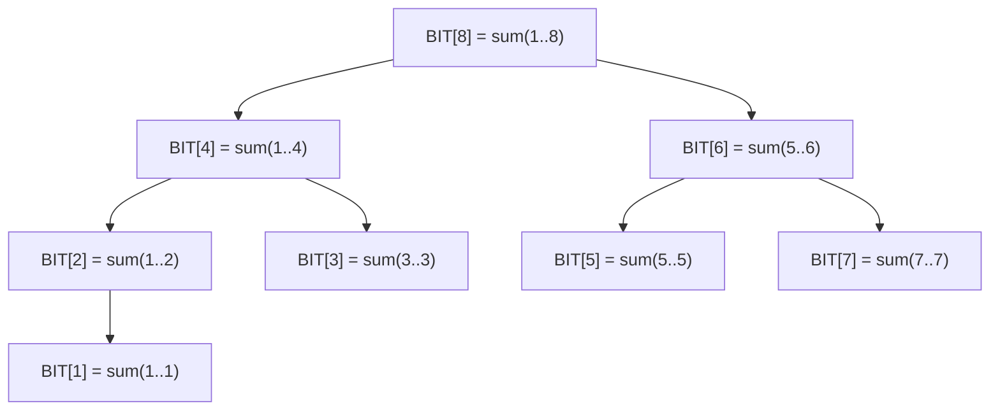

---
数据结构教程 — 树状数组 (Binary Indexed Tree)
---

##  章节概述

树状数组（Binary Indexed Tree，简称BIT），又称Fenwick Tree，是一种用于高效
处理前缀和查询和单点修改的数据结构。它利用二进制的性质将数组划分为若干区间，
使得单点修改和前缀和查询都能在O(log n)时间内完成。

树状数组相比线段树代码更简洁、常数更小，在只需要前缀和类操作的场景中是首选方案。
本章将从树状数组的二进制原理讲起，深入lowbit运算的本质，
全面覆盖各种应用场景，最后通过实例和习题巩固所学知识。

>  **底层实现参考**：如果需要深入理解本章数据结构的底层实现（纯C手写、内存布局、指针操作），请参阅 [[../../C语言深化教程/3数据结构/09_高级数据结构|C语言教程: 高级数据结构]]。C教程侧重手动实现与内存本质，本教程侧重STL使用与算法优化，两者互补。

---
###  第一节: 基础语法 + 计算机底层原理
---

1.1 树状数组的基本概念
-----------------------

树状数组的核心思想：利用二进制下标的性质，将数组中的元素按"区间"组织。
每个位置i管理一段区间的信息，区间长度为lowbit(i)。

lowbit(x) = x & (-x)，即x的二进制表示中最低位的1所对应的值。

例如：
- lowbit(6) = lowbit(110₂) = 2 (10₂)
- lowbit(12) = lowbit(1100₂) = 4 (100₂)
- lowbit(8) = lowbit(1000₂) = 8 (1000₂)

时间复杂度：
- 单点修改：O(log n)
- 前缀和查询：O(log n)
- 区间和查询：O(log n)
- 建树：O(n)

空间复杂度：O(n)

1.2 树状数组的结构示意

BIT[i] 管理的区间为 [i - lowbit(i) + 1, i]：

| 位置 i | lowbit(i) | 管理区间 | 含义 |
|--------|-----------|----------|------|
| 1 | 1 | [1, 1] | BIT[1]管理 arr[1] |
| 2 | 2 | [1, 2] | BIT[2]管理 arr[1]+arr[2] |
| 3 | 1 | [3, 3] | BIT[3]管理 arr[3] |
| 4 | 4 | [1, 4] | BIT[4]管理 arr[1..4] |
| 5 | 1 | [5, 5] | BIT[5]管理 arr[5] |
| 6 | 2 | [5, 6] | BIT[6]管理 arr[5]+arr[6] |
| 7 | 1 | [7, 7] | BIT[7]管理 arr[7] |
| 8 | 8 | [1, 8] | BIT[8]管理 arr[1..8] |



**查询前缀和 prefix(7)** = BIT[7] + BIT[6] + BIT[4]
= sum(7) + sum(5,6) + sum(1,4) = sum(1..7)。
路径: 7(111) → 去掉 lowbit → 6(110) → 4(100) → 0，共 3 步。

**单点更新 add(5, v)**：5(101)+lowbit → 6, 6+lowbit → 8。
更新 BIT[5], BIT[6], BIT[8]，共 3 个节点，O(log n)。

1.3 标准实现

```pseudocode
CLASS BIT:
    tree    // 数组（长度 n+1），存储树状数组节点值
    n       // 数组长度

    FUNCTION lowbit(x):
        RETURN x & (-x)
    END FUNCTION

    CONSTRUCTOR(size):
        n = size
        tree = ARRAY of size n + 1, filled with 0
    END CONSTRUCTOR

    CONSTRUCTOR(arr):
        n = LENGTH(arr)
        tree = ARRAY of size n + 1, filled with 0
        FOR i FROM 0 TO n - 1:
            update(i + 1, arr[i])
        END FOR
    END CONSTRUCTOR

    FUNCTION update(pos, delta):
        WHILE pos <= n:
            tree[pos] = tree[pos] + delta
            pos = pos + lowbit(pos)
        END WHILE
    END FUNCTION

    FUNCTION prefixSum(pos):
        sum = 0
        WHILE pos > 0:
            sum = sum + tree[pos]
            pos = pos - lowbit(pos)
        END WHILE
        RETURN sum
    END FUNCTION

    FUNCTION rangeSum(l, r):
        RETURN prefixSum(r) - prefixSum(l - 1)
    END FUNCTION
END CLASS

// 使用示例:
arr = [1, 3, 5, 7, 9, 11]
bit = BIT(arr)
DISPLAY bit.prefixSum(4)    // 前缀和[1,4]
DISPLAY bit.rangeSum(2, 5)  // 区间和[2,5]
bit.update(3, 5)
DISPLAY bit.rangeSum(2, 5)  // 修改后的区间和
```

---
**实现练习**: 用 C 或 C++ 自行实现上述结构。完成后与 AI 对话检查正确性。
---

1.4 O(n)建树优化

```pseudocode
CLASS BITFast:
    tree    // 数组
    n       // 长度

    FUNCTION lowbit(x):
        RETURN x & (-x)
    END FUNCTION

    CONSTRUCTOR(arr):
        n = LENGTH(arr)
        tree = ARRAY of size n + 1, filled with 0
        FOR i FROM 1 TO n:
            tree[i] = tree[i] + arr[i - 1]
            parent = i + lowbit(i)
            IF parent <= n THEN
                tree[parent] = tree[parent] + tree[i]
            END IF
        END FOR
    END CONSTRUCTOR

    FUNCTION update(pos, delta):
        WHILE pos <= n:
            tree[pos] = tree[pos] + delta
            pos = pos + lowbit(pos)
        END WHILE
    END FUNCTION

    FUNCTION prefixSum(pos):
        sum = 0
        WHILE pos > 0:
            sum = sum + tree[pos]
            pos = pos - lowbit(pos)
        END WHILE
        RETURN sum
    END FUNCTION

    FUNCTION rangeSum(l, r):
        RETURN prefixSum(r) - prefixSum(l - 1)
    END FUNCTION
END CLASS
```

---
**实现练习**: 用 C 或 C++ 自行实现上述结构。完成后与 AI 对话检查正确性。
---

---
###  第二节: 实现思路
---

2.1 区间修改 + 单点查询（差分树状数组）

```pseudocode
CLASS BITRangeUpdate:
    tree    // 差分数组的 BIT
    n       // 长度

    FUNCTION lowbit(x):
        RETURN x & (-x)
    END FUNCTION

    FUNCTION add(pos, val):
        WHILE pos <= n:
            tree[pos] = tree[pos] + val
            pos = pos + lowbit(pos)
        END WHILE
    END FUNCTION

    FUNCTION query(pos):
        sum = 0
        WHILE pos > 0:
            sum = sum + tree[pos]
            pos = pos - lowbit(pos)
        END WHILE
        RETURN sum
    END FUNCTION

    CONSTRUCTOR(size):
        n = size
        tree = ARRAY of size n + 1, filled with 0
    END CONSTRUCTOR

    FUNCTION rangeAdd(l, r, val):
        add(l, val)
        add(r + 1, -val)    // 差分: diff[l] += val, diff[r+1] -= val
    END FUNCTION

    FUNCTION pointQuery(pos):
        RETURN query(pos)    // 单点查询 = 差分前缀和
    END FUNCTION
END CLASS
```

---
**实现练习**: 用 C 或 C++ 自行实现上述结构。完成后与 AI 对话检查正确性。
---

2.2 区间修改 + 区间查询

```pseudocode
CLASS BITRangeAll:
    tree1, tree2    // 两个 BIT 数组，分别维护 diff[i] 和 i * diff[i]
    n               // 长度

    FUNCTION lowbit(x):
        RETURN x & (-x)
    END FUNCTION

    FUNCTION add(t, pos, val):    // t 是 tree1 或 tree2 的引用
        WHILE pos <= n:
            t[pos] = t[pos] + val
            pos = pos + lowbit(pos)
        END WHILE
    END FUNCTION

    FUNCTION sum(t, pos):
        s = 0
        WHILE pos > 0:
            s = s + t[pos]
            pos = pos - lowbit(pos)
        END WHILE
        RETURN s
    END FUNCTION

    CONSTRUCTOR(size):
        n = size
        tree1 = ARRAY of size n + 1, filled with 0
        tree2 = ARRAY of size n + 1, filled with 0
    END CONSTRUCTOR

    CONSTRUCTOR(arr):
        n = LENGTH(arr)
        tree1 = ARRAY of size n + 1, filled with 0
        tree2 = ARRAY of size n + 1, filled with 0
        FOR i FROM 1 TO n:
            rangeAdd(i, i, arr[i - 1])
        END FOR
    END CONSTRUCTOR

    FUNCTION rangeAdd(l, r, val):
        add(tree1, l, val)
        add(tree1, r + 1, -val)
        add(tree2, l, val * (l - 1))
        add(tree2, r + 1, -val * r)
    END FUNCTION

    FUNCTION prefixSum(pos):
        // 前缀和 = sum(tree1,pos) * pos - sum(tree2,pos)
        RETURN sum(tree1, pos) * pos - sum(tree2, pos)
    END FUNCTION

    FUNCTION rangeSum(l, r):
        RETURN prefixSum(r) - prefixSum(l - 1)
    END FUNCTION
END CLASS
```

---
**实现练习**: 用 C 或 C++ 自行实现上述结构。完成后与 AI 对话检查正确性。
---

2.3 二维树状数组

```pseudocode
CLASS BIT2D:
    tree      // 二维数组，matrix[r+1][c+1]
    rows, cols

    FUNCTION lowbit(x):
        RETURN x & (-x)
    END FUNCTION

    CONSTRUCTOR(r, c):
        rows = r; cols = c
        tree = 2D ARRAY of size (r + 1) × (c + 1), filled with 0
    END CONSTRUCTOR

    FUNCTION update(x, y, val):
        FOR i FROM x TO rows STEP lowbit(i):
            FOR j FROM y TO cols STEP lowbit(j):
                tree[i][j] = tree[i][j] + val
            END FOR
        END FOR
    END FUNCTION

    FUNCTION query(x, y):    // 前缀矩阵和 [1..x][1..y]
        sum = 0
        FOR i FROM x DOWNTO 1 STEP lowbit(i):
            FOR j FROM y DOWNTO 1 STEP lowbit(j):
                sum = sum + tree[i][j]
            END FOR
        END FOR
        RETURN sum
    END FUNCTION

    FUNCTION rangeQuery(x1, y1, x2, y2):
        // 容斥原理:
        RETURN query(x2, y2) - query(x1 - 1, y2) - query(x2, y1 - 1) + query(x1 - 1, y1 - 1)
    END FUNCTION
END CLASS
```

---
**实现练习**: 用 C 或 C++ 自行实现上述结构。完成后与 AI 对话检查正确性。
---

2.4 树状数组求第k小（权值树状数组）

```pseudocode
CLASS BITKth:
    tree    // 数组
    n       // 值域大小

    FUNCTION lowbit(x):
        RETURN x & (-x)
    END FUNCTION

    CONSTRUCTOR(maxVal):
        n = maxVal
        tree = ARRAY of size maxVal + 1, filled with 0
    END CONSTRUCTOR

    FUNCTION add(val, delta=1):
        FOR i FROM val TO n STEP lowbit(i):
            tree[i] = tree[i] + delta
        END FOR
    END FUNCTION

    FUNCTION kth(k):    // 查找第 k 小的值（倍增法）
        pos = 0
        FOR i FROM FLOOR_LOG2(n) DOWNTO 0:
            next = pos + (1 << i)
            IF next <= n AND tree[next] < k THEN
                k = k - tree[next]
                pos = next
            END IF
        END FOR
        RETURN pos + 1
    END FUNCTION

    FUNCTION countLess(val):
        sum = 0
        FOR i FROM val - 1 DOWNTO 1 STEP lowbit(i):
            sum = sum + tree[i]
        END FOR
        RETURN sum
    END FUNCTION
END CLASS
```

---
**实现练习**: 用 C 或 C++ 自行实现上述结构。完成后与 AI 对话检查正确性。
---

2.5 树状数组求逆序对

```pseudocode
CLASS InversionBIT:
    tree    // BIT 数组
    n       // 值域大小

    FUNCTION lowbit(x):
        RETURN x & (-x)
    END FUNCTION

    FUNCTION update(pos):
        WHILE pos <= n:
            tree[pos] = tree[pos] + 1
            pos = pos + lowbit(pos)
        END WHILE
    END FUNCTION

    FUNCTION query(pos):
        sum = 0
        WHILE pos > 0:
            sum = sum + tree[pos]
            pos = pos - lowbit(pos)
        END WHILE
        RETURN sum
    END FUNCTION

    FUNCTION count(arr):
        sorted = SORT(UNIQUE(arr))
        n = LENGTH(sorted)
        tree = ARRAY of size n + 1, filled with 0
        inversions = 0
        FOR i FROM LENGTH(arr) - 1 DOWNTO 0:
            rank = LOWER_BOUND(sorted, arr[i]) + 1
            inversions = inversions + query(rank - 1)
            update(rank)
        END FOR
        RETURN inversions
    END FUNCTION
END CLASS
```

---
**实现练习**: 用 C 或 C++ 自行实现上述结构。完成后与 AI 对话检查正确性。
---

---
###  第三节: 应用场景
---

3.1 案例一：动态排名系统

```pseudocode
CLASS DynamicRanking:
    tree       // BIT 数组（权值 BIT）
    maxScore   // 分数上限

    FUNCTION lowbit(x):
        RETURN x & (-x)
    END FUNCTION

    FUNCTION add(pos, val):
        WHILE pos <= maxScore:
            tree[pos] = tree[pos] + val
            pos = pos + lowbit(pos)
        END WHILE
    END FUNCTION

    FUNCTION sum(pos):
        s = 0
        WHILE pos > 0:
            s = s + tree[pos]
            pos = pos - lowbit(pos)
        END WHILE
        RETURN s
    END FUNCTION

    CONSTRUCTOR(maxS):
        maxScore = maxS
        tree = ARRAY of size maxS + 1, filled with 0
    END CONSTRUCTOR

    FUNCTION addScore(score):
        add(score, 1)
    END FUNCTION

    FUNCTION removeScore(score):
        add(score, -1)
    END FUNCTION

    FUNCTION updateScore(oldScore, newScore):
        removeScore(oldScore)
        addScore(newScore)
    END FUNCTION

    FUNCTION getRank(score):
        RETURN sum(maxScore) - sum(score) + 1
    END FUNCTION

    FUNCTION getPercentile(score):
        total = sum(maxScore)
        IF total == 0 THEN RETURN 0
        below = sum(score - 1)
        RETURN below * 100 / total
    END FUNCTION
END CLASS
```

---
**实现练习**: 用 C 或 C++ 自行实现上述结构。完成后与 AI 对话检查正确性。
---

3.2 案例二：区间频次统计

```pseudocode
CLASS FrequencyCounter:
    bit       // 26 个 BIT（对每个字母 a-z 各一个）
    n         // 字符串长度
    alphaSize = 26

    FUNCTION lowbit(x):
        RETURN x & (-x)
    END FUNCTION

    FUNCTION update(charIdx, pos, val):
        WHILE pos <= n:
            bit[charIdx][pos] = bit[charIdx][pos] + val
            pos = pos + lowbit(pos)
        END WHILE
    END FUNCTION

    FUNCTION query(charIdx, pos):
        sum = 0
        WHILE pos > 0:
            sum = sum + bit[charIdx][pos]
            pos = pos - lowbit(pos)
        END WHILE
        RETURN sum
    END FUNCTION

    CONSTRUCTOR(s):
        n = LENGTH(s)
        bit = ARRAY of size alphaSize × (n + 1), filled with 0
        FOR i FROM 0 TO n - 1:
            idx = s[i] - 'a'
            update(idx, i + 1, 1)
        END FOR
    END CONSTRUCTOR

    FUNCTION countChar(c, l, r):
        idx = c - 'a'
        RETURN query(idx, r) - query(idx, l - 1)
    END FUNCTION

    FUNCTION changeChar(pos, oldC, newC):
        update(oldC - 'a', pos, -1)
        update(newC - 'a', pos, 1)
    END FUNCTION
END CLASS
```

---
**实现练习**: 用 C 或 C++ 自行实现上述结构。完成后与 AI 对话检查正确性。
---

3.3 案例三：星空问题（二维偏序统计）

```pseudocode
STRUCT Star:
    x, y
    level = 0
END STRUCT

CLASS StarLevel:
    tree    // BIT
    n       // 坐标上限

    FUNCTION lowbit(x):
        RETURN x & (-x)
    END FUNCTION

    FUNCTION update(pos):
        WHILE pos <= n:
            tree[pos] = tree[pos] + 1
            pos = pos + lowbit(pos)
        END WHILE
    END FUNCTION

    FUNCTION query(pos):
        sum = 0
        WHILE pos > 0:
            sum = sum + tree[pos]
            pos = pos - lowbit(pos)
        END WHILE
        RETURN sum
    END FUNCTION

    FUNCTION solve(stars):
        n = 32001
        tree = ARRAY of size n + 1, filled with 0
        SORT stars BY y ASC, then x ASC     // 按 y 升序，y 相同按 x 升序
        levels = ARRAY of size LENGTH(stars), filled with 0
        FOR i FROM 0 TO LENGTH(stars) - 1:
            levels[i] = query(stars[i].x + 1)
            update(stars[i].x + 1)
        END FOR
        count = ARRAY of size LENGTH(stars), filled with 0
        FOR EACH lv IN levels:
            count[lv] = count[lv] + 1
        END FOR
        RETURN count
    END FUNCTION
END CLASS
```

---
**实现练习**: 用 C 或 C++ 自行实现上述结构。完成后与 AI 对话检查正确性。
---

---
###  第四节: 课后习题
---

1. 基础题：实现支持单点修改和区间和查询的树状数组。

2. 应用题：使用树状数组实现区间修改+区间查询（两个树状数组维护差分）。

3. 进阶题：实现二维树状数组，支持单点修改和矩形区域求和。

4. 洛谷练习：
   - [P3374 树状数组1](https://www.luogu.com.cn/problem/P3374)（单点修改+区间查询）
   - [P3368 树状数组2](https://www.luogu.com.cn/problem/P3368)（区间修改+单点查询）

---


***
##  知识网络
***

- **上一章**: [[L_线段树_SegmentTree]] | **下一章**: [[N_跳表_SkipList]] | **返回**: [[DSA学习路线]] (Phase 5 选修)
- **算法技巧**: [[../算法技巧/优化]] | [[../算法技巧/前缀和]]
- **相关**: [[数据结构/L_线段树_SegmentTree]] | [[算法技巧/前缀和]] | [[逆序对]]

---
## 章节测试
---

### 判断题

> [!question] 判断题 1
> 树状数组的lowbit(x)等于x的二进制表示中最低位1所代表的值。（ ）
> - [ ]  正确
> - [ ]  错误
>
> > [!success]- 点击查看答案
> > 答案: 正确
> > 
> > **解析**: lowbit(x) = x & (-x)，利用补码性质提取最低位的1，例如lowbit(6)=lowbit(110₂)=2(10₂)。

> [!question] 判断题 2
> 树状数组可以在O(log n)时间内查询任意区间[l,r]的和。（ ）
> - [ ]  正确
> - [ ]  错误
>
> > [!success]- 点击查看答案
> > 答案: 正确
> > 
> > **解析**: rangeSum(l,r) = prefixSum(r) - prefixSum(l-1)，两次O(log n)的前缀和查询即可。

> [!question] 判断题 3
> 树状数组能够直接支持区间最大值查询。（ ）
> - [ ]  正确
> - [ ]  错误
>
> > [!success]- 点击查看答案
> > 答案: 错误
> > 
> > **解析**: 标准树状数组基于前缀和思想，只能处理满足"可减性"的操作（如加法）。最大值不可减（max(a,b)无法通过减法还原），需要线段树来处理。

> [!question] 判断题 4
> 树状数组的下标必须从1开始。（ ）
> - [ ]  正确
> - [ ]  错误
>
> > [!success]- 点击查看答案
> > 答案: 正确
> > 
> > **解析**: 因为lowbit(0) = 0会导致死循环，所以树状数组下标从1开始。如果原数组从0开始，需要偏移+1。

> [!question] 判断题 5
> 树状数组的建树可以优化到O(n)时间。（ ）
> - [ ]  正确
> - [ ]  错误
>
> > [!success]- 点击查看答案
> > 答案: 正确
> > 
> > **解析**: 通过自底向上的方式，每个位置只向其直接父节点(i + lowbit(i))传递值，总共n次操作，时间O(n)。

> [!question] 判断题 6
> 二维树状数组的单次操作时间复杂度为O(log²n)。（ ）
> - [ ]  正确
> - [ ]  错误
>
> > [!success]- 点击查看答案
> > 答案: 正确
> > 
> > **解析**: 二维树状数组在两个维度上分别执行树状数组操作，每个维度O(log n)，总计O(log n × log m) ≈ O(log²n)。

> [!question] 判断题 7
> 树状数组可以通过差分技巧实现区间修改+单点查询。（ ）
> - [ ]  正确
> - [ ]  错误
>
> > [!success]- 点击查看答案
> > 答案: 正确
> > 
> > **解析**: 在差分数组上建树状数组，区间[l,r]加val等价于diff[l]+=val和diff[r+1]-=val，单点查询等价于求前缀和。

> [!question] 判断题 8
> 树状数组的功能是线段树的严格子集。（ ）
> - [ ]  正确
> - [ ]  错误
>
> > [!success]- 点击查看答案
> > 答案: 正确
> > 
> > **解析**: 线段树可以做到树状数组的所有功能且更多（如区间最值、区间赋值等），但树状数组代码更短、常数更小。

> [!question] 判断题 9
> 权值树状数组可以在O(log n)时间内查询第k小元素。（ ）
> - [ ]  正确
> - [ ]  错误
>
> > [!success]- 点击查看答案
> > 答案: 正确
> > 
> > **解析**: 通过倍增法在权值树状数组上二分，可以在O(log n)时间找到第k小元素。

> [!question] 判断题 10
> 树状数组的update操作是从低位向高位传播（pos += lowbit(pos)）。（ ）
> - [ ]  正确
> - [ ]  错误
>
> > [!success]- 点击查看答案
> > 答案: 正确
> > 
> > **解析**: update时从当前位置出发，每次加上lowbit(pos)到达管理更大区间的祖先节点，直到超出范围。

### 选择题

> [!question] 选择题 1
> lowbit(12)的值是多少？
> - [ ] A. 1
> - [ ] B. 2
> - [ ] C. 4
> - [ ] D. 8
>
> > [!success]- 点击查看答案
> > 正确答案: C
> > 
> > **解析**: 12 = 1100₂，最低位的1在第3位（从0开始），lowbit(12) = 100₂ = 4。

> [!question] 选择题 2
> 树状数组BIT[6]管理的区间是？（假设数组从1开始）
> - [ ] A. [1, 6]
> - [ ] B. [5, 6]
> - [ ] C. [4, 6]
> - [ ] D. [6, 6]
>
> > [!success]- 点击查看答案
> > 正确答案: B
> > 
> > **解析**: BIT[i]管理区间[i-lowbit(i)+1, i]。lowbit(6)=2，所以BIT[6]管理[6-2+1, 6]=[5, 6]。

> [!question] 选择题 3
> 对长度为n=8的数组，执行一次prefixSum(7)需要累加多少个BIT节点的值？
> - [ ] A. 1
> - [ ] B. 2
> - [ ] C. 3
> - [ ] D. 7
>
> > [!success]- 点击查看答案
> > 正确答案: C
> > 
> > **解析**: 7=111₂，每次减去lowbit：7→6→4→0。访问BIT[7]、BIT[6]、BIT[4]，共3次。（二进制中1的个数）

> [!question] 选择题 4
> 树状数组相比线段树的主要优势是？
> - [ ] A. 功能更强大
> - [ ] B. 代码更短、常数更小
> - [ ] C. 支持更多种类的查询
> - [ ] D. 空间复杂度更低
>
> > [!success]- 点击查看答案
> > 正确答案: B
> > 
> > **解析**: 树状数组代码通常只需要几行，且没有线段树的递归开销和2×或4×的空间开销，常数因子小。

> [!question] 选择题 5
> 要实现"区间修改+区间查询"的树状数组，需要维护几个树状数组？
> - [ ] A. 1个
> - [ ] B. 2个
> - [ ] C. 3个
> - [ ] D. 4个
>
> > [!success]- 点击查看答案
> > 正确答案: B
> > 
> > **解析**: 需要两个树状数组，分别维护差分数组d[i]和i×d[i]，通过公式前缀和 = sum(d)×i - sum(i×d) 推导区间和。

> [!question] 选择题 6
> 以下哪个操作无法用标准树状数组高效实现？
> - [ ] A. 前缀和查询
> - [ ] B. 单点修改
> - [ ] C. 区间最大值查询
> - [ ] D. 逆序对计数
>
> > [!success]- 点击查看答案
> > 正确答案: C
> > 
> > **解析**: 最大值不满足可减性（无法通过prefix_max(r) - prefix_max(l-1)得到区间最大值），标准树状数组无法高效处理。

> [!question] 选择题 7
> 在树状数组的update操作中，位置pos=5（101₂）的下一个更新位置是？
> - [ ] A. 6
> - [ ] B. 7
> - [ ] C. 8
> - [ ] D. 10
>
> > [!success]- 点击查看答案
> > 正确答案: A
> > 
> > **解析**: lowbit(5) = lowbit(101₂) = 1(1₂)，下一个位置 = 5 + 1 = 6。

> [!question] 选择题 8
> 对于n=10^5的数组，单次前缀和查询最多需要累加多少个节点？
> - [ ] A. 5
> - [ ] B. 10
> - [ ] C. 17
> - [ ] D. 100000
>
> > [!success]- 点击查看答案
> > 正确答案: C
> > 
> > **解析**: 前缀和查询的累加次数等于pos的二进制中1的个数，最多为⌊log₂(10^5)⌋+1=17位（实际10^5<2^17）。

> [!question] 选择题 9
> 树状数组求逆序对的基本思路是？
> - [ ] A. 从左到右插入，查询比当前值大的已插入元素个数
> - [ ] B. 从右到左插入，查询比当前值小的已插入元素个数
> - [ ] C. 对所有元素排序后逐个查询
> - [ ] D. A和B都可以
>
> > [!success]- 点击查看答案
> > 正确答案: D
> > 
> > **解析**: 方法A：从左到右插入，每次查询已插入中比当前值大的个数。方法B：从右到左插入，每次查询已插入中比当前值小的个数。两种方法都能正确统计逆序对。

> [!question] 选择题 10
> 树状数组的空间复杂度为？
> - [ ] A. O(n)
> - [ ] B. O(2n)
> - [ ] C. O(4n)
> - [ ] D. O(n log n)
>
> > [!success]- 点击查看答案
> > 正确答案: A
> > 
> > **解析**: 树状数组只需要一个大小为n+1的数组，空间复杂度O(n)，这是它相比线段树(O(4n))的优势之一。

### 编程大题

> [!question] 编程大题 1
> **题目**: 洛谷 [P3374 树状数组1](https://www.luogu.com.cn/problem/P3374)
> 
> 给定n个数的序列，支持两种操作：1. 将第x个数加上k；2. 查询区间[x,y]的和。
>
> > [!success]- 点击查看提示
> > 标准树状数组模板题。建树后直接支持单点修改update(x, k)和区间查询rangeSum(x, y) = prefixSum(y) - prefixSum(x-1)。

> [!question] 编程大题 2
> **题目**: 洛谷 [P3368 树状数组2](https://www.luogu.com.cn/problem/P3368)
> 
> 给定n个数的序列，支持两种操作：1. 将区间[x,y]的每个数加上k；2. 查询第x个数的值。
>
> > [!success]- 点击查看提示
> > 使用差分思想：在差分数组上建树状数组。区间[x,y]加k等价于diff[x]+=k, diff[y+1]-=k。单点查询等价于求差分数组的前缀和。

> [!question] 编程大题 3
> **题目**: 给定一个n×n的矩阵，初始值为0。支持两种操作：1. 将位置(x,y)的值加上v；2. 查询子矩阵(x1,y1)到(x2,y2)的元素和。
>
> > [!success]- 点击查看提示
> > 使用二维树状数组。update在两层循环中分别对x和y维度做树状数组更新。query使用容斥原理：sum(x2,y2) - sum(x1-1,y2) - sum(x2,y1-1) + sum(x1-1,y1-1)。
