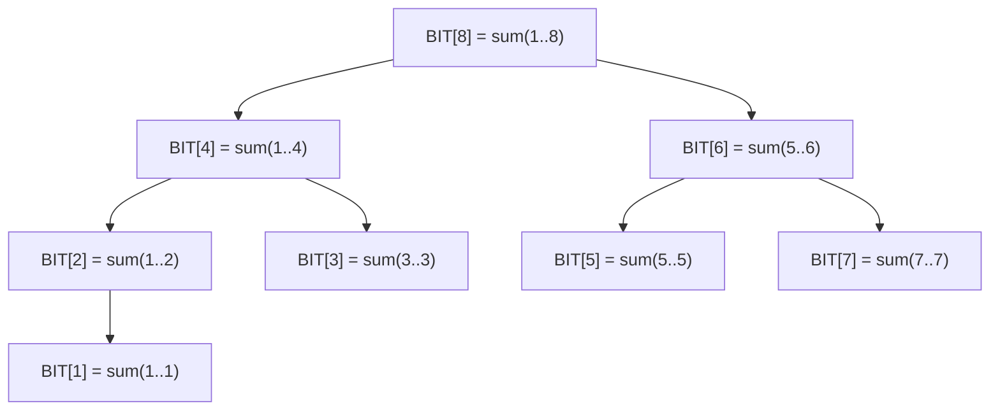

## ==========================================================================
C++ 数据结构教程 — 树状数组 (Binary Indexed Tree)
## ==========================================================================

## 📋 章节概述

树状数组（Binary Indexed Tree，简称BIT），又称Fenwick Tree，是一种用于高效
处理前缀和查询和单点修改的数据结构。它利用二进制的性质将数组划分为若干区间，
使得单点修改和前缀和查询都能在O(log n)时间内完成。

树状数组相比线段树代码更简洁、常数更小，在只需要前缀和类操作的场景中是首选方案。
本章将从树状数组的二进制原理讲起，深入lowbit运算的本质，
全面覆盖各种应用场景，最后通过实例和习题巩固所学知识。

> 📌 **底层实现参考**：如果需要深入理解本章数据结构的底层实现（纯C手写、内存布局、指针操作），请参阅 [[../../C语言深化教程/3数据结构/09_高级数据结构|C语言教程: 高级数据结构]]。C教程侧重手动实现与内存本质，本教程侧重STL使用与算法优化，两者互补。

## ==========================================================================
### 📖 第一节: 基础语法 + 计算机底层原理
## ==========================================================================

1.1 树状数组的基本概念
-----------------------

树状数组的核心思想：利用二进制下标的性质，将数组中的元素按"区间"组织。
每个位置i管理一段区间的信息，区间长度为lowbit(i)。

lowbit(x) = x & (-x)，即x的二进制表示中最低位的1所对应的值。

例如：
- lowbit(6) = lowbit(110₂) = 2 (10₂)
- lowbit(12) = lowbit(1100₂) = 4 (100₂)
- lowbit(8) = lowbit(1000₂) = 8 (1000₂)

时间复杂度：
- 单点修改：O(log n)
- 前缀和查询：O(log n)
- 区间和查询：O(log n)
- 建树：O(n)

空间复杂度：O(n)

1.2 树状数组的结构示意

BIT[i] 管理的区间为 [i - lowbit(i) + 1, i]：

| 位置 i | lowbit(i) | 管理区间 | 含义 |
|--------|-----------|----------|------|
| 1 | 1 | [1, 1] | BIT[1]管理 arr[1] |
| 2 | 2 | [1, 2] | BIT[2]管理 arr[1]+arr[2] |
| 3 | 1 | [3, 3] | BIT[3]管理 arr[3] |
| 4 | 4 | [1, 4] | BIT[4]管理 arr[1..4] |
| 5 | 1 | [5, 5] | BIT[5]管理 arr[5] |
| 6 | 2 | [5, 6] | BIT[6]管理 arr[5]+arr[6] |
| 7 | 1 | [7, 7] | BIT[7]管理 arr[7] |
| 8 | 8 | [1, 8] | BIT[8]管理 arr[1..8] |



**查询前缀和 prefix(7)** = BIT[7] + BIT[6] + BIT[4]
= sum(7) + sum(5,6) + sum(1,4) = sum(1..7)。
路径: 7(111) → 去掉 lowbit → 6(110) → 4(100) → 0，共 3 步。

**单点更新 add(5, v)**：5(101)+lowbit → 6, 6+lowbit → 8。
更新 BIT[5], BIT[6], BIT[8]，共 3 个节点，O(log n)。

1.3 标准实现

```cpp
#include <iostream>
#include <vector>

class BIT {
private:
    std::vector<long long> tree;
    int n;

    int lowbit(int x) { return x & (-x); }

public:
    BIT(int size) : n(size), tree(size + 1, 0) {}

    BIT(const std::vector<int>& arr) : n(arr.size()), tree(arr.size() + 1, 0) {
        for (int i = 0; i < n; ++i)
            update(i + 1, arr[i]);
    }

    void update(int pos, long long delta) {
        for (; pos <= n; pos += lowbit(pos))
            tree[pos] += delta;
    }

    long long prefixSum(int pos) {
        long long sum = 0;
        for (; pos > 0; pos -= lowbit(pos))
            sum += tree[pos];
        return sum;
    }

    long long rangeSum(int l, int r) {
        return prefixSum(r) - prefixSum(l - 1);
    }
};

int main() {
    std::vector<int> arr = {1, 3, 5, 7, 9, 11};
    BIT bit(arr);

    std::cout << "前缀和[1,4]: " << bit.prefixSum(4) << std::endl;
    std::cout << "区间和[2,5]: " << bit.rangeSum(2, 5) << std::endl;

    bit.update(3, 5);
    std::cout << "位置3加5后，区间和[2,5]: " << bit.rangeSum(2, 5) << std::endl;

    return 0;
}
```

1.4 O(n)建树优化

```cpp
#include <iostream>
#include <vector>

class BITFast {
private:
    std::vector<long long> tree;
    int n;
    int lowbit(int x) { return x & (-x); }

public:
    BITFast(const std::vector<int>& arr) : n(arr.size()), tree(arr.size() + 1, 0) {
        for (int i = 1; i <= n; ++i) {
            tree[i] += arr[i - 1];
            int parent = i + lowbit(i);
            if (parent <= n)
                tree[parent] += tree[i];
        }
    }

    void update(int pos, long long delta) {
        for (; pos <= n; pos += lowbit(pos))
            tree[pos] += delta;
    }

    long long prefixSum(int pos) {
        long long sum = 0;
        for (; pos > 0; pos -= lowbit(pos))
            sum += tree[pos];
        return sum;
    }

    long long rangeSum(int l, int r) {
        return prefixSum(r) - prefixSum(l - 1);
    }
};

int main() {
    std::vector<int> arr = {3, 1, 4, 1, 5, 9, 2, 6};
    BITFast bit(arr);
    std::cout << "前缀和[1,5]: " << bit.prefixSum(5) << std::endl;
    std::cout << "区间和[3,7]: " << bit.rangeSum(3, 7) << std::endl;
    return 0;
}
```

## ==========================================================================
### 📖 第二节: 所有用法大全
## ==========================================================================

2.1 区间修改 + 单点查询（差分树状数组）

```cpp
#include <iostream>
#include <vector>

class BITRangeUpdate {
private:
    std::vector<long long> tree;
    int n;
    int lowbit(int x) { return x & (-x); }

    void add(int pos, long long val) {
        for (; pos <= n; pos += lowbit(pos))
            tree[pos] += val;
    }

    long long query(int pos) {
        long long sum = 0;
        for (; pos > 0; pos -= lowbit(pos))
            sum += tree[pos];
        return sum;
    }

public:
    BITRangeUpdate(int size) : n(size), tree(size + 1, 0) {}

    void rangeAdd(int l, int r, long long val) {
        add(l, val);
        add(r + 1, -val);
    }

    long long pointQuery(int pos) {
        return query(pos);
    }
};

int main() {
    BITRangeUpdate bit(6);
    bit.rangeAdd(2, 5, 3);
    bit.rangeAdd(3, 6, 2);

    for (int i = 1; i <= 6; ++i)
        std::cout << "位置" << i << ": " << bit.pointQuery(i) << " ";
    std::cout << std::endl;
    return 0;
}
```

2.2 区间修改 + 区间查询

```cpp
#include <iostream>
#include <vector>

class BITRangeAll {
private:
    std::vector<long long> tree1, tree2;
    int n;
    int lowbit(int x) { return x & (-x); }

    void add(std::vector<long long>& t, int pos, long long val) {
        for (; pos <= n; pos += lowbit(pos))
            t[pos] += val;
    }

    long long sum(std::vector<long long>& t, int pos) {
        long long s = 0;
        for (; pos > 0; pos -= lowbit(pos))
            s += t[pos];
        return s;
    }

public:
    BITRangeAll(int size) : n(size), tree1(size + 1, 0), tree2(size + 1, 0) {}

    BITRangeAll(const std::vector<int>& arr) : n(arr.size()), tree1(arr.size()+1, 0), tree2(arr.size()+1, 0) {
        for (int i = 1; i <= n; ++i)
            rangeAdd(i, i, arr[i-1]);
    }

    void rangeAdd(int l, int r, long long val) {
        add(tree1, l, val);
        add(tree1, r + 1, -val);
        add(tree2, l, val * (l - 1));
        add(tree2, r + 1, -val * r);
    }

    long long prefixSum(int pos) {
        return sum(tree1, pos) * pos - sum(tree2, pos);
    }

    long long rangeSum(int l, int r) {
        return prefixSum(r) - prefixSum(l - 1);
    }
};

int main() {
    std::vector<int> arr = {1, 2, 3, 4, 5};
    BITRangeAll bit(arr);

    std::cout << "区间和[1,5]: " << bit.rangeSum(1, 5) << std::endl;
    bit.rangeAdd(2, 4, 3);
    std::cout << "[2,4]加3后，区间和[1,5]: " << bit.rangeSum(1, 5) << std::endl;
    std::cout << "区间和[2,4]: " << bit.rangeSum(2, 4) << std::endl;
    return 0;
}
```

2.3 二维树状数组

```cpp
#include <iostream>
#include <vector>

class BIT2D {
private:
    std::vector<std::vector<long long>> tree;
    int rows, cols;
    int lowbit(int x) { return x & (-x); }

public:
    BIT2D(int r, int c) : rows(r), cols(c), tree(r + 1, std::vector<long long>(c + 1, 0)) {}

    void update(int x, int y, long long val) {
        for (int i = x; i <= rows; i += lowbit(i))
            for (int j = y; j <= cols; j += lowbit(j))
                tree[i][j] += val;
    }

    long long query(int x, int y) {
        long long sum = 0;
        for (int i = x; i > 0; i -= lowbit(i))
            for (int j = y; j > 0; j -= lowbit(j))
                sum += tree[i][j];
        return sum;
    }

    long long rangeQuery(int x1, int y1, int x2, int y2) {
        return query(x2, y2) - query(x1-1, y2) - query(x2, y1-1) + query(x1-1, y1-1);
    }
};

int main() {
    BIT2D bit(4, 4);
    bit.update(1, 1, 3);
    bit.update(2, 2, 5);
    bit.update(3, 3, 7);
    bit.update(2, 3, 1);

    std::cout << "矩形[1,1]到[3,3]的和: " << bit.rangeQuery(1, 1, 3, 3) << std::endl;
    std::cout << "矩形[2,2]到[3,3]的和: " << bit.rangeQuery(2, 2, 3, 3) << std::endl;
    return 0;
}
```

2.4 树状数组求第k小（权值树状数组）

```cpp
#include <iostream>
#include <vector>

class BITKth {
private:
    std::vector<int> tree;
    int n;
    int lowbit(int x) { return x & (-x); }

public:
    BITKth(int maxVal) : n(maxVal), tree(maxVal + 1, 0) {}

    void add(int val, int delta = 1) {
        for (int i = val; i <= n; i += lowbit(i))
            tree[i] += delta;
    }

    int kth(int k) {
        int pos = 0;
        for (int i = __lg(n); i >= 0; --i) {
            int next = pos + (1 << i);
            if (next <= n && tree[next] < k) {
                k -= tree[next];
                pos = next;
            }
        }
        return pos + 1;
    }

    int countLess(int val) {
        int sum = 0;
        for (int i = val - 1; i > 0; i -= lowbit(i))
            sum += tree[i];
        return sum;
    }
};

int main() {
    BITKth bit(100);
    bit.add(5);
    bit.add(3);
    bit.add(8);
    bit.add(1);
    bit.add(12);

    std::cout << "第1小: " << bit.kth(1) << std::endl;
    std::cout << "第3小: " << bit.kth(3) << std::endl;
    std::cout << "第5小: " << bit.kth(5) << std::endl;

    bit.add(3, -1);
    std::cout << "删除3后，第2小: " << bit.kth(2) << std::endl;
    return 0;
}
```

2.5 树状数组求逆序对

```cpp
#include <iostream>
#include <vector>
#include <algorithm>

class InversionBIT {
private:
    std::vector<int> tree;
    int n;
    int lowbit(int x) { return x & (-x); }

    void update(int pos) {
        for (; pos <= n; pos += lowbit(pos))
            tree[pos]++;
    }

    int query(int pos) {
        int sum = 0;
        for (; pos > 0; pos -= lowbit(pos))
            sum += tree[pos];
        return sum;
    }

public:
    long long count(std::vector<int>& arr) {
        std::vector<int> sorted = arr;
        std::sort(sorted.begin(), sorted.end());
        sorted.erase(std::unique(sorted.begin(), sorted.end()), sorted.end());
        n = sorted.size();
        tree.assign(n + 1, 0);

        long long inversions = 0;
        for (int i = (int)arr.size() - 1; i >= 0; --i) {
            int rank = std::lower_bound(sorted.begin(), sorted.end(), arr[i]) - sorted.begin() + 1;
            inversions += query(rank - 1);
            update(rank);
        }
        return inversions;
    }
};

int main() {
    std::vector<int> arr = {5, 3, 2, 4, 1};
    InversionBIT ib;
    std::cout << "逆序对数: " << ib.count(arr) << std::endl;
    return 0;
}
```

## ==========================================================================
### 📖 第三节: 实用案例
## ==========================================================================

3.1 案例一：动态排名系统

```cpp
#include <iostream>
#include <vector>
#include <algorithm>

class DynamicRanking {
private:
    std::vector<int> tree;
    int maxScore;
    int lowbit(int x) { return x & (-x); }

    void add(int pos, int val) {
        for (; pos <= maxScore; pos += lowbit(pos))
            tree[pos] += val;
    }

    int sum(int pos) {
        int s = 0;
        for (; pos > 0; pos -= lowbit(pos))
            s += tree[pos];
        return s;
    }

public:
    DynamicRanking(int maxS) : maxScore(maxS), tree(maxS + 1, 0) {}

    void addScore(int score) { add(score, 1); }
    void removeScore(int score) { add(score, -1); }
    void updateScore(int oldScore, int newScore) {
        removeScore(oldScore);
        addScore(newScore);
    }

    int getRank(int score) {
        return sum(maxScore) - sum(score) + 1;
    }

    int getPercentile(int score) {
        int total = sum(maxScore);
        if (total == 0) return 0;
        int below = sum(score - 1);
        return below * 100 / total;
    }
};

int main() {
    DynamicRanking ranking(1000);
    ranking.addScore(850);
    ranking.addScore(720);
    ranking.addScore(900);
    ranking.addScore(650);
    ranking.addScore(780);

    std::cout << "850分的排名: " << ranking.getRank(850) << std::endl;
    std::cout << "720分的百分位: " << ranking.getPercentile(720) << "%" << std::endl;

    ranking.updateScore(720, 920);
    std::cout << "720改为920后，850分的排名: " << ranking.getRank(850) << std::endl;

    return 0;
}
```

3.2 案例二：区间频次统计

```cpp
#include <iostream>
#include <vector>
#include <algorithm>

class FrequencyCounter {
private:
    std::vector<std::vector<int>> bit;
    int n, alphaSize;
    int lowbit(int x) { return x & (-x); }

    void update(int charIdx, int pos, int val) {
        for (; pos <= n; pos += lowbit(pos))
            bit[charIdx][pos] += val;
    }

    int query(int charIdx, int pos) {
        int sum = 0;
        for (; pos > 0; pos -= lowbit(pos))
            sum += bit[charIdx][pos];
        return sum;
    }

public:
    FrequencyCounter(const std::string& s) : n(s.size()), alphaSize(26) {
        bit.assign(alphaSize, std::vector<int>(n + 1, 0));
        for (int i = 0; i < n; ++i)
            update(s[i] - 'a', i + 1, 1);
    }

    int countChar(char c, int l, int r) {
        int idx = c - 'a';
        return query(idx, r) - query(idx, l - 1);
    }

    void changeChar(int pos, char oldC, char newC) {
        update(oldC - 'a', pos, -1);
        update(newC - 'a', pos, 1);
    }
};

int main() {
    std::string s = "abracadabra";
    FrequencyCounter fc(s);

    std::cout << "区间[1,5]中'a'的个数: " << fc.countChar('a', 1, 5) << std::endl;
    std::cout << "区间[1,11]中'a'的个数: " << fc.countChar('a', 1, 11) << std::endl;

    fc.changeChar(3, 'r', 'a');
    std::cout << "修改后区间[1,5]中'a'的个数: " << fc.countChar('a', 1, 5) << std::endl;
    return 0;
}
```

3.3 案例三：星空问题（二维偏序统计）

```cpp
#include <iostream>
#include <vector>
#include <algorithm>

struct Star {
    int x, y;
    int level = 0;
};

class StarLevel {
private:
    std::vector<int> tree;
    int n;
    int lowbit(int x) { return x & (-x); }

    void update(int pos) {
        for (; pos <= n; pos += lowbit(pos))
            tree[pos]++;
    }

    int query(int pos) {
        int sum = 0;
        for (; pos > 0; pos -= lowbit(pos))
            sum += tree[pos];
        return sum;
    }

public:
    std::vector<int> solve(std::vector<Star>& stars) {
        n = 32001;
        tree.assign(n + 1, 0);
        std::vector<int> levels(stars.size(), 0);

        std::sort(stars.begin(), stars.end(), [](const Star& a, const Star& b) {
            return a.y < b.y || (a.y == b.y && a.x < b.x);
        });

        for (int i = 0; i < (int)stars.size(); ++i) {
            levels[i] = query(stars[i].x + 1);
            update(stars[i].x + 1);
        }

        std::vector<int> count(stars.size(), 0);
        for (int lv : levels)
            count[lv]++;
        return count;
    }
};

int main() {
    std::vector<Star> stars = {{1,1},{5,1},{7,1},{3,3},{5,5}};
    StarLevel sl;
    auto counts = sl.solve(stars);

    for (int i = 0; i < (int)counts.size(); ++i) {
        if (counts[i] > 0)
            std::cout << "等级" << i << "的星星: " << counts[i] << "颗" << std::endl;
    }
    return 0;
}
```

## ==========================================================================
### 📖 第四节: 课后习题
## ==========================================================================

1. 基础题：实现支持单点修改和区间和查询的树状数组。

2. 应用题：使用树状数组实现区间修改+区间查询（两个树状数组维护差分）。

3. 进阶题：实现二维树状数组，支持单点修改和矩形区域求和。

4. 洛谷练习：
   - [P3374 树状数组1](https://www.luogu.com.cn/problem/P3374)（单点修改+区间查询）
   - [P3368 树状数组2](https://www.luogu.com.cn/problem/P3368)（区间修改+单点查询）

## ==========================================================================


## --------------------------------------------------------------------------
## 🔗 知识网络
## --------------------------------------------------------------------------

- **上一章**: [[数据结构/L_线段树_SegmentTree]] | **下一章**: [[数据结构/N_跳表_SkipList]] | **返回**: [[目录]]
- **相关**: [[数据结构/L_线段树_SegmentTree]] | [[算法技巧/前缀和]] | [[逆序对]]

## ==========================================================================
## 章节测试
## ==========================================================================

### 判断题

> [!question] 判断题 1
> 树状数组的lowbit(x)等于x的二进制表示中最低位1所代表的值。（ ）
> - [ ] ✅ 正确
> - [ ] ❌ 错误
>
> > [!success]- 点击查看答案
> > 答案: 正确
> > 
> > **解析**: lowbit(x) = x & (-x)，利用补码性质提取最低位的1，例如lowbit(6)=lowbit(110₂)=2(10₂)。

> [!question] 判断题 2
> 树状数组可以在O(log n)时间内查询任意区间[l,r]的和。（ ）
> - [ ] ✅ 正确
> - [ ] ❌ 错误
>
> > [!success]- 点击查看答案
> > 答案: 正确
> > 
> > **解析**: rangeSum(l,r) = prefixSum(r) - prefixSum(l-1)，两次O(log n)的前缀和查询即可。

> [!question] 判断题 3
> 树状数组能够直接支持区间最大值查询。（ ）
> - [ ] ✅ 正确
> - [ ] ❌ 错误
>
> > [!success]- 点击查看答案
> > 答案: 错误
> > 
> > **解析**: 标准树状数组基于前缀和思想，只能处理满足"可减性"的操作（如加法）。最大值不可减（max(a,b)无法通过减法还原），需要线段树来处理。

> [!question] 判断题 4
> 树状数组的下标必须从1开始。（ ）
> - [ ] ✅ 正确
> - [ ] ❌ 错误
>
> > [!success]- 点击查看答案
> > 答案: 正确
> > 
> > **解析**: 因为lowbit(0) = 0会导致死循环，所以树状数组下标从1开始。如果原数组从0开始，需要偏移+1。

> [!question] 判断题 5
> 树状数组的建树可以优化到O(n)时间。（ ）
> - [ ] ✅ 正确
> - [ ] ❌ 错误
>
> > [!success]- 点击查看答案
> > 答案: 正确
> > 
> > **解析**: 通过自底向上的方式，每个位置只向其直接父节点(i + lowbit(i))传递值，总共n次操作，时间O(n)。

> [!question] 判断题 6
> 二维树状数组的单次操作时间复杂度为O(log²n)。（ ）
> - [ ] ✅ 正确
> - [ ] ❌ 错误
>
> > [!success]- 点击查看答案
> > 答案: 正确
> > 
> > **解析**: 二维树状数组在两个维度上分别执行树状数组操作，每个维度O(log n)，总计O(log n × log m) ≈ O(log²n)。

> [!question] 判断题 7
> 树状数组可以通过差分技巧实现区间修改+单点查询。（ ）
> - [ ] ✅ 正确
> - [ ] ❌ 错误
>
> > [!success]- 点击查看答案
> > 答案: 正确
> > 
> > **解析**: 在差分数组上建树状数组，区间[l,r]加val等价于diff[l]+=val和diff[r+1]-=val，单点查询等价于求前缀和。

> [!question] 判断题 8
> 树状数组的功能是线段树的严格子集。（ ）
> - [ ] ✅ 正确
> - [ ] ❌ 错误
>
> > [!success]- 点击查看答案
> > 答案: 正确
> > 
> > **解析**: 线段树可以做到树状数组的所有功能且更多（如区间最值、区间赋值等），但树状数组代码更短、常数更小。

> [!question] 判断题 9
> 权值树状数组可以在O(log n)时间内查询第k小元素。（ ）
> - [ ] ✅ 正确
> - [ ] ❌ 错误
>
> > [!success]- 点击查看答案
> > 答案: 正确
> > 
> > **解析**: 通过倍增法在权值树状数组上二分，可以在O(log n)时间找到第k小元素。

> [!question] 判断题 10
> 树状数组的update操作是从低位向高位传播（pos += lowbit(pos)）。（ ）
> - [ ] ✅ 正确
> - [ ] ❌ 错误
>
> > [!success]- 点击查看答案
> > 答案: 正确
> > 
> > **解析**: update时从当前位置出发，每次加上lowbit(pos)到达管理更大区间的祖先节点，直到超出范围。

### 选择题

> [!question] 选择题 1
> lowbit(12)的值是多少？
> - [ ] A. 1
> - [ ] B. 2
> - [ ] C. 4
> - [ ] D. 8
>
> > [!success]- 点击查看答案
> > 正确答案: C
> > 
> > **解析**: 12 = 1100₂，最低位的1在第3位（从0开始），lowbit(12) = 100₂ = 4。

> [!question] 选择题 2
> 树状数组BIT[6]管理的区间是？（假设数组从1开始）
> - [ ] A. [1, 6]
> - [ ] B. [5, 6]
> - [ ] C. [4, 6]
> - [ ] D. [6, 6]
>
> > [!success]- 点击查看答案
> > 正确答案: B
> > 
> > **解析**: BIT[i]管理区间[i-lowbit(i)+1, i]。lowbit(6)=2，所以BIT[6]管理[6-2+1, 6]=[5, 6]。

> [!question] 选择题 3
> 对长度为n=8的数组，执行一次prefixSum(7)需要累加多少个BIT节点的值？
> - [ ] A. 1
> - [ ] B. 2
> - [ ] C. 3
> - [ ] D. 7
>
> > [!success]- 点击查看答案
> > 正确答案: C
> > 
> > **解析**: 7=111₂，每次减去lowbit：7→6→4→0。访问BIT[7]、BIT[6]、BIT[4]，共3次。（二进制中1的个数）

> [!question] 选择题 4
> 树状数组相比线段树的主要优势是？
> - [ ] A. 功能更强大
> - [ ] B. 代码更短、常数更小
> - [ ] C. 支持更多种类的查询
> - [ ] D. 空间复杂度更低
>
> > [!success]- 点击查看答案
> > 正确答案: B
> > 
> > **解析**: 树状数组代码通常只需要几行，且没有线段树的递归开销和2×或4×的空间开销，常数因子小。

> [!question] 选择题 5
> 要实现"区间修改+区间查询"的树状数组，需要维护几个树状数组？
> - [ ] A. 1个
> - [ ] B. 2个
> - [ ] C. 3个
> - [ ] D. 4个
>
> > [!success]- 点击查看答案
> > 正确答案: B
> > 
> > **解析**: 需要两个树状数组，分别维护差分数组d[i]和i×d[i]，通过公式前缀和 = sum(d)×i - sum(i×d) 推导区间和。

> [!question] 选择题 6
> 以下哪个操作无法用标准树状数组高效实现？
> - [ ] A. 前缀和查询
> - [ ] B. 单点修改
> - [ ] C. 区间最大值查询
> - [ ] D. 逆序对计数
>
> > [!success]- 点击查看答案
> > 正确答案: C
> > 
> > **解析**: 最大值不满足可减性（无法通过prefix_max(r) - prefix_max(l-1)得到区间最大值），标准树状数组无法高效处理。

> [!question] 选择题 7
> 在树状数组的update操作中，位置pos=5（101₂）的下一个更新位置是？
> - [ ] A. 6
> - [ ] B. 7
> - [ ] C. 8
> - [ ] D. 10
>
> > [!success]- 点击查看答案
> > 正确答案: A
> > 
> > **解析**: lowbit(5) = lowbit(101₂) = 1(1₂)，下一个位置 = 5 + 1 = 6。

> [!question] 选择题 8
> 对于n=10^5的数组，单次前缀和查询最多需要累加多少个节点？
> - [ ] A. 5
> - [ ] B. 10
> - [ ] C. 17
> - [ ] D. 100000
>
> > [!success]- 点击查看答案
> > 正确答案: C
> > 
> > **解析**: 前缀和查询的累加次数等于pos的二进制中1的个数，最多为⌊log₂(10^5)⌋+1=17位（实际10^5<2^17）。

> [!question] 选择题 9
> 树状数组求逆序对的基本思路是？
> - [ ] A. 从左到右插入，查询比当前值大的已插入元素个数
> - [ ] B. 从右到左插入，查询比当前值小的已插入元素个数
> - [ ] C. 对所有元素排序后逐个查询
> - [ ] D. A和B都可以
>
> > [!success]- 点击查看答案
> > 正确答案: D
> > 
> > **解析**: 方法A：从左到右插入，每次查询已插入中比当前值大的个数。方法B：从右到左插入，每次查询已插入中比当前值小的个数。两种方法都能正确统计逆序对。

> [!question] 选择题 10
> 树状数组的空间复杂度为？
> - [ ] A. O(n)
> - [ ] B. O(2n)
> - [ ] C. O(4n)
> - [ ] D. O(n log n)
>
> > [!success]- 点击查看答案
> > 正确答案: A
> > 
> > **解析**: 树状数组只需要一个大小为n+1的数组，空间复杂度O(n)，这是它相比线段树(O(4n))的优势之一。

### 编程大题

> [!question] 编程大题 1
> **题目**: 洛谷 [P3374 树状数组1](https://www.luogu.com.cn/problem/P3374)
> 
> 给定n个数的序列，支持两种操作：1. 将第x个数加上k；2. 查询区间[x,y]的和。
>
> > [!success]- 点击查看提示
> > 标准树状数组模板题。建树后直接支持单点修改update(x, k)和区间查询rangeSum(x, y) = prefixSum(y) - prefixSum(x-1)。

> [!question] 编程大题 2
> **题目**: 洛谷 [P3368 树状数组2](https://www.luogu.com.cn/problem/P3368)
> 
> 给定n个数的序列，支持两种操作：1. 将区间[x,y]的每个数加上k；2. 查询第x个数的值。
>
> > [!success]- 点击查看提示
> > 使用差分思想：在差分数组上建树状数组。区间[x,y]加k等价于diff[x]+=k, diff[y+1]-=k。单点查询等价于求差分数组的前缀和。

> [!question] 编程大题 3
> **题目**: 给定一个n×n的矩阵，初始值为0。支持两种操作：1. 将位置(x,y)的值加上v；2. 查询子矩阵(x1,y1)到(x2,y2)的元素和。
>
> > [!success]- 点击查看提示
> > 使用二维树状数组。update在两层循环中分别对x和y维度做树状数组更新。query使用容斥原理：sum(x2,y2) - sum(x1-1,y2) - sum(x2,y1-1) + sum(x1-1,y1-1)。
