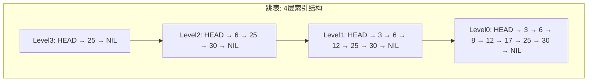
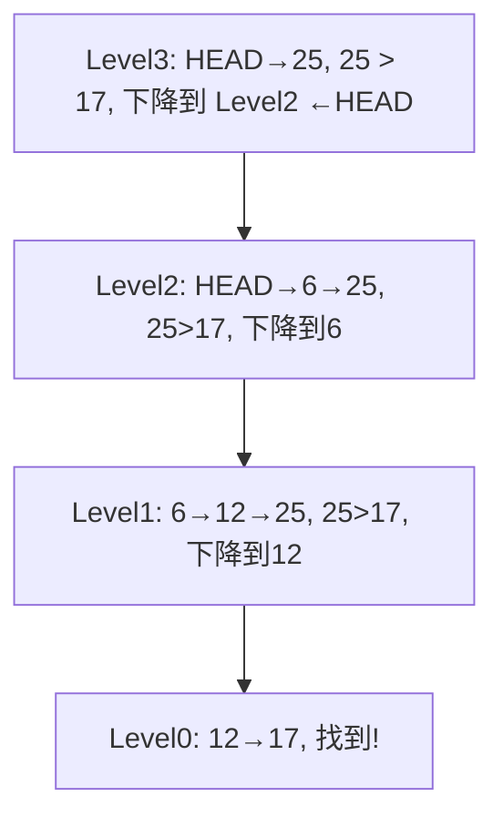

## ==========================================================================
C++ 数据结构教程 — 跳表 (Skip List)
## ==========================================================================

## 📋 章节概述

跳表（Skip List）是一种基于有序链表的数据结构，通过添加多级索引实现高效的
查找、插入和删除操作。它是由William Pugh于1990年发明的，作为平衡二叉搜索树
的一种概率性替代方案。

跳表在Redis的有序集合（Sorted Set）、LevelDB的MemTable等系统中有实际应用。
它的实现比平衡树简单得多，且在并发场景下更容易实现无锁操作。
本章将从跳表的多级索引思想讲起，深入概率平衡原理，
全面覆盖跳表的实现和优化，最后通过实例和习题巩固所学知识。

> 📌 **底层实现参考**：如果需要深入理解本章数据结构的底层实现（纯C手写、内存布局、指针操作），请参阅 [[../../C语言深化教程/3数据结构/09_高级数据结构|C语言教程: 高级数据结构]]。C教程侧重手动实现与内存本质，本教程侧重STL使用与算法优化，两者互补。

## ==========================================================================
### 📖 第一节: 基础语法 + 计算机底层原理
## ==========================================================================

1.1 跳表的基本概念
-----------------------

跳表是一个多层链表：
- 最底层（Level 0）包含所有元素，是一个普通的有序链表
- 上层是下层的"索引"，每一层是下一层的子集
- 每个节点以概率p（通常为1/2）出现在上一层中

时间复杂度（期望）：
- 查找：O(log n)
- 插入：O(log n)
- 删除：O(log n)

空间复杂度（期望）：O(n)

| 数据结构 | 查找 | 插入 | 删除 | 空间 | 实现难度 |
|----------|------|------|------|------|---------|
| 有序数组 | O(log n) | O(n) | O(n) | O(n) | 简单 |
| 有序链表 | O(n) | O(n) | O(n) | O(n) | 简单 |
| 二叉搜索树 | O(log n) | O(log n) | O(log n) | O(n) | 中等 |
| 平衡树(AVL/RB) | O(log n) | O(log n) | O(log n) | O(n) | 困难 |
| 跳表 | O(log n) | O(log n) | O(log n) | O(n) | 中等 |
| 哈希表 | O(1) | O(1) | O(1) | O(n) | 中等 |

> 跳表在保持 O(log n) 性能的同时实现难度远低于平衡树，且天然支持范围查询（有序链表），
> 因此在 Redis 等系统中作为有序集合的底层实现被广泛使用。

1.2 跳表结构示意



查找 17 的过程（高层的"电梯"快速跳过，底层精确查找）：



1.3 完整实现

```cpp
#include <iostream>
#include <vector>
#include <cstdlib>
#include <ctime>
#include <climits>

class SkipList {
private:
    struct Node {
        int key;
        int value;
        std::vector<Node*> forward;

        Node(int k, int v, int level) : key(k), value(v), forward(level + 1, nullptr) {}
    };

    Node* header;
    int maxLevel;
    int currentLevel;
    float probability;
    int size_;

    int randomLevel() {
        int level = 0;
        while ((float)rand() / RAND_MAX < probability && level < maxLevel)
            level++;
        return level;
    }

public:
    SkipList(int maxLvl = 16, float p = 0.5)
        : maxLevel(maxLvl), currentLevel(0), probability(p), size_(0) {
        header = new Node(INT_MIN, 0, maxLevel);
        srand(time(nullptr));
    }

    ~SkipList() {
        Node* curr = header->forward[0];
        while (curr) {
            Node* next = curr->forward[0];
            delete curr;
            curr = next;
        }
        delete header;
    }

    bool search(int key, int& value) const {
        Node* curr = header;
        for (int i = currentLevel; i >= 0; --i) {
            while (curr->forward[i] && curr->forward[i]->key < key)
                curr = curr->forward[i];
        }
        curr = curr->forward[0];
        if (curr && curr->key == key) {
            value = curr->value;
            return true;
        }
        return false;
    }

    void insert(int key, int value) {
        std::vector<Node*> update(maxLevel + 1, nullptr);
        Node* curr = header;

        for (int i = currentLevel; i >= 0; --i) {
            while (curr->forward[i] && curr->forward[i]->key < key)
                curr = curr->forward[i];
            update[i] = curr;
        }

        curr = curr->forward[0];

        if (curr && curr->key == key) {
            curr->value = value;
            return;
        }

        int newLevel = randomLevel();
        if (newLevel > currentLevel) {
            for (int i = currentLevel + 1; i <= newLevel; ++i)
                update[i] = header;
            currentLevel = newLevel;
        }

        Node* newNode = new Node(key, value, newLevel);
        for (int i = 0; i <= newLevel; ++i) {
            newNode->forward[i] = update[i]->forward[i];
            update[i]->forward[i] = newNode;
        }
        size_++;
    }

    bool remove(int key) {
        std::vector<Node*> update(maxLevel + 1, nullptr);
        Node* curr = header;

        for (int i = currentLevel; i >= 0; --i) {
            while (curr->forward[i] && curr->forward[i]->key < key)
                curr = curr->forward[i];
            update[i] = curr;
        }

        curr = curr->forward[0];
        if (!curr || curr->key != key) return false;

        for (int i = 0; i <= currentLevel; ++i) {
            if (update[i]->forward[i] != curr) break;
            update[i]->forward[i] = curr->forward[i];
        }

        delete curr;
        size_--;

        while (currentLevel > 0 && !header->forward[currentLevel])
            currentLevel--;

        return true;
    }

    int getSize() const { return size_; }

    void print() const {
        for (int i = currentLevel; i >= 0; --i) {
            std::cout << "Level " << i << ": ";
            Node* curr = header->forward[i];
            while (curr) {
                std::cout << curr->key << " ";
                curr = curr->forward[i];
            }
            std::cout << std::endl;
        }
    }
};

int main() {
    SkipList sl;
    sl.insert(3, 30);
    sl.insert(6, 60);
    sl.insert(8, 80);
    sl.insert(12, 120);
    sl.insert(17, 170);
    sl.insert(25, 250);
    sl.insert(30, 300);

    sl.print();
    std::cout << std::endl;

    int val;
    if (sl.search(17, val))
        std::cout << "找到key=17, value=" << val << std::endl;

    sl.remove(12);
    std::cout << "删除12后:" << std::endl;
    sl.print();

    return 0;
}
```

1.4 概率分析

对于概率p=1/2：
- 期望层数：1/(1-p) = 2层
- 期望空间：n × 1/(1-p) = 2n个指针
- 期望查找比较次数：(log₂n)/p = 2log₂n

最大层数建议设为 log₁/ₚ(n)，例如n=10^6, p=0.5时设maxLevel=20即可。

## ==========================================================================
### 📖 第二节: 所有用法大全
## ==========================================================================

2.1 支持排名操作的跳表

```cpp
#include <iostream>
#include <vector>
#include <cstdlib>
#include <ctime>
#include <climits>

class RankedSkipList {
private:
    struct Node {
        int key;
        std::vector<Node*> forward;
        std::vector<int> span;

        Node(int k, int level) : key(k), forward(level + 1, nullptr), span(level + 1, 0) {}
    };

    Node* header;
    int maxLevel;
    int currentLevel;
    int size_;

    int randomLevel() {
        int level = 0;
        while (rand() % 2 == 0 && level < maxLevel)
            level++;
        return level;
    }

public:
    RankedSkipList(int maxLvl = 16) : maxLevel(maxLvl), currentLevel(0), size_(0) {
        header = new Node(INT_MIN, maxLevel);
        srand(time(nullptr));
    }

    void insert(int key) {
        std::vector<Node*> update(maxLevel + 1);
        std::vector<int> rank(maxLevel + 1, 0);
        Node* curr = header;

        for (int i = currentLevel; i >= 0; --i) {
            rank[i] = (i == currentLevel) ? 0 : rank[i + 1];
            while (curr->forward[i] && curr->forward[i]->key < key) {
                rank[i] += curr->span[i];
                curr = curr->forward[i];
            }
            update[i] = curr;
        }

        int newLevel = randomLevel();
        if (newLevel > currentLevel) {
            for (int i = currentLevel + 1; i <= newLevel; ++i) {
                rank[i] = 0;
                update[i] = header;
                update[i]->span[i] = size_;
            }
            currentLevel = newLevel;
        }

        Node* newNode = new Node(key, newLevel);
        for (int i = 0; i <= newLevel; ++i) {
            newNode->forward[i] = update[i]->forward[i];
            update[i]->forward[i] = newNode;
            newNode->span[i] = update[i]->span[i] - (rank[0] - rank[i]);
            update[i]->span[i] = (rank[0] - rank[i]) + 1;
        }

        for (int i = newLevel + 1; i <= currentLevel; ++i)
            update[i]->span[i]++;

        size_++;
    }

    int getRank(int key) {
        Node* curr = header;
        int rank = 0;
        for (int i = currentLevel; i >= 0; --i) {
            while (curr->forward[i] && curr->forward[i]->key <= key) {
                rank += curr->span[i];
                curr = curr->forward[i];
            }
        }
        if (curr->key == key) return rank;
        return -1;
    }

    int getByRank(int rank) {
        Node* curr = header;
        int traversed = 0;
        for (int i = currentLevel; i >= 0; --i) {
            while (curr->forward[i] && traversed + curr->span[i] <= rank) {
                traversed += curr->span[i];
                curr = curr->forward[i];
            }
        }
        return (traversed == rank) ? curr->key : -1;
    }

    int getSize() const { return size_; }
};

int main() {
    RankedSkipList sl;
    sl.insert(10);
    sl.insert(20);
    sl.insert(30);
    sl.insert(40);
    sl.insert(50);

    std::cout << "30的排名: " << sl.getRank(30) << std::endl;
    std::cout << "排名第2的元素: " << sl.getByRank(2) << std::endl;
    std::cout << "排名第4的元素: " << sl.getByRank(4) << std::endl;

    return 0;
}
```

2.2 区间查询跳表

```cpp
#include <iostream>
#include <vector>
#include <cstdlib>
#include <ctime>
#include <climits>

class RangeSkipList {
private:
    struct Node {
        int key, value;
        std::vector<Node*> forward;
        Node(int k, int v, int level) : key(k), value(v), forward(level + 1, nullptr) {}
    };

    Node* header;
    int maxLevel, currentLevel;

    int randomLevel() {
        int level = 0;
        while (rand() % 2 == 0 && level < maxLevel) level++;
        return level;
    }

public:
    RangeSkipList(int maxLvl = 16) : maxLevel(maxLvl), currentLevel(0) {
        header = new Node(INT_MIN, 0, maxLevel);
        srand(time(nullptr));
    }

    void insert(int key, int value) {
        std::vector<Node*> update(maxLevel + 1);
        Node* curr = header;
        for (int i = currentLevel; i >= 0; --i) {
            while (curr->forward[i] && curr->forward[i]->key < key)
                curr = curr->forward[i];
            update[i] = curr;
        }
        int newLevel = randomLevel();
        if (newLevel > currentLevel) {
            for (int i = currentLevel + 1; i <= newLevel; ++i)
                update[i] = header;
            currentLevel = newLevel;
        }
        Node* newNode = new Node(key, value, newLevel);
        for (int i = 0; i <= newLevel; ++i) {
            newNode->forward[i] = update[i]->forward[i];
            update[i]->forward[i] = newNode;
        }
    }

    std::vector<std::pair<int,int>> rangeQuery(int low, int high) {
        std::vector<std::pair<int,int>> result;
        Node* curr = header;
        for (int i = currentLevel; i >= 0; --i) {
            while (curr->forward[i] && curr->forward[i]->key < low)
                curr = curr->forward[i];
        }
        curr = curr->forward[0];
        while (curr && curr->key <= high) {
            result.emplace_back(curr->key, curr->value);
            curr = curr->forward[0];
        }
        return result;
    }
};

int main() {
    RangeSkipList sl;
    sl.insert(5, 50);
    sl.insert(10, 100);
    sl.insert(15, 150);
    sl.insert(20, 200);
    sl.insert(25, 250);
    sl.insert(30, 300);

    auto results = sl.rangeQuery(10, 25);
    std::cout << "范围[10,25]内的元素:" << std::endl;
    for (auto [k, v] : results)
        std::cout << "  key=" << k << ", value=" << v << std::endl;

    return 0;
}
```

2.3 并发安全跳表（简化版）

```cpp
#include <iostream>
#include <vector>
#include <mutex>
#include <shared_mutex>
#include <cstdlib>
#include <climits>

class ConcurrentSkipList {
private:
    struct Node {
        int key, value;
        std::vector<Node*> forward;
        std::mutex nodeMutex;
        Node(int k, int v, int level) : key(k), value(v), forward(level + 1, nullptr) {}
    };

    Node* header;
    int maxLevel, currentLevel;
    mutable std::shared_mutex rwLock;

    int randomLevel() {
        int level = 0;
        while (rand() % 2 == 0 && level < maxLevel) level++;
        return level;
    }

public:
    ConcurrentSkipList(int maxLvl = 16) : maxLevel(maxLvl), currentLevel(0) {
        header = new Node(INT_MIN, 0, maxLevel);
    }

    bool search(int key, int& value) {
        std::shared_lock<std::shared_mutex> lock(rwLock);
        Node* curr = header;
        for (int i = currentLevel; i >= 0; --i) {
            while (curr->forward[i] && curr->forward[i]->key < key)
                curr = curr->forward[i];
        }
        curr = curr->forward[0];
        if (curr && curr->key == key) {
            value = curr->value;
            return true;
        }
        return false;
    }

    void insert(int key, int value) {
        std::unique_lock<std::shared_mutex> lock(rwLock);
        std::vector<Node*> update(maxLevel + 1);
        Node* curr = header;
        for (int i = currentLevel; i >= 0; --i) {
            while (curr->forward[i] && curr->forward[i]->key < key)
                curr = curr->forward[i];
            update[i] = curr;
        }
        curr = curr->forward[0];
        if (curr && curr->key == key) {
            curr->value = value;
            return;
        }
        int newLevel = randomLevel();
        if (newLevel > currentLevel) {
            for (int i = currentLevel + 1; i <= newLevel; ++i)
                update[i] = header;
            currentLevel = newLevel;
        }
        Node* newNode = new Node(key, value, newLevel);
        for (int i = 0; i <= newLevel; ++i) {
            newNode->forward[i] = update[i]->forward[i];
            update[i]->forward[i] = newNode;
        }
    }
};

int main() {
    ConcurrentSkipList sl;
    sl.insert(1, 10);
    sl.insert(2, 20);
    sl.insert(3, 30);

    int val;
    if (sl.search(2, val))
        std::cout << "key=2, value=" << val << std::endl;
    return 0;
}
```

## ==========================================================================
### 📖 第三节: 实用案例
## ==========================================================================

3.1 案例一：模拟Redis有序集合（ZSet）

```cpp
#include <iostream>
#include <string>
#include <unordered_map>
#include <vector>
#include <cstdlib>
#include <ctime>
#include <climits>

class ZSet {
private:
    struct Node {
        double score;
        std::string member;
        std::vector<Node*> forward;
        std::vector<int> span;
        Node(double s, const std::string& m, int level)
            : score(s), member(m), forward(level+1, nullptr), span(level+1, 0) {}
    };

    Node* header;
    std::unordered_map<std::string, double> dict;
    int maxLevel, currentLevel, size_;

    int randomLevel() {
        int level = 0;
        while (rand() % 4 < 1 && level < maxLevel) level++;
        return level;
    }

    bool less(Node* a, double score, const std::string& member) {
        return a->score < score || (a->score == score && a->member < member);
    }

public:
    ZSet(int maxLvl = 32) : maxLevel(maxLvl), currentLevel(0), size_(0) {
        header = new Node(-1e18, "", maxLevel);
        srand(time(nullptr));
    }

    void zadd(const std::string& member, double score) {
        if (dict.count(member)) zrem(member);
        dict[member] = score;

        std::vector<Node*> update(maxLevel + 1);
        Node* curr = header;
        for (int i = currentLevel; i >= 0; --i) {
            while (curr->forward[i] && less(curr->forward[i], score, member))
                curr = curr->forward[i];
            update[i] = curr;
        }

        int newLevel = randomLevel();
        if (newLevel > currentLevel) {
            for (int i = currentLevel + 1; i <= newLevel; ++i) {
                update[i] = header;
                header->span[i] = size_;
            }
            currentLevel = newLevel;
        }

        Node* newNode = new Node(score, member, newLevel);
        for (int i = 0; i <= newLevel; ++i) {
            newNode->forward[i] = update[i]->forward[i];
            update[i]->forward[i] = newNode;
        }
        size_++;
    }

    bool zrem(const std::string& member) {
        if (!dict.count(member)) return false;
        double score = dict[member];
        dict.erase(member);

        std::vector<Node*> update(maxLevel + 1);
        Node* curr = header;
        for (int i = currentLevel; i >= 0; --i) {
            while (curr->forward[i] && less(curr->forward[i], score, member))
                curr = curr->forward[i];
            update[i] = curr;
        }
        curr = curr->forward[0];
        if (!curr || curr->member != member) return false;

        for (int i = 0; i <= currentLevel; ++i) {
            if (update[i]->forward[i] != curr) break;
            update[i]->forward[i] = curr->forward[i];
        }
        delete curr;
        size_--;
        while (currentLevel > 0 && !header->forward[currentLevel]) currentLevel--;
        return true;
    }

    double zscore(const std::string& member) {
        if (dict.count(member)) return dict[member];
        return -1;
    }

    std::vector<std::string> zrangeByScore(double minScore, double maxScore) {
        std::vector<std::string> result;
        Node* curr = header;
        for (int i = currentLevel; i >= 0; --i) {
            while (curr->forward[i] && curr->forward[i]->score < minScore)
                curr = curr->forward[i];
        }
        curr = curr->forward[0];
        while (curr && curr->score <= maxScore) {
            result.push_back(curr->member);
            curr = curr->forward[0];
        }
        return result;
    }

    int zcard() const { return size_; }
};

int main() {
    ZSet zset;
    zset.zadd("alice", 95.5);
    zset.zadd("bob", 87.3);
    zset.zadd("charlie", 92.1);
    zset.zadd("david", 88.8);
    zset.zadd("eve", 91.0);

    std::cout << "alice的分数: " << zset.zscore("alice") << std::endl;
    std::cout << "集合大小: " << zset.zcard() << std::endl;

    auto range = zset.zrangeByScore(88.0, 93.0);
    std::cout << "分数在[88,93]之间的成员: ";
    for (const auto& m : range) std::cout << m << " ";
    std::cout << std::endl;

    zset.zrem("bob");
    std::cout << "删除bob后集合大小: " << zset.zcard() << std::endl;

    return 0;
}
```

3.2 案例二：内存数据库索引

```cpp
#include <iostream>
#include <string>
#include <vector>
#include <cstdlib>
#include <ctime>
#include <climits>
#include <sstream>

class MemDBIndex {
private:
    struct Record {
        int id;
        std::string name;
        int age;
        double salary;
    };

    struct Node {
        int key;
        Record* data;
        std::vector<Node*> forward;
        Node(int k, Record* d, int level)
            : key(k), data(d), forward(level + 1, nullptr) {}
    };

    Node* header;
    int maxLevel, currentLevel;

    int randomLevel() {
        int level = 0;
        while (rand() % 2 == 0 && level < maxLevel) level++;
        return level;
    }

public:
    MemDBIndex(int maxLvl = 16) : maxLevel(maxLvl), currentLevel(0) {
        header = new Node(INT_MIN, nullptr, maxLevel);
        srand(time(nullptr));
    }

    void insert(Record* record) {
        std::vector<Node*> update(maxLevel + 1);
        Node* curr = header;
        for (int i = currentLevel; i >= 0; --i) {
            while (curr->forward[i] && curr->forward[i]->key < record->id)
                curr = curr->forward[i];
            update[i] = curr;
        }
        int newLevel = randomLevel();
        if (newLevel > currentLevel) {
            for (int i = currentLevel + 1; i <= newLevel; ++i)
                update[i] = header;
            currentLevel = newLevel;
        }
        Node* newNode = new Node(record->id, record, newLevel);
        for (int i = 0; i <= newLevel; ++i) {
            newNode->forward[i] = update[i]->forward[i];
            update[i]->forward[i] = newNode;
        }
    }

    Record* find(int id) {
        Node* curr = header;
        for (int i = currentLevel; i >= 0; --i) {
            while (curr->forward[i] && curr->forward[i]->key < id)
                curr = curr->forward[i];
        }
        curr = curr->forward[0];
        if (curr && curr->key == id) return curr->data;
        return nullptr;
    }

    std::vector<Record*> rangeScan(int startId, int endId) {
        std::vector<Record*> results;
        Node* curr = header;
        for (int i = currentLevel; i >= 0; --i) {
            while (curr->forward[i] && curr->forward[i]->key < startId)
                curr = curr->forward[i];
        }
        curr = curr->forward[0];
        while (curr && curr->key <= endId) {
            results.push_back(curr->data);
            curr = curr->forward[0];
        }
        return results;
    }
};

int main() {
    MemDBIndex db;

    std::vector<MemDBIndex::Record> records = {
        {1, "张三", 28, 15000},
        {2, "李四", 35, 25000},
        {3, "王五", 22, 8000},
        {4, "赵六", 30, 18000},
        {5, "钱七", 45, 35000}
    };

    for (auto& r : records) db.insert(&r);

    auto* found = db.find(3);
    if (found)
        std::cout << "ID=3: " << found->name << ", 年龄" << found->age << std::endl;

    auto range = db.rangeScan(2, 4);
    std::cout << "ID[2,4]的记录:" << std::endl;
    for (auto* r : range)
        std::cout << "  " << r->id << ": " << r->name << std::endl;

    return 0;
}
```

3.3 案例三：跳表 vs 平衡树性能对比

```cpp
#include <iostream>
#include <set>
#include <chrono>
#include <cstdlib>
#include <vector>
#include <climits>

class BenchmarkSkipList {
private:
    struct Node {
        int key;
        std::vector<Node*> forward;
        Node(int k, int level) : key(k), forward(level + 1, nullptr) {}
    };
    Node* header;
    int maxLevel, currentLevel;

    int randomLevel() {
        int level = 0;
        while (rand() % 2 == 0 && level < maxLevel) level++;
        return level;
    }

public:
    BenchmarkSkipList(int maxLvl = 20) : maxLevel(maxLvl), currentLevel(0) {
        header = new Node(INT_MIN, maxLevel);
    }

    void insert(int key) {
        std::vector<Node*> update(maxLevel + 1);
        Node* curr = header;
        for (int i = currentLevel; i >= 0; --i) {
            while (curr->forward[i] && curr->forward[i]->key < key)
                curr = curr->forward[i];
            update[i] = curr;
        }
        int newLevel = randomLevel();
        if (newLevel > currentLevel) {
            for (int i = currentLevel + 1; i <= newLevel; ++i)
                update[i] = header;
            currentLevel = newLevel;
        }
        Node* newNode = new Node(key, newLevel);
        for (int i = 0; i <= newLevel; ++i) {
            newNode->forward[i] = update[i]->forward[i];
            update[i]->forward[i] = newNode;
        }
    }

    bool search(int key) {
        Node* curr = header;
        for (int i = currentLevel; i >= 0; --i) {
            while (curr->forward[i] && curr->forward[i]->key < key)
                curr = curr->forward[i];
        }
        curr = curr->forward[0];
        return curr && curr->key == key;
    }
};

int main() {
    const int N = 100000;
    std::vector<int> data(N);
    for (int i = 0; i < N; ++i) data[i] = rand();

    auto start = std::chrono::high_resolution_clock::now();
    BenchmarkSkipList sl;
    for (int x : data) sl.insert(x);
    auto end = std::chrono::high_resolution_clock::now();
    auto skipTime = std::chrono::duration_cast<std::chrono::milliseconds>(end - start).count();

    start = std::chrono::high_resolution_clock::now();
    std::set<int> rbTree;
    for (int x : data) rbTree.insert(x);
    end = std::chrono::high_resolution_clock::now();
    auto treeTime = std::chrono::duration_cast<std::chrono::milliseconds>(end - start).count();

    std::cout << "插入" << N << "个元素:" << std::endl;
    std::cout << "  跳表耗时: " << skipTime << "ms" << std::endl;
    std::cout << "  红黑树(std::set)耗时: " << treeTime << "ms" << std::endl;

    start = std::chrono::high_resolution_clock::now();
    for (int x : data) sl.search(x);
    end = std::chrono::high_resolution_clock::now();
    skipTime = std::chrono::duration_cast<std::chrono::milliseconds>(end - start).count();

    start = std::chrono::high_resolution_clock::now();
    for (int x : data) rbTree.count(x);
    end = std::chrono::high_resolution_clock::now();
    treeTime = std::chrono::duration_cast<std::chrono::milliseconds>(end - start).count();

    std::cout << "查找" << N << "个元素:" << std::endl;
    std::cout << "  跳表耗时: " << skipTime << "ms" << std::endl;
    std::cout << "  红黑树(std::set)耗时: " << treeTime << "ms" << std::endl;

    return 0;
}
```

## ==========================================================================
### 📖 第四节: 课后习题
## ==========================================================================

1. 基础题：实现一个完整的跳表，支持插入、删除、查找、打印各层结构。

2. 应用题：为跳表添加排名功能（通过span字段），支持getRank和getByRank操作。

3. 进阶题：实现一个简化版的Redis ZSet，支持zadd、zrem、zscore、zrangeByScore。

4. 挑战题：实现一个支持读写锁的并发跳表，保证多线程安全。

## ==========================================================================


## --------------------------------------------------------------------------
## 🔗 知识网络
## --------------------------------------------------------------------------

- **上一章**: [[数据结构/M_树状数组_BIT]] | **下一章**: [[数据结构/O_B树_BTree]] | **返回**: [[目录]]
- **相关**: [[数据结构/E_红黑树_RedBlackTree]] | [[Redis内部实现]] | [[并发数据结构]]

## ==========================================================================
## 章节测试
## ==========================================================================

### 判断题

> [!question] 判断题 1
> 跳表的查找时间复杂度在最坏情况下为O(n)。（ ）
> - [ ] ✅ 正确
> - [ ] ❌ 错误
>
> > [!success]- 点击查看答案
> > 答案: 正确
> > 
> > **解析**: 跳表是概率性数据结构，最坏情况下所有节点只有1层（退化为链表），此时查找为O(n)。但这种概率极低。

> [!question] 判断题 2
> 跳表的期望空间复杂度为O(n log n)。（ ）
> - [ ] ✅ 正确
> - [ ] ❌ 错误
>
> > [!success]- 点击查看答案
> > 答案: 错误
> > 
> > **解析**: 对于p=1/2，每个节点期望出现在1/(1-p)=2层中，总指针数期望为2n，空间复杂度为O(n)。

> [!question] 判断题 3
> Redis中的有序集合（Sorted Set）底层使用跳表实现。（ ）
> - [ ] ✅ 正确
> - [ ] ❌ 错误
>
> > [!success]- 点击查看答案
> > 答案: 正确
> > 
> > **解析**: Redis的ZSet在元素数量较多时使用跳表+哈希表的组合实现，跳表支持有序操作，哈希表支持O(1)的成员查找。

> [!question] 判断题 4
> 跳表的插入操作不需要像AVL树那样进行旋转。（ ）
> - [ ] ✅ 正确
> - [ ] ❌ 错误
>
> > [!success]- 点击查看答案
> > 答案: 正确
> > 
> > **解析**: 跳表通过随机化层数来实现概率平衡，不需要像AVL树或红黑树那样通过旋转维护平衡。

> [!question] 判断题 5
> 跳表中概率参数p越大，索引层数越多，查找速度越快。（ ）
> - [ ] ✅ 正确
> - [ ] ❌ 错误
>
> > [!success]- 点击查看答案
> > 答案: 错误
> > 
> > **解析**: p越大索引层数越多，空间开销增大。最优的p取决于时空权衡，通常p=1/2或p=1/4。p过大会导致空间浪费而查找提升有限。

> [!question] 判断题 6
> 跳表比平衡二叉搜索树更容易实现并发安全的版本。（ ）
> - [ ] ✅ 正确
> - [ ] ❌ 错误
>
> > [!success]- 点击查看答案
> > 答案: 正确
> > 
> > **解析**: 跳表的插入只影响局部节点，且不需要全局旋转操作，因此更容易实现细粒度锁或无锁并发版本。

> [!question] 判断题 7
> 跳表中每个节点的层数是在插入时随机决定的，之后不会改变。（ ）
> - [ ] ✅ 正确
> - [ ] ❌ 错误
>
> > [!success]- 点击查看答案
> > 答案: 正确
> > 
> > **解析**: 节点的层数在插入时通过随机过程确定后就固定不变，这是跳表实现简单的关键原因之一。

> [!question] 判断题 8
> 跳表的最底层包含所有元素，且是有序的。（ ）
> - [ ] ✅ 正确
> - [ ] ❌ 错误
>
> > [!success]- 点击查看答案
> > 答案: 正确
> > 
> > **解析**: Level 0（最底层）是一个包含所有元素的有序链表，上层都是下层的子集。

> [!question] 判断题 9
> 跳表支持高效的范围查询（range query）。（ ）
> - [ ] ✅ 正确
> - [ ] ❌ 错误
>
> > [!success]- 点击查看答案
> > 答案: 正确
> > 
> > **解析**: 先用O(log n)找到范围起点，然后在最底层链表上顺序遍历即可完成范围查询，这也是Redis选择跳表的原因之一。

> [!question] 判断题 10
> 跳表的删除操作时间复杂度为O(1)。（ ）
> - [ ] ✅ 正确
> - [ ] ❌ 错误
>
> > [!success]- 点击查看答案
> > 答案: 错误
> > 
> > **解析**: 删除操作需要先找到待删除节点（O(log n)），然后更新各层的前驱指针，总时间为O(log n)。

### 选择题

> [!question] 选择题 1
> 跳表的发明者和发明年份是？
> - [ ] A. Donald Knuth, 1985
> - [ ] B. William Pugh, 1990
> - [ ] C. Robert Sedgewick, 1978
> - [ ] D. Rudolf Bayer, 1972
>
> > [!success]- 点击查看答案
> > 正确答案: B
> > 
> > **解析**: 跳表由William Pugh于1990年在论文"Skip Lists: A Probabilistic Alternative to Balanced Trees"中提出。

> [!question] 选择题 2
> 当概率参数p=1/2时，一个n节点跳表的期望层数约为？
> - [ ] A. n
> - [ ] B. log₂n
> - [ ] C. n/2
> - [ ] D. 2
>
> > [!success]- 点击查看答案
> > 正确答案: B
> > 
> > **解析**: 期望最大层数为log₁/ₚ(n) = log₂n。每层节点数以1/2的速率递减，类似二分查找。

> [!question] 选择题 3
> 跳表相比红黑树的主要优势不包括？
> - [ ] A. 实现简单
> - [ ] B. 支持范围查询
> - [ ] C. 最坏情况时间复杂度更好
> - [ ] D. 更容易实现并发版本
>
> > [!success]- 点击查看答案
> > 正确答案: C
> > 
> > **解析**: 红黑树最坏情况O(log n)是确定性保证，而跳表最坏情况为O(n)（虽然概率极低）。跳表在实现简单性、范围查询和并发方面有优势。

> [!question] 选择题 4
> Redis选择跳表而非红黑树实现有序集合的主要原因是？
> - [ ] A. 跳表查找更快
> - [ ] B. 跳表支持范围查询且实现简单
> - [ ] C. 红黑树无法实现有序集合
> - [ ] D. 跳表空间占用更小
>
> > [!success]- 点击查看答案
> > 正确答案: B
> > 
> > **解析**: Redis作者antirez表示选择跳表的主要原因是：实现简单易调试、支持O(log n)范围查询、且性能与平衡树相当。

> [!question] 选择题 5
> 在p=1/4的跳表中，一个节点平均有多少层？
> - [ ] A. 1.25
> - [ ] B. 1.33
> - [ ] C. 2
> - [ ] D. 4
>
> > [!success]- 点击查看答案
> > 正确答案: B
> > 
> > **解析**: 节点的期望层数为1/(1-p) = 1/(1-1/4) = 4/3 ≈ 1.33。这意味着平均每个节点使用约1.33个指针。

> [!question] 选择题 6
> 跳表中查找一个元素时，从哪里开始？
> - [ ] A. 最底层的头节点
> - [ ] B. 最高层的头节点
> - [ ] C. 最高层的尾节点
> - [ ] D. 中间层的头节点
>
> > [!success]- 点击查看答案
> > 正确答案: B
> > 
> > **解析**: 查找从最高层的头节点开始，逐层下降。在每一层尽量向右移动，当下一个节点大于目标值时下降一层。

> [!question] 选择题 7
> 跳表插入操作中的update数组记录的是什么？
> - [ ] A. 每层中新节点的后继
> - [ ] B. 每层中新节点的前驱
> - [ ] C. 每层的节点总数
> - [ ] D. 每层的最大值
>
> > [!success]- 点击查看答案
> > 正确答案: B
> > 
> > **解析**: update[i]记录第i层中新节点的前驱节点，插入时需要修改前驱节点的forward指针指向新节点。

> [!question] 选择题 8
> 以下哪个系统没有使用跳表？
> - [ ] A. Redis (ZSet)
> - [ ] B. LevelDB (MemTable)
> - [ ] C. MySQL (InnoDB索引)
> - [ ] D. Apache HBase (MemStore)
>
> > [!success]- 点击查看答案
> > 正确答案: C
> > 
> > **解析**: MySQL InnoDB使用B+树作为索引结构。Redis、LevelDB和HBase的内存组件都使用了跳表。

> [!question] 选择题 9
> 跳表中节点的span字段通常用于实现什么功能？
> - [ ] A. 记录节点值
> - [ ] B. 实现排名查询
> - [ ] C. 加速删除操作
> - [ ] D. 记录节点层数
>
> > [!success]- 点击查看答案
> > 正确答案: B
> > 
> > **解析**: span记录当前指针跨越的节点数，通过累加span可以计算出某个元素的排名，实现getRank和getByRank操作。

> [!question] 选择题 10
> 对于一个包含100万个元素的跳表(p=1/2)，maxLevel应该设为多少最合适？
> - [ ] A. 10
> - [ ] B. 20
> - [ ] C. 50
> - [ ] D. 100
>
> > [!success]- 点击查看答案
> > 正确答案: B
> > 
> > **解析**: maxLevel应设为log₁/ₚ(n) = log₂(10^6) ≈ 20。设置过小会降低效率，过大会浪费header的空间。

### 编程大题

> [!question] 编程大题 1
> **题目**: 实现一个跳表，支持以下操作：
> 1. insert(key) - 插入元素
> 2. remove(key) - 删除元素
> 3. search(key) - 查找元素
> 4. display() - 打印各层结构
> 
> 要求在main函数中演示插入10个随机数，打印结构，删除3个，再次打印。
>
> > [!success]- 点击查看提示
> > 核心是维护update数组（记录每层前驱），插入时随机确定层数并更新指针，删除时从各层断开目标节点。

> [!question] 编程大题 2
> **题目**: 实现一个简化版的Redis ZRANGEBYSCORE命令。要求：
> 1. 支持zadd(member, score)添加成员
> 2. 支持zrangeByScore(min, max)返回分数在[min, max]范围内的所有成员（按分数升序）
> 3. 支持zcount(min, max)统计范围内的成员数
>
> > [!success]- 点击查看提示
> > 使用跳表按score排序存储成员。zrangeByScore先用O(log n)定位到第一个≥min的节点，再顺序遍历直到>max。zcount可以通过span计算或直接遍历计数。

> [!question] 编程大题 3
> **题目**: 对比跳表与std::set（红黑树）的性能。分别测试：
> 1. 插入10^6个随机整数的时间
> 2. 查找10^6次的时间
> 3. 删除10^5个元素的时间
> 
> 输出三项操作各自的耗时对比。
>
> > [!success]- 点击查看提示
> > 使用std::chrono进行计时。跳表手动实现，std::set使用标准库。注意使用相同的测试数据集以保证公平性。预期结果：两者性能接近，跳表可能在缓存局部性上稍差但在插入上略快。
