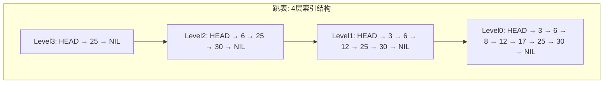
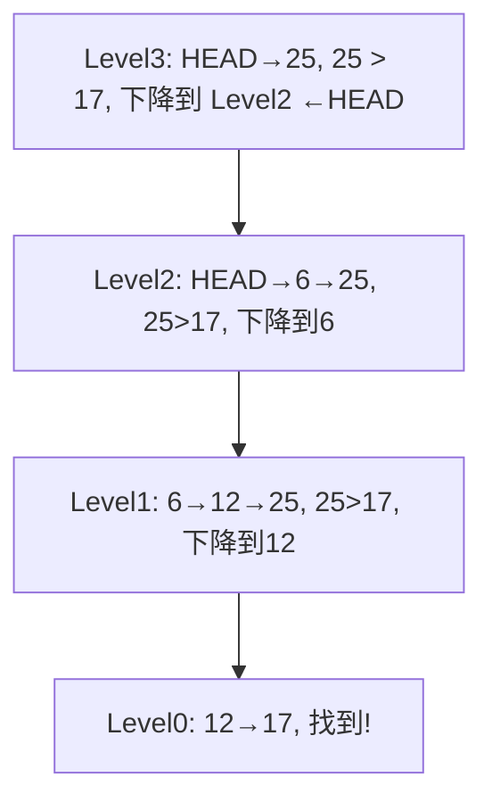

---
数据结构教程 — 跳表 (Skip List)
---

##  章节概述

跳表（Skip List）是一种基于有序链表的数据结构，通过添加多级索引实现高效的
查找、插入和删除操作。它是由William Pugh于1990年发明的，作为平衡二叉搜索树
的一种概率性替代方案。

跳表在Redis的有序集合（Sorted Set）、LevelDB的MemTable等系统中有实际应用。
它的实现比平衡树简单得多，且在并发场景下更容易实现无锁操作。
本章将从跳表的多级索引思想讲起，深入概率平衡原理，
全面覆盖跳表的实现和优化，最后通过实例和习题巩固所学知识。

>  **底层实现参考**：如果需要深入理解本章数据结构的底层实现（纯C手写、内存布局、指针操作），请参阅 [[../../C语言深化教程/3数据结构/09_高级数据结构|C语言教程: 高级数据结构]]。C教程侧重手动实现与内存本质，本教程侧重STL使用与算法优化，两者互补。

---
###  第一节: 基础语法 + 计算机底层原理
---

1.1 跳表的基本概念
-----------------------

跳表是一个多层链表：
- 最底层（Level 0）包含所有元素，是一个普通的有序链表
- 上层是下层的"索引"，每一层是下一层的子集
- 每个节点以概率p（通常为1/2）出现在上一层中

时间复杂度（期望）：
- 查找：O(log n)
- 插入：O(log n)
- 删除：O(log n)

空间复杂度（期望）：O(n)

| 数据结构 | 查找 | 插入 | 删除 | 空间 | 实现难度 |
|----------|------|------|------|------|---------|
| 有序数组 | O(log n) | O(n) | O(n) | O(n) | 简单 |
| 有序链表 | O(n) | O(n) | O(n) | O(n) | 简单 |
| 二叉搜索树 | O(log n) | O(log n) | O(log n) | O(n) | 中等 |
| 平衡树(AVL/RB) | O(log n) | O(log n) | O(log n) | O(n) | 困难 |
| 跳表 | O(log n) | O(log n) | O(log n) | O(n) | 中等 |
| 哈希表 | O(1) | O(1) | O(1) | O(n) | 中等 |

> 跳表在保持 O(log n) 性能的同时实现难度远低于平衡树，且天然支持范围查询（有序链表），
> 因此在 Redis 等系统中作为有序集合的底层实现被广泛使用。

1.2 跳表结构示意



查找 17 的过程（高层的"电梯"快速跳过，底层精确查找）：



1.3 完整实现

```pseudocode
STRUCT Node:
    key, value
    forward      // 数组: forward[i] = 当前节点在第 i 层的后继指针
    CONSTRUCTOR(k, v, level):
        key = k; value = v
        forward = ARRAY of size level + 1, filled with NULL
    END CONSTRUCTOR
END STRUCT

CLASS SkipList:
    header          // 头节点（哨兵，key = NEGATIVE_INFINITY）
    maxLevel        // 最大层数
    currentLevel    // 当前最高非空层
    probability     // 晋升概率（通常 0.5）
    size            // 元素个数

    FUNCTION randomLevel():
        level = 0
        WHILE RANDOM_FLOAT() < probability AND level < maxLevel:
            level = level + 1
        END WHILE
        RETURN level
    END FUNCTION

    CONSTRUCTOR(maxLvl=16, p=0.5):
        maxLevel = maxLvl
        currentLevel = 0
        probability = p
        size = 0
        header = NEW Node(NEGATIVE_INFINITY, 0, maxLevel)
    END CONSTRUCTOR

    DESTRUCTOR:
        curr = header.forward[0]
        WHILE curr != NULL:
            next = curr.forward[0]
            FREE curr
            curr = next
        END WHILE
        FREE header
    END DESTRUCTOR

    FUNCTION search(key, value):
        curr = header
        FOR i FROM currentLevel DOWNTO 0:
            WHILE curr.forward[i] != NULL AND curr.forward[i].key < key:
                curr = curr.forward[i]
            END WHILE
        END FOR
        curr = curr.forward[0]
        IF curr != NULL AND curr.key == key THEN
            value = curr.value
            RETURN TRUE
        END IF
        RETURN FALSE
    END FUNCTION

    FUNCTION insert(key, value):
        update = ARRAY of size maxLevel + 1, filled with NULL
        curr = header
        FOR i FROM currentLevel DOWNTO 0:
            WHILE curr.forward[i] != NULL AND curr.forward[i].key < key:
                curr = curr.forward[i]
            END WHILE
            update[i] = curr    // 记录每层的前驱
        END FOR

        curr = curr.forward[0]
        IF curr != NULL AND curr.key == key THEN
            curr.value = value    // 键已存在，更新值
            RETURN
        END IF

        newLevel = randomLevel()
        IF newLevel > currentLevel THEN
            FOR i FROM currentLevel + 1 TO newLevel:
                update[i] = header
            END FOR
            currentLevel = newLevel
        END IF

        newNode = NEW Node(key, value, newLevel)
        FOR i FROM 0 TO newLevel:
            newNode.forward[i] = update[i].forward[i]
            update[i].forward[i] = newNode
        END FOR
        size = size + 1
    END FUNCTION

    FUNCTION remove(key):
        update = ARRAY of size maxLevel + 1, filled with NULL
        curr = header
        FOR i FROM currentLevel DOWNTO 0:
            WHILE curr.forward[i] != NULL AND curr.forward[i].key < key:
                curr = curr.forward[i]
            END WHILE
            update[i] = curr
        END FOR

        curr = curr.forward[0]
        IF curr == NULL OR curr.key != key THEN RETURN FALSE

        FOR i FROM 0 TO currentLevel:
            IF update[i].forward[i] != curr THEN BREAK
            update[i].forward[i] = curr.forward[i]
        END FOR

        FREE curr
        size = size - 1

        WHILE currentLevel > 0 AND header.forward[currentLevel] == NULL:
            currentLevel = currentLevel - 1
        END WHILE

        RETURN TRUE
    END FUNCTION

    FUNCTION getSize():
        RETURN size
    END FUNCTION

    FUNCTION print():
        FOR i FROM currentLevel DOWNTO 0:
            DISPLAY "Level ", i, ": "
            curr = header.forward[i]
            WHILE curr != NULL:
                DISPLAY curr.key, " "
                curr = curr.forward[i]
            END WHILE
            DISPLAY NEWLINE
        END FOR
    END FUNCTION
END CLASS
```

---
**实现练习**: 用 C 或 C++ 自行实现上述结构。完成后与 AI 对话检查正确性。
---

1.4 概率分析

对于概率p=1/2：
- 期望层数：1/(1-p) = 2层
- 期望空间：n × 1/(1-p) = 2n个指针
- 期望查找比较次数：(log₂n)/p = 2log₂n

最大层数建议设为 log₁/ₚ(n)，例如n=10^6, p=0.5时设maxLevel=20即可。

---
###  第二节: 实现思路
---

2.1 支持排名操作的跳表

```pseudocode
STRUCT Node:
    key
    forward      // 数组: 各层后继指针
    span         // 数组: span[i] = 第 i 层指针跨越的节点数
    CONSTRUCTOR(k, level):
        key = k
        forward = ARRAY of size level + 1, filled with NULL
        span = ARRAY of size level + 1, filled with 0
    END CONSTRUCTOR
END STRUCT

CLASS RankedSkipList:
    header, maxLevel, currentLevel, size

    FUNCTION randomLevel():
        level = 0
        WHILE RANDOM() MOD 2 == 0 AND level < maxLevel:
            level = level + 1
        END WHILE
        RETURN level
    END FUNCTION

    CONSTRUCTOR(maxLvl=16):
        maxLevel = maxLvl; currentLevel = 0; size = 0
        header = NEW Node(NEGATIVE_INFINITY, maxLevel)
    END CONSTRUCTOR

    FUNCTION insert(key):
        update = ARRAY of size maxLevel + 1
        rank = ARRAY of size maxLevel + 1, filled with 0
        curr = header
        FOR i FROM currentLevel DOWNTO 0:
            IF i == currentLevel THEN rank[i] = 0
            ELSE rank[i] = rank[i + 1]
            END IF
            WHILE curr.forward[i] != NULL AND curr.forward[i].key < key:
                rank[i] = rank[i] + curr.span[i]
                curr = curr.forward[i]
            END WHILE
            update[i] = curr
        END FOR

        newLevel = randomLevel()
        IF newLevel > currentLevel THEN
            FOR i FROM currentLevel + 1 TO newLevel:
                rank[i] = 0
                update[i] = header
                update[i].span[i] = size
            END FOR
            currentLevel = newLevel
        END IF

        newNode = NEW Node(key, newLevel)
        FOR i FROM 0 TO newLevel:
            newNode.forward[i] = update[i].forward[i]
            update[i].forward[i] = newNode
            newNode.span[i] = update[i].span[i] - (rank[0] - rank[i])
            update[i].span[i] = (rank[0] - rank[i]) + 1
        END FOR

        FOR i FROM newLevel + 1 TO currentLevel:
            update[i].span[i] = update[i].span[i] + 1
        END FOR
        size = size + 1
    END FUNCTION

    FUNCTION getRank(key):    // 返回 key 的排名（1-based）
        curr = header
        rank = 0
        FOR i FROM currentLevel DOWNTO 0:
            WHILE curr.forward[i] != NULL AND curr.forward[i].key <= key:
                rank = rank + curr.span[i]
                curr = curr.forward[i]
            END WHILE
        END FOR
        IF curr.key == key THEN RETURN rank
        RETURN -1
    END FUNCTION

    FUNCTION getByRank(rank):    // 返回排名第 rank 的元素
        curr = header
        traversed = 0
        FOR i FROM currentLevel DOWNTO 0:
            WHILE curr.forward[i] != NULL AND traversed + curr.span[i] <= rank:
                traversed = traversed + curr.span[i]
                curr = curr.forward[i]
            END WHILE
        END FOR
        IF traversed == rank THEN RETURN curr.key
        RETURN -1
    END FUNCTION
END CLASS
```

---
**实现练习**: 用 C 或 C++ 自行实现上述结构。完成后与 AI 对话检查正确性。
---

2.2 区间查询跳表

```pseudocode
STRUCT Node:
    key, value
    forward      // 数组: 各层后继指针
    CONSTRUCTOR(k, v, level):
        key = k; value = v
        forward = ARRAY of size level + 1, filled with NULL
    END CONSTRUCTOR
END STRUCT

CLASS RangeSkipList:
    header, maxLevel, currentLevel

    FUNCTION randomLevel():
        level = 0
        WHILE RANDOM() MOD 2 == 0 AND level < maxLevel:
            level = level + 1
        END WHILE
        RETURN level
    END FUNCTION

    CONSTRUCTOR(maxLvl=16):
        maxLevel = maxLvl; currentLevel = 0
        header = NEW Node(NEGATIVE_INFINITY, 0, maxLevel)
    END CONSTRUCTOR

    FUNCTION insert(key, value):
        update = ARRAY of size maxLevel + 1
        curr = header
        FOR i FROM currentLevel DOWNTO 0:
            WHILE curr.forward[i] != NULL AND curr.forward[i].key < key:
                curr = curr.forward[i]
            END WHILE
            update[i] = curr
        END FOR
        newLevel = randomLevel()
        IF newLevel > currentLevel THEN
            FOR i FROM currentLevel + 1 TO newLevel:
                update[i] = header
            END FOR
            currentLevel = newLevel
        END IF
        newNode = NEW Node(key, value, newLevel)
        FOR i FROM 0 TO newLevel:
            newNode.forward[i] = update[i].forward[i]
            update[i].forward[i] = newNode
        END FOR
    END FUNCTION

    FUNCTION rangeQuery(low, high):
        result = EMPTY_LIST
        curr = header
        FOR i FROM currentLevel DOWNTO 0:
            WHILE curr.forward[i] != NULL AND curr.forward[i].key < low:
                curr = curr.forward[i]
            END WHILE
        END FOR
        curr = curr.forward[0]
        WHILE curr != NULL AND curr.key <= high:
            APPEND (curr.key, curr.value) TO result
            curr = curr.forward[0]
        END WHILE
        RETURN result
    END FUNCTION
END CLASS
```

---
**实现练习**: 用 C 或 C++ 自行实现上述结构。完成后与 AI 对话检查正确性。
---

2.3 并发安全跳表（简化版）

```pseudocode
STRUCT Node:
    key, value
    forward      // 数组: 各层后继指针
    nodeMutex    // 每节点一个互斥锁
    CONSTRUCTOR(k, v, level):
        key = k; value = v
        forward = ARRAY of size level + 1, filled with NULL
    END CONSTRUCTOR
END STRUCT

CLASS ConcurrentSkipList:
    header, maxLevel, currentLevel
    rwLock      // 全局读写锁（简化实现）

    FUNCTION randomLevel():
        level = 0
        WHILE RANDOM() MOD 2 == 0 AND level < maxLevel:
            level = level + 1
        END WHILE
        RETURN level
    END FUNCTION

    CONSTRUCTOR(maxLvl=16):
        maxLevel = maxLvl; currentLevel = 0
        header = NEW Node(NEGATIVE_INFINITY, 0, maxLevel)
    END CONSTRUCTOR

    FUNCTION search(key, value):
        ACQUIRE_READ_LOCK(rwLock)
        curr = header
        FOR i FROM currentLevel DOWNTO 0:
            WHILE curr.forward[i] != NULL AND curr.forward[i].key < key:
                curr = curr.forward[i]
            END WHILE
        END FOR
        curr = curr.forward[0]
        IF curr != NULL AND curr.key == key THEN
            value = curr.value
            RELEASE_READ_LOCK(rwLock)
            RETURN TRUE
        END IF
        RELEASE_READ_LOCK(rwLock)
        RETURN FALSE
    END FUNCTION

    FUNCTION insert(key, value):
        ACQUIRE_WRITE_LOCK(rwLock)
        update = ARRAY of size maxLevel + 1
        curr = header
        FOR i FROM currentLevel DOWNTO 0:
            WHILE curr.forward[i] != NULL AND curr.forward[i].key < key:
                curr = curr.forward[i]
            END WHILE
            update[i] = curr
        END FOR
        curr = curr.forward[0]
        IF curr != NULL AND curr.key == key THEN
            curr.value = value
            RELEASE_WRITE_LOCK(rwLock)
            RETURN
        END IF
        newLevel = randomLevel()
        IF newLevel > currentLevel THEN
            FOR i FROM currentLevel + 1 TO newLevel:
                update[i] = header
            END FOR
            currentLevel = newLevel
        END IF
        newNode = NEW Node(key, value, newLevel)
        FOR i FROM 0 TO newLevel:
            newNode.forward[i] = update[i].forward[i]
            update[i].forward[i] = newNode
        END FOR
        RELEASE_WRITE_LOCK(rwLock)
    END FUNCTION
END CLASS
```

---
**实现练习**: 用 C 或 C++ 自行实现上述结构。完成后与 AI 对话检查正确性。
---

---
###  第三节: 应用场景
---

3.1 案例一：模拟Redis有序集合（ZSet）

```pseudocode
STRUCT Node:
    score
    member       // 成员名（字符串）
    forward      // 各层后继指针
    span         // 各层跨越节点数
    CONSTRUCTOR(s, m, level):
        score = s; member = m
        forward = ARRAY of size level + 1, filled with NULL
        span = ARRAY of size level + 1, filled with 0
    END CONSTRUCTOR
END STRUCT

CLASS ZSet:
    header      // 跳表头节点
    dict        // 哈希表: member → score (O(1) 查询分数)
    maxLevel, currentLevel, size

    FUNCTION randomLevel():
        level = 0
        WHILE RANDOM() MOD 4 < 1 AND level < maxLevel:   // p=1/4
            level = level + 1
        END WHILE
        RETURN level
    END FUNCTION

    FUNCTION less(a, score, member):    // 比较函数: (score, member) 是否小于
        RETURN a.score < score OR (a.score == score AND a.member < member)
    END FUNCTION

    CONSTRUCTOR(maxLvl=32):
        maxLevel = maxLvl; currentLevel = 0; size = 0
        header = NEW Node(NEGATIVE_INFINITY, "", maxLevel)
    END CONSTRUCTOR

    FUNCTION zadd(member, score):
        IF dict CONTAINS member THEN zrem(member)
        dict[member] = score
        update = ARRAY of size maxLevel + 1
        curr = header
        FOR i FROM currentLevel DOWNTO 0:
            WHILE curr.forward[i] != NULL AND less(curr.forward[i], score, member):
                curr = curr.forward[i]
            END WHILE
            update[i] = curr
        END FOR
        newLevel = randomLevel()
        IF newLevel > currentLevel THEN
            FOR i FROM currentLevel + 1 TO newLevel:
                update[i] = header
                header.span[i] = size
            END FOR
            currentLevel = newLevel
        END IF
        newNode = NEW Node(score, member, newLevel)
        FOR i FROM 0 TO newLevel:
            newNode.forward[i] = update[i].forward[i]
            update[i].forward[i] = newNode
        END FOR
        size = size + 1
    END FUNCTION

    FUNCTION zrem(member):
        IF NOT dict CONTAINS member THEN RETURN FALSE
        score = dict[member]
        REMOVE member FROM dict
        update = ARRAY of size maxLevel + 1
        curr = header
        FOR i FROM currentLevel DOWNTO 0:
            WHILE curr.forward[i] != NULL AND less(curr.forward[i], score, member):
                curr = curr.forward[i]
            END WHILE
            update[i] = curr
        END FOR
        curr = curr.forward[0]
        IF curr == NULL OR curr.member != member THEN RETURN FALSE
        FOR i FROM 0 TO currentLevel:
            IF update[i].forward[i] != curr THEN BREAK
            update[i].forward[i] = curr.forward[i]
        END FOR
        FREE curr
        size = size - 1
        WHILE currentLevel > 0 AND header.forward[currentLevel] == NULL:
            currentLevel = currentLevel - 1
        END WHILE
        RETURN TRUE
    END FUNCTION

    FUNCTION zscore(member):
        IF dict CONTAINS member THEN RETURN dict[member]
        RETURN -1
    END FUNCTION

    FUNCTION zrangeByScore(minScore, maxScore):
        result = EMPTY_LIST
        curr = header
        FOR i FROM currentLevel DOWNTO 0:
            WHILE curr.forward[i] != NULL AND curr.forward[i].score < minScore:
                curr = curr.forward[i]
            END WHILE
        END FOR
        curr = curr.forward[0]
        WHILE curr != NULL AND curr.score <= maxScore:
            APPEND curr.member TO result
            curr = curr.forward[0]
        END WHILE
        RETURN result
    END FUNCTION

    FUNCTION zcard():
        RETURN size
    END FUNCTION
END CLASS
```

---
**实现练习**: 用 C 或 C++ 自行实现上述结构。完成后与 AI 对话检查正确性。
---

3.2 案例二：内存数据库索引

```pseudocode
STRUCT Record:
    id
    name    // 字符串
    age
    salary
END STRUCT

STRUCT Node:
    key     // 索引键（用 record.id 作为 key）
    data    // 指向 Record 的指针
    forward // 各层后继指针
    CONSTRUCTOR(k, d, level):
        key = k; data = d
        forward = ARRAY of size level + 1, filled with NULL
    END CONSTRUCTOR
END STRUCT

CLASS MemDBIndex:
    header, maxLevel, currentLevel

    FUNCTION randomLevel():
        level = 0
        WHILE RANDOM() MOD 2 == 0 AND level < maxLevel:
            level = level + 1
        END WHILE
        RETURN level
    END FUNCTION

    CONSTRUCTOR(maxLvl=16):
        maxLevel = maxLvl; currentLevel = 0
        header = NEW Node(NEGATIVE_INFINITY, NULL, maxLevel)
    END CONSTRUCTOR

    FUNCTION insert(record):
        update = ARRAY of size maxLevel + 1
        curr = header
        FOR i FROM currentLevel DOWNTO 0:
            WHILE curr.forward[i] != NULL AND curr.forward[i].key < record.id:
                curr = curr.forward[i]
            END WHILE
            update[i] = curr
        END FOR
        newLevel = randomLevel()
        IF newLevel > currentLevel THEN
            FOR i FROM currentLevel + 1 TO newLevel:
                update[i] = header
            END FOR
            currentLevel = newLevel
        END IF
        newNode = NEW Node(record.id, record, newLevel)
        FOR i FROM 0 TO newLevel:
            newNode.forward[i] = update[i].forward[i]
            update[i].forward[i] = newNode
        END FOR
    END FUNCTION

    FUNCTION find(id):
        curr = header
        FOR i FROM currentLevel DOWNTO 0:
            WHILE curr.forward[i] != NULL AND curr.forward[i].key < id:
                curr = curr.forward[i]
            END WHILE
        END FOR
        curr = curr.forward[0]
        IF curr != NULL AND curr.key == id THEN RETURN curr.data
        RETURN NULL
    END FUNCTION

    FUNCTION rangeScan(startId, endId):
        results = EMPTY_LIST
        curr = header
        FOR i FROM currentLevel DOWNTO 0:
            WHILE curr.forward[i] != NULL AND curr.forward[i].key < startId:
                curr = curr.forward[i]
            END WHILE
        END FOR
        curr = curr.forward[0]
        WHILE curr != NULL AND curr.key <= endId:
            APPEND curr.data TO results
            curr = curr.forward[0]
        END WHILE
        RETURN results
    END FUNCTION
END CLASS
```

---
**实现练习**: 用 C 或 C++ 自行实现上述结构。完成后与 AI 对话检查正确性。
---

3.3 案例三：跳表 vs 平衡树性能对比

```pseudocode
STRUCT Node:
    key
    forward      // 各层后继指针
    CONSTRUCTOR(k, level):
        key = k
        forward = ARRAY of size level + 1, filled with NULL
    END CONSTRUCTOR
END STRUCT

CLASS BenchmarkSkipList:
    header, maxLevel, currentLevel

    FUNCTION randomLevel():
        level = 0
        WHILE RANDOM() MOD 2 == 0 AND level < maxLevel:
            level = level + 1
        END WHILE
        RETURN level
    END FUNCTION

    CONSTRUCTOR(maxLvl=20):
        maxLevel = maxLvl; currentLevel = 0
        header = NEW Node(NEGATIVE_INFINITY, maxLevel)
    END CONSTRUCTOR

    FUNCTION insert(key):
        update = ARRAY of size maxLevel + 1
        curr = header
        FOR i FROM currentLevel DOWNTO 0:
            WHILE curr.forward[i] != NULL AND curr.forward[i].key < key:
                curr = curr.forward[i]
            END WHILE
            update[i] = curr
        END FOR
        newLevel = randomLevel()
        IF newLevel > currentLevel THEN
            FOR i FROM currentLevel + 1 TO newLevel:
                update[i] = header
            END FOR
            currentLevel = newLevel
        END IF
        newNode = NEW Node(key, newLevel)
        FOR i FROM 0 TO newLevel:
            newNode.forward[i] = update[i].forward[i]
            update[i].forward[i] = newNode
        END FOR
    END FUNCTION

    FUNCTION search(key):
        curr = header
        FOR i FROM currentLevel DOWNTO 0:
            WHILE curr.forward[i] != NULL AND curr.forward[i].key < key:
                curr = curr.forward[i]
            END WHILE
        END FOR
        curr = curr.forward[0]
        RETURN curr != NULL AND curr.key == key
    END FUNCTION
END CLASS

// 性能对比流程:
N = 100000
data = ARRAY of N random integers
sl = BenchmarkSkipList()

START_TIMER()
FOR EACH x IN data: sl.insert(x)
skipInsertTime = STOP_TIMER()

rbTree = BALANCED_TREE()
START_TIMER()
FOR EACH x IN data: rbTree.insert(x)
treeInsertTime = STOP_TIMER()

DISPLAY "插入", N, "个元素:"
DISPLAY "  跳表耗时:", skipInsertTime, "ms"
DISPLAY "  平衡树耗时:", treeInsertTime, "ms"
```

---
**实现练习**: 用 C 或 C++ 自行实现上述结构。完成后与 AI 对话检查正确性。
---

---
###  第四节: 课后习题
---

1. 基础题：实现一个完整的跳表，支持插入、删除、查找、打印各层结构。

2. 应用题：为跳表添加排名功能（通过span字段），支持getRank和getByRank操作。

3. 进阶题：实现一个简化版的Redis ZSet，支持zadd、zrem、zscore、zrangeByScore。

4. 挑战题：实现一个支持读写锁的并发跳表，保证多线程安全。

---


***
##  知识网络
***

- **上一章**: [[M_树状数组_BIT]] | **下一章**: [[E_红黑树_RedBlackTree]] | **返回**: [[DSA学习路线]] (Phase 5 选修)
- **算法技巧**: [[../算法技巧/二分查找]]
- **相关**: [[数据结构/E_红黑树_RedBlackTree]] | [[Redis内部实现]] | [[并发数据结构]]

---
## 章节测试
---

### 判断题

> [!question] 判断题 1
> 跳表的查找时间复杂度在最坏情况下为O(n)。（ ）
> - [ ]  正确
> - [ ]  错误
>
> > [!success]- 点击查看答案
> > 答案: 正确
> > 
> > **解析**: 跳表是概率性数据结构，最坏情况下所有节点只有1层（退化为链表），此时查找为O(n)。但这种概率极低。

> [!question] 判断题 2
> 跳表的期望空间复杂度为O(n log n)。（ ）
> - [ ]  正确
> - [ ]  错误
>
> > [!success]- 点击查看答案
> > 答案: 错误
> > 
> > **解析**: 对于p=1/2，每个节点期望出现在1/(1-p)=2层中，总指针数期望为2n，空间复杂度为O(n)。

> [!question] 判断题 3
> Redis中的有序集合（Sorted Set）底层使用跳表实现。（ ）
> - [ ]  正确
> - [ ]  错误
>
> > [!success]- 点击查看答案
> > 答案: 正确
> > 
> > **解析**: Redis的ZSet在元素数量较多时使用跳表+哈希表的组合实现，跳表支持有序操作，哈希表支持O(1)的成员查找。

> [!question] 判断题 4
> 跳表的插入操作不需要像AVL树那样进行旋转。（ ）
> - [ ]  正确
> - [ ]  错误
>
> > [!success]- 点击查看答案
> > 答案: 正确
> > 
> > **解析**: 跳表通过随机化层数来实现概率平衡，不需要像AVL树或红黑树那样通过旋转维护平衡。

> [!question] 判断题 5
> 跳表中概率参数p越大，索引层数越多，查找速度越快。（ ）
> - [ ]  正确
> - [ ]  错误
>
> > [!success]- 点击查看答案
> > 答案: 错误
> > 
> > **解析**: p越大索引层数越多，空间开销增大。最优的p取决于时空权衡，通常p=1/2或p=1/4。p过大会导致空间浪费而查找提升有限。

> [!question] 判断题 6
> 跳表比平衡二叉搜索树更容易实现并发安全的版本。（ ）
> - [ ]  正确
> - [ ]  错误
>
> > [!success]- 点击查看答案
> > 答案: 正确
> > 
> > **解析**: 跳表的插入只影响局部节点，且不需要全局旋转操作，因此更容易实现细粒度锁或无锁并发版本。

> [!question] 判断题 7
> 跳表中每个节点的层数是在插入时随机决定的，之后不会改变。（ ）
> - [ ]  正确
> - [ ]  错误
>
> > [!success]- 点击查看答案
> > 答案: 正确
> > 
> > **解析**: 节点的层数在插入时通过随机过程确定后就固定不变，这是跳表实现简单的关键原因之一。

> [!question] 判断题 8
> 跳表的最底层包含所有元素，且是有序的。（ ）
> - [ ]  正确
> - [ ]  错误
>
> > [!success]- 点击查看答案
> > 答案: 正确
> > 
> > **解析**: Level 0（最底层）是一个包含所有元素的有序链表，上层都是下层的子集。

> [!question] 判断题 9
> 跳表支持高效的范围查询（range query）。（ ）
> - [ ]  正确
> - [ ]  错误
>
> > [!success]- 点击查看答案
> > 答案: 正确
> > 
> > **解析**: 先用O(log n)找到范围起点，然后在最底层链表上顺序遍历即可完成范围查询，这也是Redis选择跳表的原因之一。

> [!question] 判断题 10
> 跳表的删除操作时间复杂度为O(1)。（ ）
> - [ ]  正确
> - [ ]  错误
>
> > [!success]- 点击查看答案
> > 答案: 错误
> > 
> > **解析**: 删除操作需要先找到待删除节点（O(log n)），然后更新各层的前驱指针，总时间为O(log n)。

### 选择题

> [!question] 选择题 1
> 跳表的发明者和发明年份是？
> - [ ] A. Donald Knuth, 1985
> - [ ] B. William Pugh, 1990
> - [ ] C. Robert Sedgewick, 1978
> - [ ] D. Rudolf Bayer, 1972
>
> > [!success]- 点击查看答案
> > 正确答案: B
> > 
> > **解析**: 跳表由William Pugh于1990年在论文"Skip Lists: A Probabilistic Alternative to Balanced Trees"中提出。

> [!question] 选择题 2
> 当概率参数p=1/2时，一个n节点跳表的期望层数约为？
> - [ ] A. n
> - [ ] B. log₂n
> - [ ] C. n/2
> - [ ] D. 2
>
> > [!success]- 点击查看答案
> > 正确答案: B
> > 
> > **解析**: 期望最大层数为log₁/ₚ(n) = log₂n。每层节点数以1/2的速率递减，类似二分查找。

> [!question] 选择题 3
> 跳表相比红黑树的主要优势不包括？
> - [ ] A. 实现简单
> - [ ] B. 支持范围查询
> - [ ] C. 最坏情况时间复杂度更好
> - [ ] D. 更容易实现并发版本
>
> > [!success]- 点击查看答案
> > 正确答案: C
> > 
> > **解析**: 红黑树最坏情况O(log n)是确定性保证，而跳表最坏情况为O(n)（虽然概率极低）。跳表在实现简单性、范围查询和并发方面有优势。

> [!question] 选择题 4
> Redis选择跳表而非红黑树实现有序集合的主要原因是？
> - [ ] A. 跳表查找更快
> - [ ] B. 跳表支持范围查询且实现简单
> - [ ] C. 红黑树无法实现有序集合
> - [ ] D. 跳表空间占用更小
>
> > [!success]- 点击查看答案
> > 正确答案: B
> > 
> > **解析**: Redis作者antirez表示选择跳表的主要原因是：实现简单易调试、支持O(log n)范围查询、且性能与平衡树相当。

> [!question] 选择题 5
> 在p=1/4的跳表中，一个节点平均有多少层？
> - [ ] A. 1.25
> - [ ] B. 1.33
> - [ ] C. 2
> - [ ] D. 4
>
> > [!success]- 点击查看答案
> > 正确答案: B
> > 
> > **解析**: 节点的期望层数为1/(1-p) = 1/(1-1/4) = 4/3 ≈ 1.33。这意味着平均每个节点使用约1.33个指针。

> [!question] 选择题 6
> 跳表中查找一个元素时，从哪里开始？
> - [ ] A. 最底层的头节点
> - [ ] B. 最高层的头节点
> - [ ] C. 最高层的尾节点
> - [ ] D. 中间层的头节点
>
> > [!success]- 点击查看答案
> > 正确答案: B
> > 
> > **解析**: 查找从最高层的头节点开始，逐层下降。在每一层尽量向右移动，当下一个节点大于目标值时下降一层。

> [!question] 选择题 7
> 跳表插入操作中的update数组记录的是什么？
> - [ ] A. 每层中新节点的后继
> - [ ] B. 每层中新节点的前驱
> - [ ] C. 每层的节点总数
> - [ ] D. 每层的最大值
>
> > [!success]- 点击查看答案
> > 正确答案: B
> > 
> > **解析**: update[i]记录第i层中新节点的前驱节点，插入时需要修改前驱节点的forward指针指向新节点。

> [!question] 选择题 8
> 以下哪个系统没有使用跳表？
> - [ ] A. Redis (ZSet)
> - [ ] B. LevelDB (MemTable)
> - [ ] C. MySQL (InnoDB索引)
> - [ ] D. Apache HBase (MemStore)
>
> > [!success]- 点击查看答案
> > 正确答案: C
> > 
> > **解析**: MySQL InnoDB使用B+树作为索引结构。Redis、LevelDB和HBase的内存组件都使用了跳表。

> [!question] 选择题 9
> 跳表中节点的span字段通常用于实现什么功能？
> - [ ] A. 记录节点值
> - [ ] B. 实现排名查询
> - [ ] C. 加速删除操作
> - [ ] D. 记录节点层数
>
> > [!success]- 点击查看答案
> > 正确答案: B
> > 
> > **解析**: span记录当前指针跨越的节点数，通过累加span可以计算出某个元素的排名，实现getRank和getByRank操作。

> [!question] 选择题 10
> 对于一个包含100万个元素的跳表(p=1/2)，maxLevel应该设为多少最合适？
> - [ ] A. 10
> - [ ] B. 20
> - [ ] C. 50
> - [ ] D. 100
>
> > [!success]- 点击查看答案
> > 正确答案: B
> > 
> > **解析**: maxLevel应设为log₁/ₚ(n) = log₂(10^6) ≈ 20。设置过小会降低效率，过大会浪费header的空间。

### 编程大题

> [!question] 编程大题 1
> **题目**: 实现一个跳表，支持以下操作：
> 1. insert(key) - 插入元素
> 2. remove(key) - 删除元素
> 3. search(key) - 查找元素
> 4. display() - 打印各层结构
> 
> 要求在main函数中演示插入10个随机数，打印结构，删除3个，再次打印。
>
> > [!success]- 点击查看提示
> > 核心是维护update数组（记录每层前驱），插入时随机确定层数并更新指针，删除时从各层断开目标节点。

> [!question] 编程大题 2
> **题目**: 实现一个简化版的Redis ZRANGEBYSCORE命令。要求：
> 1. 支持zadd(member, score)添加成员
> 2. 支持zrangeByScore(min, max)返回分数在[min, max]范围内的所有成员（按分数升序）
> 3. 支持zcount(min, max)统计范围内的成员数
>
> > [!success]- 点击查看提示
> > 使用跳表按score排序存储成员。zrangeByScore先用O(log n)定位到第一个≥min的节点，再顺序遍历直到>max。zcount可以通过span计算或直接遍历计数。

> [!question] 编程大题 3
> **题目**: 对比跳表与红黑树的性能。分别测试：
> 1. 插入10^6个随机整数的时间
> 2. 查找10^6次的时间
> 3. 删除10^5个元素的时间
> 
> 输出三项操作各自的耗时对比。
>
> > [!success]- 点击查看提示
> > 使用计时函数进行计时。跳表手动实现，红黑树使用对应语言的平衡树。注意使用相同的测试数据集以保证公平性。预期结果：两者性能接近，跳表可能在缓存局部性上稍差但在插入上略快。
