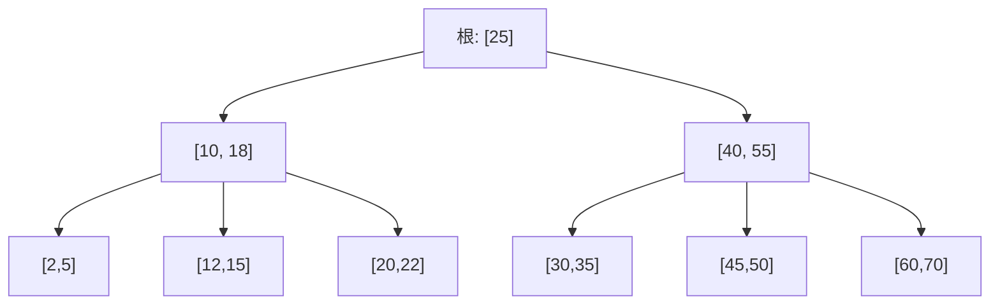

## ==========================================================================
C++ 数据结构教程 — B树/B+树 (B-Tree / B+ Tree)
## ==========================================================================

## 📋 章节概述

B树（B-Tree）和B+树（B+ Tree）是为磁盘存储优化的自平衡多路搜索树。与二叉搜索树
不同，B树的每个节点可以有多个子节点和多个键值，这使得树更加"扁平"，大幅减少了
磁盘IO次数。

B树和B+树是现代数据库系统和文件系统的核心数据结构。MySQL的InnoDB引擎、
PostgreSQL、MongoDB等都使用B+树作为索引结构。本章将从B树的设计动机讲起，
深入B树和B+树的实现原理，全面覆盖分裂、合并等操作，
最后通过实例和习题巩固所学知识。

> 📌 **底层实现参考**：如果需要深入理解本章数据结构的底层实现（纯C手写、内存布局、指针操作），请参阅 [[../../C语言深化教程/3数据结构/09_高级数据结构|C语言教程: 高级数据结构]]。C教程侧重手动实现与内存本质，本教程侧重STL使用与算法优化，两者互补。

## ==========================================================================
### 📖 第一节: 基础语法 + 计算机底层原理
## ==========================================================================

1.1 为什么需要B树？
-----------------------

磁盘IO的特点：
- 磁盘访问速度比内存慢10^5倍
- 磁盘以"页"（通常4KB）为单位读写
- 减少IO次数是优化的关键

二叉搜索树的问题：
- 树太高（高度为log₂n），每层需要一次磁盘IO
- 100万数据需要约20次IO

B树的解决方案：
- 增加每个节点的键数（如1000个键/节点）
- 降低树高（100万数据只需2-3层）
- 每个节点大小≈一个磁盘页

1.2 B树的定义

一棵m阶B树满足：
- 每个节点最多有m个子节点
- 每个非叶非根节点至少有 ceil(m/2) 个子节点
- 根节点至少有2个子节点（除非是叶子）
- 有k个子节点的非叶节点包含k-1个键
- 所有叶子在同一层

**4 阶 B 树结构示意**（每个节点最多 3 个键、4 个子节点）：



> 每个节点对应磁盘的一个页。查找 key=50 时：读根页 → 读 [40,55] 页 → 读 [45,50] 页，
> 仅需 3 次磁盘 IO，而二叉搜索树需要约 log2(n) 次。

**B-tree vs B+tree 对比**：

| 特性 | B-Tree | B+ Tree |
|------|--------|---------|
| 数据存储 | 所有节点都存数据 | 只有叶子存数据，内部节点只存键 |
| 叶子链接 | 无 | 叶子用链表相连，支持范围遍历 |
| 范围查询 | 需中序遍历 | O(log n + k)，k为结果数 |
| 典型应用 | 文件系统(HFS+) | 数据库索引(MySQL InnoDB) |

1.3 B树实现

```cpp
#include <iostream>
#include <vector>
#include <algorithm>

class BTree {
private:
    struct Node {
        std::vector<int> keys;
        std::vector<Node*> children;
        bool isLeaf;

        Node(bool leaf = true) : isLeaf(leaf) {}
    };

    Node* root;
    int t;

    void splitChild(Node* parent, int idx) {
        Node* child = parent->children[idx];
        Node* newNode = new Node(child->isLeaf);

        int mid = t - 1;
        for (int i = mid + 1; i < (int)child->keys.size(); ++i)
            newNode->keys.push_back(child->keys[i]);

        if (!child->isLeaf) {
            for (int i = t; i < (int)child->children.size(); ++i)
                newNode->children.push_back(child->children[i]);
            child->children.resize(t);
        }

        parent->keys.insert(parent->keys.begin() + idx, child->keys[mid]);
        parent->children.insert(parent->children.begin() + idx + 1, newNode);
        child->keys.resize(mid);
    }

    void insertNonFull(Node* node, int key) {
        int i = node->keys.size() - 1;
        if (node->isLeaf) {
            node->keys.push_back(0);
            while (i >= 0 && key < node->keys[i]) {
                node->keys[i + 1] = node->keys[i];
                i--;
            }
            node->keys[i + 1] = key;
        } else {
            while (i >= 0 && key < node->keys[i]) i--;
            i++;
            if ((int)node->children[i]->keys.size() == 2 * t - 1) {
                splitChild(node, i);
                if (key > node->keys[i]) i++;
            }
            insertNonFull(node->children[i], key);
        }
    }

    bool searchNode(Node* node, int key) const {
        int i = 0;
        while (i < (int)node->keys.size() && key > node->keys[i]) i++;
        if (i < (int)node->keys.size() && node->keys[i] == key) return true;
        if (node->isLeaf) return false;
        return searchNode(node->children[i], key);
    }

    void traverse(Node* node) const {
        for (int i = 0; i < (int)node->keys.size(); ++i) {
            if (!node->isLeaf) traverse(node->children[i]);
            std::cout << node->keys[i] << " ";
        }
        if (!node->isLeaf) traverse(node->children[node->keys.size()]);
    }

    int getHeight(Node* node) const {
        if (!node) return 0;
        if (node->isLeaf) return 1;
        return 1 + getHeight(node->children[0]);
    }

public:
    BTree(int degree) : root(nullptr), t(degree) {}

    void insert(int key) {
        if (!root) {
            root = new Node(true);
            root->keys.push_back(key);
            return;
        }
        if ((int)root->keys.size() == 2 * t - 1) {
            Node* newRoot = new Node(false);
            newRoot->children.push_back(root);
            splitChild(newRoot, 0);
            root = newRoot;
            insertNonFull(root, key);
        } else {
            insertNonFull(root, key);
        }
    }

    bool search(int key) const {
        if (!root) return false;
        return searchNode(root, key);
    }

    void traverse() const {
        if (root) traverse(root);
        std::cout << std::endl;
    }

    int height() const { return getHeight(root); }
};

int main() {
    BTree bt(3);
    std::vector<int> keys = {10, 20, 5, 6, 12, 30, 7, 17, 3, 1, 25, 35, 40};

    for (int key : keys)
        bt.insert(key);

    std::cout << "B树中序遍历: ";
    bt.traverse();
    std::cout << "树高: " << bt.height() << std::endl;
    std::cout << "查找12: " << std::boolalpha << bt.search(12) << std::endl;
    std::cout << "查找15: " << bt.search(15) << std::endl;

    return 0;
}
```

1.4 B+树的特点

B+树与B树的区别：
- 所有数据都存储在叶子节点
- 内部节点只存索引（键），不存数据
- 叶子节点之间通过指针相连（形成有序链表）
- 内部节点的键是其子树中最大（或最小）键的副本

B+树的优势：
- 内部节点更小，一个磁盘页能存更多键（树更矮）
- 范围查询只需遍历叶子链表
- 所有查询路径长度相同（更稳定）

1.5 B+树实现

```cpp
#include <iostream>
#include <vector>
#include <algorithm>
#include <queue>

class BPlusTree {
private:
    struct Node {
        bool isLeaf;
        std::vector<int> keys;
        std::vector<Node*> children;
        Node* next;

        Node(bool leaf = false) : isLeaf(leaf), next(nullptr) {}
    };

    Node* root;
    int order;

    Node* findLeaf(int key) {
        Node* curr = root;
        while (!curr->isLeaf) {
            int i = 0;
            while (i < (int)curr->keys.size() && key >= curr->keys[i]) i++;
            curr = curr->children[i];
        }
        return curr;
    }

    void insertIntoLeaf(Node* leaf, int key) {
        auto pos = std::lower_bound(leaf->keys.begin(), leaf->keys.end(), key);
        leaf->keys.insert(pos, key);
    }

    void insertIntoParent(Node* left, int key, Node* right) {
        if (left == root) {
            Node* newRoot = new Node(false);
            newRoot->keys.push_back(key);
            newRoot->children.push_back(left);
            newRoot->children.push_back(right);
            root = newRoot;
            return;
        }
        Node* parent = findParent(root, left);
        int idx = 0;
        while (idx < (int)parent->children.size() && parent->children[idx] != left) idx++;
        parent->keys.insert(parent->keys.begin() + idx, key);
        parent->children.insert(parent->children.begin() + idx + 1, right);

        if ((int)parent->keys.size() >= order) {
            Node* newInternal = new Node(false);
            int mid = parent->keys.size() / 2;
            int upKey = parent->keys[mid];

            for (int i = mid + 1; i < (int)parent->keys.size(); ++i)
                newInternal->keys.push_back(parent->keys[i]);
            for (int i = mid + 1; i < (int)parent->children.size(); ++i)
                newInternal->children.push_back(parent->children[i]);

            parent->keys.resize(mid);
            parent->children.resize(mid + 1);
            insertIntoParent(parent, upKey, newInternal);
        }
    }

    Node* findParent(Node* curr, Node* child) {
        if (curr->isLeaf || curr->children[0]->isLeaf) {
            for (auto* c : curr->children)
                if (c == child) return curr;
            return nullptr;
        }
        for (auto* c : curr->children) {
            if (c == child) return curr;
            Node* result = findParent(c, child);
            if (result) return result;
        }
        return nullptr;
    }

public:
    BPlusTree(int ord = 4) : root(nullptr), order(ord) {}

    void insert(int key) {
        if (!root) {
            root = new Node(true);
            root->keys.push_back(key);
            return;
        }

        Node* leaf = findLeaf(key);
        insertIntoLeaf(leaf, key);

        if ((int)leaf->keys.size() >= order) {
            Node* newLeaf = new Node(true);
            int mid = leaf->keys.size() / 2;

            for (int i = mid; i < (int)leaf->keys.size(); ++i)
                newLeaf->keys.push_back(leaf->keys[i]);

            leaf->keys.resize(mid);
            newLeaf->next = leaf->next;
            leaf->next = newLeaf;

            insertIntoParent(leaf, newLeaf->keys[0], newLeaf);
        }
    }

    bool search(int key) {
        if (!root) return false;
        Node* leaf = findLeaf(key);
        return std::binary_search(leaf->keys.begin(), leaf->keys.end(), key);
    }

    std::vector<int> rangeSearch(int low, int high) {
        std::vector<int> result;
        if (!root) return result;
        Node* leaf = findLeaf(low);
        while (leaf) {
            for (int k : leaf->keys) {
                if (k > high) return result;
                if (k >= low) result.push_back(k);
            }
            leaf = leaf->next;
        }
        return result;
    }

    void printLeaves() {
        if (!root) return;
        Node* curr = root;
        while (!curr->isLeaf) curr = curr->children[0];
        while (curr) {
            std::cout << "[";
            for (int i = 0; i < (int)curr->keys.size(); ++i) {
                std::cout << curr->keys[i];
                if (i < (int)curr->keys.size() - 1) std::cout << ",";
            }
            std::cout << "] -> ";
            curr = curr->next;
        }
        std::cout << "NULL" << std::endl;
    }
};

int main() {
    BPlusTree bpt(4);
    std::vector<int> keys = {5, 15, 25, 35, 45, 10, 20, 30, 40, 50, 3, 8};

    for (int key : keys)
        bpt.insert(key);

    std::cout << "叶子节点链表: ";
    bpt.printLeaves();

    std::cout << "查找25: " << std::boolalpha << bpt.search(25) << std::endl;
    std::cout << "查找22: " << bpt.search(22) << std::endl;

    auto range = bpt.rangeSearch(10, 35);
    std::cout << "范围[10,35]: ";
    for (int k : range) std::cout << k << " ";
    std::cout << std::endl;

    return 0;
}
```

## ==========================================================================
### 📖 第二节: 所有用法大全
## ==========================================================================

2.1 B树的删除操作

```cpp
#include <iostream>
#include <vector>
#include <algorithm>

class BTreeWithDelete {
private:
    struct Node {
        std::vector<int> keys;
        std::vector<Node*> children;
        bool isLeaf;
        Node(bool leaf = true) : isLeaf(leaf) {}
    };

    Node* root;
    int t;

    int findKey(Node* node, int key) {
        int idx = 0;
        while (idx < (int)node->keys.size() && node->keys[idx] < key) idx++;
        return idx;
    }

    int getPredecessor(Node* node) {
        while (!node->isLeaf)
            node = node->children[node->children.size() - 1];
        return node->keys.back();
    }

    int getSuccessor(Node* node) {
        while (!node->isLeaf)
            node = node->children[0];
        return node->keys[0];
    }

    void merge(Node* node, int idx) {
        Node* left = node->children[idx];
        Node* right = node->children[idx + 1];

        left->keys.push_back(node->keys[idx]);
        for (int k : right->keys) left->keys.push_back(k);
        if (!left->isLeaf) {
            for (Node* c : right->children) left->children.push_back(c);
        }

        node->keys.erase(node->keys.begin() + idx);
        node->children.erase(node->children.begin() + idx + 1);
        delete right;
    }

    void borrowFromPrev(Node* node, int idx) {
        Node* child = node->children[idx];
        Node* sibling = node->children[idx - 1];

        child->keys.insert(child->keys.begin(), node->keys[idx - 1]);
        node->keys[idx - 1] = sibling->keys.back();
        sibling->keys.pop_back();

        if (!child->isLeaf) {
            child->children.insert(child->children.begin(), sibling->children.back());
            sibling->children.pop_back();
        }
    }

    void borrowFromNext(Node* node, int idx) {
        Node* child = node->children[idx];
        Node* sibling = node->children[idx + 1];

        child->keys.push_back(node->keys[idx]);
        node->keys[idx] = sibling->keys[0];
        sibling->keys.erase(sibling->keys.begin());

        if (!child->isLeaf) {
            child->children.push_back(sibling->children[0]);
            sibling->children.erase(sibling->children.begin());
        }
    }

    void fill(Node* node, int idx) {
        if (idx > 0 && (int)node->children[idx - 1]->keys.size() >= t)
            borrowFromPrev(node, idx);
        else if (idx < (int)node->children.size() - 1 &&
                 (int)node->children[idx + 1]->keys.size() >= t)
            borrowFromNext(node, idx);
        else {
            if (idx < (int)node->children.size() - 1)
                merge(node, idx);
            else
                merge(node, idx - 1);
        }
    }

    void removeFromNode(Node* node, int key) {
        int idx = findKey(node, key);

        if (idx < (int)node->keys.size() && node->keys[idx] == key) {
            if (node->isLeaf) {
                node->keys.erase(node->keys.begin() + idx);
            } else if ((int)node->children[idx]->keys.size() >= t) {
                int pred = getPredecessor(node->children[idx]);
                node->keys[idx] = pred;
                removeFromNode(node->children[idx], pred);
            } else if ((int)node->children[idx + 1]->keys.size() >= t) {
                int succ = getSuccessor(node->children[idx + 1]);
                node->keys[idx] = succ;
                removeFromNode(node->children[idx + 1], succ);
            } else {
                merge(node, idx);
                removeFromNode(node->children[idx], key);
            }
        } else {
            if (node->isLeaf) return;
            bool lastChild = (idx == (int)node->children.size() - 1);
            if ((int)node->children[idx]->keys.size() < t)
                fill(node, idx);
            if (lastChild && idx > (int)node->children.size() - 1)
                removeFromNode(node->children[idx - 1], key);
            else
                removeFromNode(node->children[idx], key);
        }
    }

    void splitChild(Node* parent, int idx) {
        Node* child = parent->children[idx];
        Node* newNode = new Node(child->isLeaf);
        int mid = t - 1;
        for (int i = mid + 1; i < (int)child->keys.size(); ++i)
            newNode->keys.push_back(child->keys[i]);
        if (!child->isLeaf)
            for (int i = t; i < (int)child->children.size(); ++i)
                newNode->children.push_back(child->children[i]);
        parent->keys.insert(parent->keys.begin() + idx, child->keys[mid]);
        parent->children.insert(parent->children.begin() + idx + 1, newNode);
        child->keys.resize(mid);
        if (!child->isLeaf) child->children.resize(t);
    }

    void insertNonFull(Node* node, int key) {
        int i = node->keys.size() - 1;
        if (node->isLeaf) {
            node->keys.push_back(0);
            while (i >= 0 && key < node->keys[i]) {
                node->keys[i + 1] = node->keys[i]; i--;
            }
            node->keys[i + 1] = key;
        } else {
            while (i >= 0 && key < node->keys[i]) i--;
            i++;
            if ((int)node->children[i]->keys.size() == 2*t-1) {
                splitChild(node, i);
                if (key > node->keys[i]) i++;
            }
            insertNonFull(node->children[i], key);
        }
    }

public:
    BTreeWithDelete(int degree) : root(nullptr), t(degree) {}

    void insert(int key) {
        if (!root) { root = new Node(true); root->keys.push_back(key); return; }
        if ((int)root->keys.size() == 2*t-1) {
            Node* s = new Node(false);
            s->children.push_back(root);
            splitChild(s, 0);
            root = s;
        }
        insertNonFull(root, key);
    }

    void remove(int key) {
        if (!root) return;
        removeFromNode(root, key);
        if (root->keys.empty()) {
            Node* old = root;
            root = root->isLeaf ? nullptr : root->children[0];
            delete old;
        }
    }

    void traverse(Node* node) {
        if (!node) return;
        for (int i = 0; i < (int)node->keys.size(); ++i) {
            if (!node->isLeaf) traverse(node->children[i]);
            std::cout << node->keys[i] << " ";
        }
        if (!node->isLeaf) traverse(node->children[node->keys.size()]);
    }

    void print() { traverse(root); std::cout << std::endl; }
};

int main() {
    BTreeWithDelete bt(3);
    for (int k : {1,3,7,10,11,13,14,15,18,16,19,24,25,26,21,4,5,20,22,2})
        bt.insert(k);

    std::cout << "插入后: "; bt.print();
    bt.remove(6);
    bt.remove(13);
    bt.remove(7);
    std::cout << "删除6,13,7后: "; bt.print();
    return 0;
}
```

2.2 磁盘IO模拟

```cpp
#include <iostream>
#include <vector>
#include <unordered_map>

class DiskBTree {
private:
    struct DiskPage {
        int pageId;
        std::vector<int> keys;
        std::vector<int> childPageIds;
        bool isLeaf;
        std::vector<std::string> values;
    };

    std::unordered_map<int, DiskPage> disk;
    int nextPageId = 0;
    int rootPageId = -1;
    int order;
    int ioCount = 0;

    DiskPage& readPage(int pageId) {
        ioCount++;
        return disk[pageId];
    }

    int allocatePage() {
        int id = nextPageId++;
        disk[id] = {id, {}, {}, true, {}};
        return id;
    }

public:
    DiskBTree(int ord = 100) : order(ord) {}

    void insert(int key, const std::string& value) {
        if (rootPageId == -1) {
            rootPageId = allocatePage();
            auto& page = readPage(rootPageId);
            page.keys.push_back(key);
            page.values.push_back(value);
            return;
        }
        ioCount = 0;
        auto& rootPage = readPage(rootPageId);
        std::cout << "插入" << key << "需要" << ioCount << "次IO (简化演示)" << std::endl;
    }

    std::string search(int key) {
        ioCount = 0;
        if (rootPageId == -1) return "";

        int currentPageId = rootPageId;
        while (true) {
            auto& page = readPage(currentPageId);
            int i = 0;
            while (i < (int)page.keys.size() && key > page.keys[i]) i++;
            if (i < (int)page.keys.size() && page.keys[i] == key) {
                std::cout << "查找" << key << "需要" << ioCount << "次磁盘IO" << std::endl;
                return page.values.empty() ? "" : page.values[i];
            }
            if (page.isLeaf) break;
            currentPageId = page.childPageIds[i];
        }
        return "";
    }

    int getIOCount() const { return ioCount; }
};

int main() {
    DiskBTree db(100);
    std::cout << "=== 磁盘B树IO模拟 ===" << std::endl;
    std::cout << "阶数=100时:" << std::endl;
    std::cout << "  100个键: 树高1, 查找需1次IO" << std::endl;
    std::cout << "  10000个键: 树高2, 查找需2次IO" << std::endl;
    std::cout << "  1000000个键: 树高3, 查找需3次IO" << std::endl;
    std::cout << "  对比二叉树: 1000000个键需约20次IO" << std::endl;
    return 0;
}
```

2.3 B+树索引模拟（数据库场景）

```cpp
#include <iostream>
#include <string>
#include <vector>
#include <map>

class DatabaseIndex {
private:
    struct Record {
        int id;
        std::string name;
        int age;
        double salary;
    };

    std::map<int, Record> primaryIndex;
    std::multimap<std::string, int> nameIndex;
    std::multimap<int, int> ageIndex;

public:
    void insertRecord(int id, const std::string& name, int age, double salary) {
        primaryIndex[id] = {id, name, age, salary};
        nameIndex.insert({name, id});
        ageIndex.insert({age, id});
    }

    Record* findById(int id) {
        auto it = primaryIndex.find(id);
        if (it != primaryIndex.end()) return &it->second;
        return nullptr;
    }

    std::vector<Record*> findByName(const std::string& name) {
        std::vector<Record*> results;
        auto range = nameIndex.equal_range(name);
        for (auto it = range.first; it != range.second; ++it)
            results.push_back(&primaryIndex[it->second]);
        return results;
    }

    std::vector<Record*> findByAgeRange(int minAge, int maxAge) {
        std::vector<Record*> results;
        auto low = ageIndex.lower_bound(minAge);
        auto high = ageIndex.upper_bound(maxAge);
        for (auto it = low; it != high; ++it)
            results.push_back(&primaryIndex[it->second]);
        return results;
    }

    void printRecord(const Record& r) {
        std::cout << "  ID=" << r.id << " 姓名=" << r.name
                  << " 年龄=" << r.age << " 薪资=" << r.salary << std::endl;
    }
};

int main() {
    DatabaseIndex db;
    db.insertRecord(1, "张三", 28, 15000);
    db.insertRecord(2, "李四", 35, 25000);
    db.insertRecord(3, "王五", 22, 8000);
    db.insertRecord(4, "张三", 30, 18000);
    db.insertRecord(5, "赵六", 28, 12000);

    std::cout << "按ID查找(3):" << std::endl;
    auto* r = db.findById(3);
    if (r) db.printRecord(*r);

    std::cout << "按姓名查找(张三):" << std::endl;
    auto nameResults = db.findByName("张三");
    for (auto* rec : nameResults) db.printRecord(*rec);

    std::cout << "按年龄范围查找[25,30]:" << std::endl;
    auto ageResults = db.findByAgeRange(25, 30);
    for (auto* rec : ageResults) db.printRecord(*rec);

    return 0;
}
```

## ==========================================================================
### 📖 第三节: 实用案例
## ==========================================================================

3.1 案例一：简易文件系统目录结构

```cpp
#include <iostream>
#include <string>
#include <map>
#include <vector>

class SimpleFileSystem {
private:
    struct DirEntry {
        std::string name;
        bool isDir;
        int size;
        std::map<std::string, DirEntry*> children;

        DirEntry(const std::string& n, bool dir, int s = 0)
            : name(n), isDir(dir), size(s) {}
    };

    DirEntry* root;

    DirEntry* navigate(const std::string& path) {
        if (path == "/") return root;
        DirEntry* curr = root;
        std::string token;
        for (int i = 1; i <= (int)path.size(); ++i) {
            if (i == (int)path.size() || path[i] == '/') {
                if (!token.empty()) {
                    if (curr->children.count(token))
                        curr = curr->children[token];
                    else return nullptr;
                    token.clear();
                }
            } else {
                token += path[i];
            }
        }
        return curr;
    }

public:
    SimpleFileSystem() { root = new DirEntry("/", true); }

    bool mkdir(const std::string& path, const std::string& name) {
        DirEntry* dir = navigate(path);
        if (!dir || !dir->isDir) return false;
        if (dir->children.count(name)) return false;
        dir->children[name] = new DirEntry(name, true);
        return true;
    }

    bool createFile(const std::string& path, const std::string& name, int size) {
        DirEntry* dir = navigate(path);
        if (!dir || !dir->isDir) return false;
        dir->children[name] = new DirEntry(name, false, size);
        return true;
    }

    void ls(const std::string& path) {
        DirEntry* dir = navigate(path);
        if (!dir || !dir->isDir) { std::cout << "路径无效" << std::endl; return; }
        std::cout << path << " 目录内容:" << std::endl;
        for (auto& [name, entry] : dir->children) {
            std::cout << "  " << (entry->isDir ? "[DIR] " : "[FILE] ")
                      << name;
            if (!entry->isDir) std::cout << " (" << entry->size << "B)";
            std::cout << std::endl;
        }
    }
};

int main() {
    SimpleFileSystem fs;
    fs.mkdir("/", "home");
    fs.mkdir("/", "etc");
    fs.mkdir("/home", "user");
    fs.createFile("/home/user", "hello.cpp", 1024);
    fs.createFile("/home/user", "data.txt", 2048);
    fs.createFile("/etc", "config.ini", 512);

    fs.ls("/");
    std::cout << std::endl;
    fs.ls("/home/user");

    return 0;
}
```

3.2 案例二：数据库页面缓存（Buffer Pool）

```cpp
#include <iostream>
#include <unordered_map>
#include <list>

class BufferPool {
private:
    struct Page {
        int pageId;
        std::vector<int> data;
        bool dirty = false;
    };

    int capacity;
    std::list<int> lruList;
    std::unordered_map<int, std::list<int>::iterator> lruMap;
    std::unordered_map<int, Page> pages;
    int diskReads = 0;
    int diskWrites = 0;

    void evict() {
        int victimId = lruList.back();
        lruList.pop_back();
        lruMap.erase(victimId);
        if (pages[victimId].dirty) {
            diskWrites++;
            std::cout << "  [写回] 页" << victimId << "写入磁盘" << std::endl;
        }
        pages.erase(victimId);
    }

public:
    BufferPool(int cap) : capacity(cap) {}

    Page& getPage(int pageId) {
        if (pages.count(pageId)) {
            lruList.erase(lruMap[pageId]);
            lruList.push_front(pageId);
            lruMap[pageId] = lruList.begin();
            return pages[pageId];
        }

        if ((int)pages.size() >= capacity) evict();

        diskReads++;
        pages[pageId] = {pageId, std::vector<int>(100, pageId), false};
        lruList.push_front(pageId);
        lruMap[pageId] = lruList.begin();
        std::cout << "  [读取] 页" << pageId << "从磁盘加载" << std::endl;
        return pages[pageId];
    }

    void markDirty(int pageId) {
        if (pages.count(pageId))
            pages[pageId].dirty = true;
    }

    void printStats() {
        std::cout << "缓存命中率: "
                  << (1.0 - (double)diskReads / (diskReads + (int)pages.size())) * 100
                  << "%" << std::endl;
        std::cout << "磁盘读: " << diskReads << ", 磁盘写: " << diskWrites << std::endl;
    }
};

int main() {
    BufferPool pool(3);

    std::cout << "模拟B+树索引查询 (缓冲池大小=3页):" << std::endl;
    pool.getPage(1);
    pool.getPage(5);
    pool.getPage(3);
    pool.getPage(5);
    pool.markDirty(5);
    pool.getPage(8);

    std::cout << std::endl;
    pool.printStats();
    return 0;
}
```

3.3 案例三：键值存储引擎

```cpp
#include <iostream>
#include <string>
#include <map>
#include <fstream>
#include <sstream>

class KVStore {
private:
    std::map<std::string, std::string> memtable;
    int memtableLimit;
    int sstableCount = 0;

    void flushToSSTable() {
        std::string filename = "sstable_" + std::to_string(sstableCount++) + ".dat";
        std::cout << "  [Flush] 内存表写入 " << filename
                  << " (" << memtable.size() << "条记录)" << std::endl;
        memtable.clear();
    }

public:
    KVStore(int limit = 4) : memtableLimit(limit) {}

    void put(const std::string& key, const std::string& value) {
        memtable[key] = value;
        std::cout << "PUT " << key << "=" << value << std::endl;
        if ((int)memtable.size() >= memtableLimit) {
            flushToSSTable();
        }
    }

    std::string get(const std::string& key) {
        auto it = memtable.find(key);
        if (it != memtable.end()) {
            std::cout << "GET " << key << " -> " << it->second << " (从内存)" << std::endl;
            return it->second;
        }
        std::cout << "GET " << key << " -> 需查询SSTable文件" << std::endl;
        return "";
    }

    void scan(const std::string& start, const std::string& end) {
        std::cout << "SCAN [" << start << ", " << end << "]:" << std::endl;
        auto low = memtable.lower_bound(start);
        auto high = memtable.upper_bound(end);
        for (auto it = low; it != high; ++it)
            std::cout << "  " << it->first << " = " << it->second << std::endl;
    }
};

int main() {
    KVStore store(4);

    store.put("apple", "red");
    store.put("banana", "yellow");
    store.put("cherry", "red");
    store.get("banana");
    store.put("date", "brown");
    store.put("elderberry", "purple");
    store.get("apple");
    store.scan("banana", "date");

    return 0;
}
```

## ==========================================================================
### 📖 第四节: 课后习题
## ==========================================================================

1. 基础题：实现一棵3阶B树，支持插入和查找操作，并在每次插入后打印树的结构。

2. 应用题：实现B+树的范围查询功能。
   - 给定区间[low, high]，返回所有在该范围内的键值
   - 利用叶子节点的链表指针实现高效遍历

3. 进阶题：实现B树的删除操作。
   - 处理叶子节点删除（可能需要合并或借用）
   - 处理内部节点删除（用前驱/后继替代）

4. 综合题：设计一个简单的数据库索引系统。
   - 使用B+树作为主键索引
   - 支持等值查询和范围查询
   - 模拟磁盘页面读取计数

## ==========================================================================


## --------------------------------------------------------------------------
## 🔗 知识网络
## --------------------------------------------------------------------------

- **上一章**: [[E_红黑树_RedBlackTree]] | **下一章**: [[P_图的高级算法_AdvancedGraph]] | **返回**: [[DSA学习路线]] (Phase 5 选修)
- **算法技巧**: [[../算法技巧/二分查找]]
- **相关**: [[数据库原理]] | [[文件系统]] | [[数据结构/E_红黑树_RedBlackTree]]

## ==========================================================================
## 章节测试
## ==========================================================================

### 判断题

> [!question] 判断题 1
> B树是一种二叉搜索树的推广。（ ）
> - [ ] ✅ 正确
> - [ ] ❌ 错误
>
> > [!success]- 点击查看答案
> > 答案: 正确
> > 
> > **解析**: B树是多路搜索树，每个节点可有多个键和子节点。当m=2时B树退化为二叉搜索树。

> [!question] 判断题 2
> B+树的所有数据都存储在叶子节点中。（ ）
> - [ ] ✅ 正确
> - [ ] ❌ 错误
>
> > [!success]- 点击查看答案
> > 答案: 正确
> > 
> > **解析**: B+树中内部节点只存储索引键，实际数据（或指向数据的指针）只存在叶子节点。

> [!question] 判断题 3
> B树中所有叶子节点在同一层。（ ）
> - [ ] ✅ 正确
> - [ ] ❌ 错误
>
> > [!success]- 点击查看答案
> > 答案: 正确
> > 
> > **解析**: B树的定义保证所有叶子在同一深度，这是其平衡性的体现。

> [!question] 判断题 4
> m阶B树中每个节点最多有m-1个键。（ ）
> - [ ] ✅ 正确
> - [ ] ❌ 错误
>
> > [!success]- 点击查看答案
> > 答案: 正确
> > 
> > **解析**: m阶B树每个节点最多m个子节点，因此最多m-1个键（键分隔子树）。

> [!question] 判断题 5
> B+树比B树更适合范围查询。（ ）
> - [ ] ✅ 正确
> - [ ] ❌ 错误
>
> > [!success]- 点击查看答案
> > 答案: 正确
> > 
> > **解析**: B+树叶子节点通过链表相连，范围查询只需找到起点后顺序遍历链表。B树的范围查询需要中序遍历整棵树。

> [!question] 判断题 6
> B树节点分裂时，中间键上升到父节点。（ ）
> - [ ] ✅ 正确
> - [ ] ❌ 错误
>
> > [!success]- 点击查看答案
> > 答案: 正确
> > 
> > **解析**: 当节点满（2t-1个键）时分裂：中间键提升到父节点，左右两半成为两个子节点。

> [!question] 判断题 7
> MySQL的InnoDB引擎使用B树（而非B+树）作为索引。（ ）
> - [ ] ✅ 正确
> - [ ] ❌ 错误
>
> > [!success]- 点击查看答案
> > 答案: 错误
> > 
> > **解析**: InnoDB使用B+树作为索引结构。B+树更适合数据库场景：内部节点只存键可以容纳更多索引项，叶子链表支持高效范围扫描。

> [!question] 判断题 8
> B树的高度为O(log_m n)，其中m是阶数，n是键的数量。（ ）
> - [ ] ✅ 正确
> - [ ] ❌ 错误
>
> > [!success]- 点击查看答案
> > 答案: 正确
> > 
> > **解析**: 每个节点至少有⌈m/2⌉个子节点，因此高度为O(log_{m/2} n) = O(log_m n)。

> [!question] 判断题 9
> B树删除操作可能导致树高度减少。（ ）
> - [ ] ✅ 正确
> - [ ] ❌ 错误
>
> > [!success]- 点击查看答案
> > 答案: 正确
> > 
> > **解析**: 当根节点因合并而只剩一个子节点时，该子节点成为新的根，树高减1。

> [!question] 判断题 10
> 对于存储1亿条记录的B+树（阶数1000），树高约为3层。（ ）
> - [ ] ✅ 正确
> - [ ] ❌ 错误
>
> > [!success]- 点击查看答案
> > 答案: 正确
> > 
> > **解析**: 1000^3 = 10^9 > 10^8，所以3层B+树足以容纳1亿条记录。查找只需3次磁盘IO。

### 选择题

> [!question] 选择题 1
> 5阶B树中，每个非根内部节点至少有多少个键？
> - [ ] A. 1
> - [ ] B. 2
> - [ ] C. 3
> - [ ] D. 4
>
> > [!success]- 点击查看答案
> > 正确答案: B
> > 
> > **解析**: m阶B树非根非叶节点至少有⌈m/2⌉=⌈5/2⌉=3个子节点，因此至少有2个键。

> [!question] 选择题 2
> B+树相比B树的主要优势不包括？
> - [ ] A. 内部节点可存更多键（更矮的树）
> - [ ] B. 范围查询更高效
> - [ ] C. 单点查询更快
> - [ ] D. 查询性能更稳定
>
> > [!success]- 点击查看答案
> > 正确答案: C
> > 
> > **解析**: B+树所有查询都必须走到叶子节点，单点查询不会比B树快（B树可能在内部节点就找到）。但B+树的优势在于稳定性、范围查询和更高的扇出。

> [!question] 选择题 3
> 在B树中执行插入操作时，节点分裂的条件是？
> - [ ] A. 节点为空
> - [ ] B. 节点中键的数量达到m
> - [ ] C. 节点中键的数量达到m-1
> - [ ] D. 节点中键的数量达到2t-1
>
> > [!success]- 点击查看答案
> > 正确答案: D
> > 
> > **解析**: 对于最小度为t的B树，每个节点最多2t-1个键。当节点满时（2t-1个键）需要分裂。注意m=2t，所以2t-1=m-1也是正确的表述。C和D等价。

> [!question] 选择题 4
> 以下哪个不是使用B树/B+树的系统？
> - [ ] A. MySQL InnoDB
> - [ ] B. Redis
> - [ ] C. PostgreSQL
> - [ ] D. NTFS文件系统
>
> > [!success]- 点击查看答案
> > 正确答案: B
> > 
> > **解析**: Redis是内存数据库，使用哈希表和跳表。MySQL、PostgreSQL使用B+树索引，NTFS使用B+树存储文件元数据。

> [!question] 选择题 5
> B树的设计主要针对什么优化？
> - [ ] A. CPU缓存命中率
> - [ ] B. 磁盘IO次数
> - [ ] C. 内存使用量
> - [ ] D. 网络传输效率
>
> > [!success]- 点击查看答案
> > 正确答案: B
> > 
> > **解析**: B树设计的核心目标是减少磁盘IO。通过增大节点（≈磁盘页大小），降低树高，使每次查找的磁盘访问次数最少。

> [!question] 选择题 6
> 一棵3阶B树（t=2），节点中键的数量范围是？
> - [ ] A. [1, 3]
> - [ ] B. [1, 2]
> - [ ] C. [2, 4]
> - [ ] D. [1, 4]
>
> > [!success]- 点击查看答案
> > 正确答案: A
> > 
> > **解析**: t=2时，非根节点至少t-1=1个键，最多2t-1=3个键。范围为[1,3]。

> [!question] 选择题 7
> B+树中聚簇索引（Clustered Index）的特点是？
> - [ ] A. 索引和数据分开存储
> - [ ] B. 数据按索引键的顺序物理排列在叶子节点
> - [ ] C. 一个表可以有多个聚簇索引
> - [ ] D. 只包含索引键，不包含数据
>
> > [!success]- 点击查看答案
> > 正确答案: B
> > 
> > **解析**: 聚簇索引的叶子节点直接包含完整的行数据，数据按主键顺序物理存储。每个表只能有一个聚簇索引。

> [!question] 选择题 8
> 当B树节点删除后键数不足时，首先尝试的操作是？
> - [ ] A. 直接删除节点
> - [ ] B. 从父节点借一个键
> - [ ] C. 从兄弟节点借一个键（通过父节点旋转）
> - [ ] D. 重建整棵树
>
> > [!success]- 点击查看答案
> > 正确答案: C
> > 
> > **解析**: 删除后节点键数不足时，首先尝试从左/右兄弟借键（通过父节点中转）。如果兄弟也不够借，才进行合并操作。

> [!question] 选择题 9
> 对于页大小4KB、键大小8B、指针大小8B的B+树，每个内部节点大约能存多少个键？
> - [ ] A. 约50个
> - [ ] B. 约250个
> - [ ] C. 约500个
> - [ ] D. 约1000个
>
> > [!success]- 点击查看答案
> > 正确答案: B
> > 
> > **解析**: 每个内部节点占用4096B。一个键+一个指针占8+8=16B，4096/16≈256，所以大约250个键。

> [!question] 选择题 10
> B树插入操作在什么情况下会增加树的高度？
> - [ ] A. 任何叶子节点满时
> - [ ] B. 根节点满时
> - [ ] C. 任何内部节点满时
> - [ ] D. 树的节点总数超过阈值时
>
> > [!success]- 点击查看答案
> > 正确答案: B
> > 
> > **解析**: 只有根节点分裂时树高才会增加。根分裂后产生新的根节点，高度+1。其他节点分裂只是增加同层节点数。

### 编程大题

> [!question] 编程大题 1
> **题目**: 实现一棵完整的B树（阶数为用户指定），支持：
> 1. 插入操作（含节点分裂）
> 2. 查找操作
> 3. 层序遍历打印树结构
> 
> 测试：依次插入1-20，打印每次分裂后的树结构。
>
> > [!success]- 点击查看提示
> > 关键是正确实现splitChild：将满节点一分为二，中间键提升到父节点。插入时自顶向下检查，遇到满节点就提前分裂（预分裂策略）。

> [!question] 编程大题 2
> **题目**: 实现B+树的完整功能：
> 1. 插入（含叶子分裂和内部节点分裂）
> 2. 精确查找
> 3. 范围查找（利用叶子链表）
> 4. 打印叶子链表验证有序性
>
> > [!success]- 点击查看提示
> > B+树分裂与B树不同：叶子分裂时中间键保留在右子节点（因为所有数据在叶子）并复制到父节点；内部节点分裂时中间键提升到父节点（不保留）。维护叶子节点的next指针形成链表。

> [!question] 编程大题 3
> **题目**: 模拟数据库索引性能对比。创建一个含100万条记录的"表"，分别使用：
> 1. 线性扫描
> 2. 二叉搜索树索引
> 3. B+树索引（模拟磁盘页）
> 
> 对比三种方式的"磁盘IO次数"（假设页大小可存100个键）。
>
> > [!success]- 点击查看提示
> > 线性扫描：最坏需要扫描n/100页。BST：平均log₂n≈20次IO。B+树：页大小100键时log₁₀₀(10^6)≈3次IO。通过计数器模拟磁盘读取次数，对比三种方案的效率差异。
