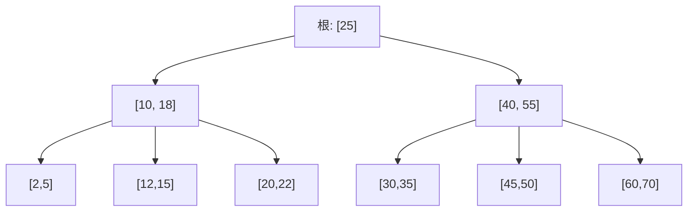

---
数据结构教程 — B树/B+树 (B-Tree / B+ Tree)
---

##  章节概述

B树（B-Tree）和B+树（B+ Tree）是为磁盘存储优化的自平衡多路搜索树。与二叉搜索树
不同，B树的每个节点可以有多个子节点和多个键值，这使得树更加"扁平"，大幅减少了
磁盘IO次数。

B树和B+树是现代数据库系统和文件系统的核心数据结构。MySQL的InnoDB引擎、
PostgreSQL、MongoDB等都使用B+树作为索引结构。本章将从B树的设计动机讲起，
深入B树和B+树的实现原理，全面覆盖分裂、合并等操作，
最后通过实例和习题巩固所学知识。

>  **底层实现参考**：如果需要深入理解本章数据结构的底层实现（纯C手写、内存布局、指针操作），请参阅 [[../../C语言深化教程/3数据结构/09_高级数据结构|C语言教程: 高级数据结构]]。C教程侧重手动实现与内存本质，本教程侧重STL使用与算法优化，两者互补。

---
###  第一节: 基础语法 + 计算机底层原理
---

1.1 为什么需要B树？
-----------------------

磁盘IO的特点：
- 磁盘访问速度比内存慢10^5倍
- 磁盘以"页"（通常4KB）为单位读写
- 减少IO次数是优化的关键

二叉搜索树的问题：
- 树太高（高度为log₂n），每层需要一次磁盘IO
- 100万数据需要约20次IO

B树的解决方案：
- 增加每个节点的键数（如1000个键/节点）
- 降低树高（100万数据只需2-3层）
- 每个节点大小≈一个磁盘页

1.2 B树的定义

一棵m阶B树满足：
- 每个节点最多有m个子节点
- 每个非叶非根节点至少有 ceil(m/2) 个子节点
- 根节点至少有2个子节点（除非是叶子）
- 有k个子节点的非叶节点包含k-1个键
- 所有叶子在同一层

**4 阶 B 树结构示意**（每个节点最多 3 个键、4 个子节点）：



> 每个节点对应磁盘的一个页。查找 key=50 时：读根页 → 读 [40,55] 页 → 读 [45,50] 页，
> 仅需 3 次磁盘 IO，而二叉搜索树需要约 log2(n) 次。

**B-tree vs B+tree 对比**：

| 特性 | B-Tree | B+ Tree |
|------|--------|---------|
| 数据存储 | 所有节点都存数据 | 只有叶子存数据，内部节点只存键 |
| 叶子链接 | 无 | 叶子用链表相连，支持范围遍历 |
| 范围查询 | 需中序遍历 | O(log n + k)，k为结果数 |
| 典型应用 | 文件系统(HFS+) | 数据库索引(MySQL InnoDB) |

1.3 B树实现

```pseudocode
STRUCT Node:
    keys       // 数组: 有序键
    children   // 数组: 子节点指针
    isLeaf     // 是否为叶子节点
    CONSTRUCTOR(leaf=true):
        isLeaf = leaf
        keys = EMPTY_LIST
        children = EMPTY_LIST
    END CONSTRUCTOR
END STRUCT

CLASS BTree:
    root    // 根节点
    t       // 最小度数 (最小度 t → 键数在 [t-1, 2t-1] 之间)

    FUNCTION splitChild(parent, idx):
        child = parent.children[idx]
        newChild = NEW Node(child.isLeaf)
        mid = t - 1    // 中间键的索引

        // 将 child 的后半部分键移入 newChild
        FOR i FROM mid + 1 TO LENGTH(child.keys) - 1:
            APPEND child.keys[i] TO newChild.keys
        END FOR

        // 非叶节点还需要移动子节点
        IF NOT child.isLeaf THEN
            FOR i FROM t TO LENGTH(child.children) - 1:
                APPEND child.children[i] TO newChild.children
            END FOR
            child.children = child.children[0..t-1]
        END IF

        // 将中间键提升到父节点
        INSERT child.keys[mid] INTO parent.keys AT idx
        INSERT newChild INTO parent.children AT idx + 1
        child.keys = child.keys[0..mid-1]
    END FUNCTION

    FUNCTION insertNonFull(node, key):
        i = LENGTH(node.keys) - 1
        IF node.isLeaf THEN
            // 在叶子中直接插入
            APPEND 0 TO node.keys    // 扩容
            WHILE i >= 0 AND key < node.keys[i]:
                node.keys[i + 1] = node.keys[i]
                i = i - 1
            END WHILE
            node.keys[i + 1] = key
        ELSE
            // 找到正确的子节点
            WHILE i >= 0 AND key < node.keys[i]:
                i = i - 1
            END WHILE
            i = i + 1
            // 如果子节点已满，先分裂
            IF LENGTH(node.children[i].keys) == 2 * t - 1 THEN
                splitChild(node, i)
                IF key > node.keys[i] THEN i = i + 1
            END IF
            insertNonFull(node.children[i], key)
        END IF
    END FUNCTION

    FUNCTION searchNode(node, key):
        i = 0
        WHILE i < LENGTH(node.keys) AND key > node.keys[i]:
            i = i + 1
        END WHILE
        IF i < LENGTH(node.keys) AND node.keys[i] == key THEN
            RETURN TRUE
        END IF
        IF node.isLeaf THEN RETURN FALSE
        RETURN searchNode(node.children[i], key)
    END FUNCTION

    FUNCTION traverse(node):
        FOR i FROM 0 TO LENGTH(node.keys) - 1:
            IF NOT node.isLeaf THEN traverse(node.children[i])
            DISPLAY node.keys[i], " "
        END FOR
        IF NOT node.isLeaf THEN traverse(node.children[LENGTH(node.keys)])
    END FUNCTION

    FUNCTION getHeight(node):
        IF node == NULL THEN RETURN 0
        IF node.isLeaf THEN RETURN 1
        RETURN 1 + getHeight(node.children[0])
    END FUNCTION

    CONSTRUCTOR(degree):
        root = NULL
        t = degree    // 最小度
    END CONSTRUCTOR

    FUNCTION insert(key):
        IF root == NULL THEN
            root = NEW Node(TRUE)
            APPEND key TO root.keys
            RETURN
        END IF
        IF LENGTH(root.keys) == 2 * t - 1 THEN
            // 根满了，需要新的根
            newRoot = NEW Node(FALSE)
            APPEND root TO newRoot.children
            splitChild(newRoot, 0)
            root = newRoot
        END IF
        insertNonFull(root, key)
    END FUNCTION

    FUNCTION search(key):
        IF root == NULL THEN RETURN FALSE
        RETURN searchNode(root, key)
    END FUNCTION

    FUNCTION traverse():
        IF root != NULL THEN traverse(root)
        DISPLAY NEWLINE
    END FUNCTION

    FUNCTION height():
        RETURN getHeight(root)
    END FUNCTION
END CLASS
```

---
**实现练习**: 用 C 或 C++ 自行实现上述结构。完成后与 AI 对话检查正确性。
---

1.4 B+树的特点

B+树与B树的区别：
- 所有数据都存储在叶子节点
- 内部节点只存索引（键），不存数据
- 叶子节点之间通过指针相连（形成有序链表）
- 内部节点的键是其子树中最大（或最小）键的副本

B+树的优势：
- 内部节点更小，一个磁盘页能存更多键（树更矮）
- 范围查询只需遍历叶子链表
- 所有查询路径长度相同（更稳定）

1.5 B+树实现

```pseudocode
STRUCT Node:
    isLeaf
    keys       // 数组: 有序键
    children   // 数组: 子节点指针 (仅内部节点使用)
    next       // 叶子链表指针 (仅叶子节点使用)
    CONSTRUCTOR(leaf=false):
        isLeaf = leaf
        next = NULL
        keys = EMPTY_LIST
        children = EMPTY_LIST
    END CONSTRUCTOR
END STRUCT

CLASS BPlusTree:
    root      // 根节点
    order     // 阶数 (每节点最多 order 个键)

    FUNCTION findLeaf(key):
        curr = root
        WHILE NOT curr.isLeaf:
            i = 0
            WHILE i < LENGTH(curr.keys) AND key >= curr.keys[i]:
                i = i + 1
            END WHILE
            curr = curr.children[i]
        END WHILE
        RETURN curr
    END FUNCTION

    FUNCTION insertIntoLeaf(leaf, key):
        pos = LOWER_BOUND(leaf.keys, key)    // 二分查找插入位置
        INSERT key INTO leaf.keys AT pos
    END FUNCTION

    FUNCTION findParent(curr, child):     // 递归查找父节点
        IF curr.isLeaf OR curr.children[0].isLeaf THEN
            FOR EACH c IN curr.children:
                IF c == child THEN RETURN curr
            END FOR
            RETURN NULL
        END IF
        FOR EACH c IN curr.children:
            IF c == child THEN RETURN curr
            result = findParent(c, child)
            IF result != NULL THEN RETURN result
        END FOR
        RETURN NULL
    END FUNCTION

    FUNCTION insertIntoParent(left, key, right):
        IF left == root THEN
            newRoot = NEW Node(FALSE)
            APPEND key TO newRoot.keys
            APPEND left TO newRoot.children
            APPEND right TO newRoot.children
            root = newRoot
            RETURN
        END IF
        parent = findParent(root, left)
        idx = 0
        WHILE idx < LENGTH(parent.children) AND parent.children[idx] != left:
            idx = idx + 1
        END WHILE
        INSERT key INTO parent.keys AT idx
        INSERT right INTO parent.children AT idx + 1

        IF LENGTH(parent.keys) >= order THEN
            newInternal = NEW Node(FALSE)
            mid = LENGTH(parent.keys) // 2
            upKey = parent.keys[mid]
            FOR i FROM mid + 1 TO LENGTH(parent.keys) - 1:
                APPEND parent.keys[i] TO newInternal.keys
            END FOR
            FOR i FROM mid + 1 TO LENGTH(parent.children) - 1:
                APPEND parent.children[i] TO newInternal.children
            END FOR
            parent.keys = parent.keys[0..mid-1]
            parent.children = parent.children[0..mid]
            insertIntoParent(parent, upKey, newInternal)
        END IF
    END FUNCTION

    CONSTRUCTOR(ord=4):
        root = NULL
        order = ord
    END CONSTRUCTOR

    FUNCTION insert(key):
        IF root == NULL THEN
            root = NEW Node(TRUE)
            APPEND key TO root.keys
            RETURN
        END IF
        leaf = findLeaf(key)
        insertIntoLeaf(leaf, key)
        IF LENGTH(leaf.keys) >= order THEN
            newLeaf = NEW Node(TRUE)
            mid = LENGTH(leaf.keys) // 2
            FOR i FROM mid TO LENGTH(leaf.keys) - 1:
                APPEND leaf.keys[i] TO newLeaf.keys
            END FOR
            leaf.keys = leaf.keys[0..mid-1]
            newLeaf.next = leaf.next
            leaf.next = newLeaf
            insertIntoParent(leaf, newLeaf.keys[0], newLeaf)
        END IF
    END FUNCTION

    FUNCTION search(key):
        IF root == NULL THEN RETURN FALSE
        leaf = findLeaf(key)
        RETURN BINARY_SEARCH(leaf.keys, key)
    END FUNCTION

    FUNCTION rangeSearch(low, high):
        result = EMPTY_LIST
        IF root == NULL THEN RETURN result
        leaf = findLeaf(low)
        WHILE leaf != NULL:
            FOR EACH k IN leaf.keys:
                IF k > high THEN RETURN result
                IF k >= low THEN APPEND k TO result
            END FOR
            leaf = leaf.next
        END WHILE
        RETURN result
    END FUNCTION

    FUNCTION printLeaves():
        IF root == NULL THEN RETURN
        curr = root
        WHILE NOT curr.isLeaf:
            curr = curr.children[0]
        END WHILE
        WHILE curr != NULL:
            DISPLAY "["  (curr.keys)  "] -> "
            curr = curr.next
        END WHILE
        DISPLAY "NULL"  NEWLINE
    END FUNCTION
END CLASS
```

---
**实现练习**: 用 C 或 C++ 自行实现上述结构。完成后与 AI 对话检查正确性。
---

---
###  第二节: 实现思路
---

2.1 B树的删除操作

```pseudocode
CLASS BTreeWithDelete:
    root, t

    FUNCTION findKey(node, key):
        idx = 0
        WHILE idx < LENGTH(node.keys) AND node.keys[idx] < key:
            idx = idx + 1
        END WHILE
        RETURN idx
    END FUNCTION

    FUNCTION getPredecessor(node):
        WHILE NOT node.isLeaf:
            node = node.children[LENGTH(node.children) - 1]
        END WHILE
        RETURN node.keys[LAST]
    END FUNCTION

    FUNCTION getSuccessor(node):
        WHILE NOT node.isLeaf:
            node = node.children[0]
        END WHILE
        RETURN node.keys[0]
    END FUNCTION

    FUNCTION merge(node, idx):
        left = node.children[idx]
        right = node.children[idx + 1]
        // 把 父键 + 右节点 合并到左节点
        APPEND node.keys[idx] TO left.keys
        FOR EACH k IN right.keys: APPEND k TO left.keys
        IF NOT left.isLeaf THEN
            FOR EACH c IN right.children: APPEND c TO left.children
        END IF
        REMOVE node.keys[idx] FROM node.keys
        REMOVE node.children[idx + 1] FROM node.children
        FREE right
    END FUNCTION

    FUNCTION borrowFromPrev(node, idx):
        child = node.children[idx]
        sibling = node.children[idx - 1]
        // 父键下沉到 child, sibling 的最大键上升
        INSERT node.keys[idx - 1] INTO child.keys AT 0
        node.keys[idx - 1] = sibling.keys[LAST]
        REMOVE sibling.keys[LAST]
        IF NOT child.isLeaf THEN
            INSERT sibling.children[LAST] INTO child.children AT 0
            REMOVE sibling.children[LAST]
        END IF
    END FUNCTION

    FUNCTION borrowFromNext(node, idx):
        child = node.children[idx]
        sibling = node.children[idx + 1]
        // 父键下沉到 child, sibling 的最小键上升
        APPEND node.keys[idx] TO child.keys
        node.keys[idx] = sibling.keys[0]
        REMOVE sibling.keys[0]
        IF NOT child.isLeaf THEN
            APPEND sibling.children[0] TO child.children
            REMOVE sibling.children[0]
        END IF
    END FUNCTION

    FUNCTION fill(node, idx):
        IF idx > 0 AND LENGTH(node.children[idx - 1].keys) >= t THEN
            borrowFromPrev(node, idx)
        ELSE IF idx < LENGTH(node.children) - 1 AND
                 LENGTH(node.children[idx + 1].keys) >= t THEN
            borrowFromNext(node, idx)
        ELSE
            IF idx < LENGTH(node.children) - 1 THEN
                merge(node, idx)
            ELSE
                merge(node, idx - 1)
            END IF
        END IF
    END FUNCTION

    FUNCTION removeFromNode(node, key):
        idx = findKey(node, key)
        IF idx < LENGTH(node.keys) AND node.keys[idx] == key THEN
            // 在当前节点找到了 key
            IF node.isLeaf THEN
                REMOVE node.keys[idx]
            ELSE IF LENGTH(node.children[idx].keys) >= t THEN
                pred = getPredecessor(node.children[idx])
                node.keys[idx] = pred
                removeFromNode(node.children[idx], pred)
            ELSE IF LENGTH(node.children[idx + 1].keys) >= t THEN
                succ = getSuccessor(node.children[idx + 1])
                node.keys[idx] = succ
                removeFromNode(node.children[idx + 1], succ)
            ELSE
                merge(node, idx)
                removeFromNode(node.children[idx], key)
            END IF
        ELSE
            // key 在子树中
            IF node.isLeaf THEN RETURN
            lastChild = (idx == LENGTH(node.children) - 1)
            IF LENGTH(node.children[idx].keys) < t THEN
                fill(node, idx)
            END IF
            IF lastChild AND idx > LENGTH(node.children) - 1 THEN
                removeFromNode(node.children[idx - 1], key)
            ELSE
                removeFromNode(node.children[idx], key)
            END IF
        END IF
    END FUNCTION

    FUNCTION insert(key):    // (略, 同 1.3)
        ...
    END FUNCTION

    FUNCTION remove(key):
        IF root == NULL THEN RETURN
        removeFromNode(root, key)
        // 删除后根变空: 子节点成为新根
        IF LENGTH(root.keys) == 0 THEN
            old = root
            root = IF root.isLeaf THEN NULL ELSE root.children[0]
            FREE old
        END IF
    END FUNCTION
END CLASS
```

---
**实现练习**: 用 C 或 C++ 自行实现上述结构。完成后与 AI 对话检查正确性。
---

2.2 磁盘IO模拟

```pseudocode
STRUCT DiskPage:
    pageId
    keys          // 数组
    childPageIds  // 数组: 子页面 ID
    isLeaf
    values        // 数组: 值 (仅叶子)
END STRUCT

CLASS DiskBTree:
    disk         // 哈希表: pageId → DiskPage (模拟磁盘)
    nextPageId = 0
    rootPageId = -1
    order
    ioCount = 0

    FUNCTION readPage(pageId):    // 模拟一次磁盘读取
        ioCount = ioCount + 1
        RETURN disk[pageId]
    END FUNCTION

    FUNCTION allocatePage():
        id = nextPageId
        nextPageId = nextPageId + 1
        disk[id] = {id, [], [], TRUE, []}
        RETURN id
    END FUNCTION

    CONSTRUCTOR(ord=100):
        order = ord
    END CONSTRUCTOR

    FUNCTION insert(key, value):    // 简化演示
        IF rootPageId == -1 THEN
            rootPageId = allocatePage()
            page = readPage(rootPageId)
            APPEND key TO page.keys
            APPEND value TO page.values
            RETURN
        END IF
        ioCount = 0
        rootPage = readPage(rootPageId)
        DISPLAY "插入", key, "需要", ioCount, "次IO (简化演示)"
    END FUNCTION

    FUNCTION search(key):
        ioCount = 0
        IF rootPageId == -1 THEN RETURN ""
        currentPageId = rootPageId
        WHILE TRUE:
            page = readPage(currentPageId)
            i = 0
            WHILE i < LENGTH(page.keys) AND key > page.keys[i]:
                i = i + 1
            END WHILE
            IF i < LENGTH(page.keys) AND page.keys[i] == key THEN
                DISPLAY "查找", key, "需要", ioCount, "次磁盘IO"
                RETURN IF EMPTY(page.values) THEN "" ELSE page.values[i]
            END IF
            IF page.isLeaf THEN BREAK
            currentPageId = page.childPageIds[i]
        END WHILE
        RETURN ""
    END FUNCTION
END CLASS

// 复杂度分析输出:
阶数 = 100:
  100 个键:    树高 1, 查找需 1 次 IO
  10000 个键:  树高 2, 查找需 2 次 IO
  1000000 个键: 树高 3, 查找需 3 次 IO
  对比二叉树:  1000000 个键需约 20 次 IO
```

---
**实现练习**: 用 C 或 C++ 自行实现上述结构。完成后与 AI 对话检查正确性。
---

2.3 B+树索引模拟（数据库场景）

```pseudocode
STRUCT Record:
    id, name, age, salary
END STRUCT

CLASS DatabaseIndex:
    primaryIndex    // 有序映射: id → Record
    nameIndex       // 多重映射: name → id
    ageIndex        // 多重映射: age → id

    FUNCTION insertRecord(id, name, age, salary):
        primaryIndex[id] = {id, name, age, salary}
        INSERT (name, id) INTO nameIndex
        INSERT (age, id) INTO ageIndex
    END FUNCTION

    FUNCTION findById(id):
        IF primaryIndex CONTAINS id THEN RETURN primaryIndex[id]
        RETURN NULL
    END FUNCTION

    FUNCTION findByName(name):
        results = EMPTY_LIST
        range = nameIndex.EQUAL_RANGE(name)
        FOR EACH (key, id) IN range:
            APPEND primaryIndex[id] TO results
        END FOR
        RETURN results
    END FUNCTION

    FUNCTION findByAgeRange(minAge, maxAge):
        results = EMPTY_LIST
        low = ageIndex.LOWER_BOUND(minAge)
        high = ageIndex.UPPER_BOUND(maxAge)
        FOR EACH (key, id) IN [low, high):
            APPEND primaryIndex[id] TO results
        END FOR
        RETURN results
    END FUNCTION

    FUNCTION printRecord(r):
        DISPLAY "ID=", r.id, " 姓名=", r.name, " 年龄=", r.age, " 薪资=", r.salary
    END FUNCTION
END CLASS

// 使用示例:
db = DatabaseIndex()
db.insertRecord(1, "张三", 28, 15000)
db.insertRecord(2, "李四", 35, 25000)
db.insertRecord(3, "王五", 22, 8000)
db.insertRecord(4, "张三", 30, 18000)
db.insertRecord(5, "赵六", 28, 12000)
// 按 ID 查找, 按姓名查找, 按年龄范围查找
```

---
**实现练习**: 用 C 或 C++ 自行实现上述结构。完成后与 AI 对话检查正确性。
---

---
###  第三节: 应用场景
---

3.1 案例一：简易文件系统目录结构

```pseudocode
STRUCT DirEntry:
    name      // 字符串
    isDir     // 是否为目录
    size      // 文件大小 (目录为 0)
    children  // 有序映射: name → DirEntry 指针
    CONSTRUCTOR(n, dir, s=0):
        name = n; isDir = dir; size = s
    END CONSTRUCTOR
END STRUCT

CLASS SimpleFileSystem:
    root    // DirEntry: "/"

    FUNCTION navigate(path):
        IF path == "/" THEN RETURN root
        curr = root
        tokens = SPLIT(path, '/')
        FOR EACH token IN tokens (skip first):
            IF token IS EMPTY THEN CONTINUE
            IF curr.children CONTAINS token THEN
                curr = curr.children[token]
            ELSE
                RETURN NULL
            END IF
        END FOR
        RETURN curr
    END FUNCTION

    CONSTRUCTOR():
        root = NEW DirEntry("/", TRUE)
    END CONSTRUCTOR

    FUNCTION mkdir(path, name):
        dir = navigate(path)
        IF dir == NULL OR NOT dir.isDir THEN RETURN FALSE
        IF dir.children CONTAINS name THEN RETURN FALSE
        dir.children[name] = NEW DirEntry(name, TRUE)
        RETURN TRUE
    END FUNCTION

    FUNCTION createFile(path, name, size):
        dir = navigate(path)
        IF dir == NULL OR NOT dir.isDir THEN RETURN FALSE
        dir.children[name] = NEW DirEntry(name, FALSE, size)
        RETURN TRUE
    END FUNCTION

    FUNCTION ls(path):
        dir = navigate(path)
        IF dir == NULL OR NOT dir.isDir THEN
            DISPLAY "路径无效"
            RETURN
        END IF
        DISPLAY path, " 目录内容:"
        FOR EACH (name, entry) IN dir.children:
            IF entry.isDir THEN
                DISPLAY "  [DIR] ", name
            ELSE
                DISPLAY "  [FILE] ", name, " (", entry.size, "B)"
            END IF
        END FOR
    END FUNCTION
END CLASS
```

---
**实现练习**: 用 C 或 C++ 自行实现上述结构。完成后与 AI 对话检查正确性。
---

3.2 案例二：数据库页面缓存（Buffer Pool）

```pseudocode
STRUCT Page:
    pageId
    data       // 数组: 页面数据
    dirty = FALSE
END STRUCT

CLASS BufferPool:
    capacity      // 缓冲池容量（页数）
    lruList       // 双端队列: 最近使用顺序
    lruMap        // 哈希表: pageId → lruList 中的位置
    pages         // 哈希表: pageId → Page
    diskReads = 0
    diskWrites = 0

    FUNCTION evict():
        victimId = lruList[LAST]
        POP lruList[LAST]
        REMOVE lruMap[victimId]
        IF pages[victimId].dirty THEN
            diskWrites = diskWrites + 1
            DISPLAY "  [写回] 页", victimId, "写入磁盘"
        END IF
        REMOVE pages[victimId]
    END FUNCTION

    CONSTRUCTOR(cap):
        capacity = cap
    END CONSTRUCTOR

    FUNCTION getPage(pageId):
        IF pages CONTAINS pageId THEN
            // 缓存命中，移到 LRU 最前
            REMOVE pageId FROM lruList
            PUSH pageId TO FRONT OF lruList
            UPDATE lruMap[pageId]
            RETURN pages[pageId]
        END IF
        // 缓存未命中
        IF LENGTH(pages) >= capacity THEN evict()
        diskReads = diskReads + 1
        pages[pageId] = {pageId, ARRAY of 100 elements, FALSE}
        PUSH pageId TO FRONT OF lruList
        UPDATE lruMap[pageId]
        DISPLAY "  [读取] 页", pageId, "从磁盘加载"
        RETURN pages[pageId]
    END FUNCTION

    FUNCTION markDirty(pageId):
        IF pages CONTAINS pageId THEN
            pages[pageId].dirty = TRUE
        END IF
    END FUNCTION

    FUNCTION printStats():
        totalAccesses = diskReads + LENGTH(pages)
        hitRate = (1.0 - diskReads / totalAccesses) * 100
        DISPLAY "缓存命中率: ", hitRate, "%"
        DISPLAY "磁盘读: ", diskReads, ", 磁盘写: ", diskWrites
    END FUNCTION
END CLASS
```

---
**实现练习**: 用 C 或 C++ 自行实现上述结构。完成后与 AI 对话检查正确性。
---

3.3 案例三：键值存储引擎

```pseudocode
CLASS KVStore:
    memtable       // 有序映射: key → value (内存中的 B+树或跳表)
    memtableLimit  // 内存表大小上限
    sstableCount = 0

    FUNCTION flushToSSTable():
        filename = "sstable_" + STRING(sstableCount) + ".dat"
        sstableCount = sstableCount + 1
        DISPLAY "  [Flush] 内存表写入 ", filename, " (", LENGTH(memtable), "条记录)"
        memtable = EMPTY_MAP
    END FUNCTION

    CONSTRUCTOR(limit=4):
        memtableLimit = limit
    END CONSTRUCTOR

    FUNCTION put(key, value):
        memtable[key] = value
        DISPLAY "PUT ", key, "=", value
        IF LENGTH(memtable) >= memtableLimit THEN
            flushToSSTable()
        END IF
    END FUNCTION

    FUNCTION get(key):
        IF memtable CONTAINS key THEN
            DISPLAY "GET ", key, " -> ", memtable[key], " (从内存)"
            RETURN memtable[key]
        END IF
        DISPLAY "GET ", key, " -> 需查询SSTable文件"
        RETURN ""
    END FUNCTION

    FUNCTION scan(start, end):
        DISPLAY "SCAN [", start, ", ", end, "]:"
        low = memtable.LOWER_BOUND(start)
        high = memtable.UPPER_BOUND(end)
        FOR EACH (k, v) IN [low, high):
            DISPLAY "  ", k, " = ", v
        END FOR
    END FUNCTION
END CLASS
```

---
**实现练习**: 用 C 或 C++ 自行实现上述结构。完成后与 AI 对话检查正确性。
---

---
###  第四节: 课后习题
---

1. 基础题：实现一棵3阶B树，支持插入和查找操作，并在每次插入后打印树的结构。

2. 应用题：实现B+树的范围查询功能。
   - 给定区间[low, high]，返回所有在该范围内的键值
   - 利用叶子节点的链表指针实现高效遍历

3. 进阶题：实现B树的删除操作。
   - 处理叶子节点删除（可能需要合并或借用）
   - 处理内部节点删除（用前驱/后继替代）

4. 综合题：设计一个简单的数据库索引系统。
   - 使用B+树作为主键索引
   - 支持等值查询和范围查询
   - 模拟磁盘页面读取计数

---


***
##  知识网络
***

- **上一章**: [[E_红黑树_RedBlackTree]] | **下一章**: [[P_图的高级算法_AdvancedGraph]] | **返回**: [[DSA学习路线]] (Phase 5 选修)
- **算法技巧**: [[../算法技巧/二分查找]]
- **相关**: [[数据库原理]] | [[文件系统]] | [[数据结构/E_红黑树_RedBlackTree]]

---
## 章节测试
---

### 判断题

> [!question] 判断题 1
> B树是一种二叉搜索树的推广。（ ）
> - [ ]  正确
> - [ ]  错误
>
> > [!success]- 点击查看答案
> > 答案: 正确
> > 
> > **解析**: B树是多路搜索树，每个节点可有多个键和子节点。当m=2时B树退化为二叉搜索树。

> [!question] 判断题 2
> B+树的所有数据都存储在叶子节点中。（ ）
> - [ ]  正确
> - [ ]  错误
>
> > [!success]- 点击查看答案
> > 答案: 正确
> > 
> > **解析**: B+树中内部节点只存储索引键，实际数据（或指向数据的指针）只存在叶子节点。

> [!question] 判断题 3
> B树中所有叶子节点在同一层。（ ）
> - [ ]  正确
> - [ ]  错误
>
> > [!success]- 点击查看答案
> > 答案: 正确
> > 
> > **解析**: B树的定义保证所有叶子在同一深度，这是其平衡性的体现。

> [!question] 判断题 4
> m阶B树中每个节点最多有m-1个键。（ ）
> - [ ]  正确
> - [ ]  错误
>
> > [!success]- 点击查看答案
> > 答案: 正确
> > 
> > **解析**: m阶B树每个节点最多m个子节点，因此最多m-1个键（键分隔子树）。

> [!question] 判断题 5
> B+树比B树更适合范围查询。（ ）
> - [ ]  正确
> - [ ]  错误
>
> > [!success]- 点击查看答案
> > 答案: 正确
> > 
> > **解析**: B+树叶子节点通过链表相连，范围查询只需找到起点后顺序遍历链表。B树的范围查询需要中序遍历整棵树。

> [!question] 判断题 6
> B树节点分裂时，中间键上升到父节点。（ ）
> - [ ]  正确
> - [ ]  错误
>
> > [!success]- 点击查看答案
> > 答案: 正确
> > 
> > **解析**: 当节点满（2t-1个键）时分裂：中间键提升到父节点，左右两半成为两个子节点。

> [!question] 判断题 7
> MySQL的InnoDB引擎使用B树（而非B+树）作为索引。（ ）
> - [ ]  正确
> - [ ]  错误
>
> > [!success]- 点击查看答案
> > 答案: 错误
> > 
> > **解析**: InnoDB使用B+树作为索引结构。B+树更适合数据库场景：内部节点只存键可以容纳更多索引项，叶子链表支持高效范围扫描。

> [!question] 判断题 8
> B树的高度为O(log_m n)，其中m是阶数，n是键的数量。（ ）
> - [ ]  正确
> - [ ]  错误
>
> > [!success]- 点击查看答案
> > 答案: 正确
> > 
> > **解析**: 每个节点至少有⌈m/2⌉个子节点，因此高度为O(log_{m/2} n) = O(log_m n)。

> [!question] 判断题 9
> B树删除操作可能导致树高度减少。（ ）
> - [ ]  正确
> - [ ]  错误
>
> > [!success]- 点击查看答案
> > 答案: 正确
> > 
> > **解析**: 当根节点因合并而只剩一个子节点时，该子节点成为新的根，树高减1。

> [!question] 判断题 10
> 对于存储1亿条记录的B+树（阶数1000），树高约为3层。（ ）
> - [ ]  正确
> - [ ]  错误
>
> > [!success]- 点击查看答案
> > 答案: 正确
> > 
> > **解析**: 1000^3 = 10^9 > 10^8，所以3层B+树足以容纳1亿条记录。查找只需3次磁盘IO。

### 选择题

> [!question] 选择题 1
> 5阶B树中，每个非根内部节点至少有多少个键？
> - [ ] A. 1
> - [ ] B. 2
> - [ ] C. 3
> - [ ] D. 4
>
> > [!success]- 点击查看答案
> > 正确答案: B
> > 
> > **解析**: m阶B树非根非叶节点至少有⌈m/2⌉=⌈5/2⌉=3个子节点，因此至少有2个键。

> [!question] 选择题 2
> B+树相比B树的主要优势不包括？
> - [ ] A. 内部节点可存更多键（更矮的树）
> - [ ] B. 范围查询更高效
> - [ ] C. 单点查询更快
> - [ ] D. 查询性能更稳定
>
> > [!success]- 点击查看答案
> > 正确答案: C
> > 
> > **解析**: B+树所有查询都必须走到叶子节点，单点查询不会比B树快（B树可能在内部节点就找到）。但B+树的优势在于稳定性、范围查询和更高的扇出。

> [!question] 选择题 3
> 在B树中执行插入操作时，节点分裂的条件是？
> - [ ] A. 节点为空
> - [ ] B. 节点中键的数量达到m
> - [ ] C. 节点中键的数量达到m-1
> - [ ] D. 节点中键的数量达到2t-1
>
> > [!success]- 点击查看答案
> > 正确答案: D
> > 
> > **解析**: 对于最小度为t的B树，每个节点最多2t-1个键。当节点满时（2t-1个键）需要分裂。注意m=2t，所以2t-1=m-1也是正确的表述。C和D等价。

> [!question] 选择题 4
> 以下哪个不是使用B树/B+树的系统？
> - [ ] A. MySQL InnoDB
> - [ ] B. Redis
> - [ ] C. PostgreSQL
> - [ ] D. NTFS文件系统
>
> > [!success]- 点击查看答案
> > 正确答案: B
> > 
> > **解析**: Redis是内存数据库，使用哈希表和跳表。MySQL、PostgreSQL使用B+树索引，NTFS使用B+树存储文件元数据。

> [!question] 选择题 5
> B树的设计主要针对什么优化？
> - [ ] A. CPU缓存命中率
> - [ ] B. 磁盘IO次数
> - [ ] C. 内存使用量
> - [ ] D. 网络传输效率
>
> > [!success]- 点击查看答案
> > 正确答案: B
> > 
> > **解析**: B树设计的核心目标是减少磁盘IO。通过增大节点（≈磁盘页大小），降低树高，使每次查找的磁盘访问次数最少。

> [!question] 选择题 6
> 一棵3阶B树（t=2），节点中键的数量范围是？
> - [ ] A. [1, 3]
> - [ ] B. [1, 2]
> - [ ] C. [2, 4]
> - [ ] D. [1, 4]
>
> > [!success]- 点击查看答案
> > 正确答案: A
> > 
> > **解析**: t=2时，非根节点至少t-1=1个键，最多2t-1=3个键。范围为[1,3]。

> [!question] 选择题 7
> B+树中聚簇索引（Clustered Index）的特点是？
> - [ ] A. 索引和数据分开存储
> - [ ] B. 数据按索引键的顺序物理排列在叶子节点
> - [ ] C. 一个表可以有多个聚簇索引
> - [ ] D. 只包含索引键，不包含数据
>
> > [!success]- 点击查看答案
> > 正确答案: B
> > 
> > **解析**: 聚簇索引的叶子节点直接包含完整的行数据，数据按主键顺序物理存储。每个表只能有一个聚簇索引。

> [!question] 选择题 8
> 当B树节点删除后键数不足时，首先尝试的操作是？
> - [ ] A. 直接删除节点
> - [ ] B. 从父节点借一个键
> - [ ] C. 从兄弟节点借一个键（通过父节点旋转）
> - [ ] D. 重建整棵树
>
> > [!success]- 点击查看答案
> > 正确答案: C
> > 
> > **解析**: 删除后节点键数不足时，首先尝试从左/右兄弟借键（通过父节点中转）。如果兄弟也不够借，才进行合并操作。

> [!question] 选择题 9
> 对于页大小4KB、键大小8B、指针大小8B的B+树，每个内部节点大约能存多少个键？
> - [ ] A. 约50个
> - [ ] B. 约250个
> - [ ] C. 约500个
> - [ ] D. 约1000个
>
> > [!success]- 点击查看答案
> > 正确答案: B
> > 
> > **解析**: 每个内部节点占用4096B。一个键+一个指针占8+8=16B，4096/16≈256，所以大约250个键。

> [!question] 选择题 10
> B树插入操作在什么情况下会增加树的高度？
> - [ ] A. 任何叶子节点满时
> - [ ] B. 根节点满时
> - [ ] C. 任何内部节点满时
> - [ ] D. 树的节点总数超过阈值时
>
> > [!success]- 点击查看答案
> > 正确答案: B
> > 
> > **解析**: 只有根节点分裂时树高才会增加。根分裂后产生新的根节点，高度+1。其他节点分裂只是增加同层节点数。

### 编程大题

> [!question] 编程大题 1
> **题目**: 实现一棵完整的B树（阶数为用户指定），支持：
> 1. 插入操作（含节点分裂）
> 2. 查找操作
> 3. 层序遍历打印树结构
> 
> 测试：依次插入1-20，打印每次分裂后的树结构。
>
> > [!success]- 点击查看提示
> > 关键是正确实现splitChild：将满节点一分为二，中间键提升到父节点。插入时自顶向下检查，遇到满节点就提前分裂（预分裂策略）。

> [!question] 编程大题 2
> **题目**: 实现B+树的完整功能：
> 1. 插入（含叶子分裂和内部节点分裂）
> 2. 精确查找
> 3. 范围查找（利用叶子链表）
> 4. 打印叶子链表验证有序性
>
> > [!success]- 点击查看提示
> > B+树分裂与B树不同：叶子分裂时中间键保留在右子节点（因为所有数据在叶子）并复制到父节点；内部节点分裂时中间键提升到父节点（不保留）。维护叶子节点的next指针形成链表。

> [!question] 编程大题 3
> **题目**: 模拟数据库索引性能对比。创建一个含100万条记录的"表"，分别使用：
> 1. 线性扫描
> 2. 二叉搜索树索引
> 3. B+树索引（模拟磁盘页）
> 
> 对比三种方式的"磁盘IO次数"（假设页大小可存100个键）。
>
> > [!success]- 点击查看提示
> > 线性扫描：最坏需要扫描n/100页。BST：平均log₂n≈20次IO。B+树：页大小100键时log₁₀₀(10^6)≈3次IO。通过计数器模拟磁盘读取次数，对比三种方案的效率差异。
