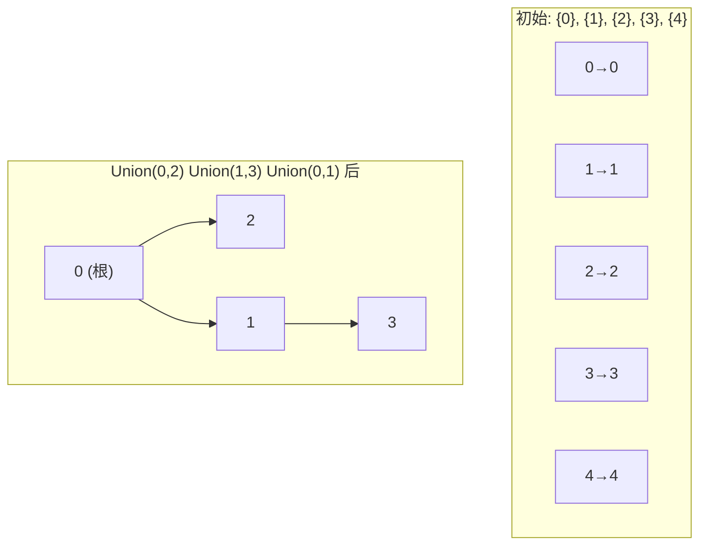
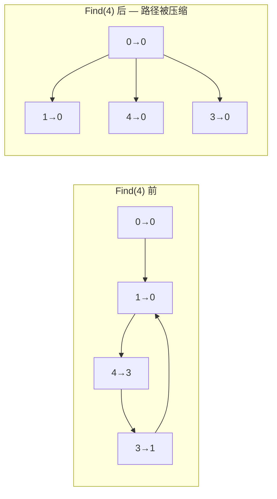
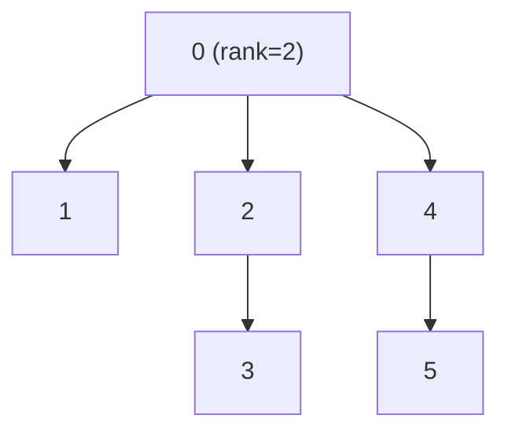

建议先阅读: [[D_容器_Container|容器概览]], [[S_图_Graph|图]] — 并查集是图连通性判断的基础工具。

---

## 原理

### 并查集是什么

想象一个社交网络：你和朋友 A 是好友，A 和 B 是好友，B 和 C 是好友——虽然你直接认识的只有 A，但通过好友链你能间接认识 B 和 C。并查集就是管理这种"间接关系"的数据结构：它维护若干个**不相交的集合**（每个集合叫一个"连通分量"），支持两种操作——`Find(x)` 查 x 属于哪个集合，`Union(x,y)` 把 x 和 y 所在的集合合并。

**为什么需要并查集**：判断两点是否连通可以用 DFS/BFS——但 DFS/BFS 每次查询是 $O(n+m)$，如果需要频繁查询（如 Kruskal 算法中每加一条边都要判断是否成环），总代价是 $O(m(n+m))$。并查集将每次查询+合并压缩到**均摊 $O(\alpha(n)) \approx O(1)$**——对 100 万次操作几乎瞬间完成。

**与图算法的关系**：并查集是 Kruskal 最小生成树的核心——每加一条边前用 `Find` 检查两端是否已在同一集合，避免成环。详见 [[S_图_Graph#最小生成树|图 — MST]]。

### 并查集在哪里

- **Kruskal 最小生成树**：逐条加边，每次用 `Find` 检查边的两端是否已在同一集合——如果不在则加入（安全），否则跳过（会成环）。这是并查集最经典的应用
- **社交网络好友分组**：微信中你和 A 是好友，A 和 B 是好友——并查集将所有间接好友划分到同一集合，`Union` 添加新好友关系，`Find` 判断两人是否在同一圈子
- **图像分割**：像素级连通区域标记——相邻且颜色相似的像素 `Union`，最终每个根节点对应一个分割区域
- **编译器等价类**：类型推断中 `typedef A B;` 将 A 和 B `Union`，后续查询类型等价性只需 `Find` 一次
- **网络连通性**：路由器动态添加链路，`Union` 合并网段，`Find` 判断两台机器是否可达

### 森林表示

每个集合以有根树存储——树中的每个节点指向其父节点，根节点的父节点指向自身。`Find(x)` 沿父指针找根；`Union(x, y)` 将一棵树的根链到另一棵树的根下。



### 路径压缩

每次 `Find(x)` 时，将路径上所有节点直接指向根——将"扁平化"推迟到查询时：

```c
int find(int* parent, int x) {
 if (parent[x] != x)
 parent[x] = find(parent, parent[x]); // 递归压缩: x→根
 return parent[x];
}
```



### 按秩合并

`Union` 时将较矮树的根作为子树接到较高树的根下——保持树高不增加。秩（rank）近似表示以该节点为根的树的高度：

```c
void union_sets(int* parent, int* rank, int x, int y) {
 int rx = find(parent, x), ry = find(parent, y);
 if (rx == ry) return;
 if (rank[rx] < rank[ry]) parent[rx] = ry;
 else if (rank[rx] > rank[ry]) parent[ry] = rx;
 else { parent[ry] = rx; rank[rx]++; }
}
```

#### 路径压缩手算轨迹

初始：5 个独立节点 `[0,1,2,3,4]`，每个 `parent[i] = i`。

**Step 1**：`Union(0,1)` → 1 的根是 1，0 的根是 0，rank 相同 → `parent[0] = 1`，rank[1]++

```
parent: [1,1,2,3,4]   rank: [0,1,0,0,0]
  1
  ↑
  0    2    3    4
```

**Step 2**：`Union(2,3)` → 类似，`parent[2] = 3`，rank[3]++

```
parent: [1,1,3,3,4]   rank: [0,1,0,1,0]
  1    3    4
  ↑    ↑
  0    2
```

**Step 3**：`Union(1,2)` → Find(1)=1(rank1), Find(2)=3(rank1) → rank 相同 → `parent[3] = 1`，rank[1]++

```
parent: [1,1,3,1,4]   rank: [0,2,0,1,0]
  1 (rank=2)
  ↑↑
  0 3
     ↑
     2    4
```

**Step 4**：`Find(2)` — 路径压缩轨迹：
- `parent[2]=3`，递归 `Find(3)`
- `parent[3]=1`，递归 `Find(1)`
- `parent[1]=1`（根）→ 返回 1
- 回溯：`parent[3] = 1`（已指向根）
- 回溯：`parent[2] = 1`（压缩！2 直接指向根）

```
压缩前: 2→3→1(根)
压缩后: 2→1(根)   3→1(根)

parent: [1,1,1,1,4]   rank: [0,2,0,1,0]
  1 (rank=2)
  ↑↑↑↑
  0 2 3    4
```

一次 `Find(2)` 将深度从 3 压缩到 1——后续所有对 2、3 的查找都是 $O(1)$。

#### 按秩合并手算轨迹

初始：6 个节点 `[0,1,2,3,4,5]`。

| 步 | 操作 | Find 根 | rank 比较 | 动作 | parent 数组 |
|:--:|------|:------:|:---------:|------|:---------:|
| 1 | Union(0,1) | 0,1 | 0=0 | parent[1]=0, rank[0]++ | `[0,0,2,3,4,5]` |
| 2 | Union(2,3) | 2,3 | 0=0 | parent[3]=2, rank[2]++ | `[0,0,2,2,4,5]` |
| 3 | Union(4,5) | 4,5 | 0=0 | parent[5]=4, rank[4]++ | `[0,0,2,2,4,4]` |
| 4 | Union(0,2) | 0,2 | 1=1 | parent[2]=0, rank[0]++ | `[0,0,0,2,4,4]` |
| 5 | Union(4,0) | 4,0 | 1<2 | rank[0]>rank[4] → parent[4]=0 | `[0,0,0,2,0,4]` |

最终树：


6 个元素合并为 1 个集合，最大深度 2（按秩合并保证树高 $\leq \log n$）。

**核心推演：并查集操作**

初始 7 个节点 `[0,1,2,3,4,5,6]`，依次执行：
`Union(0,1)`, `Union(2,3)`, `Union(4,5)`, `Union(0,2)`, `Union(4,6)`, `Union(0,4)`

① 画出最终的 parent 数组和树结构。② Find(5) 的路径压缩前后父指针变化。

> 答案：
>
> ① 按秩合并过程（rank 相同时左根接右根）：
> - Union(0,1): parent[1]=0, rank[0]=1 → `[0,0,2,3,4,5,6]`
> - Union(2,3): parent[3]=2, rank[2]=1 → `[0,0,2,2,4,5,6]`
> - Union(4,5): parent[5]=4, rank[4]=1 → `[0,0,2,2,4,4,6]`
> - Union(0,2): rank[0]=1 = rank[2]=1 → parent[2]=0, rank[0]=2 → `[0,0,0,2,4,4,6]`
> - Union(4,6): rank[4]=1 > rank[6]=0 → parent[6]=4 → `[0,0,0,2,4,4,4]`
> - Union(0,4): rank[0]=2 > rank[4]=1 → parent[4]=0 → `[0,0,0,2,0,4,4]`
>
> 最终 parent：`[0,0,0,2,0,4,4]`
> ```mermaid
> graph TD
>     0["0 (rank=2) ← 根"] --> 1
>     0 --> 2
>     0 --> 4
>     2 --> 3
>     4 --> 5
>     4 --> 6
> ```
>
> ② Find(5) 路径压缩：5→4→0(根)。压缩后 parent[5]=0，parent[4] 已指向 0。压缩前后 parent[5] 从 4 变为 0。

### 时间复杂度：逆阿克曼函数

路径压缩 + 按秩合并联合使用时，`m` 次操作的均摊时间复杂度为 $O(m \cdot \alpha(n))$，其中 $\alpha(n)$ 是逆阿克曼函数（inverse Ackermann function）：

$$
\alpha(n) \leq 4 \quad \text{for any practical } n < 2^{2^{2^{2^{16}}}}
$$

$\alpha(n)$ 增长极度缓慢——在实际宇宙中所有可想象的输入下，$\alpha(n) \leq 4$。也就是说，对于任何实际场景，并查集的操作复杂度在实践中等价于常数 $O(1)$。这是算法理论中罕见的"理论上不是常数但实践中就是常数"的案例。

| 优化组合 | Find 平均 | Union 平均 |
|---------|:---------:|:---------:|
| 无优化 | $O(n)$ | $O(n)$ |
| 仅路径压缩 | $O(\log n)$ 均摊 | $O(\log n)$ |
| 仅按秩合并 | $O(\log n)$ | $O(\log n)$ |
| 双重优化 | **均摊 $O(\alpha(n))$** | **均摊 $O(\alpha(n))$** |

### 带权并查集

在普通并查集的基础上增加边权：`parent[x]` 存储 x 的父节点，`weight[x]` 存储 x 到父节点的关系权重。常见变体：
- **集合大小**：`size[root]` 存该集合的元素数
- **类别关系**：食物链问题——种类权值 0/1/2 表示同类/捕食/被捕食
- **异或和**：每个节点维护到根的 XOR 和，判断连通子图异或性质

## 实现

```c
#include <stdlib.h>

typedef struct {
 int* parent;
 int* rank;
 int* size; // 每个根节点的集合大小
 int n;
} UnionFind;

void uf_init(UnionFind* uf, int n) {
 uf->n = n;
 uf->parent = malloc(n * sizeof(int));
 uf->rank = calloc(n, sizeof(int));
 uf->size = malloc(n * sizeof(int));
 for (int i = 0; i < n; i++) {
 uf->parent[i] = i;
 uf->size[i] = 1;
 }
}

int uf_find(UnionFind* uf, int x) {
 if (uf->parent[x] != x)
 uf->parent[x] = uf_find(uf, uf->parent[x]);
 return uf->parent[x];
}

void uf_union(UnionFind* uf, int x, int y) {
 int rx = uf_find(uf, x), ry = uf_find(uf, y);
 if (rx == ry) return;
 if (uf->rank[rx] < uf->rank[ry]) {
 uf->parent[rx] = ry;
 uf->size[ry] += uf->size[rx];
 } else if (uf->rank[rx] > uf->rank[ry]) {
 uf->parent[ry] = rx;
 uf->size[rx] += uf->size[ry];
 } else {
 uf->parent[ry] = rx;
 uf->rank[rx]++;
 uf->size[rx] += uf->size[ry];
 }
}

int uf_connected(UnionFind* uf, int x, int y) {
 return uf_find(uf, x) == uf_find(uf, y);
}

int uf_count_components(UnionFind* uf) {
 int count = 0;
 for (int i = 0; i < uf->n; i++)
  if (uf->parent[i] == i) count++;
 return count;
}

int uf_get_size(UnionFind* uf, int x) {
 return uf->size[uf_find(uf, x)];
}

int uf_find_iterative(UnionFind* uf, int x) {
 int root = x;
 while (uf->parent[root] != root)
  root = uf->parent[root];
 while (uf->parent[x] != x) {
  int next = uf->parent[x];
  uf->parent[x] = root;
  x = next;
 }
 return root;
}

void uf_destroy(UnionFind* uf) {
 free(uf->parent); free(uf->rank); free(uf->size);
}
```

## 应用场景

- **图的连通性**：Kruskal 最小生成树——检查加入一条边是否会产生环（两端是否已在同一集合）。详见 [[S_图_Graph#最小生成树|图 — MST]]
- **动态连通性**：社交网络中的朋友群组判断、图像分割的区域合并
- **等价类划分**：编译器将等价的标识符划分到同一集合

## 练习

| 题号 | 题目 | 说明 |
|------|------|------|
| [547](https://leetcode.cn/problems/number-of-provinces/) | 省份数量 | 并查集基础 |
| [684](https://leetcode.cn/problems/redundant-connection/) | 冗余连接 | 并查集检测环 |
| [1319](https://leetcode.cn/problems/number-of-operations-to-make-network-connected/) | 连通网络的操作次数 | 连通分量计数 |
| [990](https://leetcode.cn/problems/satisfiability-of-equality-equations/) | 等式方程的可满足性 | 分类合并 |

## 动手实验

| 编号 | 题目 | 说明 |
|:----:|------|------|
| E1 | 路径压缩前后对比 | 对 n=100 构建一条链（1→2, 2→3, ..., 99→100 的 union 序列），先调用 Find(100) 前测量 Find(1) 的平均深度，再调用 Find(100) 后再次测量。验证压缩后的树深 ≈ 1 |
| E2 | 按秩合并 vs 无优化 | 随机生成 10000 对 (x, y) 执行 Union，分别用按秩合并和无优化（总是 `parent[y] = x`）两种方式。统计最终森林的最大树高——无优化版本可能退化为 O(n) 的链 |
