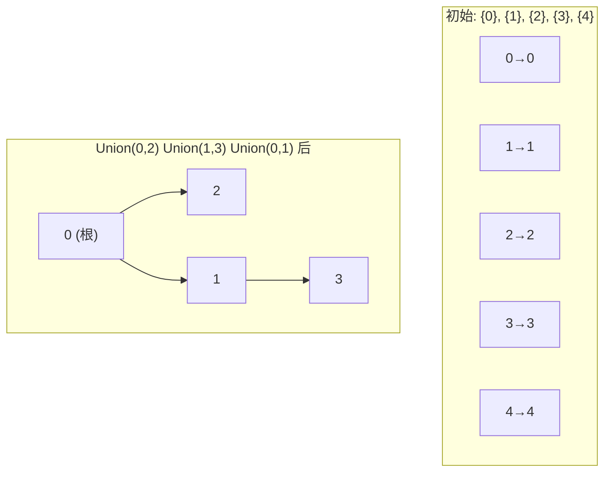
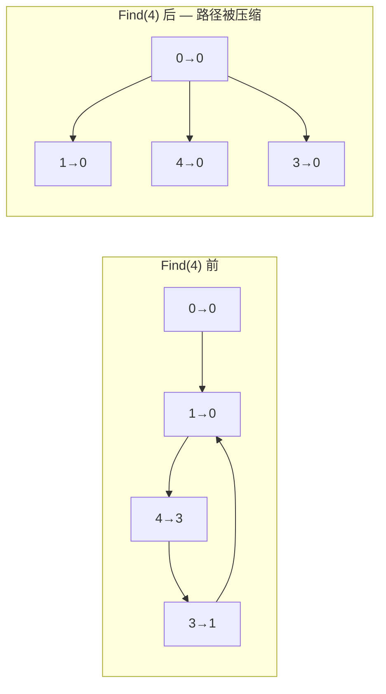

建议先阅读: [[D_容器_Container|容器概览]], [[S_图_Graph|图]] — 并查集是图连通性判断的基础工具。

---

## 原理

并查集（Disjoint Set Union）维护若干个不相交（disjoint）的集合，支持两种操作——`Find` 查询元素所属集合的标识（代表），`Union` 合并两个集合。它不存储集合的具体成员列表，只维护集合的分划结构。

### 森林表示

每个集合以有根树存储——树中的每个节点指向其父节点，根节点的父节点指向自身。`Find(x)` 沿父指针找根；`Union(x, y)` 将一棵树的根链到另一棵树的根下。



### 路径压缩

每次 `Find(x)` 时，将路径上所有节点直接指向根——将"扁平化"推迟到查询时：

```c
int find(int* parent, int x) {
    if (parent[x] != x)
        parent[x] = find(parent, parent[x]);  // 递归压缩: x→根
    return parent[x];
}
```



### 按秩合并

`Union` 时将较矮树的根作为子树接到较高树的根下——保持树高不增加。秩（rank）近似表示以该节点为根的树的高度：

```c
void union_sets(int* parent, int* rank, int x, int y) {
    int rx = find(parent, x), ry = find(parent, y);
    if (rx == ry) return;
    if (rank[rx] < rank[ry])      parent[rx] = ry;
    else if (rank[rx] > rank[ry]) parent[ry] = rx;
    else { parent[ry] = rx; rank[rx]++; }
}
```

### 时间复杂度：逆阿克曼函数

路径压缩 + 按秩合并联合使用时，`m` 次操作的均摊时间复杂度为 $O(m \cdot \alpha(n))$，其中 $\alpha(n)$ 是逆阿克曼函数（inverse Ackermann function）：

$$
\alpha(n) \leq 4 \quad \text{for any practical } n < 2^{2^{2^{2^{16}}}}
$$

$\alpha(n)$ 增长极度缓慢——在实际宇宙中所有可想象的输入下，$\alpha(n) \leq 4$。也就是说，对于任何实际场景，并查集的操作复杂度在实践中等价于常数 $O(1)$。这是算法理论中罕见的"理论上不是常数但实践中就是常数"的案例。

### 带权并查集

在普通并查集的基础上增加边权：`parent[x]` 存储 x 的父节点，`weight[x]` 存储 x 到父节点的关系权重。常见变体：
- **集合大小**：`size[root]` 存该集合的元素数
- **类别关系**：食物链问题——种类权值 0/1/2 表示同类/捕食/被捕食
- **异或和**：每个节点维护到根的 XOR 和，判断连通子图异或性质

## 实现

```c
#include <stdlib.h>

typedef struct {
    int* parent;
    int* rank;
    int* size;     // 每个根节点的集合大小
    int n;
} UnionFind;

void uf_init(UnionFind* uf, int n) {
    uf->n = n;
    uf->parent = malloc(n * sizeof(int));
    uf->rank   = calloc(n, sizeof(int));
    uf->size   = malloc(n * sizeof(int));
    for (int i = 0; i < n; i++) {
        uf->parent[i] = i;
        uf->size[i] = 1;
    }
}

int uf_find(UnionFind* uf, int x) {
    if (uf->parent[x] != x)
        uf->parent[x] = uf_find(uf, uf->parent[x]);
    return uf->parent[x];
}

void uf_union(UnionFind* uf, int x, int y) {
    int rx = uf_find(uf, x), ry = uf_find(uf, y);
    if (rx == ry) return;
    if (uf->rank[rx] < uf->rank[ry]) {
        uf->parent[rx] = ry;
        uf->size[ry] += uf->size[rx];
    } else if (uf->rank[rx] > uf->rank[ry]) {
        uf->parent[ry] = rx;
        uf->size[rx] += uf->size[ry];
    } else {
        uf->parent[ry] = rx;
        uf->rank[rx]++;
        uf->size[rx] += uf->size[ry];
    }
}

int uf_connected(UnionFind* uf, int x, int y) {
    return uf_find(uf, x) == uf_find(uf, y);
}

void uf_destroy(UnionFind* uf) {
    free(uf->parent); free(uf->rank); free(uf->size);
}
```

## 应用场景

- **图的连通性**：Kruskal 最小生成树——检查加入一条边是否会产生环（两端是否已在同一集合）。详见 [[S_图_Graph#最小生成树|图 — MST]]
- **动态连通性**：社交网络中的朋友群组判断、图像分割的区域合并
- **等价类划分**：编译器将等价的标识符划分到同一集合

## 练习

| 题号 | 题目 | 说明 |
|------|------|------|
| [547](https://leetcode.cn/problems/number-of-provinces/) | 省份数量 | 并查集基础 |
| [684](https://leetcode.cn/problems/redundant-connection/) | 冗余连接 | 并查集检测环 |
| [1319](https://leetcode.cn/problems/number-of-operations-to-make-network-connected/) | 连通网络的操作次数 | 连通分量计数 |
| [990](https://leetcode.cn/problems/satisfiability-of-equality-equations/) | 等式方程的可满足性 | 分类合并 |

## 动手实验

| 编号 | 题目 | 说明 |
|:----:|------|------|
| E1 | 路径压缩前后对比 | 对 n=100 构建一条链（1→2, 2→3, ..., 99→100 的 union 序列），先调用 Find(100) 前测量 Find(1) 的平均深度，再调用 Find(100) 后再次测量。验证压缩后的树深 ≈ 1 |
| E2 | 按秩合并 vs 无优化 | 随机生成 10000 对 (x, y) 执行 Union，分别用按秩合并和无优化（总是 `parent[y] = x`）两种方式。统计最终森林的最大树高——无优化版本可能退化为 O(n) 的链 |

| 仅按秩合并 | O(log n) | O(log n) |
| 双重优化 | 均摊 O(α(n)) | 均摊 O(α(n)) |

α(n) 是反阿克曼函数，对任何实际输入 <= 5，可视为 O(1)。

---

## 实现

### 标准并查集（路径压缩 + 按秩合并）

```c
#include <stdlib.h>

typedef struct {
    int* parent;
    int* rank;
    int count;    // 连通分量数
} UnionFind;

void uf_init(UnionFind* uf, int n) {
    uf->parent = malloc(n * sizeof(int));
    uf->rank = calloc(n, sizeof(int));
    uf->count = n;
    for (int i = 0; i < n; i++)
        uf->parent[i] = i;
}

void uf_destroy(UnionFind* uf) {
    free(uf->parent);
    free(uf->rank);
}

int uf_find(UnionFind* uf, int x) {
    if (uf->parent[x] != x)
        uf->parent[x] = uf_find(uf, uf->parent[x]);  // 路径压缩
    return uf->parent[x];
}

int uf_unite(UnionFind* uf, int x, int y) {
    int px = uf_find(uf, x);
    int py = uf_find(uf, y);
    if (px == py) return 0;

    if (uf->rank[px] < uf->rank[py]) {
        int t = px; px = py; py = t;
    }
    uf->parent[py] = px;
    if (uf->rank[px] == uf->rank[py])
        uf->rank[px]++;
    uf->count--;
    return 1;
}

int uf_connected(UnionFind* uf, int x, int y) {
    return uf_find(uf, x) == uf_find(uf, y);
}

int uf_get_count(UnionFind* uf) { return uf->count; }
```

### 带权并查集

维护元素与父节点之间的权值关系（如距离、差值），合并时同步更新权值：

```c
typedef struct {
    int* parent;
    int* rank;
    int* weight;   // weight[i] = i 到 parent[i] 的权值差
} WeightedUnionFind;

void wuf_init(WeightedUnionFind* uf, int n) {
    uf->parent = malloc(n * sizeof(int));
    uf->rank = calloc(n, sizeof(int));
    uf->weight = calloc(n, sizeof(int));
    for (int i = 0; i < n; i++)
        uf->parent[i] = i;
}

void wuf_destroy(WeightedUnionFind* uf) {
    free(uf->parent);
    free(uf->rank);
    free(uf->weight);
}

int wuf_find(WeightedUnionFind* uf, int x, int* out_weight) {
    if (uf->parent[x] == x) {
        *out_weight = 0;
        return x;
    }
    int w;
    int root = wuf_find(uf, uf->parent[x], &w);
    uf->parent[x] = root;
    uf->weight[x] += w;
    *out_weight = uf->weight[x];
    return root;
}

// 声明: value(y) - value(x) = w
// 返回 1 合并成功，0 表示 x 和 y 已连通且与 w 矛盾
int wuf_unite(WeightedUnionFind* uf, int x, int y, int w) {
    int wx, wy;
    int px = wuf_find(uf, x, &wx);
    int py = wuf_find(uf, y, &wy);
    if (px == py)
        return (wy - wx) == w;

    if (uf->rank[px] < uf->rank[py]) {
        uf->parent[px] = py;
        uf->weight[px] = wy - wx - w;
    } else {
        uf->parent[py] = px;
        uf->weight[py] = wx - wy + w;
        if (uf->rank[px] == uf->rank[py])
            uf->rank[px]++;
    }
    return 1;
}

// 查询 x 和 y 的权值差，不连通时返回 0
int wuf_query(WeightedUnionFind* uf, int x, int y, int* diff) {
    int wx, wy;
    int px = wuf_find(uf, x, &wx);
    int py = wuf_find(uf, y, &wy);
    if (px != py) return 0;
    *diff = wy - wx;
    return 1;
}
```

---

## 应用场景

- **Kruskal 最小生成树**: 判断加边是否形成环（两端点是否已连通）
- **无向图连通性**: 静态或动态添加边，判断两点是否连通、统计连通分量
- **朋友圈/社交网络**: 合并好友关系，判断两人是否在同一圈子
- **食物链问题**: 带权并查集维护相对关系（同类/捕食）

---

## 练习

| 题号 | 题目 | 说明 |
|------|------|------|
| [547](https://leetcode.cn/problems/number-of-provinces/) | 省份数量 | 并查集基本应用 |
| [684](https://leetcode.cn/problems/redundant-connection/) | 冗余连接 | 并查集检测环 |
| [1319](https://leetcode.cn/problems/number-of-operations-to-make-network-connected/) | 连通网络的操作次数 | 连通分量计数 |
| [990](https://leetcode.cn/problems/satisfiability-of-equality-equations/) | 等式方程的可满足性 | 并查集 + 不等式约束 |

> 竞赛方向推荐洛谷/Codeforces。

## 动手实验

| 编号 | 题目 | 说明 |
|:----:|------|------|
| E1 | 路径压缩可视化 | 构造一个深 10 的链式并查集（2指向1, 3指向2...），调用 `find(10)` 之前和之后各打印一次 parent 数组，观察路径压缩将深度压缩为 1 的效果 |
| E2 | 按秩合并 vs 无优化 | 随机 union 1000 个元素，分别用"按秩合并"和"固定方向合并"两种策略，统计最终 forest 的最大树高，解释差距 |
