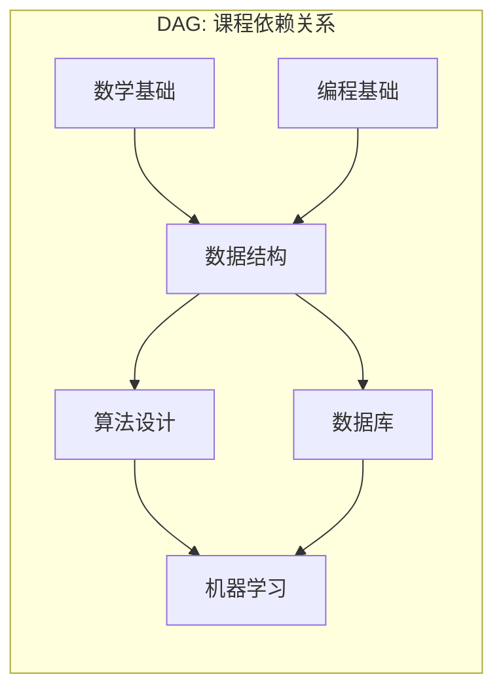
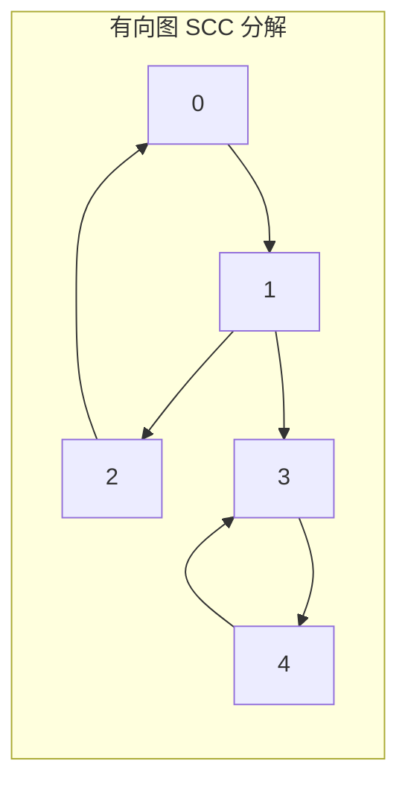

---
数据结构教程 — 图的高级算法 (Advanced Graph Algorithms)
---

##  章节概述

本章介绍图论中的高级算法，包括拓扑排序、强连通分量（Tarjan算法）、
全源最短路径（Floyd-Warshall）、含负权边的单源最短路径（Bellman-Ford）
以及网络流算法。这些算法是图论的精华，在编译器依赖分析、社交网络分析、
路由协议、物流优化等领域有广泛应用。

本章将从每个算法的核心思想讲起，给出完整的伪代码实现，
通过实际案例展示算法的应用场景，最后通过习题巩固所学知识。

>  **底层实现参考**：如果需要深入理解本章数据结构的底层实现（纯C手写、内存布局、指针操作），请参阅 [[../../C语言深化教程/3数据结构/08_图|C语言教程: 图]]。C教程侧重手动实现与内存本质，本教程侧重STL使用与算法优化，两者互补。

---
###  第一节: 基础语法 + 计算机底层原理
---

1.1 拓扑排序（Topological Sort）
----------------------------------

拓扑排序用于有向无环图（DAG），将所有顶点排成线性序列，使得对于每条有向边(u,v)，
u在序列中出现在v之前。

应用场景：
- 课程选课顺序
- 编译依赖关系
- 任务调度



> 拓扑排序结果: 数学基础 → 编程基础 → 数据结构 → 算法设计 → 数据库 → 机器学习
> （入度为0的节点入队，依次输出并删除出边，重复此过程）

**Kahn算法（BFS）实现：**

```pseudocode
CLASS TopologicalSort:
    V       // 顶点数
    adj     // 邻接表: adj[u] = [v1, v2, ...]

    CONSTRUCTOR(v):
        V = v
        adj = ARRAY of size V, each an EMPTY_LIST
    END CONSTRUCTOR

    FUNCTION addEdge(u, v):
        APPEND v TO adj[u]
    END FUNCTION

    FUNCTION kahnSort():
        inDegree = ARRAY of size V, filled with 0
        FOR u FROM 0 TO V - 1:
            FOR EACH v IN adj[u]:
                inDegree[v] = inDegree[v] + 1
            END FOR
        END FOR

        q = EMPTY_QUEUE
        FOR i FROM 0 TO V - 1:
            IF inDegree[i] == 0 THEN
                ENQUEUE i TO q
            END IF
        END FOR

        result = EMPTY_LIST
        WHILE NOT q IS EMPTY:
            u = DEQUEUE(q)
            APPEND u TO result
            FOR EACH v IN adj[u]:
                inDegree[v] = inDegree[v] - 1
                IF inDegree[v] == 0 THEN
                    ENQUEUE v TO q
                END IF
            END FOR
        END WHILE

        IF LENGTH(result) != V THEN
            DISPLAY "图中存在环，无法拓扑排序!"
            RETURN EMPTY_LIST
        END IF
        RETURN result
    END FUNCTION

    FUNCTION dfsSort():
        order = EMPTY_LIST
        state = ARRAY of size V, filled with 0  // 0=未访问, 1=访问中, 2=已完成
        hasCycle = FALSE
        FOR i FROM 0 TO V - 1:
            IF state[i] == 0 THEN
                dfs(i, state, order, hasCycle)
            END IF
            IF hasCycle THEN BREAK
        END FOR
        IF hasCycle THEN RETURN EMPTY_LIST
        REVERSE order
        RETURN order
    END FUNCTION

    FUNCTION dfs(u, state, order, hasCycle):    // 私有
        IF hasCycle THEN RETURN
        state[u] = 1
        FOR EACH v IN adj[u]:
            IF state[v] == 1 THEN
                hasCycle = TRUE; RETURN
            END IF
            IF state[v] == 0 THEN
                dfs(v, state, order, hasCycle)
            END IF
        END FOR
        state[u] = 2
        APPEND u TO order
    END FUNCTION
END CLASS
```

---
**实现练习**: 用 C 或 C++ 自行实现上述结构。完成后与 AI 对话检查正确性。
---

| 图算法 | 用途 | 时间复杂度 | 适用条件 |
|--------|------|-----------|---------|
| 拓扑排序(Kahn) | DAG线性排序 | O(V+E) | 有向无环图 |
| 拓扑排序(DFS) | DAG线性排序+环检测 | O(V+E) | 有向图 |
| Tarjan SCC | 强连通分量 | O(V+E) | 有向图 |
| Floyd-Warshall | 全源最短路 | O(V^3) | 任意权图 |
| Bellman-Ford | 单源最短路(负权) | O(VE) | 可检测负环 |
| Dinic 最大流 | 网络最大流 | O(V^2 E) | 流量网络 |

1.2 强连通分量（Tarjan算法）
-------------------------------

强连通分量（SCC）：有向图中，若任意两个顶点u和v之间互相可达，则它们属于同一个强连通分量。

Tarjan算法利用DFS和栈，在一次遍历中找到所有SCC。

核心概念：
- dfn[u]：节点u被DFS访问的时间戳
- low[u]：节点u及其子树能回溯到的最早时间戳
- 当dfn[u] == low[u]时，u是某个SCC的根



> 上图有三个 SCC: {0,1,2} 互相可达, {3,4} 互相可达, {5} 孤立。
> Tarjan 一次 DFS 即可找出所有分量, dfn 和 low 是关键。

```pseudocode
CLASS TarjanSCC:
    V           // 顶点数
    adj         // 邻接表
    dfn, low    // 数组: 时间戳
    sccId       // 数组: 每个节点所属 SCC 编号
    onStack     // 数组: 是否在栈上
    stk         // 栈
    timer = 0
    sccCount = 0

    FUNCTION dfs(u):
        timer = timer + 1
        dfn[u] = low[u] = timer
        PUSH u TO stk
        onStack[u] = TRUE

        FOR EACH v IN adj[u]:
            IF dfn[v] == 0 THEN
                dfs(v)
                low[u] = MIN(low[u], low[v])
            ELSE IF onStack[v] THEN
                low[u] = MIN(low[u], dfn[v])
            END IF
        END FOR

        IF dfn[u] == low[u] THEN
            sccCount = sccCount + 1
            WHILE TRUE:
                v = POP(stk)
                onStack[v] = FALSE
                sccId[v] = sccCount
                IF v == u THEN BREAK
            END WHILE
        END IF
    END FUNCTION

    CONSTRUCTOR(v):
        V = v
        adj = ARRAY of size V, each an EMPTY_LIST
        dfn = ARRAY of size V, filled with 0
        low = ARRAY of size V, filled with 0
        sccId = ARRAY of size V, filled with 0
        onStack = ARRAY of size V, filled with FALSE
    END CONSTRUCTOR

    FUNCTION addEdge(u, v):
        APPEND v TO adj[u]
    END FUNCTION

    FUNCTION solve():
        FOR i FROM 0 TO V - 1:
            IF dfn[i] == 0 THEN dfs(i)
        END FOR
        RETURN sccCount
    END FUNCTION

    FUNCTION getSCCId(u):
        RETURN sccId[u]
    END FUNCTION

    FUNCTION getComponents():
        components = ARRAY of size sccCount, each an EMPTY_LIST
        FOR i FROM 0 TO V - 1:
            APPEND i TO components[sccId[i] - 1]
        END FOR
        RETURN components
    END FUNCTION
END CLASS
```

---
**实现练习**: 用 C 或 C++ 自行实现上述结构。完成后与 AI 对话检查正确性。
---

1.3 Floyd-Warshall（全源最短路径）
-------------------------------------

Floyd-Warshall算法计算图中所有顶点对之间的最短路径。

核心思想：动态规划，dist[i][j] = min(dist[i][j], dist[i][k] + dist[k][j])

时间复杂度：O(V³)
空间复杂度：O(V²)
适用：稠密图、顶点数不大（V ≤ 500）、可处理负权边（但不含负权环）

```pseudocode
CLASS FloydWarshall:
    V        // 顶点数
    dist     // 二维数组: dist[i][j] = i到j的最短距离
    next     // 二维数组: next[i][j] = i到j路径中i的下一个节点
    INF = 10^18

    CONSTRUCTOR(v):
        V = v
        dist = 2D ARRAY of size V × V, filled with INF
        next = 2D ARRAY of size V × V, filled with -1
        FOR i FROM 0 TO V - 1:
            dist[i][i] = 0
            next[i][i] = i
        END FOR
    END CONSTRUCTOR

    FUNCTION addEdge(u, v, w):
        dist[u][v] = w
        next[u][v] = v
    END FUNCTION

    FUNCTION solve():
        FOR k FROM 0 TO V - 1:
            FOR i FROM 0 TO V - 1:
                FOR j FROM 0 TO V - 1:
                    IF dist[i][k] != INF AND dist[k][j] != INF AND
                       dist[i][k] + dist[k][j] < dist[i][j] THEN
                        dist[i][j] = dist[i][k] + dist[k][j]
                        next[i][j] = next[i][k]
                    END IF
                END FOR
            END FOR
        END FOR
        // 检测负权环: 对角线上出现负值
        FOR i FROM 0 TO V - 1:
            IF dist[i][i] < 0 THEN RETURN FALSE
        END FOR
        RETURN TRUE
    END FUNCTION

    FUNCTION getDistance(u, v):
        RETURN dist[u][v]
    END FUNCTION

    FUNCTION getPath(u, v):
        IF next[u][v] == -1 THEN RETURN EMPTY_LIST
        path = [u]
        WHILE u != v:
            u = next[u][v]
            APPEND u TO path
        END WHILE
        RETURN path
    END FUNCTION

    FUNCTION printDistMatrix():
        DISPLAY "距离矩阵:"
        FOR i FROM 0 TO V - 1:
            FOR j FROM 0 TO V - 1:
                IF dist[i][j] == INF THEN DISPLAY "  INF"
                ELSE DISPLAY format(dist[i][j], width=5)
            END FOR
            DISPLAY NEWLINE
        END FOR
    END FUNCTION
END CLASS
```

---
**实现练习**: 用 C 或 C++ 自行实现上述结构。完成后与 AI 对话检查正确性。
---

1.4 Bellman-Ford（含负权边的单源最短路径）
--------------------------------------------

Bellman-Ford算法可处理含负权边的图，并能检测负权环。

核心思想：对所有边进行V-1轮松弛操作。

时间复杂度：O(VE)
适用：含负权边的图、判断负权环

```pseudocode
STRUCT Edge:
    from, to
    weight
END STRUCT

CLASS BellmanFord:
    V        // 顶点数
    edges    // 边列表
    dist     // 数组: 从源点到各点的最短距离
    parent   // 数组: 最短路径树中的父节点
    INF = 10^18

    CONSTRUCTOR(v):
        V = v
        dist = ARRAY of size V, filled with INF
        parent = ARRAY of size V, filled with -1
    END CONSTRUCTOR

    FUNCTION addEdge(u, v, w):
        APPEND {u, v, w} TO edges
    END FUNCTION

    FUNCTION solve(src):
        dist[src] = 0
        // V-1 轮松弛
        FOR i FROM 0 TO V - 2:
            updated = FALSE
            FOR EACH e IN edges:
                IF dist[e.from] != INF AND dist[e.from] + e.weight < dist[e.to] THEN
                    dist[e.to] = dist[e.from] + e.weight
                    parent[e.to] = e.from
                    updated = TRUE
                END IF
            END FOR
            IF NOT updated THEN BREAK   // 提前终止优化
        END FOR
        // 第 V 轮检测负权环
        FOR EACH e IN edges:
            IF dist[e.from] != INF AND dist[e.from] + e.weight < dist[e.to] THEN
                RETURN FALSE    // 存在负权环
            END IF
        END FOR
        RETURN TRUE
    END FUNCTION

    FUNCTION getDistance(v):
        RETURN dist[v]
    END FUNCTION

    FUNCTION getPath(v):
        path = EMPTY_LIST
        curr = v
        WHILE curr != -1:
            APPEND curr TO BEGINNING OF path
            curr = parent[curr]
        END WHILE
        RETURN path
    END FUNCTION
END CLASS
```

---
**实现练习**: 用 C 或 C++ 自行实现上述结构。完成后与 AI 对话检查正确性。
---

1.5 SPFA算法（Bellman-Ford的队列优化）

```pseudocode
CLASS SPFA:
    V        // 顶点数
    adj      // 邻接表: adj[u] = [(v, w), ...]
    dist     // 数组
    cnt      // 数组: cnt[u] = 节点u入队次数（检测负环用）
    inQueue  // 数组: 是否在队列中
    INF = 10^18

    CONSTRUCTOR(v):
        V = v
        adj = ARRAY of size V, each an EMPTY_LIST
        dist = ARRAY of size V, filled with INF
        cnt = ARRAY of size V, filled with 0
        inQueue = ARRAY of size V, filled with FALSE
    END CONSTRUCTOR

    FUNCTION addEdge(u, v, w):
        APPEND (v, w) TO adj[u]
    END FUNCTION

    FUNCTION solve(src):
        dist[src] = 0
        q = EMPTY_QUEUE
        ENQUEUE src TO q
        inQueue[src] = TRUE

        WHILE NOT q IS EMPTY:
            u = DEQUEUE(q)
            inQueue[u] = FALSE
            FOR EACH (v, w) IN adj[u]:
                IF dist[u] + w < dist[v] THEN
                    dist[v] = dist[u] + w
                    IF NOT inQueue[v] THEN
                        ENQUEUE v TO q
                        inQueue[v] = TRUE
                        cnt[v] = cnt[v] + 1
                        IF cnt[v] >= V THEN
                            RETURN FALSE    // 负权环
                        END IF
                    END IF
                END IF
            END FOR
        END WHILE
        RETURN TRUE
    END FUNCTION

    FUNCTION getDistance(v):
        RETURN dist[v]
    END FUNCTION
END CLASS
```

---
**实现练习**: 用 C 或 C++ 自行实现上述结构。完成后与 AI 对话检查正确性。
---

---
###  第二节: 实现思路
---

2.1 缩点（SCC + DAG上DP）

```pseudocode
CLASS SCCContraction:
    V, adj
    dfn, low, sccId, onStack, stk
    timer = 0, sccCount = 0

    FUNCTION tarjan(u):    // (同上 1.2)
        ...    // 略，见 1.2 TarjanSCC
    END FUNCTION

    CONSTRUCTOR(v):
        V = v
        adj = ARRAY of size V, each an EMPTY_LIST
        ... (初始化数组)
    END CONSTRUCTOR

    FUNCTION addEdge(u, v):
        APPEND v TO adj[u]
    END FUNCTION

    FUNCTION solve(weights):    // weights[i] = 节点 i 的权值
        FOR i FROM 0 TO V - 1:
            IF dfn[i] == 0 THEN tarjan(i)
        END FOR

        // 计算每个 SCC 的总权值
        sccWeight = ARRAY of size sccCount, filled with 0
        FOR i FROM 0 TO V - 1:
            sccWeight[sccId[i]] = sccWeight[sccId[i]] + weights[i]
        END FOR

        // 建 DAG (缩点图)
        dag = ARRAY of size sccCount, each an EMPTY_LIST
        inDegree = ARRAY of size sccCount, filled with 0
        FOR u FROM 0 TO V - 1:
            FOR EACH v IN adj[u]:
                IF sccId[u] != sccId[v] THEN
                    APPEND sccId[v] TO dag[sccId[u]]
                    inDegree[sccId[v]] = inDegree[sccId[v]] + 1
                END IF
            END FOR
        END FOR

        // 拓扑排序 + DP 求最长路径
        dp = ARRAY of size sccCount, filled with 0
        q = EMPTY_QUEUE
        FOR i FROM 0 TO sccCount - 1:
            dp[i] = sccWeight[i]
            IF inDegree[i] == 0 THEN
                ENQUEUE i TO q
            END IF
        END FOR

        WHILE NOT q IS EMPTY:
            u = DEQUEUE(q)
            FOR EACH v IN dag[u]:
                dp[v] = MAX(dp[v], dp[u] + sccWeight[v])
                inDegree[v] = inDegree[v] - 1
                IF inDegree[v] == 0 THEN
                    ENQUEUE v TO q
                END IF
            END FOR
        END WHILE

        RETURN MAX(dp)
    END FUNCTION
END CLASS
```

---
**实现练习**: 用 C 或 C++ 自行实现上述结构。完成后与 AI 对话检查正确性。
---

2.2 网络流（Dinic算法/最大流）

```pseudocode
STRUCT Edge:
    to        // 目标节点
    rev       // 反向边在 graph[to] 中的索引
    cap       // 剩余容量
END STRUCT

CLASS Dinic:
    V        // 顶点数
    graph    // 邻接表: graph[u] = [Edge, Edge, ...]
    level    // 层次数组 (BFS 分层层号)
    iter     // 当前弧优化数组

    FUNCTION bfs(s, t):
        level = ARRAY of size V, filled with -1
        q = EMPTY_QUEUE
        level[s] = 0
        ENQUEUE s TO q
        WHILE NOT q IS EMPTY:
            u = DEQUEUE(q)
            FOR EACH e IN graph[u]:
                IF e.cap > 0 AND level[e.to] < 0 THEN
                    level[e.to] = level[u] + 1
                    ENQUEUE e.to TO q
                END IF
            END FOR
        END WHILE
        RETURN level[t] >= 0
    END FUNCTION

    FUNCTION dfs(u, t, f):
        IF u == t THEN RETURN f
        FOR i FROM iter[u] TO LENGTH(graph[u]) - 1:
            iter[u] = i    // 当前弧优化
            e = graph[u][i]
            IF e.cap > 0 AND level[e.to] == level[u] + 1 THEN
                d = dfs(e.to, t, MIN(f, e.cap))
                IF d > 0 THEN
                    e.cap = e.cap - d
                    graph[e.to][e.rev].cap = graph[e.to][e.rev].cap + d
                    RETURN d
                END IF
            END IF
        END FOR
        RETURN 0
    END FUNCTION

    CONSTRUCTOR(v):
        V = v
        graph = ARRAY of size V, each an EMPTY_LIST
        level = ARRAY of size V
        iter = ARRAY of size V
    END CONSTRUCTOR

    FUNCTION addEdge(from, to, cap):
        // 正向边
        forward = Edge(to, LENGTH(graph[to]), cap)
        // 反向边 (初始容量 0)
        backward = Edge(from, LENGTH(graph[from]), 0)
        APPEND forward TO graph[from]
        APPEND backward TO graph[to]
    END FUNCTION

    FUNCTION maxFlow(s, t):
        flow = 0
        WHILE bfs(s, t):
            iter = ARRAY of size V, filled with 0
            WHILE TRUE:
                d = dfs(s, t, POSITIVE_INFINITY)
                IF d == 0 THEN BREAK
                flow = flow + d
            END WHILE
        END WHILE
        RETURN flow
    END FUNCTION
END CLASS
```

---
**实现练习**: 用 C 或 C++ 自行实现上述结构。完成后与 AI 对话检查正确性。
---

2.3 最小费用最大流

```pseudocode
STRUCT Edge:
    to, rev
    cap       // 容量
    cost      // 单位费用
END STRUCT

CLASS MCMF:
    V, graph
    dist      // 最短路距离
    prevv     // 增广路前驱节点
    preve     // 增广路前驱边索引
    inQueue   // 数组: 是否在队列中

    FUNCTION spfa(s, t):
        dist = ARRAY of size V, filled with POSITIVE_INFINITY
        inQueue = ARRAY of size V, filled with FALSE
        dist[s] = 0
        q = EMPTY_QUEUE
        ENQUEUE s TO q; inQueue[s] = TRUE
        WHILE NOT q IS EMPTY:
            u = DEQUEUE(q); inQueue[u] = FALSE
            FOR i FROM 0 TO LENGTH(graph[u]) - 1:
                e = graph[u][i]
                IF e.cap > 0 AND dist[u] + e.cost < dist[e.to] THEN
                    dist[e.to] = dist[u] + e.cost
                    prevv[e.to] = u
                    preve[e.to] = i
                    IF NOT inQueue[e.to] THEN
                        ENQUEUE e.to TO q
                        inQueue[e.to] = TRUE
                    END IF
                END IF
            END FOR
        END WHILE
        RETURN dist[t] != POSITIVE_INFINITY
    END FUNCTION

    CONSTRUCTOR(v):
        V = v
        graph = ARRAY of size V, each an EMPTY_LIST
        prevv = ARRAY of size V
        preve = ARRAY of size V
    END CONSTRUCTOR

    FUNCTION addEdge(from, to, cap, cost):
        APPEND Edge(to, LENGTH(graph[to]), cap, cost) TO graph[from]
        APPEND Edge(from, LENGTH(graph[from]) - 1, 0, -cost) TO graph[to]
    END FUNCTION

    FUNCTION solve(s, t):
        totalFlow = 0, totalCost = 0
        WHILE spfa(s, t):
            d = POSITIVE_INFINITY
            FOR v FROM t DOWNTO s FOLLOWING prevv:
                d = MIN(d, graph[prevv[v]][preve[v]].cap)
            END FOR
            FOR v FROM t DOWNTO s FOLLOWING prevv:
                e = graph[prevv[v]][preve[v]]
                e.cap = e.cap - d
                revEdge = graph[e.to][e.rev]
                revEdge.cap = revEdge.cap + d
            END FOR
            totalFlow = totalFlow + d
            totalCost = totalCost + d * dist[t]
        END WHILE
        RETURN (totalFlow, totalCost)
    END FUNCTION
END CLASS
```

---
**实现练习**: 用 C 或 C++ 自行实现上述结构。完成后与 AI 对话检查正确性。
---

2.4 割点和桥（无向图）

```pseudocode
CLASS CutVerticesAndBridges:
    V, adj
    dfn, low       // 时间戳数组
    isCut          // 布尔数组: isCut[i] = 节点i是否为割点
    bridges        // 列表: 存储桥边 (u, v)
    timer = 0

    FUNCTION dfs(u, parent):
        timer = timer + 1
        dfn[u] = low[u] = timer
        childCount = 0

        FOR EACH v IN adj[u]:
            IF v == parent THEN CONTINUE
            IF dfn[v] == 0 THEN    // 树边
                childCount = childCount + 1
                dfs(v, u)
                low[u] = MIN(low[u], low[v])
                // 根节点: ≥2 个子树才是割点
                IF parent == -1 AND childCount > 1 THEN
                    isCut[u] = TRUE
                END IF
                // 非根节点: low[v] >= dfn[u] 才是割点
                IF parent != -1 AND low[v] >= dfn[u] THEN
                    isCut[u] = TRUE
                END IF
                // 桥: low[v] > dfn[u]
                IF low[v] > dfn[u] THEN
                    APPEND (u, v) TO bridges
                END IF
            ELSE    // 回边
                low[u] = MIN(low[u], dfn[v])
            END IF
        END FOR
    END FUNCTION

    CONSTRUCTOR(v):
        V = v
        adj = ARRAY of size V, each an EMPTY_LIST
        dfn = ARRAY of size V, filled with 0
        low = ARRAY of size V, filled with 0
        isCut = ARRAY of size V, filled with FALSE
    END CONSTRUCTOR

    FUNCTION addEdge(u, v):
        APPEND v TO adj[u]; APPEND u TO adj[v]    // 无向图
    END FUNCTION

    FUNCTION solve():
        FOR i FROM 0 TO V - 1:
            IF dfn[i] == 0 THEN dfs(i, -1)
        END FOR
    END FUNCTION

    FUNCTION getCutVertices():
        cuts = EMPTY_LIST
        FOR i FROM 0 TO V - 1:
            IF isCut[i] THEN APPEND i TO cuts
        END FOR
        RETURN cuts
    END FUNCTION

    FUNCTION getBridges():
        RETURN bridges
    END FUNCTION
END CLASS
```

---
**实现练习**: 用 C 或 C++ 自行实现上述结构。完成后与 AI 对话检查正确性。
---

---
###  第三节: 应用场景
---

3.1 案例一：课程安排系统（拓扑排序）

```pseudocode
CLASS CourseScheduler:
    courseId       // 哈希表: 课程名 → 编号
    courseName     // 数组: 编号 → 课程名
    adj            // 邻接表
    credits        // 数组: 学分
    n = 0

    FUNCTION getId(name):
        IF NOT courseId CONTAINS name THEN
            courseId[name] = n
            n = n + 1
            APPEND name TO courseName
            APPEND EMPTY_LIST TO adj
            APPEND 0 TO credits
        END IF
        RETURN courseId[name]
    END FUNCTION

    FUNCTION addCourse(name, credit, prereqs):
        id = getId(name)
        credits[id] = credit
        FOR EACH prereq IN prereqs:
            pid = getId(prereq)
            APPEND id TO adj[pid]    // prereq → course 的边
        END FOR
    END FUNCTION

    FUNCTION schedule():
        inDeg = ARRAY of size n, filled with 0
        FOR u FROM 0 TO n - 1:
            FOR EACH v IN adj[u]:
                inDeg[v] = inDeg[v] + 1
            END FOR
        END FOR

        semesters = EMPTY_LIST
        taken = ARRAY of size n, filled with FALSE

        WHILE TRUE:
            available = EMPTY_LIST
            FOR i FROM 0 TO n - 1:
                IF NOT taken[i] AND inDeg[i] == 0 THEN
                    APPEND i TO available
                END IF
            END FOR
            IF available IS EMPTY THEN BREAK

            semester = EMPTY_LIST
            FOR EACH id IN available:
                taken[id] = TRUE
                APPEND courseName[id] TO semester
                FOR EACH v IN adj[id]:
                    inDeg[v] = inDeg[v] - 1
                END FOR
            END FOR
            APPEND semester TO semesters
        END WHILE
        RETURN semesters
    END FUNCTION
END CLASS
```

---
**实现练习**: 用 C 或 C++ 自行实现上述结构。完成后与 AI 对话检查正确性。
---

3.2 案例二：社交网络影响力分析（SCC）

```pseudocode
CLASS SocialInfluence:
    V, adj, names
    dfn, low, sccId, onStack, stk
    timer = 0, sccCount = 0

    FUNCTION tarjan(u):    // (标准 Tarjan, 略)
        ...
    END FUNCTION

    CONSTRUCTOR(n):
        V = LENGTH(n); names = n
        adj = ARRAY of size V, each an EMPTY_LIST
        ... (初始化 dfn, low, sccId, onStack)
    END CONSTRUCTOR

    FUNCTION addFollow(u, v):
        APPEND v TO adj[u]    // u 关注 v
    END FUNCTION

    FUNCTION analyze():
        FOR i FROM 0 TO V - 1:
            IF dfn[i] == 0 THEN tarjan(i)
        END FOR

        groups = ARRAY of size sccCount, each an EMPTY_LIST
        FOR i FROM 0 TO V - 1:
            APPEND i TO groups[sccId[i]]
        END FOR

        DISPLAY "互相关注的社交圈:"
        FOR i FROM 0 TO sccCount - 1:
            IF LENGTH(groups[i]) > 1 THEN
                DISPLAY "  圈子", i+1, ": ", names OF groups[i]
            END IF
        END FOR

        // 找出出度最大的 SCC（核心影响力圈）
        outDeg = ARRAY of size sccCount, filled with 0
        FOR u FROM 0 TO V - 1:
            FOR EACH v IN adj[u]:
                IF sccId[u] != sccId[v] THEN
                    outDeg[sccId[u]] = outDeg[sccId[u]] + 1
                END IF
            END FOR
        END FOR
        maxOut = MAX(outDeg)
        DISPLAY "核心影响力圈(出度最大的SCC):"
        FOR i FROM 0 TO sccCount - 1:
            IF outDeg[i] == maxOut AND LENGTH(groups[i]) > 1 THEN
                DISPLAY names OF groups[i]
            END IF
        END FOR
    END FUNCTION
END CLASS
```

---
**实现练习**: 用 C 或 C++ 自行实现上述结构。完成后与 AI 对话检查正确性。
---

3.3 案例三：物流配送网络优化（网络流）

```pseudocode
STRUCT Edge:
    to, rev
    cap, cost
END STRUCT

CLASS LogisticsNetwork:
    V, graph, nodeNames

    FUNCTION addEdgeInternal(from, to, cap, cost):
        APPEND Edge(to, LENGTH(graph[to]), cap, cost) TO graph[from]
        APPEND Edge(from, LENGTH(graph[from]) - 1, 0, -cost) TO graph[to]
    END FUNCTION

    CONSTRUCTOR(names):
        V = LENGTH(names)
        graph = ARRAY of size V, each an EMPTY_LIST
        nodeNames = names
    END CONSTRUCTOR

    FUNCTION addRoute(from, to, capacity, unitCost):
        addEdgeInternal(from, to, capacity, unitCost)
    END FUNCTION

    FUNCTION optimize(source, sink):
        totalFlow = 0, totalCost = 0
        WHILE TRUE:
            dist = ARRAY of size V, filled with INF
            prevv = ARRAY of size V, filled with -1
            preve = ARRAY of size V, filled with -1
            inq = ARRAY of size V, filled with FALSE
            dist[source] = 0
            q = EMPTY_QUEUE; ENQUEUE source; inq[source] = TRUE

            WHILE NOT q IS EMPTY:
                u = DEQUEUE(q); inq[u] = FALSE
                FOR i FROM 0 TO LENGTH(graph[u]) - 1:
                    e = graph[u][i]
                    IF e.cap > 0 AND dist[u] + e.cost < dist[e.to] THEN
                        dist[e.to] = dist[u] + e.cost
                        prevv[e.to] = u; preve[e.to] = i
                        IF NOT inq[e.to] THEN ENQUEUE e.to; inq[e.to] = TRUE
                    END IF
                END FOR
            END WHILE

            IF dist[sink] == INF THEN BREAK    // 无可增广路

            d = INF
            FOR v FROM sink DOWNTO source FOLLOWING prevv:
                d = MIN(d, graph[prevv[v]][preve[v]].cap)
            END FOR
            FOR v FROM sink DOWNTO source FOLLOWING prevv:
                e = graph[prevv[v]][preve[v]]
                e.cap = e.cap - d
                graph[e.to][e.rev].cap = graph[e.to][e.rev].cap + d
            END FOR
            totalFlow = totalFlow + d
            totalCost = totalCost + d * dist[sink]
        END WHILE

        DISPLAY "最大配送量: ", totalFlow, "单位"
        DISPLAY "最小总运输成本: ", totalCost
    END FUNCTION
END CLASS
```

---
**实现练习**: 用 C 或 C++ 自行实现上述结构。完成后与 AI 对话检查正确性。
---

---
###  第四节: 课后习题
---

1. 基础题：实现拓扑排序的两种方法（BFS的Kahn算法和DFS方法），并判断图中是否有环。

2. 应用题：使用Tarjan算法求有向图的所有强连通分量，并输出缩点后的DAG。

3. 进阶题：实现Bellman-Ford算法，支持：
   - 检测负权环
   - 输出从源点到各点的最短路径
   - 与Dijkstra进行性能对比

4. 综合题：实现Dinic最大流算法，并用于解决二分图最大匹配问题。

5. 洛谷练习：
   - [P1113 杂务](https://www.luogu.com.cn/problem/P1113)（拓扑排序）
   - [P4779 单源最短路径](https://www.luogu.com.cn/problem/P4779)（最短路）
   - [P3387 缩点](https://www.luogu.com.cn/problem/P3387)（Tarjan+DAG上DP）

---


***
##  知识网络
***

- **上一章**: [[K_并查集_UnionFind]] | **返回**: [[DSA学习路线]]
- **相关结构**: [[H_图_Graph]]
- **算法技巧**: [[../算法/算法技巧/图]] | [[../算法/算法技巧/连通性]] | [[../算法/算法技巧/动态规划]]

---
## 章节测试
---

### 判断题

> [!question] 判断题 1
> 拓扑排序只能用于有向无环图（DAG）。（ ）
> - [ ]  正确
> - [ ]  错误
>
> > [!success]- 点击查看答案
> > 答案: 正确
> > 
> > **解析**: 如果有向图中存在环，则不存在拓扑序（环中的节点互相依赖，无法确定先后顺序）。

> [!question] 判断题 2
> 一个DAG的拓扑排序结果是唯一的。（ ）
> - [ ]  正确
> - [ ]  错误
>
> > [!success]- 点击查看答案
> > 答案: 错误
> > 
> > **解析**: 当多个节点的入度同时为0时，选择哪个先输出会导致不同的拓扑序。只有当图是一条链时拓扑序才唯一。

> [!question] 判断题 3
> Tarjan算法的时间复杂度为O(V+E)。（ ）
> - [ ]  正确
> - [ ]  错误
>
> > [!success]- 点击查看答案
> > 答案: 正确
> > 
> > **解析**: Tarjan算法基于DFS，每个节点和每条边只访问一次，时间复杂度O(V+E)。

> [!question] 判断题 4
> Floyd-Warshall算法不能处理含负权边的图。（ ）
> - [ ]  正确
> - [ ]  错误
>
> > [!success]- 点击查看答案
> > 答案: 错误
> > 
> > **解析**: Floyd-Warshall可以处理负权边，但不能处理负权环。如果存在负权环，算法会检测到（对角线出现负值）。

> [!question] 判断题 5
> Bellman-Ford算法可以检测图中是否存在负权环。（ ）
> - [ ]  正确
> - [ ]  错误
>
> > [!success]- 点击查看答案
> > 答案: 正确
> > 
> > **解析**: V-1轮松弛后，如果第V轮仍能松弛某条边，说明存在负权环。

> [!question] 判断题 6
> Dinic算法的时间复杂度为O(V²E)。（ ）
> - [ ]  正确
> - [ ]  错误
>
> > [!success]- 点击查看答案
> > 答案: 正确
> > 
> > **解析**: Dinic算法通过分层图和阻塞流的概念，时间复杂度为O(V²E)。对于单位容量图可以优化到O(E√V)。

> [!question] 判断题 7
> 最大流最小割定理指出：网络的最大流等于最小割的容量。（ ）
> - [ ]  正确
> - [ ]  错误
>
> > [!success]- 点击查看答案
> > 答案: 正确
> > 
> > **解析**: 这是网络流理论的核心定理（Ford-Fulkerson定理），最大流=最小割在所有网络流算法中都成立。

> [!question] 判断题 8
> SPFA算法在最坏情况下的时间复杂度为O(VE)，与Bellman-Ford相同。（ ）
> - [ ]  正确
> - [ ]  错误
>
> > [!success]- 点击查看答案
> > 答案: 正确
> > 
> > **解析**: SPFA是Bellman-Ford的队列优化版本，平均情况下更快，但最坏情况下仍为O(VE)。在某些构造数据下SPFA会退化。

> [!question] 判断题 9
> 强连通分量内的任意两个顶点之间都存在路径。（ ）
> - [ ]  正确
> - [ ]  错误
>
> > [!success]- 点击查看答案
> > 答案: 正确
> > 
> > **解析**: 强连通分量的定义就是：分量内任意两个顶点u和v，既存在u到v的路径，也存在v到u的路径。

> [!question] 判断题 10
> 缩点后的图一定是DAG。（ ）
> - [ ]  正确
> - [ ]  错误
>
> > [!success]- 点击查看答案
> > 答案: 正确
> > 
> > **解析**: 将每个SCC缩为一个点后，如果缩点图有环，那么环上的所有SCC应该合并为一个更大的SCC，矛盾。所以缩点图一定是DAG。

### 选择题

> [!question] 选择题 1
> 以下哪个算法不能用于求最短路径？
> - [ ] A. Dijkstra
> - [ ] B. Floyd-Warshall
> - [ ] C. Bellman-Ford
> - [ ] D. Tarjan
>
> > [!success]- 点击查看答案
> > 正确答案: D
> > 
> > **解析**: Tarjan算法用于求强连通分量和割点/桥，不是最短路径算法。其他三个都是经典的最短路径算法。

> [!question] 选择题 2
> Floyd-Warshall算法的时间复杂度为？
> - [ ] A. O(V²)
> - [ ] B. O(V³)
> - [ ] C. O(VE)
> - [ ] D. O(V² log V)
>
> > [!success]- 点击查看答案
> > 正确答案: B
> > 
> > **解析**: Floyd-Warshall有三重循环（k, i, j各遍历所有顶点），时间复杂度为O(V³)。

> [!question] 选择题 3
> Bellman-Ford相比Dijkstra的优势是？
> - [ ] A. 时间复杂度更低
> - [ ] B. 可以处理负权边
> - [ ] C. 空间复杂度更低
> - [ ] D. 代码更简洁
>
> > [!success]- 点击查看答案
> > 正确答案: B
> > 
> > **解析**: Dijkstra不能处理负权边（贪心策略在负权下失效），而Bellman-Ford通过多轮松弛可以正确处理负权边。

> [!question] 选择题 4
> 拓扑排序中，Kahn算法使用的数据结构是？
> - [ ] A. 栈
> - [ ] B. 队列
> - [ ] C. 堆
> - [ ] D. 哈希表
>
> > [!success]- 点击查看答案
> > 正确答案: B
> > 
> > **解析**: Kahn算法使用队列存储入度为0的节点，每次从队列取出一个节点加入结果。（使用优先队列可以得到字典序最小的拓扑序）

> [!question] 选择题 5
> 在Tarjan算法中，当dfn[u] == low[u]时，表示什么？
> - [ ] A. u是叶子节点
> - [ ] B. u是某个SCC的根
> - [ ] C. u没有出边
> - [ ] D. u的入度为0
>
> > [!success]- 点击查看答案
> > 正确答案: B
> > 
> > **解析**: dfn[u]==low[u]意味着u无法通过后代回到更早被访问的祖先，因此u是以它为根的子树所形成的SCC的"最高点"（根）。

> [!question] 选择题 6
> 网络流中，增广路是指？
> - [ ] A. 从源到汇的任意路径
> - [ ] B. 从源到汇且所有边都有剩余容量的路径
> - [ ] C. 容量最大的路径
> - [ ] D. 边数最少的路径
>
> > [!success]- 点击查看答案
> > 正确答案: B
> > 
> > **解析**: 增广路是在残量图中从源点s到汇点t的路径，路径上每条边的剩余容量>0。找到增广路后沿路径增加流量。

> [!question] 选择题 7
> 对于稠密图(E≈V²)求全源最短路径，以下哪种方案最优？
> - [ ] A. 对每个顶点运行Dijkstra
> - [ ] B. Floyd-Warshall
> - [ ] C. 对每个顶点运行Bellman-Ford
> - [ ] D. 对每个顶点运行BFS
>
> > [!success]- 点击查看答案
> > 正确答案: B
> > 
> > **解析**: Floyd O(V³)，V次Dijkstra为O(V×(V²))=O(V³)（邻接矩阵），但Floyd常数更小且代码更简单。V次Bellman-Ford为O(V²E)=O(V⁴)更差。

> [!question] 选择题 8
> SPFA算法判断负权环的条件是？
> - [ ] A. 某节点入队次数超过V次
> - [ ] B. 某节点的距离变为负数
> - [ ] C. 队列为空
> - [ ] D. 某节点入队次数超过E次
>
> > [!success]- 点击查看答案
> > 正确答案: A
> > 
> > **解析**: 如果某个节点入队次数≥V次，说明存在负权环（正常情况下每个节点最多被松弛V-1次）。

> [!question] 选择题 9
> 二分图最大匹配可以转化为什么问题求解？
> - [ ] A. 最短路径
> - [ ] B. 最大流
> - [ ] C. 最小生成树
> - [ ] D. 拓扑排序
>
> > [!success]- 点击查看答案
> > 正确答案: B
> > 
> > **解析**: 建立超级源和超级汇，源连接左部所有点（容量1），汇连接右部所有点（容量1），匹配边容量1。最大流即最大匹配数。

> [!question] 选择题 10
> Bellman-Ford算法需要进行多少轮松弛操作？
> - [ ] A. V轮
> - [ ] B. V-1轮
> - [ ] C. E轮
> - [ ] D. log V轮
>
> > [!success]- 点击查看答案
> > 正确答案: B
> > 
> > **解析**: 最短路径最多经过V-1条边，每轮松弛至少确定一个顶点的最短路，因此V-1轮后所有最短路确定。第V轮用于检测负权环。

### 编程大题

> [!question] 编程大题 1
> **题目**: 洛谷 [P1113 杂务](https://www.luogu.com.cn/problem/P1113)
> 
> 有n个杂务，每个杂务有完成时间和前置杂务依赖。求完成所有杂务所需的最短时间。
>
> > [!success]- 点击查看提示
> > 建图后进行拓扑排序。使用dp[i]表示完成杂务i的最早结束时间：dp[i] = max(dp[前驱]) + time[i]。答案为max(dp[i])。本质是DAG上的最长路径问题。

> [!question] 编程大题 2
> **题目**: 洛谷 [P3387 缩点](https://www.luogu.com.cn/problem/P3387)
> 
> 给定一个有向图，每个点有权值。求一条路径使得路径上的点权值之和最大（每个强连通分量内的点可以重复经过）。
>
> > [!success]- 点击查看提示
> > 1. 用Tarjan算法求所有SCC，将每个SCC内的权值求和。2. 缩点建DAG。3. 在DAG上求最长路径（拓扑排序+DP）。dp[u] = max(dp[前驱] + weight[u])。

> [!question] 编程大题 3
> **题目**: 洛谷 [P4779 单源最短路径](https://www.luogu.com.cn/problem/P4779)
> 
> 给定一个有向图和源点s，求s到所有点的最短路径。（本题数据保证无负权边，但请同时实现Dijkstra和Bellman-Ford两种解法进行对比）
>
> > [!success]- 点击查看提示
> > Dijkstra解法：使用优先队列优化，时间O((V+E)logV)。Bellman-Ford解法：V-1轮松弛所有边，时间O(VE)。对于本题规模（V≤10^5, E≤2×10^5），Dijkstra可过但Bellman-Ford可能TLE，体现两者的效率差异。
