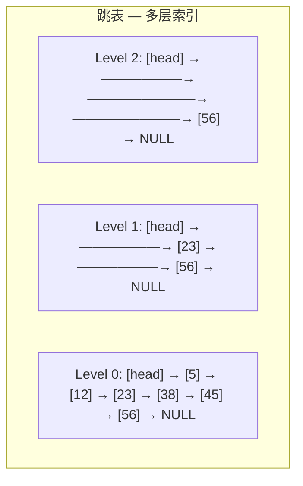
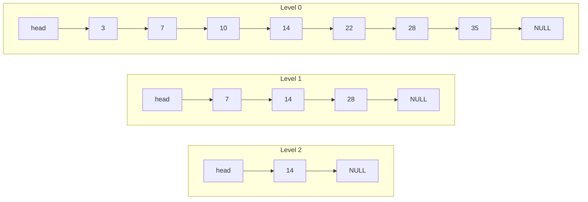

建议先阅读: [[E_链表_LinkedList|链表]]

---

## 原理

### 跳表是什么

想象一本 500 页的书：如果你要找"快速排序"，不会从第 1 页翻起——你会先看目录（高层索引），发现"排序算法"在第 300 页附近，然后翻到那一章的子目录，发现"快速排序"在第 320 页，最后直接翻到 320 页。跳表就是这个思路的数据结构化：在有序链表上建多层索引，高层跳得远、低层跳得近，查找时从顶层逐层下降，每层跨过一大段元素。

**与链表和 BST 的对比**：

| | 有序链表 | BST | 跳表 |
|--|---------|-----|------|
| 查找 | $O(n)$ 逐个遍历 | $O(\log n)$ | **$O(\log n)$ 期望** |
| 插入 | $O(1)$ 改指针 | $O(\log n)$ + 可能旋转 | **$O(\log n)$ 随机** |
| 范围查询 | $O(k)$ 天然有序 | $O(\log n + k)$ | **$O(\log n + k)$ 天然有序** |
| 实现难度 | 简单 | 困难（平衡维护） | **中等** |

跳表的核心优势：**用随机化替代平衡树的旋转操作**——实现简单、并发友好（锁可局部化到单个节点）、天然支持范围查询。Redis 选择跳表而非红黑树正是基于这些工程考量。

### 跳表在哪里

- **Redis ZSet**：有序集合的核心就是跳表——`ZADD` 插入 O(log n)，`ZRANGE` 范围查询 O(log n + k)，`ZRANK` 排名查询 O(log n)。Redis 同时用哈希表辅助 O(1) 点查
- **LevelDB MemTable**：内存中的写缓冲区用跳表存储，保证键有序——后续 flush 到 SSTable 时直接顺序写磁盘
- **内存数据库索引**：需有序查找 + 范围扫描的场景（如时序数据库 InfluxDB 的 TSI 索引）
- **Java ConcurrentSkipListMap**：JDK 并发跳表实现——锁粒度细化到单个节点，比 `ConcurrentHashMap` 的分段锁更灵活

### 核心结构



- **Level 0**（底层）是包含所有元素的有序链表
- 每个上层节点是下层的一个随机子集——以概率 $p$（通常 $0.5$ 或 $0.25$）决定是否将节点提升到更高层
- 查找从最高层开始——因为每层跨度大，可以跳过大量元素。当不能继续向右走时，下降一层继续

### 查找路径分析

在跳表中查找元素 $x$：

1. 从最高层的 `head` 开始
2. 只要当前层的下一个节点值 $< x$，就向右移动——这一步跨过所有被跳过的中间值
3. 当下一步将越过 $x$ 时，降一层，重复步骤 2
4. 到达 Level 0 后，要么找到 $x$ 要么确定不存在

每一步"向右"跨过的元素数约为 $1/p$（几何分布的期望），总层数期望为 $\log_{1/p}(n)$。因此总步数的期望：

$$
\text{expected comparisons} \approx \log_{1/p}(n) / p
$$

以 $p = 0.5$ 计算，期望步数 $\approx 2 \cdot \log_2(n)$。以 $p = 0.25$（Redis ZSet）计算，期望步数 $\approx 4 \cdot \log_4(n)$——层数减少，但每层需要更多的横向步进。Redis 选择 $p = 0.25$ 是因为它减少了总指针数，降低了内存开销。

#### 查找手算轨迹

以 $p = 0.5$ 的跳表为例，假设已插入键 `3, 7, 10, 14, 22, 28, 35`，各节点层级随机分配如下：



**查找 22 的过程**：

| 步 | 当前层 | 当前节点 | 下一个 | 动作 |
|:--:|:------:|:--------:|:------:|------|
| 1 | L2 | head | 14 | 14 < 22 → 向右到 14 |
| 2 | L2 | 14 | NULL | NULL → 降层到 L1 |
| 3 | L1 | 14 | 28 | 28 > 22 → 降层到 L0 |
| 4 | L0 | 14 | 22 | 22 ≥ 22 → 向右到 22 |
| 5 | L0 | 22 | — | key == 22 → **找到！** |

共 5 步。如果用普通链表从头遍历到 22 需要 6 次比较（3→7→10→14→22），跳表通过高层索引跳过了 3、7、10 三个节点。

**查找 30（不存在）的过程**：

| 步 | 当前层 | 当前节点 | 下一个 | 动作 |
|:--:|:------:|:--------:|:------:|------|
| 1 | L2 | head | 14 | 14 < 30 → 向右到 14 |
| 2 | L2 | 14 | NULL | NULL → 降层到 L1 |
| 3 | L1 | 14 | 28 | 28 < 30 → 向右到 28 |
| 4 | L1 | 28 | NULL | NULL → 降层到 L0 |
| 5 | L0 | 28 | 35 | 35 > 30 → 降层（已到底层）|
| 6 | L0 | 28 | 35 | 到达末尾 → **不存在** |

共 6 步，每步都是确定性的"向右或向下"——没有回溯。

### 层级的随机生成

每个新节点的层数由随机试验决定——这是跳表的概率性核心：

```c
int random_level(double p, int max_level) {
 int level = 1;
 while ((double)rand() / RAND_MAX < p && level < max_level)
 level++;
 return level;
}
```

层级 $k$ 出现的概率为 $p^{k-1}$。期望每个节点的指针数为 $\frac{1}{1-p}$。对于 $p = 0.5$，期望指针数 = 2；对于 $p = 0.25$，期望指针数 = 1.33——Redis ZSet 的每个节点平均只有 1.33 个指针，而双向链表节点有 2 个指针（prev + next）。跳表的总内存接近甚至低于双向链表。

### 跳表为何是平衡树的实用替代

| 特性 | 跳表 | 红黑树 |
|------|------|--------|
| 实现复杂度 | ~150 行 C | ~350+ 行 C |
| 是否需旋转 | 否——插入只需改指针 | 是——插入后最多 3 次旋转 |
| 并发友好 | 是——锁可局部化到被修改节点 | 困难——旋转影响多个节点 |
| 范围查询 | 天然——Level 0 是有序链表 | 需中序遍历 |
| 最坏情况 | 概率极低（所有节点同层的概率 = $p^{n}$） | $O(\log n)$ 保证 |

跳表的最坏情况是所有节点碰巧都只有 1 层（退化为普通链表）。概率为 $(1-p)^n \approx e^{-pn}$——对于 $n = 100000$ 和 $p = 0.5$，概率约为 $e^{-50000}$，低于宇宙射线翻转内存 bit 的概率。在工程实践中，跳表的随机化退化和 AVL 的旋转退化同等不切实际。

---

## 实现

### 跳表核心操作

```c
#include <stdlib.h>
#include <time.h>

#define MAX_LEVEL 32
#define P 0.25

typedef struct SkipNode {
 int key, value;
 struct SkipNode* forward[]; // 柔性数组: forward[level]
} SkipNode;

typedef struct {
 SkipNode* header;
 int level; // 当前最大层数
} SkipList;

SkipNode* sl_create_node(int level, int key, int value) {
 SkipNode* node = malloc(sizeof(SkipNode) + level * sizeof(SkipNode*));
 node->key = key; node->value = value;
 return node;
}

void sl_init(SkipList* sl) {
 sl->header = sl_create_node(MAX_LEVEL, 0, 0);
 sl->level = 1;
 for (int i = 0; i < MAX_LEVEL; i++)
 sl->header->forward[i] = NULL;
}

static int random_level(void) {
 int level = 1;
 while ((double)rand() / RAND_MAX < P && level < MAX_LEVEL)
 level++;
 return level;
}

// 查找: 返回指定 key 的节点指针, 并记录各级前驱到 update[] 中
SkipNode* sl_find(SkipList* sl, int key, SkipNode** update) {
 SkipNode* cur = sl->header;
 for (int i = sl->level - 1; i >= 0; i--) {
 while (cur->forward[i] && cur->forward[i]->key < key)
 cur = cur->forward[i];
 if (update) update[i] = cur; // 记录第 i 层的前驱
 }
 cur = cur->forward[0];
 if (cur && cur->key == key) return cur;
 return NULL;
}

void sl_insert(SkipList* sl, int key, int value) {
 SkipNode* update[MAX_LEVEL];
 SkipNode* existing = sl_find(sl, key, update);
 if (existing) { existing->value = value; return; } // 更新

 int new_level = random_level();
 if (new_level > sl->level) {
 for (int i = sl->level; i < new_level; i++)
 update[i] = sl->header; // 超出现有层的前驱 = header
 sl->level = new_level;
 }

 SkipNode* node = sl_create_node(new_level, key, value);
 for (int i = 0; i < new_level; i++) {
 node->forward[i] = update[i]->forward[i]; // 插入链表的标准操作
 update[i]->forward[i] = node;
 }
}

// 删除: 移除指定 key 的节点, 返回 1 表示删除成功, 0 表示 key 不存在
int sl_delete(SkipList* sl, int key) {
 SkipNode* update[MAX_LEVEL];
 sl_find(sl, key, update);
 SkipNode* target = update[0]->forward[0];
 if (!target || target->key != key) return 0;

 for (int i = 0; i < sl->level; i++) {
  if (update[i]->forward[i] != target) break;
  update[i]->forward[i] = target->forward[i];
 }
 free(target);

 while (sl->level > 1 && !sl->header->forward[sl->level - 1])
  sl->level--;
 return 1;
}

// 范围查询: 将 [lo, hi] 内的所有 key 写入 result, 返回元素个数
int sl_range_query(SkipList* sl, int lo, int hi, int* result) {
 int count = 0;
 SkipNode* cur = sl->header->forward[0];
 while (cur && cur->key <= hi) {
  if (cur->key >= lo)
   result[count++] = cur->key;
  cur = cur->forward[0];
 }
 return count;
}

// 计数: 返回跳表中的元素总数
int sl_count(SkipList* sl) {
 int count = 0;
 SkipNode* cur = sl->header->forward[0];
 while (cur) {
  count++;
  cur = cur->forward[0];
 }
 return count;
}

// 打印: 逐层输出跳表结构 (用于调试)
void sl_print(SkipList* sl) {
 for (int i = sl->level - 1; i >= 0; i--) {
  SkipNode* cur = sl->header->forward[i];
  printf("Level %d: HEAD", i);
  while (cur) {
   printf(" -> %d", cur->key);
   cur = cur->forward[i];
  }
  printf(" -> NULL\n");
 }
}

// 获取当前跳表的最大层数
int sl_get_height(SkipList* sl) {
 return sl->level;
}

void sl_destroy(SkipList* sl) {
 SkipNode* cur = sl->header->forward[0];
 while (cur) {
 SkipNode* next = cur->forward[0];
 free(cur);
 cur = next;
 }
 free(sl->header);
}
```

---

## 各语言标准库对比

| 语言 | 跳表支持 | 说明 |
|------|:---:|------|
| C | 无 | 手写或第三方 |
| C++ | 无标准库 | 可用 `std::set`（红黑树）替代 |
| Java | `ConcurrentSkipListMap` | 并发跳表，线程安全 |
| Python | 无标准库 | `sortedcontainers` 第三方 |
| Redis | 内置 | ZSet 有序集合使用跳表 |

---

## 练习

| 题号 | 题目 | 说明 |
|------|------|------|
| [1206](https://leetcode.cn/problems/design-skiplist/) | 设计跳表 | 跳表实现 |
| [220](https://leetcode.cn/problems/contains-duplicate-iii/) | 存在重复元素 III | 有序集合 |
| [218](https://leetcode.cn/problems/the-skyline-problem/) | 天际线问题 | 有序集合维护建筑高度 |

## 动手实验

| 编号 | 题目 | 说明 |
|:----:|------|------|
| E1 | 层级分布验证 | 插入 10 万个元素到跳表（p=0.25），统计 level=1,2,3,... 的节点个数，与理论分布 $p^{level-1}$ 对比。用直方图验证随机生成器的正确性 |
| E2 | 跳表 vs std::set 查找实测 | 随机插入 10 万元素，分别用跳表和 `std::set`（红黑树）做 10 万次随机查找，计时并统计 cache miss。解释两者的性能差异来源 |
