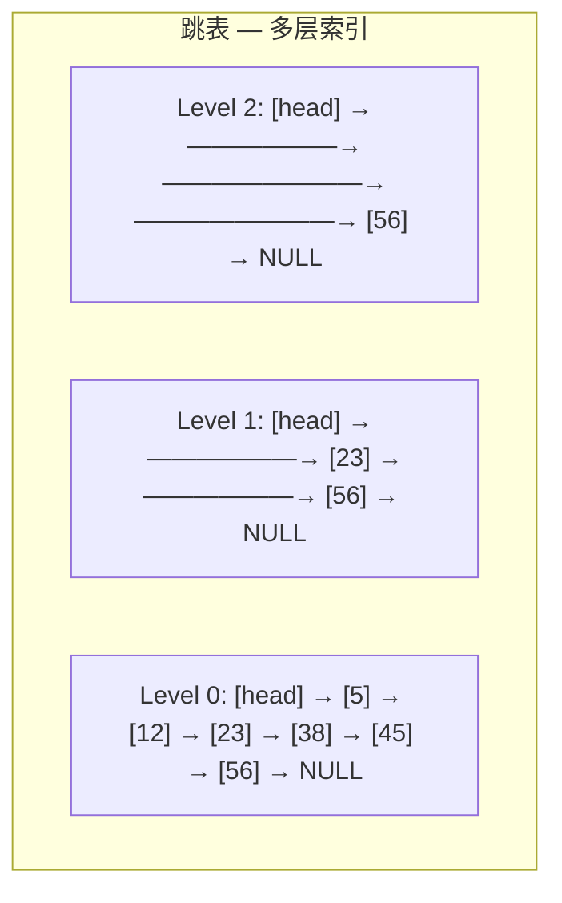

建议先阅读: [[E_链表_LinkedList|链表]]

---

## 原理

跳表（Skip List）是 William Pugh 在 1990 年提出的概率数据结构——通过在有序链表上构建多层"快速通道"，以随机化的方式实现 $O(\log n)$ 的查找、插入和删除。跳表使用随机性替代了平衡树的旋转操作——不保证最坏情况，但在期望意义上实现了与 AVL/红黑树相同的渐近性能。Redis 的有序集合（ZSet）内部以跳表实现。

### 核心结构



- **Level 0**（底层）是包含所有元素的有序链表
- 每个上层节点是下层的一个随机子集——以概率 $p$（通常 $0.5$ 或 $0.25$）决定是否将节点提升到更高层
- 查找从最高层开始——因为每层跨度大，可以跳过大量元素。当不能继续向右走时，下降一层继续

### 查找路径分析

在跳表中查找元素 $x$：

1. 从最高层的 `head` 开始
2. 只要当前层的下一个节点值 $< x$，就向右移动——这一步跨过所有被跳过的中间值
3. 当下一步将越过 $x$ 时，降一层，重复步骤 2
4. 到达 Level 0 后，要么找到 $x$ 要么确定不存在

每一步"向右"跨过的元素数约为 $1/p$（几何分布的期望），总层数期望为 $\log_{1/p}(n)$。因此总步数的期望：

$$
\text{expected comparisons} \approx \log_{1/p}(n) / p
$$

以 $p = 0.5$ 计算，期望步数 $\approx 2 \cdot \log_2(n)$。以 $p = 0.25$（Redis ZSet）计算，期望步数 $\approx 4 \cdot \log_4(n)$——层数减少，但每层需要更多的横向步进。Redis 选择 $p = 0.25$ 是因为它减少了总指针数，降低了内存开销。

### 层级的随机生成

每个新节点的层数由随机试验决定——这是跳表的概率性核心：

```c
int random_level(double p, int max_level) {
 int level = 1;
 while ((double)rand() / RAND_MAX < p && level < max_level)
 level++;
 return level;
}
```

层级 $k$ 出现的概率为 $p^{k-1}$。期望每个节点的指针数为 $\frac{1}{1-p}$。对于 $p = 0.5$，期望指针数 = 2；对于 $p = 0.25$，期望指针数 = 1.33——Redis ZSet 的每个节点平均只有 1.33 个指针，而双向链表节点有 2 个指针（prev + next）。跳表的总内存接近甚至低于双向链表。

### 跳表为何是平衡树的实用替代

| 特性 | 跳表 | 红黑树 |
|------|------|--------|
| 实现复杂度 | ~150 行 C | ~350+ 行 C |
| 是否需旋转 | 否——插入只需改指针 | 是——插入后最多 3 次旋转 |
| 并发友好 | 是——锁可局部化到被修改节点 | 困难——旋转影响多个节点 |
| 范围查询 | 天然——Level 0 是有序链表 | 需中序遍历 |
| 最坏情况 | 概率极低（所有节点同层的概率 = $p^{n}$） | $O(\log n)$ 保证 |

跳表的最坏情况是所有节点碰巧都只有 1 层（退化为普通链表）。概率为 $(1-p)^n \approx e^{-pn}$——对于 $n = 100000$ 和 $p = 0.5$，概率约为 $e^{-50000}$，低于宇宙射线翻转内存 bit 的概率。在工程实践中，跳表的随机化退化和 AVL 的旋转退化同等不切实际。

---

## 实现

### 跳表核心操作

```c
#include <stdlib.h>
#include <time.h>

#define MAX_LEVEL 32
#define P 0.25

typedef struct SkipNode {
 int key, value;
 struct SkipNode* forward[]; // 柔性数组: forward[level]
} SkipNode;

typedef struct {
 SkipNode* header;
 int level; // 当前最大层数
} SkipList;

SkipNode* sl_create_node(int level, int key, int value) {
 SkipNode* node = malloc(sizeof(SkipNode) + level * sizeof(SkipNode*));
 node->key = key; node->value = value;
 return node;
}

void sl_init(SkipList* sl) {
 sl->header = sl_create_node(MAX_LEVEL, 0, 0);
 sl->level = 1;
 for (int i = 0; i < MAX_LEVEL; i++)
 sl->header->forward[i] = NULL;
}

static int random_level(void) {
 int level = 1;
 while ((double)rand() / RAND_MAX < P && level < MAX_LEVEL)
 level++;
 return level;
}

// 查找: 返回指定 key 的节点指针, 并记录各级前驱到 update[] 中
SkipNode* sl_find(SkipList* sl, int key, SkipNode** update) {
 SkipNode* cur = sl->header;
 for (int i = sl->level - 1; i >= 0; i--) {
 while (cur->forward[i] && cur->forward[i]->key < key)
 cur = cur->forward[i];
 if (update) update[i] = cur; // 记录第 i 层的前驱
 }
 cur = cur->forward[0];
 if (cur && cur->key == key) return cur;
 return NULL;
}

void sl_insert(SkipList* sl, int key, int value) {
 SkipNode* update[MAX_LEVEL];
 SkipNode* existing = sl_find(sl, key, update);
 if (existing) { existing->value = value; return; } // 更新

 int new_level = random_level();
 if (new_level > sl->level) {
 for (int i = sl->level; i < new_level; i++)
 update[i] = sl->header; // 超出现有层的前驱 = header
 sl->level = new_level;
 }

 SkipNode* node = sl_create_node(new_level, key, value);
 for (int i = 0; i < new_level; i++) {
 node->forward[i] = update[i]->forward[i]; // 插入链表的标准操作
 update[i]->forward[i] = node;
 }
}

void sl_destroy(SkipList* sl) {
 SkipNode* cur = sl->header->forward[0];
 while (cur) {
 SkipNode* next = cur->forward[0];
 free(cur);
 cur = next;
 }
 free(sl->header);
}
```

---

## 各语言标准库对比

| 语言 | 跳表支持 | 说明 |
|------|:---:|------|
| C | 无 | 手写或第三方 |
| C++ | 无标准库 | 可用 `std::set`（红黑树）替代 |
| Java | `ConcurrentSkipListMap` | 并发跳表，线程安全 |
| Python | 无标准库 | `sortedcontainers` 第三方 |
| Redis | 内置 | ZSet 有序集合使用跳表 |

---

## 练习

| 题号 | 题目 | 说明 |
|------|------|------|
| [1206](https://leetcode.cn/problems/design-skiplist/) | 设计跳表 | 跳表实现 |
| [220](https://leetcode.cn/problems/contains-duplicate-iii/) | 存在重复元素 III | 有序集合 |

## 动手实验

| 编号 | 题目 | 说明 |
|:----:|------|------|
| E1 | 层级分布验证 | 插入 10 万个元素到跳表（p=0.25），统计 level=1,2,3,... 的节点个数，与理论分布 $p^{level-1}$ 对比。用直方图验证随机生成器的正确性 |
| E2 | 跳表 vs std::set 查找实测 | 随机插入 10 万元素，分别用跳表和 `std::set`（红黑树）做 10 万次随机查找，计时并统计 cache miss。解释两者的性能差异来源 |

|------|-----------|------|
| 查找 | $O(\log n)$ | 期望比较次数 $\approx \log_{1/p}(n)$ |
| 插入 | $O(\log n)$ | 随机决定层数 + 更新指针 |
| 删除 | $O(\log n)$ | 找到节点 + 更新各层前驱指针 |
| 空间 | $O(n)$ | 期望指针数 $= \frac{n}{1-p}$ |

### 与平衡树的对比

| 特性 | 跳表 | 红黑树/AVL |
|------|------|-----------|
| 实现难度 | 中等 | 困难 |
| 是否需要旋转 | 否 | 是 |
| 并发友好 | 是（局部修改） | 困难（全局旋转） |
| 最坏情况 | O(n) 概率极低 | O(log n) 确定 |
| 范围查询 | 天然支持 | 需中序遍历 |

---

## 实现

```c
#include <stdlib.h>
#include <time.h>

#define MAX_LEVEL 16

typedef struct SLNode {
 int key;
 int value;
 struct SLNode** forward; // 各层后继指针
} SLNode;

typedef struct {
 SLNode* header;
 int currentLevel;
 double probability;
} SkipList;

static SLNode* sl_create_node(int key, int value, int level) {
 SLNode* node = malloc(sizeof(SLNode));
 node->key = key;
 node->value = value;
 node->forward = calloc(level + 1, sizeof(SLNode*));
 return node;
}

static int sl_random_level(double prob) {
 int level = 0;
 while ((double)rand() / RAND_MAX < prob && level < MAX_LEVEL)
 level++;
 return level;
}

void sl_init(SkipList* sl) {
 srand((unsigned)time(NULL));
 sl->probability = 0.5;
 sl->currentLevel = 0;
 sl->header = sl_create_node(0, 0, MAX_LEVEL);
}

void sl_destroy(SkipList* sl) {
 SLNode* cur = sl->header->forward[0];
 while (cur) {
 SLNode* next = cur->forward[0];
 free(cur->forward);
 free(cur);
 cur = next;
 }
 free(sl->header->forward);
 free(sl->header);
}

int sl_search(SkipList* sl, int key, int* out_value) {
 SLNode* cur = sl->header;
 for (int i = sl->currentLevel; i >= 0; i--) {
 while (cur->forward[i] && cur->forward[i]->key < key)
 cur = cur->forward[i];
 }
 cur = cur->forward[0];
 if (cur && cur->key == key) {
 *out_value = cur->value;
 return 1;
 }
 return 0;
}

void sl_insert(SkipList* sl, int key, int value) {
 SLNode* update[MAX_LEVEL + 1];
 SLNode* cur = sl->header;

 for (int i = sl->currentLevel; i >= 0; i--) {
 while (cur->forward[i] && cur->forward[i]->key < key)
 cur = cur->forward[i];
 update[i] = cur;
 }
 cur = cur->forward[0];

 if (cur && cur->key == key) {
 cur->value = value;
 return;
 }

 int new_level = sl_random_level(sl->probability);
 if (new_level > sl->currentLevel) {
 for (int i = sl->currentLevel + 1; i <= new_level; i++)
 update[i] = sl->header;
 sl->currentLevel = new_level;
 }

 SLNode* new_node = sl_create_node(key, value, new_level);
 for (int i = 0; i <= new_level; i++) {
 new_node->forward[i] = update[i]->forward[i];
 update[i]->forward[i] = new_node;
 }
}

int sl_remove(SkipList* sl, int key) {
 SLNode* update[MAX_LEVEL + 1];
 SLNode* cur = sl->header;

 for (int i = sl->currentLevel; i >= 0; i--) {
 while (cur->forward[i] && cur->forward[i]->key < key)
 cur = cur->forward[i];
 update[i] = cur;
 }
 cur = cur->forward[0];

 if (!cur || cur->key != key) return 0;

 for (int i = 0; i <= sl->currentLevel; i++) {
 if (update[i]->forward[i] != cur) break;
 update[i]->forward[i] = cur->forward[i];
 }
 free(cur->forward);
 free(cur);

 while (sl->currentLevel > 0 && !sl->header->forward[sl->currentLevel])
 sl->currentLevel--;

 return 1;
}
```

---

## 应用场景

- **Redis 有序集合（ZSet）**: 跳表 + 哈希表，支持按分数排序、范围查询、排名
- **LevelDB MemTable**: 内存中使用跳表存储键值对，保证有序性
- **内存数据库索引**: 需要有序查找 + 范围扫描的场景

---

## 练习

| 题号 | 题目 | 说明 |
|------|------|------|
| [1206](https://leetcode.cn/problems/design-skiplist/) | 设计跳表 | 跳表实现 |
| [220](https://leetcode.cn/problems/contains-duplicate-iii/) | 存在重复元素 III | 有序集合 |

> 竞赛方向推荐洛谷/Codeforces。

## 动手实验

| 编号 | 题目 | 说明 |
|:----:|------|------|
| E1 | 跳表层高分布验证 | 插入 10 万个元素到跳表，统计 level=0,1,2,3,... 的节点个数，与理论概率 `p^(level)` 和 `p^(level)*(1-p)` 对比，画出对数分布图 |
| E2 | 跳表 vs 平衡树查找性能 | 随机插入 10 万条数据，分别用跳表和 C++ std::set（红黑树）做 10 万次查找，计时比较 |
