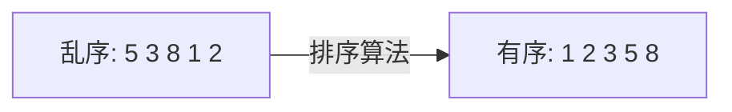
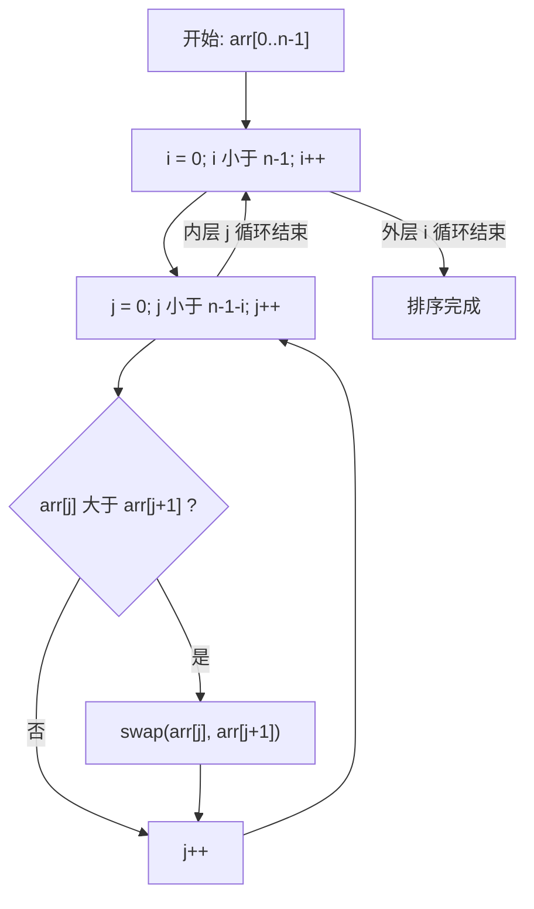
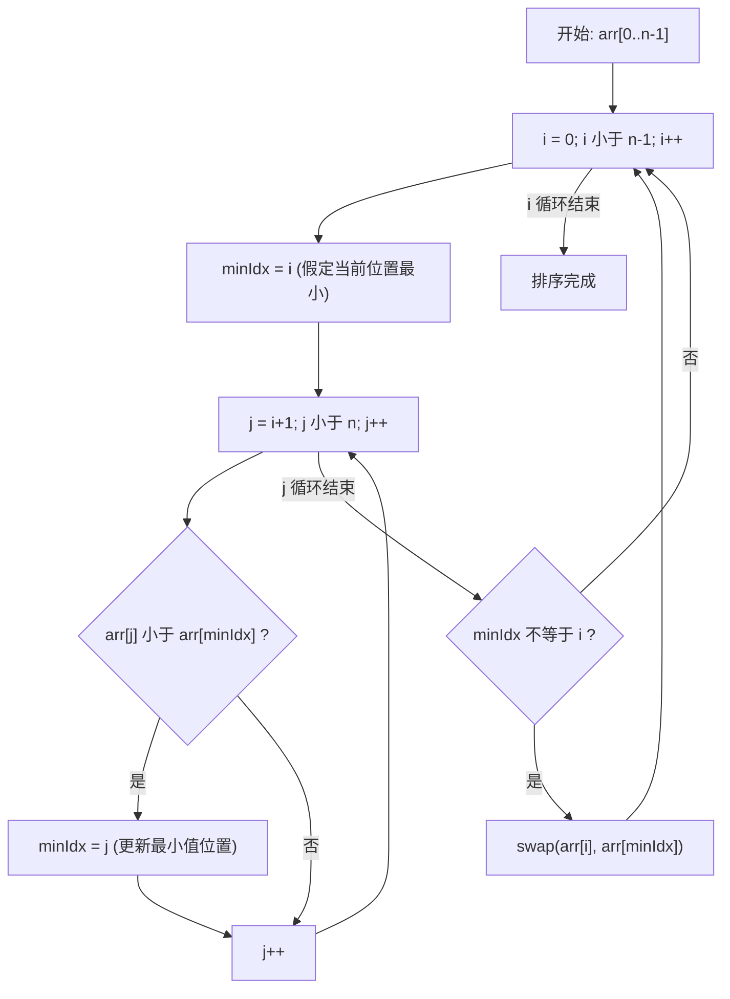
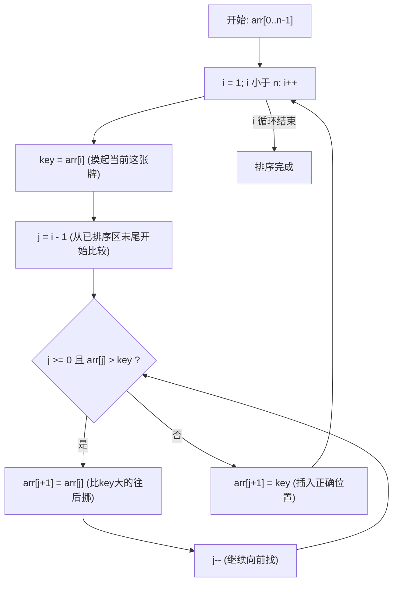
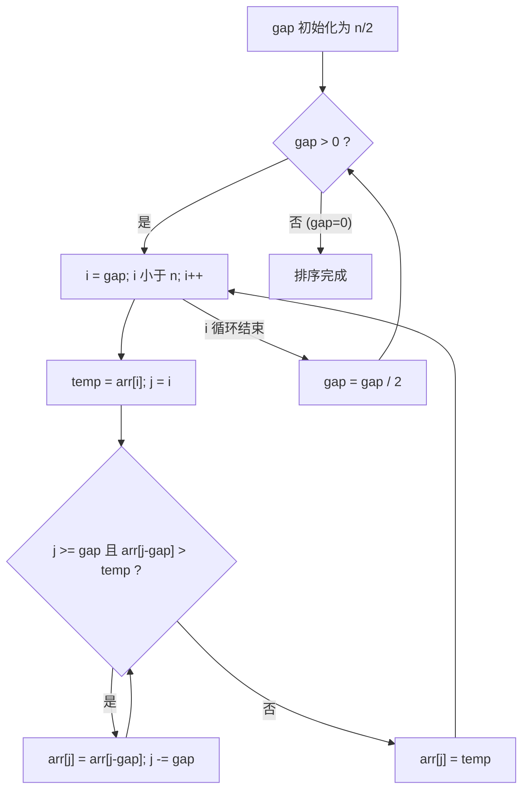
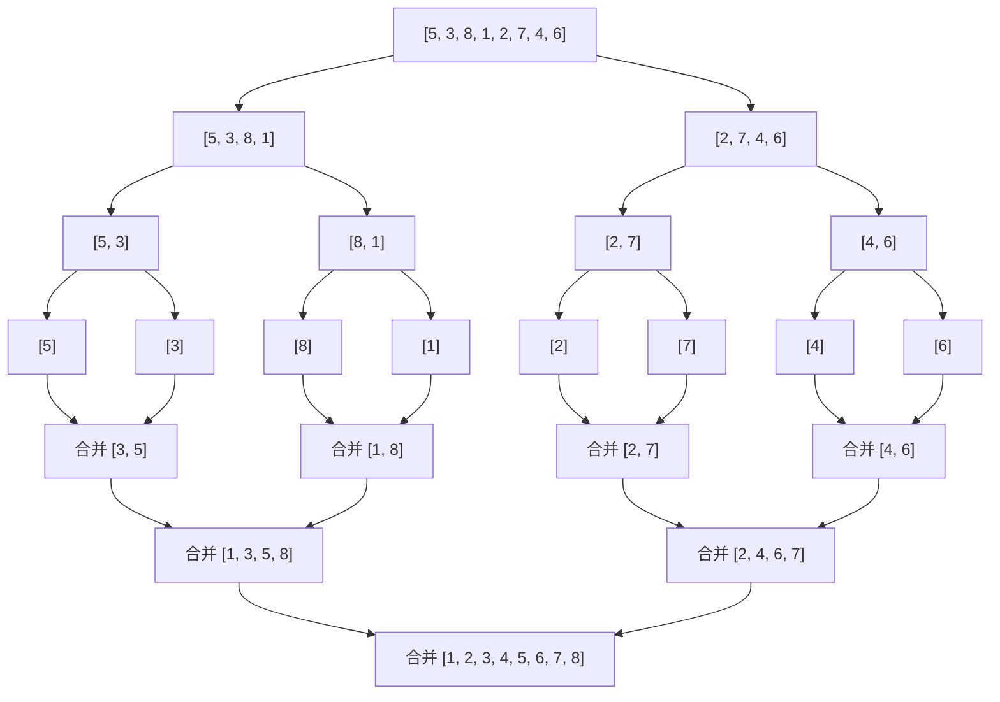
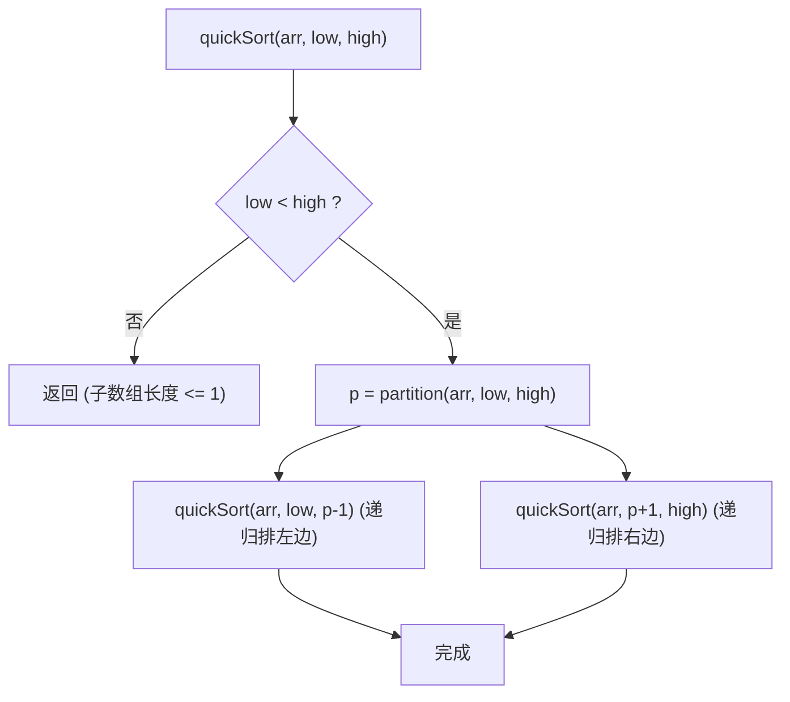
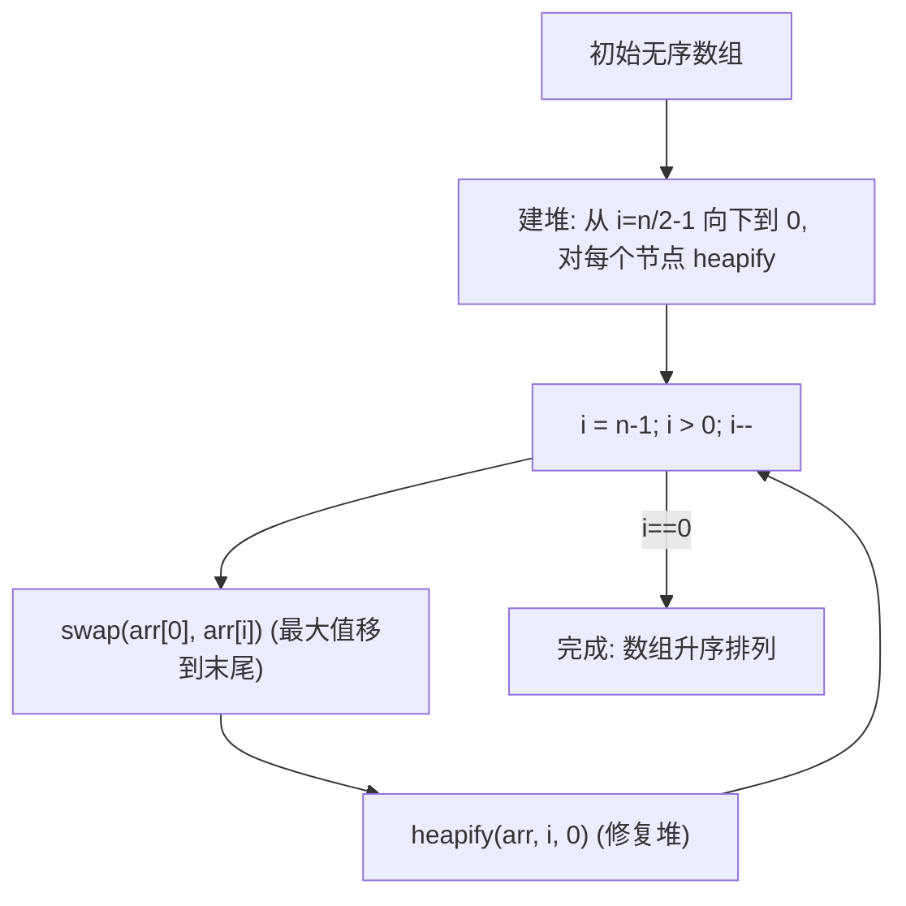
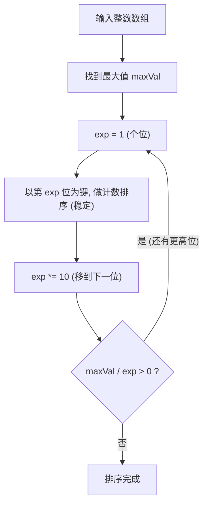
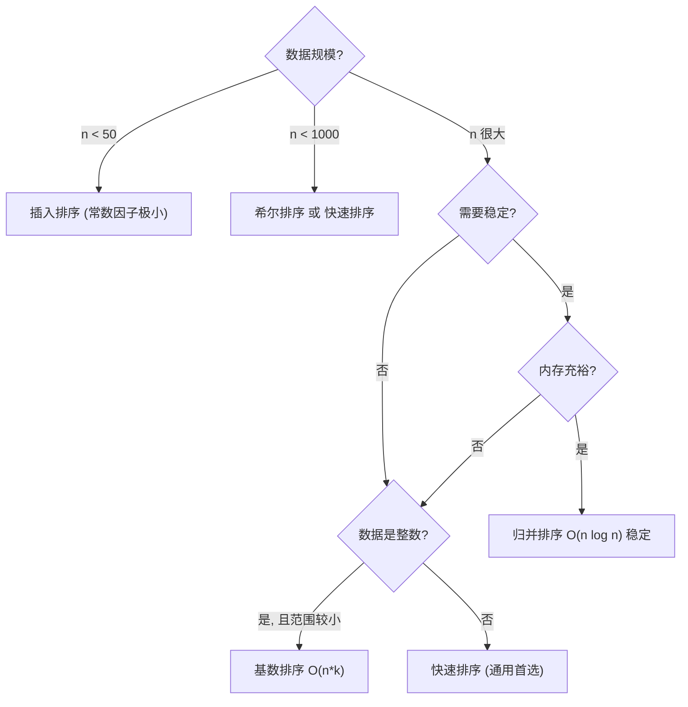

---
数据结构教程 — 八大排序算法 (8 Major Sorting Algorithms)
---

## 章节概述

排序是将一组无序数据按特定规则（升序或降序）重新排列的过程。排序算法是计算机科学中
最基础、最重要的算法之一，广泛应用于数据库索引、搜索引擎、数据压缩、图形渲染等场景。

本章从零开始，逐一讲解八大经典排序算法。每种算法都配有数学复杂度分析、Mermaid流程图
演示和完整可运行的伪代码，帮助初学者真正理解每种算法的运作原理。

> **前置知识**：需要掌握数组基础、循环、函数与递归。算法技巧目录中的
> [[../../算法技巧/排序|排序]] 含有洛谷 OJ 练习题，建议学完本章后去刷题巩固。

| 排序算法 | 平均时间 | 最坏时间 | 最好时间 | 空间 | 稳定性 |
|----------|----------|----------|----------|------|--------|
| 冒泡排序 | O(n^2) | O(n^2) | O(n) | O(1) | 稳定 |
| 选择排序 | O(n^2) | O(n^2) | O(n^2) | O(1) | 不稳定 |
| 插入排序 | O(n^2) | O(n^2) | O(n) | O(1) | 稳定 |
| 希尔排序 | O(n^1.3) | O(n^2) | O(n) | O(1) | 不稳定 |
| 归并排序 | O(n log n) | O(n log n) | O(n log n) | O(n) | 稳定 |
| 快速排序 | O(n log n) | O(n^2) | O(n log n) | O(log n) | 不稳定 |
| 堆排序   | O(n log n) | O(n log n) | O(n log n) | O(1) | 不稳定 |
| 基数排序 | O(n * k) | O(n * k) | O(n * k) | O(n + k) | 稳定 |

> **稳定性说明**：稳定排序保证相等元素的原始相对顺序不变。例如按成绩排序时，同分同学的
> 原顺序会被保留。不稳定排序不提供此保证。

---
### 第一节: 排序基础概念与准备工作
---

1.1 什么是排序
---------------

给定序列 R = {r1, r2, ..., rn}，其对应的关键字序列 K = {k1, k2, ..., kn}。
排序就是确定一种排列 p(1), p(2), ..., p(n)，使得：
k_{p(1)} <= k_{p(2)} <= ... <= k_{p(n)}（升序）



1.2 排序算法的评价标准
-----------------------

| 评价维度 | 含义 |
|----------|------|
| 时间复杂度 | 算法执行所需的比较/交换次数与数据规模 n 的关系 |
| 空间复杂度 | 算法额外占用的内存空间 |
| 稳定性 | 相等元素排序后是否保持原顺序 |
| 原地排序 | 是否不需要额外的大数组（空间 O(1) 或 O(log n)） |
| 适应性 | 是否利用输入数据已有的有序性 |

1.3 本章使用的测试数组与辅助函数
---------------------------------

```pseudocode
FUNCTION printArray(arr, msg=""):
    IF msg IS NOT EMPTY THEN
        DISPLAY msg, ": "
    END IF
    FOR EACH x IN arr:
        DISPLAY x, " "
    END FOR
    DISPLAY NEWLINE
END FUNCTION

FUNCTION isSorted(arr):
    FOR i FROM 1 TO LENGTH(arr) - 1:
        IF arr[i] < arr[i - 1] THEN
            RETURN FALSE
        END IF
    END FOR
    RETURN TRUE
END FUNCTION
```

---
**实现练习**: 用 C 或 C++ 自行实现上述结构。完成后与 AI 对话检查正确性。
---

---
### 第二节: 冒泡排序 — 相邻比较，大的往后沉
---

2.1 排序原理
-------------

从左向右，依次比较相邻的两个元素。如果左边的比右边的大，就交换它们的位置。
走完一整轮后，本轮中最大的那个元素一定会被推到最右端（就像水里的气泡浮到水面）。
然后忽略最右边的已归位元素，对剩下的元素重复同样的操作。
每一轮都会有一个"当前最大"的元素归位，总共需要 n-1 轮。



2.2 逐步推演 — 数组 [5, 3, 8, 1, 2]
---------------------------------------

初始状态，数组有 5 个元素，需要 4 轮才能完全排好。用 "|" 标记已归位的边界。

```text
初始数组:    [ 5   3   8   1   2 ]
索引:         0   1   2   3   4
```

**第 1 轮 (i=0)**：从索引 0 开始，比较相邻元素，把本轮最大值 8 推到最右。

```text
j=0:  比较 arr[0]=5 和 arr[1]=3
      5 > 3, 交换 → [ 3   5   8   1   2 ]

j=1:  比较 arr[1]=5 和 arr[2]=8
      5 < 8, 不动 → [ 3   5   8   1   2 ]

j=2:  比较 arr[2]=8 和 arr[3]=1
      8 > 1, 交换 → [ 3   5   1   8   2 ]

j=3:  比较 arr[3]=8 和 arr[4]=2
      8 > 2, 交换 → [ 3   5   1   2   8 ]
                              ↑
                            8 已归位(索引4)

本轮结束: [ 3   5   1   2 | 8 ]
                           归位区
```

**第 2 轮 (i=1)**：忽略索引 4（8 已归位），在 [0..3] 范围内冒泡。

```text
j=0:  比较 arr[0]=3 和 arr[1]=5
      3 < 5, 不动 → [ 3   5   1   2 | 8 ]

j=1:  比较 arr[1]=5 和 arr[2]=1
      5 > 1, 交换 → [ 3   1   5   2 | 8 ]

j=2:  比较 arr[2]=5 和 arr[3]=2
      5 > 2, 交换 → [ 3   1   2   5 | 8 ]
                              ↑
                            5 已归位(索引3)

本轮结束: [ 3   1   2 | 5   8 ]
                     归位区
```

**第 3 轮 (i=2)**：在 [0..2] 范围内冒泡。

```text
j=0:  比较 arr[0]=3 和 arr[1]=1
      3 > 1, 交换 → [ 1   3   2 | 5   8 ]

j=1:  比较 arr[1]=3 和 arr[2]=2
      3 > 2, 交换 → [ 1   2   3 | 5   8 ]
                         ↑
                       3 已归位(索引2)

本轮结束: [ 1   2 | 3   5   8 ]
                归位区
```

**第 4 轮 (i=3)**：在 [0..1] 范围内冒泡。

```text
j=0:  比较 arr[0]=1 和 arr[1]=2
      1 < 2, 不动 → [ 1   2 | 3   5   8 ]

本轮无任何交换，数组已完全有序。
```

最终结果

```text
[ 1   2   3   5   8 ]
```

2.3 核心代码
-------------

```pseudocode
FUNCTION bubbleSort(arr):
    n = LENGTH(arr)
    FOR i FROM 0 TO n - 2:                     // 外层: n-1 轮
        swapped = FALSE                         // 本轮是否发生过交换
        FOR j FROM 0 TO n - 2 - i:              // 内层: 比较相邻元素
            IF arr[j] > arr[j + 1] THEN
                SWAP(arr[j], arr[j + 1])        // 大的往后移
                swapped = TRUE
            END IF
        END FOR
        IF NOT swapped THEN BREAK               // 本轮无交换 → 已有序, 提前结束
    END FOR
END FUNCTION
```

| 代码行 | 作用 |
|--------|------|
| `FOR i FROM 0 TO n-2` | 控制轮数，共 n-1 轮 |
| `n - 1 - i` | 每轮比较范围缩小 1，因为右侧已有 i 个元素归位 |
| `IF arr[j] > arr[j+1]` | 相邻比较，左边大于右边才交换 |
| `swapped` 标志 | 本轮无交换说明已有序，提前退出，最好情况 O(n) |

---
**实现练习**: 用 C 或 C++ 自行实现上述结构。完成后与 AI 对话检查正确性。
---

2.4 复杂度分析
---------------

| 情况 | 时间复杂度 | 说明 |
|------|-----------|------|
| 最好 | O(n) | 数组已有序，第一轮扫描无交换，swapped=false 直接退出 |
| 最坏 | O(n^2) | 数组完全逆序，每轮都要把最大值从头推到尾 |
| 平均 | O(n^2) | 比较次数约 n(n-1)/2，交换次数约 n(n-1)/4 |
| 空间 | O(1) | 原地排序，只用了 swapped 标志和循环变量 |

> **数学推导**（最坏情况比较次数）：第 1 轮比较 n-1 次，第 2 轮比较 n-2 次，...，
> 第 n-1 轮比较 1 次。总和 = (n-1)+(n-2)+...+1 = n(n-1)/2 = O(n^2)。

---
### 第三节: 选择排序 — 每轮选最小，放到最前面
---

3.1 排序原理
-------------

每一轮，从"尚未排序"的部分中找出最小的那个元素，把它和"尚未排序部分的第一个位置"
交换。于是这个最小元素就"归位"了。然后缩小未排序范围，重复这一过程。
经过 n-1 轮后，所有元素归位。

关键区别：冒泡排序是相邻交换（交换次数多），选择排序是每轮只交换一次（把最小值和
最前面位置交换），交换次数从 O(n^2) 降到了 O(n)。



3.2 逐步推演 — 数组 [5, 3, 8, 1, 2]
---------------------------------------

初始数组，左边是未排序区，右边是已排序区（初始为空）。

```text
初始数组:    [ 5   3   8   1   2 ]
索引:         0   1   2   3   4
未排序区间:   [0 .. 4]
```

**第 1 轮 (i=0)**：在未排序区 [0..4] 中找最小值，放到索引 0。

```text
遍历 j=1: arr[1]=3 < arr[minIdx]=5 → minIdx=1 (3更小)
遍历 j=2: arr[2]=8 < arr[minIdx]=3 → 否, minIdx保持1
遍历 j=3: arr[3]=1 < arr[minIdx]=3 → minIdx=3 (1更小)
遍历 j=4: arr[4]=2 < arr[minIdx]=1 → 否, minIdx保持3

找到: 最小值=1, 位置在索引3
操作: swap(arr[0], arr[3])

交换前: [ 5   3   8   1   2 ]
         0   1   2   3   4
         ↑               ↑
        第0位          最小值位

交换后: [ 1   3   8   5   2 ]
         0   1   2   3   4

结果: 索引0(值为1)已归位
未排序区间缩小为 [1..4]
```

**第 2 轮 (i=1)**：在未排序区 [1..4] 中找最小值，放到索引 1。

```text
遍历: arr[1]=3, arr[2]=8, arr[3]=5, arr[4]=2
      minIdx从1更新为4 (arr[4]=2最小)

找到: 最小值=2, 位置在索引4
操作: swap(arr[1], arr[4])

交换前: [ 1 | 3   8   5   2 ]
         0   1   2   3   4

交换后: [ 1 | 2   8   5   3 ]
         0   1   2   3   4

结果: 索引0-1已归位
未排序区间缩小为 [2..4]
```

**第 3 轮 (i=2)**：在未排序区 [2..4] 中找最小值。

```text
遍历: arr[2]=8, arr[3]=5, arr[4]=3
      minIdx从2更新为4 (arr[4]=3最小)

操作: swap(arr[2], arr[4])

交换前: [ 1   2 | 8   5   3 ]
         0   1   2   3   4

交换后: [ 1   2 | 3   5   8 ]
         0   1   2   3   4

结果: 索引0-2已归位
未排序区间缩小为 [3..4]
```

**第 4 轮 (i=3)**：在未排序区 [3..4] 中找最小值。

```text
遍历: arr[3]=5, arr[4]=8, arr[3]就是最小的 → minIdx=3不变

minIdx == i, 不需要交换

结果: 索引0-4全部有序
```

最终结果

```text
[ 1   2   3   5   8 ]
```

3.3 核心代码
-------------

```pseudocode
FUNCTION selectionSort(arr):
    n = LENGTH(arr)
    FOR i FROM 0 TO n - 2:                     // 外层: n-1 轮
        minIdx = i                              // 假设当前位是最小的
        FOR j FROM i + 1 TO n - 1:              // 在未排序区找真正的最小值
            IF arr[j] < arr[minIdx] THEN
                minIdx = j                      // 更新最小值位置
            END IF
        END FOR
        IF minIdx != i THEN                     // 如果最小值不在当前位置
            SWAP(arr[i], arr[minIdx])           // 把最小值交换到前方
        END IF
    END FOR
END FUNCTION
```

| 代码行 | 作用 |
|--------|------|
| `FOR i FROM 0 TO n-2` | 每轮确定一个元素的位置，共 n-1 轮 |
| `minIdx = i` | 先假设未排序区的第一个就是最小值 |
| `FOR j FROM i+1 TO n-1` | 扫描剩余未排序元素 |
| `IF arr[j] < arr[minIdx]` | 找到更小的就更新 minIdx |
| `SWAP(arr[i], arr[minIdx])` | 每轮最多交换一次 |

---
**实现练习**: 用 C 或 C++ 自行实现上述结构。完成后与 AI 对话检查正确性。
---

3.4 复杂度分析
---------------

| 情况 | 时间复杂度 | 说明 |
|------|-----------|------|
| 最好 | O(n^2) | 即使数组已有序，仍需扫描所有剩余元素找最小值 |
| 最坏 | O(n^2) | 同上，选择排序不利用数据的有序性 |
| 平均 | O(n^2) | 比较次数恒为 n(n-1)/2 |
| 交换次数 | 最多 n-1 | 每轮最多交换一次，远少于冒泡排序 |
| 空间 | O(1) | 原地排序 |

> 选择排序与冒泡排序同为 O(n^2)，但选择排序的交换次数只有 O(n)，
> 因此在对写操作代价高的场景（如 Flash 存储）更有优势。

---
### 第四节: 插入排序 — 像理扑克牌一样，逐张插入
---

4.1 排序原理
-------------

打牌时，你摸起一张新牌，会把它插入到手中已有牌的正确位置——这就是插入排序。
具体做法：从数组的第 2 个元素（索引 1）开始，把它当作"新摸的牌"（key），
向前扫描已排序部分，遇到比 key 大的元素就往后挪一位，直到找到 key 的正确位置，
把它放进去。



4.2 逐步推演 — 数组 [5, 3, 8, 1, 2]
---------------------------------------

用 "|" 分隔已排序区和未排序区。一开始已排序区只有第一个元素 [5]。

```text
初始: [ 5 | 3   8   1   2 ]
        ↑已排序    ↑未排序
```

**i=1, key=3**：将 3 插入到已排序区 [5] 的正确位置。

```text
已排序区: [5], key=3

j=0: arr[0]=5 > 3 → 把5往后挪一位
     数组变为: [ 5   5 | 8   1   2 ]
              (3被覆盖了, 但存在key变量中)

j=-1: j<0, 循环停止

插入: arr[0] = key = 3
      数组变为: [ 3   5 | 8   1   2 ]

说明: 3 插到了 5 的前面，已排序区现在是 [3, 5]
```

**i=2, key=8**：将 8 插入到已排序区 [3, 5] 的正确位置。

```text
已排序区: [3, 5], key=8

j=1: arr[1]=5 < 8 → 不需要挪动, 直接停止

插入: arr[2] = key = 8 (就在原位, 不需要移动)
      数组变为: [ 3   5   8 | 1   2 ]

说明: 8 比已排序区所有元素都大, 直接放在末尾, 已排序区现在是 [3, 5, 8]
```

**i=3, key=1**：将 1 插入到已排序区 [3, 5, 8] 的正确位置。

```text
已排序区: [3, 5, 8], key=1

j=2: arr[2]=8 > 1 → 把8往后挪一位
     数组变为: [ 3   5   8   8 | 2 ]
    (索引3变成了8)

j=1: arr[1]=5 > 1 → 把5往后挪一位
     数组变为: [ 3   5   5   8 | 2 ]
    (索引2变成了5)

j=0: arr[0]=3 > 1 → 把3往后挪一位
     数组变为: [ 3   3   5   8 | 2 ]
    (索引1变成了3)

j=-1: j<0, 循环停止

插入: arr[0] = key = 1
      数组变为: [ 1   3   5   8 | 2 ]

说明: 1 一直往前挪, 最终放在最前面, 已排序区现在是 [1, 3, 5, 8]
```

**i=4, key=2**：将 2 插入到已排序区 [1, 3, 5, 8] 的正确位置。

```text
已排序区: [1, 3, 5, 8], key=2

j=3: arr[3]=8 > 2 → 把8往后挪
     数组变为: [ 1   3   5   8   8 ]

j=2: arr[2]=5 > 2 → 把5往后挪
     数组变为: [ 1   3   5   5   8 ]

j=1: arr[1]=3 > 2 → 把3往后挪
     数组变为: [ 1   3   3   5   8 ]

j=0: arr[0]=1 < 2 → 1 不大于 2, 停止

插入: arr[1] = key = 2
      数组变为: [ 1   2   3   5   8 ]

说明: 2 插在了 1 和 3 之间, 数组全部有序
```

最终结果

```text
[ 1   2   3   5   8 ]
```

4.3 核心代码
-------------

```pseudocode
FUNCTION insertionSort(arr):
    n = LENGTH(arr)
    FOR i FROM 1 TO n - 1:                    // 从第2个元素开始
        key = arr[i]                           // 保存当前要插入的值
        j = i - 1                              // 从已排序区末尾开始比较
        WHILE j >= 0 AND arr[j] > key:         // 比 key 大的元素
            arr[j + 1] = arr[j]                // 统统往后挪一位
            j = j - 1                           // 继续向前找位置
        END WHILE
        arr[j + 1] = key                       // key 归位
    END FOR
END FUNCTION
```

| 代码行 | 作用 |
|--------|------|
| `key = arr[i]` | 保存当前元素，因为挪位时会覆盖它 |
| `WHILE j >= 0 AND arr[j] > key` | 在已排序区从后往前找插入位置 |
| `arr[j + 1] = arr[j]` | 比 key 大的元素统统向后挪一位 |
| `arr[j + 1] = key` | 循环结束后 j 停在 ≤key 的位置，插在它后面 |

---
**实现练习**: 用 C 或 C++ 自行实现上述结构。完成后与 AI 对话检查正确性。
---

4.4 复杂度分析
---------------

| 情况 | 时间复杂度 | 说明 |
|------|-----------|------|
| 最好 | O(n) | 数组已有序，每个元素只需跟前一个比较一次 |
| 最坏 | O(n^2) | 数组逆序，每个新元素要挪动所有已排序元素 |
| 平均 | O(n^2) | 约 n^2/4 次比较 + n^2/4 次赋值 |
| 空间 | O(1) | 原地排序，只用了 key 和 j 两个额外变量 |

> **小数据王者**：虽然插入排序也是 O(n^2)，但在数据量小（n < 50）时，
> 它的常数因子极小（连续内存挪动很快），实际运行速度往往超过快速排序。
> 工业级排序实现在子数组小于 16 个元素时通常切换到插入排序。

---
### 第五节: 希尔排序 — 分组跳跃，大步快跑
---

5.1 排序原理
-------------

插入排序在数据"基本有序"时接近 O(n)，非常高效。希尔排序利用这个特点：
先用一个较大的"间隔"（gap）把数组分成若干组（同一组的元素间隔为 gap），
对每组分别做插入排序；然后缩小 gap，重新分组再排序；最后 gap=1 时做一次
标准的插入排序。经过大间隔的"粗调"，数据已经基本有序，最后一轮几乎不费力气。



5.2 逐步推演 — 数组 [8, 3, 6, 1, 9, 2, 7, 4]，n=8
------------------------------------------------------

```text
初始数组:  [ 8   3   6   1   9   2   7   4 ]
索引:       0   1   2   3   4   5   6   7
```

**gap=4 阶段**：间隔 4，即索引差为 4 的元素分在一组。
```text
分组情况:
  组0: 索引 0, 4 → arr[0]=8, arr[4]=9  → [8, 9]  排序后不变
  组1: 索引 1, 5 → arr[1]=3, arr[5]=2  → [3, 2]  排序后 → [2, 3]
  组2: 索引 2, 6 → arr[2]=6, arr[6]=7  → [6, 7]  排序后不变
  组3: 索引 3, 7 → arr[3]=1, arr[7]=4  → [1, 4]  排序后不变

各组排序后，数组变为:
  [ 8   2   6   1   9   3   7   4 ]
   0   1   2   3   4   5   6   7
```

**gap=2 阶段**：间隔 2，索引差为 2 的元素分在同一组。
```text
分组情况:
  组0: 索引 0,2,4,6 → arr[0]=8, arr[2]=6, arr[4]=9, arr[6]=7
       → [8, 6, 9, 7] 插入排序 → [6, 7, 8, 9]
  组1: 索引 1,3,5,7 → arr[1]=2, arr[3]=1, arr[5]=3, arr[7]=4
       → [2, 1, 3, 4] 插入排序 → [1, 2, 3, 4]

各组排序后，数组变为:
  [ 6   1   7   2   8   3   9   4 ]
   0   1   2   3   4   5   6   7
```

**gap=1 阶段**：标准插入排序（此时数组已基本有序，几乎不费力气）。
```text
插入排序每一轮:
  i=1, key=1: [ 1   6   7   2   8   3   9   4 ]  (1前移到0)
  i=2, key=7: [ 1   6   7   2   8   3   9   4 ]  (7不用动)
  i=3, key=2: [ 1   2   6   7   8   3   9   4 ]  (2前移到1)
  i=4, key=8: [ 1   2   6   7   8   3   9   4 ]  (8不用动)
  i=5, key=3: [ 1   2   3   6   7   8   9   4 ]  (3前移到2)
  i=6, key=9: [ 1   2   3   6   7   8   9   4 ]  (9不用动)
  i=7, key=4: [ 1   2   3   4   6   7   8   9 ]  (4前移到3)
```

最终结果

```text
[ 1   2   3   4   6   7   8   9 ]
```

5.3 核心代码
-------------

```pseudocode
FUNCTION shellSort(arr):
    n = LENGTH(arr)
    // 使用 Knuth 间隔序列: 1, 4, 13, 40, 121, ...
    gap = 1
    WHILE gap < n // 3:
        gap = 3 * gap + 1
    END WHILE

    WHILE gap > 0:
        // 对每个分组进行插入排序
        FOR i FROM gap TO n - 1:
            temp = arr[i]
            j = i
            // 在当前分组内向前找插入位置
            WHILE j >= gap AND arr[j - gap] > temp:
                arr[j] = arr[j - gap]
                j = j - gap
            END WHILE
            arr[j] = temp
        END FOR
        gap = (gap - 1) // 3    // 缩小间隔 (Knuth 递推)
    END WHILE
END FUNCTION
```

| 代码行 | 作用 |
|--------|------|
| `WHILE gap < n//3: gap = 3*gap+1` | 计算最大初始 gap (Knuth 序列) |
| `FOR i FROM gap TO n-1` | 对每个分组逐元素插入排序 |
| `arr[j - gap] > temp` | 在当前分组内比较 (跨 gap 比较) |
| `gap = (gap - 1) // 3` | Knuth 序列逆推, 逐步缩小间隔 |

---
**实现练习**: 用 C 或 C++ 自行实现上述结构。完成后与 AI 对话检查正确性。
---

| 情况 | 时间复杂度 | 说明 |
|------|-----------|------|
| 最好 | O(n log n) | 取决于间隔序列 |
| 最坏 | O(n^2) | 某些低效间隔序列下会退化 |
| 平均 | 约 O(n^1.3) | Knuth 序列的经验值 |
| 空间 | O(1) | 原地排序 |
| 稳定性 | 不稳定 | 分组排序会打乱相等元素的相对顺序 |

---
### 第六节: 归并排序 — 分而治之，合二为一
---

6.1 排序原理
-------------

归并排序是"分治法"（Divide and Conquer）的典型应用，包含两个核心步骤：
1. **分**：把数组从正中间一分为二，对左右两半分别递归排序。
2. **合**：把两个已经排好序的子数组合并成一个大的有序数组。

关键操作是"合并"——已知左边和右边都已经有序，用两个指针分别指向左右子数组的起始位置，
每次比较两个指针所指元素，取较小的那个放入结果数组，然后移动对应指针。
如此反复，直到一个子数组耗尽，再把另一个子数组的剩余元素全部追加。



6.2 合并过程逐步推演
-----------------------

以合并左 [3, 5] 和右 [1, 8] 为例。左右子数组各自有序。

```text
左子数组:  [ 3   5 ]     指针 L → 指向 3
右子数组:  [ 1   8 ]     指针 R → 指向 1
临时数组:  [  _   _   _   _ ]     指针 K → 指向位置 0
```

```text
步骤 1: L 指向 3, R 指向 1
        比较: 3 > 1 → 选 1 放入 temp[0]
        temp = [ 1   _   _   _ ], K 移到 1, R 移到 8

步骤 2: L 指向 3, R 指向 8
        比较: 3 < 8 → 选 3 放入 temp[1]
        temp = [ 1   3   _   _ ], K 移到 2, L 移到 5

步骤 3: L 指向 5, R 指向 8
        比较: 5 < 8 → 选 5 放入 temp[2]
        temp = [ 1   3   5   _ ], K 移到 3, L 越界(左子数组耗尽)

步骤 4: 左子数组已空，把右子数组剩余 [8] 全部追加
        temp = [ 1   3   5   8 ]

把 temp 内容复制回原数组对应位置 → 合并完成
```

6.3 核心代码
-------------

```pseudocode
// 合并两个有序子数组 arr[left..mid] 和 arr[mid+1..right]
FUNCTION merge(arr, left, mid, right):
    temp = ARRAY of size (right - left + 1)    // 临时数组存合并结果
    i = left       // 左子数组指针
    j = mid + 1    // 右子数组指针
    k = 0          // 临时数组指针

    // 两边都有元素时, 取较小者
    WHILE i <= mid AND j <= right:
        IF arr[i] <= arr[j] THEN
            temp[k] = arr[i]    // 左边的小(或相等), 取左边
            i = i + 1
        ELSE
            temp[k] = arr[j]    // 右边的小, 取右边
            j = j + 1
        END IF
        k = k + 1
    END WHILE
    // 把剩余元素直接追加
    WHILE i <= mid:
        temp[k] = arr[i]; i = i + 1; k = k + 1
    END WHILE
    WHILE j <= right:
        temp[k] = arr[j]; j = j + 1; k = k + 1
    END WHILE

    // 复制回原数组
    FOR p FROM 0 TO k - 1:
        arr[left + p] = temp[p]
    END FOR
END FUNCTION

FUNCTION mergeSort(arr, left, right):
    IF left >= right THEN RETURN             // 子数组长度 ≤1, 无需排序
    mid = left + (right - left) // 2          // 防止溢出的写法
    mergeSort(arr, left, mid)                 // 递归排左边
    mergeSort(arr, mid + 1, right)            // 递归排右边
    merge(arr, left, mid, right)              // 合并左右
END FUNCTION
```

| 代码行 | 作用 |
|--------|------|
| `IF left >= right THEN RETURN` | 递归终止条件：子数组 ≤1 个元素 |
| `mid = left + (right-left)//2` | 防溢出计算中点 (等价于 (left+right)//2) |
| `arr[i] <= arr[j]` | <= 保证稳定性（相等时取左边，保持原顺序） |
| `temp[k] = arr[i]; i = i + 1; k = k + 1` | 后置递增：先赋值，再移动指针 |

---
**实现练习**: 用 C 或 C++ 自行实现上述结构。完成后与 AI 对话检查正确性。
---

6.4 复杂度分析
---------------

| 情况 | 时间复杂度 | 说明 |
|------|-----------|------|
| 最好 | O(n log n) | 递归树深度恒为 log2(n) |
| 最坏 | O(n log n) | 同上，每层合并始终 O(n) |
| 平均 | O(n log n) | 不依赖数据分布 |
| 空间 | O(n) | 合并时需要临时数组 |
| 稳定性 | 稳定 | `arr[i] <= arr[j]` 时优先取左半，保留原始顺序 |

> **主定理证明**：设 T(n) 为排序 n 个元素的时间。
> T(n) = 2T(n/2) + O(n)，其中 O(n) 是合并开销。
> 由主定理，a=2, b=2, d=1, log_b(a)=1=d，故 T(n) = O(n log n)。

---
### 第七节: 快速排序 — 选基准、分左右、递归排
---

7.1 排序原理
-------------

快速排序是实际应用中最快的通用排序算法。核心思想：
1. 选一个元素作为"基准"（pivot），这里以最右边元素为例。
2. **分区**：遍历数组，把小于 pivot 的元素全部放到左边，大于或等于 pivot 的放到右边。
   分区完成后，pivot 就被放到了它最终的正确位置。
3. 对 pivot 左边和右边的子数组，递归执行同样的分区操作。



7.2 分区过程逐步推演 — [5, 3, 8, 1, 2]，pivot=2（最右）
---------------------------------------------------------

分区函数维护一个指针 i，i 的左边（不含 i）是所有 < pivot 的元素，
从 i 到 j 之间是所有 >= pivot 的元素，j 是当前扫描位置。

```text
初始: pivot = arr[4] = 2
       i = 0  (指向"下一个小于pivot的元素应该放的位置")

当前数组: [ 5   3   8   1 | 2 ]
             i             pivot
```

```text
扫描 j=0: arr[0]=5, 5 >= 2 → 不动, i 仍为 0
扫描 j=1: arr[1]=3, 3 >= 2 → 不动, i 仍为 0
扫描 j=2: arr[2]=8, 8 >= 2 → 不动, i 仍为 0
扫描 j=3: arr[3]=1, 1 < 2  → swap(arr[i],arr[j]), 即 swap(arr[0],arr[3])
         i=0, j=3 → 交换 arr[0] 的 5 和 arr[3] 的 1
         数组变为: [ 1   3   8   5 | 2 ]
         i 移到 1

扫描完毕 (j>=high, 跳出循环)

最后一步: swap(arr[i], arr[high])
         即 swap(arr[1], arr[4]) → 交换 3 和 2
         数组变为: [ 1 | 2 | 8   5   3 ]
                      ↑    ↑
                     左边  pivot归位

pivot=2 已归位到索引 1。
左边 [1] 只有一个元素, 递归结束。
右边 [8, 5, 3] 需要继续递归。
```

```text
右边 [8, 5, 3] 递归:
  pivot = arr[2] = 3, i = 0(对应原数组索引2)

  扫描 j=0: arr[0]=8, 8 >= 3 → 不动
  扫描 j=1: arr[1]=5, 5 >= 3 → 不动
  扫描完毕, swap(arr[0], arr[2]) → 交换 8 和 3
  数组变为: [ 3 | 5   8 ]

  左边 [3] 结束, 右边 [5, 8] 递归:
    pivot=8, swap(arr[0],arr[1]) → [ 5 | 8 ]
    全部有序
```

最终结果

```text
[ 1   2   3   5   8 ]
```

7.3 核心代码
-------------

```pseudocode
FUNCTION partition(arr, low, high):
    pivot = arr[high]                         // 选最右元素为基准
    i = low                                   // i: 小于区的右边界

    FOR j FROM low TO high - 1:
        IF arr[j] < pivot THEN                // 发现一个小于 pivot 的元素
            SWAP(arr[i], arr[j])              // 交换到小于区
            i = i + 1                         // 小于区扩大
        END IF
    END FOR
    SWAP(arr[i], arr[high])                   // pivot 归位到正确位置
    RETURN i                                  // 返回 pivot 的最终位置
END FUNCTION

FUNCTION quickSort(arr, low, high):
    IF low < high THEN
        p = partition(arr, low, high)         // 分区, p 是 pivot 位置
        quickSort(arr, low, p - 1)            // 排左边
        quickSort(arr, p + 1, high)           // 排右边
    END IF
END FUNCTION
```

| 代码行 | 作用 |
|--------|------|
| `pivot = arr[high]` | 选最右为基准（简单但有序时会退化，见下方优化） |
| `IF arr[j] < pivot` | 发现小于 pivot 的，交换到前面 |
| `SWAP(arr[i], arr[high])` | 最终把 pivot 放到正确位置 |
| `RETURN i` | pivot 的最终位置，左右子数组以此为界 |

---
**实现练习**: 用 C 或 C++ 自行实现上述结构。完成后与 AI 对话检查正确性。
---

7.4 复杂度分析与优化
---------------------

| 情况 | 时间复杂度 | 说明 |
|------|-----------|------|
| 最好 | O(n log n) | pivot 每次正好在中位数附近，递归树深度 log n |
| 最坏 | O(n^2) | 已有序数组选最右 pivot，每次分区极不平衡 |
| 平均 | O(n log n) | 随机数据下递归树期望平衡 |
| 空间 | O(log n) | 递归栈深度 |
| 稳定性 | 不稳定 | 分区交换打乱相对顺序 |

> **关键陷阱**：对已有序数组使用最右 pivot 会导致 O(n^2)！
> 工程中常用"三数取中法"（median-of-three）或随机选 pivot 来避免。

7.5 优化：三数取中选 pivot
----------------------------

```pseudocode
FUNCTION medianOfThree(arr, low, high):
    mid = low + (high - low) // 2
    // 三数排序: 确保 arr[low] <= arr[mid] <= arr[high]
    IF arr[low] > arr[mid] THEN SWAP(arr[low], arr[mid])
    IF arr[low] > arr[high] THEN SWAP(arr[low], arr[high])
    IF arr[mid] > arr[high] THEN SWAP(arr[mid], arr[high])
    // 把中位数换到最右作为 pivot
    SWAP(arr[mid], arr[high])
    RETURN arr[high]
END FUNCTION
```

---
**实现练习**: 用 C 或 C++ 自行实现上述结构。完成后与 AI 对话检查正确性。
---

---
### 第八节: 堆排序 — 借助完全二叉树的力量
---

8.1 排序原理
-------------

堆排序利用"最大堆"这种数据结构：在最大堆中，每个父节点的值都不小于其子节点，
因此堆顶（根节点）一定是整个堆中的最大值。

排序分两步：
1. **建堆**：把无序数组重新组织成最大堆。从最后一个非叶子节点开始，自底向上调整。
2. **取最大值**：反复将堆顶（当前最大值）与堆的末尾元素交换，然后缩小堆的范围，
   对新的堆顶做"下沉"调整，使其恢复堆性质。每轮确定一个最大元素。



8.2 堆的树形结构
-----------------

数组用完全二叉树表示。对于索引 i：
- 左子节点: 2i + 1
- 右子节点: 2i + 2
- 父节点: (i - 1) / 2

```text
最大堆示例:

          10 (索引0)
        /       \
    5 (索引1)   3 (索引2)
    /    \      /
  4 (3) 1 (4)  (忽略)

数组: [10, 5, 3, 4, 1]
```

8.3 heapify 下沉操作逐步推演
-----------------------------

以数组 [4, 10, 3, 5, 1] 为例，演示对索引 0 做 heapify。

```text
初始状态 (索引0 的子树可能不满足堆性质):

          4 (索引0)
        /       \
    10 (索引1)   3 (索引2)
    /    \
  5 (3) 1 (4)

heapify(0): 检查节点 4 是否比孩子大

left=1: arr[1]=10 > arr[0]=4 → largest 更新为 1
right=2: arr[2]=3 < arr[1]=10 → largest 仍为 1
largest(1) != i(0) → 交换 arr[0] 和 arr[1]

交换后:
          10 (索引0)
        /       \
    4 (索引1)   3 (索引2)
    /    \
  5 (3) 1 (4)

递归 heapify(1): 节点 4 对子树继续检查
left=3: arr[3]=5 > arr[1]=4 → largest 更新为 3
right=4: arr[4]=1 < arr[3]=5 → largest 仍为 3
largest(3) != i(1) → 交换 arr[1] 和 arr[3]

结果:
          10 (索引0)
        /       \
    5 (索引1)   3 (索引2)
    /    \
  4 (3) 1 (4)

满足最大堆性质: 父节点 >= 子节点
```

8.4 核心代码
-------------

```pseudocode
FUNCTION heapify(arr, n, i):
    largest = i                              // 假设当前节点最大
    left = 2 * i + 1                         // 左孩子
    right = 2 * i + 2                        // 右孩子

    IF left < n AND arr[left] > arr[largest] THEN
        largest = left                       // 左孩子更大
    END IF
    IF right < n AND arr[right] > arr[largest] THEN
        largest = right                      // 右孩子更大
    END IF

    IF largest != i THEN                     // 如果最大不是当前节点
        SWAP(arr[i], arr[largest])           // 交换, 把大值"浮"上来
        heapify(arr, n, largest)             // 递归调整受影响的子树
    END IF
END FUNCTION

FUNCTION heapSort(arr):
    n = LENGTH(arr)
    // 步骤1: 建堆 (自底向上, 从最后一个非叶节点开始)
    FOR i FROM n // 2 - 1 DOWNTO 0:
        heapify(arr, n, i)
    END FOR

    // 步骤2: 逐一提取最大值
    FOR i FROM n - 1 DOWNTO 1:
        SWAP(arr[0], arr[i])                 // 最大值移到末尾
        heapify(arr, i, 0)                   // 对剩余堆重新调整
    END FOR
END FUNCTION
```

| 代码行 | 作用 |
|--------|------|
| `FOR i FROM n//2-1 DOWNTO 0` | 从最后一个非叶节点开始建堆 |
| `heapify(arr, n, i)` | 确保以 i 为根的子树满足最大堆 |
| `SWAP(arr[0], arr[i])` | 将当前堆的最大值（根）移到已排序区间 |
| `heapify(arr, i, 0)` | 把新的根下沉到正确位置，恢复堆性质 |

---
**实现练习**: 用 C 或 C++ 自行实现上述结构。完成后与 AI 对话检查正确性。
---

8.5 复杂度分析
---------------

| 情况 | 时间复杂度 | 说明 |
|------|-----------|------|
| 建堆 | O(n) | 不是 O(n log n)，自底向上 Floyd 法可严格证明为 O(n) |
| 排序 | O(n log n) | n 次 heapify，每次 O(log n) |
| 空间 | O(1) | 完全原地排序，不需要额外数组 |
| 稳定性 | 不稳定 | 堆调整时的交换可能打乱相等元素的顺序 |

> **建堆 O(n) 证明概要**：树有 log n 层，第 h 层最多有 n/2^(h+1) 个节点，
> 每个下沉最多 h 层。总下沉次数 = sum(h * n/2^(h+1)) <= n = O(n)。

---
### 第九节: 基数排序 — 不比较大小，按位排序
---

9.1 排序原理
-------------

前七种都是"比较型排序"——通过比较元素间的大小来决定顺序。
基数排序另辟蹊径：按照数字的每一位（个位、十位、百位...）分别排序。
每一位的排序使用"计数排序"，而且必须是稳定的——保证同一位相同数字的元素
保持上一轮排好的顺序。

关键思路：先按个位排，再按十位排，再按百位排...最高位结束后，整个数组就有序了。
为什么从低位往高位排？因为高位排序是最后进行的，高位不同的元素会按高位分开；
高位相同的元素，由于计数排序的稳定性，会保留之前低位排序的顺序。



9.2 逐步推演 — [170, 45, 75, 90, 802, 24, 2, 66]
---------------------------------------------------

```text
原始数组: [ 170   45   75   90   802   24   2   66 ]
最大值: 802, 有3位数 → 需要经过个位、十位、百位三轮
```

**第 1 轮: 按个位排序 (exp=1)**

```text
每个数字的个位:   170→0  45→5  75→5  90→0  802→2  24→4  2→2  66→6

计数排序(按个位分组):
  个位=0: [170, 90]      (原顺序: 170 在前, 90 在后)
  个位=2: [802, 2]       (原顺序: 802 在前, 2 在后)
  个位=4: [24]
  个位=5: [45, 75]       (原顺序: 45 在前, 75 在后)
  个位=6: [66]

按个位 0→2→4→5→6 合并:
  [ 170   90   802   2   24   45   75   66 ]
```

**第 2 轮: 按十位排序 (exp=10)**

```text
每个数字的十位:   170→7  90→9  802→0  2→0  24→2  45→4  75→7  66→6

计数排序(按十位分组):
  十位=0: [802, 2]       (802 在前, 2 在后 — 个位: 802→2, 2→2)
  十位=2: [24]
  十位=4: [45]
  十位=6: [66]
  十位=7: [170, 75]      (170 在前, 75 在后)
  十位=9: [90]

按十位 0→2→4→6→7→9 合并:
  [ 802   2   24   45   66   170   75   90 ]
```

**第 3 轮: 按百位排序 (exp=100)**

```text
每个数字的百位:   802→8  2→0  24→0  45→0  66→0  170→1  75→0  90→0

计数排序(按百位分组):
  百位=0: [2, 24, 45, 66, 75, 90]  (保留了上一轮十位的顺序)
  百位=1: [170]
  百位=8: [802]

按百位 0→1→8 合并:
  [ 2   24   45   66   75   90   170   802 ]
```

最终结果

```text
[ 2   24   45   66   75   90   170   802 ]
```

9.3 核心代码
-------------

```pseudocode
// 对 exp 位做稳定计数排序
FUNCTION countingSortByDigit(arr, exp):
    n = LENGTH(arr)
    output = ARRAY of size n
    count = ARRAY[0..9] filled with 0       // 计数数组, 每位 0-9

    // 步骤1: 统计每个数字出现的次数
    FOR i FROM 0 TO n - 1:
        digit = (arr[i] // exp) MOD 10
        count[digit] = count[digit] + 1
    END FOR

    // 步骤2: 前缀和 → count[i] 表示数字 i 应放的最后一个位置 +1
    FOR i FROM 1 TO 9:
        count[i] = count[i] + count[i - 1]
    END FOR

    // 步骤3: 从后往前遍历 → 保证稳定性
    FOR i FROM n - 1 DOWNTO 0:
        digit = (arr[i] // exp) MOD 10
        output[count[digit] - 1] = arr[i]   // 放入正确位置
        count[digit] = count[digit] - 1     // 该数字的计数减 1
    END FOR

    // 步骤4: 复制回原数组
    FOR i FROM 0 TO n - 1:
        arr[i] = output[i]
    END FOR
END FUNCTION

FUNCTION radixSort(arr):
    IF LENGTH(arr) == 0 THEN RETURN
    maxVal = MAX(arr)
    // 从个位开始, 逐位计数排序
    exp = 1
    WHILE maxVal // exp > 0:
        countingSortByDigit(arr, exp)
        exp = exp * 10
    END WHILE
END FUNCTION
```

| 代码行 | 作用 |
|--------|------|
| `(arr[i] // exp) MOD 10` | 提取第 exp 位的数字 |
| `count[digit] = count[digit] + 1` | 统计该位 0-9 各出现多少次 |
| `count[i] = count[i] + count[i-1]` | 前缀和, count[i] 变成 ≤i 的元素总数 |
| `FOR i FROM n-1 DOWNTO 0` | 倒序遍历, 保证稳定性 |
| `output[count[digit]-1] = arr[i]` | 把元素放到排序后的正确位置 |

---
**实现练习**: 用 C 或 C++ 自行实现上述结构。完成后与 AI 对话检查正确性。
---

9.4 复杂度分析
---------------

| 情况 | 时间复杂度 | 说明 |
|------|-----------|------|
| 最好 | O(n * k) | k = 最大值的位数（例如 0-999 则 k=3） |
| 最坏 | O(n * k) | 同上，每轮计数排序固定 O(n+10) |
| 平均 | O(n * k) | 不依赖元素间的比较 |
| 空间 | O(n + 10) | count 数组 + output 数组 |
| 稳定性 | 稳定 | 每轮计数排序从后往前遍历保证稳定性 |

> 当 k 较小（相对于 n）时，基数排序可以突破比较排序的 O(n log n) 下界。
> 但它只适用于整数（或可映射为整数的数据），对浮点数需要特殊处理。

---
### 第十节: 八大排序综合对比与选型指南
---

10.1 综合对比表
----------------

| 算法 | 平均时间 | 最好时间 | 最坏时间 | 空间 | 稳定 | 核心操作 |
|------|----------|----------|----------|------|------|---------|
| 冒泡 | O(n^2) | O(n) | O(n^2) | O(1) | 是 | 相邻比较交换 |
| 选择 | O(n^2) | O(n^2) | O(n^2) | O(1) | 否 | 每轮选最小 |
| 插入 | O(n^2) | O(n) | O(n^2) | O(1) | 是 | 向有序区插入 |
| 希尔 | O(n^1.3) | O(n) | O(n^2) | O(1) | 否 | 分组插入 |
| 归并 | O(n log n) | O(n log n) | O(n log n) | O(n) | 是 | 分治+合并 |
| 快速 | O(n log n) | O(n log n) | O(n^2) | O(log n) | 否 | 分区+递归 |
| 堆   | O(n log n) | O(n log n) | O(n log n) | O(1) | 否 | 二叉堆 |
| 基数 | O(n*k) | O(n*k) | O(n*k) | O(n+10) | 是 | 按位计数 |

10.2 选型决策流程图
--------------------



10.3 C++ 标准库的做法
----------------------

工业级排序实现通常采用**内省排序（Introsort）**, 结合快速排序、堆排序和插入排序：
- 默认使用快速排序
- 递归深度超过 2*log2(n) 时自动切换为堆排序, 避免 O(n^2) 退化
- 子数组长度小于阈值（通常 16）时切换为插入排序

由此可见, 在工程中可以直接使用标准库的排序实现, 但手写排序有助于理解算法本质。

---
### 第十一节: 章节练习
---

11.1 判断题
------------

> [!question] 判断题 1
> 优化后的冒泡排序在数组已经有序时，只需要扫描一轮即可结束。
> - [ ] 正确
> - [ ] 错误
>
> > [!success]- 点击查看答案
> > 正确。通过 swapped 标志检测本轮有无交换，若无则提前退出，最好情况 O(n)。

> [!question] 判断题 2
> 选择排序的比较次数是 O(n log n)。
> - [ ] 正确
> - [ ] 错误
>
> > [!success]- 点击查看答案
> > 错误。选择排序每轮必须扫描全部未排序区间找最小值，比较次数恒为 n(n-1)/2 = O(n^2)。

> [!question] 判断题 3
> 归并排序无论输入数据如何分布，时间复杂度恒为 O(n log n)。
> - [ ] 正确
> - [ ] 错误
>
> > [!success]- 点击查看答案
> > 正确。归并的递归树深度始终为 log n，每层合并始终 O(n)。

> [!question] 判断题 4
> 堆排序是稳定的排序算法。
> - [ ] 正确
> - [ ] 错误
>
> > [!success]- 点击查看答案
> > 错误。heapify 可能将不相邻的元素交换，打乱相等元素的相对顺序。

> [!question] 判断题 5
> 基数排序只能对正整数排序。
> - [ ] 正确
> - [ ] 错误
>
> > [!success]- 点击查看答案
> > 错误。字符串可按每个字符排序，负数可加偏移量处理，浮点数可通过位运算转换。

11.2 选择题
------------

> [!question] 选择题 1
> 以下哪种排序在最好情况时间复杂度为 O(n)？
> - [ ] A. 选择排序
> - [ ] B. 快速排序
> - [ ] C. 插入排序
> - [ ] D. 归并排序
>
> > [!success]- 点击查看答案
> > 正确答案: C。插入排序数组已有序时每个元素仅比较一次，O(n)。其余最好均为 O(n^2) 或 O(n log n)。

> [!question] 选择题 2
> 空间 O(1) 且最坏时间 O(n log n) 的排序算法是？
> - [ ] A. 快速排序
> - [ ] B. 归并排序
> - [ ] C. 堆排序
> - [ ] D. 基数排序
>
> > [!success]- 点击查看答案
> > 正确答案: C。堆排序空间 O(1)、时间 O(n log n)。快速排序最坏 O(n^2)，归并需要 O(n) 空间，基数需要 O(n+10) 空间。

> [!question] 选择题 3
> 对 10 万个整数排序，通常最快的是？
> - [ ] A. 冒泡排序
> - [ ] B. 插入排序
> - [ ] C. 快速排序
> - [ ] D. 选择排序
>
> > [!success]- 点击查看答案
> > 正确答案: C。快速排序平均 O(n log n)，实际常数因子小。冒泡/插入/选择均为 O(n^2)，对 10 万数据量极慢。

> [!question] 选择题 4
> 以下代码是什么排序？
> ```pseudocode
> FOR i FROM 0 TO n-2:
>     FOR j FROM 0 TO n-2-i:
>         IF a[j] > a[j+1] THEN
>             SWAP(a[j], a[j+1])
>         END IF
>     END FOR
> END FOR
> ```
> - [ ] A. 选择排序
> - [ ] B. 插入排序
> - [ ] C. 冒泡排序
> - [ ] D. 希尔排序
>
> > [!success]- 点击查看答案
> > 正确答案: C。相邻比较并交换，每轮把最大值"冒泡"到末尾，这是标准的冒泡排序。

> [!question] 选择题 5
> 快速排序退化为 O(n^2) 的典型场景是？
> - [ ] A. 数组完全随机
> - [ ] B. 数组已有序，且始终选最右为 pivot
> - [ ] C. 数组中所有元素相同
> - [ ] D. B 和 C 都是
>
> > [!success]- 点击查看答案
> > 正确答案: D。已有序+最右 pivot 导致每次分区极度不平衡(一边为空)；全等元素用标准 partition 同样退化。可通过三数取中或三路分区避免。

> [!question] 选择题 6
> 归并排序 merge 步骤，两个长度分别为 m 和 n 的有序子数组，合并的时间复杂度是？
> - [ ] A. O(m)
> - [ ] B. O(log m + log n)
> - [ ] C. O(m + n)
> - [ ] D. O(m * n)
>
> > [!success]- 点击查看答案
> > 正确答案: C。双指针扫描，每个元素访问一次，O(m+n)。

> [!question] 选择题 7
> 建堆的时间复杂度是？
> - [ ] A. O(n)
> - [ ] B. O(n log n)
> - [ ] C. O(log n)
> - [ ] D. O(n^2)
>
> > [!success]- 点击查看答案
> > 正确答案: A。Floyd 自底向上建堆法严格 O(n)，类似级数求和。

> [!question] 选择题 8
> 基数排序的正确性依赖于什么？
> - [ ] A. 每一轮的排序必须是稳定的
> - [ ] B. 必须从最高位开始排
> - [ ] C. 数据必须已部分有序
> - [ ] D. 必须用快速排序做子程序
>
> > [!success]- 点击查看答案
> > 正确答案: A。稳定性保证了低位排序的结果在高位排序后不被破坏。从最高位排是 MSD 基数排序的变体。

> [!question] 选择题 9
> 对基本有序的数组，效率最高的排序算法是？
> - [ ] A. 选择排序
> - [ ] B. 插入排序
> - [ ] C. 堆排序
> - [ ] D. 计数排序
>
> > [!success]- 点击查看答案
> > 正确答案: B。插入排序对基本有序数据接近 O(n)，每个元素几乎不需要移动。

> [!question] 选择题 10
> 以下哪些是稳定的排序算法？
> - [ ] A. 冒泡、选择、插入
> - [ ] B. 插入、归并、基数
> - [ ] C. 快速、堆、希尔
> - [ ] D. 所有 O(n log n) 的排序
>
> > [!success]- 点击查看答案
> > 正确答案: B。冒泡稳定、插入稳定、归并稳定、基数稳定。选择/快速/堆/希尔均不稳定。

11.3 动手练习题
----------------

**练习 1：排序性能测试器**

对每种排序算法，分别测试 n=100, 1000, 10000, 100000 的随机数组，记录运行时间，
制成性能对比表，验证理论复杂度的正确性。

**练习 2：稳定快速排序**

标准快速排序不稳定。设计一个方案使其变为稳定排序（提示：用额外空间存储原始索引，
或在比较时加入次级排序键作为 tie-breaker），分析带来的额外开销。

**练习 3：成绩排名系统**

设计学生结构体，包含学号、姓名、语数英成绩、总分。实现：
- 按总分降序，同分时学号小的在前（稳定排序的意义所在）
- 按单科成绩降序
- 按姓名拼音升序

**练习 4：外部排序**

当数据量超过内存时（如 1GB 的整数文件，只有 100MB 内存），如何完成排序？
简述原理（归并排序天然适合外排），并用语言提供的文件流模拟。

***
## 知识网络
***

- **下一章**: [[G_哈希表_HashTable]] | **返回**: [[DSA学习路线]]
- **相关结构**: [[C_堆_Heap]] (堆排序), [[G_哈希表_HashTable]] (基数排序计数)
- **算法技巧**: [[../算法技巧/排序]] | [[../算法技巧/二分查找]] | [[../算法技巧/递推递归]] | [[../算法技巧/暴力枚举]]
- **实用参考**: 各大语言的排序文档 (C: qsort, C++: std::sort, Python: sorted)
- **练习平台**: [洛谷 P1177 快速排序](https://www.luogu.com.cn/problem/P1177)
