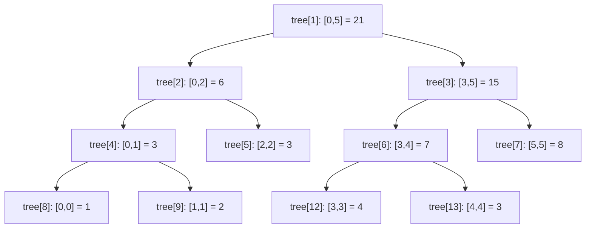
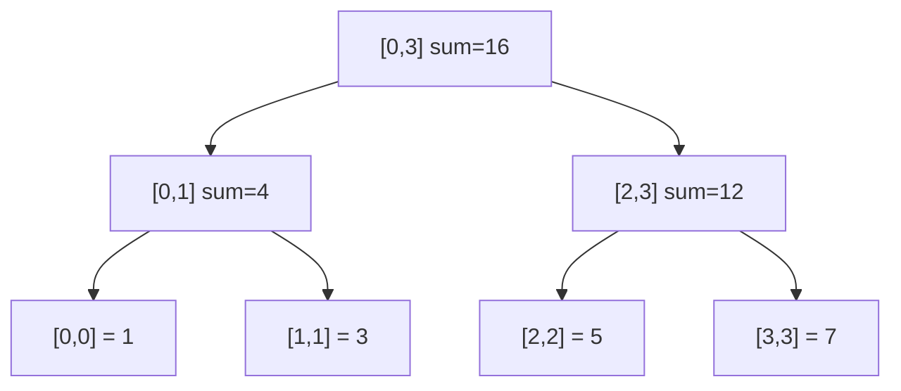

建议先阅读: [[D_容器_Container|D 容器 Container]], [[../算法/算法技巧/递推递归|递推递归]]

---

## 原理

线段树（Segment Tree）是一种二叉树，将数组的每个区间映射到一个树节点。根节点对应整个数组 $[0, n-1]$，叶子节点对应单个元素。每个内部节点存储其子节点区间的聚合值（和、最大值、gcd 等）。任意区间的查询可以通过拼接 $O(\log n)$ 个节点的值得到，序列的区间修改通过**懒惰标记（lazy propagation）**推迟到实际访问时生效。

### 数组存储与节点定位

线段树通常用数组 `tree[4n]` 实现（最坏情况大小是满二叉树大小的约 2 倍）。对于根节点下标 $i=1$：

- 左子节点：$2i$，右子节点：$2i+1$
- 节点 $i$ 的区间为 $[l, r]$，中点 $m = \lfloor (l+r)/2 \rfloor$
- 左子节点覆盖 $[l, m]$，右子节点覆盖 $[m+1, r]$



对于区间查询 $[ql, qr]$，从根开始分治——若当前节点区间完全在 $[ql, qr]$ 内，直接返回节点值；若完全在外，返回 null/0；若部分重叠，递归两个子节点。由于线段树的区间分解性质，任意查询只涉及 $O(\log n)$ 个节点的值。

### 懒惰标记（Lazy Propagation）

区间修改（如"将 $[l, r]$ 内所有元素 $+x$"）若朴素地更新每个叶子需要 $O(n)$。懒惰标记推迟更新的下传：

1. 节点上存储一个 `lazy` 值，表示"此节点的所有后代元素待加上的值"
2. 当区间修改覆盖某节点的完整区间时，更新该节点的值和 `lazy`——不再递归到叶子
3. 后续任何访问该节点子节点之前，必须将 `lazy` 下传到子节点（`push_down`）

懒惰标记将 $[l, r]$ 的区间修改从 $O(n)$ 降至 $O(\log n)$。需要更新的节点数恰好等于 $[l, r]$ 在树中的覆盖节点数——$O(\log n)$。

## 线段树 vs 树状数组

| 特性 | 线段树 | 树状数组 (BIT) |
|------|--------|---------------|
| 支持操作 | 区间查询 + 区间修改（lazy） | 前缀查询 + 单点修改 |
| 区间修改 | $O(\log n)$ lazy | 需构造差分 BIT |
| 区间查询（可减函数） | $O(\log n)$ | $O(\log n)$ |
| 区间查询（不可减函数） | $O(\log n)$ | 不直接支持 |
| 代码行数 | ~50-80 | ~15-20 |
| 常数因子 | 较大（~2x BIT） | 极小（单次 update 仅 1 个 while 循环） |
| 空间 | $4n$（静态）或 $2n$（动态开点） | $n+1$ |

**可减函数**（如求和、xor）满足 $f(l, r) = g(f(0, r), f(0, l-1))$——即可分为前缀差。BIT 仅支持可减函数的区间查询。**不可减函数**（如最大值、众数）不满足此性质，需要线段树。

### 核心特性

- 完全二叉树结构，叶子节点对应原数组单个元素
- 每个内部节点对应其子节点区间的并集
- 根节点对应整个数组区间 [0, n-1]

以下图展示数组 `[1, 3, 5, 7]` 构建的区间和线段树：



### 时间复杂度

| 操作 | 复杂度 | 说明 |
|------|--------|------|
| 建树 build | O(n) | 每个节点计算一次 |
| 单点修改 | O(log n) | 从叶到根更新路径 |
| 区间查询 | O(log n) | 目标区间拆成最多 4*log n 个节点 |
| 区间修改（懒标记） | O(log n) | 延迟下推更新 |

空间复杂度: O(4n)

### 线段树 vs 树状数组

| 特性 | 线段树 | 树状数组 |
|------|--------|----------|
| 功能 | 支持区间最值、区间和等 | 仅支持前缀和、可减操作 |
| 区间修改 | 懒标记 | 差分（受限） |
| 代码量 | 较长 | 极短 |
| 常数因子 | 较大 | 较小 |

---

## 实现

### 区间和线段树（带懒标记）

```c
#include <stdlib.h>
#include <string.h>

typedef struct {
    long long* tree;
    long long* lazy;
    int n;
} LazySegmentTree;

static void seg_build(LazySegmentTree* seg, const int* arr, int node, int l, int r) {
    if (l == r) {
        seg->tree[node] = arr[l];
        return;
    }
    int mid = l + (r - l) / 2;
    seg_build(seg, arr, node * 2, l, mid);
    seg_build(seg, arr, node * 2 + 1, mid + 1, r);
    seg->tree[node] = seg->tree[node * 2] + seg->tree[node * 2 + 1];
}

void seg_init(LazySegmentTree* seg, const int* arr, int n) {
    seg->n = n;
    seg->tree = calloc(4 * n, sizeof(long long));
    seg->lazy = calloc(4 * n, sizeof(long long));
    seg_build(seg, arr, 1, 0, n - 1);
}

void seg_destroy(LazySegmentTree* seg) {
    free(seg->tree);
    free(seg->lazy);
}

static void push_down(LazySegmentTree* seg, int node, int l, int r) {
    if (seg->lazy[node] == 0) return;
    int mid = l + (r - l) / 2;
    int left = node * 2, right = node * 2 + 1;
    seg->tree[left] += seg->lazy[node] * (mid - l + 1);
    seg->tree[right] += seg->lazy[node] * (r - mid);
    seg->lazy[left] += seg->lazy[node];
    seg->lazy[right] += seg->lazy[node];
    seg->lazy[node] = 0;
}

static void range_add(LazySegmentTree* seg, int node, int l, int r, int ql, int qr, long long val) {
    if (qr < l || r < ql) return;
    if (ql <= l && r <= qr) {
        seg->tree[node] += val * (r - l + 1);
        seg->lazy[node] += val;
        return;
    }
    push_down(seg, node, l, r);
    int mid = l + (r - l) / 2;
    range_add(seg, node * 2, l, mid, ql, qr, val);
    range_add(seg, node * 2 + 1, mid + 1, r, ql, qr, val);
    seg->tree[node] = seg->tree[node * 2] + seg->tree[node * 2 + 1];
}

void seg_add(LazySegmentTree* seg, int l, int r, long long val) {
    range_add(seg, 1, 0, seg->n - 1, l, r, val);
}

static long long range_query(LazySegmentTree* seg, int node, int l, int r, int ql, int qr) {
    if (qr < l || r < ql) return 0;
    if (ql <= l && r <= qr) return seg->tree[node];
    push_down(seg, node, l, r);
    int mid = l + (r - l) / 2;
    return range_query(seg, node * 2, l, mid, ql, qr) +
           range_query(seg, node * 2 + 1, mid + 1, r, ql, qr);
}

long long seg_sum(LazySegmentTree* seg, int l, int r) {
    return range_query(seg, 1, 0, seg->n - 1, l, r);
}
```

### 最大值线段树（无懒标记）

```c
#include <limits.h>

typedef struct {
    int* tree;
    int n;
} MaxSegmentTree;

static void max_build(MaxSegmentTree* seg, const int* arr, int node, int l, int r) {
    if (l == r) { seg->tree[node] = arr[l]; return; }
    int mid = l + (r - l) / 2;
    max_build(seg, arr, node * 2, l, mid);
    max_build(seg, arr, node * 2 + 1, mid + 1, r);
    int left = seg->tree[node * 2];
    int right = seg->tree[node * 2 + 1];
    seg->tree[node] = left > right ? left : right;
}

void max_seg_init(MaxSegmentTree* seg, const int* arr, int n) {
    seg->n = n;
    seg->tree = malloc(4 * n * sizeof(int));
    max_build(seg, arr, 1, 0, n - 1);
}

void max_seg_destroy(MaxSegmentTree* seg) {
    free(seg->tree);
}

static void max_update(MaxSegmentTree* seg, int node, int l, int r, int idx, int val) {
    if (l == r) { seg->tree[node] = val; return; }
    int mid = l + (r - l) / 2;
    if (idx <= mid) max_update(seg, node * 2, l, mid, idx, val);
    else max_update(seg, node * 2 + 1, mid + 1, r, idx, val);
    int left = seg->tree[node * 2], right = seg->tree[node * 2 + 1];
    seg->tree[node] = left > right ? left : right;
}

void max_seg_update(MaxSegmentTree* seg, int idx, int val) {
    max_update(seg, 1, 0, seg->n - 1, idx, val);
}

static int max_query(MaxSegmentTree* seg, int node, int l, int r, int ql, int qr) {
    if (qr < l || r < ql) return INT_MIN;
    if (ql <= l && r <= qr) return seg->tree[node];
    int mid = l + (r - l) / 2;
    int left = max_query(seg, node * 2, l, mid, ql, qr);
    int right = max_query(seg, node * 2 + 1, mid + 1, r, ql, qr);
    return left > right ? left : right;
}

int max_seg_max(MaxSegmentTree* seg, int l, int r) {
    return max_query(seg, 1, 0, seg->n - 1, l, r);
}
```

---

## 应用场景

- **区间求和/最值**: 数组中任意区间 [l, r] 的聚合查询
- **区间染色**: 用线段树管理区间覆盖（懒标记为颜色值）
- **区间第 K 小**: 使用主席树（持久化线段树）查询历史版本的区间

---

## 练习

| 题号 | 题目 | 说明 |
|------|------|------|
| [307](https://leetcode.cn/problems/range-sum-query-mutable/) | 区域和检索 - 可变 | 线段树/树状数组 |
| [699](https://leetcode.cn/problems/falling-squares/) | 掉落的方块 | 线段树维护区间最大值 |
| [732](https://leetcode.cn/problems/my-calendar-iii/) | 我的日程安排表 III | 线段树区间更新 |

> 力扣 (LeetCode) 有对应题型，竞赛方向推荐力扣/Codeforces。

## 动手实验

| 编号 | 题目 | 说明 |
|:----:|------|------|
| E1 | 线段树 vs 树状数组对比 | 对同样的数组分别用线段树和树状数组实现"区间求和 + 单点修改"，每种做 10 万次操作，计时对比。同时比较代码行数和空间占用 |
| E2 | 线段树构建可视化 | 对 arr=[1,3,5,7,9,11]，构建求和线段树后打印数组表示，然后手动标注每个节点对应的子区间，验证数组索引与区间范围的对应关系 |
