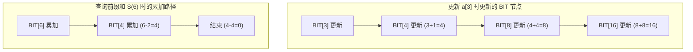

建议先阅读: [[Q_线段树_SegmentTree|Q 线段树 SegmentTree]]

> **考研 408 导引**：树状数组**不在 408 考纲内**，但作为增值内容收录。BIT 是竞赛中最常用的数据结构之一——逆序对计数、二维偏序、动态第 K 小是高频考点。正文备有 1 组前缀和查询+单点更新手算自测。

---

## 原理

### 树状数组是什么

想象一个家族收税：村长要查"前 7 家的总税额"。如果每家都独立记账，村长需要问 7 家人。但如果让每家额外记录"我和我管辖的几家的总税额"——第 8 家记录前 8 家总和，第 6 家记录第 5-6 家总和，第 4 家记录前 4 家总和——村长只需问 3 家（第 8 家、第 6 家、第 4 家对应节点）就能得到前 7 家的总税额。这就是树状数组（BIT）的思想：**利用二进制分解，用 $O(\log n)$ 次访问完成前缀和查询**。

**与线段树的对比**：

| | 线段树 | 树状数组 (BIT) |
|--|--------|---------------|
| 核心操作 | 区间查询 + 区间修改 (lazy) | 前缀查询 + 单点修改 |
| 区间最值 | 支持 | 不支持 |
| 代码行数 | ~60 行 | **~15 行** |
| 常数因子 | 较大 | **极小** |
| 空间 | $4n$ | **$n+1$** |
| 差分扩展 | 不需要 | 差分 BIT 实现区间修改 |

BIT 的核心优势：**代码极短、常数极小**——当问题只需要前缀和+单点修改（或其变体）时，BIT 是首选。

### 树状数组在哪里

- **逆序对计数**：从左到右遍历数组，BIT 维护"已出现元素的计数分布"——当前元素 $x$ 的逆序对贡献 = `i - query(x)`，$O(n \log n)$ 求解
- **二维偏序**：按一维排序后，对另一维建 BIT——经典题"星星等级"（LeetCode 699 的变体）
- **动态第 K 小**：权值 BIT 上二分——$O(\log^2 n)$ 或 $O(\log n)$ 倍增
- **树上路径问题**：树链剖分 + BIT 维护路径上的权值和/最值
- **扫描线**：区间覆盖问题中，BIT 维护当前扫描线上的覆盖长度

### lowbit：BIT 的二进制基础

BIT 的核心是对数组下标进行二进制分解。定义 $\text{lowbit}(i) = i \text{ \& } (-i)$——即 $i$ 在二进制表示中最低位的 1 所代表的数值：

| $i$ | 二进制 | $\text{lowbit}(i)$ | BIT 管辖区间 |
|:---:|--------|:-------------------:|------------|
| 1 | 0001 | 1 | $[1, 1]$ |
| 2 | 0010 | 2 | $[1, 2]$ |
| 3 | 0011 | 1 | $[3, 3]$ |
| 4 | 0100 | 4 | $[1, 4]$ |
| 5 | 0101 | 1 | $[5, 5]$ |
| 6 | 0110 | 2 | $[5, 6]$ |
| 7 | 0111 | 1 | $[7, 7]$ |
| 8 | 1000 | 8 | $[1, 8]$ |

`BIT[i]` 存储区间 $[i - \text{lowbit}(i) + 1, i]$ 的聚合值。这个区间恰好覆盖 $i$ 在二进制整数分层中的"管辖区"——它是低 $\text{lowbit}$ 位全为 1 而高位固定的范围内所有元素。

**前缀和查询**：前缀和 $S(i) = \sum_{j=1}^i a[j]$ 通过重复执行 $i \leftarrow i - \text{lowbit}(i)$ 累加 BIT[i] 获得。循环至 $i = 0$ 结束——每次消去最低位的 1，循环次数 = i 在二进制中的 1 bit 数 $\leq \log_2 n$。

**单点更新**：对 $a[i]$ 增加 $\Delta$ 时，需要更新所有"管辖区包含 i"的 BIT 位置。这些位置通过 $i \leftarrow i + \text{lowbit}(i)$ 序列给出——每次将最低位的 1 进位。同样 $O(\log n)$ 次。



### 区间修改 + 单点查询（差分 BIT）

BIT 的标准公式支持前缀查询、单点修改。通过**差分数组**技巧可以实现区间修改、单点查询：

- 维护 BIT 仅存储差分值：`BIT[i]` = 原数组的 $a[i] - a[i-1]$
- 区间 $[l, r]$ 加 $x$：`update(l, x); update(r+1, -x)` ——两个单点更新
- 查询单点 $a[i]$：前缀和 $S(i)$（差分的前缀和即原值）

这实际上利用了 BIT 的前缀和结构来模拟差分的逆运算——前缀和。无需懒惰标记即可完成区间修改，但代价是只能查询单点，不能查询区间聚合值。

### 树状数组求逆序对

将一个无序序列的逆序对计数转化为 BIT 的前缀查询：

1. 离散化：将数组值映射到 $1..n$ 的排列（避免值域过大）
2. 从左到右遍历数组：当前元素 $x$ 已经"出现"过的所有前置元素中小于 $x$ 的个数 = `query(x-1)`，大于 $x$ 的个数 = `i - query(x)`。累加 `i - query(x)` 到逆序对总数
3. `update(x, 1)` ——标记 x 已出现

总时间复杂度 $O(n \log n)$。BIT 在此扮演的角色是动态维护"目前为止已出现的元素的计数分布"。

### 时间复杂度

| 操作 | 复杂度 |
|------|--------|
| 单点修改 | O(log n) |
| 前缀和查询 | O(log n) |
| 区间和查询 | O(log n) |
| O(n) 建树 | O(n) |

空间: O(n)

#### 前缀和查询 + 单点更新手算

以数组 `arr = [1, 3, 5, 7, 9, 11, 13, 15]`（n=8）为例：

**建树后 BIT 数组**（1-indexed，BIT[i] 管辖 `[i-lowbit(i)+1, i]`）：

```
BIT[1] = arr[1] = 1
BIT[2] = arr[1]+arr[2] = 1+3 = 4
BIT[3] = arr[3] = 5
BIT[4] = arr[1]+arr[2]+arr[3]+arr[4] = 1+3+5+7 = 16
BIT[5] = arr[5] = 9
BIT[6] = arr[5]+arr[6] = 9+11 = 20
BIT[7] = arr[7] = 13
BIT[8] = arr[1]+...+arr[8] = 64
```

验证：BIT[4] = arr[1]+arr[2]+arr[3]+arr[4] = 1+3+5+7 = 16 [正确]

**查询 `prefix_sum(7)`**（即 arr[1]+...+arr[7] = 1+3+5+7+9+11+13 = 49）：

| 步 | 当前 i | lowbit(i) | BIT[i] | 累加 |
|:--:|:------:|:---------:|:------:|:----:|
| 1 | 7 (111) | 1 | BIT[7]=13 | 13 |
| 2 | 6 (110) | 2 | BIT[6]=20 | 33 |
| 3 | 4 (100) | 4 | BIT[4]=16 | **49** |

结果：49 [正确]。仅 3 步（7 的二进制有 3 个 1），而非遍历 7 个元素。

**单点更新 `add(3, 5)`**（将 arr[3] 从 5 改为 10，delta=5）：

需要更新所有"管辖区包含位置 3"的 BIT 节点——通过 `i += lowbit(i)` 找到：

| 步 | 当前 i | lowbit(i) | BIT[i] 更新前 | 更新后 |
|:--:|:------:|:---------:|:----------:|:------:|
| 1 | 3 (011) | 1 | BIT[3]=5 | 10 |
| 2 | 4 (100) | 4 | BIT[4]=16 | 21 |
| 3 | 8 (1000) | 8 | BIT[8]=64 | 69 |

仅 3 步。更新后 `prefix_sum(7)` 应变为 49+5=54：

验证：BIT[7]=13, BIT[6]=20, BIT[4]=21 → 13+20+21 = 54 [正确]

**408 自测：BIT 操作**

数组 `arr = [2, 1, 3, 4, 5, 6]`（n=6），构建 BIT 后：
① 求 `prefix_sum(5)`。
② 执行 `add(2, 3)` 后再求 `prefix_sum(5)`。

> 答案：
>
> ① BIT 建树：BIT[1]=2, BIT[2]=3, BIT[3]=3, BIT[4]=10, BIT[5]=5, BIT[6]=11。
>
> prefix_sum(5)：i=5(101), lowbit=1 → BIT[5]=5；i=4(100), lowbit=4 → BIT[4]=10。结果 = **15**。
>
> 验证：arr[1]+arr[2]+arr[3]+arr[4]+arr[5] = 2+1+3+4+5 = 15 [正确]
>
> ② add(2, 3)：delta=3
> - i=2(010): BIT[2]=3→6
> - i=4(100): BIT[4]=10→13
> - i=6(110): BIT[6]=11→14
>
> prefix_sum(5)：i=5, BIT[5]=5；i=4, BIT[4]=13。结果 = **18**
>
> 验证：arr 变为 [2,4,3,4,5,6]，前 5 项和 = 2+4+3+4+5 = 18 [正确]

---

## 实现

### 标准 BIT（单点修改 + 区间查询）

```c
#include <stdlib.h>

#define LOWBIT(x) ((x) & -(x))

typedef struct {
 int* tree;
 int n;
} BIT;

void bit_init(BIT* b, int size) {
 b->n = size;
 b->tree = calloc(size + 1, sizeof(int));
}

void bit_destroy(BIT* b) {
 free(b->tree);
}

// O(n) 建树
void bit_build(BIT* b, const int* arr, int n) {
 b->n = n;
 free(b->tree);
 b->tree = calloc(n + 1, sizeof(int));
 for (int i = 1; i <= n; i++) {
 b->tree[i] += arr[i - 1];
 int parent = i + LOWBIT(i);
 if (parent <= n) b->tree[parent] += b->tree[i];
 }
}

void bit_add(BIT* b, int pos, int delta) {
 while (pos <= b->n) {
 b->tree[pos] += delta;
 pos += LOWBIT(pos);
 }
}

int bit_prefix_sum(BIT* b, int pos) {
 int sum = 0;
 while (pos > 0) {
 sum += b->tree[pos];
 pos -= LOWBIT(pos);
 }
 return sum;
}

int bit_range_sum(BIT* b, int l, int r) {
 return bit_prefix_sum(b, r) - bit_prefix_sum(b, l - 1);
}
```

### 区间修改 + 单点查询（差分 BIT）

```c
typedef struct {
 int* tree;
 int n;
} DiffBIT;

void diff_bit_init(DiffBIT* b, int size) {
 b->n = size;
 b->tree = calloc(size + 1, sizeof(int));
}

void diff_bit_destroy(DiffBIT* b) { free(b->tree); }

static void diff_add(DiffBIT* b, int pos, int delta) {
 while (pos <= b->n) { b->tree[pos] += delta; pos += LOWBIT(pos); }
}

void diff_bit_range_add(DiffBIT* b, int l, int r, int val) {
 diff_add(b, l, val);
 diff_add(b, r + 1, -val);
}

int diff_bit_point_query(DiffBIT* b, int pos) {
 int sum = 0;
 while (pos > 0) { sum += b->tree[pos]; pos -= LOWBIT(pos); }
 return sum;
}
```

### 区间修改 + 区间查询（双 BIT）

```c
typedef struct {
 long long* t1; // diff[i]
 long long* t2; // i * diff[i]
 int n;
} RangeBIT;

void range_bit_init(RangeBIT* b, int size) {
 b->n = size;
 b->t1 = calloc(size + 1, sizeof(long long));
 b->t2 = calloc(size + 1, sizeof(long long));
}

void range_bit_destroy(RangeBIT* b) { free(b->t1); free(b->t2); }

static void range_add_arr(long long* t, int n, int pos, long long delta) {
 while (pos <= n) { t[pos] += delta; pos += LOWBIT(pos); }
}

static long long range_sum_arr(long long* t, int pos) {
 long long s = 0;
 while (pos > 0) { s += t[pos]; pos -= LOWBIT(pos); }
 return s;
}

void range_bit_add(RangeBIT* b, int l, int r, long long val) {
 range_add_arr(b->t1, b->n, l, val);
 range_add_arr(b->t1, b->n, r + 1, -val);
 range_add_arr(b->t2, b->n, l, val * (l - 1));
 range_add_arr(b->t2, b->n, r + 1, -val * r);
}

long long range_bit_prefix_sum(RangeBIT* b, int pos) {
 return range_sum_arr(b->t1, pos) * pos - range_sum_arr(b->t2, pos);
}

long long range_bit_range_sum(RangeBIT* b, int l, int r) {
 return range_bit_prefix_sum(b, r) - range_bit_prefix_sum(b, l - 1);
}
```

### 权值 BIT 求第 K 小

```c
typedef struct {
 int* tree;
 int n;
} KthBIT;

void kth_bit_init(KthBIT* b, int max_val) {
 b->n = max_val;
 b->tree = calloc(max_val + 1, sizeof(int));
}

void kth_bit_destroy(KthBIT* b) { free(b->tree); }

void kth_bit_add(KthBIT* b, int val, int delta) {
 for (int i = val; i <= b->n; i += LOWBIT(i))
 b->tree[i] += delta;
}

int kth_bit_kth(KthBIT* b, int k) {
 int pos = 0;
 for (int i = 20; i >= 0; i--) {
 int next = pos + (1 << i);
 if (next <= b->n && b->tree[next] < k) {
 k -= b->tree[next];
 pos = next;
 }
 }
 return pos + 1;
}
```

---

## 应用场景

- **区间求和**: 单点修改 + 区间和查询
- **差分维护**: 区间修改 + 单点查询（如区间加 k 后查询某位置的值）
- **逆序对计数**: 从右到左插入，查询比当前值小的已插入个数
- **二维偏序（星星等级）**: 按 y 排序后，对 x 建立 BIT 统计

---

## 练习

| 题号 | 题目 | 说明 |
|------|------|------|
| [307](https://leetcode.cn/problems/range-sum-query-mutable/) | 区域和检索 - 可变 | BIT 基础 |
| [315](https://leetcode.cn/problems/count-of-smaller-numbers-after-self/) | 计算右侧小于当前元素的个数 | BIT 求逆序对 |
| [493](https://leetcode.cn/problems/reverse-pairs/) | 翻转对 | BIT 维护计数 |
| [673](https://leetcode.cn/problems/number-of-longest-increasing-subsequence/) | 最长递增子序列的个数 | BIT 优化 DP |

> 力扣 (LeetCode) 有对应题型，竞赛方向推荐力扣/Codeforces。

## 动手实验

| 编号 | 题目 | 说明 |
|:----:|------|------|
| E1 | BIT update 过程可视化 | 对长度为 16 的数组更新 index=5，打印每次 `i += lowbit(i)` 跳过的 BIT 节点索引，验证每个节点覆盖的范围 |
| E2 | BIT 求逆序对 vs 归并排序 | 随机生成长度 10000 的排列，分别用 BIT 和归并排序计算逆序对数，计时对比两种方法的性能 |
