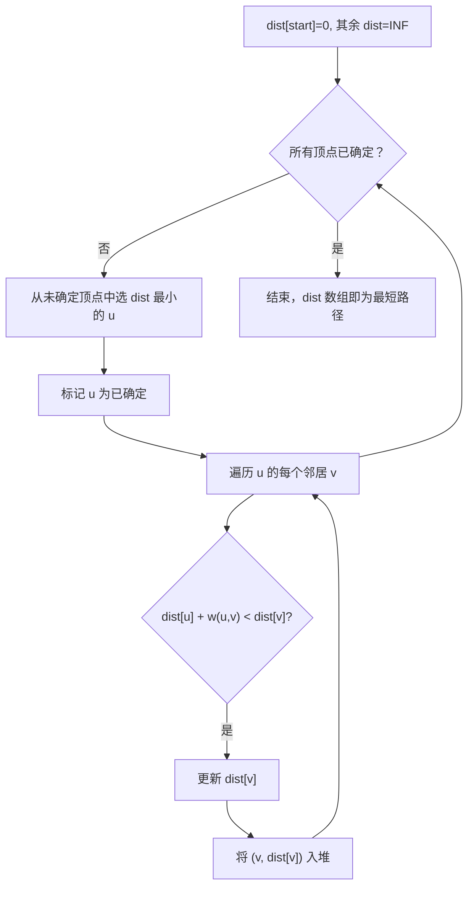
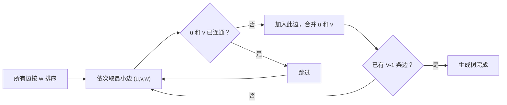

建议先阅读: [[F_栈_Stack|F 栈 Stack]], [[G_队列_Queue|G 队列 Queue]]

> **考研 408 导引**：图是 408 **核心考点**。高频题型：BFS/DFS 遍历序列、Dijkstra 单源最短路径手算、Kruskal/Prim 最小生成树手算、拓扑排序、连通分量计数。邻接矩阵 vs 邻接表的选择是选择题常客。正文备有 2 组闭卷手算自测。

---

## 原理

### 图是什么

社交网络中每个人是顶点，好友关系是边——你和朋友的"距离"是一度人脉，朋友的朋友是二度人脉。地图上每个路口是顶点，道路是边——GPS 导航就是在加权图上求最短路径。图是**最灵活的数据结构**：树是"无环连通图"，链表是"每个节点恰好一条出边的有向图"，哈希表的冲突链是"每个桶一条出边的图"——几乎所有数据结构都是图的特例。

**与其他数据结构的对比**：

| | 数组/链表 | 树 | 图 |
|--|----------|-----|-----|
| 结构 | 线性 | 层次 | **任意** |
| 节点关系 | 前驱/后继 | 父/子 | **任意多邻居** |
| 典型操作 | 按下标访问 | 遍历/搜索 | **路径查找/连通性/排序** |
| 复杂度 | $O(1)$ 或 $O(n)$ | $O(\log n)$ 或 $O(n)$ | **$O(V+E)$** |

![[../assets/images/有向图.png]]
![[../assets/images/无向图.png]]

### 图在哪里

- **地图导航**：加权图 + Dijkstra/A* 寻路——Google Maps 每次导航本质是图搜索
- **社交网络**：好友推荐（二度好友 = BFS 两层）、影响力分析（连通分量大小）
- **包依赖管理**：npm/pip 的依赖关系是有向图，安装顺序 = 拓扑排序——环检测发现循环依赖
- **编译器**：函数调用图 + 拓扑排序确定编译顺序；控制流图 + DFS 检测死循环
- **网络流**：物流/供水/电路的最大流量 = 最大流问题（Dinic 算法）

![[../assets/images/图的分类.png]]

### 图的分类

| 维度 | 类型 | 说明 |
|------|------|------|
| 方向 | 有向图 / 无向图 | 边是否有方向 |
| 权重 | 加权图 / 无权图 | 边是否有数值权重 |
| 连通性 | 连通 / 非连通 | 任意两点是否可达 |
| 密度 | 稠密图（$E \approx V^2$）/ 稀疏图（$E \approx V$） | 边的数量级 |

![[../assets/images/有向图.png]]
![[../assets/images/无向图.png]]

### 两种存储方式

| | 邻接矩阵 | 邻接表 |
|------|---------|-------|
| 空间 | $O(V^2)$ | $O(V + E)$ |
| 判边 $(u,v)$ 是否存在 | $O(1)$ — 直接访问 `matrix[u][v]` | $O(\deg(u))$ — 遍历邻接表 |
| 遍历所有邻居 | $O(V)$ — 扫描整行 | $O(\deg(u))$ — 仅遍历存在的边 |
| 适用 | 稠密图（$E \approx V^2$），Floyd-Warshall | 稀疏图（$E \ll V^2$），DFS/BFS/Dijkstra |

**邻接表的实现细节**：实际工程中，邻接表用 `vector<vector<int>>` 或 CSR 格式（类比稀疏矩阵一章）而非链表——因为 `vector` 的缓存友好性更好，且边的集合在构建后很少改变。

### BFS 与 DFS

![[../assets/images/图遍历算法对比.png]]

BFS 和 DFS 是图遍历的两条基本路径：

| | BFS | DFS |
|------|------|------|
| 数据结构 | 队列 | 栈（递归/显式） |
| 遍历特性 | 层序：先处理最近发现的节点 | 深度优先：一路到底再回溯 |
| 最短路 | **无权图的单源最短路径**——首次发现即是最短 | 不保证最短路 |
| 适用问题 | 最短路径、二分图判定、最小生成树（Prim） | 拓扑排序、强连通分量、回溯搜索 |
| 复杂度 | $O(V + E)$ | $O(V + E)$ |

### Dijkstra 算法

Dijkstra 算法求解**非负权图**上的单源最短路径。BFS 是 Dijkstra 在边权全为 1 时的特例——因为队列的 FIFO 性质天然维护了"距离递增"。

**算法正确性**基于贪心选择性质：

$$
\text{设 } d(v) \text{ 是当前已知的从源点到 } v \text{ 的最短距离。}
$$

每次从优先队列中取出 $d(v)$ 最小的顶点 $v$，此时 $d(v)$ 已为最终最短距离——因为任何尚未处理的顶点 $u$ 都有 $d(u) \geq d(v)$，而所有边权非负，不可能通过 $u$ 再找到更短的到 $v$ 的路径。

$$
d_{\text{final}}(v) = d(v) \quad \text{（一旦被优先队列弹出，即为终值）}
$$

**复杂度分析**：
- 朴素实现（每次遍历所有顶点找最小值）：$O(V^2)$
- 二叉堆：$O((V+E) \log V)$ —— 优先队列加速
- 斐波那契堆：$O(E + V \log V)$（理论最优，常数因子大）

### BFS → Dijkstra → A*

这三者构成一个连续谱：

```
BFS: 队列 (FIFO) 边权全为 1 ← 处理时间最早 = 距离最近
Dijkstra: 优先队列（最小堆） 边权 ≥ 0 ← 当前距离最小 = 最终最短距离
A*: 优先队列 + 启发式 边权 ≥ 0 ← d(v) + h(v) 最小（启发式估计到目标的剩余距离）
```

A* 将贪心选择从"已走距离最短"改为"已走距离 + 预计剩余距离最短"。若启发式函数 $h(v)$ 是可容许的（admissible，即 $h(v) \leq$ 真实剩余距离），A* 保证最优解。从这层意义上看，Dijkstra 就是 A* 在 $h(v) = 0$ 时的退化。

---

## 实现

### 加权邻接表

无权图的 BFS 只能求最短路径长度（边数），而 Dijkstra 需要边权重。我们用加权邻接表：

```c
#include <stdlib.h>
#include <limits.h>

// 加权邻接表边节点
typedef struct WeightedAdjNode {
 int vertex;
 int weight;
 struct WeightedAdjNode* next;
} WeightedAdjNode;

typedef struct {
 int V;
 WeightedAdjNode** adj;
} WeightedGraph;

WeightedAdjNode* create_wadj_node(int v, int w) {
 WeightedAdjNode* node = malloc(sizeof(WeightedAdjNode));
 node->vertex = v;
 node->weight = w;
 node->next = NULL;
 return node;
}

void wgraph_init(WeightedGraph* g, int V) {
 g->V = V;
 g->adj = calloc(V, sizeof(WeightedAdjNode*));
}

void wgraph_destroy(WeightedGraph* g) {
 for (int i = 0; i < g->V; i++) {
 WeightedAdjNode* cur = g->adj[i];
 while (cur) {
 WeightedAdjNode* tmp = cur;
 cur = cur->next;
 free(tmp);
 }
 }
 free(g->adj);
}

// directed=1 有向，directed=0 无向
void wgraph_add_edge(WeightedGraph* g, int u, int v, int w, int directed) {
 WeightedAdjNode* node = create_wadj_node(v, w);
 node->next = g->adj[u];
 g->adj[u] = node;
 if (!directed)
 wgraph_add_edge(g, v, u, w, 1);
}
```

### BFS / DFS 遍历（无权图）

```c
typedef struct AdjNode { int vertex; struct AdjNode* next; } AdjNode;

void graph_bfs(AdjNode** adj, int V, int start) {
 int* visited = calloc(V, sizeof(int));
 int* queue = malloc(V * sizeof(int));
 int head = 0, tail = 0;
 visited[start] = 1;
 queue[tail++] = start;
 while (head < tail) {
 int u = queue[head++];
 for (AdjNode* cur = adj[u]; cur; cur = cur->next)
 if (!visited[cur->vertex]) {
 visited[cur->vertex] = 1;
 queue[tail++] = cur->vertex;
 }
 }
 free(visited); free(queue);
}

void graph_dfs(AdjNode** adj, int V, int start) {
 int* visited = calloc(V, sizeof(int));
 int stack[V], top = 0;
 stack[top++] = start;
 while (top > 0) {
 int u = stack[--top];
 if (visited[u]) continue;
 visited[u] = 1;
 for (AdjNode* cur = adj[u]; cur; cur = cur->next)
 if (!visited[cur->vertex])
 stack[top++] = cur->vertex;
 }
 free(visited);
}
```

### Dijkstra 最短路径

![[../assets/images/Dijkstra算法.png]]

Dijkstra 的核心思想是**贪心**：每次从未确定的顶点中选出距离起点最近的顶点，用它去松弛其邻居。重复 V 次，每次选最近顶点需要 O(V)，总 O(V^2)。用最小堆优化后选顶点降为 O(log V)，总 O((V+E)log V)。



C 实现：用数组模拟最小堆作为优先队列。

```c
// ---------- 最小堆优先队列 ----------
typedef struct { int dist; int vertex; } PQNode;

typedef struct { PQNode* data; int size; int cap; } MinPQ;

void pq_init(MinPQ* pq, int cap) {
 pq->data = malloc(cap * sizeof(PQNode));
 pq->size = 0; pq->cap = cap;
}
void pq_destroy(MinPQ* pq) { free(pq->data); }

static void pq_swap(PQNode* a, PQNode* b) {
 PQNode t = *a; *a = *b; *b = t;
}

void pq_push(MinPQ* pq, int dist, int v) {
 int i = pq->size++;
 pq->data[i] = (PQNode){dist, v};
 while (i > 0) {
 int p = (i - 1) / 2;
 if (pq->data[p].dist <= pq->data[i].dist) break;
 pq_swap(&pq->data[p], &pq->data[i]);
 i = p;
 }
}

int pq_pop(MinPQ* pq, int* out_dist, int* out_v) {
 if (pq->size == 0) return -1;
 *out_dist = pq->data[0].dist;
 *out_v = pq->data[0].vertex;
 pq->data[0] = pq->data[--pq->size];
 int i = 0;
 while (1) {
 int smallest = i;
 int left = 2 * i + 1, right = 2 * i + 2;
 if (left < pq->size && pq->data[left].dist < pq->data[smallest].dist)
 smallest = left;
 if (right < pq->size && pq->data[right].dist < pq->data[smallest].dist)
 smallest = right;
 if (smallest == i) break;
 pq_swap(&pq->data[i], &pq->data[smallest]);
 i = smallest;
 }
 return 0;
}

int pq_empty(MinPQ* pq) { return pq->size == 0; }
// ---------- 堆结束 ----------

void dijkstra(WeightedGraph* g, int start, int* dist) {
 for (int i = 0; i < g->V; i++) dist[i] = INT_MAX / 2;
 dist[start] = 0;

 MinPQ pq;
 pq_init(&pq, g->V * 2);
 pq_push(&pq, 0, start);

 while (!pq_empty(&pq)) {
 int d, u;
 pq_pop(&pq, &d, &u);
 if (d != dist[u]) continue; // 过期条目跳过

 for (WeightedAdjNode* cur = g->adj[u]; cur; cur = cur->next) {
 int v = cur->vertex, w = cur->weight;
 if (dist[u] + w < dist[v]) {
 dist[v] = dist[u] + w;
 pq_push(&pq, dist[v], v);
 }
 }
 }
 pq_destroy(&pq);
}
```

### Kruskal 最小生成树

Kruskal 的核心思想：将所有边按权重排序，从小到大依次加入，若加入后不形成环则保留，直到有 V-1 条边。



C 实现需要并查集，这里直接内联一个简易版：

```c
#include <stdlib.h>

typedef struct { int u, v, w; } KEdge;

int kedge_cmp(const void* a, const void* b) {
 return ((KEdge*)a)->w - ((KEdge*)b)->w;
}

static int kruskal_find(int* parent, int x) {
 return parent[x] == x ? x : (parent[x] = kruskal_find(parent, parent[x]));
}

int kruskal(int V, KEdge* edges, int E) {
 int* parent = malloc(V * sizeof(int));
 int* rank = calloc(V, sizeof(int));
 for (int i = 0; i < V; i++) parent[i] = i;

 qsort(edges, E, sizeof(KEdge), kedge_cmp);

 int total_weight = 0, cnt = 0;
 for (int i = 0; i < E && cnt < V - 1; i++) {
 int pu = kruskal_find(parent, edges[i].u);
 int pv = kruskal_find(parent, edges[i].v);
 if (pu != pv) {
 if (rank[pu] < rank[pv]) { int t = pu; pu = pv; pv = t; }
 parent[pv] = pu;
 if (rank[pu] == rank[pv]) rank[pu]++;
 total_weight += edges[i].w;
 cnt++;
 }
 }
 free(parent); free(rank);
 return total_weight;
}
```

---

## 常用算法复杂度

| 算法 | 用途 | 时间复杂度 | 条件 |
|------|------|-----------|------|
| BFS | 无权最短路径、层序遍历 | O(V+E) | 任意图 |
| DFS | 遍历、环检测、连通分量 | O(V+E) | 任意图 |
| Dijkstra | 单源最短路径 | O((V+E)logV) | 非负权 |
| Bellman-Ford | 单源最短路径（可负权） | O(VE) | 可检负环 |
| Floyd-Warshall | 全源最短路径 | O(V^3) | 稠密图 |
| Kruskal | 最小生成树 | O(E log E) | 任意图 |
| Prim | 最小生成树 | O((V+E)logV) | 任意图 |

#### Dijkstra 手算轨迹

给定加权有向图（5 个顶点 0-4），源点 = 0：

```
     10
  0 ───→ 1
  |       |\
  3      1  2
  |       |  \
  ↓       ↓   ↓
  2 ───→ 3 ───→ 4
     2      4
```

边：(0→1,10), (0→2,3), (1→3,1), (1→4,2), (2→3,2), (3→4,4)

| 步 | 选取 u | dist[] 变化 | 邻居松弛 |
|:--:|:------:|:----------:|---------|
| 初始 | — | `[0,∞,∞,∞,∞]` | — |
| 1 | 0 (dist=0) | `[0,10,3,∞,∞]` | 0→1: 0+10=10, 0→2: 0+3=3 |
| 2 | 2 (dist=3) | `[0,10,3,5,∞]` | 2→3: 3+2=5 |
| 3 | 3 (dist=5) | `[0,10,3,5,9]` | 3→4: 5+4=9 |
| 4 | 4 (dist=9) | `[0,10,3,5,9]` | 4 无出边 |
| 5 | 1 (dist=10) | `[0,10,3,5,9]` | 1→3: 10+1=11>5 不更新, 1→4: 10+2=12>9 不更新 |

最终 dist = `[0, 10, 3, 5, 9]`。从 0 到各点的最短距离：0→0=0, 0→1=10, 0→2=3, 0→3=5, 0→4=9。

**408 自测：Dijkstra**

4 个顶点，源点 = 0，边：(0→1,5), (0→2,1), (1→3,2), (2→1,3), (2→3,7)。求 dist[]。

> 答案：
>
> | 步 | u | dist[] | 松弛 |
> |:--:|:-:|:------:|------|
> | 初始 | — | `[0,∞,∞,∞]` | — |
> | 1 | 0 | `[0,5,1,∞]` | 0→1:5, 0→2:1 |
> | 2 | 2 (dist=1) | `[0,4,1,∞]` | 2→1: 1+3=4<5 更新 |
> | 3 | 1 (dist=4) | `[0,4,1,6]` | 1→3: 4+2=6 |
> | 4 | 3 (dist=6) | `[0,4,1,6]` | — |
>
> 最终 dist = `[0, 4, 1, 6]`。

#### Kruskal 手算轨迹

6 个顶点（0-5），边按权重排序后依次加入：

| 步 | 边 | w | Find(u), Find(v) | 动作 | 已选边数 |
|:--:|:---:|:---:|:----------------:|:----:|:-------:|
| 1 | (1,4) | 1 | 1≠4 | **选入** | 1 |
| 2 | (3,4) | 2 | 3≠4 | **选入** | 2 |
| 3 | (0,3) | 3 | 0≠3 | **选入** | 3 |
| 4 | (2,5) | 4 | 2≠5 | **选入** | 4 |
| 5 | (0,4) | 5 | 0 和 4 已连通（0→3→4）| 跳过（成环）| 4 |
| 6 | (1,3) | 6 | 1 和 3 已连通（1→4→3）| 跳过（成环）| 4 |
| 7 | (2,3) | 7 | 2≠3 | **选入** | 5 |

5 条边（V-1=5），MST 总权重 = 1+2+3+4+7 = 17。

**408 自测：Kruskal**

5 个顶点（0-4），边：(0,1,2), (0,2,5), (1,2,1), (1,3,6), (2,3,3), (3,4,4)。画出 MST。

> 答案：
>
> 按权重排序：(1,2,1), (0,1,2), (2,3,3), (3,4,4), (0,2,5), (1,3,6)
>
> | 步 | 边 | w | 动作 |
> |:--:|:---:|:---:|:----:|
> | 1 | (1,2) | 1 | 选入 |
> | 2 | (0,1) | 2 | 选入 |
> | 3 | (2,3) | 3 | 选入 |
> | 4 | (3,4) | 4 | 选入 |
> | 5 | (0,2) | 5 | 跳过（0-1-2 已连通）|
> | 6 | (1,3) | 6 | 跳过（1-2-3 已连通）|
>
> MST 边：(1,2,1), (0,1,2), (2,3,3), (3,4,4)，总权重 = **10**。

---

## 应用场景

- **地图导航**: 加权图 + Dijkstra/A* 寻路
- **社交网络**: 好友推荐（二度好友）、影响力分析（连通分量大小）
- **包依赖管理**: 有向无环图（DAG）+ 拓扑排序确定安装顺序

---

## 练习

| 题号 | 题目 | 说明 |
|------|------|------|
| [743](https://leetcode.cn/problems/network-delay-time/) | 网络延迟时间 | Dijkstra |
| [1584](https://leetcode.cn/problems/min-cost-to-connect-all-points/) | 连接所有点的最小费用 | 最小生成树 |
| [200](https://leetcode.cn/problems/number-of-islands/) | 岛屿数量 | BFS/DFS 遍历 |
| [133](https://leetcode.cn/problems/clone-graph/) | 克隆图 | BFS/DFS + 哈希 |
| [207](https://leetcode.cn/problems/course-schedule/) | 课程表 | 拓扑排序 |

> 力扣 (LeetCode) 有对应题型，竞赛方向推荐力扣/Codeforces。

## 动手实验

| 编号 | 题目 | 说明 |
|:----:|------|------|
| E1 | 邻接矩阵 vs 邻接表空间对比 | 随机生成稀疏图（E = 2V）和稠密图（E = V^2/4），分别用邻接矩阵和邻接表存储，比较内存占用和遍历耗时 |
| E2 | Dijkstra 优先级队列必要性验证 | 分别用"优先队列"和"每次 O(V) 扫描"实现 Dijkstra，对顶点数 V=10000, E=50000 的图运行，对比耗时，验证堆优化从 O(V^2) 到 O(E log V) 的差距 |
| E3 | DFS/BFS 遍历树对比 | 对同一个图分别用 DFS 和 BFS 生成遍历树，打印两种遍历树的结构（边集），观察前驱子图与最短路径树的结构差异 |
