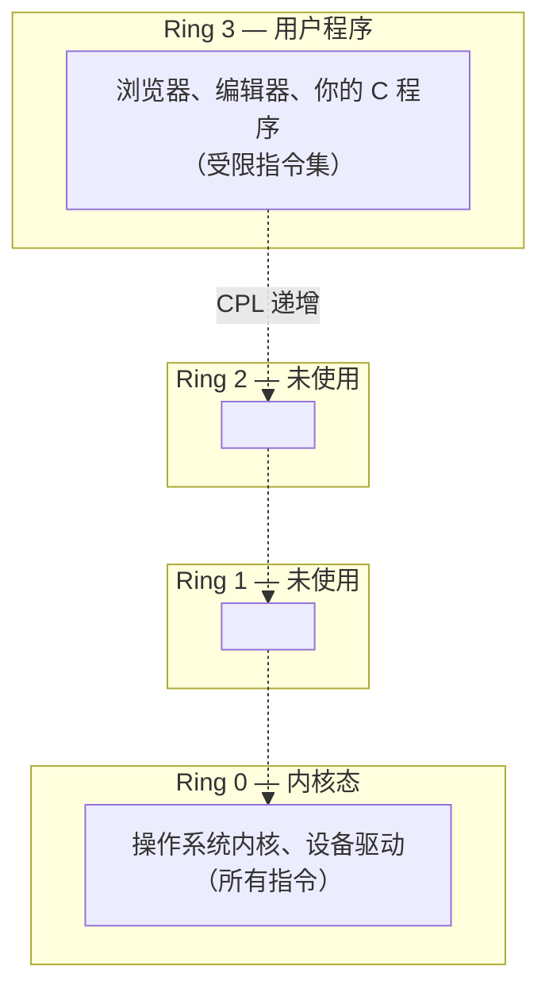

# 硬件操作总览：汇编的语言 (Hardware Operations Overview)
---

## 章节概述

C 语言能操作内存——但不能直接操作硬件。当你想读键盘端口、写显存缓冲区、查询 CPU 特性、切换页表或开关中断时，C 的语法到你这里断了。不是因为 C 不够"强大"，而是因为这些操作不属于 C 的抽象模型——它们属于 CPU 指令集本身。汇编语言是唯一能访问"全部" CPU 指令的语言。本章作为硬件操作部分的总览，回答三个问题：为什么只有汇编能直接操作硬件、汇编通过哪些路径操作硬件、以及后续章节将带你操作哪些设备。

> **核心理念**：C 语言活在"抽象机"里——变量、指针、函数调用都是编译器提供的幻觉。汇编活在"物理机"里——寄存器、端口、MSR、页表、GDT 这些是 CPU 的真实面貌。直接操作硬件的本质，就是用汇编指令操控这些"C 语言看不见的东西"。

---

### 第一节：为什么 C 语言不能直接操作硬件

#### 1.1 C 语言的抽象边界

C 语言的标准定义了这样一台"抽象机"：
- 内存（通过指针访问）
- 算术/逻辑运算
- 函数调用（通过调用栈）
- I/O（通过标准库 `stdio.h`）

这台抽象机里**没有**以下概念：
- CPU 控制寄存器（CR0/CR2/CR3/CR4）
- 模型特定寄存器（MSR —— EFER、STAR、APIC Base）
- I/O 端口地址空间（0x60 键盘、0x3F8 串口）
- 中断标志位（IF —— 决定 CPU 是否响应中断）
- 全局描述符表（GDT / LDT）
- 页表基址寄存器（CR3）
- CPUID 指令（查询 CPU 型号和特性）
- 内存屏障指令（mfence / sfence / lfence）

C 语言标准从未定义"如何启用分页"或"如何读取键盘端口"的语法。编译器厂商通过内联汇编和 intrinsic 函数提供了"逃生舱"，但本质上是插件到汇编的桥梁——汇编才是目的地。

#### 1.2 C 编译器做了哪些"看不见的事"

看看这段简单的 C 代码：

```c
int x = 42;
int *p = &x;
*p = 100;
```

编译器把它翻译成汇编指令：

```asm
mov dword [rbp-4], 42 ; int x = 42
lea rax, [rbp-4] ; int *p = &x
mov qword [rbp-8], rax ; 存指针
mov rax, [rbp-8] ; 加载指针
mov dword [rax], 100 ; *p = 100
```

这些都是 `mov` 指令——访问的是"虚拟内存地址"。但如果你的目标是**端口 0x60**（键盘数据寄存器）或**物理地址 0xB8000**（VGA 显存），普通 `mov` 指令在用户态无法做到。你需要 `in`/`out` 指令（端口 I/O），或者内核态下的物理地址映射（MMIO）。

#### 1.3 谁定义这些"特殊指令"

答案是 **CPU 厂商**（Intel/AMD）。x86 指令集手册（Intel SDM）定义了约 1500+ 条指令，而 C 编译器常用的约 200 条。剩下的 1300+ 条指令——包括 `in`、`out`、`rdmsr`、`wrmsr`、`lidt`、`lgdt`、`cpuid`、`invlpg`、`cli`、`sti`——没有对应的 C 语法，只能用汇编（或编译器 built-in 函数，本质还是汇编）调用。

---

### 第二节：特权级模型——Ring 0 到 Ring 3

#### 2.1 四层"特权环"

x86 CPU 定义了四个特权级别，像一个同心环：



| 特权级 | 名称 | 实际用途 | 可执行指令 |
|--------|------|---------|-----------|
| Ring 0 | 内核态（Supervisor） | Linux/Windows 内核 | 所有指令 |
| Ring 1 | — | **未使用** | — |
| Ring 2 | — | **未使用** | — |
| Ring 3 | 用户态（User） | 应用程序 | 受限指令集 |

> Linux、Windows、macOS 都只使用 Ring 0 和 Ring 3。Ring 1 和 Ring 2 是 x86 设计的历史遗留——事实证明两个特权级（内核 + 用户）就足够了。

#### 2.2 CPL / DPL / RPL：谁在检查权限

CPU 在每条指令执行前都做权限检查，核心是三个字段：

| 字段 | 全称 | 存储位置 | 含义 |
|------|------|---------|------|
| **CPL** | Current Privilege Level | CS 寄存器的低 2 位 | 当前运行代码的特权级 |
| **DPL** | Descriptor Privilege Level | 段描述符中 | 目标代码/数据的访问门槛 |
| **RPL** | Requested Privilege Level | 段选择子的低 2 位 | 请求者声称的权限 |

简单规则：**CPL ≤ DPL** 才能访问（数字越小权限越高）。当你在用户态（CPL=3）尝试执行 `in al, 0x60` 时，CPU 检查到 CPL=3 > IOPL=0，直接抛出 `#GP`（General Protection Fault）→ Linux 将其转化为"段错误"（SIGSEGV）信号，程序崩溃。

---

### 第三节：两大硬件访问路径

#### 3.1 Port I/O（端口 I/O）

x86 独有的一种独立地址空间——与内存地址空间完全分离，共 64K 个端口（0x0000 ~ 0xFFFF）。使用专门的 `in`/`out` 指令访问：

```asm
; 从端口 0x60 读一个字节到 AL
in al, 0x60 ; Port I/O 读

; 向端口 0x3F8 写一个字节
mov al, 'A'
out 0x3F8, al ; Port I/O 写
```

常用端口地址：

| 端口地址 | 设备 | 用途 |
|---------|------|------|
| 0x60 | 键盘控制器 | 读取按键扫描码 |
| 0x64 | 键盘状态 | 读取键盘控制器状态 |
| 0x20-0x21 | 主 PIC（可编程中断控制器） | 中断控制 |
| 0xA0-0xA1 | 从 PIC | 中断控制 |
| 0x3F8 | COM1 串口 | 串行通信 |
| 0xCF8/0xCFC | PCI 配置空间 | 枚举 PCI 设备 |

#### 3.2 MMIO（内存映射 I/O）

将设备寄存器**映射到物理地址空间**，用普通的 `mov` 指令访问：

```asm
; 向 VGA 显存（物理地址 0xB8000）写入字符
mov dword [0xB8000], 0x0F41 ; 白底黑字 'A'
; 高字节 0x0F = 白色背景 + 亮白字符
; 低字节 0x41 = ASCII 'A'
```

VGA 文本模式下的显存布局（地址 0xB8000 ~ 0xB8FA0）：

```
每屏 80列 × 25行 = 2000 字符
每个字符占 2 字节: [ASCII码 (1B)] [属性 (1B)]
```

VGA 属性字节位布局：

| 位 | 7 | 6 | 5 | 4 | 3 | 2 | 1 | 0 |
|----|---|---|---|---|---|---|---|---|
| 含义 | 闪烁 | 背景色 R | 背景色 G | 背景色 B | 前景色 I | 前景色 R | 前景色 G | 前景色 B |

```

#### 3.3 Port I/O vs MMIO 对比

| 特性 | Port I/O | MMIO |
|------|---------|------|
| 地址空间 | 独立 64K 端口空间 | 共享物理地址空间 |
| 访问指令 | `in` / `out`（专用） | `mov`（通用） |
| 架构支持 | x86 专有 | 所有架构（x86、ARM、RISC-V） |
| 速度 | 较慢（同步、串行化） | 较快（可用缓存，但需处理一致性） |
| C 语言能直接用吗 | 必须内联汇编 | 通过指针访问（需内核映射） |
| 实例 | 键盘 0x60、PIC 0x20 | VGA 0xB8000、APIC 0xFEE00000 |
| CPU 层面 | `in AL, 0x60` — 独立 I/O 总线周期 | `mov AL, [0xB8000]` — 内存总线周期 |
| 内存屏障需求 | 不需要（in/out 自带序列化） | 需要 `mfence`/`sfence`/`lfence` |

---

### 第四节：C 能做 vs 只有汇编能做的事

| 操作 | C 语言 | 汇编指令 | 说明 |
|------|--------|---------|------|
| 读写内存 | `*ptr = val` | `mov [addr], val` | C 的直接能力 |
| 算术运算 | `a + b * c` | `add`/`mul`/`imul` | 编译器生成 |
| 端口 I/O 读 | 不可行 | `in al, dx` | 无 C 语法对应 |
| 端口 I/O 写 | 不可行 | `out dx, al` | 无 C 语法对应 |
| 读 MSR | 不可行 | `rdmsr` (→ EDX:EAX) | 读 CPU 内部寄存器 |
| 写 MSR | 不可行 | `wrmsr` (← ECX=地址) | 写 CPU 内部寄存器 |
| 加载 GDT | 不可行 | `lgdt [gdt_desc]` | 设置段描述符表 |
| 加载 IDT | 不可行 | `lidt [idt_desc]` | 设置中断描述符表 |
| 关中断 | 不可行 | `cli` | 清除 EFLAGS.IF |
| 开中断 | 不可行 | `sti` | 设置 EFLAGS.IF |
| 查询 CPU 特性 | `__builtin_cpu_supports()` | `cpuid` | 内建函数本质是 cpuid |
| 刷新 TLB | 不可行 | `invlpg [addr]` | 使页表缓存项失效 |
| CPU 暂停 | 不可行 | `hlt` | 等待中断 |
| 读时间戳 | `__rdtsc()` intrinsic | `rdtsc` | intrinsic 即汇编包装 |
| 内存屏障 | `asm volatile("mfence"...)` | `mfence` | 必须用内联汇编 |

> `__builtin_*`、`__rdtsc()`、`__cpuid()` 这些"看起来像 C"的东西，本质上是编译器内置的内联汇编包装。它们在编译后直接生成对应的汇编指令，不经过 C 的类型系统或抽象机。

---

### 第五节：实验环境——QEMU 虚拟裸机

#### 5.1 为什么需要裸机环境

Linux 用户态程序受制于以下限制：
- 端口 I/O 被禁止（触发 SIGSEGV）
- 物理地址无法直接访问（只有虚拟地址，且受页表保护）
- 特权指令被拦截（`hlt`、`cli` 等触发异常）
- 系统寄存器不可见（CR0/CR3/MSR 仅在 Ring 0 可读）

QEMU 提供了一个"虚拟裸金属"——你的代码从 BIOS 启动，运行在 Ring 0，可以执行任何指令。

#### 5.2 本章代码的运行方式

**方式一：QEMU 裸机（自由执行任何指令）**

```bash
# 编译为纯二进制
nasm -f bin program.asm -o program.bin

# 用 QEMU 运行
qemu-system-x86_64 -drive file=program.bin,format=raw -nographic -s -S
```

**方式二：Linux 用户态（仅限非特权指令）**

```bash
nasm -f elf64 program.asm && ld program.o -o program && ./program
```

> 工具链细节见 [[../1基础/04_工具链与调试环境|工具链]] 章节。那里已经覆盖了 NASM、ld、objdump、GDB 和 QEMU 的完整配置。

---

### 第六节：后续章节路线图

| 章节 | 你将学到 | 你将能操作 |
|------|---------|-----------|
| [[./01_Port_IO与MMIO\|Port I/O 与 MMIO]] | 两大硬件访问机制的原理和代码 | 键盘端口读取、VGA 显存写入、PCI 设备枚举 |
| [[./02_特权级与系统寄存器\|特权级与系统寄存器]] | Ring 0~3、CR0~CR4、MSR、CPUID | CPU 性能开关、页表、长模式启用 |
| [[./03_内联汇编精通\|内联汇编精通]] | GCC extended asm 完整约束 | C 程序里直接发 `in`/`out`/`rdmsr`/`wrmsr` 指令 |

在这之后，[[../../内核/系统内核/04_设备驱动|内核驱动]] 和 [[../../内核/系统内核/05_中断与系统调用|中断与系统调用]] 章节将使用本章学到的指令构建真正的设备驱动和中断处理程序。

---

### 小节练习

---

## 章节测试

### 一、判断题

> [!question] 判断题 1
> `in` 和 `out` 指令是 x86 独有的端口 I/O 指令，ARM 架构没有对应的指令。 （ ）
> - [ ] 正确
> - [ ] 错误
>
> > [!success]- 点击查看答案
> > 答案: 正确
> > **解析**: Port I/O 是 x86 架构特有的设计。ARM 和 RISC-V 完全依赖 MMIO——所有外设访问都通过内存映射方式完成。

> [!question] 判断题 2
> 在 QEMU 虚拟裸机环境中运行的程序默认处于 Ring 3 用户态。 （ ）
> - [ ] 正确
> - [ ] 错误
>
> > [!success]- 点击查看答案
> > 答案: 错误
> > **解析**: QEMU 加载裸机二进制（`-f bin`）时，CPU 从实模式（16 位）启动，没有保护模式下的特权级概念。切换到保护模式/长模式后，自行设置特权级——通常我们在内核代码中设置为 Ring 0。

> [!question] 判断题 3
> `rdmsr` 指令读取的是 CPU 内部特定型号寄存器（MSR），这些寄存器没有对应的内存地址。 （ ）
> - [ ] 正确
> - [ ] 错误
>
> > > [!success]- 点击查看答案
> > > 答案: 正确
> > > **解析**: MSR（Model-Specific Register）是 CPU 内部寄存器，通过索引编号（ECX）访问，而非内存地址。`rdmsr` 读取，`wrmsr` 写入——这两条指令在 C 语言中没有对应的语法。

> [!question] 判断题 4
> 编译器 intrinsic 函数（如 `__rdtsc()`）是纯粹的 C 语言功能，不依赖汇编指令。 （ ）
> - [ ] 正确
> - [ ] 错误
>
> > [!success]- 点击查看答案
> > 答案: 错误
> > **解析**: Intrinsic 函数本质上是编译器内置的汇编指令映射。`__rdtsc()` 编译后直接生成 `rdtsc` 指令，不是通过库函数调用。它们是编译器提供的一种无需手写内联汇编即可使用特殊指令的便捷方式。

> [!question] 判断题 5
> MMIO 设备寄存器的访问可以被 CPU 缓存（cache）以提高性能。 （ ）
> - [ ] 正确
> - [ ] 错误
>
> > [!success]- 点击查看答案
> > 答案: 部分错误（取决于配置）
> > **解析**: MMIO 区域通常被标记为 **Uncacheable（UC）**——因为设备寄存器的值可能随时被硬件改变，读取必须直达硬件。如果允许缓存，可能读到过期的错误值。某些架构支持 Write-Combining（WC）来批量写入。

> [!question] 判断题 6
> 在 Linux 用户态程序中执行 `cli` 指令（关中断）会成功执行而不会被阻止。 （ ）
> - [ ] 正确
> - [ ] 错误
>
> > [!success]- 点击查看答案
> > 答案: 错误
> > **解析**: `cli` 是特权指令（需要 CPL ≤ IOPL）。用户态（CPL=3）执行会触发 `#GP` 异常，Linux 将其转化为 SIGSEGV 信号终止程序。

---

### 动手练习题

> [!example] 练习题 1：识别你的 CPU 特权级
> **难度**: 简单
>
> 写一个 Linux NASM 程序，读取 CS 寄存器的值并打印。CS 的低 2 位即 CPL。通常你会看到 CPL=3（用户态）。然后将同样的代码放到 QEMU 裸机运行，观察 CPL 的变化。
> ```asm
> ; get_cs.asm — 读取 CS 并退出
> section .text
> global _start
> _start:
> mov ax, cs
> and ax, 3 ; 取低 2 位 = CPL
> ; ... 通过 sys_exit 以 CPL 为退出码
> ```

> [!example] 练习题 2：设计"C vs 汇编"指令对照表
> **难度**: 简单
>
> 查阅 Intel SDM 手册（第 1 卷和第 2 卷），找出 5 条 C 语言无法直接表达的 x86 指令（除本章已列出的），并写出它们的功能描述。尝试用编译器的 `__builtin_*` 函数查一下是否有对应的 intrinsic。

> [!example] 练习题 3：QEMU Monitor 探索
> **难度**: 简单
>
> 启动 QEMU 并进入 Monitor（Ctrl-A C），执行以下命令并记录输出：
> - `info registers`（查看完整 CPU 状态）
> - `info pic` / `info ioapic`（中断控制器状态）
> - `xp /16bx 0xB8000`（查看 VGA 显存）
>
> 了解 QEMU Monitor 的能力——它将是后续章节硬件调试的核心工具。

## 力扣练习

以下题目从汇编/底层视角训练相关能力：

| 题号 | 题目 | 链接 | 涉及知识点 |
|------|------|------|-----------|
| 136 | 只出现一次的数字 | https://leetcode.cn/problems/single-number/ | XOR运算（硬件指令） |
| 190 | 颠倒二进制位 | https://leetcode.cn/problems/reverse-bits/ | 位操作（shl/shr指令） |
| 461 | 汉明距离 | https://leetcode.cn/problems/hamming-distance/ | XOR+popcount |
| 67 | 二进制求和 | https://leetcode.cn/problems/add-binary/ | 位运算模拟加法器 |
