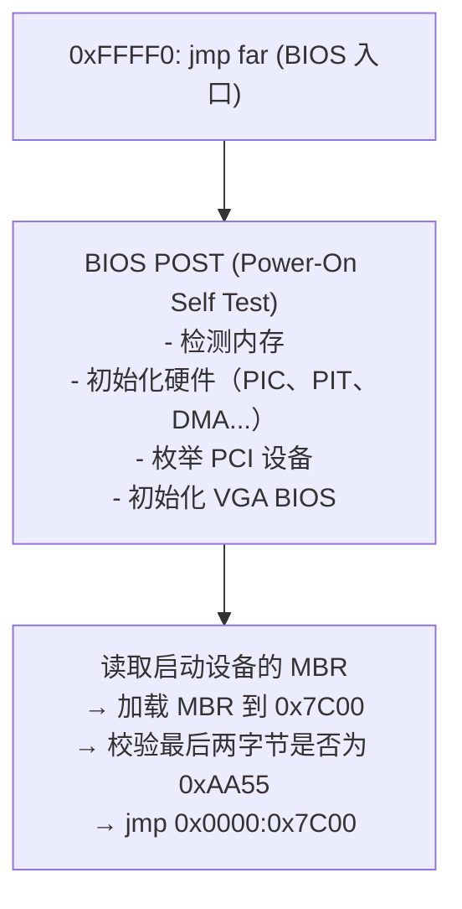
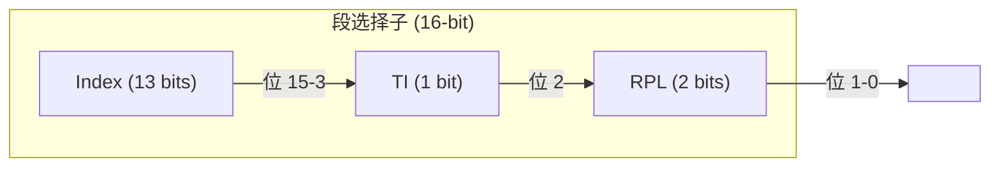
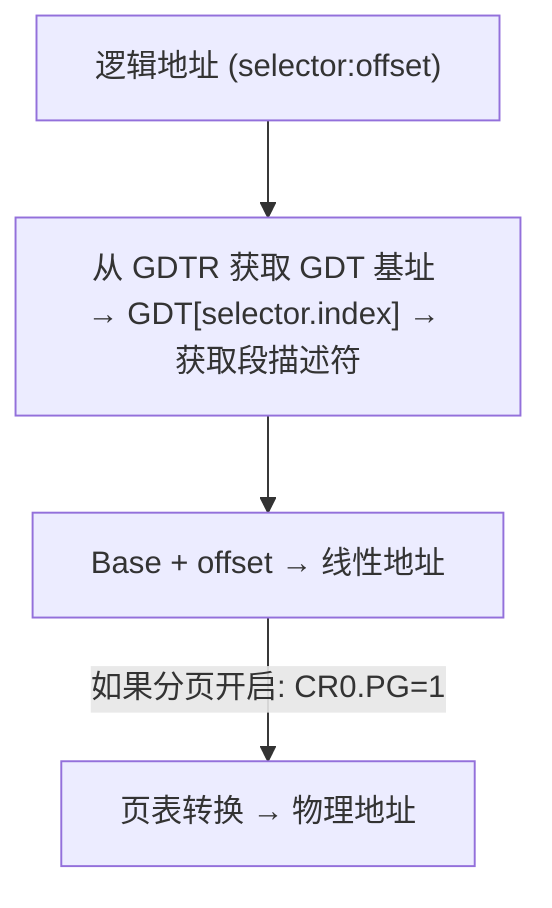

# 引导启动：从 BIOS 到内核的汇编之路 (Boot: From BIOS to Kernel)
---

## 章节概述

本章追溯计算机从按下电源键到操作系统内核接管控制权的完整过程——这是**汇编语言唯一统治的领域**。在 C 编译器能够运行之前，CPU 必须完成模式切换、内存初始化、中断向量表建立等底层工作，每一条指令都必须是汇编。你将学会编写一个真正的 MBR 引导扇区，从实模式经保护模式最终抵达 64 位长模式的入口，并理解 GDT、CR0、分段等概念如何在实际引导流程中协奏。本章是对 [[../00_硬件操作总览|硬件操作总览]]、[[../02_特权级与系统寄存器|特权级与系统寄存器]]、[[../04_中断与IDT|中断与 IDT]] 三大体系的综合性实战。

> **核心理念**：启动过程是一次"渐进式唤醒"——CPU 复位后处于最原始的模式，通过一组精心编排的汇编指令逐步提升自身能力（开 A20→建 GDT→切保护模式→启用分页→切长模式），最终将控制权交给 C 语言内核。理解这个过程等于理解了整个 x86 架构的设计哲学。

---

### 第一节：上电瞬间——CPU 复位向量

1.1 复位后的 CPU 状态
---------------------

按下电源键 → 主板供电稳定 → PCH（Platform Controller Hub）释放 CPU 的 RESET 信号。CPU 复位后处于一个极其确定的状态：

```
CS = 0xF000
IP = 0xFFF0
────────────────────────────────────
物理地址 = CS * 16 + IP = 0xFFFF0 (芯片组将 CS 重映射到 0xFFFF0000)
```

> 这里的 `0xFFFF0`（20 位地址线下的表示）在 32 位地址线上会被芯片组重映射为 `0xFFFFFFF0`（4GB - 16 字节处），这是 BIOS ROM 的物理位置。

CPU 的初始模式是 **实模式**（Real Mode），特征：
- 16 位默认操作数
- 分段内存模型：`物理地址 = 段寄存器 * 16 + 偏移`
- 无保护、无分页、无特权级（相当于 Ring 0）
- 仅 1MB 地址空间（A20 门关闭）
- 所有寄存器初始值：`CR0.PE = 0`（实模式），EDX = 0（无分页）

1.2 BIOS 的执行流程
--------------------

CPU 从 `0xFFFF0` 执行第一条指令（通常是 `jmp` 跳转到 BIOS 主体代码）：



> `0x7C00` 是一个历史性地址——IBM PC 5150 的设计者选择了这个位置，因为它位于传统内存映射的空隙位置（`0x7C00-0x7DFF`，512 字节刚好装下一个扇区）。

### 小节练习

---

### 第二节：编写 MBR 引导扇区

2.1 最小的引导扇区
-------------------

```nasm
; mbr.asm — 最小的可启动扇区
; nasm -f bin mbr.asm -o mbr.bin
; qemu-system-x86_64 -drive format=raw,file=mbr.bin

[org 0x7C00] ; BIOS 将我们加载到这里
[bits 16] ; 实模式 16 位代码

start:
 xor ax, ax ; 清零段寄存器
 mov ds, ax
 mov ss, ax
 mov sp, 0x7C00 ; 栈从 0x7C00 向下生长

 ; 通过 BIOS 0x10 中断显示字符
 mov ah, 0x0E ; 电传打字模式
 mov si, msg
.putc:
 lodsb
 test al, al
 jz .hang
 int 0x10
 jmp .putc

.hang:
 hlt
 jmp .hang

msg: db "Hello from MBR!", 13, 10, 0

; 填充至 510 字节 + 启动签名
times 510 - ($ - $$) db 0
dw 0xAA55 ; 启动签名（小端序: 55 AA）
```

关键点：
- `[org 0x7C00]`：告知 NASM 所有标签的基址是 `0x7C00`，确保绝对地址计算正确
- `times 510 - ($ - $$) db 0`：用零填充到 510 字节
- `dw 0xAA55`：必须的启动签名，`0x55` 在前（小端序），文件中显示为 `55 AA`

2.2 BIOS 中断服务
------------------

BIOS 提供的软件中断是实模式下的标准库：

| 中断 | 功能 | 常用参数 |
|------|------|---------|
| `int 0x10` | 视频服务 | AH=0x0E: 电传输出; AH=0x00: 设置模式; AH=0x13: 写字符串 |
| `int 0x13` | 磁盘 I/O | AH=0x02: 读扇区; AH=0x03: 写扇区; AH=0x42: 扩展读 (LBA) |
| `int 0x15` | 系统服务 | AH=0x88: 获取扩展内存; AX=0xE820: 内存映射; AX=0x2401: 开 A20 |
| `int 0x16` | 键盘服务 | AH=0x00: 读按键; AH=0x01: 检查按键状态 |

从磁盘读取更多扇区（加载第二阶段的引导器）：

```nasm
; 使用 int 0x13 读取扇区
load_loader:
 mov ah, 0x02 ; 功能号：读扇区
 mov al, 4 ; 要读取的扇区数
 mov ch, 0 ; 柱面号低 8 位
 mov cl, 2 ; 起始扇区号（扇区 2，扇区 1 是 MBR）
 mov dh, 0 ; 磁头号
 mov dl, 0x80 ; 驱动器号（0x80 = 第一块硬盘）
 mov bx, 0x1000 ; 目标地址 ES:BX
 mov es, bx
 xor bx, bx ; ES:BX = 0x1000:0x0000 = 0x10000
 int 0x13
 jc disk_error ; CF=1 表示失败
 ; 成功：第二阶段的代码现在在 0x10000
 jmp 0x1000:0x0000
```

> MBR 只有 446 字节的可用代码空间（减去分区表和签名后）。即使最简朴的内核也装不下。因此 MBR 的唯一职责是加载更大的第二阶段引导器（如 GRUB、LILO 或自定义的 bootloader）。

### 小节练习

---

### 第三节：从实模式到保护模式

3.1 实模式的局限
-----------------

实模式在设计上只能使用约 1MB 的内存（A20 门影响），无内存保护、无特权隔离。从 80386 开始，CPU 支持**保护模式**（Protected Mode）——32 位地址空间、4GB 寻址、页表、Ring 0-3 特权级。

切换保护模式的前提条件：
1. **开启 A20 门**：否则第 21 根地址线始终为 0
2. **建立 GDT**（Global Descriptor Table）：定义内存段
3. **加载 GDT**：`lgdt` 指令将 GDT 的基址和限长装入 GDTR
4. **设置 CR0.PE**：将 CR0 寄存器的 bit 0 置 1
5. **远跳转**（far jump）：刷新指令预取队列，使 CS 加载保护模式选择子

3.2 全局描述符表（GDT）
------------------------

GDT 条目格式（8 字节）：

```
GDT 描述符 (8 字节) 格式：

┌────────────────────────────────────────────────────────────┐
│ Bits 56-63  │G│D/B│L│AVL│ Bits 48-51  │P│DPL│S│ Type │ Bits 16-40 │
│ Limit[15:0]                                               │
│ Base[15:0]                                                │
└────────────────────────────────────────────────────────────┘
```

| 字段 | 含义 |
|------|------|
| Base (32-bit) | 段基址（线性地址空间中的起始地址） |
| Limit (20-bit) | 段限长（G=0 时按字节；G=1 时按 4KB 页） |
| P (Present) | 1 = 段存在 |
| DPL (2-bit) | 描述符特权级 (0 = Ring 0, 3 = Ring 3) |
| S (System) | 1 = 代码/数据段，0 = 系统段（TSS/LDT/门） |
| Type (4-bit) | 段类型：代码段 1010（可执行+读）、数据段 0010（可读写） |
| G (Granularity) | 0 = 字节粒度，1 = 4KB 页粒度 |
| D/B | 0 = 16 位，1 = 32 位 |
| L (Long) | 1 = 64 位代码段（仅当 D=0 时有效） |

3.3 切换到保护模式的完整代码
----------------------------

```nasm
; pmode.asm — 实模式 → 保护模式切换 + VGA 输出
; nasm -f bin pmode.asm -o pmode.bin
; qemu-system-x86_64 -drive format=raw,file=pmode.bin

[org 0x7C00]
[bits 16]

start:
 xor ax, ax
 mov ds, ax
 mov es, ax
 mov ss, ax
 mov sp, 0x7C00

 ; 1. 开启 A20（使用 Fast A20）
 in al, 0x92
 or al, 2
 out 0x92, al

 ; 2. 加载 GDT
 lgdt [gdt_descriptor]

 ; 3. 设置 CR0.PE
 mov eax, cr0
 or eax, 1
 mov cr0, eax

 ; 4. 远跳转 → 刷新预取队列 → 进入保护模式
 jmp 0x08:protected_mode_entry

[bits 32]
protected_mode_entry:
 ; 用 32 位寻址
 mov ax, 0x10 ; 数据段选择子
 mov ds, ax
 mov es, ax
 mov fs, ax
 mov gs, ax
 mov ss, ax
 mov esp, 0x90000

 ; 输出到 VGA
 mov edi, 0xB8000
 mov esi, msg_pm
 mov ah, 0x0F ; 白底黑字属性
.putc:
 mov al, [esi]
 test al, al
 jz .done
 mov [edi], ax
 add esi, 1
 add edi, 2
 jmp .putc
.done:
 hlt

; ── GDT ──
gdt_start:
 dq 0 ; 空描述符（必须）
 ; 代码段: base=0, limit=0xFFFFF, DPL=0, type=1010, G=1, D/B=1
 dw 0xFFFF ; limit[15:0]
 dw 0x0000 ; base[15:0]
 db 0x00 ; base[23:16]
 db 10011010b ; P=1, DPL=00, S=1, Type=1010(执行/读)
 db 11001111b ; G=1, D/B=1, 0, AVL=0, limit[19:16]=1111
 db 0x00 ; base[31:24]
 ; 数据段: base=0, limit=0xFFFFF, DPL=0, type=0010, G=1, D/B=1
 dw 0xFFFF
 dw 0x0000
 db 0x00
 db 10010010b ; P=1, DPL=00, S=1, Type=0010(读/写)
 db 11001111b
 db 0x00
gdt_end:

gdt_descriptor:
 dw gdt_end - gdt_start - 1 ; GDT 大小 - 1
 dd gdt_start ; GDT 基址

msg_pm: db "Protected mode active!", 0

times 510 - ($ - $$) db 0
dw 0xAA55
```

> 远跳转 `jmp 0x08:protected_mode_entry` 中的 `0x08` 是**段选择子**（Segment Selector）：低 2 位 = RPL（请求特权级），第 3 位 = TI（0=GDT, 1=LDT），高 13 位 = GDT 索引。索引 1 × 8 = 8，即 GDT 中的第二个条目（代码段）。

### 小节练习

---

### 第四节：GDT 选择子与段机制

4.1 选择子的构成
-----------------



- **Index**：GDT/LDT 中的条目号（0-8191）
- **TI**：0 = GDT，1 = LDT
- **RPL**：请求特权级（Requested Privilege Level），用于保护检查

4.2 常见选择子
---------------

```nasm
; 选择子常量
KERNEL_CODE_SEL equ 0x08 ; 索引 1, GDT, RPL=0
KERNEL_DATA_SEL equ 0x10 ; 索引 2, GDT, RPL=0
USER_CODE_SEL equ 0x1B ; 索引 3, GDT, RPL=3 (0x18 | 3)
USER_DATA_SEL equ 0x23 ; 索引 4, GDT, RPL=3 (0x20 | 3)
TSS_SEL equ 0x28 ; 索引 5, GDT, RPL=0
```

4.3 GDT 访问流程
-----------------



> 在 x86-64 长模式下，GDT 仍然存在，但分段被大幅简化（base/limit 被忽略，除了 FS/GS 仍用于线程本地存储）。内存保护完全由分页机制完成。

### 小节练习

---

### 第五节：迈向长模式——64 位的进入之路

5.1 从 32 位保护模式到 64 位长模式
-----------------------------------

64 位长模式（Long Mode）需要额外的 CPU 和页表结构：
1. CPU 支持检查（`CPUID.80000001H:EDX[29]` 可为 1）
2. 开启 PAE（`CR4.PAE = 1`）
3. 建立页表层级：PML4 → PDPT → PD → PT（身份映射，至少覆盖引导区域的 1:1 映射）
4. 加载页表基址到 CR3
5. 设置 EFER.LME（`EFER MSR 0xC0000080 bit 8`）
6. 开启分页（`CR0.PG = 1`）
7. 远跳转加载 64 位代码段选择子（L=1）

5.2 初始页表设置（身份映射）
----------------------------

```nasm
; 建立最小的 4 级页表（身份映射前 2MB）
[bits 32]
setup_paging:
 ; PML4 表（地址: 0x1000）
 mov edi, 0x1000
 mov cr3, edi
 mov dword [edi], 0x2003 ; PML4[0] -> PDPT @ 0x2000; 位0(P)=1, 位1(R/W)=1
 ; 清零其余 PML4 项
 mov ecx, 511
 mov eax, 0
.fill_pml4:
 add edi, 8
 mov [edi], eax
 loop .fill_pml4

 ; PDPT 表（地址: 0x2000）
 mov edi, 0x2000
 mov dword [edi], 0x3003 ; PDPT[0] -> PD @ 0x3000
 ; 清零其余 PDPT 项
 mov ecx, 511
.fill_pdpt:
 add edi, 8
 mov dword [edi], 0
 loop .fill_pdpt

 ; Page Directory 表（地址: 0x3000）
 mov edi, 0x3000
 mov dword [edi], 0x0083 ; PD[0] -> 2MB 大页 @ 0x000000; bit 7(PAT)=1, P=1, R/W=1
 ; 0x83 = 10000011b: PS=1 (2MB page), P=1, R/W=1
 mov ecx, 509
 mov eax, 0
.fill_pd:
 add edi, 8
 mov [edi], eax
 loop .fill_pd

 ret
```

5.3 进入 64 位长模式的入口
--------------------------

```nasm
[bits 64]
long_mode_entry:
 mov ax, KERNEL_DATA_SEL
 mov ds, ax
 mov es, ax
 mov fs, ax
 mov gs, ax
 mov ss, ax

 ; 64 位代码运行时，VGA 仍可访问
 mov rax, 0x0F650F480F6C0F6C ; "Hell" 的反序
 mov qword [0xB8000], rax
 mov rax, 0x0F210F6F0F200F6F ; "oo wo"
 mov qword [0xB8008], rax
 ; "Hello world!" 的 VGA 编码...

 hlt
```

5.4 中断返回指令的变化
-----------------------

| 模式 | 中断返回指令 | 栈帧大小 | 栈内容 |
|------|-------------|---------|--------|
| 实模式 | `iret` | 6 bytes | IP, CS, FLAGS |
| 32 位保护模式 | `iretd` | 12 bytes | EIP, CS, EFLAGS (可能带错误码) |
| 64 位长模式 | `iretq` | 40 bytes | RIP, CS, RFLAGS, RSP, SS |

```nasm
; 64 位 ISR 中使用 iretq
[bits 64]
isr64:
 push rax
 ; ... 处理中断 ...
 mov al, 0x20 ; EOI
 out 0x20, al
 pop rax
 iretq ; 弹出 RIP, CS, RFLAGS, RSP, SS
```

> 长模式的 GDT 中，代码段描述符的 L 位必须置 1（表示 64 位代码段），D 位必须为 0。`iretq` 会检查 RFLAGS.VM 和 CS.L 来确定返回到哪种模式。

### 小节练习

---

### 第六节：完整引导链实战

以下是一个两阶段引导器的完整骨架——MBR 加载第二阶段到 `0x10000`，第二阶段切换到保护模式并输出信息，然后尝试进入长模式：

```nasm
; bootchain.asm — 完整的两阶段引导器
; MBR (stage1) + 保护模式 (stage2) + 长模式 (stage3) 骨架

; =================== STAGE 1: MBR ===================
[org 0x7C00]
[bits 16]
stage1:
 jmp 0x0000:.init
.init:
 xor ax, ax
 mov ds, ax
 mov es, ax
 mov ss, ax
 mov sp, 0x7C00

 ; 加载 stage2 (从 LBA 1 读取 2 个扇区)
 mov ah, 0x42 ; 扩展读
 mov si, dap
 int 0x13
 jc .err

 ; 跳转到 stage2
 jmp 0x0000:0x1000

.err:
 mov al, 'E'
 mov ah, 0x0E
 int 0x10
 hlt

dap: ; Disk Address Packet
 db 0x10 ; DAP 大小 = 16 字节
 db 0 ; 保留
 dw 2 ; 扇区数
 dw 0x1000 ; 目标偏移
 dw 0x0000 ; 目标段
 dq 1 ; 起始 LBA (LBA 1 → 第二阶段)

times 440 - ($ - $$) db 0
dd 0 ; 磁盘签名
dw 0x0000 ; 保留
; 分区表（MBR 标准结构）
db 0x80, 0x20, 0x21, 0x00, 0x0C, 0x2B, 0xA1, 0x44, 0x00, 0x08, 0x00, 0x00, 0x00, 0xF8, 0x07, 0x00
times 48 db 0
dw 0xAA55

; =================== STAGE 2: Protected Mode ===================
[bits 16]
stage2:
 cli

 ; Fast A20
 in al, 0x92
 or al, 2
 out 0x92, al

 ; Load GDT
 lgdt [gdt_desc]

 ; CR0.PE = 1
 mov eax, cr0
 or eax, 1
 mov cr0, eax

 jmp 0x08:pmode_entry

[bits 32]
pmode_entry:
 mov ax, 0x10
 mov ds, ax
 mov es, ax
 mov fs, ax
 mov gs, ax
 mov ss, ax
 mov esp, 0x90000

 ; VGA 输出
 mov esi, msg_stage2
 mov edi, 0xB8000
 mov ah, 0x0F
.loop:
 lodsb
 test al, al
 jz .next
 mov [edi], ax
 add edi, 2
 jmp .loop

.next:
 ; 尝试进入长模式...
 ; 检查 CPUID 支持
 mov eax, 0x80000000
 cpuid
 cmp eax, 0x80000001
 jb .no_long
 mov eax, 0x80000001
 cpuid
 test edx, (1 << 29) ; LM bit
 jz .no_long

 ; 建立页表 + 进入长模式
 ; (setup_paging 见第五节)
 call setup_paging

 ; CR4.PAE = 1
 mov eax, cr4
 or eax, (1 << 5)
 mov cr4, eax

 ; EFER.LME = 1 (MSR 0xC0000080 bit 8)
 mov ecx, 0xC0000080
 rdmsr
 or eax, (1 << 8)
 wrmsr

 ; CR0.PG = 1
 mov eax, cr0
 or eax, (1 << 31)
 mov cr0, eax

 ; Long-mode GDT（含 64 位代码段 L=1）
 lgdt [gdt64_desc]
 jmp 0x18:long_entry

.no_long:
 mov esi, msg_nolong
 mov edi, 0xB80A0 ; 第二行
 mov ah, 0x04 ; 红底
.p:
 lodsb
 test al, al
 jz .hang
 mov [edi], ax
 add edi, 2
 jmp .p
.hang:
 hlt
 jmp .hang

[bits 64]
long_entry:
 mov ax, 0x10
 mov ds, ax
 mov es, ax
 mov ss, ax
 mov rsp, 0x90000

 mov rax, 0x0F420F790F620F20 ; " By "
 mov [0xB8000 + 160], rax
 mov rax, 0x0F410F530F4E0F41 ; "NASM"
 mov [0xB8000 + 168], rax
 hlt

; ── GDT 定义 ──
gdt_start:
 dq 0
 dw 0xFFFF, 0x0000, 0x9A00, 0x00CF ; 32 位代码段 (索引 1)
 dw 0xFFFF, 0x0000, 0x9200, 0x00CF ; 32 位数据段 (索引 2)
gdt_end:
gdt_desc: dw gdt_end - gdt_start - 1, 0
 dd gdt_start + 0x10000 ; stage2 从 0x10000 开始

; 64 位 GDT（附加 64 位代码段）
gdt64_start:
 dq 0
 dw 0, 0, 0x9A00, 0x0020 ; 64 位代码段 (索引 1, L=1)
 dw 0, 0, 0x9200, 0x0000 ; 数据段 (索引 2)
gdt64_end:
gdt64_desc: dw gdt64_end - gdt64_start - 1, 0
 dd gdt64_start + 0x10000

setup_paging:
 ; (实现同第五节——建立身份映射页表)
 ret

msg_stage2: db "Stage2: Protected Mode OK!", 0
msg_nolong: db "Long mode not supported!", 0

; 填充到 1024 字节（stage2 占第二个扇区）
times 1024 - ($ - stage2) db 0
```

编译运行：
```bash
nasm -f bin bootchain.asm -o bootchain.bin
dd if=/dev/zero of=hdd.img bs=1M count=32
dd if=bootchain.bin of=hdd.img conv=notrunc
qemu-system-x86_64 -drive format=raw,file=hdd.img
```

### 小节练习

---

## 章节测试

### 一、判断题

> [!question] 判断题 1
> CPU 复位后的第一条指令总是从 `0x00000` 开始执行。 （ ）
> - [ ] 正确
> - [ ] 错误
>
> > [!success]- 点击查看答案
> > 答案: 错误
> > **解析**: CPU 复位后从 `0xFFFF0`（芯片组重映射为 `0xFFFFFFF0`）开始执行，这是 BIOS ROM 的映射地址。

> [!question] 判断题 2
> 实模式下 `段寄存器 * 16 + 偏移` 的计算是由 CPU 硬件自动完成的。 （ ）
> - [ ] 正确
> - [ ] 错误
>
> > [!success]- 点击查看答案
> > 答案: 正确
> > **解析**: 这是实模式寻址的硬件实现。CPU 将段寄存器值左移 4 位（×16）后与偏移相加，得到 20 位物理地址。

> [!question] 判断题 3
> 切换到保护模式只需要设置 CR0.PE = 1。 （ ）
> - [ ] 正确
> - [ ] 错误
>
> > [!success]- 点击查看答案
> > 答案: 错误
> > **解析**: 仅设置 CR0.PE 是不够的。必须先建立并加载 GDT（含代码和数据段），再置位 PE，最后执行远跳转。缺少任何一步都会导致三重故障（triple fault）。

> [!question] 判断题 4
> `jmp 0x08:label` 中的 `0x08` 是绝对内存地址。 （ ）
> - [ ] 正确
> - [ ] 错误
>
> > [!success]- 点击查看答案
> > 答案: 错误
> > **解析**: `0x08` 是段选择子（Segment Selector），它通过 GDT 间接引用段描述符。不是直接的内存地址。

> [!question] 判断题 5
> 64 位长模式下仍然需要 GDT。 （ ）
> - [ ] 正确
> - [ ] 错误
>
> > [!success]- 点击查看答案
> > 答案: 正确
> > **解析**: x86-64 长模式仍需 GDT 定义代码段和数据段（且需要 L=1 的 64 位代码段描述符）。但 base 和 limit 被忽略，保护由分页实现。

> [!question] 判断题 6
> MBR 的前 440 字节是代码区，后 72 字节包含分区表和签名。 （ ）
> - [ ] 正确
> - [ ] 错误
>
> > [!success]- 点击查看答案
> > 答案: 正确
> > **解析**: MBR 的 512 字节布局为: 0-439 代码区，440-443 磁盘签名，444-445 保留，446-509 分区表（4 个条目，每项 16 字节），510-511 启动签名 (0x55 0xAA)。

---

---

### 动手练习题

> [!example] 练习题 1：最小 MBR + VGA 动画
> **难度**: 简单
>
> 编写一个 MBR 引导程序，在屏幕的不同位置依次打印字符，形成流动字符动画效果。使用 `int 0x10` 的 BIOS 电传打字模式，每打印一个字符用 `int 0x15, AH=0x86` 延迟 100ms。在 QEMU 中运行。

> [!example] 练习题 2：两阶段引导器 — 从磁盘加载内核
> **难度**: 简单
>
> 实现完整的两阶段引导链：
> - MBR 使用 `int 0x13` 扩展读加载 sector 2-17（8KB）到 `0x10000`
> - 第二阶段代码在保护模式下用 `int 0x13` 读回所需扇区的方式不可用——改为编写纯汇编磁盘驱动（PIO 模式读 IDE/SATA）
> - 将读到的内容直接输出到 VGA 显示
> - 在 QEMU 中创建 32MB 磁盘镜像测试

> [!example] 练习题 3：从实模式直达长模式
> **难度**: 简单
>
> 基于本章第五节和第六节的完整代码，实现从 RESET 一路进入 64 位长模式的完整引导链：
> 1. 实模式 MBR → 加载 stage2
> 2. 保护模式 stage2 → 设置 4 级页表 → 进入长模式
> 3. 64 位 stage3 → 在 VGA 屏幕上用 64 位指令打印 "Welcome to x86-64 Long Mode!"
> 要求每一步都有状态输出（VGA 屏幕不同行显示当前阶段）

> [!example] 练习题 4：GDT 与段机制实验
> **难度**: 简单
>
> 分别构造以下 GDT 并切换段选择子，观察 VGA 输出变化：
> - 代码段 `base=0xB8000`：从此段执行 mov 指令向 0 偏移写数据，观察 VGA 变化
> - 数据段 `base=0xB8000`：向此段的偏移 0 写数据，VGA 屏幕变化同理
> - 尝试设置 limit=100 的数据段，然后写入超过 limit 的偏移，观察是否触发 GP 异常

## 力扣练习

以下题目从引导/底层视角训练相关能力：

| 题号 | 题目 | 链接 | 涉及知识点 |
|------|------|------|-----------|
| 136 | 只出现一次的数字 | https://leetcode.cn/problems/single-number/ | 位运算（汇编基础） |
| 190 | 颠倒二进制位 | https://leetcode.cn/problems/reverse-bits/ | 位操作（嵌入式常用） |
| 191 | 位1的个数 | https://leetcode.cn/problems/number-of-1-bits/ | POPCNT指令理解 |
