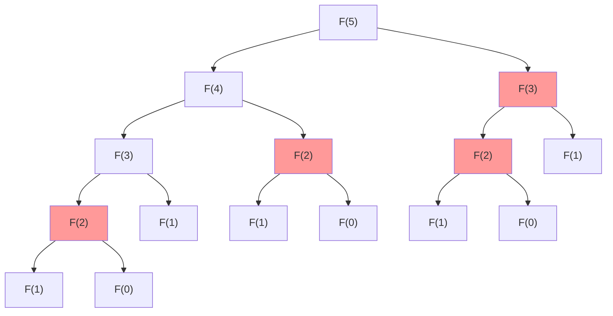
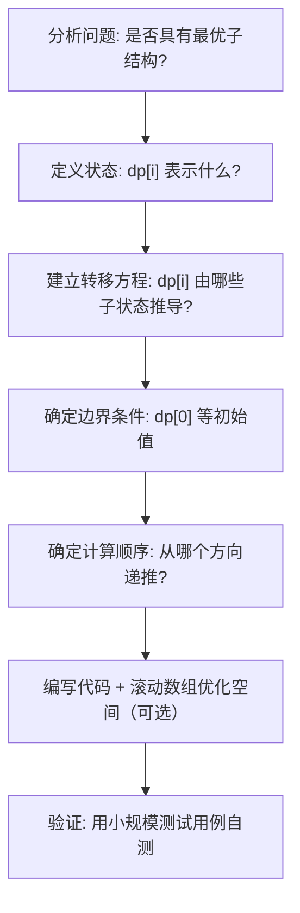
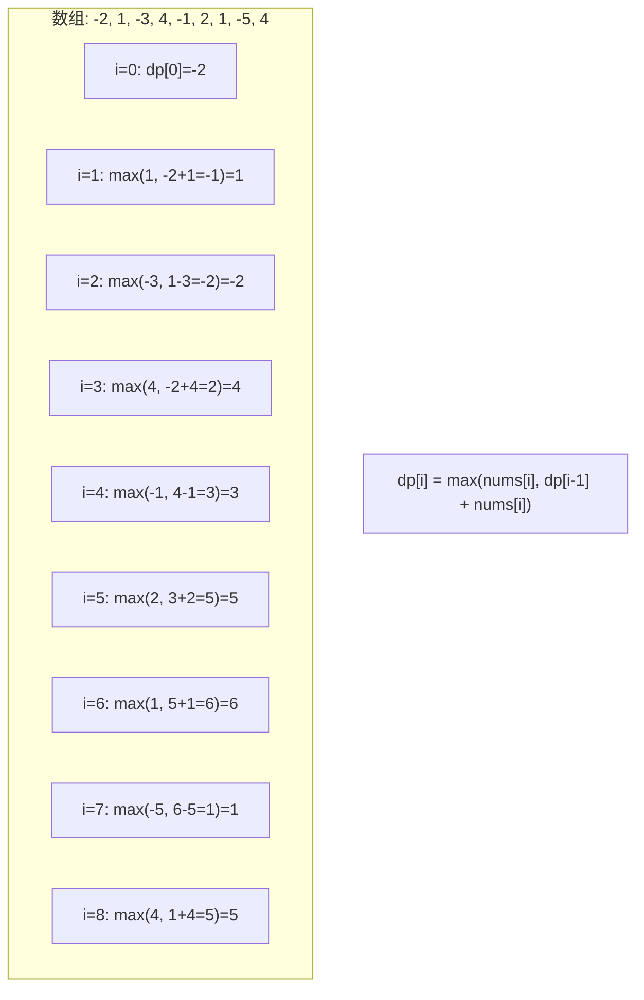
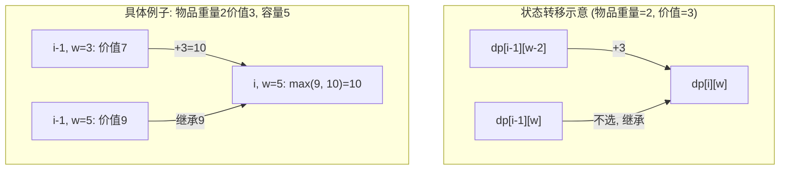
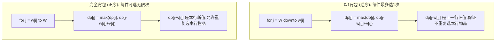

## ==========================================================================
C++ 算法技巧 — 动态规划 (Dynamic Programming)
## ==========================================================================

## 章节概述

动态规划 (Dynamic Programming, DP) 是解决最优化问题的一种方法，它将原问题分解为相互
重叠的子问题，先求解子问题的最优值，再递推得到原问题的最优解。

DP 的两个核心性质：
1. **最优子结构** (Optimal Substructure) -- 问题的最优解包含子问题的最优解
2. **重叠子问题** (Overlapping Subproblems) -- 子问题被反复计算，需要缓存结果避免重复

DP 与贪心的区别：贪心每步做局部最优且不回头；DP 考虑所有可能的转移，选择全局最优。

DP 与分治的区别：分治的子问题不重叠（如归并排序左右两半不重复）；DP 的子问题大量重叠。

**前置知识**: [[../算法技巧/递推递归]]、[[../数据结构/A_容器_Container]]、[[../算法技巧/数组]]、[[../算法技巧/循环]]

> **数据结构关联**: DP 的核心是数组递推。[[../数据结构/A_容器_Container]] -- vector 用于 DP 的状态存储；[[../数据结构/C_堆_Heap]] -- 堆可优化部分 DP（如 Dijkstra 本质是 DP + 贪心）。

## ==========================================================================
### 第一节: 基础概念 + 数学原理
## ==========================================================================

1.1 从斐波那契数列理解 DP 的诞生
-----------------------------------

斐波那契数列定义：
```
F(0) = 0, F(1) = 1
F(n) = F(n-1) + F(n-2)  (n >= 2)
```

**朴素递归** (存在大量重复计算)：

```
F(5)
├── F(4)
│   ├── F(3)
│   │   ├── F(2)  ← 重复计算
│   │   │   ├── F(1)
│   │   │   └── F(0)
│   │   └── F(1)
│   └── F(2)  ← 重复计算
│       ├── F(1)
│       └── F(0)
└── F(3)  ← 重复计算
    ├── F(2)  ← 重复计算
    │   ├── F(1)
    │   └── F(0)
    └── F(1)
```



F(2) 被计算了 3 次，F(3) 被计算了 2 次。随着 n 增大，重复计算呈指数增长，时间复杂度 O(2^n)。

1.2 方法一：记忆化搜索 (Top-Down, Memoization)
----------------------------------------------------

递归 + 缓存：将已计算的结果存入数组，遇到相同子问题时直接查表。

```cpp
#include <iostream>
#include <vector>
using namespace std;

vector<long long> memo(100, -1);  // -1 表示未计算

long long fib(int n) {
    if (n <= 1) return n;
    if (memo[n] != -1) return memo[n];   // 查缓存
    return memo[n] = fib(n - 1) + fib(n - 2); // 计算并缓存
}

int main() {
    cout << "F(50) = " << fib(50) << endl;
    return 0;
}
```

时间: O(n) -- 每个子问题只计算一次
空间: O(n) -- 缓存数组 + O(n) 递归栈

1.3 方法二：递推 (Bottom-Up, Tabulation)
---------------------------------------------

将递归调用逐层展开为循环递推。DP 的最终形态。

**数学推导**:

```
已知: F(0) = 0, F(1) = 1
递推: F(2) = F(1) + F(0) = 1 + 0 = 1
递推: F(3) = F(2) + F(1) = 1 + 1 = 2
递推: F(4) = F(3) + F(2) = 2 + 1 = 3
递推: F(5) = F(4) + F(3) = 3 + 2 = 5
递推: F(6) = F(5) + F(4) = 5 + 3 = 8
```

```cpp
#include <iostream>
#include <vector>
using namespace std;

int main() {
    int n = 50;
    vector<long long> dp(n + 1);
    dp[0] = 0;    // 边界条件
    dp[1] = 1;    // 边界条件

    for (int i = 2; i <= n; i++)
        dp[i] = dp[i - 1] + dp[i - 2];  // 状态转移方程

    cout << "F(50) = " << dp[50] << endl;
    return 0;
}
```

时间: O(n), 空间: O(n)

1.4 方法三：滚动数组优化 (空间 O(1))
----------------------------------------

观察：F(n) 只依赖于 F(n-1) 和 F(n-2)，不需要存全部历史。

```cpp
#include <iostream>
using namespace std;

int main() {
    int n = 50;
    long long a = 0, b = 1;  // a = F(0), b = F(1)

    for (int i = 2; i <= n; i++) {
        long long c = a + b;  // F(i) = F(i-2) + F(i-1)
        a = b;                // F(i-2) ← F(i-1)
        b = c;                // F(i-1) ← F(i)
    }

    cout << "F(50) = " << b << endl;
    return 0;
}
```

时间: O(n), 空间: O(1)

1.5 DP 的通用解题框架
-------------------------



1.6 状态定义与转移方程的数学写法
-------------------------------------

**线性 DP 通用形式**:

```
设 dp[i] 表示以 i 结尾 / 前 i 个元素的某个最优值

dp[i] = max/min/sum {
    dp[j] + cost(j, i)   (j < i)
}

边界: dp[0] = initial_value
```

**0/1 背包的数学形式**:

```
设 dp[i][w] 为前 i 件物品放入容量 w 的背包的最大价值

dp[i][w] = max(
    dp[i-1][w],               // 不选第 i 件
    dp[i-1][w - weight[i]] + value[i]  // 选第 i 件 (当 w >= weight[i])
)

边界: dp[0][w] = 0  (0 件物品的价值为 0)
      dp[i][0] = 0  (容量为 0 时价值为 0)
```

## ==========================================================================
### 第二节: 经典 DP 模型与代码
## ==========================================================================

2.1 爬楼梯问题 (Climbing Stairs)
-----------------------------------

**问题**: 有 n 级楼梯，每次可以爬 1 级或 2 级。问爬到第 n 级有多少种方法。

**分析**:
- 状态: dp[i] = 爬到第 i 级的方法数
- 转移: dp[i] = dp[i-1] + dp[i-2]（从 i-1 走 1 步 或从 i-2 走 2 步）
- 边界: dp[0] = 1（不爬是一种方法）, dp[1] = 1
- 本质: 斐波那契数列 f[n+1]

```
爬楼梯 n=4 的递推:
dp[0] = 1
dp[1] = 1
dp[2] = dp[1] + dp[0] = 1 + 1 = 2
         方案: 1,1  和  2
dp[3] = dp[2] + dp[1] = 2 + 1 = 3
         方案: 1,1,1  /  1,2  /  2,1
dp[4] = dp[3] + dp[2] = 3 + 2 = 5
         方案: 1,1,1,1 / 1,1,2 / 1,2,1 / 2,1,1 / 2,2
```

```cpp
#include <iostream>
#include <vector>
using namespace std;

int climbStairs(int n) {
    if (n <= 1) return 1;
    vector<int> dp(n + 1);
    dp[0] = 1;
    dp[1] = 1;
    for (int i = 2; i <= n; i++)
        dp[i] = dp[i - 1] + dp[i - 2];
    return dp[n];
}

int main() {
    cout << "爬到第 10 级: " << climbStairs(10) << " 种方法" << endl;
    return 0;
}
```

2.2 最大子数组和 (Maximum Subarray, Kadane)
-------------------------------------------------

**问题**: 给定整数数组，求连续子数组的最大和。

**分析**:
- 状态: dp[i] = 以 i 结尾的连续子数组的最大和
- 转移: dp[i] = max(nums[i], dp[i-1] + nums[i])
  - 要么前面丢弃（从 i 重新开始），要么继承前面的和
- 答案: max(dp[0], dp[1], ..., dp[n-1])



递推过程（一行数字变化，一行代码语义）:
```
nums: [-2, 1, -3, 4, -1, 2, 1, -5, 4]
i=0: dp=-2    => maxSoFar = -2
i=1: dp=max(1, -2+1)=1   => maxSoFar = 1
i=2: dp=max(-3, 1-3)=-2  => maxSoFar = 1
i=3: dp=max(4, -2+4)=4   => maxSoFar = 4
i=4: dp=max(-1, 4-1)=3   => maxSoFar = 4
i=5: dp=max(2, 3+2)=5    => maxSoFar = 5
i=6: dp=max(1, 5+1)=6    => maxSoFar = 6  ← 最大值
i=7: dp=max(-5, 6-5)=1   => maxSoFar = 6
i=8: dp=max(4, 1+5)=5    => maxSoFar = 6
```

```cpp
#include <iostream>
#include <vector>
#include <algorithm>
using namespace std;

int maxSubArray(vector<int>& nums) {
    int dp = nums[0];     // 以当前结尾的最大和
    int ans = nums[0];    // 全局最大和
    for (int i = 1; i < nums.size(); i++) {
        dp = max(nums[i], dp + nums[i]);
        ans = max(ans, dp);
    }
    return ans;
}

int main() {
    vector<int> nums = {-2, 1, -3, 4, -1, 2, 1, -5, 4};
    cout << "最大子数组和: " << maxSubArray(nums) << endl;
    // 输出: 6  (子数组 [4, -1, 2, 1])
    return 0;
}
```

时间: O(n), 空间: O(1)。这个算法也叫 Kadane's Algorithm。

2.3 0/1 背包问题 (0/1 Knapsack)
----------------------------------

**问题**: 有 N 件物品，第 i 件重量 w[i]、价值 v[i]。背包容量 W。每件物品只能选或不选，
求最大总价值。

**二维 DP 推导**:

```
dp[i][w] = 前 i 件物品放入容量 w 的背包的最大价值

决策: 对第 i 件物品:
  - 不选: dp[i][w] = dp[i-1][w]
  - 选入: dp[i][w] = dp[i-1][w - w[i]] + v[i]  (前提: w >= w[i])

转移: dp[i][w] = max(dp[i-1][w], dp[i-1][w - w[i]] + v[i])
```



```cpp
#include <iostream>
#include <vector>
#include <algorithm>
using namespace std;

int knapsack01(vector<int>& w, vector<int>& v, int W) {
    int n = w.size();
    // dp[i][j] = 前 i 件物品, 容量 j 的最大价值
    vector<vector<int>> dp(n + 1, vector<int>(W + 1, 0));

    for (int i = 1; i <= n; i++) {
        for (int j = 0; j <= W; j++) {
            // 不选第 i 件
            dp[i][j] = dp[i - 1][j];
            // 如果能放得下且选了更优
            if (j >= w[i - 1])
                dp[i][j] = max(dp[i][j],
                               dp[i - 1][j - w[i - 1]] + v[i - 1]);
        }
    }
    return dp[n][W];
}

int main() {
    // 重量: 2, 3, 4, 5
    // 价值: 3, 4, 5, 6
    vector<int> w = {2, 3, 4, 5};
    vector<int> v = {3, 4, 5, 6};
    int W = 8;

    cout << "最大价值: " << knapsack01(w, v, W) << endl;
    // 输出: 10  (选物品1+物品3: 重量2+4=6, 价值3+5=8; 或物品1+物品4=9)
    // 实际最优: 物品2+物品4: 3+5=8, 价值4+6=10
    return 0;
}
```

2.4 空间优化：一维滚动数组
------------------------------

观察：dp[i][w] 只依赖 dp[i-1][...]（上一行），可以用一维数组 + 逆序循环优化空间。

**关键**: 容量 j 必须**从大到小**遍历，保证 dp[j - w[i]] 是"上一行"（旧值）而非"本行"（新值）。

```
逆序遍历的意义（物品重量=2, 价值=3）:

正向遍历（错误）:
  j=2: dp[2] = max(dp[2], dp[0]+3) = 3
  j=4: dp[4] = max(dp[4], dp[2]+3) = 6  ← 错误! dp[2]已更新为新值(本行)

逆序遍历（正确）:
  j=5: dp[5] = max(dp[5], dp[3]+3) = dp[3]仍是旧值(上一行)
  j=4: dp[4] = max(dp[4], dp[2]+3) = dp[2]仍是旧值 ✓
  j=3: dp[3] = max(dp[3], dp[1]+3)
  j=2: dp[2] = max(dp[2], dp[0]+3)
```

```cpp
#include <iostream>
#include <vector>
#include <algorithm>
using namespace std;

int knapsack01_1D(vector<int>& w, vector<int>& v, int W) {
    vector<int> dp(W + 1, 0);

    for (int i = 0; i < w.size(); i++) {
        // 逆序遍历，保证每个物品只选一次
        for (int j = W; j >= w[i]; j--) {
            dp[j] = max(dp[j], dp[j - w[i]] + v[i]);
        }
    }
    return dp[W];
}

int main() {
    vector<int> w = {2, 3, 4, 5};
    vector<int> v = {3, 4, 5, 6};
    int W = 8;
    cout << "最大价值: " << knapsack01_1D(w, v, W) << endl;
    return 0;
}
```

时间: O(n * W), 空间: O(W)

2.5 完全背包 (Unbounded / Complete Knapsack)
-----------------------------------------------

**问题**: 每件物品可以选无限次。

**与 0/1 背包的唯一区别**: 容量 j 变更为**正序**遍历。



```cpp
#include <iostream>
#include <vector>
#include <algorithm>
using namespace std;

int knapsackComplete(vector<int>& w, vector<int>& v, int W) {
    vector<int> dp(W + 1, 0);

    for (int i = 0; i < w.size(); i++) {
        // 正序遍历，允许无限次选
        for (int j = w[i]; j <= W; j++) {
            dp[j] = max(dp[j], dp[j - w[i]] + v[i]);
        }
    }
    return dp[W];
}

int main() {
    vector<int> w = {2, 3, 4};
    vector<int> v = {3, 4, 5};
    int W = 8;
    cout << "完全背包最大价值: " << knapsackComplete(w, v, W) << endl;
    // 输出: 12  (4个物品1: 重量2x4=8, 价值3x4=12)
    return 0;
}
```

2.6 最长上升子序列 (Longest Increasing Subsequence, LIS)
--------------------------------------------------------------

**问题**: 给定无序数组，求最长严格递增子序列的长度。

**分析**:
- 状态: dp[i] = 以 nums[i] 结尾的最长上升子序列长度
- 转移: dp[i] = max{dp[j] + 1}  (对所有 j < i 且 nums[j] < nums[i])
  - 如果 i 前面没有比它小的，dp[i] = 1
- 答案: max(dp[0], ..., dp[n-1])

```
数组: [10, 9, 2, 5, 3, 7, 101, 18]
递推:
i=0, nums[0]=10: dp[0] = 1                     => dp=[1,_,_,_,_,_,_,_]
i=1, nums[1]=9:  10>=9, 没有更小的 => dp[1]=1  => dp=[1,1,_,_,_,_,_,_]
i=2, nums[2]=2:  10>=2, 9>=2, 没有更小的 => 1 => dp=[1,1,1,_,_,_,_,_]
i=3, nums[3]=5:  10>=5, 9>=5, 2<5 => dp[2]+1=2 => dp=[1,1,1,2,_,_,_,_]
i=4, nums[4]=3:  比3小的有2 => dp[2]+1=2       => dp=[1,1,1,2,2,_,_,_]
i=5, nums[5]=7:  比7小的: dp[2]+1=2, dp[3]+1=3, dp[4]+1=3 => 3  => dp=[1,1,1,2,2,3,_,_]
i=6, nums[6]=101: 比101小的最大dp=3 => 4      => dp=[1,1,1,2,2,3,4,_]
i=7, nums[7]=18:  比18小的最大dp=3 => 4       => dp=[1,1,1,2,2,3,4,4]

答案: max(dp) = 4, 子序列: [2, 3, 7, 101] 或 [2, 5, 7, 101]
```

```cpp
#include <iostream>
#include <vector>
#include <algorithm>
using namespace std;

int LIS(vector<int>& nums) {
    int n = nums.size();
    vector<int> dp(n, 1);  // 每个元素自身构成长度为1的子序列
    int ans = 1;

    for (int i = 0; i < n; i++) {
        for (int j = 0; j < i; j++) {
            if (nums[j] < nums[i]) {
                dp[i] = max(dp[i], dp[j] + 1);
            }
        }
        ans = max(ans, dp[i]);
    }
    return ans;
}

int main() {
    vector<int> nums = {10, 9, 2, 5, 3, 7, 101, 18};
    cout << "LIS 长度: " << LIS(nums) << endl;
    // 输出: 4
    return 0;
}
```

时间: O(n²)，空间: O(n)
(另有用二分优化的 O(n log n) 解法，见进阶阅读)

2.7 最长公共子序列 (Longest Common Subsequence, LCS)
----------------------------------------------------------

**问题**: 给定两个字符串，求最长的公共子序列（不要求连续）。

**分析**:
- 状态: dp[i][j] = s1 前 i 个字符与 s2 前 j 个字符的 LCS 长度
- 转移:
  - 若 s1[i] == s2[j]：dp[i][j] = dp[i-1][j-1] + 1
  - 若 s1[i] != s2[j]：dp[i][j] = max(dp[i-1][j], dp[i][j-1])

```
s1 = "abcde", s2 = "ace"
dp 表格 (i行 x j列):

    ""  a  c  e
""   0  0  0  0
a    0  1  1  1     s1[0]=a, s2[0]=a => dp[1][1]=dp[0][0]+1=1
b    0  1  1  1     s1[1]=b, b≠a, b≠c, b≠e => dp[2][j]=max(dp[1][j], dp[2][j-1])=1
c    0  1  2  2     s1[2]=c, c==c => dp[3][2]=dp[2][1]+1=2
d    0  1  2  2     s1[3]=d, d≠a/c/e => dp[4]=max(上,左)=1,2,2
e    0  1  2  3     s1[4]=e, e==e => dp[5][3]=dp[4][2]+1=3

LCS = 3, 子序列 "ace"
```

```cpp
#include <iostream>
#include <vector>
#include <string>
#include <algorithm>
using namespace std;

int LCS(string s1, string s2) {
    int n = s1.size(), m = s2.size();
    vector<vector<int>> dp(n + 1, vector<int>(m + 1, 0));

    for (int i = 1; i <= n; i++) {
        for (int j = 1; j <= m; j++) {
            if (s1[i - 1] == s2[j - 1])
                dp[i][j] = dp[i - 1][j - 1] + 1;
            else
                dp[i][j] = max(dp[i - 1][j], dp[i][j - 1]);
        }
    }
    return dp[n][m];
}

int main() {
    string s1 = "abcde", s2 = "ace";
    cout << "LCS: " << LCS(s1, s2) << endl;
    // 输出: 3
    return 0;
}
```

时间: O(n*m), 空间: O(n*m) (可优化到 O(min(n,m)) 用滚动数组)

2.8 编辑距离 (Edit Distance / Levenshtein Distance)
--------------------------------------------------------

**问题**: 将 word1 转换为 word2，每次可执行插入/删除/替换一个字符，求最少操作数。

**分析**:
- 状态: dp[i][j] = word1 前 i 个字符转换为 word2 前 j 个字符的最少操作数
- 转移:
  - 若 word1[i] == word2[j]：dp[i][j] = dp[i-1][j-1]（不需要操作）
  - 否则：取三者最小值 + 1
    - 替换: dp[i-1][j-1] + 1
    - 删除: dp[i-1][j] + 1（删除 word1[i]）
    - 插入: dp[i][j-1] + 1（在 word1 后插入 word2[j]）

```
word1 = "horse", word2 = "ros"
dp 表格:

       ""  r  o  s
""      0  1  2  3    (全部插入)
h       1  1  2  3    h→r: replace 1 或 delete h+insert r
o       2  2  1  2    ho→ro: o==o 无需操作
r       3  2  2  2    hor→ro: r==r 无需操作
s       4  3  3  2    hors→ros: s==s 无需操作
e       5  4  4  3    horse→ros: 删除e (dp[4][3]+1=3)

答案: 3 (horse → rorse → rose → ros = 3步)
```

```cpp
#include <iostream>
#include <vector>
#include <string>
#include <algorithm>
using namespace std;

int minDistance(string word1, string word2) {
    int n = word1.size(), m = word2.size();
    vector<vector<int>> dp(n + 1, vector<int>(m + 1, 0));

    // 边界: 空串→非空串需要插入所有字符
    for (int i = 0; i <= n; i++) dp[i][0] = i;
    for (int j = 0; j <= m; j++) dp[0][j] = j;

    for (int i = 1; i <= n; i++) {
        for (int j = 1; j <= m; j++) {
            if (word1[i - 1] == word2[j - 1])
                dp[i][j] = dp[i - 1][j - 1];  // 无需操作
            else
                dp[i][j] = 1 + min({
                    dp[i - 1][j],      // 删除
                    dp[i][j - 1],      // 插入
                    dp[i - 1][j - 1]   // 替换
                });
        }
    }
    return dp[n][m];
}

int main() {
    cout << "horse → ros: " << minDistance("horse", "ros") << " 步" << endl;
    // 输出: 3
    return 0;
}
```

## ==========================================================================
### 第三节: 进阶 DP 模型
## ==========================================================================

3.1 区间 DP (Interval DP)
-----------------------------

**问题模板**: 将一个大区间的最优解拆分为子区间的最优解。

**典型问题**: 石子合并 -- n 堆石子排成一排，每次合并相邻两堆代价为两堆石子数之和，求合并成一堆的最小代价。

**状态**: dp[l][r] = 合并区间 [l, r] 的最小代价

**转移**: dp[l][r] = min_{k=l}^{r-1} { dp[l][k] + dp[k+1][r] + sum[l..r] }

```
石子: [3, 4, 5]
区间长度=1: dp[0][0]=0, dp[1][1]=0, dp[2][2]=0
区间长度=2:
  dp[0][1] = dp[0][0]+dp[1][1]+(3+4) = 7
  dp[1][2] = dp[1][1]+dp[2][2]+(4+5) = 9
区间长度=3:
  k=0: dp[0][0]+dp[1][2]+(3+4+5) = 0+9+12 = 21
  k=1: dp[0][1]+dp[2][2]+(3+4+5) = 7+0+12 = 19  ← 最优
答案: 19
```

```cpp
#include <iostream>
#include <vector>
#include <algorithm>
using namespace std;

int mergeStones(vector<int>& stones) {
    int n = stones.size();
    vector<int> pre(n + 1, 0);  // 前缀和
    for (int i = 1; i <= n; i++)
        pre[i] = pre[i - 1] + stones[i - 1];

    vector<vector<int>> dp(n, vector<int>(n, 1e9));

    // 区间长度为 0 (单堆石子不需要合并)
    for (int i = 0; i < n; i++) dp[i][i] = 0;

    // 按区间长度递增 DP
    for (int len = 2; len <= n; len++) {
        for (int l = 0; l + len - 1 < n; l++) {
            int r = l + len - 1;
            int sum_lr = pre[r + 1] - pre[l];  // sum[l..r]
            for (int k = l; k < r; k++) {
                dp[l][r] = min(dp[l][r],
                               dp[l][k] + dp[k + 1][r] + sum_lr);
            }
        }
    }
    return dp[0][n - 1];
}

int main() {
    vector<int> stones = {3, 4, 5};
    cout << "石子合并最小代价: " << mergeStones(stones) << endl;
    // 输出: 19
    return 0;
}
```

时间: O(n³), 空间: O(n²)

3.2 背包问题变体：求方案数
------------------------------

**问题**: 给定面额为 coins 的硬币，每种无限个。求凑出金额 amount 的方案数（完全背包求方案数）。

```cpp
#include <iostream>
#include <vector>
using namespace std;

int coinChangeWays(vector<int>& coins, int amount) {
    vector<int> dp(amount + 1, 0);
    dp[0] = 1;  // 凑出0元只有1种方案：什么都不选

    for (int coin : coins) {
        for (int j = coin; j <= amount; j++) {
            dp[j] += dp[j - coin];
        }
    }
    return dp[amount];
}

int main() {
    vector<int> coins = {1, 2, 5};
    cout << "凑出5元的方案数: " << coinChangeWays(coins, 5) << endl;
    // dp[5] = 4    方案: (1,1,1,1,1), (2,1,1,1), (2,2,1), (5)
    return 0;
}
```

3.3 背包问题变体：最少硬币数
---------------------------------

**问题**: 给定面额 coins，每种无限个。求凑出 amount 的最少硬币数，无法凑出返回 -1。

```cpp
#include <iostream>
#include <vector>
#include <algorithm>
#include <climits>
using namespace std;

int coinChangeMin(vector<int>& coins, int amount) {
    vector<int> dp(amount + 1, INT_MAX);
    dp[0] = 0;

    for (int coin : coins) {
        for (int j = coin; j <= amount; j++) {
            if (dp[j - coin] != INT_MAX)
                dp[j] = min(dp[j], dp[j - coin] + 1);
        }
    }
    return dp[amount] == INT_MAX ? -1 : dp[amount];
}

int main() {
    vector<int> coins = {1, 2, 5};
    cout << "凑出11元的最少硬币: " << coinChangeMin(coins, 11) << endl;
    // 输出: 3  (5+5+1=11)
    return 0;
}
```

## ==========================================================================
### 第四节: 课后习题
## ==========================================================================

1. 基础题：用 DP 计算爬楼梯（每次可爬 1/2/3 级）的方法数。
   - 修改状态转移方程 dp[i] = dp[i-1] + dp[i-2] + dp[i-3]
   - 分析时间/空间复杂度

2. 应用题：0/1 背包问题 -- 输出具体选了哪些物品。
   - 在 dp 表格中回溯，记录该物品是否被选中
   - 打印被选中物品的编号

3. 进阶题：最长回文子串 (Longest Palindromic Substring)。
   - 状态: dp[i][j] = s[i..j] 是否为回文
   - 转移: dp[i][j] = (s[i]==s[j] && dp[i+1][j-1])
   - 或使用中心扩展法 (O(n²) 时间, O(1) 空间)

4. 综合题：带价值的编辑距离。
   - 插入代价 = a, 删除代价 = b, 替换代价 = c
   - 求最小总代价

5. 挑战题：背包问题 -- 有依赖的背包 (树形 DP)。
   - 给定一棵树，每个节点有重量和价值
   - 要选子节点必须先选父节点
   - 用 DFS + 背包 DP 解决

## ==========================================================================

## ==========================================================================
### 章节测试
## ==========================================================================

#### 判断题

> [!question] 判断题 1
> 动态规划的核心条件是"最优子结构"和"重叠子问题"。 （ ）
> - [ ] ✅ 正确
> - [ ] ❌ 错误
>
> > [!success]- 点击查看答案
> > 答案: 正确
> >
> > **解析**: 最优子结构保证问题可分解，重叠子问题保证缓存有效。

> [!question] 判断题 2
> 贪心算法和动态规划总是得到相同的结果。 （ ）
> - [ ] ✅ 正确
> - [ ] ❌ 错误
>
> > [!success]- 点击查看答案
> > 答案: 错误
> >
> > **解析**: 贪心每步局部最优，不一定全局最优。0/1 背包贪心选性价比最高的会出错，而 DP 得到全局最优。

> [!question] 判断题 3
> 0/1 背包一维优化时，内层循环必须逆序以保证每件物品只选一次。 （ ）
> - [ ] ✅ 正确
> - [ ] ❌ 错误
>
> > [!success]- 点击查看答案
> > 答案: 正确
> >
> > **解析**: 正序时 dp[j-w[i]] 已被本行更新，等于物品已被选过；逆序时 dp[j-w[i]] 仍是上一行的旧值。

> [!question] 判断题 4
> 完全背包的一维实现中，内层循环可以正序。 （ ）
> - [ ] ✅ 正确
> - [ ] ❌ 错误
>
> > [!success]- 点击查看答案
> > 答案: 正确
> >
> > **解析**: 完全背包允许无限次选，正序遍历使 dp[j-w[i]] 已被本行更新，允许重复选入。

> [!question] 判断题 5
> LIS 问题可以用 O(n log n) 的二分优化解决。 （ ）
> - [ ] ✅ 正确
> - [ ] ❌ 错误
>
> > [!success]- 点击查看答案
> > 答案: 正确
> >
> > **解析**: 维护一个递增数组 tails，对每个元素二分找到插入位置，tails 的长度即为 LIS 长度。

> [!question] 判断题 6
> 编辑距离中，dp[i][0] = i 表示将长度为 i 的字符串转换为空串需要 i 次删除。 （ ）
> - [ ] ✅ 正确
> - [ ] ❌ 错误
>
> > [!success]- 点击查看答案
> > 答案: 正确
> >
> > **解析**: 删除全部 i 个字符正好需要 i 次删除操作。

> [!question] 判断题 7
> 记忆化搜索 (Top-Down) 和递推 (Bottom-Up) 的时间复杂度是不同的。 （ ）
> - [ ] ✅ 正确
> - [ ] ❌ 错误
>
> > [!success]- 点击查看答案
> > 答案: 错误
> >
> > **解析**: 两者都只计算每个状态一次，时间复杂度相同。区别在于方向（自顶向下 vs 自底向上）和空间（递归栈开销）。

> [!question] 判断题 8
> 区间 DP 通常按区间长度从小到大依次递推。 （ ）
> - [ ] ✅ 正确
> - [ ] ❌ 错误
>
> > [!success]- 点击查看答案
> > 答案: 正确
> >
> > **解析**: 小区间 DP 值依赖更小的区间，所以必须先算完长度短的区间再算长的。

> [!question] 判断题 9
> 最长公共子序列 (LCS) 的时间复杂度是 O(n log n)。 （ ）
> - [ ] ✅ 正确
> - [ ] ❌ 错误
>
> > [!success]- 点击查看答案
> > 答案: 错误
> >
> > **解析**: 标准 LCS 是 O(n*m)。当序列元素不重复时可转化为 LIS 做到 O(n log n)，但通用情况是 O(n*m)。

> [!question] 判断题 10
> 斐波那契数列的递推可以用两个变量做到 O(1) 空间。 （ ）
> - [ ] ✅ 正确
> - [ ] ❌ 错误
>
> > [!success]- 点击查看答案
> > 答案: 正确
> >
> > **解析**: F(n) 只依赖前两项，用 a, b 两个变量即可滚动递推。

#### 选择题

> [!question] 选择题 1
> 0/1 背包中，物品重量 2 价值 3，背包容量 5。选择该物品后，剩余的容量是？
> - [ ] A. 5
> - [ ] B. 3
> - [ ] C. 2
> - [ ] D. 0
>
> > [!success]- 点击查看答案
> > > 正确答案: B
> > >
> > > **解析**: 容量 5 - 重量 2 = 剩余 3。

> [!question] 选择题 2
> 下列哪个问题不能用 DP 求解？
> - [ ] A. 最短路径 (Dijkstra)
> - [ ] B. 最小生成树 (Kruskal)
> - [ ] C. 0/1 背包
> - [ ] D. 最长公共子序列
>
> > [!success]- 点击查看答案
> > > 正确答案: B
> > >
> > > **解析**: 最小生成树用贪心算法，不是 DP 的经典问题。其余三个都是 DP 经典问题。

> [!question] 选择题 3
> dp[0]=0 在斐波那契递推中扮演什么角色？
> - [ ] A. 无意义
> - [ ] B. 边界条件（种子值）
> - [ ] C. 最终答案
> - [ ] D. 中间变量
>
> > [!success]- 点击查看答案
> > > 正确答案: B
> > >
> > > **解析**: dp[0] 和 dp[1] 是递推的起点（边界条件），没有它们递推无法启动。

> [!question] 选择题 4
> 以下哪项是动态规划"自底向上"方法的典型特征？
> - [ ] A. 从目标问题出发递归分解
> - [ ] B. 先计算所有小问题的解，再组合成大问题的解
> - [ ] C. 使用递归栈存储中间结果
> - [ ] D. 调用系统函数递归
>
> > [!success]- 点击查看答案
> > > 正确答案: B
> > >
> > > **解析**: 自底向上从小问题开始递推到大问题，是 DP 表格法的标准做法。

> [!question] 选择题 5
> 数组 [1,7,3,5,9,4,8] 的 LIS 长度是？
> - [ ] A. 3
> - [ ] B. 4
> - [ ] C. 5
> - [ ] D. 7
>
> > [!success]- 点击查看答案
> > > 正确答案: B
> > >
> > > **解析**: 最长上升子序列可以是 [1, 3, 5, 9] 或 [1, 3, 5, 8] 或 [1, 3, 4, 8]，长度均为 4。

> [!question] 选择题 6
> 背包问题二维 DP 的空间复杂度是多少？
> - [ ] A. O(1)
> - [ ] B. O(W)
> - [ ] C. O(n * W)
> - [ ] D. O(2^n)
>
> > [!success]- 点击查看答案
> > > 正确答案: C
> > >
> > > **解析**: 二维 dp 表格有 (n+1) * (W+1) 个格子。滚动数组优化后为 O(W)。

> [!question] 选择题 7
> dp[i] = max(dp[i-1], dp[i-2]+nums[i]) 是哪个问题的状态转移？
> - [ ] A. 爬楼梯
> - [ ] B. 打家劫舍 (House Robber)
> - [ ] C. 最长上升子序列
> - [ ] D. 0/1 背包
>
> > [!success]- 点击查看答案
> > > 正确答案: B
> > >
> > > **解析**: 打家劫舍: 偷第 i 家则不能偷 i-1，不偷 i 则继承 dp[i-1]。爬楼梯是 dp[i]=dp[i-1]+dp[i-2]。

> [!question] 选择题 8
> 完全背包 (Unbounded Knapsack) 与 0/1 背包代码的区别？
> - [ ] A. 外层循环顺序
> - [ ] B. 内层循环从大到小 vs 从小到大
> - [ ] C. 物品数量
> - [ ] D. 边界条件
>
> > [!success]- 点击查看答案
> > > 正确答案: B
> > >
> > > **解析**: 0/1 背包内层逆序，完全背包内层正序。这是两者一维实现的唯一区别。

> [!question] 选择题 9
> 若 word1="abc", word2="abd"，编辑距离是？
> - [ ] A. 0
> - [ ] B. 1
> - [ ] C. 2
> - [ ] D. 3
>
> > [!success]- 点击查看答案
> > > 正确答案: B
> > >
> > > **解析**: 只需一次替换: c→d，编辑距离为 1。

> [!question] 选择题 10
> 石子合并 (区间 DP) 的三层循环分别枚举什么？
> - [ ] A. 物品/容量/数量
> - [ ] B. 左端点/右端点/分割点
> - [ ] C. 区间长度/左端点/分割点
> - [ ] D. 行/列/对角线
>
> > [!success]- 点击查看答案
> > > 正确答案: C
> > >
> > > **解析**: 外层枚举区间长度 len，中层枚举左端点 l（右端点 r = l+len-1），内层枚举分割点 k。

#### 动手练习题

> [!question] 动手练习 1
> **题目**: 用 DP 实现爬楼梯 (每次 1/2 步)，求爬到 n 级的方法数。
>
> **示例**: n=5 输出 8 (即 Fib(6))
>
> > [!success]- 点击查看参考答案
> > > ```cpp
> > > #include <iostream>
> using namespace std;
> int main() {
>     int n; cin >> n;
>     long long a = 1, b = 1;  // dp[0]=1, dp[1]=1
>     for (int i = 2; i <= n; i++) {
>         long long c = a + b;
>         a = b; b = c;
>     }
>     cout << b << endl;
>     return 0;
> }
> > > ```

> [!question] 动手练习 2
> **题目**: 实现 0/1 背包 (一维优化): 输入物品数 n、容量 W、每件物品的重量和价值，求最大价值。
>
> **示例**: n=4, W=8, 物品 (2,3),(3,4),(4,5),(5,6) → 10
>
> > [!success]- 点击查看参考答案
> > > ```cpp
> > > #include <iostream>
> #include <algorithm>
> using namespace std;
> int main() {
>     int n, W; cin >> n >> W;
>     int dp[10005] = {};
>     for (int i = 0; i < n; i++) {
>         int w, v; cin >> w >> v;
>         for (int j = W; j >= w; j--)
>             dp[j] = max(dp[j], dp[j - w] + v);
>     }
>     cout << dp[W] << endl;
>     return 0;
> }
> > > ```

> [!question] 动手练习 3
> **题目**: 实现 LIS: 输出最长上升子序列的长度。
>
> **示例**: [10,9,2,5,3,7,101,18] → 4
>
> > [!success]- 点击查看参考答案
> > > ```cpp
> > > #include <iostream>
> #include <vector>
> #include <algorithm>
> using namespace std;
> int main() {
>     int n; cin >> n;
>     vector<int> a(n), dp(n, 1);
>     for (int i = 0; i < n; i++) cin >> a[i];
>     int ans = 1;
>     for (int i = 0; i < n; i++) {
>         for (int j = 0; j < i; j++)
>             if (a[j] < a[i]) dp[i] = max(dp[i], dp[j] + 1);
>         ans = max(ans, dp[i]);
>     }
>     cout << ans << endl;
>     return 0;
> }
> > > ```

### 推荐练习题 (洛谷)

| 题号 | 题目 | 难度 | 知识点 |
|------|------|------|--------|
| [P1048 采药](https://www.luogu.com.cn/problem/P1048) | 采药 | 普及- | 0/1 背包 |
| [P1049 装箱问题](https://www.luogu.com.cn/problem/P1049) | 装箱问题 | 普及- | 0/1 背包 |
| [P1115 最大子段和](https://www.luogu.com.cn/problem/P1115) | 最大子段和 | 普及- | 线性 DP |
| [P1616 疯狂的采药](https://www.luogu.com.cn/problem/P1616) | 疯狂的采药 | 普及- | 完全背包 |
| [P1439 LCS](https://www.luogu.com.cn/problem/P1439) | 最长公共子序列 | 提高 | LIS 优化 |
| [P1020 导弹拦截](https://www.luogu.com.cn/problem/P1020) | 导弹拦截 | 普及+/提高 | LIS + 贪心 |
| [P1775 石子合并](https://www.luogu.com.cn/problem/P1775) | 石子合并(弱化版) | 普及+/提高 | 区间 DP |
| [P2758 编辑距离](https://www.luogu.com.cn/problem/P2758) | 编辑距离 | 普及 | 编辑距离 DP |


## --------------------------------------------------------------------------
### 相关技巧
## --------------------------------------------------------------------------

- **[[../算法技巧/递推递归]]**: DP 本质是递推/记忆化搜索，递推公式 = 状态转移方程
- **[[../算法技巧/贪心]]**: 贪心是 DP 的退化版（只保留一个最优子状态），两者需要区分使用场景
- **[[../算法技巧/前缀和]]**: 区间 DP 中快速求和依赖前缀和
- **[[../算法技巧/二分查找]]**: LIS 的 O(n log n) 优化、部分 DP 的决策单调性优化依赖二分
- **[[../数据结构/A_容器_Container]]**: vector 是 DP 表格的存储容器
- **[[../数据结构/C_堆_Heap]]**: 优先队列可优化部分 DP (如 Dijkstra 本质是 DP + 贪心)
