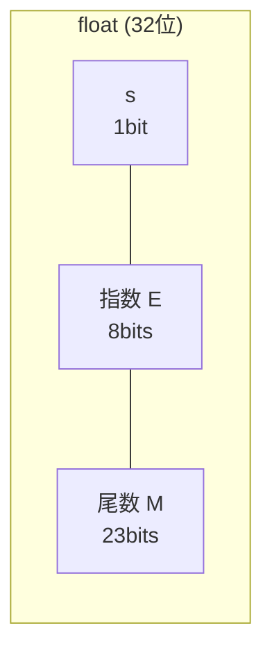

## A — 数据表示

计算机以二进制存储一切。理解数据的底层表示，是理解内存布局、类型转换、容器性能优化的基础。

### 整数的表示

#### 无符号整数

n 位无符号整数的取值范围：0 到 2^n - 1。

```
8 位:  0 ~ 255
16 位: 0 ~ 65535
32 位: 0 ~ 4294967295
64 位: 0 ~ 18446744073709551615
```

#### 有符号整数：二进制补码（Two's Complement）

几乎所有现代架构使用补码表示有符号整数。补码的核心性质：

- 最高位为符号位：0 为正，1 为负
- n 位有符号整数的范围：-2^(n-1) 到 2^(n-1)-1
- 取反操作：**按位取反 + 1**

```
 5 的 8 位二进制: 00000101
-5 的 8 位二进制: 11111011  (取反: 11111010, 加1: 11111011)
```

补码的优势：加法器对无符号和有符号整数不做区分，同一套硬件电路即可完成两种运算。以下两行是同一套电路运算的同一组比特：

```
255 + 1  (无符号) → 00000000, 进位=1, 结果=0
-1  + 1  (补码)   → 00000000, 进位=1, 结果=0
```

#### 整数的字节序（Endianness）

多字节整数在内存中的排列顺序存在两种约定：

| 类型 | 规则 | 示例（0x12345678 在地址 0x100 处） |
|------|------|------|
| 小端（Little-Endian） | 低位字节在低地址 | 0x100: 78, 0x101: 56, 0x102: 34, 0x103: 12 |
| 大端（Big-Endian） | 高位字节在低地址 | 0x100: 12, 0x101: 34, 0x102: 56, 0x103: 78 |

x86 和 x86_64 使用小端。ARM 默认小端但可配置。网络字节序是大端，所以接收/发送网络数据包需要用 `htonl` / `ntohl` 转换。

**对容器的意义**：`memcmp` 在大端和小端机器上对整数数组的比较结果可能不一致。做跨平台数据序列化时需要注意字节序转换。

### 浮点数的表示（IEEE 754）

浮点数采用科学计数法存储：`(-1)^s × 1.M × 2^(E - bias)`

| 精度 | 总位数 | 符号(s) | 指数(E) | 尾数(M) | bias |
|------|:-----:|:------:|:------:|:------:|:----:|
| float（单精度） | 32 | 1 | 8 | 23 | 127 |
| double（双精度） | 64 | 1 | 11 | 52 | 1023 |



三个特殊值：全 0 指数 + 全 0 尾数 = 0；全 1 指数 + 全 0 尾数 = 无穷大；全 1 指数 + 非 0 尾数 = NaN（Not a Number）。

**对容器的意义**：
- 浮点数精度有限，`vec[0] == 0.1 + 0.2` 可能为 false
- `std::set<double>` 的排序依赖 `<` 运算符，NaN 会破坏有序性（NaN 与任何值的比较都为 false）

### 内存对齐（Memory Alignment）

CPU 在访问对齐地址时能一次读取完成，未对齐地址可能需要两次读取并拼接。因此编译器在结构体成员之间插入填充（padding）。

```c
struct Demo {
    char  a;     // 偏移 0,  大小 1
    // padding 3 bytes
    int   b;     // 偏移 4,  大小 4
    short c;     // 偏移 8,  大小 2
    // padding 2 bytes
};               // 总大小 12

// 使用 offsetof 宏（stddef.h）获取成员偏移量
// offsetof(struct Demo, a) == 0
// offsetof(struct Demo, b) == 4
// offsetof(struct Demo, c) == 8
```

对齐规则：
- 每个成员对齐到自身大小的整数倍偏移（char: 1, short: 2, int: 4, double: 8, 指针: 4/8）
- 结构体总大小对齐到最大成员对齐值的整数倍
- 成员排列顺序影响总大小：把对对齐要求高的成员放在前面可以减少 padding

| 排列 | 结构体定义 | 预期大小 |
|------|----------|:----:|
| 优化的排列 | `{double d; int i; char c;}` | 16 |
| 不优化的排列 | `{char c; double d; int i;}` | 24 |

```c
// 编译器属性取消对齐（不推荐，影响性能）
struct __attribute__((packed)) NoPad {
    char  a;
    int   b;
    short c;
};  // sizeof == 7
```

**对容器的意义**：
- `vector<struct Demo>` 的实际内存占用 = `n * sizeof(struct Demo)`，其中 sizeof 包含了 padding
- "成员顺序换一下，内存省三分之一" 是真实存在的优化
- 取消对齐（packed）会导致未对齐访存，在遍历大数组时性能显著下降

### 向量的位运算与底层优化

C 语言提供六个位运算符。在容器实现中，位运算常用于：

| 运算符 | 名称 | 容器中的典型用途 |
|--------|------|----------------|
| `&` | 按位与 | 取模运算：`x & (2^n - 1)` 等价于 `x % 2^n`（循环缓冲区下标） |
| `\|` | 按位或 | 标志位合并 |
| `^` | 按位异或 | 哈希函数设计、交换两数无临时变量 |
| `~` | 按位取反 | 位掩码生成 |
| `<<` | 左移 | `1 << n` 计算 2 的 n 次方（扩容容量计算） |
| `>>` | 右移 | 快速除以 2 的 n 次方 |

```c
// 循环缓冲区的取模（仅适用于容量为 2 的幂）
size_t index = (head + 1) & (capacity - 1);  // 等价于 (head + 1) % capacity

// 位运算扩容判断：capacity 是否为 2 的幂
int is_power_of_two(size_t n) { return n && !(n & (n - 1)); }
```

### 本章与其他模块的链接

- 内存对齐在容器选型中的实际影响 → [[../数据结构/D_容器_Container|容器 Container#内存对齐与 padding]]
- 浮点数精度与 `std::set` 的关系 → [[../数据结构/D_容器_Container|容器 Container]]
- 缓存如何利用对齐地址做快速读取 → [[B_缓存层级]]
