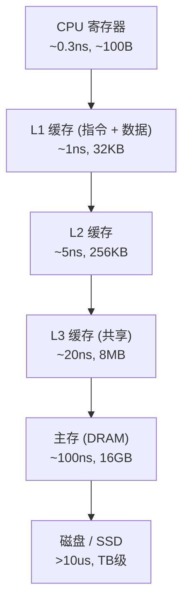

## B — 缓存层级

CPU 缓存是位于 CPU 与主存之间的高速小容量存储器，大小从 32KB 到数十 MB，用来弥合 CPU 速度与主存速度之间的鸿沟。

### 缓存层次结构



| 存储层级 | 延迟（约） | 容量 | 带宽 |
|---------|:---------:|------|------|
| L1 Cache | ~1 ns | 32KB/核 | ~1 TB/s |
| L2 Cache | ~5 ns | 256KB/核 | ~500 GB/s |
| L3 Cache | ~20 ns | 8MB/共享 | ~200 GB/s |
| DRAM | ~100 ns | 16GB | ~50 GB/s |
| NVMe SSD | ~10 us | TB | ~5 GB/s |

### Cache Line

CPU 不以字节、也不以机器字为单位从主存读取数据，而是以 **Cache Line** 为单位，一个 cache line 通常为 64 字节（x86 和 ARM）。

```
内存视角:   [Byte 0] [Byte 1] ... [Byte 63] [Byte 64] ... [Byte 127] ...
Cache Line: [       Line 0        ] [         Line 1         ]
```

每次 CPU 读取任何一个地址，都会将包含该地址的整个 64 字节 cache line 从主存拖入缓存。

### Cache Miss 与空间局部性

| 场景 | 行为 | 延迟 |
|------|------|:---:|
| Cache Hit | 数据已在缓存中 | ~1 ns |
| Cache Miss | 需从主存/下级缓存加载 | ~100 ns |

连续存储的数据结构（数组、vector）利用空间局部性：访问 `arr[i]` 时，`arr[i+1]` 到 `arr[i+15]` 已被预取到同一条 cache line 中。节点存储的数据结构（链表、树）不具备这个性质。

```
vector 遍历: arr[0](hit), arr[1](hit), arr[2](hit), ... arr[15](hit), arr[16](miss→hit)
list 遍历:   node[0](miss→hit), node[1](miss→hit), node[2](miss→hit), ...
             ↑ 每个节点地址散列，几乎每次都是 miss
```

### 缓存关联度（Associativity）

缓存被划分为多个组（Set），每个组包含若干条缓存行（Way）：

| 类型 | 特点 |
|------|------|
| 直接映射（1-way） | 每个内存地址只能映射到唯一的 cache line，冲突多 |
| 全关联 | 任何地址可放入任何 cache line，电路复杂 |
| N 路组关联 | 折中方案：组间直接映射，组内 N 路全关联（主流） |

现代桌面 CPU 的 L1 缓存通常是 8 路组关联，L3 为 16 路或以上。

### 伪共享（False Sharing）

两个不同线程分别修改两个不同的变量，但它们恰好在同一条 cache line 中，会导致缓存一致性协议（如 MESI）在两个 CPU 核之间频繁传输这条 cache line，产生性能灾难。

```c
// 两个线程各递增自己的计数器，但计数器在同一条 cache line 中
struct Counters {
    int counter_a;  // 线程 A 递增
    int counter_b;  // 线程 B 递增
    // 两个 int 共 8 字节，在同一条 64 字节 cache line 中
    // → 每次递增都触发 cache line 在核间 bounce
};

// 修复：加 padding 填满一条 cache line
struct PaddedCounters {
    int counter_a;
    char _pad[60];  // 填充到 64 字节边界
    int counter_b;
};
```

**对容器的意义**：多线程下对 `vector<int>` 的不同位置并发写入，如果两个线程分别写相邻元素，同样会触发伪共享。解决方式与上面相同——保证每个线程写入的元素间隔至少 64 字节。

### 写策略

| 策略 | 行为 | 适用场景 |
|------|------|---------|
| Write-Through | 写缓存时同步写入主存，一致性简单但慢 | 部分嵌入式系统 |
| Write-Back | 只写缓存，标记 dirty，evict 时才写回主存 | 主流 x86/ARM，性能高 |

### 缓存性能优化策略实践

以下是常见的缓存友好编程模式：

| 策略 | 说明 | 示例 |
|------|------|------|
| 顺序访问 | 按连续地址遍历数据 | `for(i=0;i<n;i++) a[i]` |
| 避免 stride 访问 | 不要以大于 cache line 的步长跳跃访问 | 避免 `for(i=0;i<n;i+=16) a[i]` |
| 结构体 vs 数组 | 对空间局部性要求高的访问用 Array of Structs；对计算密集型用 Struct of Arrays | SoA 适合向量化 |
| 循环分块（Tiling） | 将大循环拆分成适合缓存的小块 | 矩阵乘法分块优化 |

**对容器的意义**：
- `std::vector` 天然保证顺序访问，缓存友好
- `std::deque` 在同一 block 内缓存友好，跨 block 时依赖 block 的分配位置
- `std::list` 几乎不利用缓存，每次解引用大概率 cache miss

### 本章与其他模块的链接

- 缓存局部性如何决定容器选择的性能差异 → [[../数据结构/A_容器_Container|容器 Container#CPU 缓存与空间局部性]]
- 循环分块与矩阵乘法的具体实现 → [[../数据结构/DSA学习路线|DSA 学习路线]]
- 内存对齐与 cahce line 的配合 → [[A_数据表示#内存对齐]]
- 虚拟内存下的缺页中断比 cache miss 更慢 → [[../操作系统/F_内存管理|内存管理]]
