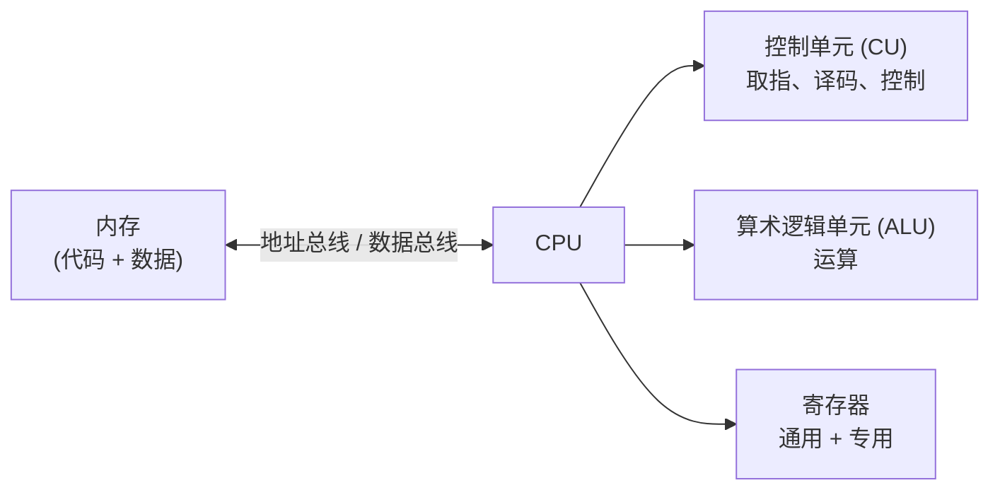
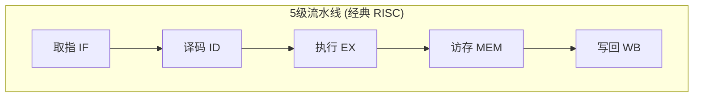

## C — CPU 架构

CPU 是执行指令的核心器件。理解 CPU 的微观执行流程，是理解程序性能的基础。

### Von Neumann 架构



现代 CPU 虽然远比这个五部件模型复杂，但本质上仍然是 fetch → decode → execute 的循环。

### 指令流水线（Pipeline）

指令执行被拆分为多个阶段，不同阶段可以重叠执行，提高吞吐量：



| 周期 | IF | ID | EX | MEM | WB |
|:---:|:--:|:--:|:--:|:---:|:--:|
| 1 | 指令1 | | | | |
| 2 | 指令2 | 指令1 | | | |
| 3 | 指令3 | 指令2 | 指令1 | | |
| 4 | 指令4 | 指令3 | 指令2 | 指令1 | |
| 5 | 指令5 | 指令4 | 指令3 | 指令2 | 指令1 |

理想情况下每个周期完成一条指令，但实际上有多种"流水线冒险"：

### 流水线冒险（Hazards）

| 类型 | 问题 | 解决方案 |
|------|------|---------|
| 数据冒险 | 指令 B 依赖指令 A 的结果，但 A 还没写完 | 数据前推（Forwarding / Bypassing） |
| 控制冒险 | 条件分支跳转到哪里，取指时还不知道 | 分支预测（Branch Predictor） |
| 结构冒险 | 两条指令争用同一硬件资源 | 增加硬件（哈佛架构：独立指令缓存和数据缓存） |

### 分支预测

遇到条件跳转（`if` / `for` / `while`）时，CPU 不等判断结果就先"猜"一个方向继续取指：

```
for (int i = 0; i < 1000000; i++) { ... }
// 分支预测器发现前 999999 次都是"继续循环" → 猜对 999999 次
// 最后一次退出循环 → 猜错一次，流水线 flush
```

分支预测错误（Mispredict）的代价：已经进入流水线的指令全部丢弃，重新从正确路径取指——约 15-20 个时钟周期的惩罚。

**对容器的意义**：`std::vector` 的 `operator[]` 不涉及条件跳转（直接指针算术），不会有分支预测错误的可能。`std::list` 的遍历每走一步都要判断 `next == NULL`，如果预测器预测继续，但这次走到末尾了，就是一次 mispredict。

### 乱序执行（Out-of-Order Execution）

现代 CPU 在保证依赖关系的前提下，**不按程序顺序而是按"谁的数据先准备好就执行谁"**来调度指令，大幅提高执行单元的利用率：

```
程序顺序:          实际执行顺序:
A = load(X)         A = load(X)         ← cache miss，等待 100 个周期
B = A + 1           C = load(Y)         ← cache hit，立即执行
C = load(Y)         B = A + 1           ← A 的数据到了
                    D = C + 1           ← C 数据已在
D = C + 1           写回按程序顺序完成
```

**对容器的意义**：容器操作中如果有连续的 `load → compute → store`，乱序执行可以让多个独立操作重叠。`std::vector` 的 `push_back` 中元素是连续的——内存预取一次之后，后面的 load 命中率极高，乱序执行可以在连续几个地址上同时推进。

### 向量化与 SIMD

现代 CPU 提供 SIMD（Single Instruction, Multiple Data）指令集，一条指令同时处理多个数据：

```
标量加法:  a[0] + b[0], a[1] + b[1], a[2] + b[2], a[3] + b[3]  ← 4 条指令
SIMD 加法: (a[0..3]) += (b[0..3])  ← 1 条指令
```

| 指令集 | 寄存器宽度 | 能同时处理的 int 个数 |
|--------|:--------:|:-------------------:|
| SSE (x86) | 128 bit | 4 |
| AVX2 (x86) | 256 bit | 8 |
| AVX-512 (x86) | 512 bit | 16 |
| NEON (ARM) | 128 bit | 4 |

**对容器的意义**：编译器可以对 `for (i=0; i<n; i++) c[i] = a[i] + b[i]` 自动生成 SIMD 指令（向量化），前提是数据在内存中连续排列。因此 `std::vector` 天然支持自动向量化，`std::list` 不行。

### 本章与其他模块的链接

- 分支预测与容器遍历的关系 → [[../数据结构/A_容器_Container|容器 Container]]
- SIMD 在数字信号处理 / 多媒体计算中的应用 → [[../数据结构/DSA学习路线|DSA 学习路线]]
- 汇编层看到流水线和乱序执行 → [[../汇编基础/ASM_01_寄存器与指令基础|汇编基础]]
