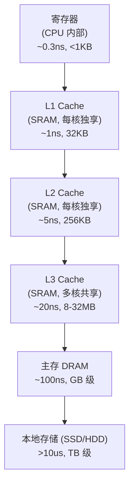

## D — 内存层次结构

计算机的存储系统是一个金字塔形的层次结构：越靠近 CPU 的层级速度越快、容量越小、单价越贵。



### 各层级详细对比

| 层级 | 技术 | 容量 | 延迟 | 带宽 | 每比特成本 |
|------|------|------|:---:|------|:--------:|
| SRAM (L1,L2,L3) | 6T SRAM 单元 | KB-MB | 1-20 ns | TB/s | 极高 |
| DRAM | 1T1C 电容 | GB | ~100 ns | 50 GB/s | 中 |
| NAND Flash (SSD) | 浮栅晶体管 | TB | ~10 us | 5 GB/s | 低 |
| HDD | 磁存储 | TB | ~10 ms | 200 MB/s | 极低 |

### 各层级的独立性

- **私有 vs 共享**：L1 和 L2 缓存每个核独有，L3 缓存被所有核共享
- **指令 vs 数据**：L1 缓存分为 L1i（指令）和 L1d（数据），L2/L3 统一存储
- **包含 vs 非包含**：L2 通常包含 L1 的所有内容；L3 是否包含 L1/L2 取决于实现（Intel 使用包含式，AMD Zen 使用非包含式）

### 访存延迟的量化尺度

```
L1 cache hit:     ~1 ns        (1 秒的类比)
L2 cache hit:     ~5 ns        (5 秒)
L3 cache hit:     ~20 ns       (20 秒)
DRAM access:      ~100 ns      (100 秒 ≈ 1.5 分钟)
SSD access:       ~10 us       (3 小时)
HDD access:       ~10 ms       (4 个月)
```

这个差异解释了为什么 `std::vector`（连续存储，大部分 L1 cache hit）比 `std::list`（散列表存，大部分 DRAM access）快 100 倍——这不是算法的胜利，是数据离 CPU 的物理距离决定的。

### SRAM 与 DRAM 的底层差异

| | SRAM (Static RAM) | DRAM (Dynamic RAM) |
|------|---------|---------|
| 存储单元 | 6 个晶体管构成锁存器 | 1 个晶体管 + 1 个电容 |
| 需要刷新 | 否（静态保持） | 是（电容漏电，每 ~64ms 刷新一次） |
| 速度 | 极快 | 较慢 |
| 功耗 | 静止时极低，运行时高 | 持续刷新消耗电能 |
| 用途 | CPU 缓存 | 主存 DIMM 条 |

DRAM 需要刷新的原因是电容会漏电——这不是设计缺陷，而是物理定律。每隔几十毫秒，DRAM 控制器必须把每个单元的数据读出来再写回去。在这期间 DRAM 不能响应 CPU 请求。

### 虚拟内存对内存层次的影响

`malloc` 分配的虚拟地址使用虚拟地址空间，映射到哪个物理页完全由内核决定。连续的虚拟地址可能对应完全不连续的物理页。这意味着即使是 `std::vector` 的连续遍历，在主存层面仍然可能跨多个不连续的 DRAM 行——cache line 统一在 L2/L3 中把它们拉回来。

TLB 在缓存层次中的位置：TLB 是专门缓存虚拟→物理地址映射的高速缓存，独立于数据缓存。TLB miss（查不到映射）比 cache miss 更昂贵，因为要遍历页表（多次内存访问）。

### 本章与其他模块的链接

- 缓存层级的具体结构 → [[B_缓存层级]]
- 虚拟内存如何影响物理内存布局 → [[../操作系统/F_内存管理|内存管理]]
- 容器在不同层级上的性能差异 → [[../数据结构/A_容器_Container|容器 Container#连续存储 vs 节点存储]]
