## F — 总线系统

总线是连接计算机各部件的共享通信通路。从 CPU 内部的寄存器传输，到跨机柜的 PCIe 设备连接，总线定义了数据如何从一个部件传输到另一个部件。总线仲裁、带宽计算、定时方式是本学科的核心内容。

### 总线的基本概念

总线由三组信号线构成：

| 信号线 | 功能 | 方向 |
|--------|------|:---:|
| 数据总线 (Data Bus) | 传输实际数据 | 双向 |
| 地址总线 (Address Bus) | 指定数据来源/去向的地址 | 单向 (CPU 发出) |
| 控制总线 (Control Bus) | 传输控制信号和时序信号 | 每根线方向固定 |

地址总线宽度决定最大寻址空间：n 根地址线 → 2^n 个地址单元。数据总线宽度决定一个总线周期内可传输的数据量。

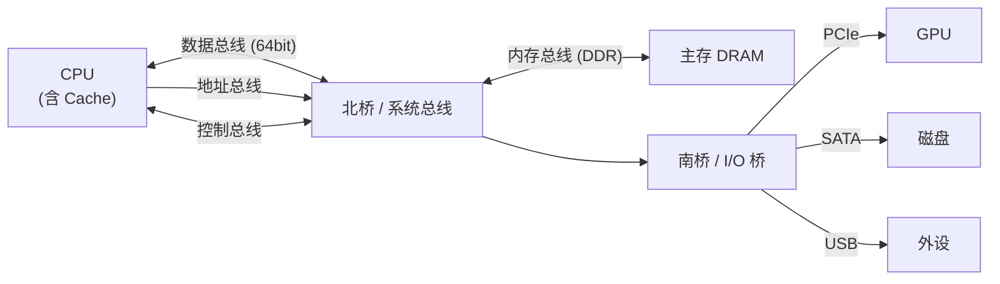

**总线主设备 (Bus Master)** 与 **总线从设备 (Bus Slave)**：能发起总线操作的设备称为主设备（如 CPU、DMA 控制器），只能响应的称为从设备（如内存、寄存器接口）。

### 总线分类（核心）

#### 片内总线

CPU 芯片内部各功能部件之间的连接，如 ALU 与寄存器堆之间的数据传输通道。通常在单周期内完成，带宽极高（TB/s 级），不可外部观测。

```
寄存器堆 ←→ ALU ←→ 移位器 ←→ 写回通路
   ↕
L1 Cache 接口
```

#### 系统总线

连接 CPU、主存和高速 I/O 的通道。在传统结构中分为：

- **地址总线**：单向，CPU 向主存或外设端口发出地址
- **数据总线**：双向，承载指令和数据
- **控制总线**：包含读/写信号、中断请求、总线请求/响应、复位等

#### 通信总线

连接计算机系统与外部设备或计算机系统之间的总线，通常跨机箱、机柜距离。

| 总线类型 | 典型标准 | 传输距离 | 典型速度 | 典型用途 |
|---------|---------|:---:|------|---------|
| 片内总线 | 厂商自定义 | 芯片内部 | TB/s | ALU ↔ L1 Cache |
| 系统并行总线 | ISA, PCI | 主板内 | 16 MB/s ~ 533 MB/s | 早期扩展卡 |
| 高速串行总线 | PCIe, USB 3.x | 主板/桌面 | GB/s | 显卡、NVMe、外设 |
| 存储总线 | SATA, SAS, NVMe | 机箱内 | MB/s ~ GB/s | 硬盘 |
| 设备总线 | I2C, SPI, UART | PCB 板级 | Kb/s ~ Mb/s | 传感器、MCU 外设 |
| 网络总线 | Ethernet, InfiniBand | km 级 | Gb/s ~ Tb/s | 数据中心互联 |

### 总线性能指标（核心计算）

#### 基本参数

| 指标 | 含义 | 单位 |
|------|------|:---:|
| 总线宽度 | 数据总线的根数，即一次能并行传输的 bit 数 | bit |
| 总线频率 | 总线工作的时钟频率 | Hz |
| 总线带宽 | 单位时间内可传输的数据量 | B/s |

#### 带宽计算公式

```
带宽 = 总线宽度 / 8 × 总线频率 × 每周期传输次数
```

**例 1**：某总线宽度 64 位，时钟频率 100 MHz，每个时钟周期传输一次数据。

```
带宽 = 64/8 × 100 × 10^6 × 1 = 8 B × 100 MHz = 800 MB/s
```

**例 2**：DDR (Double Data Rate) 总线在时钟上升沿和下降沿各传输一次，宽度 64 位，时钟 400 MHz。

```
带宽 = 64/8 × 400 × 10^6 × 2 = 8 B × 800 MT/s = 6.4 GB/s
```

**例 3 (典型题)**：某总线支持 Burst 传输（连续 4 拍），总线宽度 32 位，频率 66 MHz，分别计算单次传输和 Burst 4 传输下的实际数据带宽。

```
单次传输: 32/8 × 66 MHz = 4 B × 66 MHz = 264 MB/s
Burst 4: 每次传输仍为 4 字节，但地址阶段只需一次，4 个数据连续传输
         有效带宽 ≈ 264 MB/s (数据阶段)
         (地址开销约占 20%，实际有效带宽约 211 MB/s 以上)
```

#### 影响带宽的实际因素

| 因素 | 说明 |
|------|------|
| 总线宽度不足 | 64 位 CPU 配 32 位内存总线只能一次传半个机器字 |
| 总线频率低 | 限制外设吞吐，SSD 性能瓶颈常在此 |
| 连续读写 vs 随机读写 | Burst 模式利用顺序性大幅提高有效带宽 |
| 仲裁开销 | 多个主设备竞争总线时，每次切换都有仲裁延迟 |
| 协议开销 | 地址包、校验位、应答握手消耗额外带宽 |

#### Burst Transfer 与 Single Transfer 对比

| 模式 | 过程 | 效率 |
|------|------|:---:|
| Single Transfer | 地址 + 数据 (每拍都需要地址阶段) | 低 |
| Burst Transfer | 起始地址 + 连续 N 个数据 (地址阶段只有一次) | 高 |

Burst 是对空间局部性的硬件利用：既然 Cache Line 为 64 字节，一次 Burst 读取恰好填满一条 Cache Line。

### 总线仲裁（核心）

当多个主设备同时请求总线时，仲裁逻辑决定谁先使用总线。分为 **集中式仲裁** 和 **分布式仲裁** 两大类。

#### 集中式仲裁

##### 1. 链式查询 (Daisy Chain)

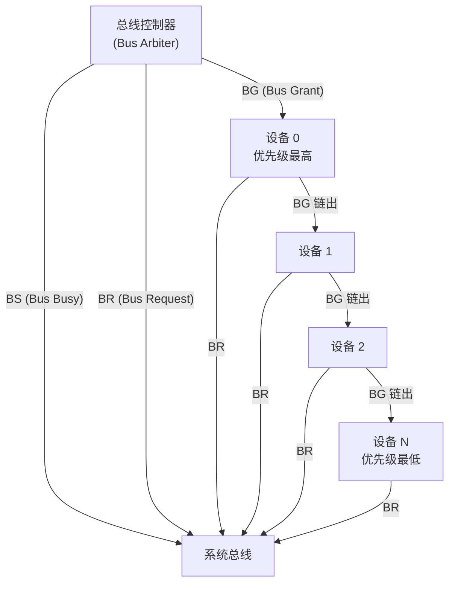

三根控制线的用途：

- **BR (Bus Request)**：任何设备请求总线时置位，集电极开路实现线与逻辑，所有设备共享一根。
- **BG (Bus Grant)**：控制器发出的授权信号，在设备间链条状传递。某设备不请求时直接将 BG 向后传递；若自身有请求，截获 BG 并停止向下一级传递。
- **BS (Bus Busy)**：获得总线的设备置位此信号，释放总线时清零。

特点：优先级由物理位置固定（离控制器越近越高），灵活性差。某设备故障会导致 BG 链断裂，下游所有设备无法获得授权——**单点故障脆弱**。

##### 2. 计数器定时查询 (Polling with Counter)

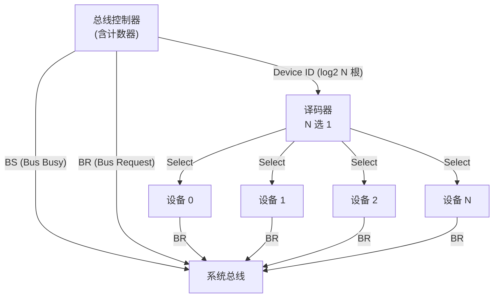

工作过程：

1. 某设备置 BR 请求总线
2. 控制器启动计数器，依次输出设备号 (0, 1, 2, ...)
3. 被选中的设备若没有请求，计数器+1 继续下一设备
4. 被选中的设备若有请求，置 BS，控制器停止计数
5. 传输完成后设备释放 BS，计数器可复用

计数器清零方式又分两种：
- **固定优先级**：每次从 0 开始计数，设备 0 优先级最高
- **循环优先级**：计数器在上次结束位置继续，各设备优先级均匀

##### 3. 独立请求 (Independent Request)

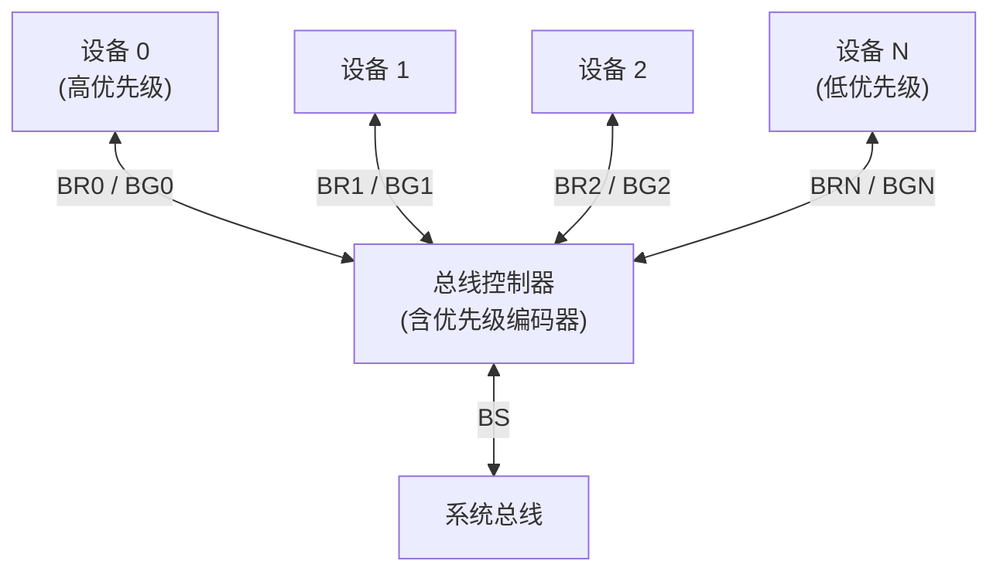

每个设备有独立的 BR 和 BG 信号线，控制器内部维护优先级编码器，当多个 BR 同时有效时，选择优先级最高的设备返回 BG。

##### 三种集中式仲裁对比

| 特性 | 链式查询 | 计数器定时查询 | 独立请求 |
|------|:------:|:----------:|:------:|
| 控制线数量 | 3 根 (最少) | ~log2 N + 3 | 2N + 1 (最多) |
| 优先级灵活性 | 固定 (物理位置) | 可改 (计数起点) | 可编程 (编码器) |
| 响应速度 | 较慢 (链传递) | 慢 (逐次计数) | 快 (并行响应) |
| 故障容忍性 | 差 (链路断裂) | 好 (设备故障不影响) | 好 (独立线路) |
| PCB 布线复杂度 | 低 | 中 | 高 |
| 可扩展性 | 链越长越慢 | 设备越多计数时间越长 | 线数随设备线性增长 |

#### 分布式仲裁

不设中央仲裁器，每个设备自行判断是否获得总线使用权。

##### 自举选择 (Self-Selection)

每个设备有唯一的优先级编号。请求设备将自己的编号放在仲裁线上，所有设备比较线上的编号，编号最大（或最小）者获得总线。这需要每个设备具备比较逻辑，使用集电极开路驱动保证安全仲裁。

##### 冲突检测 (Collision Detection)

设备随时侦听总线，空闲时立即发送；如果检测到冲突（多个设备同时发送），启用退避算法重试。典型代表：**CAN 总线**（CSMA/CR 机制，ID 低的帧优先级更高，通过逐位仲裁而非冲突检测）。

### 总线操作与定时

总线定时定义了数据在总线上传输的时间关系。

#### 同步通信

所有设备使用同一个时钟信号，操作在固定时钟周期内完成。

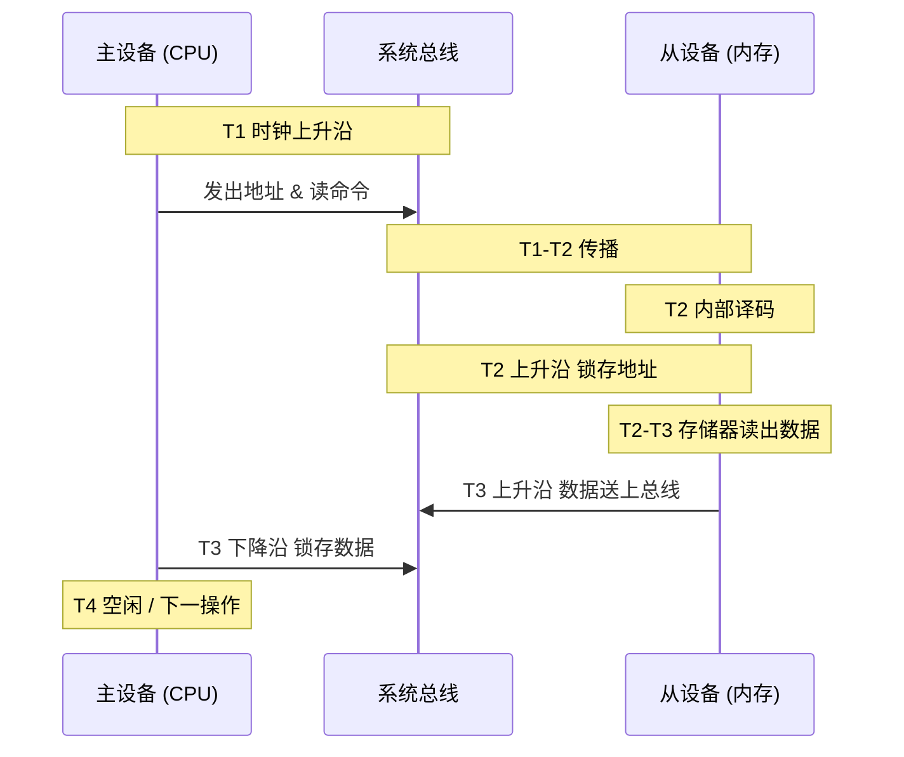

优点：电路简单，协议开销小。
缺点：所有设备必须按最慢设备的速度工作，快设备被拖慢（时钟速度由板上最慢设备决定）。由于时钟歪斜 (Clock Skew) 限制，高速环境难以保证全板时钟同步。

#### 异步通信

不使用统一时钟，通过 **应答 (Handshake)** 机制协调传输。双方用请求 (REQ) 和应答 (ACK) 信号相互通知操作完成。

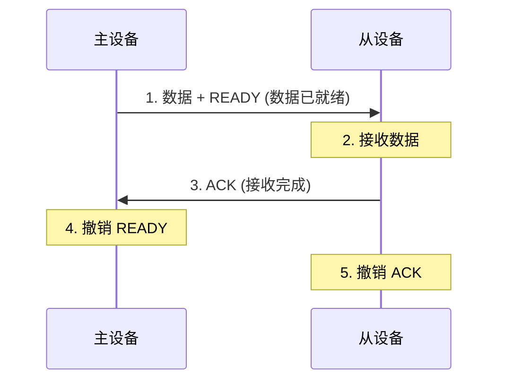

根据握手信号的互锁程度分为三类：

| 类型 | 规则 | 特点 | 适用 |
|------|------|------|------|
| 非互锁 (Non-interlocked) | 发送方只等固定的时间，不等 ACK | 快，但可能丢数据 | 已知慢速外设 |
| 半互锁 (Semi-interlocked) | 发送方等 ACK，但 ACK 长度固定 | 简单实现 | 部分 MCU 外设 |
| 全互锁 (Fully-interlocked) | REQ → ACK → REQ↓ → ACK↓ 四步完整 | 最可靠 | 异步 SRAM、AMBA 总线 |

**全互锁的完整四步时序**：

```
主设备: 数据有效 → 置 REQ
从设备: 收到 REQ → 锁存数据 → 置 ACK
主设备: 收到 ACK → 撤销 REQ (数据不再保证有效)
从设备: 收到 REQ↓ → 撤销 ACK (一个传输周期完成)
```

优点：不受时钟偏差限制，快慢设备可以配合工作，适合跨时钟域传输。
缺点：握手额外消耗周期，每次传输至少 2 次来回延迟，带宽利用率低于同步方式。

**同步方式中对异步应答信号的捕获**：源同步 (Source-Synchronous) 不是严格意义上的异步通信。发送端附带一个独立的时钟（或 strobe）信号随数据一起传输，接收端用收到的 strobe 锁存数据，从而消除数据与时钟在 PCB 走线长度上产生的 skew。DDR/DDR2/DDR3 使用双向 DQS 信号实现该协议。

#### 半同步通信

结合时钟同步和应答握手：主设备发出地址/命令后在固定周期数内等待；若从设备未准备好，可以插入 **Wait State (nWAIT)** 信号，主设备则延长总线周期。x86 的 I/O 周期和 8086 的 READY 引脚即为半同步通信。

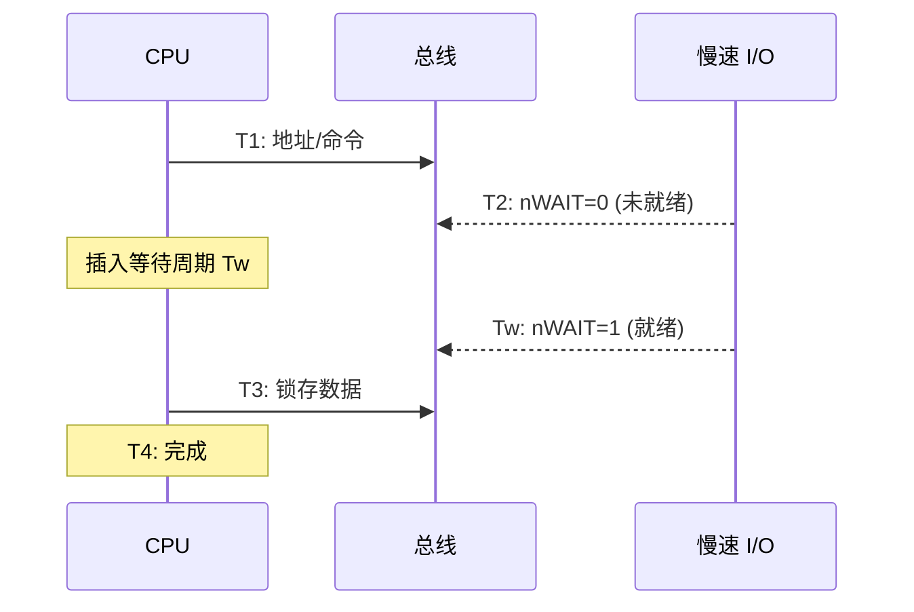

#### 分离式通信 (Split Transaction)

常规总线操作在等待慢速从设备时会阻塞整个总线。分离式通信将该过程拆解为两个独立的阶段：

1. **请求阶段**：主设备发送地址、命令、自身标识给从设备，随即释放总线
2. **响应阶段**：从设备准备好数据后，以主设备身份申请总线，将数据发回原请求者

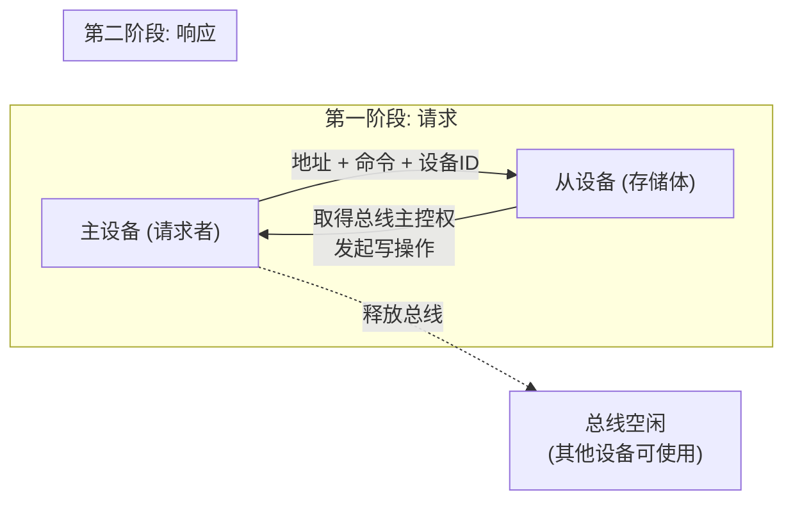

分离式通信的实质是将一个总线事务拆成两个独立的总线事务，期间总线可被其他主设备使用，大幅提高了总线利用率。PCIe 本质上就是一个分离式通信的分组交换网络——每个 TLP (Transaction Layer Packet) 携带请求者 ID，响应报文通过切换 (Switch) 路由回请求者。

### 总线标准

#### 历史演进总览

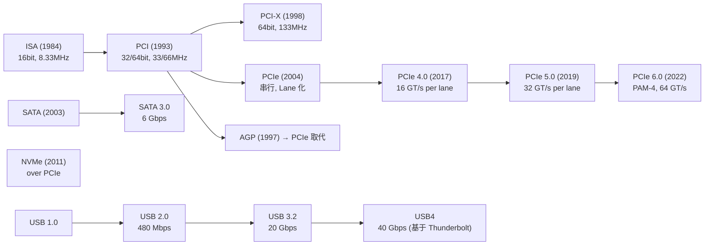

#### 各标准详细参数

| 标准 | 宽度 | 时钟 / 速率 | 带宽 | 工作模式 | 热插拔 |
|------|:---:|------|------|:------:|:---:|
| ISA | 16 bit | 8.33 MHz | 16 MB/s | 同步, 半双工 | 否 |
| PCI (32bit/33MHz) | 32 bit | 33 MHz | 133 MB/s | 同步, 半双工 | 否 |
| PCI (64bit/66MHz) | 64 bit | 66 MHz | 533 MB/s | 同步, 半双工 | 否 |
| AGP 8x | 32 bit | 533 MHz (DDR) | 2.1 GB/s | 同步 | 否 |
| PCIe 3.0 x1 | 1 Lane | 8 GT/s | ~1 GB/s | 分组交换 | 是 |
| PCIe 3.0 x16 | 16 Lane | 8 GT/s | ~16 GB/s | 分组交换 | 是 |
| PCIe 4.0 x16 | 16 Lane | 16 GT/s | ~32 GB/s | 分组交换 | 是 |
| PCIe 5.0 x16 | 16 Lane | 32 GT/s | ~64 GB/s | 分组交换 | 是 |
| USB 2.0 | 1 对差分 | 480 Mbps | 60 MB/s | 串行, 半双工 | 是 |
| USB 3.2 Gen 2x1 | 1 Lane | 10 Gbps | 1.25 GB/s | 串行, 全双工 | 是 |
| USB 3.2 Gen 2x2 | 2 Lane | 10 Gbps/lane | 2.5 GB/s | 串行 | 是 |
| USB4 | 1 Lane | 40 Gbps | 5 GB/s | 隧道协议 | 是 |
| SATA 3.0 | 1 对差分 | 6 Gbps | 600 MB/s | 串行 | 是 |
| NVMe (PCIe 4.0 x4) | 4 Lane | 16 GT/s | ~8 GB/s | PCIe 分组 | 是 |
| I2C (标准) | 1 bit | 100 kHz | 12.5 KB/s | 串行, 半双工 | — |
| SPI | 1 bit (全双工) | ~50 MHz | ~6.25 MB/s | 串行, 全双工 | — |

#### PCIe 体系结构 (关键)

PCIe 放弃了共享总线拓扑，改用 **点到点串行连接** 和 **基于交换 (Switch) 的分组路由**：

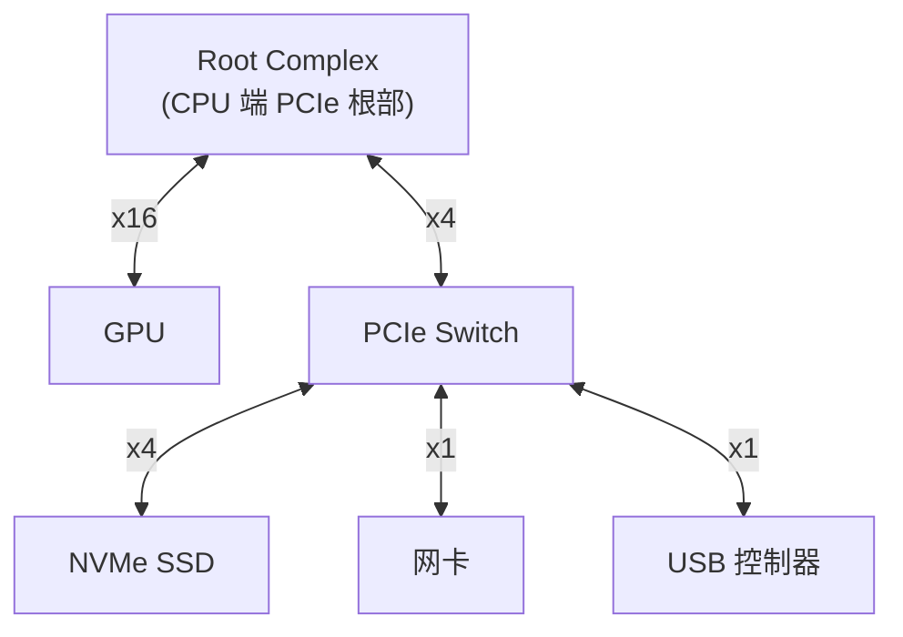

- **Lane**：一对差分发送 + 一对差分接收构成 1 Lane (PCIe 全双工最小单元)
- **Link**：可由 1/2/4/8/16/32 Lane 聚合
- **Switch**：替代传统总线仲裁器，基于 TLP Header 中的目标地址/BDF (Bus/Device/Function) 进行分组转发
- **Root Complex**：连接 CPU 与 PCIe 体系拓扑的根节点，含 DMA 地址翻译器 (IOMMU)

PCIe 的 TLP 层与总线理论中的 **分离式通信** 思路一致：读写请求 TLP 与完成 (Completion) TLP 是两个独立的报文，Switch 独立路由它们，总线链路不会因等待一个慢速设备而被阻塞。

#### USB 拓扑

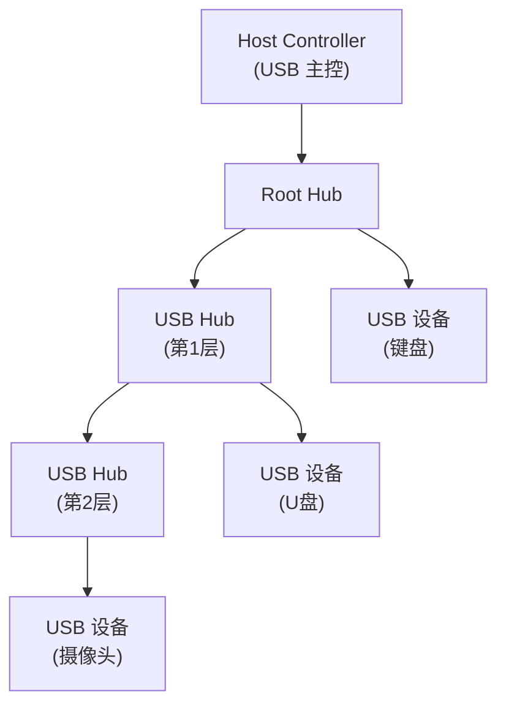

USB 采用 **树形拓扑**，Host 控制一切调度，设备不能主动发起传输，只能在 Host 轮询 (Polling) 时响应。传输类型分为控制、批量、中断、等时四类，分别用于配置/大容量/低延迟/实时流。

#### I2C / SPI (嵌入式关键)

| 特性 | I2C | SPI |
|------|-----|-----|
| 线数 | 2 (SCL + SDA) | 4 (SCLK, MOSI, MISO, SS) |
| 拓扑 | 多主多从，两根总线 | 单主多从，每从需独立 SS |
| 寻址 | 7bit/10bit 设备地址 (在数据中) | 物理片选线 (SS) |
| 速度 | 100k/400k/1M/3.4M Hz | 通常 1-50 MHz (无上限) |
| 全双工 | 否 (半双工) | 是 (MOSI + MISO 独立) |
| 典型应用 | 传感器, RTC, EEPROM | Flash, LCD, ADC/DAC |

```c
// I2C 主接收示意 (概念层次, 非特定平台寄存器)
void i2c_master_recv(uint8_t dev_addr, uint8_t reg, uint8_t *buf, int len) {
    i2c_start();                           // SDA↓ 然后 SCL↓
    i2c_write_byte((dev_addr << 1) | 0);   // 设备地址 + 写位
    i2c_write_byte(reg);                   // 寄存器地址
    i2c_start();                           // 重复起始条件
    i2c_write_byte((dev_addr << 1) | 1);   // 设备地址 + 读位
    for (int i = 0; i < len - 1; i++)
        buf[i] = i2c_read_byte(1);         // 读并发送 ACK
    buf[len - 1] = i2c_read_byte(0);       // 最后字节发送 NACK
    i2c_stop();                            // SCL↑ 然后 SDA↑
}
```

### 对容器的意义

#### PCIe 拓扑与设备穿透 (SR-IOV)

在虚拟化环境中，虚拟机访问物理 PCIe 设备有三种途径：

1. **全虚拟化 (Emulation)**：Hypervisor 模拟一个完整 PCIe 设备，每次 I/O 陷入 (VM Exit)，开销极大
2. **VirtIO 半虚拟化**：Guest 安装专用驱动，通过共享内存环 (VirtQueue) 与 Host 通信，开销较小
3. **PCIe Passthrough (VFIO)**：IOMMU 将物理 PCIe 设备直接映射到 VM 的地址空间，Guest 直接操作硬件寄存器——近乎原生性能

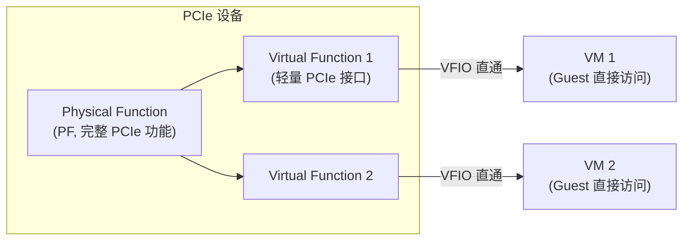

**SR-IOV (Single Root I/O Virtualization)**：物理网卡/GPU 暴露多个 PCIe 设备 (Physical Function + N 个 Virtual Function)，每个 VF 直接指派给不同容器/VM，绕过 Hypervisor 转发。一条 x16 PCIe 4.0 链路 (32 GB/s) 可承载多块 NVMe 或多组 VF 带宽。

Kubernetes 中 SR-IOV Device Plugin 就是将 VF 注入 Pod 的典型实现。

#### NUMA 与总线拓扑

多路服务器中，每颗 CPU 通过 **UPI (Ultra Path Interconnect, Intel) / Infinity Fabric (AMD)** 互连，每颗 CPU 有属于自己的本地内存控制器和本地 PCIe Root Complex：

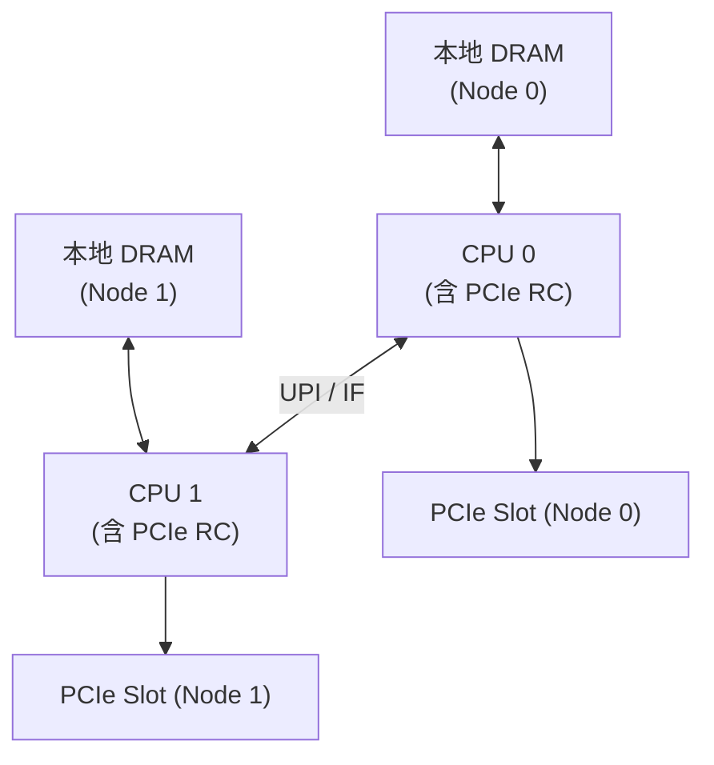

**NUMA-aware 内存访问**：容器/进程应尽量在本地 Node 分配内存和绑定 CPU，避免通过互联总线远程访存（Remote Access）。远程 DRAM 访问的延迟比本地高 50%-100%。`numactl --cpunodebind=0 --membind=0 ./app` 强制应用在 Node 0 上运行。

**NUMA-aware PCIe 直通**：将 PCIe 设备所属 Node 与容器绑定的 CPU Node 对齐，否则容器每次设备 DMA 都要跨 UPI 传输，有效带宽急剧下降。

```bash
# 查看 PCIe 设备的 NUMA node
cat /sys/bus/pci/devices/0000:01:00.0/numa_node

# 查看 CPU - NUMA 拓扑
lscpu | grep NUMA
numactl --hardware
```

#### DMA 的总线面

DMA 控制器作为另一种总线主设备，在 CPU 不参与的情况下直接在 I/O 设备与内存之间搬移数据。DMA 与 CPU 共享同一组内存总线——DMA 传输期间，若 CPU 需要访问同一内存控制器上的 DRAM，会产生竞争。这就是 **DMA 对 CPU 的带宽争抢**。

容器工作负载中，若 Pod 的 NVMe 设备在进行大量 DMA 写操作 (例如 Kafka 刷盘)，同一 NUMA Node 上的其他 Pod 可能观察到明显的内存延迟升高——原因是内存控制器正在服务大量 DMA 请求，CPU 的访存请求被排队。

---

### 本章与其他模块的链接

| 概念 | 相关章节 |
|------|---------|
| Cache Line 与 Burst 读取 | [[B_缓存层级]] 的 Cache Line 结构 |
| NUMA 内存分配策略 | [[../操作系统/F_内存管理\|内存管理]] 的 NUMA 章节 |
| I/O 方式 (PIO vs DMA) | [[../操作系统/J_IO管理\|I/O 管理]] |
| 中断总线的 I/O 通知路径 | [[C_CPU架构]] 的中断处理 |
| PCIe 与设备驱动模型 | [[../操作系统/J_IO管理\|I/O 管理]] 的设备管理 |
| 内存屏障与总线序 | [[E_指令集体系结构]] 的内存模型 |
