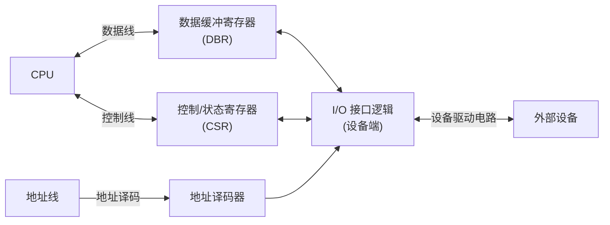
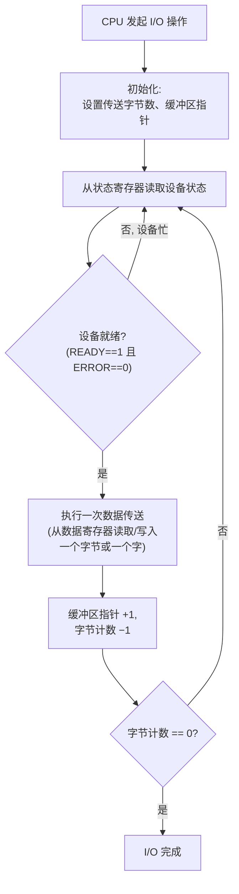
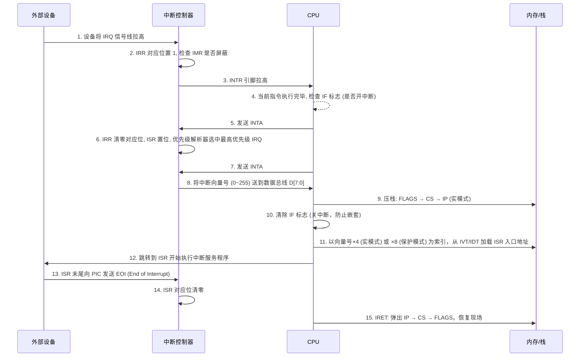
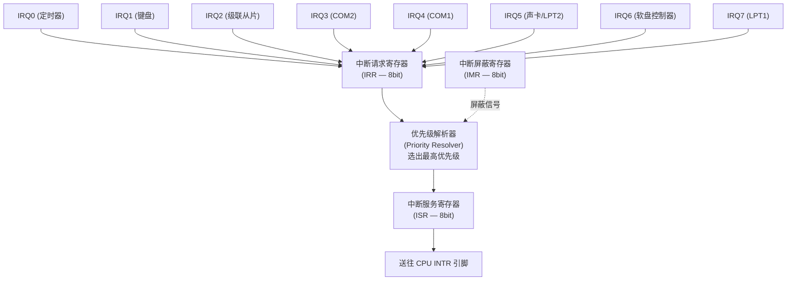
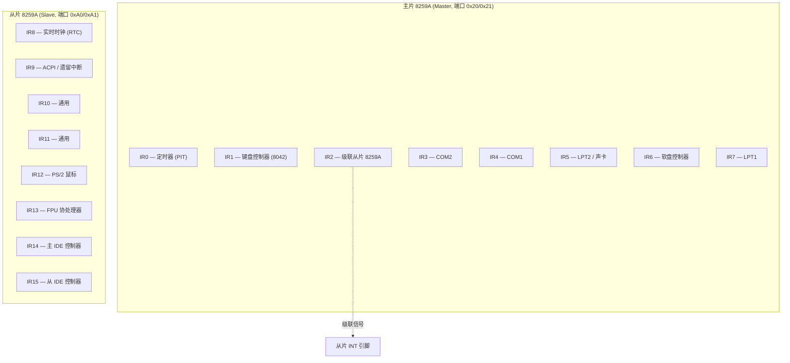
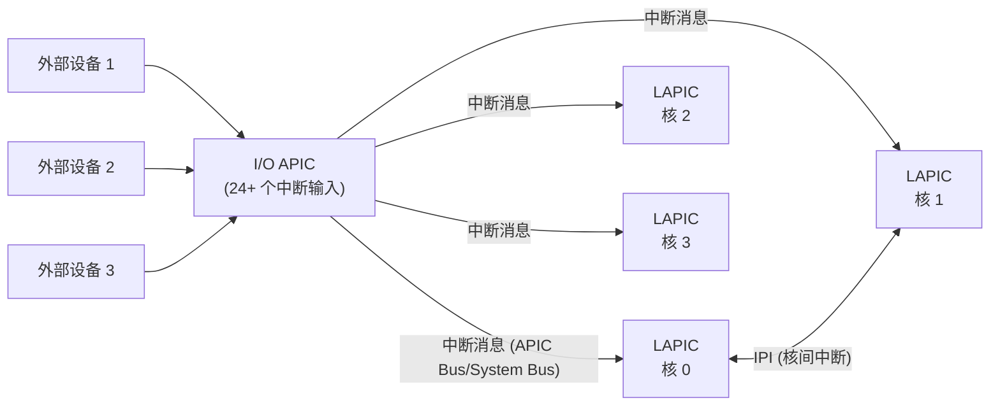
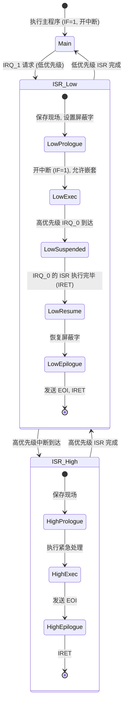
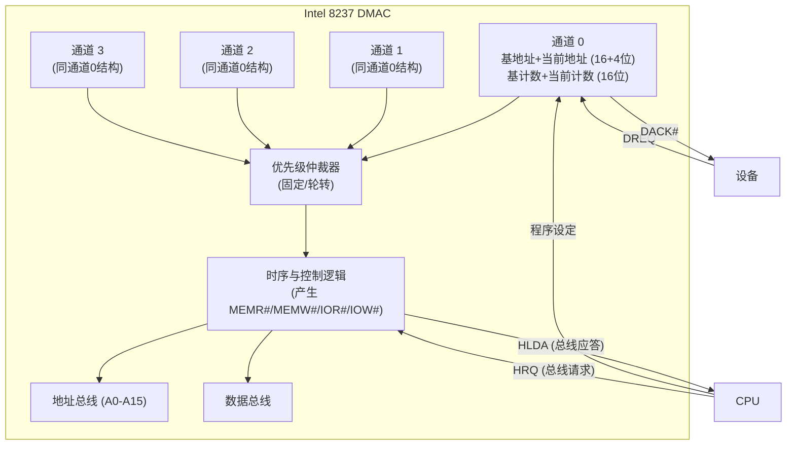
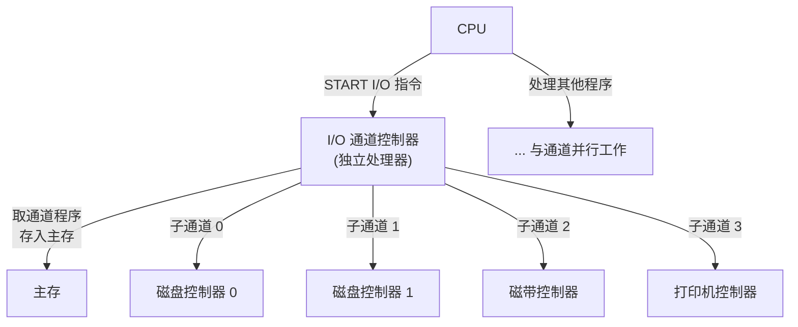

## G — 输入输出系统

输入输出系统是计算机与外部设备交互的硬件框架。本章从硬件视角讨论 I/O 子系统，软件层面的 I/O 管理与系统调用见操作系统对应章节。

### I/O 接口的基本结构

I/O 接口是 CPU 与外部设备之间的桥接电路，完成数据缓冲、格式转换、地址译码等功能：



I/O 接口内部的核心寄存器：

| 寄存器 | 方向 | 作用 |
|--------|------|------|
| 数据缓冲寄存器 (DBR) | 双向 | 暂存 CPU 与设备间传输的数据 |
| 控制寄存器 (CR) | CPU → 接口 | 写入命令字，控制设备操作模式 |
| 状态寄存器 (SR) | 接口 → CPU | 反映设备当前状态 (BUSY / READY / ERROR / INTR) |
| 设备地址识别逻辑 | - | 判断地址总线上的地址是否选中本设备 |

### I/O 端口的两种寻址方式

CPU 寻址 I/O 设备存在两种基本方式：

#### 独立编址 — Port-Mapped I/O (PMIO)

I/O 端口拥有与内存完全独立的地址空间，使用专用的 I/O 指令访问：

| 特性 | 描述 |
|------|------|
| 地址空间 | x86: 16 位端口地址 (0x0000 ~ 0xFFFF)，共 65536 个端口 |
| 专用指令 | `IN` (读端口), `OUT` (写端口), `INSB/INSW/INSD` (串读取) |
| 区分方式 | 硬件 M/IO# 引脚：为 0 表示 I/O 周期，为 1 表示内存周期 |
| 代表架构 | x86 (IA-32), Intel 8051 等嵌入式 MCU |

```
IN AL, 0x60 ; 从端口 0x60 读取一个字节到 AL
OUT 0x64, AL ; 将 AL 写入端口 0x64
IN AX, DX ; 以 DX 中的值作为端口地址，读取一个字
```

#### 统一编址 — Memory-Mapped I/O (MMIO)

将 I/O 控制器内的寄存器映射到物理地址空间的某段区域，CPU 使用标准访存指令访问：

| 特性 | 描述 |
|------|------|
| 地址空间 | 与内存合一，I/O 寄存器占用物理地址的某个区段 |
| 指令 | `MOV / LDR / STR / LW / SW` 等通用访存指令 |
| 区分方式 | 地址值本身区分是内存还是 I/O，需 MMU 对 I/O 区域做特殊配置 (禁用缓存) |
| 代表架构 | ARM, RISC-V, MIPS, PowerPC |

```
; ARM: UART 数据寄存器映射在 0x40000000
LDR R0, =0x40000000 ; 加载 I/O 寄存器映射地址
STR R1, [R0] ; 向 UART 发送一字节
LDR R2, [R0] ; 从 UART 读取一字节
```

#### PMIO vs MMIO 对比

| | PMIO (独立编址) | MMIO (统一编址) |
|------|---------|---------|
| 地址空间 | 独立，不占内存空间 | 占用内存物理地址空间 |
| 指令 | 需专用 I/O 指令 | 通用访存指令 |
| 存储器保护 | 无/有限 | 可复用 MMU 的页表权限控制 |
| 性能 | 指令少，译码简单 | 可利用缓存 (若允许) 和预取 |
| 编程模型复杂度 | 需区分 IN/OUT 与 MOV | 统一，简洁 |

### 程序查询方式 (轮询)

程序查询是最基本的 I/O 控制方式：CPU 反复读取设备状态寄存器，直到设备就绪再执行数据传送。



典型查询代码 (x86 从 IDE 磁盘读数据)：

```
wait_drq: IN AL, 0x1F7 ; 读取磁盘状态寄存器
 TEST AL, 0x08 ; 测试 DRQ 位 (数据请求)
 JZ wait_drq ; 设备未就绪 → 循环等待
 IN AX, 0x1F0 ; 从数据寄存器读取一个字

wait_ready: IN AL, 0x1F7
 TEST AL, 0x80 ; 测试 BSY 位
 JNZ wait_ready ; 设备忙 → 等待空闲
```

| 特征 | 描述 |
|------|------|
| CPU 占用率 | 100% — CPU 全程参与每字节搬运，无法执行其他任务 |
| 传送速率 | 极低 — 受限于 CPU 执行查询循环的速度 (典型 <10 KB/s) |
| 硬件复杂度 | 最低 — 仅需地址译码器和数据缓冲器 |
| 并行性 | 无 — CPU 与设备串行工作 |
| 适用场景 | 极低速设备、嵌入式系统中实时性无要求的场合、调试阶段 |

### 中断系统 (Interrupt System)

中断是硬件通知 CPU "有事需要处理" 的异步机制，使 CPU 不必轮询等待，可以在设备就绪时才切换处理。

#### 中断处理的完整时序



#### 8259A 可编程中断控制器 (PIC)

8259A 管理 8 条中断请求线 (IRQ0 ~ IRQ7)，内部结构如下：



三个 8 位寄存器：
- **IRR** (Interrupt Request Register)：记录正在请求中断的位
- **IMR** (Interrupt Mask Register)：某位为 1 则屏蔽对应 IRQ
- **ISR** (In-Service Register)：记录 CPU 正在服务的中断

8259A 支持的操作模式：

| 模式 | 行为 |
|------|------|
| 全嵌套 (Fully Nested) | IR0 > IR1 > ... > IR7 固定优先级，高优先级可打断低优先级 |
| 自动轮转 (Automatic Rotation) | 刚被服务完的 IRQ 降为最低优先级，轮流公平响应 |
| 特殊全嵌套 (Special Fully Nested) | 用于主片级联从片时，主片允许相同从片内的更高优先级 IRQ 打断当前 IRQ |
| 特定屏蔽 (Special Mask) | 允许相同级别中断打断当前中断 |

#### 8259A 级联架构

一片 8259A 提供 8 个 IRQ。级联两片 (主片 IR2 连接从片的 INT 引脚) 可支持 15 个中断源：



#### 高级可编程中断控制器 (APIC)

现代多核 x86 系统使用 APIC 替代 8259A 级联：

| 组件 | 位置 | 功能 |
|------|------|------|
| LAPIC (Local APIC) | 每个 CPU 核内部 | 接收 I/O APIC 转发的中断；产生处理器间中断 (IPI)；管理本地定时器 |
| I/O APIC | 主板芯片组 | 接收外部设备中断请求，以消息形式分发到各 LAPIC |



APIC 相比 8259A 的优势：
- 支持超过 24 个中断源 (I/O APIC 有 24 个专用输入引脚)
- 中断可被重定向到任意 CPU 核心 (IRQ affinity / 中断亲和性)
- 支持处理器间中断 (IPI) — 用于 TLB shootdown、进程重调度等
- 中断优先级可编程，无需级联

#### 中断嵌套的状态转移

当 CPU 执行低优先级 ISR 时，高优先级中断到达的处理流程：



中断嵌套的要点：
- 同级或更低优先级的中断在 ISR 执行期间被自动屏蔽 (8259A 的 ISR 使能)
- 高优先级中断可以抢占低优先级中断 (全嵌套模式下默认行为)
- 嵌套深度受限于栈空间，滥用嵌套可能导致栈溢出 (double fault)

### 中断向量表结构

| 模式 | 表名 | 位置 | 条目数 | 条目大小 | 索引方式 |
|------|------|------|:---:|:---:|------|
| 实模式 (8086) | IVT (Interrupt Vector Table) | 物理地址 0x00000 | 256 | 4 字节 (CS:IP) | 向量号 × 4 |
| 保护模式 (IA-32) | IDT (Interrupt Descriptor Table) | IDTR 寄存器指向任意物理地址 | 256 | 8 字节 (门描述符) | 向量号 × 8 |

IDT 的门描述符类型：

| 门类型 | 触发来源 | DPL 检查 | 典型用途 |
|------|------|:---:|------|
| 中断门 (Interrupt Gate) | 硬件中断 (INTR) | 是 | 外部设备 ISR |
| 陷阱门 (Trap Gate) | `INT n` 指令 / 异常 | 是 | 系统调用 (INT 0x80), 断点 (INT 3) |
| 任务门 (Task Gate) | 硬件任务切换 | 是 | 硬件任务切换 (现代 OS 很少使用) |

#### 中断 vs 异常 vs 陷阱 (从硬件视角)

| 类别 | 来源 | 同步/异步 | 可屏蔽 | 发生时机 | 示例 |
|------|------|:---:|:---:|------|------|
| 硬件中断 | 外部设备 (IRQ) | 异步 | 可 (通过 IF/IMR) | 任意时刻，指令边界 | 键盘、网卡、定时器 |
| 异常 (Fault) | CPU 执行指令出错 | 同步 | 否 | 指令执行中 | #DE 除法错误, #PF 缺页, #GP 通用保护 |
| 陷阱 (Trap) | 软件主动触发 | 同步 | 否 | 紧跟指令之后 | `INT n`, `INT 3`, `INTO` |
| 中止 (Abort) | 硬件严重错误 | 异步 | 否 | 无法预知 | 双错 (double fault), 机器检查 (machine check) |

异常与中断的关键区别：异常是同步的 (与特定指令绑定)，中断是异步的 (与当前执行的指令流无直接关系)。Fault 类型的异常在出错的指令重复执行前被修复 (如缺页中断使 OS 加载页面后重新执行该指令)，Trap 类型的异常在执行完指令后触发。

### DMA 控制器 (Direct Memory Access)

DMA 使高速设备可以直接与主存交换数据，CPU 仅在传送开始和结束时参与，数据搬移过程由 DMA 控制器独立完成。

#### Intel 8237 DMA 控制器架构

8237 提供 4 个独立通道，每个通道可独立编程：



每个通道的核心寄存器：

| 寄存器 | 位宽 | 作用 |
|------|:---:|------|
| 基地址寄存器 | 16 + 4 页位 | 存放传送起始地址 |
| 当前地址寄存器 | 16 + 4 页位 | 传送过程中递增/递减，反映当前地址 |
| 基字节计数寄存器 | 16 | 存放欲传送的总字节数 |
| 当前字节计数寄存器 | 16 | 传送过程中递减，到 0 时触发 EOP# |
| 模式寄存器 (每个通道) | 8 | 指定读/写/校验/块/请求/单字节/级联 |

#### DMA Fly-By 传送时序

DMA 的单周期飞越传送是最快模式，在同一个总线周期内同时激活 I/O 和存储器控制信号，数据在设备和内存之间直接传输而不经过 DMAC 内部缓存：

```
DMA 读周期 (设备 → 内存), 每个周期:
 T1: DMAC 将 20 位地址送上地址总线, DACK# 有效
 T2: DMAC 同时激活 IOR# 和 MEMW# → 设备数据直接流入内存地址
 T3: 延长等待周期 (若设备需要)
 T4: 撤消控制信号, 地址 ±1, 字节计数 −1
 → 计数 != 0: 回到 T1 (继续下一字节)
 → 计数 == 0: 激活 EOP#, 释放总线
```

DMA 写周期 (内存 → 设备)：激活 MEMR# 和 IOW#，数据从内存直接流向设备。

8237 DMA 的三种操作模式：

| 模式 | 行为 | 适用场景 |
|------|------|---------|
| 块模式 (Block) | DREQ 有效后，DMAC 独占总线直到整块传送完成 | 高速设备，对延迟不敏感 |
| 请求模式 (Demand) | DREQ 有效时连续传送，DREQ 无效时暂停但不释放总线 | 实时性敏感的设备 |
| 单字节模式 (Single) | 每传送一字节释放一次总线，下次需重新判优 | 低速设备，与 CPU 交替使用总线 |

#### DMA 校验与验证周期

| 周期类型 | 操作 | 控制信号 | 目的 |
|------|------|------|------|
| 读传送 | I/O → 内存 | IOR# + MEMW# | 从设备读取数据到内存 |
| 写传送 | 内存 → I/O | MEMR# + IOW# | 将内存数据写入设备 |
| 校验 (Verify) | 伪传送，地址计数正常但无 IOR#/IOW# | 仅地址递增 | 验证地址生成逻辑和计数逻辑 |

### I/O 通道控制器 / IOP

I/O 通道是一种拥有独立指令系统的专用 I/O 处理器 (IOP)，可以执行存放在主存中的通道程序，CPU 仅需发出一条 "START I/O" 指令即可将整个 I/O 任务交给通道。

#### 通道类型

| 类型 | 缩写 | 特点 | 适用 |
|------|:---:|------|------|
| 字节多路通道 | Byte Multiplexor | 多个子通道，以字节为单位时间片交替服务 | 大量低速设备：终端、行打印机 |
| 数组选择通道 | Block Selector | 单子通道，独占通道传输成块数据 | 单一高速设备：磁带机、磁盘 |
| 数组多路通道 | Block Multiplexor | 多子通道，以块为单位交替服务 | 多台高速设备并行：磁盘阵列 |



#### 通道命令字 (CCW, IBM System/360 风格)

通道程序由一系列 CCW 组成。每个 CCW 通常为 8 字节：

| 字段 | 位宽 | 含义 |
|------|:---:|------|
| 命令码 (Command Code) | 8 | 操作类型：读/写/反读/控制/断定/通道转移 |
| 数据地址 (Data Address) | 24 | 数据在主存中的缓冲区起始地址 |
| 标志位 (Flags) | 8 | CD (链式数据) / CC (链式命令) / SLI (忽略长度错) / SKIP (跳过) / PCI (程序控制中断) |
| 字节计数 (Byte Count) | 16 | 此条 CCW 传送的字节数 |

**CD (Chain Data)**：本条 CCW 的数据地址和字节计数使用完毕后，自动提取下一条 CCW 的数据地址和计数，但使用本条的命令码继续执行。用于分散/聚集 I/O (scatter/gather)。

**CC (Chain Command)**：本条 CCW 执行完毕后，取下一条 CCW 作为新的命令继续执行。

通道程序示例 (读取一个磁盘扇区，分为两个缓冲区)：

```
CCW1: SEEK 命令码=0x07, 数据地址=搜索参数块地址, 计数=6, CC=1, CD=0
CCW2: SEARCH 命令码=0x31, 数据地址=ID 参数块地址, 计数=5, CC=1, CD=0
CCW3: TIC 命令码=0x08, 数据地址=CCW1 地址 , 计数=0, CC=1 (通道转移)
CCW4: READ 命令码=0x06, 数据地址=缓冲区A 地址 , 计数=256, CC=0, CD=1
CCW5: READ 命令码=0x06, 数据地址=缓冲区B 地址 , 计数=256, CC=0, CD=0
```

CPU 发出 `SIOF` (Start I/O Fast) 指向 CCW1 → 通道找到正确扇区后 → 在 CCW4/CCW5 处把 512 字节扇区分别读到两个 256 字节缓冲区中。

#### 通道状态字 (CSW)

每次 I/O 操作完成后，通道将一个通道状态字 (CSW) 写入主存的固定位置，供 CPU 检查：

| 字段 | 含义 |
|------|------|
| 最后执行的 CCW 地址 | 用于断点续传或错误定位 |
| 残余字节计数 | 还有多少字节未传送 |
| 状态字节 | 通道结束 / 设备结束 / 设备忙 / 出错信息 |
| 接口状态 | 设备特定的状态 (如 SCSI sense key) |

### I/O 控制方式综合对比

| | 程序查询 | 中断驱动 | DMA | 通道 / IOP |
|------|:------:|:------:|:---:|:------:|
| CPU 参与程度 | 全程逐字节搬移 | ISR 执行期间参与 | 仅启动配置和结束处理 | 仅发出 START I/O |
| 传送速率 | <10 KB/s | <100 KB/s | 1 ~ 50 MB/s | >100 MB/s (多设备并行) |
| 最小传送单位 | 字节/字 | 字节/字 | 块 (多字节，一次编程) | 通道程序 (多块，独立执行) |
| 硬件复杂度 | 极低 | 中 (需中断控制器) | 高 (需 DMAC 及总线仲裁) | 极高 (独立处理器 + 子通道) |
| 并行性 (CPU vs I/O) | 无 | ISR 期间 CPU 暂停主程序 | DMA 期间 CPU 可执行程序 | 完全并行 |
| 排序/批量传送 | CPU 软件排序 | CPU 软件排序 | DMAC 硬件链表 (scatter-gather) | 通道程序自描述 |
| 典型系统 | 简单嵌入式 | 小型计算机 | PC/工作站 | 大型机 (IBM z/Architecture) |

### 本章与其他模块的链接

- 操作系统层面的 I/O 软件层次 (驱动/缓冲/SPOOLing) → [[../操作系统/J_IO管理|I/O 管理]]
- 总线仲裁与 I/O 设备挂载到系统总线 → [[F_总线系统]]
- 中断处理中的上下文切换在流水线中的实现 → [[C_CPU架构]]
- DMA 缓冲区与虚拟内存页的 pinning 机制 → [[../操作系统/F_内存管理|内存管理]]
