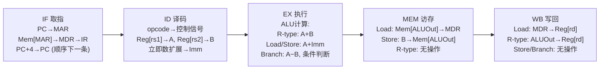
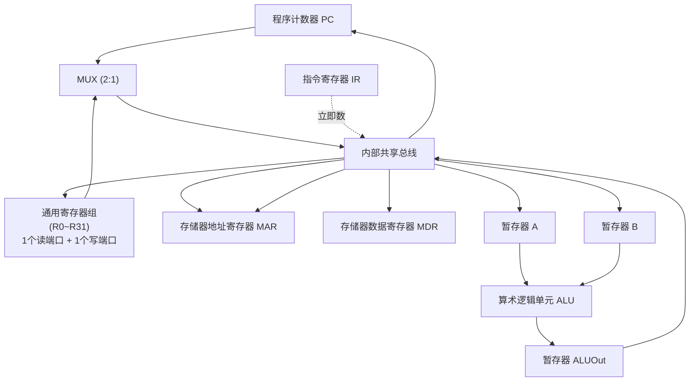
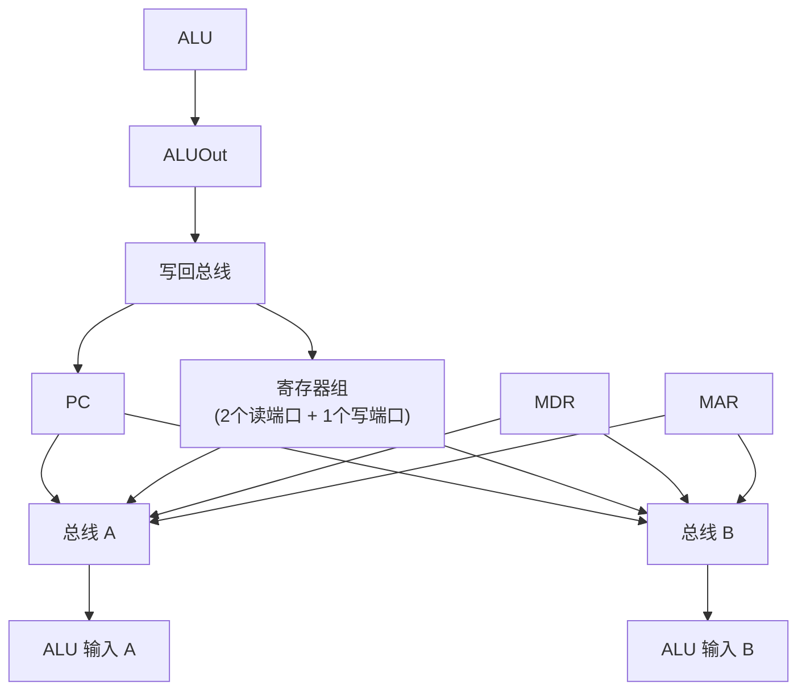
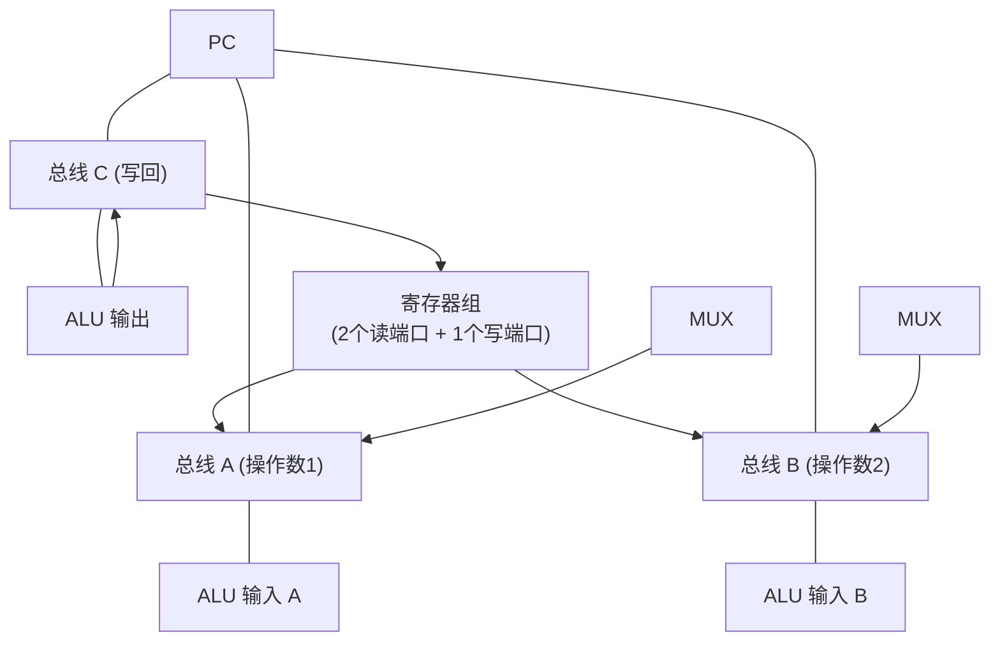
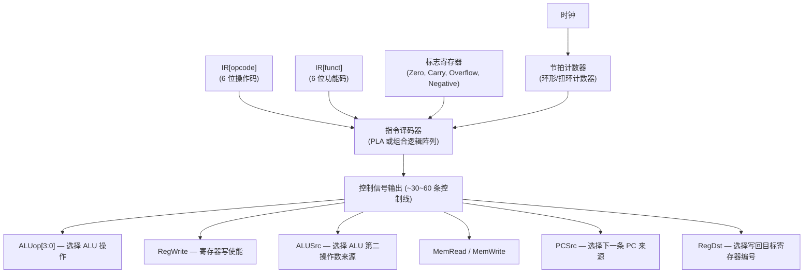
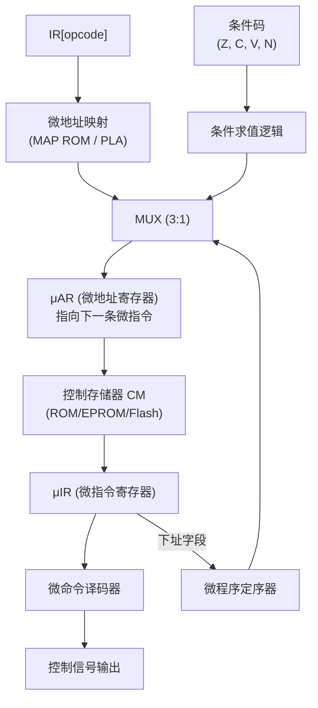

## H — CPU 数据通路与控制器

数据通路 (Datapath) 是 CPU 内部执行部件 (寄存器、ALU、总线、多路选择器) 的互连网络，控制单元 (Control Unit) 负责在每个时钟周期产生控制信号驱动数据通路的操作。两者合作完成指令的完整执行。

### 指令执行周期分解 (5 阶段)

一条典型指令的执行可拆分为五个阶段。以下是对 `LD R1, offset(R2)` (访存) 和 `ADD R1, R2, R3` (算术) 两个代表性指令的逐阶段分析：



各阶段的寄存器转移与数据流动：

| 阶段 | LD R1, offset(R2) | ST R1, offset(R2) | ADD R1, R2, R3 | BEQ R1, R2, target |
|------|------|------|------|------|
| IF | PC→MAR, Mem→MDR→IR, PC+4→PC | 同左 | 同左 | 同左 |
| ID | Reg[R2]→A, Imm→B | Reg[R2]→A, Imm→B, Reg[R1]→temp | Reg[R2]→A, Reg[R3]→B | Reg[R1]→A, Reg[R2]→B, target→Imm |
| EX | A + Imm → ALUOut | A + Imm → ALUOut | A + B → ALUOut | A − B → zero detect; if zero: PC←PC+Imm×4 |
| MEM | Mem[ALUOut] → DR | temp(Reg[R1]) → Mem[ALUOut] | (空转) | (空转) |
| WB | DR → Reg[R1] | (无写回) | ALUOut → Reg[R1] | (无写回) |

### 数据通路的三种总线结构

#### 单总线数据通路

所有寄存器通过一条共享内部总线连接到 ALU：



完成一次 `ADD R1, R2, R3` 需要三个时钟节拍：

```
T1: 总线 ← Reg[R2]; A ← 总线          (取第一个操作数)
T2: 总线 ← Reg[R3]; B ← 总线          (取第二个操作数)
T3: ALUOut ← A + B; 总线 ← ALUOut;    (执行并写回)
    Reg[R1] ← 总线
```

优势：控制信号最少，硬件成本最低；劣势：每条 R-type 指令至少 3 个周期，速度慢。适合早期 8 位微处理器。

#### 双总线数据通路

引入两条内部总线 (Bus_A 和 Bus_B)，可同时读取两个操作数：



```
ADD R1, R2, R3 (双总线, 2 个节拍):
T1: 总线 A ← Reg[R2]; 总线 B ← Reg[R3]     (同时读取两操作数)
T2: ALUOut ← A + B; Reg[R1] ← ALUOut        (执行+写回合并为一个节拍)
```

相比单总线减少一个节拍。寄存器组需要两个读端口。

#### 三总线数据通路

三条独立总线 (A 口读, B 口读, C 口写)，支持单周期完成 R-type 指令：



```
ADD R1, R2, R3 (三总线, 1 个节拍):
    Reg[R2] → 总线 A → ALU 输入
    Reg[R3] → 总线 B → ALU 输入
    ALU(A+B) → 总线 C → Reg[R1] ← 同时完成
```

要求 ALU 组合逻辑延迟在单周期内完成 (约 1~2ns 量级)，适合高性能处理器。

#### 三种数据通路对比

| | 单总线 | 双总线 | 三总线 |
|------|:---:|:---:|:---:|
| R-type 指令节拍数 | 3 | 2 | 1 |
| 寄存器读端口数 | 1 | 2 | 2 |
| 寄存器写端口数 | 1 | 1 | 1 |
| 额外暂存器 | A, B (各 1 个) | 无 (总线直达 ALU) | 无 |
| 硬件成本 | 最低 | 中 | 高 |
| 典型代表 | 早期 8 位 CPU (8085, 6502) | 中端 RISC (ARM7TDMI) | 高端超标量 (ARM Cortex-A) |

### 控制单元设计

#### 硬连线控制 (Hardwired Control)

直接用组合逻辑门 + 状态机在每周期产生控制信号：



一节拍的控制信号组合示例 (R-type 的 EX 阶段)：

| 控制信号 | 值 | 含义 |
|------|:---:|------|
| ALUSrcA | 0 | ALU 第一操作数来自寄存器读端口 |
| ALUSrcB | 0 | ALU 第二操作数来自寄存器读端口 (非立即数) |
| ALUop | 0010 | 执行加法操作 |
| RegDst | 1 | 目标寄存器编号来自 rd 字段 |

硬连线控制的特点：速度快 (信号经 PLA 门延迟后直接输出)、不可修改 (如需新增指令需重新设计电路)。适合 RISC 架构的固定指令集。

#### 微程序控制 (Micro-programmed Control)

将每个周期的控制信号序列化为一组微指令，存放在控制存储器 (Control Memory) 中：



微指令格式 (水平型微指令 — 每个控制位独立控制一个数据通路元素)：

| 字段 | 位宽 | 含义 |
|------|:---:|------|
| μop 控制字段 | ~40~70 bit | 每个 bit 直接对应一条控制信号线 (水平编码) |
| 下一微地址 (Next μAddr) | 8~10 bit | 顺序执行时 μAR+1，转移时加载此值 |
| 条件选择 (CondSel) | 2~3 bit | 选择影响下址的条件：无条件 / Zero / Carry / Overflow / 外部标记 |
| 立即数字段 | 8~16 bit | 微指令携带的常量 |

#### 微程序执行路径：ADD R1, R2, R3

| 微地址 | 阶段 | μop 操作 (伪代码) | 下一地址 | 条件 |
|:---:|:--:|------|:---:|----|
| 0x00 | IF1 | MAR ← PC, MemRead | 0x01 | 无条件 |
| 0x01 | IF2 | MDR ← Mem[MAR], PC ← PC+4 | 0x02 | 无条件 |
| 0x02 | IF3 | IR ← MDR | MAP[op] | 无条件 (跳转 ADD 微程序入口) |
| 0x10 | ID1 | A ← Reg[rs1] | 0x11 | 无条件 |
| 0x11 | EX1 | B ← Reg[rs2]; ALUOut ← A + B | 0x12 | 无条件 |
| 0x12 | WB1 | Reg[rd] ← ALUOut | 0x00 | 无条件 (取下一条指令) |

微程序控制的特点：规律性强、易于修改和调试 (修改 CM 内容即可)、速度慢 (每执行一条微指令需要一个周期，完成一条宏指令需要多个周期)。CISC 处理器 (x86) 使用微程序实现复杂指令。

#### 硬连线 vs 微程序 对比

| | 硬连线控制 | 微程序控制 |
|------|---------|----------|
| 实现方式 | 组合逻辑门 (PLA/门阵列) | 控制存储器 (ROM) + 微定序器 |
| 速度 | 极快 (1 周期完成控制信号生成) | 慢 (每个微指令 1 周期) |
| 灵活性 | 低 (修改需重新流片) | 高 (修改 CM 即可，固件升级) |
| 设计复杂度 | 高 (不规则) | 低 (规整的存储器结构) |
| 调试难度 | 高 | 低 (微指令可单步) |
| 占用面积 | 小 (逻辑门) | 大 (需要 CM 阵列) |
| 代表 | ARM Cortex-M, RISC-V Rocket | x86 微码引擎, IBM z/Architecture |

现代 x86 的混合策略：译码器将复杂 x86 指令译码为 1~4 条 RISC 风格的微操作 (μops)，存储在 μop 缓存中；μops 通过硬连线流水线执行。对于最复杂的指令 (如 `CPUID`, `IRET`, 字符串指令 `REP MOVSB`)，微码定序器 (MS-ROM) 分派 μop 序列。这是硬连线速度与微程序灵活性的折中。

### 单周期数据通路 vs 多周期数据通路 vs 流水线

| | 单周期 | 多周期 | 流水线 |
|------|:---:|:---:|:---:|
| 周期长度 | 取最长指令 (如 Load) 的延迟 | 每阶段一个周期，周期短 | 同多周期，周期更短 |
| CPI | 1.0 | ~4~5 | ~1.0 (理想) |
| 时钟频率 | 低 (受 Load 路径限制) | 较高 | 高 (每级流水线逻辑短) |
| 硬件利用率 | 低 (ALU 只在少部分时间工作) | 中 | 高 (各级并行工作) |
| 设计复杂度 | 低 | 中 | 高 (冒险处理) |

### CPU 核心寄存器详表

| 寄存器 | 缩写 | x86-64 位宽 | 作用 |
|--------|:---:|:---------:|------|
| 程序计数器 / 指令指针 | PC / RIP | 64 | 保存下一条待执行指令的地址；分支/跳转/call/ret 会修改 |
| 指令寄存器 | IR | 可变 (1~15B) | 保存当前正在执行的指令编码；译码器的输入 |
| 存储器地址寄存器 | MAR | 64 (或 48 虚拟) | 将即将访问的主存地址送到地址总线 |
| 存储器数据寄存器 | MDR | 64 | 暂存从主存读出或将要写入主存的数据 |
| 通用寄存器组 | GPRs | 64 × 16 (x86-64) / × 31 (AArch64) | 存放操作数、地址、中间结果 |
| 标志/状态寄存器 | FLAGS / EFLAGS / RFLAGS | 64 | Z(零), C(进位), V/OF(溢出), N/SF(符号), IF(中断使能) |
| 基址/变址寄存器 | BX, SI, DI (x86) | 64 | 用于地址计算的专用寄存器 |
| 栈指针 | SP / RSP | 64 | 指向当前栈顶；push/pop/call/ret 隐式使用 |

x86-64 的 EFLAGS 有效位 (简列)：

| 位 | 名称 | 全称 | 含义 |
|:--:|------|------|------|
| 0 | CF | Carry Flag | 无符号运算进位/借位 |
| 2 | PF | Parity Flag | 低 8 位结果的奇偶性 |
| 6 | ZF | Zero Flag | 结果为零 |
| 7 | SF | Sign Flag | 结果的符号位 (最高位) |
| 10 | DF | Direction Flag | 串操作方向 (CLD/STD 控制) |
| 11 | OF | Overflow Flag | 补码运算溢出 |
| 9 | IF | Interrupt Flag | 中断使能 (STI/CLI 控制) |

### 指令跟踪示例：ADD R1, R2, R3 在各阶段的完整数据流动

以三总线数据通路跟踪 `ADD R1, R2, R3` (R[rd] ← R[rs1] + R[rs2])：

```
阶段 IF  (取指, 从指令缓存取 32-bit 指令字):
  MAR   ← PC              ; PC 值 → 地址总线
  MDR   ← I-Cache[PC]     ; 从指令缓存读取 32 位指令字 (假设命中)
  IR    ← MDR             ; 锁存到指令寄存器
  PC    ← PC + 4          ; 加法器提前计算 PC+4

阶段 ID  (译码, 读取寄存器):
  A     ← GPR[IR[rs1]]    ; 读寄存器 R2 → ALU 输入端口 A
  B     ← GPR[IR[rs2]]    ; 读寄存器 R3 → ALU 输入端口 B
  控制  ← Decode(IR[opcode:funct])  ; 确定 RegWrite=1, ALUop=ADD, RegDst=rd
  
阶段 EX  (执行, ALU 运算):
  ALUOut ← A + B          ; 组合逻辑: A + B, 同时生成标志 (Z, C, V, N)
  写回数据 ← ALUOut       ; 将结果放到写回总线

阶段 MEM (访存 — R-type 无操作):
  (nop — ALUOut 直接旁路到写回级)

阶段 WB  (写回, 更新寄存器):
  GPR[IR[rd]] ← ALUOut    ; 将结果写入 R1, 同时 RegWrite 信号有效
  → 此时 R1 的值已更新，下一条指令可立即通过 forwarding 读到
```

### 本章与其他模块的链接

- 数据通路插入流水线寄存器后形成的 5 级流水线 → [[I_流水线与指令流水]]
- CISC 微程序与 RISC 硬连线控制的设计哲学差异 → [[E_指令集体系结构]]
- ALU 的设计、运算类型与标志位生成 → [[J_运算方法与运算器]]
- 微架构在 CPU 整体视图中的位置 → [[C_CPU架构]]
