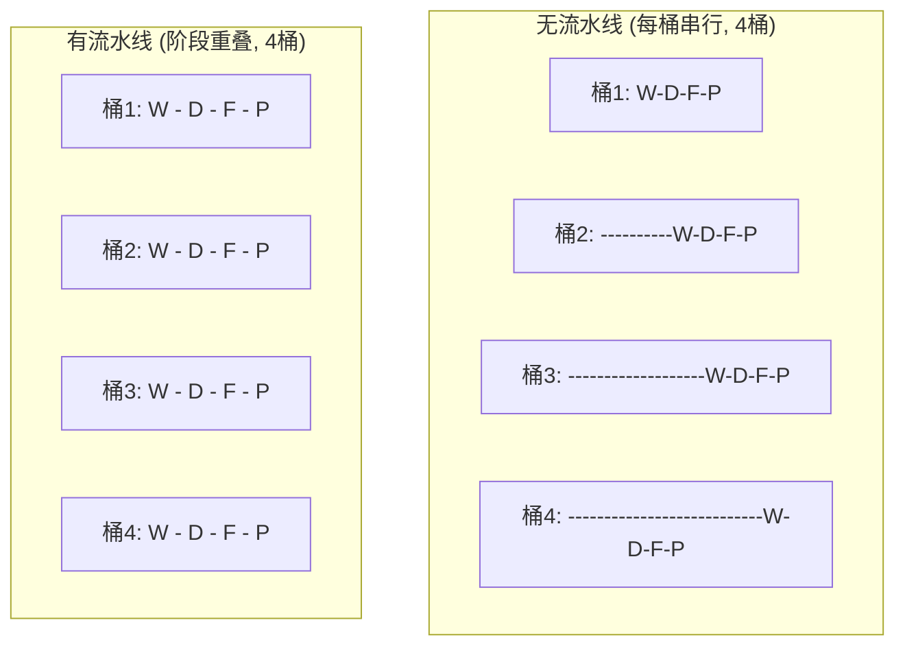
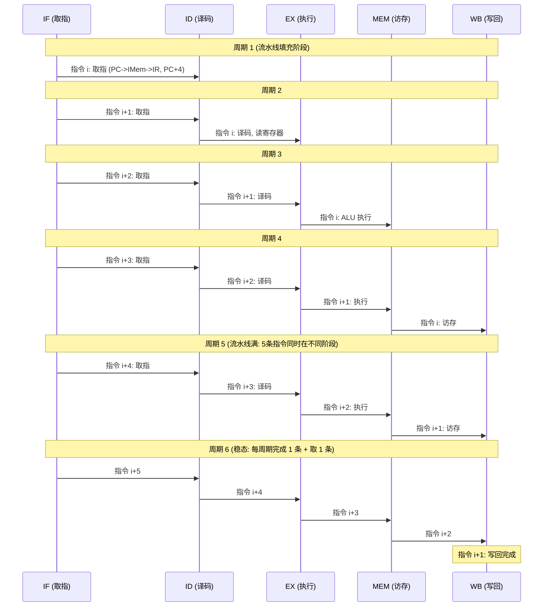
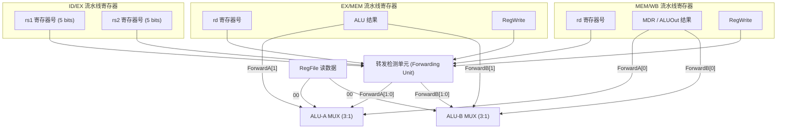
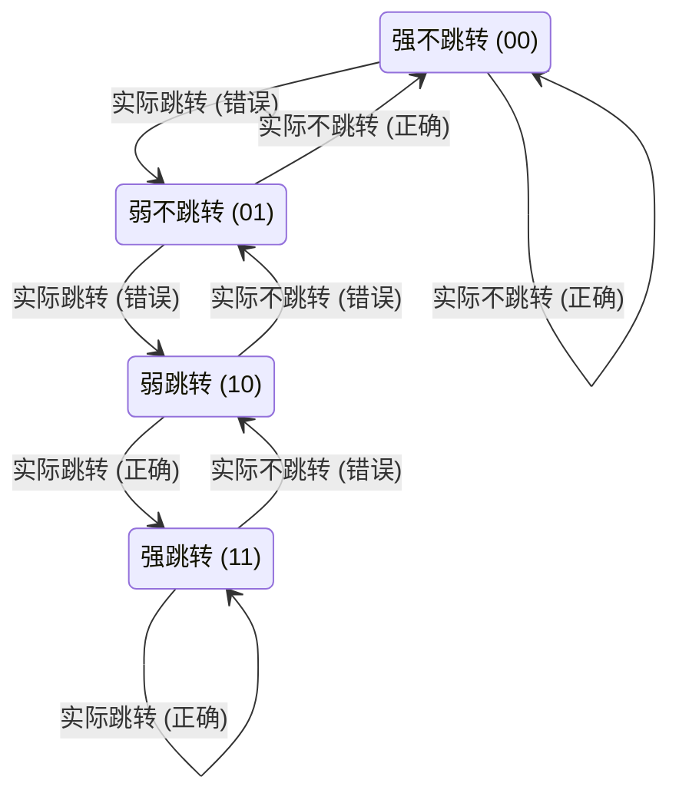
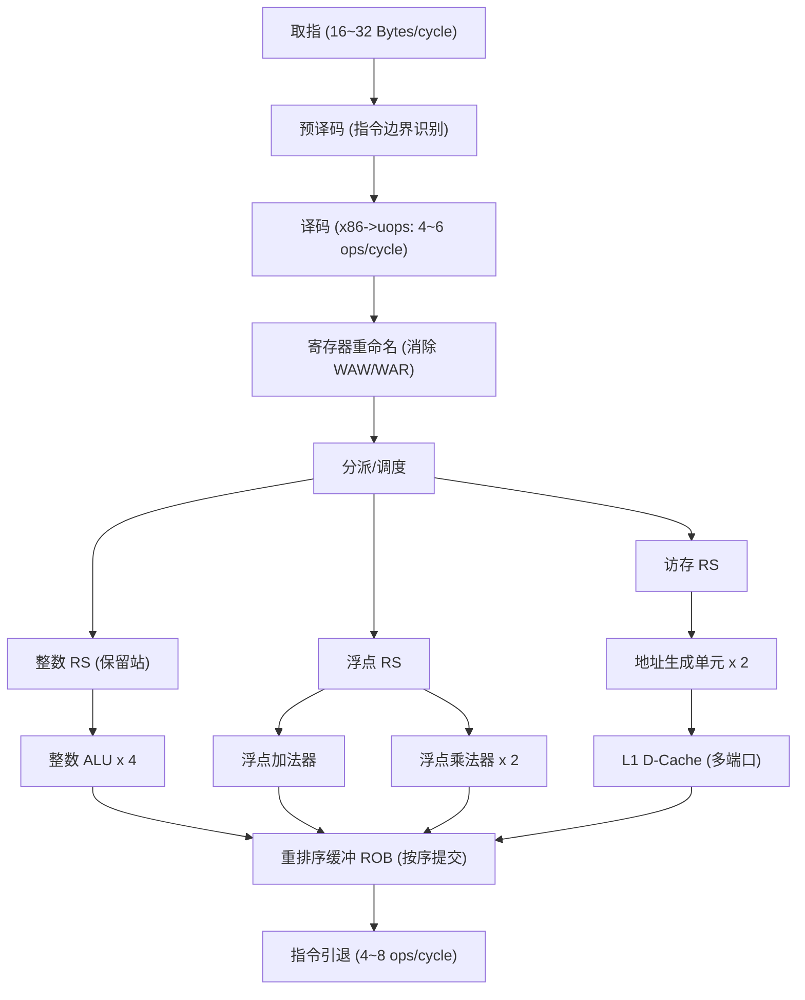
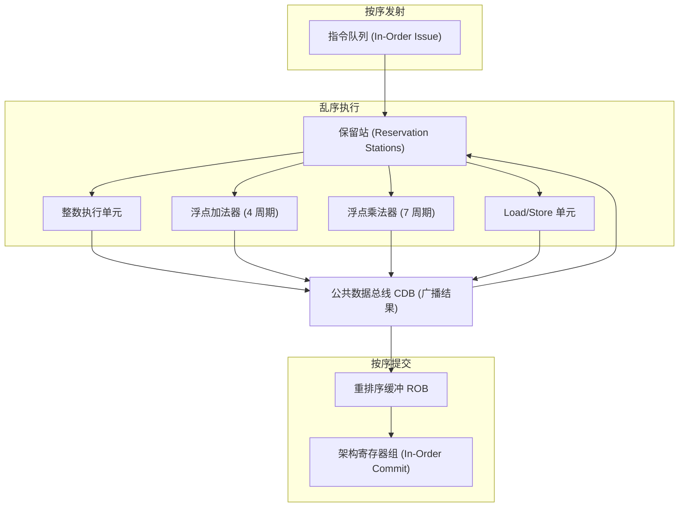

## I — 流水线与指令流水

流水线技术将一条指令的执行分解为多个子任务，各子任务在不同功能部件上重叠执行，使多个指令同时处于不同处理阶段，从而成倍提升 CPU 的吞吐率。

### 流水线基本概念：洗衣房类比

有 4 个独立步骤：洗衣机 (Wash, 30min) -> 烘干机 (Dry, 30min) -> 折叠 (Fold, 30min) -> 装箱 (Pack, 30min)，需要洗 4 桶衣服。

- 无流水线 (串行)：洗一桶完成后才洗下一桶。4 桶 x 120 min = 480 min。
- 有流水线 (重叠)：洗完桶 1 后立即投入桶 2 洗衣，同时桶 1 进入烘干。首桶 120 min 后，每 30 min 完成一桶。总时间 = 120 + 3 x 30 = 210 min。



流水线性能的核心量化参数：

| 参数 | 符号 | 公式 |
|------|:---:|------|
| 流水线级数 | k | 子任务的个数 (如 5 级流水线 k=5) |
| 指令 / 任务数量 | n | 执行的指令总数 |
| 无流水线总时间 | T_seq | n x k x T_clk |
| 流水线总时间 | T_pipe | (k + n - 1) x T_clk |
| 加速比 | S | T_seq / T_pipe = n x k / (k + n - 1) |
| 流水线效率 | E | n / (k + n - 1) |
| 理想 CPI | - | 1.0 (每周期完成一条指令) |
| 吞吐率 | TP | n / T_pipe = (1/T_clk) x n/(k+n-1) |

当 n 趋于无穷大时，加速比 S 趋于 k，效率 E 趋于 1。加速比受限于流水线深度。

计算示例：5 级流水线，n = 100，无停顿

```
T_seq = 100 x 5 = 500 周期
T_pipe = 5 + 100 - 1 = 104 周期
加速比 S = 500 / 104 = 4.81
效率 E = 100 / 104 = 96.2%
含 10 次 stall 的总时间 = 104 + 10 = 114, CPI = 114/100 = 1.14
```

### 五级经典 RISC 流水线 (IF / ID / EX / MEM / WB)



#### 流水线寄存器 (Pipeline Latches / Pipeline Registers)

每两个相邻阶段之间插入流水线寄存器，锁存本阶段的计算结果并传递到下一阶段：

| 流水线寄存器 | 位于 | 传递的关键数据 |
|:-----------|------|------|
| IF/ID | IF -> ID | PC+4, 32-bit 指令字 |
| ID/EX | ID -> EX | ALUop (4bit), Reg[rs1] (64bit), Reg[rs2], 符号扩展立即数, rd/rt 寄存器号, 派生的 WB/MEM 控制信号 |
| EX/MEM | EX -> MEM | ALUOut (64bit), Reg[rs2] (待存储数据), rd/rt, 控制信号 |
| MEM/WB | MEM -> WB | D-Cache 读出数据 (MDR), ALUOut, rd/rt, RegWrite 控制信号 |

流水线寄存器引入额外延迟 (setup time + hold time)，但换取了隔离和并行执行能力。

#### 各阶段的详细操作与功能单元

| 阶段 | 缩写 | 操作 | 功能单元 |
|:---:|------|------|------|
| IF | Instruction Fetch | PC -> I-Cache -> IR; PC <- PC+4 或分支预测目标 | I-Cache, PC 加法器, 分支预测器 |
| ID | Instruction Decode | 指令译码; Reg[rs1] -> A, Reg[rs2] -> B; 立即数符号扩展; 冒险检测; 寄存器转发比较 | 译码逻辑, 寄存器组 (2 读端口), 冒险检测单元 |
| EX | Execute | ALU 运算 (加减乘除 / 移位 / 逻辑), 地址计算 (Base+Offset), 条件码生成 | ALU, 转发多路选择器 |
| MEM | Memory Access | Load: D-Cache[ALUOut] -> MDR; Store: B -> D-Cache[ALUOut] | D-Cache, TLB, store buffer |
| WB | Write Back | Load: MDR -> Reg[rd]; R-type: ALUOut -> Reg[rd] | 寄存器组写端口 |

### 数据冒险 (Data Hazards)

当流水线中某条指令依赖前面某条尚未完成写回的指令的结果时，发生数据冒险。在顺序发射的 5 级流水线中，真正的问题只有 RAW (Read After Write)。

#### 三种数据依赖类型

| 缩写 | 含义 | 示例代码 | 顺序流水线中的发生条件 |
|:---:|------|------|------|
| RAW | Read After Write | I1: R1<-R2+R3; I2: R4<-R1+R5 | 真实数据依赖，必须处理，否则读旧值 |
| WAR | Write After Read | I1: R4<-R1+R2; I2: R1<-R3+R5 | 顺序流水线不出现 (先读后写按序); 乱序执行中出现 |
| WAW | Write After Write | I1: R1<-R2; I2: R1<-R3 | 顺序流水线不出现; 乱序执行中出现，需寄存器重命名 |

#### 转发 / 旁路 (Forwarding / Bypassing) 电路

不用等前一条指令写回寄存器后才读取，而是直接将流水线寄存器中的结果旁路到 ALU 输入端：



转发条件的逻辑 (对 rs1)：

```
if (EX/MEM.RegWrite && EX/MEM.rd != 0 && EX/MEM.rd == ID/EX.rs1)
 ForwardA = 10 // 选 EX/MEM 的结果 (最新)
else if (MEM/WB.RegWrite && MEM/WB.rd != 0 && MEM/WB.rd == ID/EX.rs1)
 ForwardA = 01 // 选 MEM/WB 的结果
else
 ForwardA = 00 // 选寄存器正常读出值
```

大多数 RAW 冒险都能通过转发在 0 周期额外开销下解决。

#### Load-Use 冒险：必须停顿 (Pipeline Stall / Bubble)

```
LD R1, 0(R2) ; R1 的值在 MEM 阶段才从 D-Cache 读出
ADD R3, R1, R4 ; R1 在 LD 的 MEM 之前 (EX 阶段) 就需要
```

即使转发也无法解决：因为 ADD 的 EX 阶段在 LD 的 MEM 阶段之前，LD 的数据尚未出现。必须由硬件插入一个气泡 (bubble)：

| 周期 | LD | ADD | 说明 |
|:---:|------|------|------|
| 1 | IF | | |
| 2 | ID | IF | |
| 3 | EX | ID | 冒险检测单元发现 Load-Use RAW |
| 4 | MEM | (stall) | 硬件插入 NOP: ID/EX 控制信号清零, PC 不更新 |
| 5 | WB | EX (转发 MEM/WB->ALU) | 转发解决 |
| 6 | | MEM | |
| 7 | | WB | |

这一周期停顿称为 Load 延迟槽惩罚 (Load Delay Slot Penalty)。现代编译器通过指令调度，将不依赖 Load 结果的独立指令插在 Load 和 Use 之间，以减少或消除停顿。

### 控制冒险与分支预测

条件分支指令在 EX 阶段才计算出是否跳转及跳转地址，而 IF 阶段在下一周期就需要知道取哪条指令。解决方案：预测 + 投机执行。

#### 静态分支预测策略

| 策略 | 规则 | 准确率 |
|------|------|:-----:|
| Predict Not Taken | 总是继续按 PC+4 取指 | ~50~60% |
| Predict Taken | 总是去目标地址取指 | ~40~50% |
| BTFN (Backward Taken, Forward Not Taken) | 向后 (循环) 预测跳转，向前 (if-else) 预测不跳转 | ~80% |

#### 动态分支预测：两位饱和计数器 (2-bit Saturating Counter)

每条分支指令 (按 PC 低位索引) 在分支历史表 (BHT) 中拥有一个 2 位状态机：



需要连续两次预测错误才改变预测方向，提供 "惯性"，避免在交替跳转/不跳转的模式下频繁翻转。典型循环 (`jmp back` -> 跳转 n-1 次，不跳转 1 次) 的预测准确率 = (n-1)/n，n 很大时趋近 100%。

#### 现代分支预测器的组成

| 组件 | 作用 |
|------|------|
| BHT (Branch History Table) | 2 位饱和计数器数组，按 PC 低位索引 |
| BTB (Branch Target Buffer) | 缓存最近分支的目标地址，避免跳转时重新计算 |
| RAS (Return Address Stack) | 硬件 LIFO 栈，专门预测 RET 返回地址 (call 时 push, ret 时 pop) |
| 全局分支历史 (GHR) | 记录最近 N 条分支的跳转历史 (如 64 位移位寄存器)，用于发现分支间关联 |
| 锦标赛/混合预测器 | 同时运行多个预测器，选择最近准确率更高的预测器输出 |

现代桌面 CPU 的分支预测准确率可达 95~99%。

#### 分支延迟槽 (Branch Delay Slot)

早期 MIPS 规定：分支指令的下一条指令 (延迟槽) 始终执行，不受分支结果影响。编译器负责将独立指令调度到延迟槽中：

```
; 未调度
 ADD R3, R4, R5
 BEQ R1, R2, target
 NOP // 浪费一个周期

; 调度后
 BEQ R1, R2, target
 ADD R3, R4, R5 // 无论跳转与否都执行
```

现代深流水线 (14+ 级) 已不使用延迟槽，因为误预测惩罚远超单条指令。依赖精确分支预测 + 投机执行。

#### 分支预测错误 (Mispredict) 的惩罚

分支预测错误时，必须 Flush 流水线中所有投机执行的指令：清空 IF, ID, EX 阶段的指令 -> 从正确路径重新取指。在 14 级流水线中约损失 10-20 个周期。

### 结构冒险 (Structural Hazards)

多条指令同时竞争同一硬件资源时发生：

| 冲突资源 | 发生条件 | 解决方案 |
|------|------|------|
| 单端口存储器 | IF 取指 与 MEM 访存 同时访问主存 | 哈佛架构：分离 I-Cache 和 D-Cache；或双端口 SRAM |
| 单端口寄存器组 | ID 读寄存器 与 WB 写寄存器冲突 | 时钟前半周写 + 后半周读；或提供独立读写端口 |
| 单 ALU | EX 地址计算 与 算术运算竞争 | 增加独立地址生成单元 (AGU) |
| 除法器 | 多周期除法器被多条指令同时请求 | 非流水化单元串行排队 |

### 超标量 (Superscalar)

超标量处理器每个周期可发射 (Issue) 和执行多条指令：



#### 静态多发射 (VLIW) vs 动态多发射 (超标量)

| | VLIW (静态多发射) | Superscalar (动态多发射) |
|------|---------|---------|
| 并行指令的确定 | 编译时 (编译器分析 ILP 并打包) | 运行时 (硬件动态调度) |
| 编译器负担 | 极高 (需做全程序依赖分析) | 低 (只需产生顺序代码流) |
| 硬件复杂度 | 低 (无保留站/ROB/重命名) | 高 (保留站, ROB, 重命名表, 调度器) |
| 指令编码 | 定长指令包 (IA-64: 128bit = 3 ops) | 单条指令, 硬件在运行时组合 |
| 二进制兼容性 | 差 (不同宽度 VLIW 不兼容) | 好 (同一 ISA 可在不同宽度 CPU 运行) |
| 代表架构 | Intel Itanium (IA-64), TI C6000 DSP | Intel Core, AMD Zen, ARM Cortex-A/X |

### 乱序执行与 Tomasulo 算法

Tomasulo 算法 (1966, IBM System/360 Model 91) 是硬件动态调度的基石，核心思想是将 "操作数的值" 而非 "寄存器的名称" 作为执行条件。



四步流程：

| 步 | 名称 | 操作 |
|:--:|------|------|
| 1 | Issue (发射) | 从 IQ 取指令 -> 分配到空闲保留站 -> 读已就绪的操作数 / 记录未就绪操作数的生产者保留站 ID (标签) |
| 2 | Execute (执行) | 当所有操作数就绪，且功能单元空闲 -> 保留站发射指令到功能单元 |
| 3 | Write Result (写结果) | 结果通过 CDB 广播 -> 所有监听该标签的保留站自动捕获值 |
| 4 | Commit (提交) | ROB 头部指令完成且无异常 -> 按程序顺序写入架构寄存器组 |

#### 寄存器重命名示例

```
; 原始代码 (存在 WAW 假依赖):
FADD.D F0, F2, F4 ; F0 <- F2+F4
FSUB.D F6, F8, F0 ; F6 <- F8-F0 (RAW, 真依赖)
FADD.D F0, F10, F12 ; F0 <- F10+F12 (WAW 假依赖: 与第一条写同一目标)

; 重命名后 (F0 被映射到不同的物理寄存器):
FADD.D T0, T2, T4 ; 第一次 F0 -> T0 (物理寄存器)
FSUB.D T6, T8, T0 ; F6 -> T6, 依赖 T0
FADD.D T1, T10, T12 ; 第二次 F0 -> T1 (不同的物理寄存器!)
 ; T1 与 T0 无任何依赖，T0 写完即可与 T6 并行执行
 ; 提交时：先 T0 提交为 F0，后 T1 覆盖 F0 (最终结果正确)
```

重命名消除了 WAW 和 WAR 假依赖，大幅提升了指令级并行度 (ILP)。

### 现代处理器流水线实例对比

| 特性 | Intel Skylake (2015) | ARM Cortex-A76 (2018) |
|------|-----------|-----------|
| 流水线深度 | 14-19 级 | 11 级 (整数) |
| 译码宽度 | 5 条 x86 -> uops / 周期 | 4 条 ARMv8 / 周期 |
| 发射宽度 / 保留站 | 8 uops, 97 entries (统一) | 4 uops, 128 entries (统一) |
| 重排序缓冲 | 224 entries | 128 entries |
| 执行端口 | 8 个 (整数 4 + 访存 2 + 浮点 2) | 6 个 |
| L1 指令缓存 | 32KB, 8 路组关联 | 64KB, 4 路组关联 |
| 分支预测器 | 混合预测器 (BHT + 间接目标预测) | TAGE + 感知器预测器 |

### 流水线冒险总结

| 冒险类型 | 子类 | 现象 | 解决方案 | 代价 |
|------|------|------|------|:--:|
| 数据冒险 | RAW (普通) | 后序指令读不到前序 ALU 结果 | 转发 (Forwarding/Bypassing) | 0 |
| 数据冒险 | RAW (Load-Use) | Load 的数据赶不上后续使用 | 1 周期流水线停顿 (stall) | 1 周期 |
| 数据冒险 | WAR / WAW | 乱序中的写后读/写后写假依赖 | 寄存器重命名 | 0 (硬件解决) |
| 控制冒险 | 条件分支 | 取指时不知道该不该跳 | 分支预测 + 投机执行 | 正确=0, 错误=10~20周期 |
| 控制冒险 | 间接跳转 / RET | 目标地址在运行时才计算 | BTB / RAS | 同分支 |
| 结构冒险 | 硬件冲突 | IF 取指与 MEM 访存争抢同一端口 | 分离缓存 / 多端口 SRAM | 0 (架构层面解决) |
| 结构冒险 | 除法器冲突 | 多周期除法器被多次请求 | 非流水化执行单元串行排队 | 等待周期 |

### 本章与其他模块的链接

- 数据通路插入流水线寄存器后形成的 5 级流水线 -> [[H_CPU数据通路与控制器]]
- 指令集设计对流水线的约束 (延迟槽, 寻址模式) -> [[E_指令集体系结构]]
- 分支预测对容器遍历性能的影响 -> [[C_CPU架构]]
- 乱序执行如何隐藏缓存缺失延迟 -> [[B_缓存层级]]
