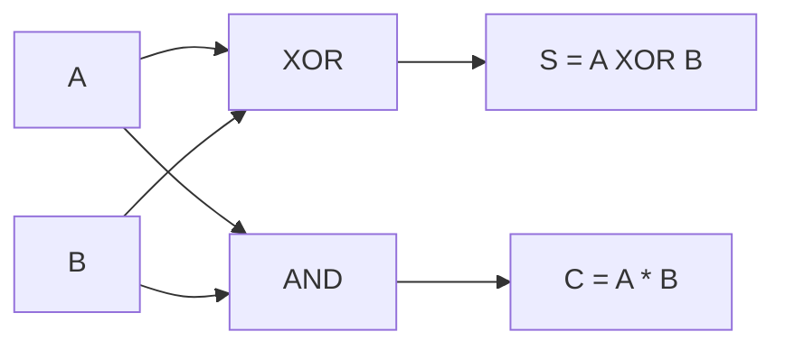
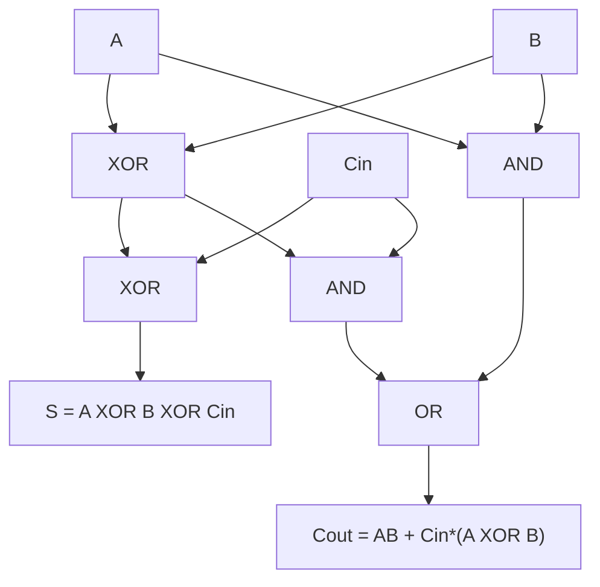
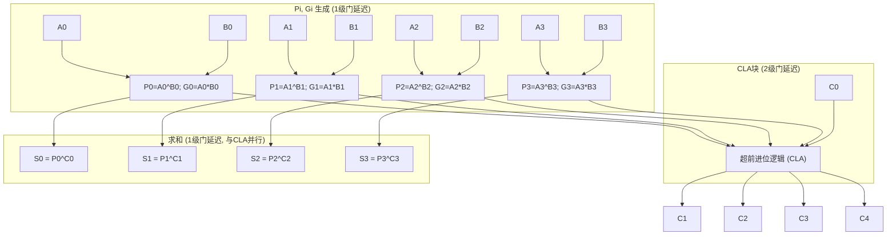
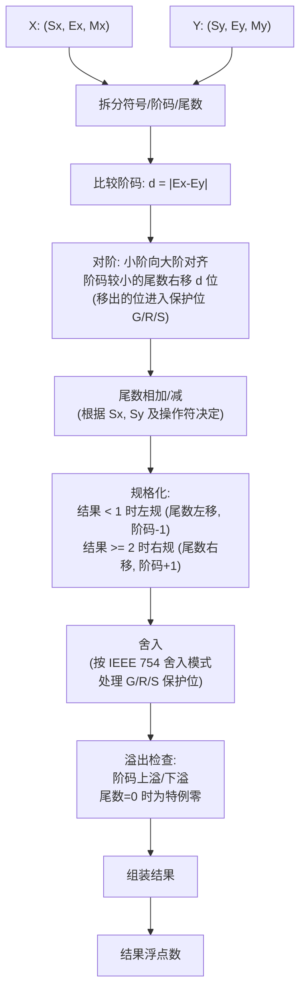
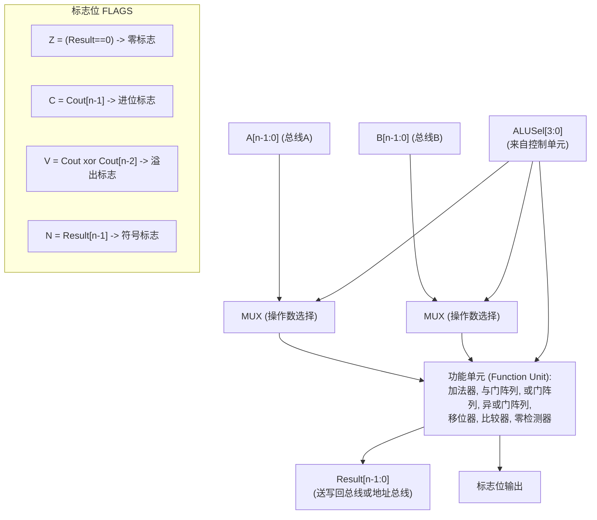

## J — 运算方法与运算器

运算器 (ALU) 是 CPU 中执行算术和逻辑运算的核心部件。理解从半加器到 Booth 乘法再到 IEEE 754 浮点运算的底层实现，是理解 CPU 数据通路的基础。

### 加法器设计基础

#### 半加器 (Half Adder)

完成两个 1 位二进制数的加法，不考虑低位进位输入。

| 输入 A | 输入 B | 和 S (Sum) | 进位 C (Carry) |
|:---:|:---:|:---:|:---:|
| 0 | 0 | 0 | 0 |
| 0 | 1 | 1 | 0 |
| 1 | 0 | 1 | 0 |
| 1 | 1 | 0 | 1 |

```
S = A XOR B
C = A AND B
```



#### 全加器 (Full Adder)

加上低位进位 Cin，完成完整的一位加法：

| A | B | Cin | S | Cout |
|:--:|:--:|:--:|:--:|:--:|
| 0 | 0 | 0 | 0 | 0 |
| 0 | 0 | 1 | 1 | 0 |
| 0 | 1 | 0 | 1 | 0 |
| 0 | 1 | 1 | 0 | 1 |
| 1 | 0 | 0 | 1 | 0 |
| 1 | 0 | 1 | 0 | 1 |
| 1 | 1 | 0 | 0 | 1 |
| 1 | 1 | 1 | 1 | 1 |



逻辑表达式：
```
S    = A XOR B XOR Cin
Cout = A*B + (A XOR B)*Cin
```

#### 行波进位加法器 (Ripple Carry Adder)

将 n 个全加器 (FA) 级联，进位从低位逐位传递到高位：

```
A[n-1] B[n-1]           A[1] B[1]    A[0] B[0]    C0=0
   |     |                 |   |        |   |       |
  FA[n-1] <- Cn-1  ...  FA[1] <- C1  FA[0] <- C0
   |                       |            |
  S[n-1]                 S[1]        S[0]
```

延迟分析：每个全加器的 Cout 经过 2 级门延迟 (AND + OR)，n 位行波进位 = O(2n) 门延迟。对于 n = 64，约 128 级门延迟，无法在一个周期内完成。因此现代加法器使用超前进位。

### 超前进位加法器 (Carry Look-ahead Adder, CLA)

#### 进位生成 (Generate) 与进位传播 (Propagate)

对第 i 位定义两个关键信号：
- **进位生成** Gi = Ai * Bi ---- 当 Ai 和 Bi 均为 1，本位一定产生进位
- **进位传播** Pi = Ai XOR Bi ---- 当 Ai 和 Bi 只有一个为 1，若低位有进位则本位上可以传播到高位

进位递归关系：
```
C[i+1] = Gi + Pi * Ci
```

#### 4 位 CLA 的进位展开

```
C1 = G0 + P0*C0
C2 = G1 + P1*G0 + P1*P0*C0
C3 = G2 + P2*G1 + P2*P1*G0 + P2*P1*P0*C0
C4 = G3 + P3*G2 + P3*P2*G1 + P3*P2*P1*G0 + P3*P2*P1*P0*C0
```

所有 4 位进位由 Ai, Bi, C0 经过三级门延迟 (AND/OR 树) 同时生成，与位数无关。这就是 "超前进位" (Look-ahead) 的含义。



对于 64 位加法器，通常采用多层 CLA 结构：
```
4位 CLA 块 (1层) -> 构成 16位 块间 CLA (2层) -> 4个 16位 构成 64位 (3层)
总延迟约为 O(log n) 级别，远优于 O(n) 的行波进位。
```

#### 组间成组进位 (Block Carry Look-ahead)

对一组 m 位定义块级生成和传播：
- 块进位生成 G* = 组内可产生进位 (不需要 C0 的帮助)
- 块进位传播 P* = 只要有 C0 就能将进位传到组外

```
对 4 位块:
G* = G3 + P3*G2 + P3*P2*G1 + P3*P2*P1*G0
P* = P3*P2*P1*P0
C_block_out = G* + P* * C_block_in
```

### 移位运算

| 类型 | 操作 | 空位填充 | x86 指令 | 计算结果 (对补码) |
|------|------|:---:|------|------|
| 逻辑左移 | 所有位左移 | 右端补 0 | SHL / SAL | 无符号 x 2^n; 补码 x 2^n (未溢出时) |
| 逻辑右移 | 所有位右移 | 左端补 0 | SHR | 无符号 / 2^n |
| 算术右移 | 所有位右移 | 左端补符号位 | SAR | 补码有符号 / 2^n (向负无穷取整) |
| 循环左移 | 所有位左移, 移出的最高位回填最低位 | 循环 | ROL | 位旋转 |
| 循环右移 | 所有位右移, 移出的最低位回填最高位 | 循环 | ROR | 位旋转 |
| 带进位循环左移 | 将 CF 作为额外位参与循环 (CF->最高位->...->最低位->CF) | 含 CF | RCL | 多倍精度大数移位 |
| 带进位循环右移 | 同上反向 | 含 CF | RCR | 多倍精度大数移位 |

示例 (8 位值 1011 0101 = B5h):

```
原始值:        1 0 1 1  0 1 0 1  (B5h, 无符号 181, 补码 -75)
SHL 1:         0 1 1 0  1 0 1 0  (6Ah, 无符号 106)  CF=1
SHR 1:         0 1 0 1  1 0 1 0  (5Ah, 无符号 90)   CF=1
SAR 1:         1 1 0 1  1 0 1 0  (DAh, 补码 -38)     CF=1  (符号位 1 填充)
ROL 1:         0 1 1 0  1 0 1 1  (6Bh)               CF=1
ROR 1:         1 1 0 1  1 0 1 0  (DAh)               CF=1
```

### 定点乘法

#### 原码一位乘法 (Sign-Magnitude Multiplication)

符号位与数值位分开处理：符号位 = Sx XOR Sy (两符号异或即负数)，数值位 = 绝对值相乘。

示例：X = -0.1011, Y = +0.1101, 结果符号 = 1 XOR 0 = 1 (负), 数值 = 0.1011 x 0.1101

原码无符号乘法过程 (移位相加法)：

| 步骤 | 部分积 (高位) | 乘数/部分积 (低位) | Y 最低位 | 操作 |
|:---:|:------------:|:------------:|:---:|------|
| 初始 | 0.0000 | 1 1 0 1 | 1 | +|X| (加被乘数) |
| 加后 | 0.1011 | | | 右移一位 |
| 1 后 | 0.0101 | 1 1 1 0 | 0 | +0 (不加) |
| 2 后 | 0.0101 | | | 右移一位 |
| 2 后 | 0.0010 | 1 1 1 1 | 1 | +|X| |
| 加后 | 0.1101 | | | 右移一位 |
| 3 后 | 0.0110 | 1 1 1 1 | 1 | +|X| |
| 加后 | 1.0001 | | | 右移一位 |
| 4 后 | 0.1000 | 1 1 1 1 | - | 结束 |

结果：数值 = 0.10001111, 符号 = 1 -> X x Y = -0.10001111

原码乘法每次迭代：看乘数最低位，为 1 则加被乘数，为 0 则加 0，然后部分积和乘数联合右移一位。

#### 补码一位乘 -- Booth 算法

Booth 算法直接对补码表示的乘数和被乘数做乘法，无需分离符号位。一次考察乘数相邻的两位：

| Y[i] (当前) | Y[i+1] (上一位/补位) | 操作 | 原理 |
|:---:|:---:|------|------|
| 0 | 0 | 部分积 + 0, 右移一位 | 连续的 0: 无操作 |
| 0 | 1 | 部分积 + [X]补, 右移一位 | 0->1 上升沿: 加 |
| 1 | 0 | 部分积 + [-X]补, 右移一位 | 1->0 下降沿: 减 |
| 1 | 1 | 部分积 + 0, 右移一位 | 连续的 1: 无操作 |

示例：X = -3 (补码 11101, 5bit 表示), Y = +5 (补码 00101, 5bit)
期望积 = -15, 10 位补码 = 1111110001

| 步骤 | 部分积高位 (5+1 符号扩展) | 乘数/低位 | 补位 | Y[0]Y[补] | 操作 |
|:---:|:---:|:---:|:---:|:---:|------|
| 初始 | 000000 | 00101 | **0** | 1 0 | +[-X]补 = +00011 |
| +后 | 000011 | 00101 | 0 | | 算术右移 |
| 移后 | 000001 | 10010 | 1 | | |
| 1 | 000001 | 10010 | **1** | 0 1 | +[X]补 = +11101 |
| +后 | 111110 | 10010 | 1 | | 算术右移 |
| 移后 | 111111 | 01001 | 0 | | |
| 2 | 111111 | 01001 | **0** | 1 0 | +[-X]补 = +00011 |
| +后 | 000010 | 01001 | 0 | | 算术右移 |
| 移后 | 000001 | 00100 | 1 | | |
| 3 | 000001 | 00100 | **1** | 0 1 | +[X]补 = +11101 |
| +后 | 111110 | 00100 | 1 | | 算术右移 |
| 移后 | 111111 | 00010 | 0 | | |
| 4 | 111111 | 00010 | **0** | 0 0 | +0 |
| +后 | 111111 | 00010 | 0 | | 算术右移 |
| 移后 | 111111 | 10001 | 0 | | 结束 |

结果：[高位] 111111 [低位] 10001 = 1111110001 (10位补码) = -15. 正确。

Booth 算法的关键：算术右移保持符号位不变，通过补码加减直接完成乘法，巧妙避免了原码乘法中符号位分离的多余操作。

### 定点除法

#### 恢复余数法 (Restoring Division)

对无符号整数 P (被除数) / D (除数) 实现 n 位除法：

```
算法 (n位, 恢复余数法):
R = 0  (初始余数 = 0)
for i = 0 to n-1:
    1. R, Q 联合左移一位  (R || Q << 1)
    2. R = R - D          (试探减法)
    3. if R >= 0:
          Q[n-1-i] = 1    (够减 -> 上商 1)
       else:
          R = R + D       (不够减 -> 恢复: 加回 D)
          Q[n-1-i] = 0    (上商 0)
```

示例：0.1010 / 0.1101 (4 位定点小数)

| 步骤 | 操作 | 部分余数 R | 商 Q | 说明 |
|:---:|------|:---:|:---:|------|
| 初始 | - | 0.1010 | 0.0000 | |
| 1 | 左移: R=1.0100; -D=1.0100-0.1101=0.0111 >=0 | 0.0111 | 0.0001 | 够减, 上商1 |
| 2 | 左移: R=0.1110; -D=0.1110-0.1101=0.0001 >=0 | 0.0001 | 0.0011 | 够减, 上商1 |
| 3 | 左移: R=0.0010; -D=0.0010-0.1101=-0.1011 <0 | 0.0010 (恢复) | 0.0110 | 不够减, 恢复, 上商0 |
| 4 | 左移: R=0.0100; -D=0.0100-0.1101=-0.1001 <0 | 0.0100 (恢复) | 0.1100 | 不够减, 上商0 |

结果：商 = 0.1100, 余数 = 0.0100 x 2^(-4)

恢复余数法的缺点：不够减时需要额外的一次加法来恢复余数，平均增加了约 n/2 次加法操作。

#### 不恢复余数法 / 加减交替法 (Non-Restoring Division)

优化：不够减时不恢复余数，而是下一步做**加法**：

```
规则:
if R >= 0: 上商 1, 下一步做 R' = 2*R - D  (左移后减)
if R < 0:  上商 0, 下一步做 R' = 2*R + D  (左移后加)
```

最后一步若余数为负，额外做一次 +D 恢复正余数。

同例 (0.1010 / 0.1101) 用加减交替法：

| 步骤 | 操作 | 部分余数 R | 商 Q | 说明 |
|:---:|------|:---:|:---:|------|
| 初始 | - | 0.1010 | 0.0000 | |
| 1 | R - D = 0.1010 - 0.1101 = -0.0011 <0 | -0.0011 | 0.0000 | 上商 0, 下一步 +D |
| 2 | 左移: R= -0.0110; +D = -0.0110+0.1101 = 0.0111 >=0 | 0.0111 | 0.0001 | 上商 1, 下一步 -D |
| 3 | 左移: R=0.1110; -D = 0.1110-0.1101 = 0.0001 >=0 | 0.0001 | 0.0011 | 上商 1, 下一步 -D |
| 4 | 左移: R=0.0010; -D = 0.0010-0.1101 = -0.1011 <0 | -0.1011 | 0.1100 | 上商 0, 末步为负需恢复 |
| 恢复 | +D = -0.1011+0.1101 = 0.0010 | 0.0010 | 0.1100 | 最终余数 |

结果：商 = 0.1100, 余数 = 0.0010 x 2^(-4)。与恢复余数法一致，但少做了两次恢复加法。

### 浮点运算

#### 浮点加减法

设 X = Sx x Mx x 2^(Ex), Y = Sy x My x 2^(Ey), 求 X +- Y：



**步骤详解**：

1. 对阶 (Align)：小阶向大阶看齐，尾数右移 delta_E 位，阶码增至与大的相同。右移过程中丢失的低位进入保护位 (Guard, Round, Sticky)。

2. 尾数加/减：两尾数按符号+操作符决定实际做加法还是减法。尾数隐含的 1 (IEEE 754 normalized) 在运算前恢复。

3. 规格化：
   - 右规：若相加产生进位 (M >= 2)，尾数右移 1 位，阶码 +1
   - 左规：若相减后前导零过多 (M < 1)，尾数左移到最高位为 1，阶码相应减少

4. 舍入：由于对阶和规格化可能产生多余的位 (G/R/S 三位)，需按舍入模式处理。

5. 溢出检查：
   - 阶码上溢 (Exponent Overflow)：EX > 最大指数 -> 报告正无穷或负无穷
   - 阶码下溢 (Exponent Underflow)：EX < 最小指数 -> 报告非规格化数或 0

#### 浮点乘法

X x Y = (Sx XOR Sy) x (Mx x My) x 2^(Ex + Ey - bias)

步骤：
1. 符号：结果符号 = Sx XOR Sy
2. 阶码相加：E_result = Ex + Ey - bias (减去多余的 bias)
3. 尾数相乘：Mx x My，使用定点乘法 (如 Booth)
4. 规格化：尾数乘积范围为 [1, 4)，若 >= 2 则右规一次 (尾数右移 1, 阶码 +1)
5. 舍入 + 溢出检查

#### IEEE 754 舍入模式

| 模式 | 缩写 | 规则 |
|------|:---:|------|
| 最近偶数舍入 (Round to Nearest, Ties to Even) | RN / RNE | 舍入到最近的可表示值；若恰好位于两个值正中间 (tie)，选择最低有效位为 0 (偶数) 的值。**IEEE 754 默认模式** |
| 向正无穷舍入 (Round toward +infinity) | RU | 总是向 +inf 方向取最近的可表示值 (ceil) |
| 向负无穷舍入 (Round toward -infinity) | RD | 总是向 -inf 方向取最近的可表示值 (floor) |
| 向零舍入 (Round toward Zero) | RZ | 截断 (truncation)，无偏置，直接丢弃多余位 |

最近偶数舍入 (Round to Nearest Even) 解决了普通四舍五入的统计偏差问题。大量浮点运算中 0.5 始终向上舍入会导致结果渐渐偏大 (positive bias)。偶数舍入使得大约一半的 tie 向上舍、一半向下舍，长期期望误差趋于 0。

```
例 (保留两位小数, 最近偶数舍入):
  2.345 -> 2.34  (tie: 5 的最近数是 34 和 35, 34 最低位 4 是偶数 -> 选 2.34)
  2.355 -> 2.36  (tie: 35 和 36, 36 最低位 6 是偶数 -> 选 2.36)
  2.365 -> 2.36  (tie: 36 和 37, 36 最低位 6 是偶数 -> 选 2.36)
  2.351 -> 2.35  (非 tie, 更近 2.35)
```

Guard / Round / Sticky 三位保护位用于舍入判断：
| 位 | 名称 | 含义 |
|:--:|------|------|
| G | Guard bit | 尾数最低有效位后面的第一位 |
| R | Round bit | G 后面的第二位 |
| S | Sticky bit | R 后面所有位的逻辑 OR (若任何一位为 1 则 S=1) |

#### 浮点加法完整示例

X = 1.5 (单精度: 0 01111111 10000000000000000000000)
Y = 0.75 (单精度: 0 01111110 10000000000000000000000)

| 步骤 | 操作 | 结果 |
|:---:|------|------|
| 拆包 | Ex=127(0x7F), Mx=1.100...0; Ey=126(0x7E), My=1.100...0 | |
| 对阶 | d=1, Y 尾数右移 1, Ey=127 | My=0.1100...0, G=0, R=0, S=0 |
| 尾加 | Mx + My = 1.100...0 + 0.110...0 | = 10.010...0 (= 2.25) |
| 右规 | 尾数右移 1, 阶码+1=128 | M=1.00100...0, G=0, R=1, S=0 |
| 舍入 (RN) | GRS=010 (非tie) -> 截断 | M=1.00100...0 |
| 组装 | S=0, E=10000000, M=00100...0 | = 2.25 (0x40100000) |

### ALU 设计

一个简单的 n 位 ALU 结构：



常用 ALU 操作编码：

| ALUSel | 操作 | 计算 | 说明 |
|:---:|------|------|------|
| 0000 | ADD | Result = A + B | 无符号/补码加法 |
| 0001 | SUB | Result = A - B | 无符号/补码减法 |
| 0010 | AND | Result = A & B (按位) | |
| 0011 | OR | Result = A | B (按位) | |
| 0100 | XOR | Result = A ^ B (按位) | |
| 0101 | NOR | Result = ~(A | B) | |
| 0110 | SLT | Result = (A < B 补码比较) | Set Less Than |
| 0111 | SLTU | Result = (A < B 无符号比较) | |
| 1000 | SLL / SLLV | Result = B << A[4:0] | 逻辑左移 |
| 1001 | SRL / SRLV | Result = B >> A[4:0] | 逻辑右移 |
| 1010 | SRA / SRAV | Result = B >>> A[4:0] | 算术右移 |
| 1011 | LUI | Result = B << 16 | Load Upper Immediate (RISC-V) |

#### 溢出判断逻辑

```
对加法:
  V = (A[n-1] == B[n-1]) && (A[n-1] != Result[n-1])
  (两个同号数相加, 结果异号 -> 溢出)

对减法:
  V = (A[n-1] != B[n-1]) && (A[n-1] != Result[n-1])
  (减数取反 = 加相反数, 等价于两个异号数相加, 结果与A同号则不溢出)

等价硬件实现 (进位比较):
  V = Cout[n-1] XOR Cout[n-2]
```

验证：`0111 + 0001 = 1000` (7+1=8, 但补码中 1000 = -8, 溢出). Cout[3]=0, Cout[2]=1 -> 0 XOR 1 = 1 -> V=1. 正确。

### 本章与其他模块的链接

- 定点数和浮点数的二进制底层表示与取值范围 -> [[A_数据表示]]
- ALU 在数据通路中的连接位置与多路选择器控制 -> [[H_CPU数据通路与控制器]]
- 浮点运算在流水线 EX 阶段的多周期执行 (非流水化 FPU) -> [[I_流水线与指令流水]]
- 乘法器在现代 CPU 中的实现与 SIMD 向量化乘加 (FMA) 指令 -> [[C_CPU架构]]
