## A -- 网络体系结构

计算机网络体系结构是网络协议的分层抽象框架，是理解 [[B_物理层]]、[[C_数据链路层]]、[[D_网络层]]、[[E_传输层]]、[[F_应用层]] 各层协议的前提。

---

### 1. 计算机网络概述

#### 1.1 概念

计算机网络是通过通信设备和传输介质，将地理位置不同、功能独立的计算机系统互连，以**网络协议**实现资源共享和信息传递的系统。

核心要素可以概括为"三网合一"：

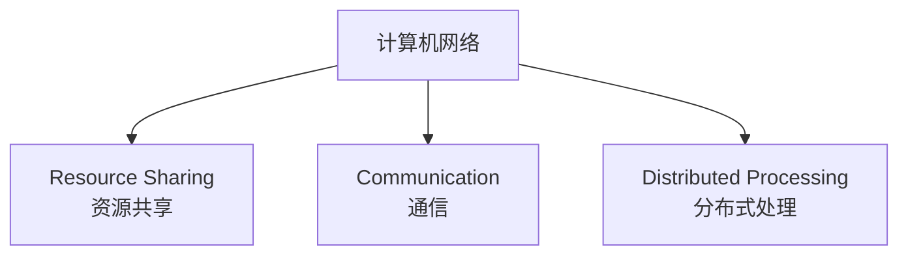

**更精确的定义**：计算机网络 = 若干**自治计算机**的集合 + 遵循统一**协议** + 通过**通信链路**互连。自治意味着每台计算机可独立运行，不依赖网络中其他节点。

#### 1.2 组成

从不同视角有三个维度的划分：

| 划分视角 | 组成部分 | 说明 |
|----------|---------|------|
| **物理组成** | 主机 (Host) / 端系统 (End System) | 产生或消费数据的设备 |
|  | 通信设备 (Networking Devices) | 交换机、路由器、防火墙、负载均衡器 |
|  | 传输介质 (Transmission Media) | 双绞线、光纤 (单模/多模)、同轴电缆、无线电波 |
|  | 网络协议 (Protocol) | 约定数据格式、时序与语义的规则集合 |
|  | 网络软件 (Software) | 操作系统协议栈 (Linux 内核 `net/` 子系统)、应用软件 |
| **逻辑组成** | 通信子网 (Communication Subnet) | 物理层 + 数据链路层 + 网络层 (路由器、交换机构成的转发平面) |
|  | 资源子网 (Resource Subnet) | 传输层 + 应用层 + 端系统上的应用软件 |
| **功能组成** | 边缘部分 (Edge) | 端系统，产生/消费数据 |
|  | 核心部分 (Core) | 路由器、交换机，负责数据转发 (packet switching) |

#### 1.3 功能

| 功能 | 描述 | 对应层 |
|------|------|:----:|
| 数据通信 (Data Communication) | 端到端可靠或不可靠的数据传输 | 传输层/网络层 |
| 资源共享 (Resource Sharing) | CPU、存储、打印机、软件、数据库 | 应用层 |
| 分布式处理 (Distributed Processing) | 将任务分解到多节点并行运算 | 应用层 |
| 提高可靠性 (Reliability) | 通过冗余和备份提供高可用 | 全栈 |
| 负载均衡 (Load Balancing) | 将请求均匀分配到多台服务器 | 传输层/应用层 |

**容器的功能映射**：Kubernetes 的 Service 对象 (负载均衡) 本质是传输层/应用层的抽象；StatefulSet (可靠存储) 是资源子网的实现；CNI 插件是把上述功能编排进 Linux 内核协议栈 (iptables/IPVS/eBPF)。

#### 1.4 分类

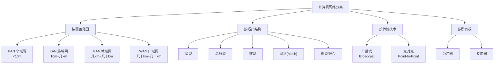

| 类型 | 范围 | 典型协议/技术 | 典型场景 | 速度量级 |
|------|------|------------|---------|:------:|
| **PAN** (Personal Area Network) | < 10m | Bluetooth, Zigbee, NFC, UWB | 手机-耳机, 智能家居传感器 | Kbps~Mbps |
| **LAN** (Local Area Network) | 10m~几km | Ethernet (IEEE 802.3), WiFi (802.11), ARP | 办公室/校园网络, 家庭路由器 | 100Mbps~100Gbps |
| **MAN** (Metropolitan Area Network) | 几km~几十km | Metro Ethernet, FDDI, WiMAX | 城市 ISP 骨干, 大学城互联 | 1Gbps~100Gbps |
| **WAN** (Wide Area Network) | 几十km~几千km | IP/MPLS, SD-WAN, BGP, OSPF, 光传输(SONET/SDH) | 跨省/跨国互联, Internet 骨干 | 10Gbps~400Gbps |

**要点**：WAN 的核心协议是 IP 和 BGP；LAN 的核心协议是以太网和 ARP；MAN 的典型场景相对少见，但城域网的概念需知。

---

### 2. 性能指标

计算机网络性能指标是衡量网络质量的定量尺度，是所有网络协议设计与网络排障的基石。

#### 2.1 速率 (Rate / Data Rate)

**定义**：单位时间内在信道上传输的**数据量**（比特数），也称**数据率**或**比特率**。

- 单位：bps (bit/s), Kbps (10^3 bps), Mbps (10^6 bps), Gbps (10^9 bps), Tbps (10^12 bps)
- 注意：**存储的 K = 1024，通信的 K = 1000**。1 MB 文件 = 1024 x 1024 x 8 bits；100 Mbps 速率 = 100 x 10^6 bps

**计算示例**：在 100 Mbps 的信道上传输一个 1 GB 文件，忽略所有开销，理想时间为：

```
1 GB = 1 × 10^9 × 8 = 8 × 10^9 bits
传输时间 = 8 × 10^9 / (100 × 10^6) = 80 秒
```

#### 2.2 带宽 (Bandwidth)

**两种含义**，务必区分：

| 含义 | 单位 | 适用上下文 | 类比 |
|------|------|----------|------|
| **信号带宽** (模拟) | Hz (赫兹) | 物理层: 信号频率范围 — 最高频率 - 最低频率 | 水管直径 |
| **数字带宽** (速率) | bps | 链路能支持的最高数据率 | 水管最大流速 |

**Nyquist 与 Shannon 定理 (物理层详解，参见 [[B_物理层]])**：

- 理想无噪声信道：**Nyquist** — 最高数据传输率 = `2W log₂(V)` bps，W 为带宽 (Hz)，V 为离散电平级数
- 有噪声信道：**Shannon** — 信道极限传输率 = `W log₂(1 + S/N)` bps，S/N 为信噪比 (非 dB 值)

```
信噪比 dB 转换: (S/N)dB = 10 log₁₀(S/N)
若 S/N(dB) = 30dB，则 S/N = 10^(30/10) = 1000
若带宽 W = 3 kHz，则 Shannon 极限 = 3000 × log₂(1001) ≈ 30 kbps
```

#### 2.3 吞吐量 (Throughput)

**定义**：单位时间内**实际**通过某个网络 (或信道、接口) 的数据量。

- 吞吐量 <= 额定速率/带宽 (受拥塞控制、丢包、流控制约)
- 吞吐量受瓶颈链路限制：端到端吞吐量 = min(各链路吞吐量)

**计算示例**：

```
链路1: 100 Mbps, 链路2: 10 Mbps, 链路3: 1000 Mbps
端到端吞吐量 ≈ min(100, 10, 1000) = 10 Mbps (瓶颈在链路2)
```

#### 2.4 时延 (Delay / Latency)

时延是数据从源节点到目的节点所经历的总时间。四部分构成：

```
总时延 = 发送时延 + 传播时延 + 处理时延 + 排队时延
```

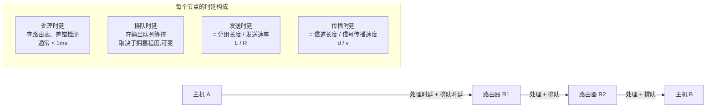

| 时延类型 | 公式 | 说明 | 影响因素 |
|----------|------|------|---------|
| **发送时延** (Transmission Delay) | `d_trans = L / R` | L = 分组长度 (bits), R = 链路速率 (bps) | 分组大小、链路速率 |
| **传播时延** (Propagation Delay) | `d_prop = d / v` | d = 物理链路长度 (m), v = 信号传播速度 (~2×10⁸ m/s 铜缆, ~3×10⁸ m/s 光缆真空) | 物理距离、介质类型 |
| **处理时延** (Processing Delay) | 非计算量 | 路由器查路由表、校验 CRC、提取首部 | 路由器 CPU 性能 |
| **排队时延** (Queuing Delay) | 非计算量 | 分组在输出队列等待发送的时间 | 流量强度 `La/R` |

**排队时延的数学模型**：

```
设: a = 平均分组到达速率 (packets/s)
    R = 链路速率 (bps)
    L = 平均分组长度 (bits)

流量强度 (Traffic Intensity) = La / R

当 La/R → 0 : 排队时延很小
当 La/R → 1 : 排队时延急剧增大
当 La/R > 1 : 队列无限增长,时延趋向无穷 (拥塞崩溃)
```

**综合计算示例**：

```
条件: 链路长度 1000 km, 传播速度 2×10⁸ m/s
      链路速率 100 Mbps
      分组长度 1000 Bytes

1. 发送时延 = (1000 × 8) / (100 × 10⁶) = 8000 / 10⁸ = 80 μs
2. 传播时延 = (1000 × 10³) / (2 × 10⁸) = 5 ms
   
   结论: 本例中传播时延是发送时延的 5000000/80 = 62500 倍
   长距离链路上,传播时延主导总时延。
```

> **辨析要点**：发送时延与传播时延是**独立**的概念。发送时延取决于分组长度和发送速率，发生在主机/路由器内部；传播时延取决于物理距离和信号速度，发生在传输介质上。两者可以同时发生 (流水线效应)。

#### 2.5 时延带宽积 (Delay-Bandwidth Product)

**定义**：`时延带宽积 = 传播时延 × 带宽`

物理意义：当发送端连续发送比特时，在第一个比特到达接收端之前，发送端已经发送了多少比特。即"管道"中容纳的比特数。

```
时延带宽积 = 传播时延 × 带宽
           = (d / v) × R

单位: bits (比特数)
```

**示例**：

```
条件: 传播时延 = 20 ms, 带宽 = 1 Gbps
时延带宽积 = 20 × 10⁻³ × 1 × 10⁹ = 20 × 10⁶ bits = 20 Mb = 2.5 MB

含义: 接收端收到第一个比特时,发送端已发出 2.5 MB 数据。
     这 2.5 MB 正在"管道"中传输 — 这些是 "in-flight" 数据。
```

**TCP 拥塞控制的关联**：TCP 的理想发送窗口大小应接近时延带宽积 (`BDP = RTT × C`)。窗口太小则链路利用率低，窗口太大则引发拥塞。这是 BBR 拥塞控制算法的核心思想（详见 [[E_传输层]]）。

**容器的意义**：跨可用区的容器通信 (如 K8s 集群跨 AZ) 时，`BDP` 决定了 TCP 窗口的合理上界。远距离节点部署时需要调整 `net.core.wmem_max` 等内核参数。

#### 2.6 往返时间 RTT (Round-Trip Time)

**定义**：从发送端发出数据到发送端收到接收端确认所经历的总时间。

```
RTT = 2 × 传播时延 + 中间节点处理时延 + 接收端处理时延
```

**注意**：RTT 不包括发送时延本身 (因为接收端可以在收到足够数据后立即发送 ACK，发送时延与传播可能重叠)。

**RTT 测量**：

```bash
# Linux 中观测 RTT
ping -c 4 8.8.8.8             # ICMP echo, 应用层估计
traceroute -n 8.8.8.8         # 逐跳 RTT
ss -ti                        # 查看 TCP 连接的平滑 RTT (SRTT) 和 RTT 方差 (RTTVAR)
```

**TCP 超时重传 (RTO) 与 RTT 的关系**：

```
SRTT(i+1) = (1 - α) × SRTT(i) + α × SampleRTT    (α 通常为 0.125)
RTTVAR(i+1) = (1 - β) × RTTVAR(i) + β × |SampleRTT - SRTT(i)|   (β 通常为 0.25)
RTO = SRTT + 4 × RTTVAR
```

参见 [[E_传输层]] 中 TCP 重传机制的完整推导。

#### 2.7 利用率 (Utilization)

```
信道利用率 = 实际吞吐量 / 信道带宽
网络利用率 = 全网络信道利用率的加权平均
```

**利用率与排队时延的关系**：

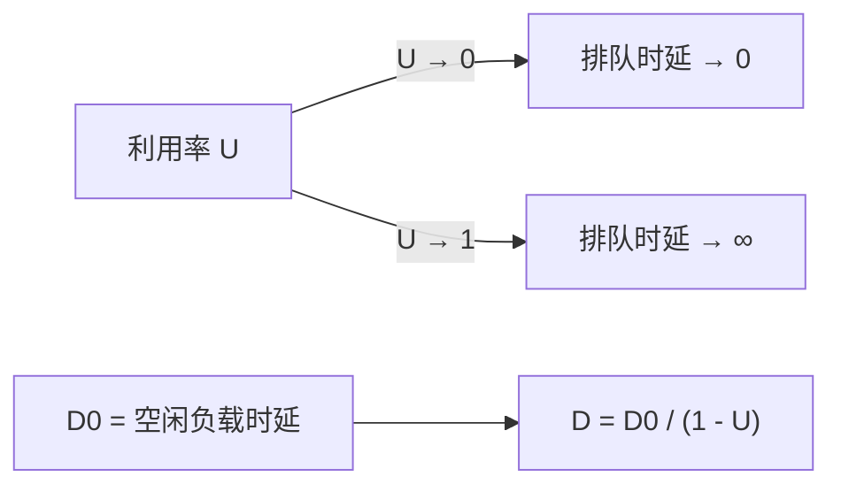

设 D₀ 为零负载时的时延 (`空载时延 = 传播时延 + 处理时延`)，则：

```
D = D₀ / (1 - U)

当 U = 0.5: D = 2 × D₀    (时延翻倍)
当 U = 0.9: D = 10 × D₀   (时延扩展 10 倍)
当 U = 0.99: D = 100 × D₀  (崩溃)
```

**工程实践**：骨干网运营商通常在利用率达到 30%-50% 时考虑扩容，以保持在拥塞崩溃的悬崖之前。

#### 2.8 丢包率 (Packet Loss Rate)

**定义**：`丢包率 = 丢失分组数 / 发送分组总数`

| 丢包原因 | 机制 | 缓解手段 |
|---------|------|---------|
| 路由器队列溢出 (Congestion) | 队列满, 尾丢弃 (Tail-Drop) | AQM: RED, CoDel; 显式拥塞通知 ECN |
| 链路误码 (Bit Error) | 校验失败, 静默丢弃 | FEC (前向纠错), ARQ (自动重传) |
| TTL 超时 | IP TTL 递减至零 | 避免路由环路 (路由协议收敛) |
| MTU 不匹配 (黑洞) | 分组过大且 DF 置位, 无法分片丢弃 | PMTUD (Path MTU Discovery) |

**路由器丢包行为**：默认的尾丢弃策略导致 TCP 全局同步 (Global Synchronization) — 所有 TCP 流同时缩减窗口、同时增大，吞吐量振荡。AQM 机制 (RED/WRED) 通过概率性早期丢弃来避免全局同步。

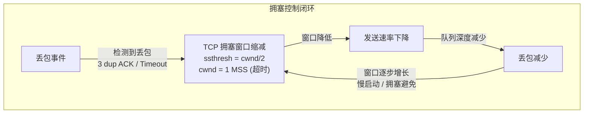

---

### 3. OSI 七层模型

OSI (Open Systems Interconnection) 模型由 ISO 制定，是网络通信的**概念性框架**，用于教学和协议分析。

```mermaid
graph TD
    subgraph "OSI 七层模型 — 数据封装与解封装"
        direction TB

        subgraph HostA_TOP["发送方 (封装)"]
            A7["7. 应用层<br/>Application<br/>————<br/>PDU: Data / Message<br/>协议: HTTP, SMTP, FTP, DNS, SNMP"]
            A6["6. 表示层<br/>Presentation<br/>————<br/>PDU: Data<br/>功能: 编码转换、加密、压缩<br/>协议: SSL/TLS, MIME, JPEG, ASCII"]
            A5["5. 会话层<br/>Session<br/>————<br/>PDU: Data<br/>功能: 会话建立/管理/同步<br/>协议: SOCKS, NetBIOS, RPC, SIP"]
            A4["4. 传输层<br/>Transport<br/>————<br/>PDU: Segment (TCP) / Datagram (UDP)<br/>功能: 端到端可靠/不可靠传输<br/>协议: TCP, UDP, SCTP, QUIC"]
            A3["3. 网络层<br/>Network<br/>————<br/>PDU: Packet / Datagram<br/>功能: 路由选择、逻辑编址<br/>协议: IP, ICMP, ARP, OSPF, BGP, IPsec"]
            A2["2. 数据链路层<br/>Data Link<br/>————<br/>PDU: Frame<br/>功能: 成帧、MAC编址、差错检测<br/>协议: Ethernet, PPP, Wi-Fi (802.11), VLAN"]
            A1["1. 物理层<br/>Physical<br/>————<br/>PDU: Bit<br/>功能: 比特流透明传输<br/>介质: 双绞线、光纤、无线电"]

            A7 --> A6 --> A5 --> A4 --> A3 --> A2 --> A1
        end

        A1 -->|"比特流<br/>传输介质"| B1
    end

    subgraph HostB_BOT["接收方 (解封装)"]
        B1["1. 物理层<br/>————<br/>接收比特流, 上传"]
        B2["2. 数据链路层<br/>————<br/>解帧, CRC校验"]
        B3["3. 网络层<br/>————<br/>路由查找, 解IP头"]
        B4["4. 传输层<br/>————<br/>端口解复用, 重组"]
        B5["5. 会话层<br/>————<br/>会话恢复"]
        B6["6. 表示层<br/>————<br/>解密, 解码, 解压"]
        B7["7. 应用层<br/>————<br/>交付应用进程"]

        B1 --> B2 --> B3 --> B4 --> B5 --> B6 --> B7
    end
```

**各层详细职责与 PDU 总结**：

| 层号 | 名称 | 功能摘要 | PDU | 地址类型 | 关键设备 |
|:---:|------|---------|-----|---------|---------|
| 7 | 应用层 | 为应用程序提供网络服务接口 | Data / Message | — | 应用网关, 应用层防火墙 |
| 6 | 表示层 | 数据格式转换、加密/解密、压缩/解压缩 | Data | — | — |
| 5 | 会话层 | 建立、管理、终止会话；会话检查点与恢复 | Data | — | — |
| 4 | 传输层 | 端到端可靠传输、流量控制、拥塞控制、端口复用 | **Segment** (TCP) / **Datagram** (UDP) | Port (16-bit) | L4 负载均衡器, NAT 网关 |
| 3 | 网络层 | 路由选择、逻辑编址 (IP)、分片与重组 | **Packet / Datagram** | IP 地址 (32/128-bit) | 路由器, L3 交换机, 防火墙 |
| 2 | 数据链路层 | 成帧、MAC 编址、差错检测与纠错、介质访问控制 | **Frame** | MAC 地址 (48-bit) | 交换机、网桥、AP |
| 1 | 物理层 | 比特流在物理介质上的透明传输 | **Bit** | — | 中继器 (Repeater)、集线器 (Hub)、调制解调器 |

**数据在各层的封装过程 (自上而下的首部追加)**：

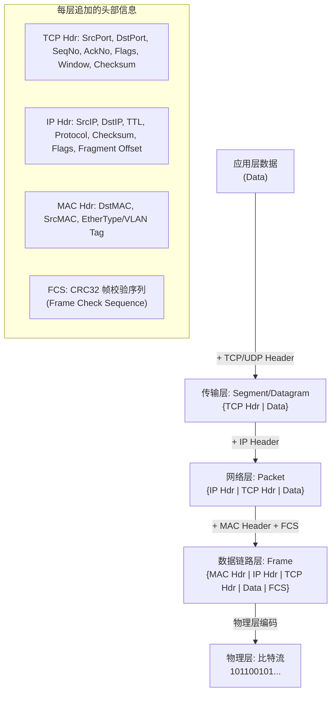

**各层职责要点**：

- 物理层：**不提供差错控制**，只做透明比特传输。差错控制由数据链路层以上负责。
- 数据链路层：**点到点**通信 (同一网段内相邻节点)，MAC 地址仅在广播域内有效。
- 网络层：**端到端**通信 (跨越多个网络/路由器)，IP 地址全局唯一/局部唯一 (NAT)。
- 传输层：**进程到进程**通信，端口号区分同一主机上的不同应用进程。
- **下一层为上一层提供服务**，对等层之间遵守同一协议。

**OSI 7 层 vs [[../../操作系统/B_进程管理|操作系统]] 系统调用栈对比**：

| OSI 概念 | 操作系统对应 |
|---------|------------|
| 应用层 | 用户态: `socket()`, `send()`, `recv()`, `connect()`, `accept()` |
| 传输层 | 内核态: TCP/UDP 协议栈 (`net/ipv4/tcp.c`, `net/ipv4/udp.c`) |
| 网络层 | 内核态: IP 路由子系统 (`net/ipv4/ip_forward.c`, `net/ipv4/route.c`) |
| 数据链路层 | 内核态: 网卡驱动 (NIC driver, `drivers/net/`) + NAPI |
| 物理层 | 硬件: NIC PHY, 网线/光模块 |

---

### 4. TCP/IP 四层模型

TCP/IP 是互联网实际运行的协议栈。OSI 七层是教学模型，TCP/IP 四层是工程模型。

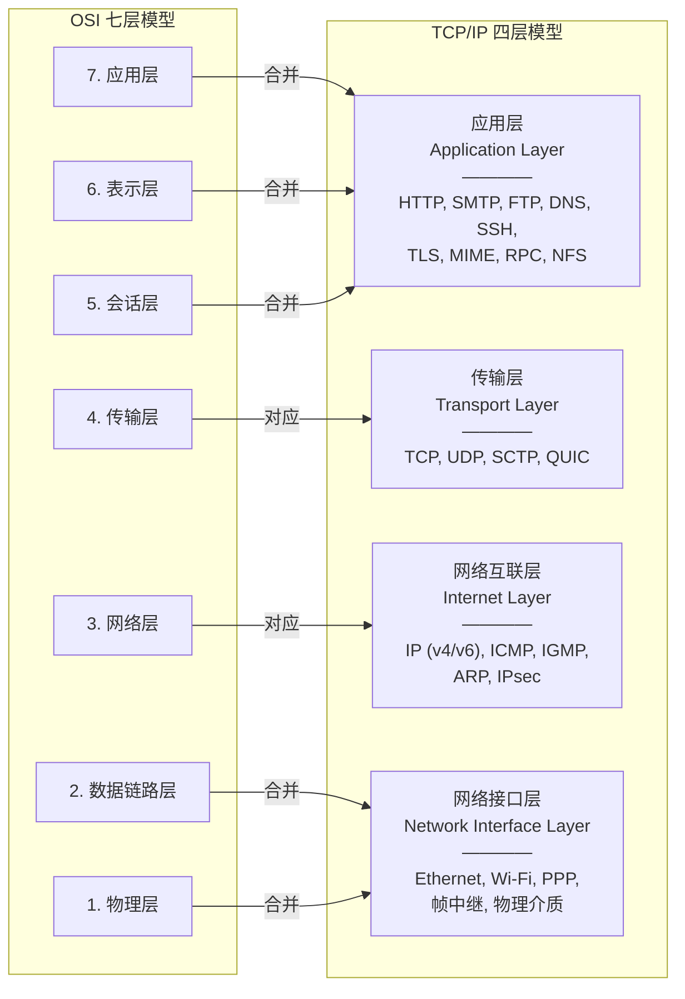

**映射关系与差异总结**：

| 对比维度 | OSI 七层 | TCP/IP 四层 |
|---------|---------|------------|
| 层次数 | 7 | 4 |
| 出现时间 | 先有模型 (1977-1984) | 先有协议栈 (ARPANET, 1970s) |
| 模型性质 | **理论模型** — 先设计模型后实现 | **工程模型** — 从已有协议栈中归纳 |
| 表示层/会话层 | 独立层 — 分工明确 | 合并入应用层 — 由应用自身或库处理 (TLS/SSL 是库) |
| 物理层与数据链路层 | 独立的两层 | 合并为"网络接口层" — 不做细节规定 |
| 是否定义"服务/接口/协议" | 严格区分三者 | 未做严格区分 |
| 适用场景 | 教学, 协议分析, 概念设计 | 互联网工程实施 |
| 协议族 | 未绑定 (理论上可承载任意协议) | 绑定 TCP/IP 协议族 |

**TCP/IP 协议栈沙漏模型 (Hourglass Model)**：

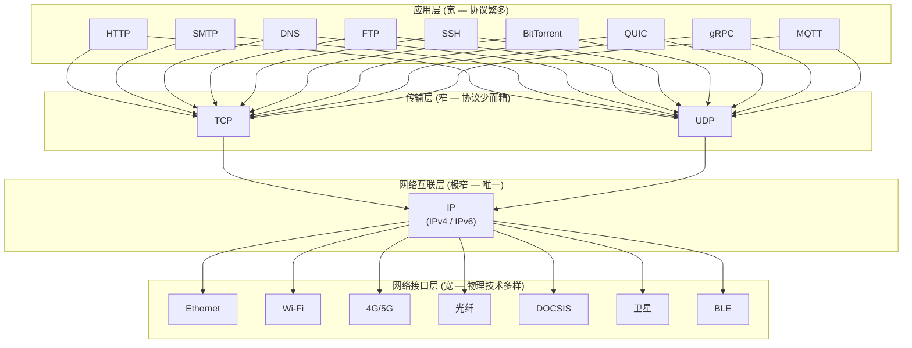

**沙漏模型的哲学**：IP 是 Internet 的"窄腰" (narrow waist)。IP 之上支持任意传输层和应用层协议，IP 之下可运行于任意物理网络之上。这种设计使得互联网具有极强的可扩展性 — 新增上层应用或底层物理技术无需修改 IP 层。

---

### 5. 五层参考模型（教学常用模型）

**五层模型**是国内教材与教学中广泛采用的教学标准，在 OSI 七层基础上合并了表示层和会话层到应用层。

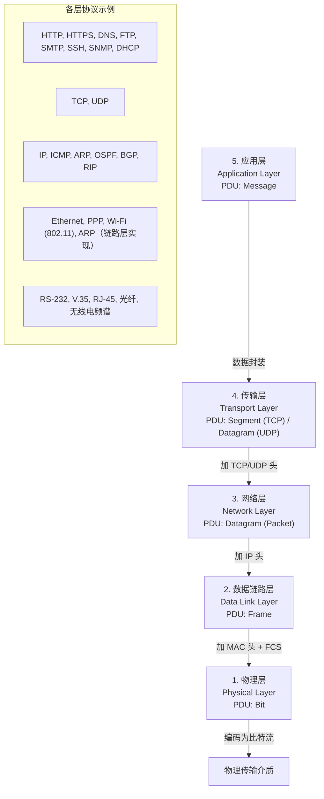

**五层参考模型 vs 其他模型**：

| 层 | 五层参考模型 (推荐) | OSI 七层 | TCP/IP 四层 | 本教程对应章节 |
|:--:|-------------------|---------|------------|:------------:|
| 5 | 应用层 | 7/6/5 (应用/表示/会话) | 应用层 | [[F_应用层]] |
| 4 | 传输层 | 4 (传输层) | 传输层 | [[E_传输层]] |
| 3 | 网络层 | 3 (网络层) | 网络互联层 | [[D_网络层]] |
| 2 | 数据链路层 | 2 (数据链路层) | 网络接口层 | [[C_数据链路层]] |
| 1 | 物理层 | 1 (物理层) | 网络接口层 | [[B_物理层]] |

**统一采用五层模型的原因**：教学上，五层模型既保留了 OSI 的逻辑清晰性 (物理层和数据链路层分别处理 bit 和 frame)，又避免了对表示层/会话层的过度抽象 (这两层在现代互联网中几乎不独立存在)。实践中根据协议查找对应层次即可。

---

### 6. 协议、接口与服务

#### 6.1 核心概念辨析

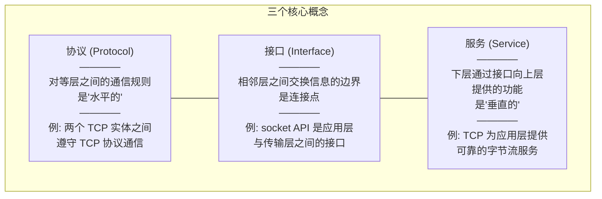

**正式定义**：

| 术语 | 定义 | 方向 | 例子 |
|------|------|:--:|------|
| **协议 (Protocol)** | 对等层实体之间通信规则的集合 (语法、语义、时序) | 水平 | TCP 的对等实体间交换 SYN/ACK/FIN 的规则 |
| **接口 (Interface)** | 相邻层之间交换信息的方法，即下层向上层提供的操作集合 | 垂直 (层间) | BSD Socket API: `socket()`, `bind()`, `listen()` |
| **服务 (Service)** | 下层通过接口向上层提供的通信能力 | 垂直 (下层→上层) | 传输层为应用层提供"可靠字节流"服务 |
| **实体 (Entity)** | 每层中执行协议和提供服务的硬件或软件模块 | — | TCP 模块 (内核中的 `net/ipv4/tcp.c`) |
| **对等实体 (Peer Entity)** | 不同机器上相同层的实体 | 水平 | 主机 A 的 TCP 实体 ↔ 主机 B 的 TCP 实体 |

#### 6.2 服务访问点 SAP (Service Access Point)

**SAP** 是相邻层实体之间进行信息交换的逻辑接口。每个 SAP 有一个唯一标识。

| 层 | SAP 名称 | 标识 |
|---|---------|------|
| 传输层 ↔ 应用层 | 端口号 (Port Number) | 16-bit: 0-65535 |
| 网络层 ↔ 传输层 | 协议号 (Protocol Number) | 8-bit: IP 首部 Protocol 字段 (TCP=6, UDP=17) |
| 数据链路层 ↔ 网络层 | 以太网类型 (EtherType) | 16-bit: IPv4=0x0800, ARP=0x0806, IPv6=0x86DD |
| 物理层 ↔ 数据链路层 | 网卡接口 (NIC Interface) | `eth0`, `wlan0` (in Linux) |

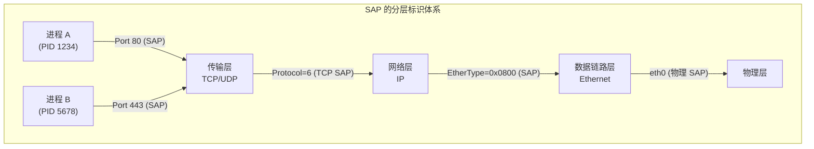

#### 6.3 服务原语 (Service Primitives)

服务原语描述相邻层之间交互的**请求-响应**动作序列。

| 原语 | 方向 | 含义 |
|------|:--:|------|
| **Request (请求)** | 上层→下层 | 上层请求下层提供服务 |
| **Indication (指示)** | 下层→上层 | 下层通知上层有事件发生 (如数据到达) |
| **Response (响应)** | 上层→下层 | 上层对 Indication 的应答 |
| **Confirm (确认)** | 下层→上层 | 下层通知上层请求已完成 |

**面向连接服务的四原语交互** (以 TCP `connect()` 为例)：

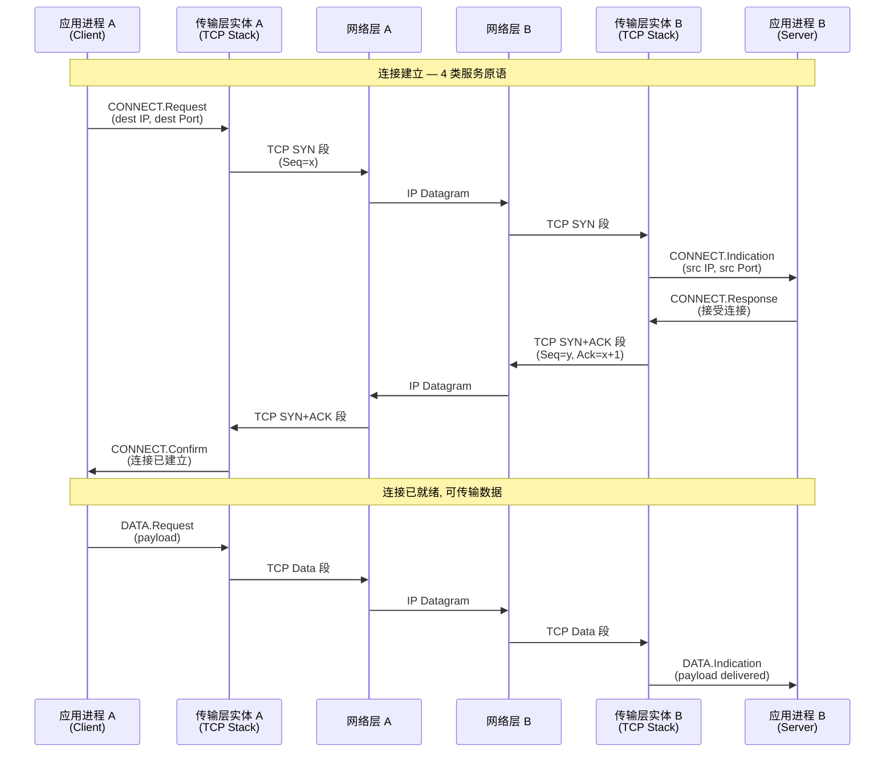

**无连接服务的二原语交互** (以 UDP `sendto()` 为例)：

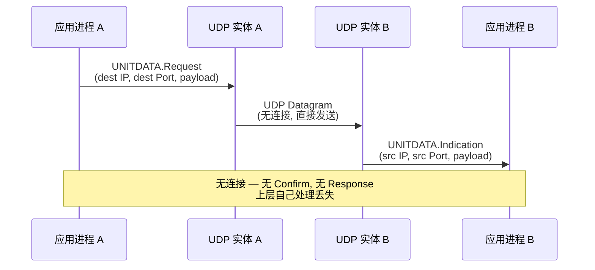

**要点**：

- 面向连接服务：**必然**使用四原语 (Request, Indication, Response, Confirm)；典型的"请求-确认"模型。
- 无连接服务：仅使用两个原语 (Request, Indication)；"发了就不管"。
- **服务原语 vs 协议数据单元 (PDU)**：服务原语是相邻层之间**控制信息**的交换方式，PDU 是对等层之间**数据**的格式。

#### 6.4 面向连接 vs 无连接服务

| 比较维度 | 面向连接 (Connection-Oriented) | 无连接 (Connectionless) |
|---------|-------------------------------|------------------------|
| 连接建立 | 需要 (三次握手等) | 不需要 |
| 通信过程 | 建立连接 → 数据传输 → 释放连接 | 直接发送数据 |
| 可靠性 | 通常提供可靠传输 | 通常不保证可靠 (尽力而为) |
| 顺序性 | 保证数据按序到达 | 不保证顺序 |
| 流量控制 | 有 (滑动窗口等) | 无 |
| 典型协议 | TCP, SCTP, 虚电路 (VC) | UDP, IP, Ethernet, DNS (基于 UDP) |
| 适用场景 | 文件传输、邮件、网页、远程登录 | 实时音视频、DNS 查询、DHCP、IoT 遥测 |
| 网络层中的实现 | 虚电路网络 (ATM, X.25, MPLS) | 数据报网络 (IP) |
| 服务原语 | 四原语 (Req/Ind/Resp/Conf) | 二原语 (Req/Ind) |

**网络层两类服务**（重点）：

- **虚电路 (Virtual Circuit)**：面向连接，如 ATM、X.25、MPLS。先建立路径，分组沿固定路径转发，中间节点维护连接状态。
- **数据报 (Datagram)**：无连接，如 IP。每个分组独立路由，中间节点无连接状态。

---

### 7. 分层的好处与缺点

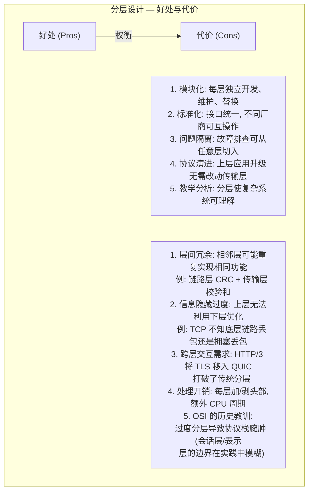

| 好处 | 具体体现 | 工程例子 |
|------|---------|---------|
| 模块化 | 每层可独立开发和测试 | 编写应用层时无需关心网卡驱动 |
| 互操作性 | 不同厂商遵循同一接口规范 | Cisco 路由器与 Juniper 路由器可互操作 |
| 故障隔离 | 从下往上逐层排查 | `ping` (网络层) → `telnet port` (传输层) → curl (应用层) |
| 协议演进 | 上层可独立升级 | HTTP/1.1 → HTTP/2 → HTTP/3, 底层 TCP/UDP 未被替换 |

> **对"分层原则"的总结**：`分层 = 越高层离用户越近、越低层离硬件越近。N 层为 N+1 层提供服务，使用 N-1 层提供的服务。`

**分层在真实工程中的"破坏"案例**：

| 技术 | 跨层行为 | 理由 |
|------|---------|------|
| **TCP 显式拥塞通知 (ECN)** | IP 层标记拥塞，TCP 层接受并响应 | 避免由丢包推断拥塞的低效 |
| **Path MTU Discovery (PMTUD)** | IP 层 ICMP 消息通知传输层 TCP 调整 MSS | 避免分片开销 |
| **QUIC / HTTP/3** | 传输层 (UDP) + 安全 (TLS 1.3) + 应用 (HTTP) 全部合并到用户空间 | 减少队头阻塞, 0-RTT 握手 |
| **DPDK / XDP / eBPF** | 绕过内核协议栈，在用户态或网卡上处理数据包 | 极致性能，NFV 场景 |
| **SR-IOV** | 虚拟化绕过 hypervisor，网卡直接向 VM 暴露硬件队列 | 容器高性能网络 |

这些"破坏"分层的技术恰恰说明了分层的本质是**逻辑抽象**而非**物理约束**。在工程实践中，当性能需求压倒一切时，跨层优化是合理的。

---

### 8. 各层攻击面与红队实战关联

每一层都有独特的攻击面和利用技术。红队渗透测试应在各个网络层上建立攻击思维。

| OSI 层 | 攻击面 | 红队利用技术 | 工具/框架 | 防御技术 |
|--------|-------|------------|----------|---------|
| **物理层** | 信号窃听、线缆搭接、电磁泄漏 | 光纤窃听、TEMPEST 辐射分析、硬件 Keylogger | 硬件嗅探器, HackRF, RTL-SDR | 屏蔽、光电隔离、物理访问控制 |
| **数据链路层** | MAC 欺骗、ARP 欺骗、VLAN 跳跃、STP 操纵 | ARP Spoofing → MITM；MAC Flooding → CAM 表溢出；DHCP Starvation + Rogue DHCP | `arpspoof`, `ettercap`, `yersinia`, `macchanger` | DAI (动态 ARP 检测), DHCP Snooping, Port Security |
| **网络层** | IP Spoofing, ICMP 隧道, 路由注入, IP 分片攻击, Smurf 攻击 | BGP Hijacking; ICMP 隐蔽信道; 源路由攻击; IP 分片绕过防火墙 (Teardrop) | `scapy`, `hping3`, `nmap`, `fragroute`, `nemesis` | 入口过滤 (BCP38), uRPF, IPsec, 防火墙 ACL |
| **传输层** | SYN Flood, TCP 会话劫持, UDP Flood, 端口扫描探测 OS (指纹) | TCP RST 注入; SYN 半开扫描 (`nmap -sS`); TCP 序列号预测攻击; SSL Stripping | `nmap`, `hping3`, `LOIC/HOIC`, `ettercap`, `bettercap` | SYN Cookies, SYN Proxy, 速率限制, TLS 1.3 |
| **会话层** | 会话劫持, RPC 未授权访问, NetBIOS 枚举 | NetBIOS 名查询泄露主机信息; SMB 中继攻击; RPC 空会话枚举 | `enum4linux`, `rpcclient`, `impacket (smbrelayx)` | SMB 签名, RPC 认证, Kerberos |
| **表示层** | SSL/TLS 降级, 不安全的密码套件, 证书伪造 | SSL Stripping, POODLE (降级到 SSLv3), BEAST, CRIME, Heartbleed; 中间人证书注入 | `sslstrip`, `mitmproxy`, `sslscan`, `testssl.sh` | TLS 1.3, HSTS, Certificate Pinning |
| **应用层** | SQLi, XSS, CSRF, SSRF, 命令注入, 文件包含, 反序列化, API 未授权 | Web 漏洞利用; C2 通信伪装 (HTTPS/DNS over HTTPS); DNS 隧道 C2 | `sqlmap`, `Burp Suite`, `Metasploit`, `Cobalt Strike`, `Empire` | WAF, RASP, 输入校验, CSP, 代码审计 |

> **详细内容**参见：[[../red_team/网安基础知识/01-计算机网络基础]] — 红队视角的 OSI 七层攻击与防御详解。本节侧重协议理论框架与实战的映射关系。

**红队常用网络层工具在协议栈中的位置**：

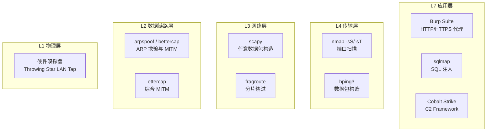

**跨层攻击链** (以 MITM + 凭据窃取为例)：

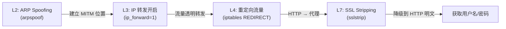

---

### 9. 容器网络与网络体系结构

容器 (Container) 的网络栈本质是 Linux 内核网络子系统 (`net/`) 的 namespace 隔离与虚拟化。理解传统分层模型是理解容器网络的前提。

#### 9.1 容器网络的软件定义层

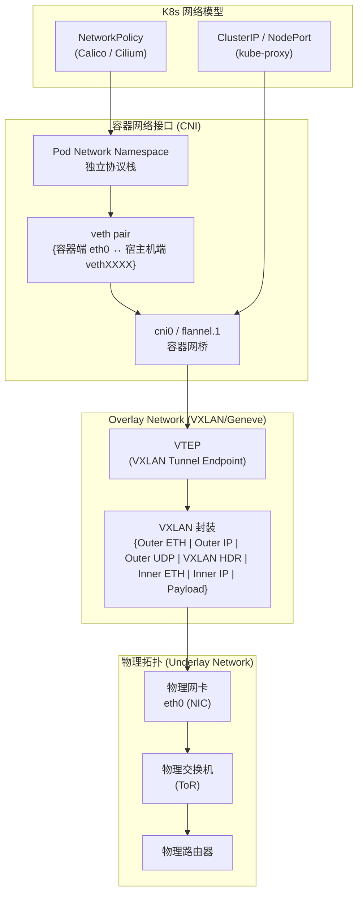

#### 9.2 容器数据包完整路径

以一个 Pod 访问外部互联网为例，数据包在各层的生命周期：

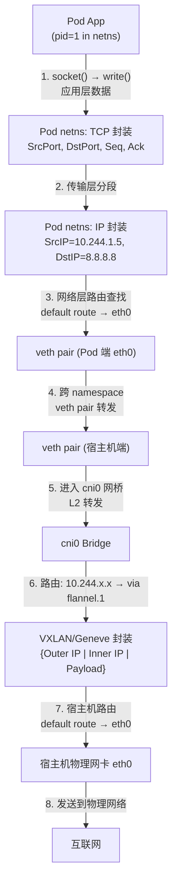

**关键的内核组件**：

| 概念 | 内核实现 | 层映射 |
|------|---------|:----:|
| Network Namespace | `clone(CLONE_NEWNET)` — 独立协议栈：路由表、iptables 规则、网络接口、`/proc/net` | — |
| veth pair | 虚拟以太网设备对，一端在容器 netns，一端在宿主机 netns | L2 (数据链路层) |
| Bridge (cni0/docker0) | 软件实现的 L2 交换机，MAC 学习 + 转发 | L2 |
| iptables / nftables | 内核包过滤框架 — DNAT/SNAT (Service), MASQUERADE (出网) | L3/L4 |
| IPVS (IP Virtual Server) | L4 负载均衡，比 iptables 模式性能更好 (O(1) 调度) | L4 |
| VXLAN / Geneve | Overlay 封装，MAC-in-UDP (VXLAN) | L2 over L3 |
| eBPF (Cilium) | 绕过 iptables，在内核中直接编程处理数据包 | L3/L4/L7 |

#### 9.3 CNI 插件体系

CNI (Container Network Interface) 定义了容器运行时与网络插件之间的接口规范，本质上就是分层模型中**接口 (Interface)** 概念的工程实现。

| CNI 插件 | 网络模型 | Overlay 协议 | 数据平面 | 适用场景 |
|---------|---------|-------------|---------|---------|
| **Flannel** | Overlay (VXLAN/host-gw/UDP) | VXLAN | 内核 VXLAN | 入门级, 简单跨节点通信 |
| **Calico** | L3 BGP 路由 (纯路由) | 无 (纯 IP 路由) | Linux 路由表 / eBPF | 高性能, 大规模集群 |
| **Cilium** | eBPF + 标识感知 | Geneve (可选) | eBPF XDP / TC | 极致性能 + L7 网络策略 |
| **Weave** | VXLAN / sleeve | VXLAN | 内核 / 用户态 sleeve | 简单易用, 加密通信 |
| **Multus** | 多网卡 (Meta-CNI) | — (调度其他 CNI) | 委托其他 CNI | SR-IOV + 多租户 |

**数据平面决策图**：

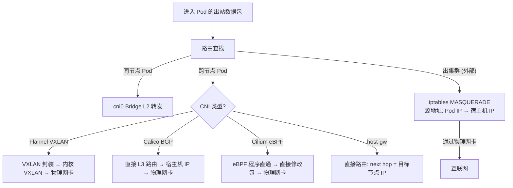

**容器网络与分层模型的映射**：

| 容器网络概念 | 层次 | 对应协议/机制 |
|------------|:------:|-------------------|
| veth pair | L2 | 虚拟以太网, 点对点链路 |
| cni0 / docker0 bridge | L2 | 网桥 (透明桥接, MAC 学习) |
| VXLAN 封装 | L2 over L3 | 隧道封装 (类似 GRE, IPsec) |
| Service ClusterIP (kube-proxy) | L4 (iptables/IPVS) | NAT / 负载均衡 |
| NetworkPolicy | L3/L4 (防火墙) | 包过滤规则 (ACL) |
| Ingress Controller | L7 | 反向代理, TLS 终止, URL 路由 |
| CoreDNS | L7 (应用层) | DNS 服务发现 |
| eBPF tc/XDP | 跨 L2/L3/L4 | 直接操作 `sk_buff`, 绕过协议栈 |

#### 9.4 Overlay 网络的数据包封装层次

VXLAN (典型的容器 Overlay 协议) 的完整数据包结构直观展示了**分层封装**的理念：

```
+-------------------------------------------+
| 物理层: 比特流 (100Gbps 光纤/铜缆)         |
+-------------------------------------------+
| L2: 外部 MAC 头 (Src/Dst MAC)              |   ← 物理网络 (Underlay)
|     EtherType = 0x0800 (IPv4)             |
+-------------------------------------------+
| L3: 外部 IP 头 (Src/Dst IP of host)       |
|     Protocol = 17 (UDP)                   |
+-------------------------------------------+
| L4: 外部 UDP 头 (DstPort = 4789, VXLAN)   |   ← Overlay 封装边界
+-------------------------------------------+
| VXLAN Header: VNI (24-bit Virtual Net ID) |   ← Overlay 标识
+-------------------------------------------+
| L2: 内部 MAC 头 (Pod Src/Dst MAC)          |   ← 容器网络 (Overlay)
|     EtherType = 0x0800 (IPv4)             |
+-------------------------------------------+
| L3: 内部 IP 头 (Pod Src/Dst IP)           |
|     Protocol = 6 (TCP)                    |
+-------------------------------------------+
| L4: 内部 TCP 头 (Src/Dst Port)             |
|     SYN / ACK / PSH / FIN                 |
+-------------------------------------------+
| 应用层: HTTP Request / gRPC / DNS Query     |
+-------------------------------------------+
| FCS (CRC-32)                              |
+-------------------------------------------+
```

**每层协议首部的字节开销**：

| 封装层 | 首部长度 | 累计 |
|--------|:-----:|:----:|
| Pod TCP 首部 | 20-60 B | 20-60 |
| Pod IP 首部 | 20-60 B | 40-120 |
| Pod MAC 首部 | 14 B + 4 (VLAN) | 58-138 |
| VXLAN 首部 | 8 B | 66-146 |
| UDP 首部 | 8 B | 74-154 |
| 外部 IP 首部 | 20 B | 94-174 |
| 外部 MAC 首部 | 14 B | 108-188 |
| **总计 Overlay 开销** | **108-188 B** | — |

这就是容器网络中经常需要调整 **MTU** 的原因：VXLAN 封装增加了 50-74 字节开销，如果 Underlay 网络 MTU 为 1500，则 Pod 内 MTU 应设为 1450 (或以 `PMTUD` 自动协商)。否则会导致 IP 分片或 PMTU 黑洞。

> **相关概念**：overlay、underlay、veth pair、bridge 的完整实现与 `ip netns` 实验操作，参见 [[../内核/]] 和 [[../linux/]] 中的容器网络实战部分。

---

### 10. 跨模块交叉索引

| 概念 | 所属模块 | 链接 |
|------|---------|------|
| 物理层的信号编码、Nyquist/Shannon 定理 | 计算机网络 | [[B_物理层]] |
| 以太网帧格式、MAC 地址、ARP、交换与 VLAN | 计算机网络 | [[C_数据链路层]] |
| IP 协议、路由算法 (RIP/OSPF/BGP)、NAT、ICMP | 计算机网络 | [[D_网络层]] |
| TCP 拥塞控制、三次握手/四次挥手、超时重传 | 计算机网络 | [[E_传输层]] |
| HTTP/DNS/FTP/SMTP 协议实现 | 计算机网络 | [[F_应用层]] |
| 网络协议栈系统调用 (`socket`, `send`, `recv`) | 操作系统 | [[../../操作系统/J_IO管理\|I/O 管理]] |
| 内核协议栈实现 (`net/` 子系统) | 操作系统 | [[../../操作系统/J_IO管理\|I/O 管理]] |
| 网络中断处理与 NAPI 机制 | 操作系统 | [[../../操作系统/J_IO管理\|I/O 管理]] |
| CPU 缓存层级对包处理性能的影响 | 计算机原理 | [[../../计算机原理/B_缓存层级\|缓存层级]] |
| DMA 在网络数据包传输中的应用 | 计算机原理 | [[../../计算机原理/G_输入输出系统\|输入输出系统]] |
| 端序 (字节序) 与网络字节序转换 | 计算机原理 | [[../../计算机原理/A_数据表示\|数据表示]] |
| 红队视角的网络攻击与防御 | 红队 | [[../red_team/网安基础知识/01-计算机网络基础\|01-计算机网络基础]] |
| 渗透测试中网络层利用 (ARP Spoof, MITM, BGP Hijack) | 红队 | [[../red_team/网安基础知识/01-计算机网络基础\|01-计算机网络基础]] |

---

### 11. 关键公式速查

| 公式 | 说明 | 单位 |
|------|------|------|
| `发送时延 = L / R` | L: 分组长度 (bits), R: 链路速率 (bps) | s |
| `传播时延 = d / v` | d: 链路距离 (m), v: 信号速度 (m/s), v (铜缆) ≈ 2×10⁸ m/s | s |
| `总时延 = d_trans + d_prop + d_proc + d_queue` | 四部分独立, 可流水线 | s |
| `时延带宽积 = d_prop × R` | 管道中"飞行中"的比特数 | bits |
| `利用率 U = 吞吐量 / 带宽` | 0 ≤ U ≤ 1 | 无量纲 |
| `排队时延 D = D₀ / (1 - U)` | M/M/1 队列模型近似 | s |
| `丢包率 = N_lost / N_sent` | — | 无量纲 |
| `Nyquist 极限 = 2W log₂(V)` | 无噪声信道最大速率 | bps |
| `Shannon 极限 = W log₂(1 + S/N)` | 有噪声信道最大速率 | bps |
| `(S/N)dB = 10 log₁₀(S/N)` | 信噪比分贝转换 | dB |
| `RTO = SRTT + 4 × RTTVAR` | TCP 超时重传时间估计 | s |
