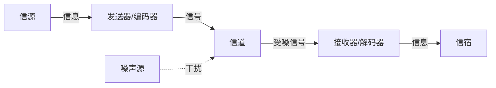
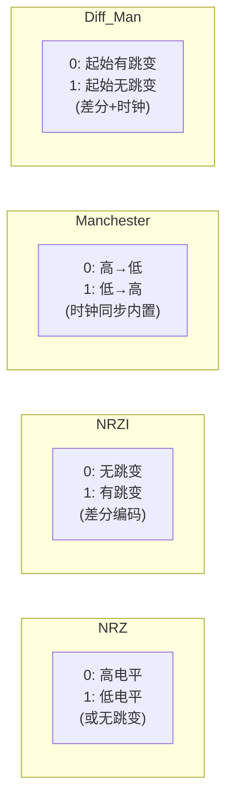
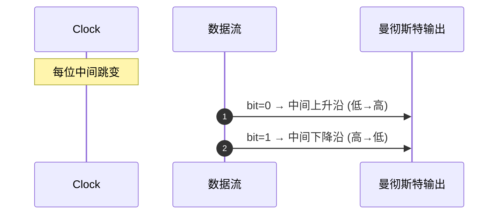
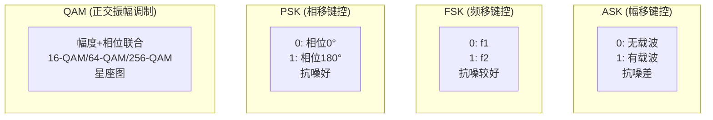
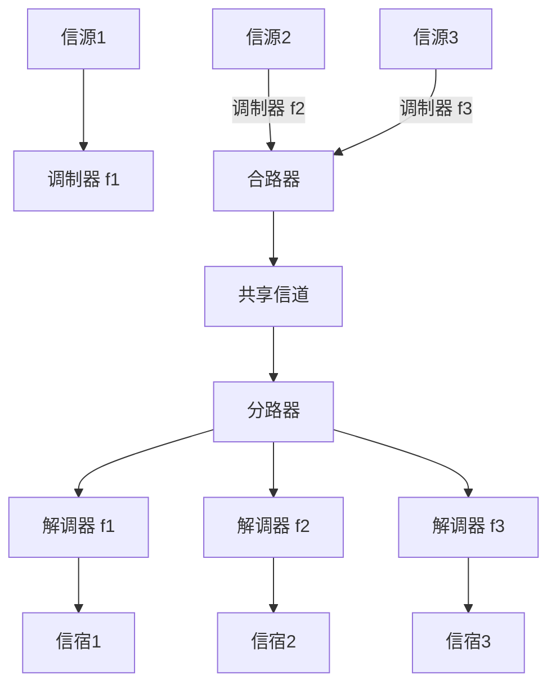

## B -- 物理层

物理层是 OSI 七层模型的最底层，为数据传输提供物理通道，定义机械、电气、功能、规程四大特性。其核心任务：在物理介质上透明传输比特流。

### 通信基础

#### 通信系统模型



- **信源 (Source)**: 产生数据的实体
- **信号 (Signal)**: 数据的电气/电磁表示
- **信道 (Channel)**: 信号传输的物理通路
- **信宿 (Destination)**: 接收数据的实体

#### 信号分类

| 维度 | 模拟信号 | 数字信号 |
|------|---------|---------|
| 取值 | 连续 (连续值) | 离散 (有限离散值) |
| 时间 | 连续时间 | 离散/连续均可 |
| 抗噪 | 差 (噪声积累) | 强 (判决重生) |
| 带宽 | 占用窄 | 占用宽 (理论上无限) |
| 典型介质 | 双绞线、同轴 | 光纤 |

#### 基带 vs 带通 传输

| 类型 | 定义 | 适用信道 | 典型编码 |
|------|------|---------|---------|
| **基带传输** | 直接传输数字信号 (未经载波调制) | 低通信道 (如双绞线以太网) | NRZ, 曼彻斯特 |
| **带通传输** | 将数字信号调制到高频载波上传输 | 带通信道 (如无线、光纤) | ASK, FSK, PSK, QAM |

---

### 奈奎斯特定理 (Nyquist)

**无噪声信道的最大数据传输率**：

$$
C_{max} = 2W \log_2 V \quad \text{(bps)}
$$

其中：
- `W`: 信道带宽 (Hz)
- `V`: 信号离散等级数 (signal levels / 码元数)
- 若无噪声，`2W` 是最大码元速率 (baud rate)

#### 工作示例

**例 1**: 带宽 3kHz 的无噪声信道，使用 4 电平信号。最大数据率？

$$
C = 2 \times 3000 \times \log_2 4 = 6000 \times 2 = 12000 \text{ bps} = 12 \text{ kbps}
$$

**例 2**: 带宽 4kHz 的信道，要达到 32 kbps，最小信号电平数 V 是多少？

$$
32000 = 2 \times 4000 \times \log_2 V \implies \log_2 V = 4 \implies V = 16
$$

**易错点**: 码元速率 (Baud) ≠ 比特率 (bps)。`比特率 = 码元速率 × log2(V)`。若题目给 "码元速率"，先乘以 `log2(V)` 才得 bps；若给 "比特率"，可直接代入奈奎斯特求 V。

---

### 香农定理 (Shannon)

**有噪声信道 (带宽受限、功率受限) 的最大数据传输率**：

$$
C = W \cdot \log_2\left(1 + \frac{S}{N}\right) \quad \text{(bps)}
$$

其中：
- `W`: 信道带宽 (Hz)
- `S/N`: 信噪比 (功率比，线性值，非 dB)
- 该定理给出的是**信道容量上界**，实际编码无法达到

#### dB 转换 (高频考点)

$$
\text{dB} = 10 \cdot \log_{10}\left(\frac{S}{N}\right) \implies \frac{S}{N} = 10^{\text{dB}/10}
$$

| dB | S/N (线性) |
|----|-----------|
| 10 dB | 10 |
| 20 dB | 100 |
| 30 dB | 1000 |
| 40 dB | 10000 |

#### 工作示例

**例 1**: 带宽 3kHz, 信噪比 30 dB。信道容量？

$$
\frac{S}{N} = 10^{30/10} = 1000 \\
C = 3000 \times \log_2(1 + 1000) = 3000 \times \log_2(1001) \approx 3000 \times 9.97 \approx 29.9 \text{ kbps}
$$

**例 2** (奈奎斯特+香农联考): 带宽 4kHz, 信噪比 30dB, 信号电平 V。求达到信道容量所需的最小 V。

$$
\text{(a) 香农: } C = 4000 \times \log_2(1 + 1000) \approx 4000 \times 9.97 \approx 39.9 \text{ kbps} \\
\text{(b) 奈奎斯特: } C \leq 2 \times 4000 \times \log_2 V \implies 39900 \leq 8000 \times \log_2 V \\
\log_2 V \geq 4.9875 \implies V \geq 2^{4.9875} \approx 31.7 \implies V_{min} = 32
$$

> 同时满足两个定理：取**较小者**作为实际可达速率。香农给上限，奈奎斯特给无噪声下 V 决定的限制。

---

### 编码与调制

#### 数字 → 数字 (Digital Encoding)



| 编码方式 | 同步方式 | 效率 | 典型应用 | 优缺点 |
|---------|---------|------|---------|--------|
| **NRZ (不归零)** | 无自同步 | 100% | RS-232 | 长串0/1致DC分量，难同步 |
| **NRZI (差分不归零)** | 无自同步 | 100% | USB | 差分编码但仍有DC问题 |
| **曼彻斯特** | 自同步 (每bit中间跳变) | 50% | 10BASE-T 以太网 | 带宽加倍，同步完善 |
| **差分曼彻斯特** | 自同步 | 50% | 令牌环 (802.5) | 差分+同步；对极性不敏感 |

#### 曼彻斯特波形图 (Mermaid Timing)



#### 数字 → 模拟 (Digital Modulation)



#### QPSK 星座图 (Mermaid)

```mermaid
quadrantChart
 title QPSK 星座图 (2 bit per symbol)
 x-axis I (同相)
 y-axis Q (正交)
 quadrant-1 "00 (45°)"
 quadrant-2 "01 (135°)"
 quadrant-3 "10 (225°)"
 quadrant-4 "11 (315°)"
```

> 每个符号携带 `log2(M)` 位；16-QAM = 4 bit/symbol, 64-QAM = 6 bit/symbol。

#### 模拟 → 数字: PCM (脉冲编码调制)

**三步骤**: 采样 (Sampling) → 量化 (Quantization) → 编码 (Coding)


**采样定理 (Nyquist Sampling Theorem)**:

$$
f_s \geq 2f_{max}
$$

- 若信号最高频率 `f_max`，采样频率 `f_s` 至少为 `2f_max`
- **例**: 语音信号 300~3400 Hz，`f_max=3400`，但 PCM 取 4000 Hz，`f_s=8000 Hz` (电话标准)
- 不满足采样定理将产生**混叠 (Aliasing)**

**量化**: 将采样值映射到有限离散电平。量化级数 `N=2^n`，`n` 为每样本比特数。

**PCM 数据率计算**:

$$
R = f_s \times n
$$

**例**: 电话 PCM: `f_s=8000, n=8` → `R = 64000 bps = 64 kbps` (DS0)

---

### 传输介质

| 介质 | 带宽 | 最大距离 | 抗干扰 | 成本 | 典型应用 |
|------|------|---------|--------|------|---------|
| UTP (Cat5e) | 100 MHz | 100 m | 中 (双绞消除电磁) | 低 | 100BASE-T |
| UTP (Cat6/Cat6a) | 250 / 500 MHz | 100 m | 中 | 低 | 1G / 10G Ethernet |
| STP | 600 MHz | 100 m | 较好 | 中 | 数据中心 |
| 同轴电缆 (RG-6) | 1 GHz | 500 m | 较好 | 中 | DOCSIS/HFC |
| 多模光纤 (MMF) | ~100 THz | 550 m (OM4) | 极好 (无电磁干扰) | 高 | 数据中心短距 |
| 单模光纤 (SMF) | ~100 THz | 120 km+ | 极好 | 高 | 长距离/运营商 |
| 无线电 (WiFi 2.4GHz) | 变 | ~100m (室内) | 差 | 低 | WLAN |
| 无线电 (WiFi 5GHz) | 变 | ~50m (室内) | 中 | 低 | WLAN |

---

### 信道复用 (Channel Multiplexing)

#### FDM — 频分复用



每个用户独占一段频率子带，信道总带宽 = 各子带带宽之和 + 保护间隔。典型应用: AM/FM 广播、ADSL、有线电视。

#### TDM — 时分复用

```mermaid
gantt
 title TDM 时分复用 (3个用户, 4轮)
 dateFormat HH:mm
 axisFormat %H:%M
 section 用户1
 Slot1 :a1, 00:00, 1min
 Slot1 :a4, 00:03, 1min
 Slot1 :a7, 00:06, 1min
 Slot1 :a9, 00:09, 1min
 section 用户2
 Slot2 :b2, 00:01, 1min
 Slot2 :b5, 00:04, 1min
 Slot2 :b8, 00:07, 1min
 section 用户3
 Slot3 :c3, 00:02, 1min
 Slot3 :c6, 00:05, 1min
```



**同步 TDM**: 固定分配时隙，无数据也占用 — 带宽浪费

**统计 TDM (STDM)**: 按需动态分配时隙，需要额外地址标识开销

#### WDM — 波分复用

实质是光纤上的 FDM。不同波长 (λ) 的光承载不同数据流。

- **DWDM** (Dense): 信道间距 < 0.8 nm (约 100 GHz Frequency Grid)，ITU-T G.694.1
- **CWDM** (Coarse): 信道间距 20 nm, 最多 18 个波长

#### CDM — 码分复用

每个站点分配唯一的**码片序列** (Chip Sequence)。发送 `1` 发送原码片，发送 `0` 发送反码片。

**正交码片**: 两个码片向量内积为 0，归一化自相关为 1。

**工作示例**:

给 A 分配 `(–1 –1 –1 +1 +1 –1 +1 +1)`，给 B 分配 `(–1 –1 +1 –1 +1 +1 +1 –1)`。

站 A 发送位 `1`，站 B 发送位 `0`，同时传输。接收方收到的叠加信号：

```
A_send = (–1 –1 –1 +1 +1 –1 +1 +1)
B_send = (+1 +1 –1 +1 –1 –1 –1 +1) ← B send 0 → 取反码片
S_sum = ( 0 0 –2 +2 0 –2 0 +2)
```

接收方解码 A: `S_sum · A = (0×–1 + 0×–1 + –2×–1 + 2×1 + 0×1 + –2×–1 + 0×1 + 2×1)/8 = (0+0+2+2+0+2+0+2)/8 = 8/8 = 1` → 位 `1`

接收方解码 B: `S_sum · B = (0×–1 + 0×–1 + –2×1 + 2×–1 + 0×1 + –2×1 + 0×1 + 2×–1)/8 = (0+0–2–2+0–2+0–2)/8 = –8/8 = –1` → 位 `0`

---

### 宽带接入

#### ADSL (Asymmetric Digital Subscriber Line)

- **非对称**: 下行 (downstream) 带宽远大于上行 (upstream)
- 基于 FDM: 0~4kHz 为传统电话 (POTS), 上行 25~138kHz, 下行 138~1104kHz
- 调制方式: DMT (Discrete Multi-Tone) — 将频谱分成 256 个子信道 (4kHz 每通道)
- 最高速率: ADSL2+ 下行 24 Mbps, 上行不超过 3.5 Mbps

#### FTTH (Fiber to the Home)

- PON (Passive Optical Network): OLT → splitter (无源) → ONU
- EPON (802.3ah): 1 Gbps, Ethernet framed
- GPON (ITU-T G.984): 下行 2.488 Gbps, 上行 1.244 Gbps, GEM framed

#### DOCSIS (Data Over Cable Service Interface Specification)

- 基于 HFC (Hybrid Fiber Coax)
- 下行: 6 MHz 信道, QAM 调制, 最高 DOCSIS 3.1 达 10 Gbps
- 上行: 6.4 MHz 信道, QPSK/16-QAM
- CMTS (Cable Modem Termination System) 负责调度所有 Cable Modem

---

### C 代码: 查询网络接口物理参数

```c
#include <stdio.h>
#include <stdlib.h>
#include <string.h>
#include <unistd.h>
#include <sys/socket.h>
#include <sys/ioctl.h>
#include <net/if.h>
#include <linux/sockios.h>
#include <linux/ethtool.h>

struct ethtool_cmd {
 unsigned int cmd;
 unsigned int supported;
 unsigned int advertising;
 unsigned short speed; /* Mbps */
 unsigned char duplex; /* DUPLEX_HALF=1, DUPLEX_FULL=2 */
 unsigned char port;
 unsigned char phy_address;
 unsigned char transceiver;
 unsigned char autoneg;
 unsigned int maxtxpkt;
 unsigned int maxrxpkt;
 unsigned int reserved[4];
};

#define ETHTOOL_GSET 0x00000001

static int ethtool_get(const char *ifname, struct ethtool_cmd *ecmd) {
 int fd = socket(AF_INET, SOCK_DGRAM, 0);
 if (fd < 0) return -1;

 struct ifreq ifr;
 memset(&ifr, 0, sizeof(ifr));
 strncpy(ifr.ifr_name, ifname, IFNAMSIZ - 1);

 ecmd->cmd = ETHTOOL_GSET;
 ifr.ifr_data = (void *)ecmd;

 if (ioctl(fd, SIOCETHTOOL, &ifr) < 0) {
 close(fd);
 return -1;
 }
 close(fd);
 return 0;
}

int main(int argc, char **argv) {
 const char *ifname = (argc > 1) ? argv[1] : "eth0";
 struct ethtool_cmd ecmd;

 if (ethtool_get(ifname, &ecmd) < 0) {
 perror("ethtool_get");
 return 1;
 }

 /* Speed and Duplex belong to physical layer */
 printf("Interface: %s\n", ifname);
 printf(" Speed : %u Mbps\n", ecmd.speed);
 printf(" Duplex : %s\n",
 ecmd.duplex == 2 ? "Full" : "Half");
 printf(" Auto-Neg: %s\n",
 ecmd.autoneg ? "On" : "Off");
 printf(" Port : %u\n", ecmd.port);

 return 0;
}
```

> 编译: `gcc -o phy_info phy_info.c && sudo ./phy_info eth0`

| 字段 | 含义 | 层层归属 |
|------|------|---------|
| `speed` | 物理层速率 (bps) | 物理层 |
| `duplex` | 半双工/全双工 | 物理层 / [[C_数据链路层\|MAC 子层]] |
| `autoneg` | 自动协商 FLP 脉冲 | 物理层 |

---

### 物理层总结对比

| 定理 | 条件 | 公式 | 决定因素 |
|------|------|------|---------|
| 奈奎斯特 | 无噪声 | `2W log2(V)` | 带宽 W, 电平数 V |
| 香农 | 有噪声 | `W log2(1+S/N)` | 带宽 W, 信噪比 S/N |
| 采样定理 | 模拟→数字 | `f_s ≥ 2f_max` | 信号最高频率 f_max |

**解题套路**: 题目同时给出带宽 W、信噪比 dB、电平数 V → 分别计算香农容量和奈奎斯特速率，取较小者为最终答案。

---

相关笔记: [[A_体系结构]], [[C_数据链路层]], [[D_网络层]], [[E_传输层]]
