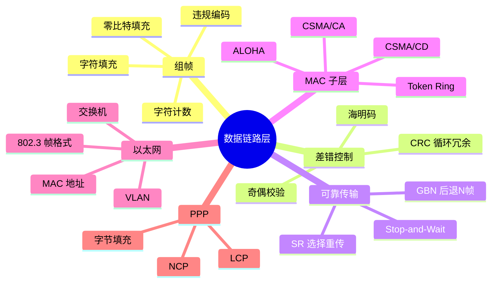
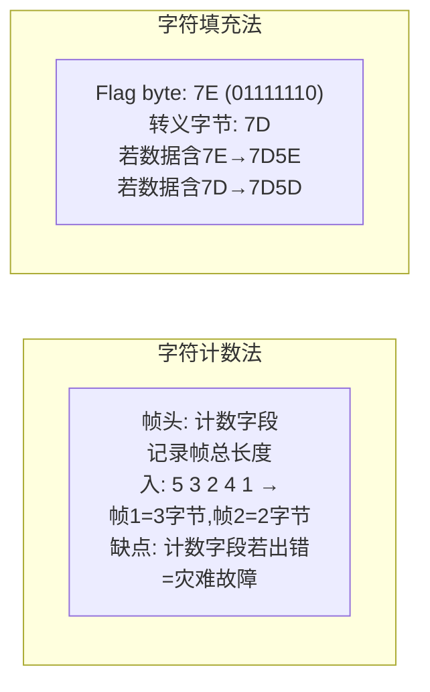
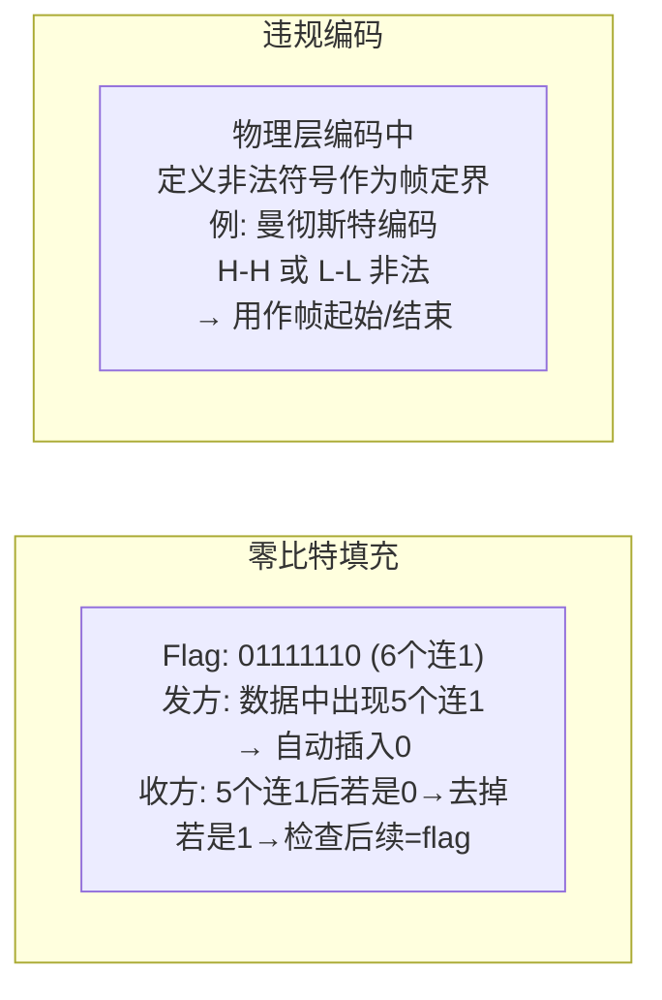
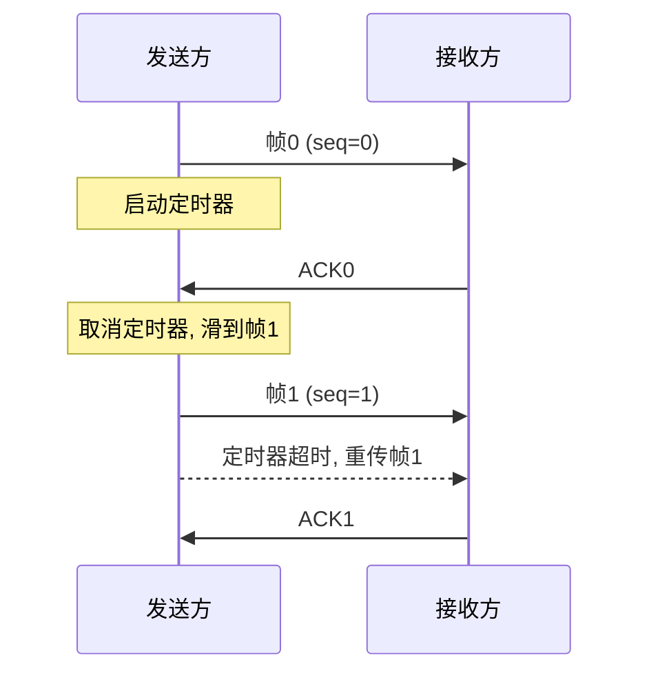
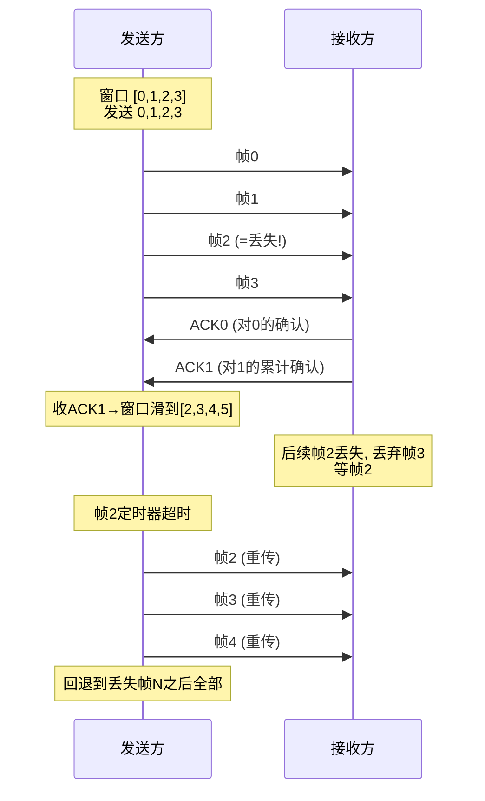
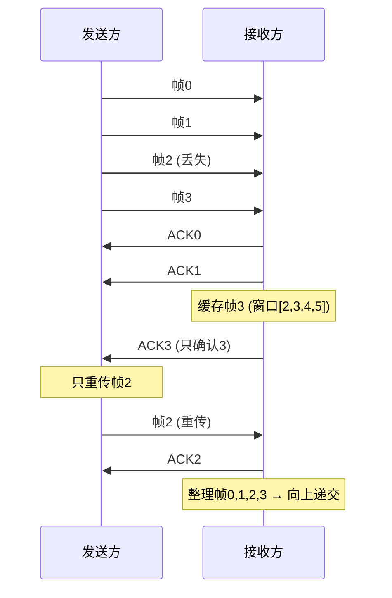
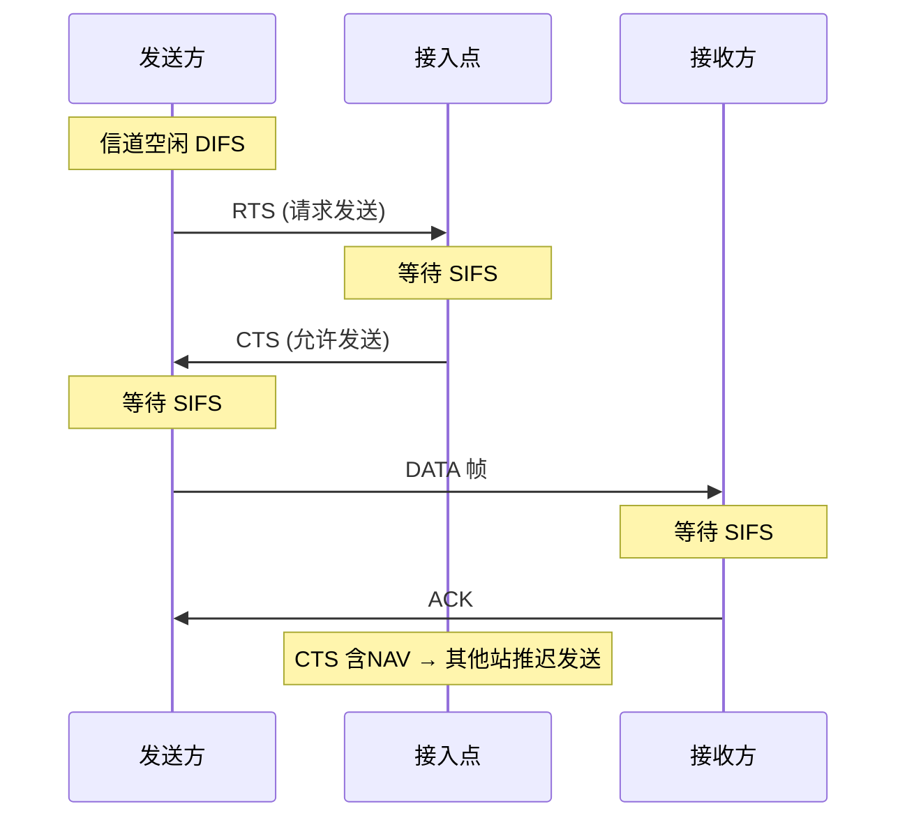
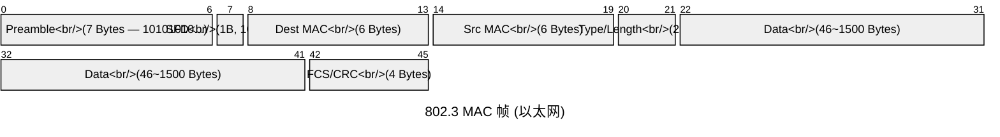
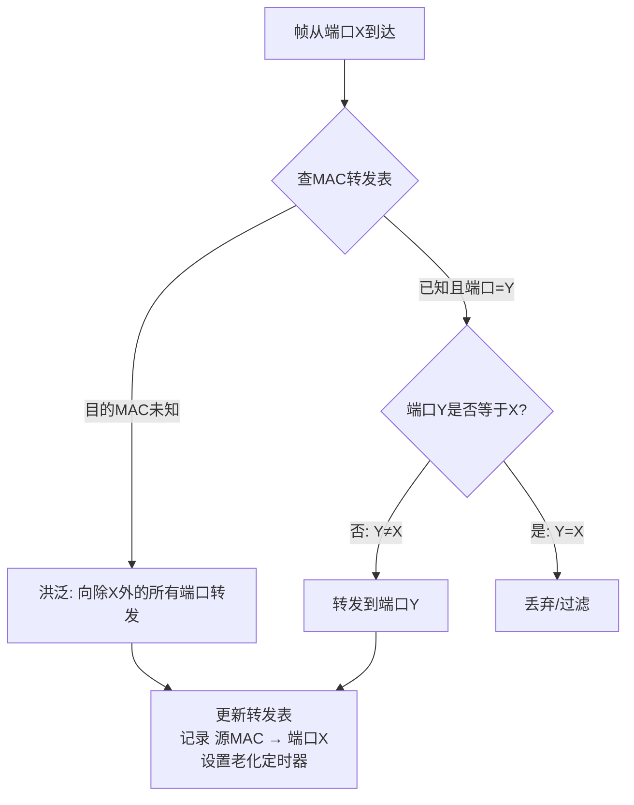
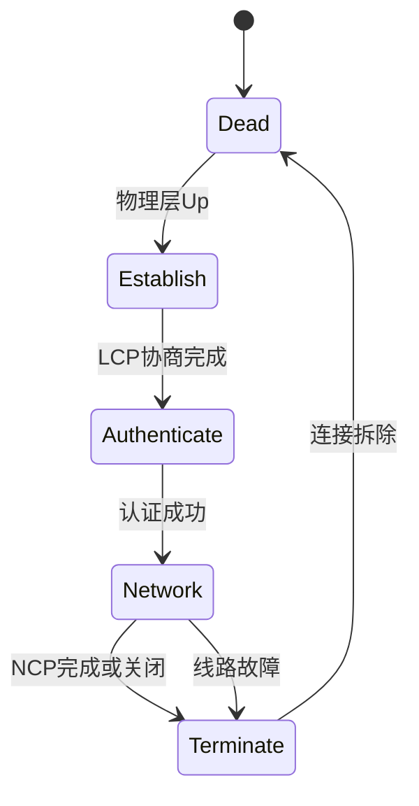

## C -- 数据链路层

数据链路层在物理层提供的非可靠比特传输之上，实现相邻节点间的可靠逻辑链路。核心功能: 组帧 (Framing)、差错控制 (Error Control)、流量控制 (Flow Control)、介质访问控制 (MAC)。



---

### 组帧 (Framing)

物理层交付的是无结构比特流，链路层需要标识帧的边界。

#### 四种组帧方法





| 方法 | 优点 | 缺点 | 代表协议 |
|------|------|------|---------|
| 字符计数 | 实现简单 | 计数字段出错灾难性 | DDCMP |
| 字符填充 | 与数据透明 | 依赖 8-bit 字符 | PPP (字节填充) |
| 零比特填充 | 硬件实现容易 | 额外插入开销 | HDLC, PPP (位填充) |
| 违规编码 | 无额外开销 | 依赖物理层编码 | 令牌环, 802.3 (Preamble/SFD) |

#### 零比特填充示例

```
原始数据:   ...1 1 1 1 1 1 0 1 0...     ← 6个连1  (注意:末尾是flag的情况)
                   ↑ 此处数据中有7个1 → 会触发填充
例:
原始:  01111110 10111111001
           ↑flag
填充后: 01111110 1011111 0 1001  ← 在第5个1后插入0
         |flag|  |---data----|
```

**408 考点**: 判断填充后总长度 = 原数据长度 + 插入的 0-bit 个数。

---

### 差错控制

#### CRC — 循环冗余校验码

**核心思想**: 将 k 位数据视为多项式 `M(x)`，用生成多项式 `G(x)` (r+1 位) 除，得 r 位余数 `R(x)`。发送帧 = `M(x) * 2^r + R(x)`。

#### 标准生成多项式

| CRC 类型 | G(x) 多项式 | G(x) 二进制 | 广泛应用于 |
|----------|-----------|------------|-----------|
| CRC-8 | `x^8 + x^2 + x + 1` | 100000111 | ATM |
| CRC-16-CCITT | `x^16 + x^12 + x^5 + 1` | 10001000000100001 | HDLC, PPP |
| CRC-32 | `x^32 + x^26 + x^23 + ... + 1` | 100000100110000010c... | Ethernet (802.3) |

#### 工作示例 1: 发送端计算 CRC

**数据**: `1101011011` (M = 10-bit)
**生成多项式**: `G(x) = x^4 + x + 1` → `G = 10011` (r = 4)

1. M 后追加 r 个 0: `11010110110000`
2. 模2除法:

```
        11010110110000
   G=10011)11010110110000
           10011           ← XOR
           01001
            10011
            -------
            00000
             10011
             -----
             00000
              10011
              -----
              00000
               10110
               10011
               -----
                0101  (余数4位)
```

3. 发送帧 = `1101011011` + `0101` = `11010110110101`

#### 工作示例 2: 接收方校验

接收方将收到的 `11010110110101` ÷ 10011，余数为 0 → 无差错。

如果第 3 个 bit 翻转 (收到 `11110110110101`)，余数非 0 → 检测到错误。

#### 工作示例 3: CRC 检测能力

| 错误类型 | 检测条件 (G(x) 满足) |
|---------|-------------------|
| 单比特错误 | `G(x)` 至少含两个非零项 (必定) |
| 两个单比特错误 | `G(x)` 不能整除 `x^k+1` (k≤帧长-1) |
| 奇数个错误 | `G(x)` 含因子 `(x+1)` |
| 突发长度 ≤ r | 100% 可检测 |
| 突发长度 = r+1 | 概率 1 - (1/2)^(r-1) |
| 突发长度 > r+1 | 概率 1 - (1/2)^r |

#### 海明码 (Hamming Code)

**校验位数公式** (海明不等式):

$$
k + r + 1 \leq 2^r
$$

其中 `k` = 信息位数，`r` = 校验位数

| k (信息位) | 最小 r (校验位) | 总长度 n=k+r |
|-----------|----------------|-------------|
| 1 | 3 | 4 |
| 4 | 3 | 7 |
| 11 | 4 | 15 |
| 26 | 5 | 31 |

**工作示例: 4位数据 `1011` 的海明编码 (r=3, n=7)**

位置: `1 2 3 4 5 6 7`

校验位 P 位置: `P1(1), P2(2), P3(4)` (2的幂次)

```
位号的二进制:
1 = 001 → 被 P1 覆盖
2 = 010 → 被 P2 覆盖
3 = 011 → 被 P1, P2 覆盖
4 = 100 → 被 P3 覆盖
5 = 101 → 被 P1, P3 覆盖
6 = 110 → 被 P2, P3 覆盖
7 = 111 → 被 P1, P2, P3 覆盖

数据位填入: 位3=D0, 位5=D1, 位6=D2, 位7=D3
We have data 1011, 即 D3 D2 D1 D0 = 1 0 1 1

填入:  位3=D0=1, 位5=D1=1, 位6=D2=0, 位7=D3=1

P1 覆盖 {3,5,7}: 期望偶校验 → P1 = D0⊕D1⊕D3 = 1⊕1⊕1 = 1
P2 覆盖 {3,6,7}: P2 = D0⊕D2⊕D3 = 1⊕0⊕1 = 0
P3 覆盖 {5,6,7}: P3 = D1⊕D2⊕D3 = 1⊕0⊕1 = 0

最终海明码 (7位): P1=1  P2=0  D0=1  P3=0  D1=1  D2=0  D3=1
         位号:   1     2     3     4     5     6     7
         值:     1     0     1     0     1     0     1
```

**纠错过程**: 重新计算校验位并与收到的比对 → 异或得错误位编号。

```
若第5位翻转 (1→0): 码字变 1010001
重新计算校验:
C1 = P1⊕D0⊕D1⊕D3 = 1⊕1⊕0⊕1 = 1
C2 = P2⊕D0⊕D2⊕D3 = 0⊕1⊕0⊕1 = 0
C3 = P3⊕D1⊕D2⊕D3 = 0⊕0⊕0⊕1 = 1

错误位号 = C1·1 + C2·2 + C3·4 = 1+0+4 = 5 → 翻转第5位即可!
```

---

### 可靠传输与滑动窗口

#### Stop-and-Wait (停-等协议)



**信道利用率 (U)**:

$$
U = \frac{T_f}{T_f + 2T_p + T_a}
$$

其中:
- `T_f`: 发送一帧时间 = 帧长 / 带宽
- `T_p`: 传播时延 (Propagation delay) = 距离 / 传播速度
- `T_a`: ACK 发送时间 (通常远小于 `T_f`, 可忽略)

**工作示例**: 1.5Mbps 链路, 45ms 单向延迟, 1KB 帧。

```
T_f = (8 × 1000) / 1.5×10^6 = 8000/1500000 ≈ 5.33 ms
T_p = 45 ms
U = 5.33 / (5.33 + 2×45) = 5.33 / 95.33 ≈ 0.056 = 5.6%
效率极低 → 长肥管道需滑动窗口协议
```

#### GBN — 后退 N 帧 (Go-Back-N)



**关键约束**:

- 发送窗口大小：`W ≤ 2^n - 1` (n = 序列号 bit 数)
- 接收窗口：**始终为 1** (只接收expected帧)
- ACK 类型: 累计 ACK (确认所有序号 ≤ ACK# 的帧)

**工作示例**: 若序列号 3 bit (0~7), 最大发送窗口 = 2^3 - 1 = 7。

#### SR — 选择重传 (Selective Repeat)



**关键约束**:

- 发送窗口 ≤ 接收窗口 ≤ `2^(n-1)` (n = 序列号 bit 数)
- 接收窗口 > 1 (可缓存乱序帧)
- 每个帧独立 ACK

#### 三种协议对比

| 特性 | Stop-and-Wait | GBN (后退N帧) | SR (选择重传) |
|------|:---:|:---:|:---:|
| 发送窗口 | 1 | `2^n-1` | `2^(n-1)` |
| 接收窗口 | 1 | 1 | `2^(n-1)` |
| 需缓存的帧 (接收方) | 0 | 0 | 窗口大小 |
| ACK 类型 | 每帧确认 | 累计ACK | 独立ACK (带NAK可选) |
| 重传触发 | 超时重传当前帧 | 回退到丢失帧重传窗口 | 按需重传单个帧 |
| 出错效率 | 极低 | 低 (高误码时) | 高 |
| 实现复杂度 | 低 | 中 | 高 |

---

### 介质访问控制 (MAC)

#### ALOHA

| 协议 | 最大吞吐量 | 公式推导 |
|------|-----------|---------|
| Pure ALOHA | `S = G · e^(-2G)`, max = 0.184 (18.4%) | 易损期 = 2 帧时 |
| Slotted ALOHA | `S = G · e^(-G)`, max = 0.368 (36.8%) | 易损期 = 1 帧时 |

其中 G = 每帧时产生的帧数 (含新帧和重传帧)。

#### CSMA/CD (802.3 以太网)

```mermaid
flowchart TD
    A[有帧要发送] --> B{侦听信道}
    B -->|空闲| C{1-persistent?}
    C -->|是| D[立即发送]
    C -->|非持续| E[等待随机时间再侦听]
    D --> F{发生冲突?}
    B -->|忙| E
    F -->|是| G[发送JAM信号<br/>binary exponential backoff]
    G --> H[等待重传<br/>k = min(retries, 10)<br/>随机从 0..2^k-1 选]<br/>退避时间 = r × 512bit-time]
    H --> A
    F -->|否| I[发送成功]
```

**冲突检测条件**: 站必须在发送期间能检测到冲突 → 帧长必须足够长。

**最小帧长公式 (408 核心)**:

$$
L_{min} = 2 \cdot T_p \cdot R
$$

其中 `T_p` = 最大传播延迟，`R` = 数据率。

**工作示例**: 10Mbps 以太网, 最大段长度 2500m, 4个中继器, 信号速度 `2×10^8 m/s`。

```
T_p = 2500 / (2×10^8) = 12.5 μs
最大往返延迟 = 2×T_p + 4×中继器延迟 ≈ 51.2 μs
L_min = 51.2μs × 10Mbps = 512 bits = 64 字节
```

即以太网最小帧长 = 64 字节 → 不足须填充 (padding)。

**二进制指数退避**: 第 k 次碰撞后，从 `{0, 1, ..., 2^min(k,10)-1}` 中随机取 r，等待 `r × 512 bit-time`。

#### CSMA/CA (802.11 WiFi)



| IFS 类型 | 时长 | 用途 |
|----------|------|------|
| SIFS (Short IFS) | 最短 | ACK, CTS, 分段帧响应 |
| PIFS (PCF IFS) | 中间 | 轮询 |
| DIFS (DCF IFS) | 最长 (DIFS = SIFS + 2×SlotTime) | 竞争窗口前 |
| EIFS (Extended IFS) | 最短下不使用 | 收到错误帧后 |

---

### 以太网 (Ethernet)

#### 802.3 MAC 帧格式



- **Preamble + SFD**: 8 字节，用于时钟同步和帧起始定界
- **Type/Length**: 若值 ≤1500 → 长度；若值 ≥1536 → EtherType (0x0800=IPv4, 0x0806=ARP, 0x86DD=IPv6)
- **Data**: 最小 46 字节 (含填充)，最大 1500 字节 (MTU)
- **FCS**: CRC-32 校验 (header + data)

#### MAC 地址

| 类型 | 第1字节 Bit0 | 例子 | 含义 |
|------|-------------|------|------|
| Unicast | 0 | `00:1A:2B:3C:4D:5E` | 单播 -> 单个接口 |
| Multicast | 1 (奇数) | `01:00:5E:00:00:01` | 组播 -> 一组接口 |
| Broadcast | 全1 | `FF:FF:FF:FF:FF:FF` | 广播 -> 所有接口 |

#### 交换机 (Switch)



**自学习**: 每收到一帧，记录 `{源MAC, 端口, TTL}` 到转发表。老化时间通常 300s。

**VLAN (802.1Q)**: 4 字节 Tag 插入在 Src MAC 和 Type/Length 之间，含:
- TPID (2B): `0x8100`
- PCP (3 bit): 优先级 (CoS)
- DEI (1 bit): 丢弃指示符
- VID (12 bit): VLAN ID (1~4094)

---

### PPP (Point-to-Point Protocol)



- **LCP** (Link Control Protocol): 建立/拆除链路，协商 MRU/认证协议/压缩等选项
- **NCP** (Network Control Protocol): 每条网络协议一个 NCP (IPCP for IPv4, IPV6CP etc.)
- **字节填充**: Flag `0x7E` → escape `0x7D5E`; Escape `0x7D` → `0x7D5D`; 控制字符 < `0x20` 加 `0x20` 并 prefixed by `0x7D`

**PPP 帧格式**: Flag(0x7E) | Address(0xFF) | Control(0x03) | Protocol(2B) | Data | FCS | Flag(0x7E)

---

### 对容器的意义

#### Linux Bridge

```c
/* 创建 bridge — 类似二层交换机的实现 */
#include <stdio.h>
#include <sys/socket.h>
#include <sys/ioctl.h>
#include <linux/if_bridge.h>
#include <net/if.h>

int create_bridge(const char *brname) {
    int fd = socket(AF_INET, SOCK_DGRAM, 0);
    struct ifreq ifr;
    memset(&ifr, 0, sizeof(ifr));
    strncpy(ifr.ifr_name, brname, IFNAMSIZ - 1);

    /* ioctl 创建 bridge 设备 */
    return ioctl(fd, SIOCBRADDBR, &ifr);
}

int add_if_to_bridge(const char *brname, const char *ifname) {
    int fd = socket(AF_INET, SOCK_DGRAM, 0);
    struct ifreq ifr;
    memset(&ifr, 0, sizeof(ifr));
    strncpy(ifr.ifr_name, brname, IFNAMSIZ - 1);

    struct __bridge_if {
        int ifindex;
        int flags;
    } bif;

    bif.ifindex = if_nametoindex(ifname);
    bif.flags = 0;
    ifr.ifr_data = (char *)&bif;

    return ioctl(fd, SIOCBRADDIF, &ifr);
}
```

#### 容器网络模型

| 技术 | 层次 | 原理 | 典型场景 |
|------|------|------|---------|
| **Linux Bridge** | L2 | 软件交换机，MAC 自学习 | Docker 默认 bridge 网络 |
| **OVS** (Open vSwitch) | L2+ | OpenFlow/OVSDB 可编程交换机 | Kubernetes / OpenStack |
| **macvlan** | L2 | 一物理网卡多 MAC，虚拟子接口 | 低延迟高性能容器网络 |
| **ipvlan** | L2/L3 | 共享 MAC，按 IP 分流 | 云环境 MAC 数受限 |
| **CNI Plugin** | L2+/L3 | 容器网络接口标准 | Kubernetes pod 网络 |

```
默认 docker0 bridge:
  ┌─────────────┐   ┌─────────────┐
  │ Container A │   │ Container B │
  │ veth0       │   │ veth1       │
  └──────┬──────┘   └──────┬──────┘
         │                 │
    ┌────▼─────────────────▼────┐
    │     docker0 bridge         │
    │  (MAC self-learning switch)│
    └────────────┬───────────────┘
                 │              NAT/Port Forwarding
         ┌───────▼────────┐
         │   eth0 (Host)   │
         └────────────────┘
```

---

相关笔记: [[A_体系结构]], [[B_物理层]], [[D_网络层]], [[E_传输层]], [[VLAN 深入]], [[容器网络]]
