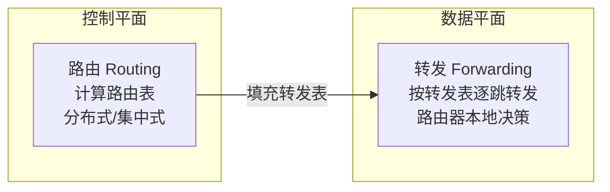
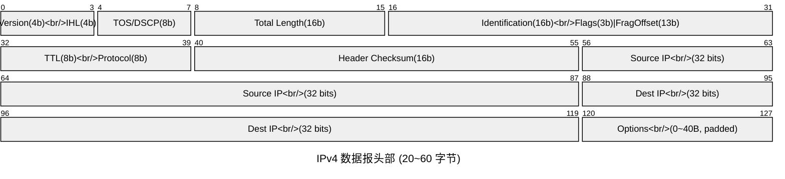
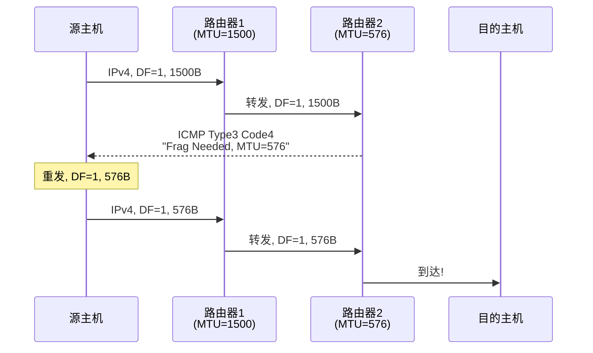
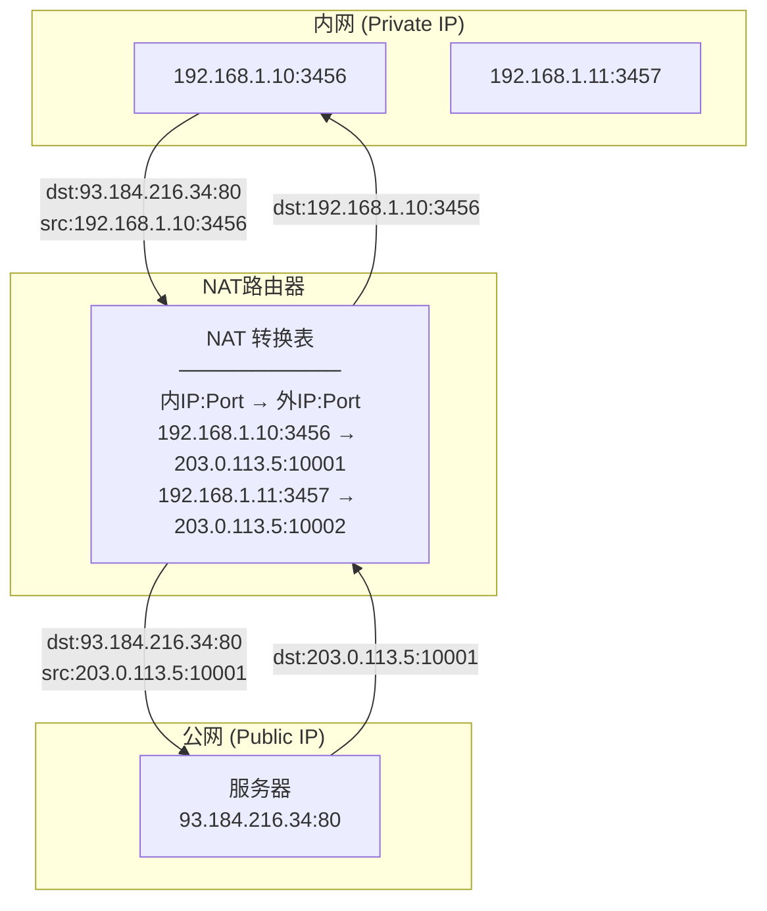
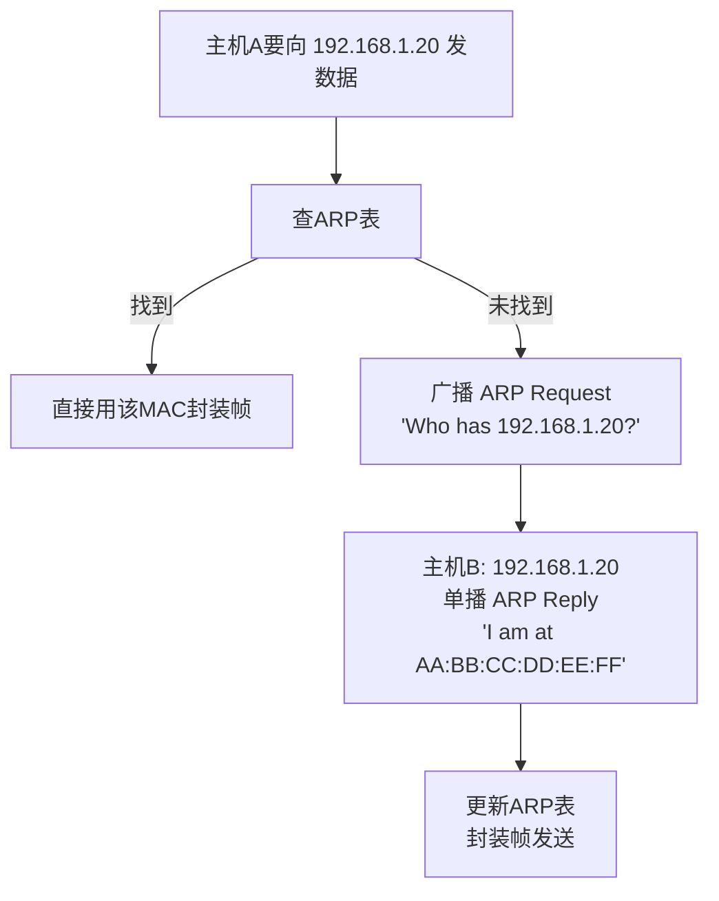
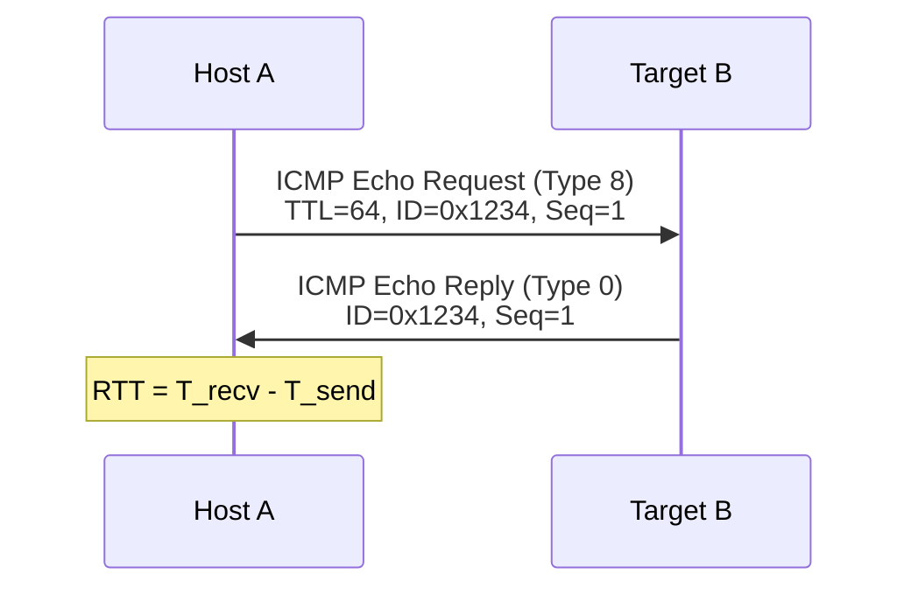
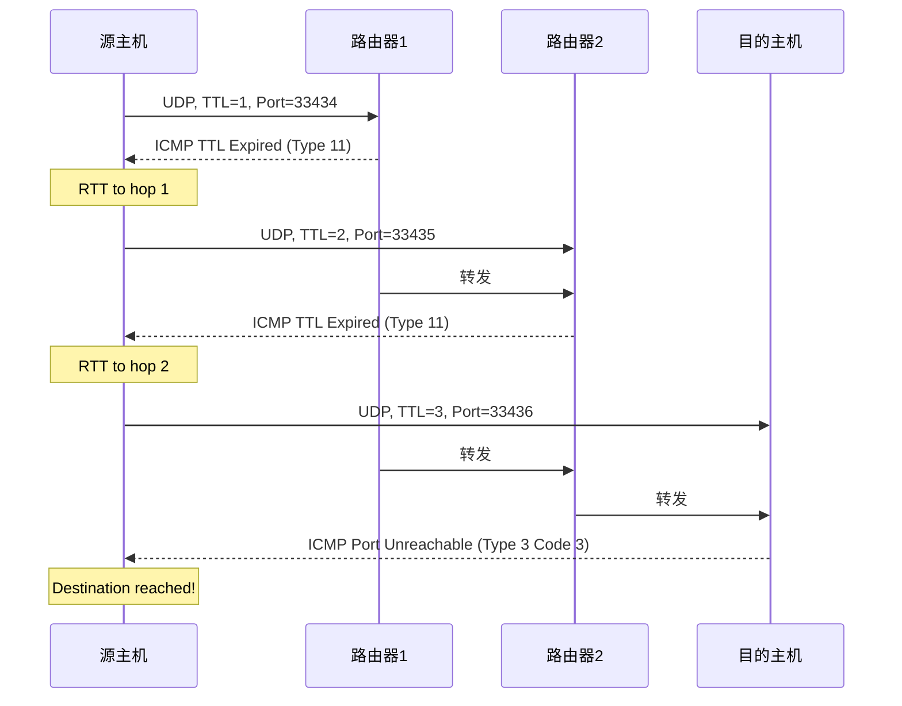
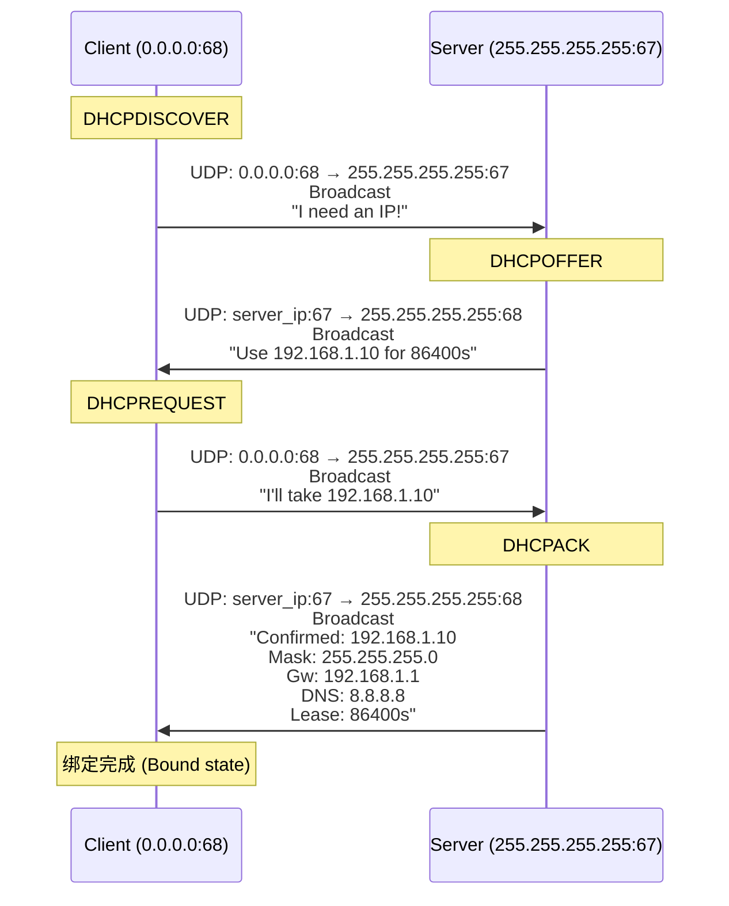
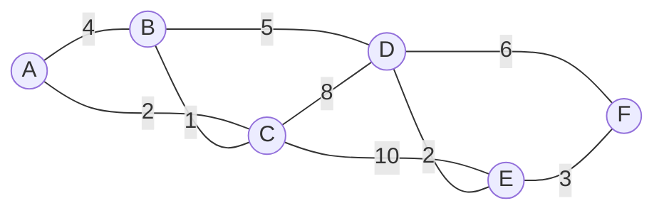
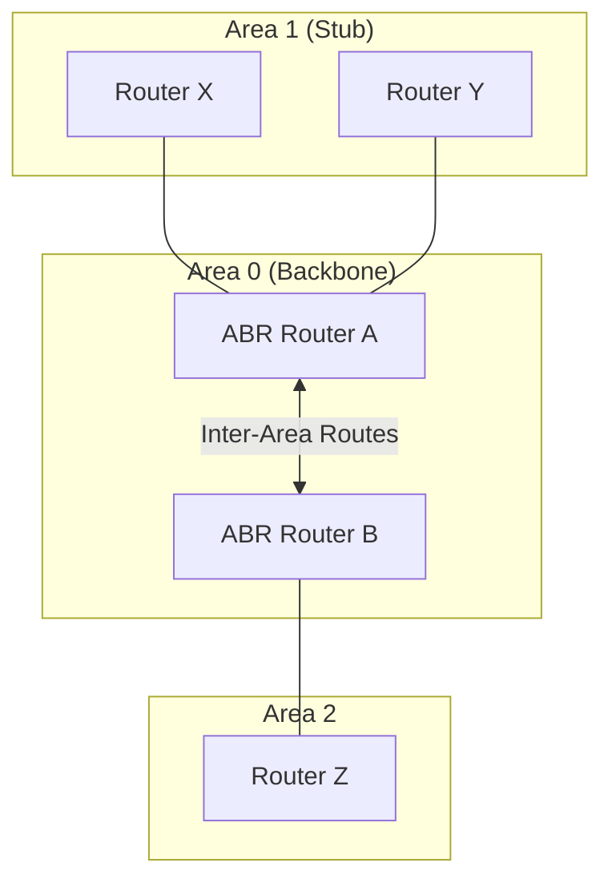

## D -- 网络层

网络层负责将分组从源主机跨越多个网络传送到目的主机。核心功能: 路由选择 (Routing) 与分组转发 (Forwarding)。



---

### 服务模型

| 特性 | 虚电路 (Virtual Circuit) | 数据报 (Datagram) |
|------|-------------------------|-------------------|
| 连接建立 | 需要 (信令) | 无需 (无连接) |
| 路由决策 | 建路时一次确定 | 逐分组 (per-packet) |
| 资源预留 | 需要 | 无需 |
| QoS | 容易保证 | 困难 |
| 代表 | ATM, Frame Relay, MPLS | IP (v4/v6) |
| 分组顺序 | 有序 | 可能乱序 |
| 路由器故障 | 电路断 (需重建) | 自动绕路 (健壮) |

---

### IPv4 数据报格式



| 字段 | 位数 | 含义 |
|------|------|------|
| Version | 4 | 4 = IPv4, 6 = IPv6 |
| IHL | 4 | 头部长度 (单位: 4字节), 最小 5 (20B), 最大 15 (60B) |
| TOS/DSCP | 8 | DiffServ Code Point (DSCP 6b + ECN 2b) |
| Total Length | 16 | IP 数据报总长度 (头部+数据), 最大 65535 字节 |
| Identification | 16 | 分片标识 — 同一原始数据报各分片同ID |
| Flags | 3 | Bit0=保留(0), Bit1=DF(不分片), Bit2=MF(更多分片) |
| Fragment Offset | 13 | 本分片在原始数据中的偏移量, 单位: 8字节 |
| TTL | 8 | 跳数限制, 每路由器-1, 为0时丢弃并回 ICMP |
| Protocol | 8 | 上层协议: 1=ICMP, 6=TCP, 17=UDP, 89=OSPF |
| Header Checksum | 16 | **仅校验头部的 16-bit 反码和** |
| Options | 可变 | 源路由、时间戳、记录路由等 (4字节对齐填充) |

#### IPv4 头部校验和计算

**算法**: 将头部按 16-bit 分组，求反码和 (ones' complement sum)，再取反码。

```c
#include <stdio.h>
#include <stdint.h>

uint16_t ip_checksum(void *ip_header, int ihl_bytes) {
 uint32_t sum = 0;
 uint16_t *p = (uint16_t *)ip_header;

 for (int i = 0; i < ihl_bytes / 2; i++) {
 sum += p[i];
 if (sum > 0xFFFF) { // 进位回卷 (wrap-around carry)
 sum = (sum & 0xFFFF) + (sum >> 16);
 }
 }
 return (uint16_t)(~sum); // 取反码
}

/* 验证: 对整个头部 (含 checksum 字段) 计算应得 0xFFFF */
int verify_ip_checksum(void *ip_header, int ihl_bytes) {
 return ip_checksum(ip_header, ihl_bytes) == 0;
}
```

**工作示例**: IPv4 头部 (20B, 不含 checksum 字段)

```
字段 16-bit组 (hex)
Version/IHL/TOS: 4500
Total Length: 003C (60)
Identification: 1C46
Flags/FragOffset: 4000
TTL/Protocol: 4006 (TTL=64, TCP)
Src IP 高16位: AC10
Src IP 低16位: 0A63
Dst IP 高16位: AC10
Dst IP 低16位: 0A0C

sum = 0x4500+0x003C+0x1C46+0x4000+0x4006+0xAC10+0x0A63+0xAC10+0x0A0C
 = 0x2_9675
wrap: 0x9675 + 0x0002 = 0x9677
checksum = ~0x9677 = 0x6988 → 填入头部
```

---

### IP 分片 (Fragmentation)

分片仅在源端或中间路由器上进行；重组仅在目的端进行。

**Flags**:
- DF (Don't Fragment) = 1 → 不分片；若必须分片则丢弃并回 ICMP (type=3, code=4, "fragmentation needed")
- MF (More Fragments) = 1 → 后续还有分片；最后一个分片 MF=0

**Fragment Offset**: 本片数据在原始数据报中的偏移量，以 **8 字节** 为单位。

#### 工作示例 1: 简单分片

原始数据报: ID=123, Total=4020B (头20B + 数据4000B), MTU=1500B。

```
MTU=1500 → 每片数据最多 1500-20=1480B, 且必须是8的倍数 → 1480 
 (1480/8=185, 1480%8=0 )

分片表:
┌──────┬──────┬────────┬──────┬───────┬──────────┐
│ 分片 │ ID │ 总长 │ MF │ Offset│ 数据范围 │
├──────┼──────┼────────┼──────┼───────┼──────────┤
│ 1 │ 123 │ 1500 │ 1 │ 0 │ 0~1479 │
│ 2 │ 123 │ 1500 │ 1 │ 185 │ 1480~2959│
│ 3 │ 123 │ 1060 │ 0 │ 370 │ 2960~3999│
│ │ │(20+1040)│ │ │ │
└──────┴──────┴────────┴──────┴───────┴──────────┘

验证: 0×8=0B, 185×8=1480B, 370×8=2960B 
验证: 1480+1480+1040=4000B 
```

#### 工作示例 2: 多次分片

原始: ID=456, Total=4780B (头20+数据4760B)

经过第一跳 MTU=1500:
```
片1: 1480B data, Offset=0, MF=1, Total=1500
片2: 1480B data, Offset=185, MF=1, Total=1500
片3: 1480B data, Offset=370, MF=1, Total=1500
片4: 320B data, Offset=555, MF=0, Total=340
 (4760 - 3×1480 = 4760-4440 = 320)
```

经过第二跳 MTU=640:
```
片1 (原片2): 1480B要分片 → MTU=640, data=620B/片 (620%8=4→取616)
片1-1: 616B, Offset=185, MF=1, Total=636
片1-2: 616B, Offset=185+77=262, MF=1, Total=636
片1-3: 248B, Offset=185+154=339, MF=1, Total=268
 (1480-2×616=248, 248%8=0 )

片2 (原片3): 类似分片逻辑...
```

#### 工作示例 3: Path MTU Discovery



---

### IPv4 编址

#### 分类地址 (Classful)

| 类 | 前缀 | 首字节范围 | 网络/主机位 | 网络数 | 每网主机数 |
|----|------|-----------|------------|--------|-----------|
| A | 0 | 1~126 | 8/24 | 126 | 16,777,214 |
| B | 10 | 128~191 | 16/16 | 16,384 | 65,534 |
| C | 110 | 192~223 | 24/8 | 2,097,152 | 254 |
| D | 1110 | 224~239 | 组播地址 | — | — |
| E | 1111 | 240~255 | 保留 | — | — |

#### CIDR (无类域间路由)

格式: `IP地址/前缀长度`

$$2^{\text{32-prefix}} = \text{主机地址数}$$

**工作示例**:

```
192.168.1.0/24 → 子网掩码 255.255.255.0 → 2^8 = 256 个地址 (254主机)
172.16.0.0/12 → 子网掩码 255.240.0.0 → 2^20 = 1,048,576 个地址
10.10.0.0/16 → 子网掩码 255.255.0.0 → 2^16 = 65,536 个地址
```

#### 子网划分 (Subnetting)

**例**: 公司获得 192.168.1.0/24，需 4 个子网，每子网 ≥ 50 台主机。

```
需要: 4 subnet → 借 bits: ceil(log2(4)) = 2
新前缀: 24+2 = /26 → 每子网 2^6-2 = 62 主机 (>50 )
子网掩码: 255.255.255.192
广播地址: 主机位全1

子网列表:
 192.168.1.0/26 (1~62, 广播 .63)
 192.168.1.64/26 (65~126, 广播 .127)
 192.168.1.128/26 (129~190, 广播 .191)
 192.168.1.192/26 (193~254, 广播 .255)
```

#### 路由聚合 (Supernetting)

**例**: 将以下路由聚合成一条:

```
10.0.0.0/24
10.0.1.0/24
10.0.2.0/24
10.0.3.0/24
```

找出前 22-bit 相同 → `10.0.0.0/22` → 精确覆盖 0.0~3.255。

#### 特殊 IPv4 地址

| 地址 | 含义 | 用途 |
|------|------|------|
| `0.0.0.0` | 任意地址 (wildcard) | 默认路由, DHCP Discover 源地址 |
| `127.0.0.0/8` | 回环地址 | 本地 loopback (`127.0.0.1`) |
| `255.255.255.255` | 有限广播 | 本地链路广播 |
| `10.0.0.0/8` | RFC 1918 私有 | 内网 A 类 |
| `172.16.0.0/12` | RFC 1918 私有 | 内网 B 类 |
| `192.168.0.0/16` | RFC 1918 私有 | 内网 C 类 |
| `169.254.0.0/16` | 链路本地 | DHCP 失败 (APIPA) |

---

### NAT (网络地址转换)



| NAT 类型 | 特点 | 转换粒度 |
|----------|------|---------|
| 静态 NAT | 1:1 固定映射 | IP → IP |
| 动态 NAT | 池中分配临时公网IP | IP → IP (动态) |
| PAT / NAPT | 端口映射, 多内网IP共享一个公网IP | IP:Port → IP:Port |

---

### ARP (地址解析协议)



**ARP 报文格式 (28 字节)**:
- Hardware Type (2B): `0x0001` = Ethernet
- Protocol Type (2B): `0x0800` = IPv4
- HAL / PAL (1B): Hardware/Protocol Address Length
- Opcode (2B): 1=Request, 2=Reply
- Src MAC (6B), Src IP (4B), Dst MAC (6B), Dst IP (4B)

**特殊 ARP**:
- **Gratuitous ARP**: 主机启动时广播询问自己的 IP → 检测 IP 冲突 + 更新其他主机的 ARP 缓存
- **Proxy ARP**: 路由器代替不在同一子网的主机回答 ARP Request → 实现透明子网桥接

---

### ICMP (Internet Control Message Protocol)

| Type | Code | 含义 | 触发场景 |
|------|------|------|---------|
| 0 | 0 | Echo Reply | ping 回复 |
| 3 | 0 | Net Unreachable | 路由不可达 |
| 3 | 1 | Host Unreachable | 主机不可达 |
| 3 | 3 | Port Unreachable | UDP 无监听 (traceroute 核心) |
| 3 | 4 | Frag Needed, DF set | PMTUD |
| 5 | 0 | Redirect | 更佳下一跳 |
| 8 | 0 | Echo Request | ping 请求 |
| 11 | 0 | TTL Expired in Transit | traceroute |
| 11 | 1 | Fragment Reassembly Timeout | 分片重组超时 |

#### Ping 过程



#### Traceroute 过程



---

### DHCP (Dynamic Host Configuration Protocol)



**DORA 四步骤**: Discover → Offer → Request → Acknowledge

---

### 路由算法

#### Link State — Dijkstra (LS)



**Dijkstra 工作示例** (源=A):

| 步骤 | N' (已确定) | D(B),p | D(C),p | D(D),p | D(E),p | D(F),p |
|------|------------|--------|--------|--------|--------|--------|
| 0 | {A} | 4,A | **2,A** | ∞ | ∞ | ∞ |
| 1 | {A,C} | **3,C** | — | 10,C | 12,C | ∞ |
| 2 | {A,C,B} | — | — | 8,B | 12,C | ∞ |
| 3 | {A,C,B,D} | — | — | — | **10,D** | 14,D |
| 4 | {A,C,B,D,E} | — | — | — | — | **13,E** |
| 5 | {A,C,B,D,E,F} | — | — | — | — | — |

**A→F 最短路径**: A→C→B→D→E→F = 13

#### Distance Vector — Bellman-Ford (DV)

**Bellman-Ford 方程**:

$$
d_x(y) = \min_v\{c(x, v) + d_v(y)\}
$$

**工作示例**:

初始距离向量:

| 节点 | A | B | C | D |
|------|---|---|---|---|
| A | 0 | 1 | ∞ | ∞ |
| B | 1 | 0 | 2 | ∞ |
| C | ∞ | 2 | 0 | 1 |
| D | ∞ | ∞ | 1 | 0 |

第1轮更新 (各节点交换DV):

| 节点 | A | B | C | D |
|------|---|---|---|---|
| A | 0 | 1 | 3 | ∞ | (via A→B→C = 1+2=3)
| B | 1 | 0 | 2 | 3 | (via B→C→D = 2+1=3)
| C | 3 | 2 | 0 | 1 | (via C→B→A = 2+1=3)
| D | ∞ | 3 | 1 | 0 |

**无穷计数 (Count-to-Infinity) 问题**:

```
初始: A ─1─ B ─1─ C
A认为到C: A→B→C = 2

若B-C链路断开:
 B收到C的无穷通告 → B到C: ∞
 但A的DV说 '我到C=2' → B认为 'A→B→C需要A到B(1) + A告知到C(2)=3' (!!)
 → B更新为3, 告知A → A更新为4... → 无限递增 → 计到无穷
```

**解决方案**:
- **水平分割 (Split Horizon)**: 不向下一跳方向通告该路由 (那为何要告, 我就是你的上游)
- **毒性反转 (Poisoned Reverse)**: 明确将下一跳方向的路由代价设为 ∞
- **触发更新**: 不在周期更新时发, 而是立即发

#### LS vs DV 对比

| 维度 | Link State | Distance Vector |
|------|-----------|----------------|
| 算法 | Dijkstra | Bellman-Ford |
| 全局信息 | 完整拓扑 (LSA flooding) | 邻居距离矢量 |
| 收敛速度 | 快 | 慢 (无限计数) |
| 消息复杂度 | O(nE) | 依赖于拓扑 |
| 路由器负载 | 高 (CPU/Memory) | 较低 |
| 鲁棒性 | 好 (每路由器独立计算) | 较差 (错误传播) |
| 代表协议 | OSPF | RIP |

---

### 路由协议

#### RIP (Routing Information Protocol)

- 基于距离矢量, UDP 端口 520
- 度量 = 跳数 (hop count), 最大 15, 16 = 不可达
- 每 30 秒广播更新 (RIPv1), 或 30 秒组播更新 (RIPv2, addr 224.0.0.9)
- 支持 Split Horizon with Poison Reverse
- 180 秒超时, 再 120 秒后删除 (总计 300s)
- RIPv2 支持子网掩码, 认证, 下一跳

#### OSPF (Open Shortest Path First)



| LSA 类型 | 名称 | 通告者 | 泛洪范围 |
|----------|------|--------|---------|
| Type 1 | Router LSA | 所有路由器 | 本区域内 |
| Type 2 | Network LSA | DR | 本区域内 |
| Type 3 | Summary LSA | ABR | 从本区域到其他区域 |
| Type 4 | ASBR Summary | ABR | 通知 ASBR 位置 |
| Type 5 | External LSA | ASBR | 整个 AS |
| Type 7 | NSSA External | ASBR | NSSA 区域内 |

**OSPF Cost** (思科): `cost = reference_bw / interface_bw` → 例: 100Mbps / 10Mbps = 10

**DR/BDR**: 多路访问网络上选举指定路由器 (DR) 和备份 (BDR), 其他路由器 (DRother) 只与 DR/BDR 形成邻接 → 减少 LSA 泛洪 O(n^2)→O(n)

#### BGP (Border Gateway Protocol)

- **路径矢量** 协议, TCP 端口 179
- eBGP: 不同 AS 间, 直连邻居; iBGP: 同一 AS 内, full mesh 或 Route Reflector
- **属性**:
 - AS_PATH: 经过的 AS 列表 (防环 + 路径选择)
 - NEXT_HOP: 下一跳 IP
 - LOCAL_PREF: 本地偏好 (值大优先), AS 内有效
 - MED (Multi-Exit Discriminator): 多出口区分 (值小优先), 发给邻居 AS
 - Origin: IGP < EGP < Incomplete

#### 三层路由协议对比

| 特性 | RIP | OSPF | BGP |
|------|-----|------|-----|
| 类型 | 内部网关 IGP | 内部网关 IGP | 外部网关 EGP |
| 算法 | Distance Vector | Link State | Path Vector |
| 度量 | 跳数 (≤15) | Cost (带宽相关) | 路径属性 (策略) |
| 收敛速度 | 慢 (30s 更新) | 快 (触发更新) | 慢 (策略复杂) |
| 分层 | 无 (扁平) | 有 (Area) | 有 (AS) |
| 传输层 | UDP 520 | IP 89 | TCP 179 |
| 组播地址 | 224.0.0.9 | 224.0.0.5 & 224.0.0.6 | 单播 TCP |
| 适用规模 | 小型 | 中型—超大型 | 全球 |

---

### IPv6

#### 地址格式与缩写规则

- 128-bit 地址, 冒号十六进制, 8 组
- **缩写**: 省略前导零; `::` 表示一段全零 (仅能用一次)
- **例**: `2001:0db8:0000:0000:0000:ff00:0042:8329` → `2001:db8::ff00:42:8329`

#### IPv6 头部 (固定 40 字节)

| 字段 | 大小 | 含义 |
|------|------|------|
| Version | 4 bit | 6 |
| Traffic Class | 8 bit | 类似 DSCP |
| Flow Label | 20 bit | QoS 流标识 |
| Payload Length | 16 bit | 有效载荷字节数 |
| Next Header | 8 bit | 上层协议或扩展头类型 |
| Hop Limit | 8 bit | = TTL |
| Src Address | 128 bit | 源地址 |
| Dst Address | 128 bit | 目的地址 |

> 无校验和 ! 无分片字段 ! (仅源端可分段)

#### 过渡机制

| 机制 | 原理 | 使用场景 |
|------|------|---------|
| **双栈 (Dual-Stack)** | 节点同时运行 IPv4 和 IPv6 协议栈 | 最直接、推荐 |
| **隧道 (Tunneling)** | IPv6 封装在 IPv4 中 | IPv4-only 骨干网 |
| **NAT64 + DNS64** | IPv6-only 客户端访问 IPv4-only 服务器 | 纯 IPv6 终端 |

---

### 对容器的意义

#### CNI IPAM

CNI (Container Network Interface) 插件负责为容器分配 IP 地址:

```json
{
 "cniVersion": "0.3.1",
 "name": "mynet",
 "type": "bridge",
 "bridge": "cni0",
 "ipam": {
 "type": "host-local",
 "subnet": "10.244.0.0/16",
 "rangeStart": "10.244.1.1",
 "rangeEnd": "10.244.1.254",
 "routes": [
 { "dst": "0.0.0.0/0" }
 ]
 }
}
```

#### Overlay 路由

```
Pod A (10.244.1.5) on Node-1 → Pod B (10.244.2.6) on Node-2

Flannel VXLAN:
 ┌──────────┐ ┌──────────┐
 │ Node-1 │ │ Node-2 │
 │ ┌─────┐ │ │ ┌─────┐ │
 │ │Pod A│ │ VXLAN │ │Pod B│ │
 │ └──┬──┘ │ tunnel │ └──┬──┘ │
 │ │ │<=======>│ │ │
 │ flannel1│ │ flannel1│
 │ 10.244.1.0/24 │ 10.244.2.0/24
 │ │ │ │ │ │
 │ eth0 │ │ eth0 │
 └──────────┘ └──────────┘
```

原始 IP 包 (10.244.1.5 → 10.244.2.6) 被封装在 VXLAN (UDP 4789) 中，外层 IP = Node 物理 IP。

#### kube-proxy: iptables vs IPVS

```mermaid
flowchart LR
 subgraph iptables模式
 direction TB
 I1["SERVICE Chain<br/>-j KUBE-SVC-xxx"]
 I2["KUBE-SVC-xxx<br/>random --probability<br/>-j KUBE-SEP-yyy"]
 I3["KUBE-SEP-yyy<br/>DNAT to Pod IP:Port"]
 end
 subgraph IPVS模式
 direction TB
 P1["IPVS Virtual Server<br/>VIP:Port"]
 P2["Scheduler: rr/wrr/lc/..."
 P3["Real Server: Pod IP:Port"]
 end
```

| 维度 | iptables | IPVS |
|------|----------|------|
| 规则复杂度 | O(n) 链式遍历 | O(1) hash 查找 |
| 规模 | 服务数>1000 时性能急剧下降 | 万级服务保持性能 |
| 调度算法 | 随机 (概率匹配) | 丰富 (rr, wrr, lc, wlc, sh, dh) |
| 连接跟踪 | iptables 内部 | IPVS 维护连接状态表 |

---

### Linux /proc/net: 查看网络层状态

```c
#include <stdio.h>
#include <stdlib.h>
#include <unistd.h>
#include <sys/socket.h>
#include <netinet/in.h>
#include <arpa/inet.h>

int main() {
 int sock = socket(AF_INET, SOCK_DGRAM, 0);

 int ttl;
 socklen_t len = sizeof(ttl);
 if (getsockopt(sock, IPPROTO_IP, IP_TTL, &ttl, &len) == 0)
 printf("Default TTL: %d\n", ttl);

 /* 等价于 cat /proc/sys/net/ipv4/ip_default_ttl */

 int forwarding;
 len = sizeof(forwarding);
 if (getsockopt(sock, IPPROTO_IP, IP_RECVERR, &forwarding, &len) == 0)
 printf("(sent dummy query...)\n");

 /* 等价于 cat /proc/sys/net/ipv4/ip_forward */

 close(sock);
 return 0;
}
```

**常用 /proc/net 文件**:

| 文件 | 内容 | 对应层 |
|------|------|--------|
| `/proc/net/arp` | ARP 表 | 网络层 |
| `/proc/net/route` | 路由表 | 网络层 |
| `/proc/net/dev` | 接口统计 | 数据链路层/物理层 |
| `/proc/sys/net/ipv4/ip_forward` | IP 转发开关 (0=关, 1=开) | 网络层 |

---

相关笔记: [[A_体系结构]], [[B_物理层]], [[C_数据链路层]], [[E_传输层]], [[BGP 详解]], [[OSPF 详解]]
