## E -- 传输层

传输层位于网络层之上、应用层之下，提供**端到端**（end-to-end）的逻辑通信服务。网络层负责主机到主机（host-to-host），传输层负责进程到进程（process-to-process）。[[D_网络层]]提供尽力而为的数据报交付，传输层在此基础上构建可靠性、流量控制和拥塞控制的抽象。

### 传输层核心功能

| 功能 | 机制 | 说明 |
|------|------|------|
| 多路复用/分用 | 端口号 | socket = (src_IP, src_port, dst_IP, dst_port) |
| 端到端可靠传输 | 序列号 + ACK + 重传 | TCP 专有；UDP 不提供 |
| 差错检测 | 校验和 | UDP/TCP 均对头部+数据计算校验和 |
| 流量控制 | 滑动窗口 (rwnd) | 防止发送方淹没接收方 |
| 拥塞控制 | 拥塞窗口 (cwnd) | 防止发送方淹没网络 |

### 端口号

端口是传输层标识进程的 16-bit 整数（0--65535）。

| 范围 | 名称 | 说明 | 绑定权限 |
|------|------|------|---------|
| 0--1023 | Well-known | IANA 分配，标准服务 | root 特权 |
| 1024--49151 | Registered | 商业软件注册使用 | 任意用户 |
| 49152--65535 | Dynamic/Private | 客户端临时端口 (ephemeral) | 任意用户 |

```c
// socket = IP:port 四元组
struct sockaddr_in addr;
addr.sin_family = AF_INET;
addr.sin_addr.s_addr = inet_addr("192.168.1.100");
addr.sin_port = htons(8080);
bind(sockfd, (struct sockaddr *)&addr, sizeof(addr));

// 内核维护的连接标识是五元组 (proto, src_ip, src_port, dst_ip, dst_port)
// /proc/net/tcp 可以看到全部 ESTABLISHED 连接的五元组
```

### UDP -- User Datagram Protocol

UDP (RFC 768) 是最简传输层协议：无连接、无确认、无重传、无流量/拥塞控制。发包即忘（fire-and-forget）。

#### UDP 头部 (8 字节)

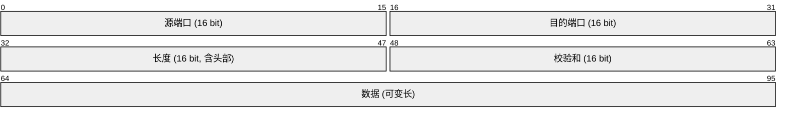

#### UDP 校验和计算

UDP 校验和覆盖**伪头部 + UDP 头部 + 数据**：

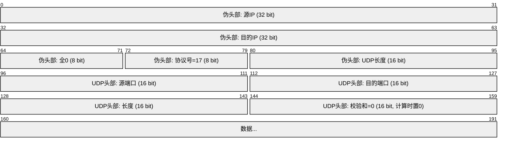

**16-bit 反码求和算法**：

```
输入: 16-bit 字数组 (word[0], word[1], ..., word[N-1])
1. sum = 0
2. for each word w:
 sum = sum + w
 if sum > 0xFFFF: sum = (sum & 0xFFFF) + 1 // 回卷进位
3. checksum = ~sum & 0xFFFF // 取反码
```

**完整示例** -- 计算 UDP 包 (src=10.0.0.1:1234, dst=10.0.0.2:53, data="TEST") 的校验和：

```
伪头部 (12 bytes):
 源IP 10.0.0.1 = 0x0A00 0x0001
 目的IP 10.0.0.2 = 0x0A00 0x0002
 Zeros + Proto=17 = 0x0011
 UDP长度 = 8+4=12 = 0x000C

UDP头部 (8 bytes):
 源端口 1234 = 0x04D2
 目的端口 53 = 0x0035
 长度 12 = 0x000C
 校验和 (先置0) = 0x0000

数据 (4 bytes):
 "TEST" = 0x5445 0x5354

16-bit 求和:
 0x0A00 + 0x0001 = 0x0A01
 0x0A01 + 0x0A00 = 0x1401
 0x1401 + 0x0002 = 0x1403
 0x1403 + 0x0011 = 0x1414
 0x1414 + 0x000C = 0x1420
 0x1420 + 0x04D2 = 0x18F2
 0x18F2 + 0x0035 = 0x1927
 0x1927 + 0x000C = 0x1933
 0x1933 + 0x0000 = 0x1933
 0x1933 + 0x5445 = 0x6D78
 0x6D78 + 0x5354 = 0xC0CC

校验和 = ~0xC0CC & 0xFFFF = 0x3F33
```

接收方将整个 UDP 数据报（含校验和字段）做同样的反码求和。若无差错，结果应为 0xFFFF。

#### UDP 特性

| 特性 | 说明 |
|------|------|
| 面向报文 | 保留应用层报文边界，一次 sendto = 一个 UDP 数据报 |
| 无连接 | 无握手，无状态，可立即发送 |
| 不可靠 | 无 ACK，无重传，无排序 |
| 无拥塞控制 | 可任意速率发送（QUIC 在应用层自行实现） |
| 低开销 | 头部仅 8 字节，无连接状态维护 |
| 支持广播/组播 | TCP 仅支持单播 |

#### UDP 典型应用

| 协议 | 端口 | 为什么选 UDP |
|------|------|-------------|
| DNS | 53 | 单次请求-响应，TCP 握手开销过大 |
| DHCP | 67/68 | 客户端尚无 IP，广播通信 |
| NTP | 123 | 需要低延迟时间同步 |
| RTP | 动态 | 实时音视频流，容忍丢包，拒绝重传延迟 |
| QUIC | 443 | 在 UDP 上实现 TCP 等价功能（HTTP/3） |
| SNMP | 161/162 | 网络管理，轻量查询 |
| TFTP | 69 | 简单文件传输（无盘工作站启动） |

### TCP -- Transmission Control Protocol

TCP (RFC 793) 是面向连接、全双工、面向字节流的可靠传输协议。它向上层提供有序、无差错、无重复、无丢失的数据流抽象。

#### TCP 头部格式 (20--60 字节)

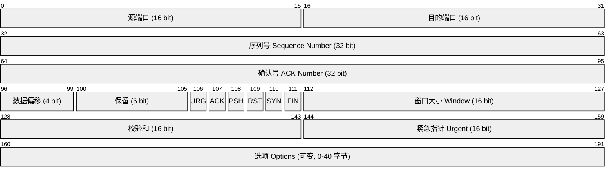

| 字段 | 位宽 | 含义 |
|------|------|------|
| 源端口 / 目的端口 | 16 each | 标识发送/接收进程 |
| 序列号 (Seq) | 32 | 本报文段数据第一个字节的编号（SYN/FIN 消耗一个序号） |
| 确认号 (ACK) | 32 | 期望收到的下一个字节序号（累计确认） |
| 数据偏移 | 4 | 头部长度（4 字节单位），最小 5 (20B)，最大 15 (60B) |
| URG | 1 | 紧急指针有效 |
| ACK | 1 | 确认号有效（连接建立后始终置 1） |
| PSH | 1 | 立即推送数据给应用层（不缓冲） |
| RST | 1 | 复位连接（异常终止） |
| SYN | 1 | 同步序列号（建立连接） |
| FIN | 1 | 发送方数据发送完毕（释放连接） |
| 窗口 | 16 | 接收窗口大小 (rwnd)，用于流量控制 |
| 校验和 | 16 | 同 UDP 伪头部方案（协议号=6） |
| 选项 | 可变 | MSS, Window Scale, SACK, Timestamp 等 |

**常见 TCP 选项**：

| 选项 | Kind | 长度 | 用途 |
|------|------|------|------|
| MSS (Maximum Segment Size) | 2 | 4 | SYN 中协商最大报文段长度 |
| Window Scale | 3 | 3 | 窗口缩放因子 (左移 0--14)，突破 64KB 窗口限制 |
| SACK-Permitted | 4 | 2 | 声明支持选择性确认 |
| SACK | 5 | 可变 | 报告已收到的非连续块 |
| Timestamp | 8 | 10 | RTTM (RTT 测量) 和 PAWS (防回绕) |

#### TCP 套接字

```c
// TCP socket 创建
int fd = socket(AF_INET, SOCK_STREAM, 0);

// TCP_NODELAY: 禁用 Nagle 算法
int flag = 1;
setsockopt(fd, IPPROTO_TCP, TCP_NODELAY, &flag, sizeof(flag));

// SO_KEEPALIVE: TCP 保活探测
flag = 1;
setsockopt(fd, SOL_SOCKET, SO_KEEPALIVE, &flag, sizeof(flag));

// TCP 快速打开 (TFO): 减少握手 RTT
flag = 5; // max pending TFO cookies
setsockopt(fd, IPPROTO_TCP, TCP_FASTOPEN, &flag, sizeof(flag));

// Linux 特有: TCP_CORK 合并小包
flag = 1;
setsockopt(fd, IPPROTO_TCP, TCP_CORK, &flag, sizeof(flag));
```

### TCP 连接管理

#### 三次握手 (Three-Way Handshake)

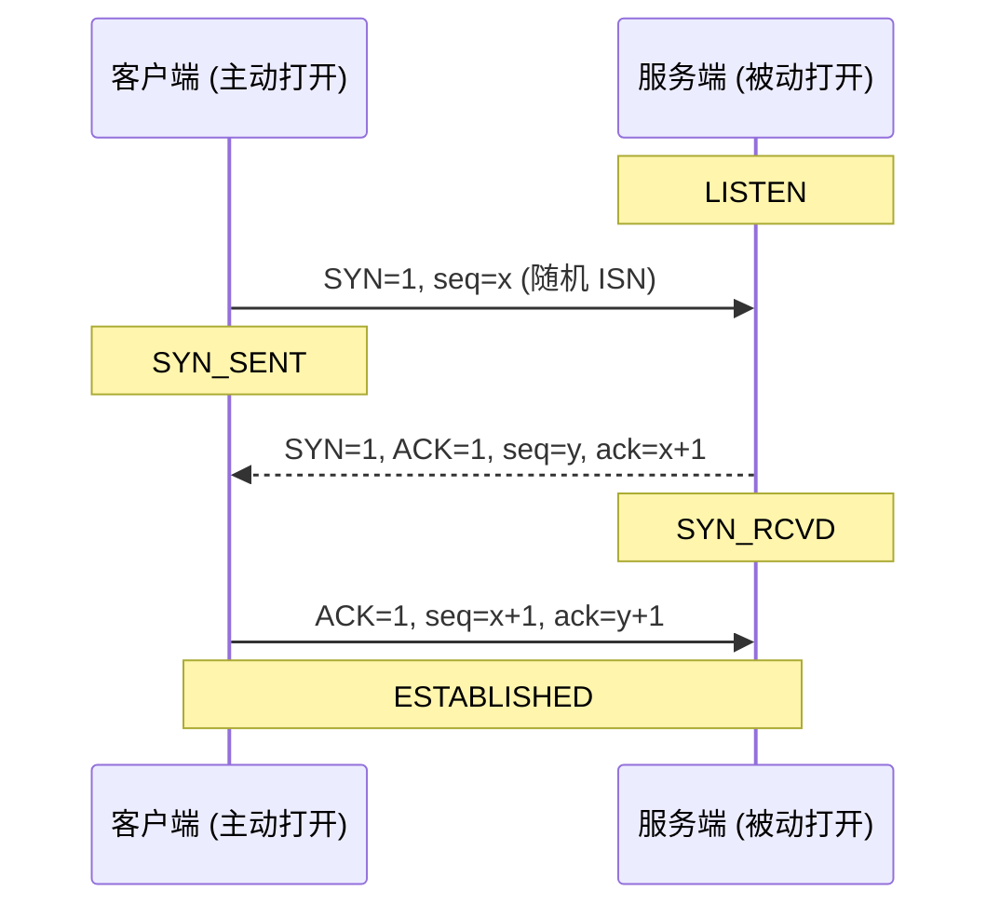

**握手细节**：

1. **SYN (C→S)**：客户端选择随机 ISN=x，SYN=1，无数据，消耗一个序号。
2. **SYN+ACK (S→C)**：服务端选择随机 ISN=y，SYN=1，确认号 ack=x+1。服务端分配连接资源（TCB，传输控制块）。
3. **ACK (C→S)**：客户端确认服务端 SYN，连接建立。此时可携带数据。

**为什么是三次？** 防止已失效的连接请求报文突然传到服务端，导致服务端错误地建立连接。若只有两次握手，服务端收到已过期的 SYN 后会立即进入 ESTABLISHED 并分配资源，但客户端已不需要此连接。

**SYN Flood 攻击**：攻击者发送大量 SYN 但不完成第三次握手，耗尽服务端 SYN 队列（半连接队列，/proc/sys/net/ipv4/tcp_max_syn_backlog）。防御：SYN Cookie，当队列满时用加密 cookie 代替状态存储，在收到最终 ACK 后重建连接。

#### 四次挥手 (Four-Way Handshake)

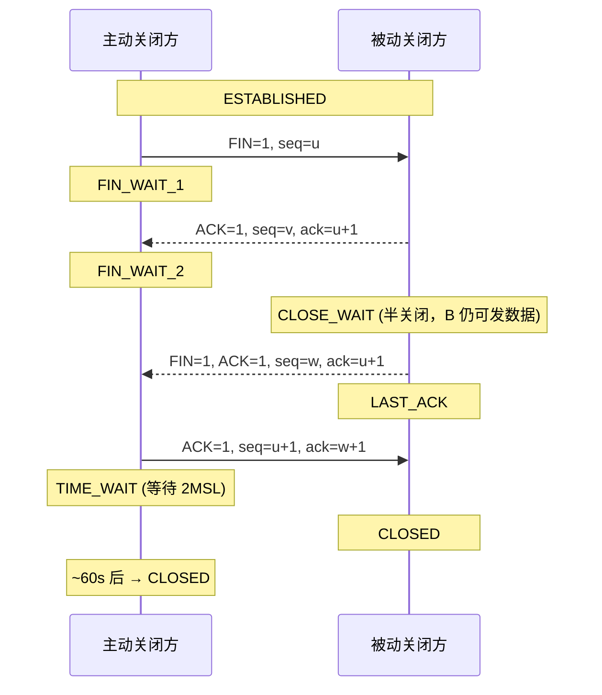

**为什么是四次？** TCP 是全双工的，每个方向需独立关闭。收到 FIN 意味着"对方没有数据要发了"，但己方可能仍有数据在发送队列中。因此先回 ACK，数据发完后再发 FIN。

#### TIME_WAIT 状态

TIME_WAIT 持续 **2MSL**（Maximum Segment Lifetime，典型值 60s）。

| 目的 | 说明 |
|------|------|
| 确保最后一个 ACK 到达 | 若 ACK 丢失，对方会重传 FIN，己方可重传 ACK |
| 让旧连接报文从网络中消失 | 防止旧连接的迟到报文被新连接误收 |

```bash
# 查看 TIME_WAIT 连接数
ss -tan state time-wait | wc -l

# 内核参数调整
# /proc/sys/net/ipv4/tcp_tw_reuse = 1 允许复用 TIME_WAIT socket
# /proc/sys/net/ipv4/tcp_fin_timeout = 30 FIN_WAIT_2 超时
```

#### TCP 状态机 (完整)

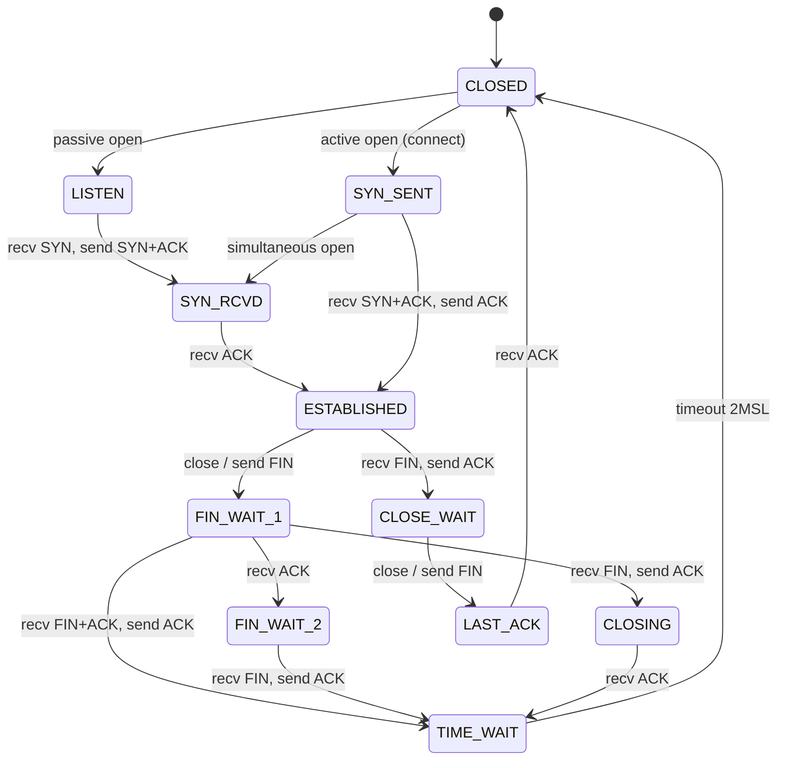

### TCP 可靠传输

#### 停止等待协议 (Stop-and-Wait)

发一个报文段等一个确认，超时重传。TCP 使用流水线协议（pipelining），允许发送多个未确认报文段，但核心机制基于停止等待的逻辑。

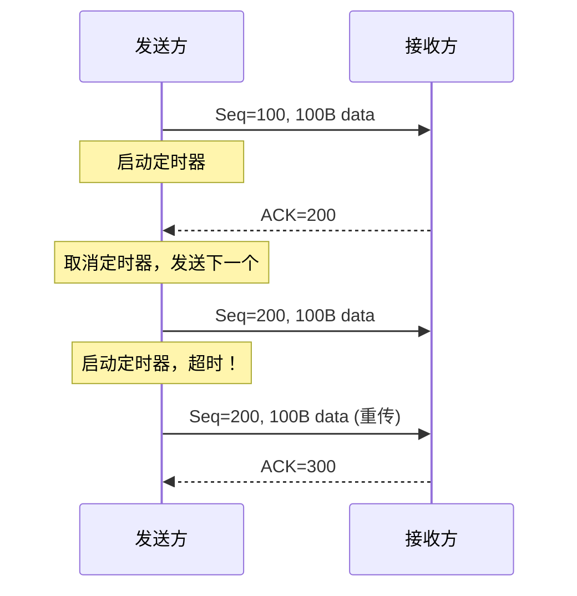

#### 累积确认 (Cumulative ACK) vs 选择性确认 (SACK)

| 机制 | 工作原理 | 优点 | 缺点 |
|------|---------|------|------|
| 累积 ACK | ACK=N 表示前 N-1 字节全部收到 | 简单，单个确认丢失不致命 | 丢失 = 重传窗口内全部已发数据 |
| SACK | 在 TCP 选项中报告已收到的非连续块 | 只需重传真正丢失的段 | 需双方支持，头部开销 |

```
累积 ACK 示例:
 发送: 1, 2, 3, 4, 5
 接收: 1, 3, 4, 5 (2 丢失)
 回复: ACK=2 (每次均 ACK=2)
 重传: 2
 收到 2 后: ACK=6 (一次性确认 1-5)

SACK 示例:
 发送: 1, 2, 3, 4, 5
 接收: 1, 3, 4, 5 (2 丢失)
 回复: ACK=2, SACK=3-6 (告知已收到 3-5)
 重传: 仅重传 2
```

#### 重传超时 (RTO) 计算 -- Jacobson/Karels 算法

TCP 必须根据网络状况动态计算 RTO。固定定时器要么太短导致虚假重传，要么太长导致效率低下。

```
测量: 每次收到新 ACK (非重传 ACK) 时，测量 SampleRTT

SRTT (平滑 RTT):
 SRTT = (1 - α) * SRTT + α * SampleRTT
 (RFC 6298: α = 1/8, 即 SRTT = 0.875*SRTT + 0.125*SampleRTT)

RTTVAR (RTT 偏差):
 RTTVAR = (1 - β) * RTTVAR + β * |SampleRTT - SRTT|
 (RFC 6298: β = 1/4)

RTO:
 RTO = SRTT + max(G, K * RTTVAR)
 (K = 4, G = clock granularity)

初始值: RTO = 1 秒；首次测量后使用公式。

Karn 算法: 对重传的报文段不做 RTT 采样 (因为无法区分 ACK 是确认原报文还是重传报文)。
 每次重传后 RTO 翻倍 (指数退避)，直到收到非重传 ACK 后重新使用公式计算。
```

#### 快速重传 (Fast Retransmit)

收到 **3 个重复 ACK**（即共 4 个相同 ACK）时，不等超时立即重传丢失的报文段。因为 3 个 dup ACK 说明后续报文段仍在到达，网络未完全拥塞。

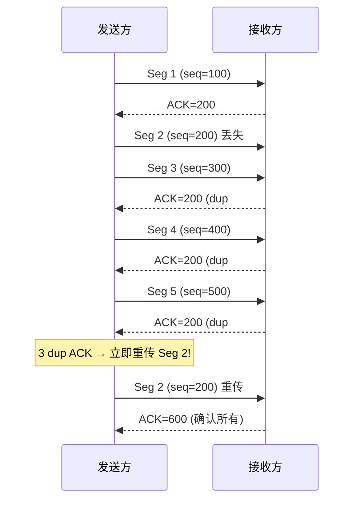

### TCP 流量控制

#### 滑动窗口协议

接收方通过 TCP 头部中的 **窗口字段**（16 bit，0--65535；Window Scale 选项可扩展到最大约 1GB）告知发送方自己缓冲区的剩余空间（rwnd）。发送方未确认的数据量不得超过 rwnd。

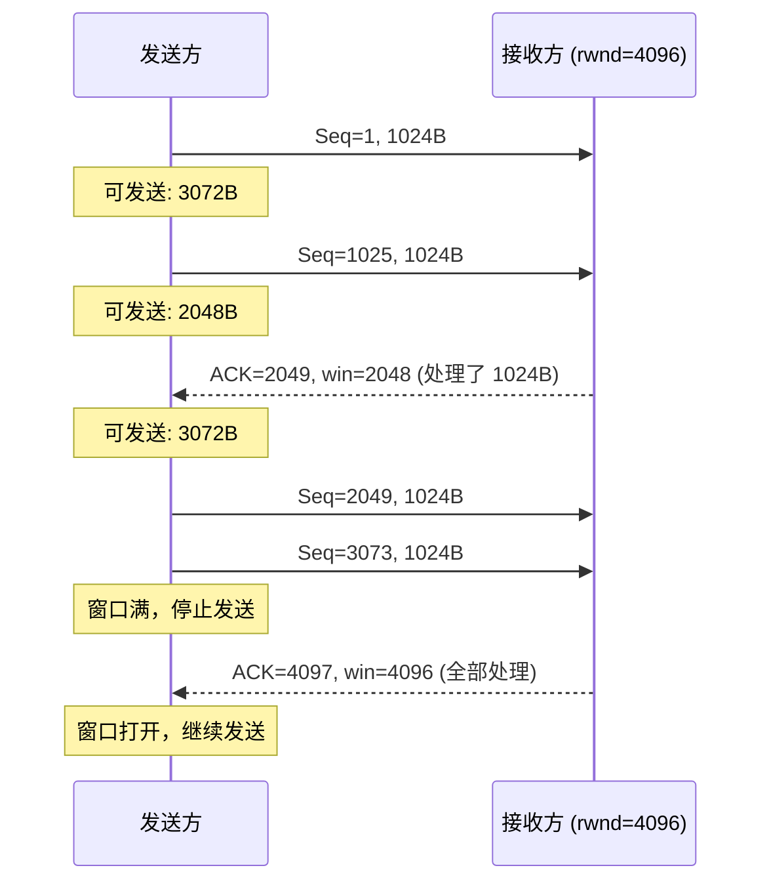

#### 关键机制

| 问题 | 机制 | 说明 |
|------|------|------|
| Silly Window Syndrome | Clark 方案：接收方不发送小窗口通告（< MSS 或 < 缓冲区的 1/4） | 避免每次只通告 1 字节 |
| Silly Window Syndrome | Nagle 算法：发送方在收到前一 ACK 前，若数据 < MSS 则延迟发送 | 减少小包（telnet类型流量例外） |
| 零窗口探测 | 发送方定期发送 1 字节探测报文（Zero Window Probe） | 防止窗口更新报文丢失导致死锁 |

```c
// Nagle 算法本质上聚合小写操作
// 以下两行在 Nagle 开启时可能合并为一个包：
write(fd, buf, 1); // 第 1 字节：立即发送（窗口允许时）
write(fd, buf, 1); // 第 2 字节：延迟等待 ACK 或积累到 MSS

// TCP_NODELAY 禁用 Nagle：
setsockopt(fd, IPPROTO_TCP, TCP_NODELAY, &(int){1}, sizeof(int));
```

### TCP 拥塞控制

拥塞控制是 TCP 最核心最精彩的算法。网络层不提供拥塞信息，TCP 必须在端系统自行推断网络状况。

#### 核心变量

| 变量 | 含义 | 初始值 |
|------|------|--------|
| cwnd (Congestion Window) | 拥塞窗口，限制发送方未确认数据的最大量 | 1 MSS (Linux 3.x+ 通常 10 MSS 通过 initcwnd) |
| ssthresh (Slow Start Threshold) | 慢开始门限，cwnd 超过此值进入拥塞避免 | 通常 64KB (65535) |
| rwnd (Receiver Window) | 接收方通告窗口 | 由接收方决定 |
| 有效窗口 | min(cwnd, rwnd) | -- |

#### 慢开始 (Slow Start)

cwnd 每经过一个 RTT 翻倍（指数增长）。**每收到一个 ACK，cwnd += 1 MSS**。

```
RTT 0: cwnd = 1 MSS, 发送 1 段
RTT 1: cwnd = 2 MSS, 发送 2 段 (收到 2 个 ACK，每个 +1)
RTT 2: cwnd = 4 MSS, 发送 4 段
RTT 3: cwnd = 8 MSS, 发送 8 段
...
```

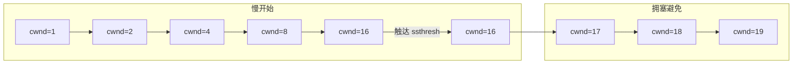

#### 拥塞避免 (Congestion Avoidance)

cwnd 每经过一个 RTT 线性增加 1 MSS。**每收到一个 ACK，cwnd += (1/cwnd) MSS**（即 cwnd 个 ACK 加 1 MSS）。此为 AIMD 中的 Additive Increase。

#### 超时 (Timeout) 处理 -- Tahoe

1. ssthresh = max(cwnd/2, 2 MSS)
2. cwnd = 1 MSS
3. 重新进入慢开始

#### 快速重传 + 快速恢复 -- TCP Reno

收到 3 个重复 ACK（未超时）时，不将 cwnd 降为 1：

1. ssthresh = cwnd / 2
2. cwnd = ssthresh + 3 MSS（3 个 dup ACK 说明 3 个段已离开网络）
3. 重传丢失报文段
4. **快速恢复**：每收到一个 dup ACK，cwnd += 1 MSS（又有数据离开网络）
5. 收到新 ACK 后，cwnd = ssthresh，进入拥塞避免

#### 完整 TCP Reno 时序追踪

```
场景: MSS=1KB, ssthresh 初始=64KB, RTT 恒定=1 单位

RTT | 事件 | cwnd (KB) | ssthresh | 状态
----|----------------------|-----------|----------|----------
 0 | 连接建立 | 1 | 64 | 慢开始
 1 | 收 1 ACK | 2 | 64 | 慢开始
 2 | 收 2 ACK | 4 | 64 | 慢开始
 3 | 收 4 ACK | 8 | 64 | 慢开始
 4 | 收 8 ACK | 16 | 64 | 慢开始
 5 | 收 16 ACK | 32 | 64 | 慢开始
 6 | 收 32 ACK | 64 | 64 | 拥塞避免 (cwnd >= ssthresh)
 7 | 收 64 ACK | 65 | 64 | 拥塞避免
 8 | 收 65 ACK | 66 | 64 | 拥塞避免
 9 | 超时! | 1 | 33 | 慢开始 (ssthresh=66/2=33)
10 | 收 1 ACK | 2 | 33 | 慢开始
11 | 收 2 ACK | 4 | 33 | 慢开始
12 | 收 4 ACK | 8 | 33 | 慢开始
13 | 收 8 ACK | 16 | 33 | 慢开始
14 | 收 16 ACK | 32 | 33 | 慢开始
15 | 3 dup ACK (快速重传) | 17 | 16 | 快速恢复 (cwnd=32/2+3=19→收到新ACK后=16)
16 | 收到新 ACK, 退出恢复 | 16 | 16 | 拥塞避免
17 | 收 16 ACK | 17 | 16 | 拥塞避免
```

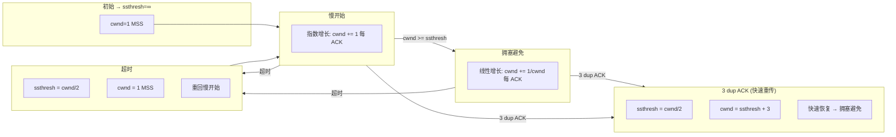

#### TCP Tahoe vs Reno vs NewReno vs CUBIC

| 算法 | 重复 ACK | 超时 | 特点 |
|------|---------|------|------|
| **Tahoe** | 慢开始 (cwnd=1) | 慢开始 (cwnd=1) | 最早实现，单包丢失后性能差 |
| **Reno** | 快速恢复 (cwnd=ssthresh+3) | 慢开始 (cwnd=1) | 单包丢失效率高，多包丢失退化 |
| **NewReno** | 快速恢复改进（等待所有丢失段恢复后退出） | 慢开始 | 多包丢失仍保持吞吐 |
| **CUBIC** | 三次函数增长（cwnd=C*(t-K)^3+W_max） | 同超时 | Linux 默认，高带宽延迟积网络友好 |
| **BBR** | 不做基于丢包的判断，改为基于带宽+RTT 建模 | 同 | Google 提出，BDP 网络中吞吐远优于 CUBIC |

#### 显式拥塞通告 (ECN)

TCP ECN (RFC 3168) 允许路由器在队列满前标记报文（IP 头部 ECN=CE），而非直接丢弃。接收方通过 TCP 头部的 ECE 标记回传给发送方，发送方照丢包逻辑减 cwnd（但知道网络未完全拥塞）。需要端到端支持。

```bash
# Linux 启用 ECN
sysctl net.ipv4.tcp_ecn=1
```

### TCP 公平性

多个 TCP 流共享同一瓶颈链路时，AIMD 机制保证长期公平性。每流独立感知丢包、减半、线性增长。带宽最终均分。

```
假设两流在同一瓶颈:
 流 A: cwnd=20, 流 B: cwnd=10
 总 cwnd 超过链路容量时丢包
 A 减半→10, B 减半→5
 A 增长速率: 1/RTT, B 增长速率: 1/RTT
 经过足够 RTT 后: A≈B
```

### 对容器的意义

容器网络依赖 TCP 在 Linux 内核网络栈的实现：

```bash
# Docker 端口映射本质: iptables DNAT + docker-proxy
# 宿主机 0.0.0.0:8080 → 容器 172.17.0.2:80
iptables -t nat -A DOCKER -p tcp --dport 8080 -j DNAT --to 172.17.0.2:80

# conntrack 表记录 NAT 映射和 TCP 状态
conntrack -L -p tcp --dport 80

# TCP 内核参数调优 (容器场景)
sysctl net.ipv4.tcp_tw_reuse=1 # 复用 TIME_WAIT (高并发反向代理)
sysctl net.ipv4.tcp_max_syn_backlog=8192 # 增大半连接队列
sysctl net.core.somaxconn=4096 # listen backlog
sysctl net.ipv4.tcp_congestion_control=bbr # 切换拥塞算法
sysctl net.ipv4.tcp_keepalive_time=600 # TCP keepalive (容器空闲连接探测)
```

### 交叉链接

- [[A_体系结构]] -- 传输层在 TCP/IP 协议栈中的位置
- [[D_网络层]] -- IP 层为传输层提供尽力而为交付
- [[F_应用层]] -- DNS/HTTP 等应用协议基于 TCP/UDP
- [[../操作系统/J_IO管理]] -- 网卡驱动、中断、DMA 与 TCP 数据收发
- [[../计算机原理/G_输入输出系统]] -- 网卡 MMIO/DMA 与数据搬运
- [[../red_team/网安基础知识/01-计算机网络基础]] -- 红队视角的 TCP/UDP 攻击利用
- [[../路径-考研408方向]] -- 考研408 方向（传输层章节为最重要的大题考点）
