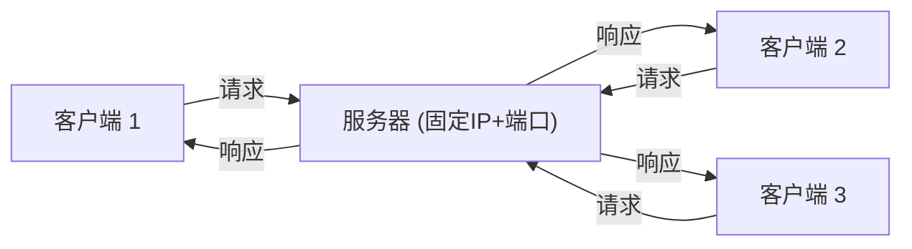
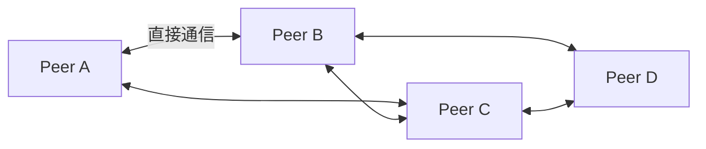
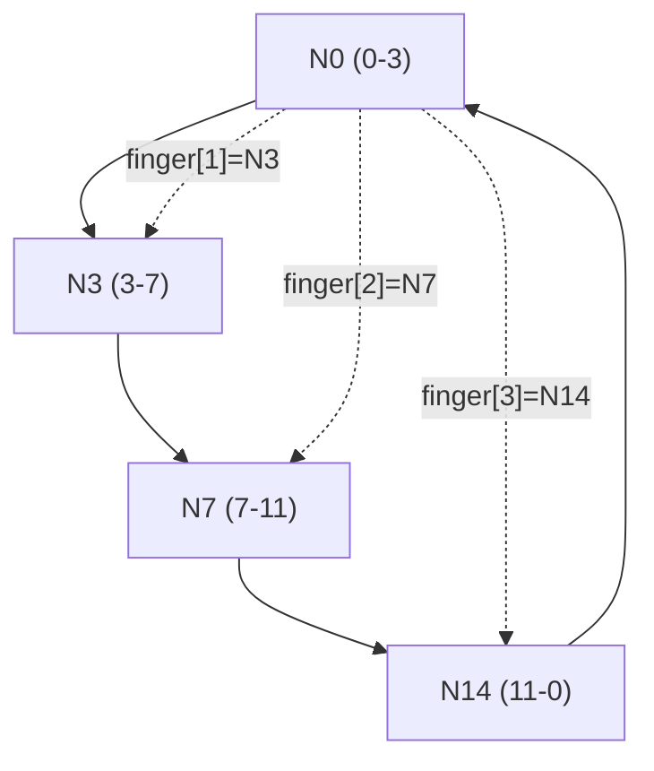
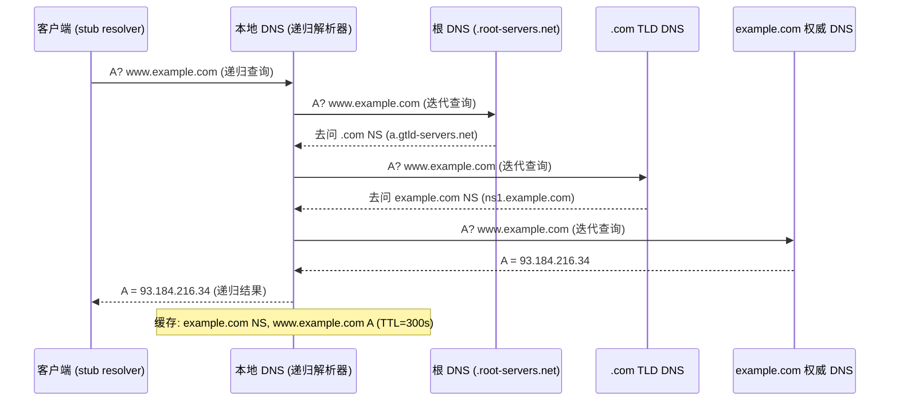
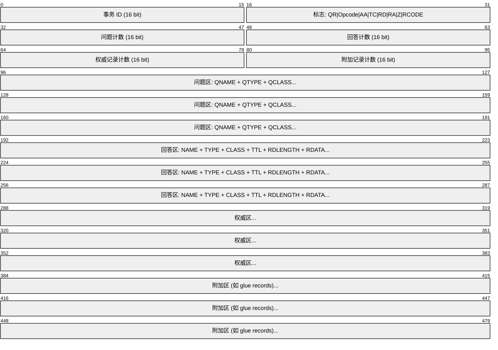
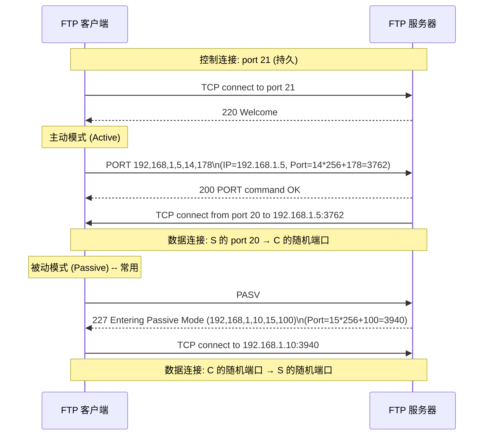
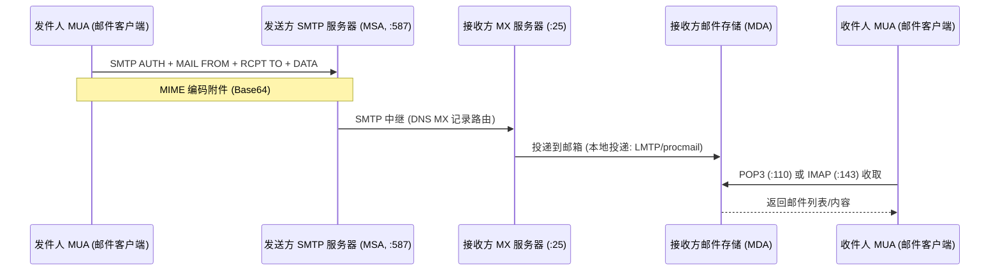
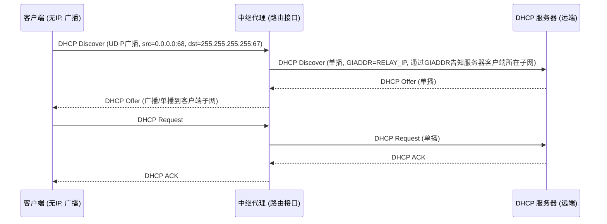
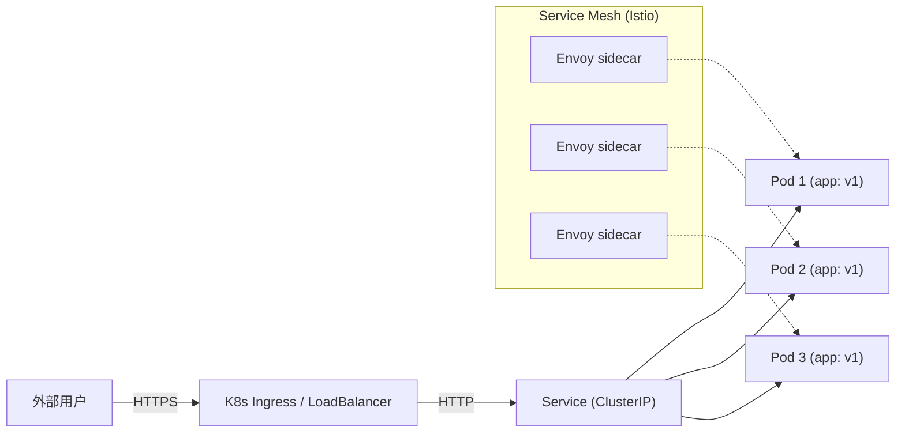

## F -- 应用层

应用层是 TCP/IP 协议栈的最高层，直接为用户应用程序提供网络服务。它融合 OSI 七层模型中**应用层 + 表示层 + 会话层**的全部功能。[[E_传输层]]提供端到端的数据通道，应用层协议在此基础上定义通信语义（消息格式、交互时序、状态管理）。

### 网络应用模型

#### 客户端/服务器模型 (C/S)



| 优点 | 缺点 |
|------|------|
| 集中管理、安全可控 | 服务器是瓶颈和单一故障点 |
| 客户端无需公网 IP | 服务器带宽/算力成本随规模线性增长 |
| 实现简单 | 不适合大规模实时通信 |

#### P2P 模型 (Peer-to-Peer)



**非结构化 P2P**（Gnutella）：泛洪式查询，TTL 限制。简单但扩展性差。

**结构化 P2P (DHT)**：基于分布式哈希表，每个节点负责一段 key space。经典算法 Chord 使用环形拓扑：



Chord 环：节点 ID 和 key 都用 SHA-1 散列到 m-bit 空间。查找 key 时沿环顺时针传递，finger table 实现 O(log N) 跳查找。[[../数据结构/D_容器_Container|散列表与一致性哈希]] 是 DHT 的核心数据结构。

**混合 P2P (BitTorrent)**：
- **Tracker**：跟踪参与节点列表（集中式）。
- **DHT**：分布式 tracker（去中心化后备）。
- 种子下载本身是 P2P 的（tit-for-tat 策略）。

### DNS -- Domain Name System

DNS (RFC 1034/1035) 将人类可读的域名解析为机器可路由的 IP 地址。默认使用 UDP 53（大型响应可回退 TCP 53）。

#### 域名层级结构

```
根域 (.)
└── 顶级域 (TLD): .com .org .net .cn .io .dev ...
 ├── 二级域: example.com, google.com
 │ ├── 子域: www.example.com
 │ │ └── 更深子域: api.www.example.com
 │ └── mail.example.com
 └── ...
```

FQDN (Fully Qualified Domain Name) 以点结尾：`www.example.com.`

#### DNS 解析流程



#### 递归 vs 迭代查询

| 方式 | 描述 | 使用场景 |
|------|------|---------|
| 递归查询 | DNS 服务器替客户端完成全部查询链，返回最终结果 | 客户端 → 本地 DNS (stub → recursive) |
| 迭代查询 | DNS 服务器返回"线索"（应查询的下一个 NS），客户端逐级查询 | 本地 DNS → 根/顶级/权威 (recursive → authoritative) |

#### DNS 记录类型

| 类型 | 含义 | 示例值 |
|------|------|--------|
| A | IPv4 地址 | 93.184.216.34 |
| AAAA | IPv6 地址 | 2606:2800:220:1:248:1893:25c8:1946 |
| CNAME | 规范名（别名） | www.example.com → example.com |
| MX | 邮件交换服务器 | 10 mail.example.com (10 是优先级) |
| NS | 权威名称服务器 | ns1.example.com |
| PTR | 反向解析 (IP→域名) | 34.216.184.93.in-addr.arpa → example.com |
| SOA | 权威区域起始 | 主 NS、管理员邮箱、序列号、刷新/重试/过期/最小 TTL |
| TXT | 任意文本 (SPF/DKIM/验证用) | "v=spf1 mx -all" |
| SRV | 服务定位器 | _sip._tcp.example.com → server:5060 |

#### DNS 消息格式



标志位详解：
- **QR**: 0=查询, 1=响应
- **Opcode**: 0=标准查询, 4=通知, 5=更新
- **AA**: 权威回答
- **TC**: 截断（超过 512 字节，触发 TCP 回退）
- **RD**: 期望递归
- **RA**: 支持递归
- **RCODE**: 0=无差错, 1=格式错, 2=服务失败, 3=NXDOMAIN (域名不存在)

#### DNS 缓存与 TTL

```bash
# Linux 上 local stub resolver 缓存由 systemd-resolved 或 nscd 管理
resolvectl query example.com # systemd-resolved
systemd-resolve --flush-caches # 清除缓存

# DNS TTL 由权威服务器设定
# 递归解析器按 TTL 续缓存记录
# 负缓存 (NXDOMAIN) 按 SOA 的 minimum TTL 缓存
```

#### DNS over HTTPS (DoH) / DNS over TLS (DoT)

| 协议 | 端口 | 封装 | 隐私 |
|------|------|------|------|
| DoT (RFC 7858) | 853/tcp | TLS 直传 DNS 报文 | 加密，端口可识别 |
| DoH (RFC 8484) | 443/tcp | HTTP/2 POST/GET + JSON/二进制 | 加密，与 HTTPS 混淆 |
| DoQ (RFC 9250) | 853/udp | QUIC | 加密 + 0-RTT |

```bash
# DoH 示例 (curl)
curl -H 'accept: application/dns-json' \
 'https://cloudflare-dns.com/dns-query?name=example.com&type=A'
```

#### 红队视角

| 攻击/技术 | 原理 | 工具 |
|-----------|------|------|
| DNS 隧道 | 将数据编码在 DNS 查询/响应中，绕过防火墙 | dnscat2, iodine |
| DNS 重绑定 | TTL=0 使 DNS 响应快速过期，第二次解析返回内网 IP 以绕过同源策略 | 自定义 DNS 服务器 |
| DNS 缓存投毒 | 伪造权威响应，在递归解析器缓存中注入错误记录 | 针对非随机化 ID + 源端口 |
| DNSSEC | DNS 记录数字签名 (RRSIG)，从根到叶建立信任链 (DS 记录) | 防御 DNS 欺骗 |

### HTTP -- Hypertext Transfer Protocol

HTTP 是 Web 的基础协议，无状态的请求-响应模型。

#### HTTP/1.0 vs HTTP/1.1 vs HTTP/2 vs HTTP/3

| 版本 | 连接模型 | 多路复用 | 头部压缩 | 传输层 | 推出 |
|------|---------|---------|---------|--------|------|
| HTTP/1.0 | 每请求一个 TCP 连接 | 无 | 无 | TCP | 1996 |
| HTTP/1.1 | 持久连接 (Keep-Alive)，可选流水线 | 无 (流水线有队头阻塞) | 无 | TCP | 1997 |
| HTTP/2 | 单一 TCP 连接 | Stream 级别，二进制帧 | HPACK | TCP | 2015 |
| HTTP/3 | QUIC 连接 | Stream 级别，无队头阻塞 | QPACK | QUIC/UDP | 2022 |

#### HTTP/1.1 请求与响应格式


```
请求格式:
 METHOD /path HTTP/1.1\r\n
 Header-Field: value\r\n
 ...
 \r\n
 [body]

响应格式:
 HTTP/1.1 200 OK\r\n
 Header-Field: value\r\n
 ...
 \r\n
 [body]
```

#### HTTP 请求方法

| 方法 | 语义 | 安全 (Safe) | 幂等 (Idempotent) |
|------|------|:---:|:---:|
| GET | 获取资源 | Yes | Yes |
| HEAD | 获取响应头 (无 body) | Yes | Yes |
| POST | 创建资源 / 提交数据 | No | No |
| PUT | 完整替换资源 | No | Yes |
| PATCH | 部分更新资源 | No | No |
| DELETE | 删除资源 | No | Yes |
| OPTIONS | 查询支持的方法 | Yes | Yes |
| CONNECT | 建立隧道 (HTTPS 代理) | -- | -- |
| TRACE | 回显请求 (调试/漏洞探测) | Yes | Yes |

#### HTTP 状态码

| 类别 | 范围 | 含义 | 典型码 |
|------|------|------|--------|
| 1xx | 100--199 | 信息提示 | 100 Continue, 101 Switching Protocols |
| 2xx | 200--299 | 成功 | 200 OK, 201 Created, 204 No Content |
| 3xx | 300--399 | 重定向 | 301 永久重定向, 302 Found*临时, 304 Not Modified |
| 4xx | 400--499 | 客户端错误 | 400 Bad Request, 401 Unauthorized, 403 Forbidden, 404 Not Found, 429 Too Many Requests |
| 5xx | 500--599 | 服务端错误 | 500 Internal Server Error, 502 Bad Gateway, 503 Service Unavailable, 504 Gateway Timeout |

#### 关键 HTTP 头部

| 头部 | 用途 | 示例 |
|------|------|------|
| Host | 虚拟主机名 (HTTP/1.1 必选) | `Host: www.example.com` |
| Connection | 连接管理 | `Connection: keep-alive` / `close` |
| Content-Length | Body 字节数 | `Content-Length: 348` |
| Transfer-Encoding | 分块传输 (替代 Content-Length) | `Transfer-Encoding: chunked` |
| Cookie | 客户端 → 服务端，携带状态 | `Cookie: session=abc123` |
| Set-Cookie | 服务端 → 客户端，设置 Cookie | `Set-Cookie: session=abc123; HttpOnly; Secure` |
| Cache-Control | 缓存策略 | `Cache-Control: max-age=3600, public` |
| ETag | 资源版本标识 (条件请求) | `ETag: "33a64df"` |
| If-None-Match | 条件 GET (304) | `If-None-Match: "33a64df"` |
| Authorization | 认证凭证 | `Authorization: Bearer eyJ...` |
| Content-Type | Body 媒体类型 | `Content-Type: application/json` |
| Accept-Encoding | 客户端支持的压缩算法 | `Accept-Encoding: gzip, br` |
| Origin / Referer | 请求来源 | CORS 跨域策略依据 |

#### Cookies 与会话

```mermaid
sequenceDiagram
 participant C as 浏览器
 participant S as 服务器
 C->>S: POST /login (username+password)
 S-->>C: Set-Cookie: session_id=K7x9...; HttpOnly; Secure
 Note over C: 存储 Cookie
 C->>S: GET /dashboard\nCookie: session_id=K7x9...
 S-->>C: 200 OK (识别用户身份)
```

| Cookie 属性 | 含义 |
|-------------|------|
| HttpOnly | 禁止 JavaScript `document.cookie` 访问（防 XSS 窃取） |
| Secure | 仅 HTTPS 传输 |
| SameSite=Strict/Lax/None | 跨站请求是否携带 Cookie（防 CSRF） |
| Domain / Path | 限制 Cookie 作用范围 |
| Max-Age / Expires | Cookie 有效期 |

#### HTTP/2 关键改进

- **二进制帧层**：单 TCP 连接承载多路复用的双向 Stream
- **HPACK 头部压缩**：静态表 + 动态表 + Huffman 编码
- **Server Push**：服务器可主动推送资源（已逐步废弃）
- **Stream 优先级**：通知服务器资源优先级

#### HTTP/3 (QUIC)

基于 UDP 的传输方案，在 QUIC 层实现 0-RTT 握手、多路复用的无队头阻塞 Stream（各 Stream 独立，丢包不影响其他）、前向纠错 (FEC)。[[E_传输层]]中 UDP 部分有 QUIC 基础原理。

### FTP -- File Transfer Protocol



| 模式 | 谁监听 | 谁连接 | 防火墙友好度 |
|------|--------|--------|:----------:|
| Active (PORT) | 客户端 | 服务器 (port 20) | 差 (客户端防火墙可能阻挡入站) |
| Passive (PASV) | 服务器 | 客户端 | 好 (客户端主动出站连接) |

### Email -- SMTP / POP3 / IMAP



#### 协议对比

| 协议 | 端口 | 方向 | 用途 | 特点 |
|------|------|------|------|------|
| SMTP | 25 (MX) / 587 (MSA) / 465 (SMTPS) | Push | 发送和中继邮件 | 仅推，不拉取 |
| POP3 | 110 / 995 (POP3S) | Pull | 客户端接收邮件 | 下载后从服务器删除，离线阅读 |
| IMAP | 143 / 993 (IMAPS) | Pull | 客户端管理邮件 | 邮件留在服务器，多设备同步 |

#### MIME (Multipurpose Internet Mail Extensions)

将非 ASCII 内容（图片、音频、附件、非英语文本）编码为 SMTP 可传输的 7-bit ASCII：

```
Content-Type: multipart/mixed; boundary="boundary123"
Content-Transfer-Encoding: base64

--boundary123
Content-Type: text/plain; charset="utf-8"

邮件正文。

--boundary123
Content-Type: image/png
Content-Transfer-Encoding: base64

iVBORw0KGgoAAAANS... (base64 编码的图片)

--boundary123--
```

### DHCP -- Dynamic Host Configuration Protocol

DHCP (RFC 2131) 为终端自动分配 IP 地址、子网掩码、网关、DNS。基于 UDP（服务器 67，客户端 68），支持跨子网中继。在此不再重复 DORA 流程（详见 [[D_网络层]] 的 DHCP 章节及 [[../red_team/网安基础知识/01-计算机网络基础]] 十二节）。

#### DHCP 中继代理

当 DHCP 服务器与客户端不在同一子网时，中继代理 (Relay Agent) 将广播的 DHCP 发现报文以单播转发给远端 DHCP 服务器。流程：



### 对容器的意义

**DNS 服务发现**：

```yaml
# Kubernetes DNS 服务发现 (CoreDNS)
# Pod 内 DNS 解析: <service>.<namespace>.svc.cluster.local
# 示例: api-service.default.svc.cluster.local → ClusterIP 10.96.0.5
# K8s 通过 CoreDNS 维护 Service → ClusterIP 的 A/AAAA 记录
# Headless Service (clusterIP: None) 返回 Pod IP 列表而非单 IP
```

```bash
# 进入 Pod 的 DNS 配置
cat /etc/resolv.conf
# nameserver 10.96.0.10 (kube-dns service ClusterIP)
# search default.svc.cluster.local svc.cluster.local cluster.local
# ndots:5 (非 FQDN 的超时重试策略)
```

**HTTP 负载均衡与服务网格**：



Ingress 实现 L7 负载均衡（基于 Host/Path 路由），Envoy/Istio 在应用层代理间实现 mTLS、流量分担、熔断、可观测性。所有机制均构建在 HTTP/1.1 和 HTTP/2 协议之上。

### 交叉链接

- [[A_体系结构]] -- 应用层在 TCP/IP 协议栈中的位置
- [[D_网络层]] -- IP 寻址与路由，DHCP 的 IP 层视角
- [[E_传输层]] -- TCP/UDP 为应用层提供的传输抽象
- [[../操作系统/J_IO管理]] -- 网卡中断合并与用户态网络栈的性能影响
- [[../计算机原理/G_输入输出系统]] -- 总线、DMA 与网卡数据路径
- [[../red_team/网安基础知识/01-计算机网络基础]] -- 红队应用层攻击面（DNS隧道、HTTP参数污染等）
- [[../路径-考研408方向]] -- 考研408 方向（应用层章节索引）
