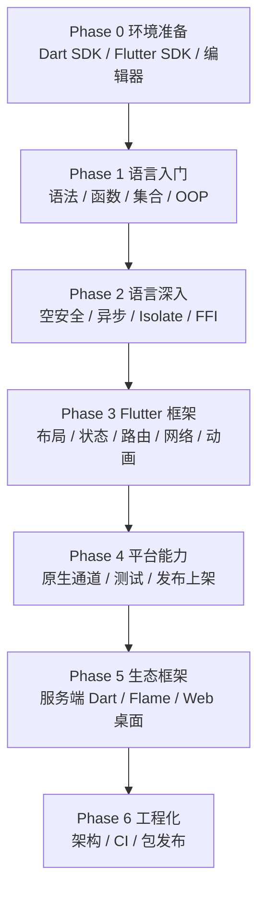

## 路径 -- Dart 开发

> 本路径面向移动应用、跨平台桌面/Web 与 Flutter 全栈开发方向。Dart 是 Flutter 的官方语言——一套代码同时构建 Android、iOS、Web、桌面与嵌入式界面；它也能写服务端、命令行工具与云函数，`dart compile exe` 产出的原生可执行文件无运行时依赖。
>
> 本路径覆盖 **Dart 全栈**（语言入门 → 语言深入 → Flutter 框架与生态框架 → 工程化与发布）。

---

### 目标受众

| 维度 | 描述 |
|------|------|
| 目标 | 移动端开发工程师、跨平台应用开发者、Flutter 全栈工程师 |
| 前置 | 零基础可入门；有 C/Java/TypeScript 经验者可加速通过（本教程以 C 视角对照） |
| 适用人群 | 想以移动/跨端就业为导向的学习者；需要一套代码覆盖多端的开发者 |
| 建议周期 | 约 14 周（3.5 个月左右，含完整实战项目与上架流程） |

---

### 学习路线总览

---

### Phase 0: 环境准备 (建议 2-3 天)

| 序号 | 文件 | 核心内容 |
|:----:|------|---------|
| 1 | [[dart/dart目录|Dart 教程目录]] | 教程定位、学习路线、术语速查 |
| 2 | [[dart/1入门/00_认识Dart|00 认识 Dart]] | 语言定位、发展史、JIT/AOT、跨平台版图 |
| 3 | [[dart/1入门/01_环境配置|01 环境配置]] | Dart SDK、Flutter SDK、三平台安装、国内镜像、编辑器 |

---

### Phase 1: 语言入门 (约 2 周)

| 序号 | 文件 | 核心内容 |
|:----:|------|---------|
| 1 | [[dart/1入门/02_第一个程序与命令行|02 第一个程序]] | main、print、dart run、dart create、命名规范 |
| 2 | [[dart/1入门/03_变量与类型|03 变量与类型]] | var/final/const/late、数值、字符串插值、类型转换 |
| 3 | [[dart/1入门/04_运算符与流程控制|04 运算符与流程控制]] | 运算符、if/switch 表达式、循环、标签 |
| 4 | [[dart/1入门/05_函数与闭包|05 函数与闭包]] | 可选参数、命名参数、箭头函数、闭包、高阶函数 |
| 5 | [[dart/1入门/06_集合与迭代|06 集合与迭代]] | List/Set/Map、展开运算符、collection-if/for、Records |
| 6 | [[dart/1入门/07_面向对象|07 面向对象]] | 类、构造器、继承、接口、mixin、extension、sealed |
| 7 | [[dart/1入门/08_空安全|08 空安全]] | 可空类型、类型提升、空感知运算符、late |
| 8 | [[dart/1入门/09_异步编程|09 异步编程]] | Future、async/await、Stream、事件循环、微任务 |
| 9 | [[dart/1入门/10_异常处理|10 异常处理]] | Exception 与 Error、try/catch、自定义异常、Zone |
| 10 | [[dart/1入门/11_包管理与模块|11 包管理与模块]] | pub、pubspec.yaml、import/export、part、语义化版本 |

---

### Phase 2: 语言深入 (约 2 周)

| 序号 | 文件 | 核心内容 |
|:----:|------|---------|
| 1 | [[dart/2深入/01_泛型与类型系统|01 泛型与类型系统]] | 泛型类/函数、边界、协变、typedef、类型健全性 |
| 2 | [[dart/2深入/02_Isolate与并发|02 Isolate 与并发]] | 事件循环、Isolate、端口通信、compute、并发模式 |
| 3 | [[dart/2深入/03_FFI与原生交互|03 FFI 与原生交互]] | dart:ffi、DynamicLibrary、结构体、内存管理 |
| 4 | [[dart/2深入/04_元编程与代码生成|04 元编程与代码生成]] | 注解、build_runner、json_serializable、freezed |
| 5 | [[dart/2深入/05_测试与调试|05 测试与调试]] | package:test、mock、覆盖率、DevTools、断点 |
| 6 | [[dart/2深入/06_编译与产物|06 编译与产物]] | JIT/AOT、snapshot、dart compile、dart2js、Wasm |

---

### Phase 3: Flutter 框架核心 (约 3 周)

| 序号 | 文件 | 核心内容 |
|:----:|------|---------|
| 1 | [[dart/3框架/01_Flutter入门|01 Flutter 入门]] | Flutter 架构、三棵树、热重载、第一个应用 |
| 2 | [[dart/3框架/02_Widget与布局|02 Widget 与布局]] | Stateless/Stateful、约束模型、常用布局组件 |
| 3 | [[dart/3框架/03_状态管理|03 状态管理]] | setState、Provider、Riverpod、Bloc、GetX 对比 |
| 4 | [[dart/3框架/04_路由与导航|04 路由与导航]] | Navigator 1.0/2.0、go_router、参数、深链 |
| 5 | [[dart/3框架/05_网络与数据持久化|05 网络与持久化]] | http/dio、JSON 序列化、sqflite/drift、hive |

---

### Phase 4: 平台能力与发布 (约 2 周)

| 序号 | 文件 | 核心内容 |
|:----:|------|---------|
| 1 | [[dart/3框架/06_动画与自定义绘制|06 动画与自定义绘制]] | 隐式/显式动画、AnimationController、CustomPaint |
| 2 | [[dart/3框架/07_平台通道与原生集成|07 平台通道与原生集成]] | MethodChannel、EventChannel、插件开发、权限 |
| 3 | [[dart/3框架/08_测试与发布|08 测试与发布]] | Widget/集成/Golden 测试、各平台打包、上架 |
| 4 | [[dart/3框架/09_Flutter实战项目|09 Flutter 实战项目]] | 从 0 到 1：架构、联网、状态、测试、发布 |

---

### Phase 5: 生态框架 (约 2 周)

| 序号 | 文件 | 核心内容 |
|:----:|------|---------|
| 1 | [[dart/3框架/10_服务端Dart|10 服务端 Dart]] | shelf、dart_frog、数据库、Docker 部署 |
| 2 | [[dart/3框架/11_Flame游戏开发|11 Flame 游戏开发]] | 游戏循环、精灵、碰撞、动画、发布 |
| 3 | [[dart/3框架/12_Web与桌面跨平台|12 Web 与桌面跨平台]] | Flutter Web/桌面、Jaspr、Dart Web 编译 |

---

### Phase 6: 工程化 (约 2 周)

| 序号 | 文件 | 核心内容 |
|:----:|------|---------|
| 1 | [[dart/4工程化/01_项目架构与规范|01 项目架构与规范]] | 分层架构、feature-first、lint、依赖注入 |
| 2 | [[dart/4工程化/02_CI与自动化发布|02 CI 与自动化发布]] | GitHub Actions、缓存、Fastlane、Codemagic |
| 3 | [[dart/4工程化/03_包发布与私有仓库|03 包发布与私有仓库]] | pub publish、melos 多包、私有 pub 服务 |
| 4 | [[多语言工程化/多语言工程化目录|多语言工程化]] | 跨语言协作、gRPC 契约、容器编排与 CI/CD |

---

### 就业与实战基准

| 维度 | 基准 |
|------|------|
| 语法与机制 | 空安全、异步模型、Isolate、状态管理能讲清原理与取舍 |
| 作品 | 至少 1 个多页面、联网、有本地缓存、可安装的完整应用 |
| 测试 | 能为核心逻辑写单元测试，为关键流程写 Widget/集成测试 |
| 工程 | 会用 Git 分支协作、能配 CI 自动出包、理解上架流程 |
| 扩展 | 读过 Flutter 常用三方库源码，能写自己的插件或 package |

---

### 相关路径

- [[路径-C开发]] — C 语言主线，FFI 与原生插件开发的底层基础
- [[路径-Java开发]] — Android 原生开发与后端服务，Flutter 项目的常见搭档
- [[路径-Python开发]] — AI/数据科学能力接入移动端（模型服务化）
- [[多语言工程化/多语言工程化目录|多语言工程化]] — Flutter 客户端与多语言后端的协作工程化
- [[前端开发/引导阅读]] — Web 前端知识，Flutter Web 与前端联调的补充
