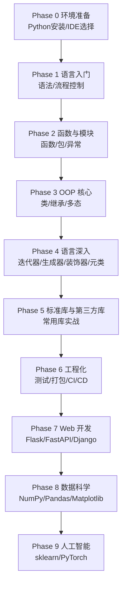

## 路径 -- Python 开发

> 本路径面向数据分析、人工智能、Web 开发、自动化运维等应用开发方向。Python 是全球最流行的编程语言之一——数据科学、机器学习、Web 后端、自动化脚本的首选工具，生态庞大，从科学计算到深度学习均有成熟方案。
>
> 本路径覆盖 **Python 全栈**（语言入门 → 深入特性 → 工程化与 Web → AI/数据科学）。

---

### 目标受众

| 维度 | 描述 |
|------|------|
| 目标 | 数据分析师、AI/ML 工程师、Web 开发者、自动化运维工程师 |
| 前置 | 零基础可入门；有其他语言经验者可加速通过 |
| 适用人群 | 想以就业为导向系统学习 Python 的学生与转行者；需要补全数据分析/AI 能力的开发者 |
| 建议周期 | 约 20 周（5 个月左右，含实战项目） |

---

### 学习路线总览

---

### Phase 0: 环境准备 (建议 2-3 天)

| 序号 | 文件 | 核心内容 |
|:----:|------|---------|
| 1 | [[python/写在教程之前|教程导读]] | 教程定位、学习路线、配套资源 |
| 2 | [[python/1入门/00_准备工作|准备工作]] | Python 安装、IDE 选择、环境配置 |

---

### Phase 1: 语言入门 (约 3 周)

| 序号 | 文件 | 核心内容 |
|:----:|------|---------|
| 1 | [[python/1入门/01_认识Python与python_-c_一行流|01 认识 Python]] | 语言定位、一行流脚本、快速上手 |
| 2 | [[python/1入门/02_变量与类型：从C迁移|02 变量与类型]] | 动态类型、基本类型、类型转换 |
| 3 | [[python/1入门/03_列表与字典：C数组与结构体的平替|03 列表与字典]] | list/dict 操作、切片、推导式 |
| 4 | [[python/1入门/04_字符串与文件读写|04 字符串与文件]] | 字符串操作、文件读写、上下文管理器 |
| 5 | [[python/1入门/05_异常处理与pdb调试|05 异常处理]] | try/except、调试技巧、pdb |
| 6 | [[python/1入门/06_类与继承：从struct到class|06 类与继承]] | 类定义、继承、多态 |
| 7 | [[python/1入门/07_模块与包：import机制与pip|07 模块与包]] | import 机制、pip、虚拟环境 |

---

### Phase 2: 函数与模块 (约 2 周)

| 序号 | 文件 | 核心内容 |
|:----:|------|---------|
| 1 | [[python/1入门/06_类与继承：从struct到class|类与继承]] | 详见 Phase 1 |
| 2 | [[python/1入门/07_模块与包：import机制与pip|模块与包]] | 详见 Phase 1 |

---

### Phase 3: OOP 核心 (约 2 周)

| 序号 | 文件 | 核心内容 |
|:----:|------|---------|
| 1 | [[python/1入门/06_类与继承：从struct到class|类与继承]] | 详见 Phase 1 |

---

### Phase 4: 语言深入 (约 3 周)

| 序号 | 文件 | 核心内容 |
|:----:|------|---------|
| 1 | [[python/2精通/01_PyObject与引用计数：Python的内存真相|01 内存真相]] | 引用计数、GC 机制 |
| 2 | [[python/2精通/02_GIL与多线程：对比C_pthread|02 GIL 与多线程]] | GIL 原理、多线程 vs 多进程 |
| 3 | [[python/2精通/03_字节码与dis：Python也是_编译_的|03 字节码]] | 编译过程、反汇编、优化 |
| 4 | [[python/2精通/04_生成器与协程：yield与async底层|04 生成器与协程]] | 生成器、async/await、异步编程 |
| 5 | [[python/2精通/05_ctypes：在Python中调用C库|05 ctypes]] | C 扩展、FFI、性能优化 |
| 6 | [[python/2精通/06_内嵌CPython：在C程序里运行Python|06 内嵌 CPython]] | 嵌入 Python、扩展开发 |
| 7 | [[python/2精通/07_pybind11与Cython：给C_C++库披上Python外衣|07 pybind11]] | C++ 绑定、Cython、性能 |
| 8 | [[python/2精通/08_subprocess与进程管道：C与Python数据交换|08 进程管道]] | 进程通信、数据交换 |

---

### Phase 5: 标准库与第三方库 (约 2 周)

| 序号 | 文件 | 核心内容 |
|:----:|------|---------|
| 1 | [[python/4库/4库索引|库索引]] | 标准库与第三方库总览 |
| 2 | [[python/4库/标准库/标准库索引|标准库]] | 常用标准库详解 |
| 3 | [[python/4库/第三方/第三方索引|第三方库]] | 常用第三方库详解 |

---

### Phase 6: 工程化 (约 2 周)

| 序号 | 文件 | 核心内容 |
|:----:|------|---------|
| 1 | [[python/5工程化/01_venv与uv：环境隔离|01 环境隔离]] | 虚拟环境、依赖管理 |
| 2 | [[python/5工程化/02_pyproject.toml与打包分发|02 打包分发]] | 项目配置、打包发布 |
| 3 | [[python/5工程化/03_pytest：单元测试与C项目联测|03 单元测试]] | pytest、测试策略 |
| 4 | [[python/5工程化/04_ruff与mypy：代码质量|04 代码质量]] | linting、类型检查 |
| 5 | [[python/5工程化/05_GitHub_Actions：Python与C混合CI|05 CI/CD]] | GitHub Actions、自动化 |
| 6 | [[python/5工程化/06_C_C++混合项目中的Python工程实践|06 混合项目]] | C/C++ 与 Python 混合开发 |

---

### Phase 7: Web 开发 (约 3 周)

| 序号 | 文件 | 核心内容 |
|:----:|------|---------|
| 1 | [[python/10web应用/01_Flask：十分钟起一个服务|01 Flask]] | Web 框架入门、路由、模板 |
| 2 | [[python/10web应用/02_FastAPI：现代异步API|02 FastAPI]] | 异步框架、自动文档、类型安全 |
| 3 | [[python/10web应用/03_模板与静态资源|03 模板与静态]] | Jinja2、前端资源 |
| 4 | [[python/10web应用/04_SQLite与ORM集成|04 数据库]] | SQLite、ORM、数据模型 |
| 5 | [[python/10web应用/05_部署：gunicorn与Docker|05 部署]] | Gunicorn、Docker、生产部署 |
| 6 | [[python/10web应用/06_Django：全栈Web框架|06 Django]] | 全栈框架、Admin、ORM |

---

### Phase 8: 数据科学 (约 4 周)

| 序号 | 文件 | 核心内容 |
|:----:|------|---------|
| 1 | [[python/6量化分析/01_NumPy数组：与C数组的血缘|01 NumPy]] | 数组运算、向量化 |
| 2 | [[python/6量化分析/02_Pandas：表格数据瑞士军刀|02 Pandas]] | 数据清洗、分析、聚合 |
| 3 | [[python/7科学计算/01_NumPy向量化：告别C式循环|03 向量化]] | 性能优化、C 互操作 |
| 4 | [[python/7科学计算/02_SciPy：线性代数与优化|04 SciPy]] | 科学计算、优化算法 |
| 5 | [[python/8数据可视化/01_Matplotlib基础：画出C程序的输出|05 Matplotlib]] | 基础绑图、图表类型 |
| 6 | [[python/8数据可视化/03_Seaborn：统计图表|06 Seaborn]] | 统计可视化 |

---

### Phase 9: 人工智能 (约 4 周)

| 序号 | 文件 | 核心内容 |
|:----:|------|---------|
| 1 | [[python/11人工智能/01_AI生态概览：sklearn到PyTorch|01 AI 生态]] | 机器学习框架概览 |
| 2 | [[python/11人工智能/02_sklearn：机器学习入门|02 sklearn]] | 分类、回归、聚类 |
| 3 | [[python/11人工智能/03_PyTorch：张量与自动求导|03 PyTorch]] | 张量运算、自动微分 |
| 4 | [[python/11人工智能/04_CNN与Transformer：现代模型结构|04 神经网络]] | CNN、Transformer 架构 |
| 5 | [[python/11人工智能/05_模型导出ONNX|05 模型导出]] | ONNX 格式、模型转换 |
| 6 | [[python/11人工智能/06_推理部署：ONNX_Runtime接C++程序|06 推理部署]] | 推理引擎、C++ 集成 |

---

### 相关路径

- [[路径-C开发]] — C 语言主线，Python C 扩展的基础
- [[路径-CPP开发]] — C++ 主线，Python C++ 绑定的基础
- [[路径-Java开发]] — Java 全栈，对比两种语言的设计哲学
- [[多语言工程化/多语言工程化目录|多语言工程化]] — Python 与多语言后端的接口、构建与容器协作
