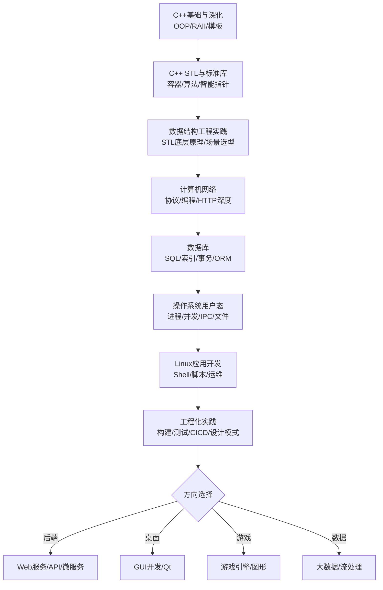

## 路径 -- 工程化应用方向

> 本路径面向应用开发、后端服务、数据库、Web 与网络编程、跨平台开发等上层工程方向。以 C++ 为核心语言，从现代 C++ 特性入手，逐步覆盖数据结构工程实践、网络编程、数据库和前后端技术栈。
>
> 与 [[路径-工程化底层方向]] 追求"理解每一行代码的硬件代价"不同，本路径更注重 **工程效率和系统设计**——知道如何选择合适的抽象、如何组织大型项目、如何让软件可靠地运行在生产环境。两条路径在很多模块上有交集，可在中途按兴趣切换。

---

### 目标受众

| 维度 | 描述 |
|------|------|
| 目标 | 后端开发工程师、全栈应用开发者、数据库开发、桌面/移动应用开发 |
| 前置 | 任意语言编程基础 (C++ 零基础可入门) |
| 适用人群 | 想从语言学习进阶到实际项目开发的工程师，需要系统补全网络/数据库/系统工程能力的开发者 |
| 建议周期 | 4-6 个月 |

---

### 前置要求

| 科目 | 最低要求 | 推荐来源 |
|------|---------|---------|
| 编程基础 | 变量、类型、循环、函数、基本数据结构概念 | 任何入门教程 |
| C++ 基础 | namespace、类与对象、继承、多态 | [[路径B-CPP主线]] Phase 1-2 |
| 命令行 | 终端基本操作、文件操作 | [[../linux/README\|Linux教程]] 入门篇 |
| 英语 | 能阅读英文文档和技术博客 | — |

---

### 学习路线总览

---

### Phase 1: C++ 入门与深化 (建议 4-5 周)

> 建立现代 C++ 的语法基础和正确的编程习惯。RAII 不是"自动析构"的语法糖，而是 C++ 所有资源管理的基石。

| 序号 | 文件 | 核心内容 | 建议学时 |
|:----:|------|---------|:-------:|
| 1 | [[../cpp教程/cpp基础教程/01_下载与安装\|01 下载与安装]] | 编译器安装 (g++/clang++/MSVC)、IDE 配置 | 2h |
| 2 | [[../cpp教程/cpp基础教程/02_环境配置\|02 环境配置]] | CMake 基础、构建系统选择 | 2h |
| 3 | [[../cpp教程/cpp基础教程/04_第一个程序与输入输出\|04 第一个程序]] | main/iostream/namespace、C 与 C++ 的 I/O 对比 | 2h |
| 4 | [[../cpp教程/cpp基础教程/05_变量与数据类型\|05 变量与数据类型]] | auto/constexpr/字面量、类型推导 | 3h |
| 5 | [[../cpp教程/cpp基础教程/06_运算符与表达式\|06 运算符]] | 运算符重载基础意识 | 2h |
| 6 | [[../cpp教程/cpp基础教程/07_条件语句\|07 条件]] + [[../cpp教程/cpp基础教程/08_循环结构\|08 循环]] | range-for vs 传统 for | 2h |
| 7 | [[../cpp教程/cpp基础教程/09_数组基础\|09 数组]] + [[../cpp教程/cpp基础教程/11_字符串基础\|11 字符串]] | std::array vs C 数组、std::string 基础 | 3h |
| 8 | [[../cpp教程/cpp基础教程/10_函数基础\|10 函数]] | 引用参数、默认参数、重载、inline | 3h |
| 9 | [[../cpp教程/cpp深化教程/01_命名空间\|01 命名空间]] | using 声明 vs using 指令、ADL | 2h |
| 10 | [[../cpp教程/cpp深化教程/03_指针与引用\|03 指针与引用]] | 指针 vs 引用语义差异、nullptr、const 位置 | 4h |
| 11 | [[../cpp教程/cpp深化教程/04_动态内存\|04 动态内存]] | new/delete vs malloc/free、placement new | 3h |
| 12 | [[../cpp教程/cpp深化教程/05_面向对象(一)类与对象基础\|05 类与对象]] | 构造/析构/拷贝三法则、RAII、成员初始化列表 | 5h |
| 13 | [[../cpp教程/cpp深化教程/06_面向对象(二)继承\|06 继承]] | public/private/protected 继承、final/override | 4h |
| 14 | [[../cpp教程/cpp深化教程/07_面向对象(三)多态与虚函数\|07 多态]] | 虚函数表、动态绑定、抽象基类 | 4h |
| 15 | [[../cpp教程/cpp深化教程/09_函数模板\|09 函数模板]] | 模板实例化、模板参数推导、概念 (concepts) 引入 | 3h |

> **检查点**: 能设计一个简单的资源管理类 (如 FileHandle) 用 RAII 管理文件打开关闭；能解释为什么应该用成员初始化列表而非在构造函数体中赋值。

---

### Phase 2: C++ STL 与标准库 (建议 3-4 周)

> STL 不是 C++ 的附加库——**STL 就是 C++**。序列容器、关联容器、算法、智能指针、并发库——这些是日常 C++ 编程中占 80% 使用量的部分。

| 分类 | 文件 / 模块 | 核心内容 | 建议学时 |
|------|------------|---------|:-------:|
| 序列容器 | [[../cpp教程/容器库/序列容器/vector\|vector]] / [[../cpp教程/容器库/序列容器/deque\|deque]] / [[../cpp教程/容器库/序列容器/list\|list]] | 扩容策略 (1.5x vs 2x)、iterator 失效条件、list vs vector 内存布局 | 4h |
| 适配器 | [[../cpp教程/容器库/适配器/stack\|stack]] / [[../cpp教程/容器库/适配器/queue\|queue]] / [[../cpp教程/容器库/适配器/priority_queue\|priority_queue]] | 底层容器默认可替换、自定义比较器 | 3h |
| 关联容器 | [[../cpp教程/容器库/关联容器/set\|set]] / [[../cpp教程/容器库/关联容器/map\|map]] | 红黑树内部结构、lower_bound/upper_bound/equal_range | 3h |
| 无序容器 | [[../cpp教程/容器库/无序容器/unordered_set\|unordered_set]] / [[../cpp教程/容器库/无序容器/unordered_map\|unordered_map]] | hash 冲突链、load_factor/max_load_factor、rehash | 3h |
| 字符串 | [[../cpp教程/cpp功能库/字符串/string\|string]] / [[../cpp教程/cpp功能库/字符串/regex\|regex]] | SSO 优化、string_view、raw string literal | 2h |
| 智能指针 | [[../cpp教程/cpp功能库/内存/smart_ptr\|smart_ptr]] | unique_ptr/shared_ptr/weak_ptr、custom deleter、循环引用 | 3h |
| 算法 | [[../cpp教程/cpp功能库/算法/sort_search\|sort_search]] + [[../cpp教程/cpp功能库/算法/find_count\|find_count]] | 排序稳定/不稳定、二分查找、nth_element、partition | 3h |
| 并发 | [[../cpp教程/cpp功能库/并发/thread\|thread]] / [[../cpp教程/cpp功能库/并发/mutex\|mutex]] / [[../cpp教程/cpp功能库/并发/future\|future]] | async/future/promise、condition_variable、call_once | 3h |
| 实用工具 | [[../cpp教程/cpp功能库/工具/pair_tuple\|pair_tuple]] / [[../cpp教程/cpp功能库/工具/optional_variant\|optional_variant]] / [[../cpp教程/cpp功能库/工具/span_bitset\|span_bitset]] | structured binding、std::visit、span 边界安全 | 2h |

> 功能库总索引: [[../cpp教程/cpp功能库/功能库索引\|功能库索引]] / 容器库总索引: [[../cpp教程/容器库/容器库索引\|容器库索引]]

---

### Phase 3: 数据结构 -- C++ 工程实践 (建议 4-5 周)

> 在应用开发中，**选对容器比手写算法重要一百倍**。本阶段深入 STL 底层的实现原理，建立"什么场景用什么容器"的工程直觉。

| 序号 | 章节 | 工程焦点 | 建议学时 |
|:----:|------|---------|:-------:|
| 1 | [[数据结构/D_容器_Container\|容器 Container]] | vector 扩容对引用和迭代器的失效影响、reserve 优化 | 3h |
| 2 | [[数据结构/E_链表_LinkedList\|链表 LinkedList]] | list vs vector 的遍历速度差异 (cache miss)、插入删除场景 | 3h |
| 3 | [[数据结构/N_哈希表_HashTable\|哈希表 HashTable]] | unordered_map 与 Abseil flat_hash_map 性能对比、hash 函数设计 | 4h |
| 4 | [[数据结构/J_树_Tree_BST_AVL\|树 / BST / AVL]] | std::map 红黑树 vs "简单二叉搜索树"退化场景 | 4h |
| 5 | [[数据结构/I_堆_Heap\|堆 Heap]] | priority_queue 底层 vs make_heap/push_heap/pop_heap | 3h |
| 6 | [[数据结构/H_排序_八大排序_Sorting\|排序八大排序]] | std::sort (introsort) vs 纯快排的工程考量、partial_sort 场景 | 3h |
| 7 | [[数据结构/S_图_Graph\|图 Graph]] | 邻接表实现、DFS/BFS 工程场景 (依赖解析、连通分量) | 4h |
| 8 | [[数据结构/O_并查集_UnionFind\|并查集]] + [[数据结构/L_字典树_Trie\|字典树]] | 路径压缩、Trie 在自动完成/拼写检查中的应用 | 3h |
| 9 | [[数据结构/M_B树_BTree\|B树]] | B+树与数据库索引的关系 (为 Phase 5 做铺垫) | 3h |

> **工程选型速查**:
> - 需要 O(1) 随机访问 → vector
> - 需要在任意位置 O(1) 插入删除 → list (但遍历慢)
> - 需要 key-value 且有序 → map
> - 需要 key-value 且 O(1) 查找 → unordered_map
> - 无需修改的字符串切片 → string_view
> - 需要动态多态容器 → vector<unique_ptr<Base>>

---

### Phase 4: 计算机网络 (建议 4-5 周)

> 网络是上层应用与外界的唯一桥梁。HTTP/REST/WebSocket 是应用层的核心协议。完整教程入口: [[计算机网络/计算机网络_索引|计算机网络索引]]

| 序号 | 章节 | 应用开发关联 | 建议学时 |
|:----:|------|---------|:-------:|
| 1 | [[计算机网络/A_体系结构\|A 体系结构]] | TCP/IP 层模型与协议栈概览 | 2h |
| 2 | [[计算机网络/D_网络层\|D 网络层]] | IP 地址、子网、路由 — 容器/云环境的网络基础 | 4h |
| 3 | [[计算机网络/E_传输层\|E 传输层]] | TCP 三次握手/四次挥手、TIME_WAIT 对服务的实际影响、TCP 拥塞控制与长连接性能 | 6h |
| 4 | [[计算机网络/F_应用层\|F 应用层]] — HTTP | HTTP/1.1 vs HTTP/2 vs HTTP/3 对比、Headers/Cookies/CORS、状态码实战 | 5h |
| 5 | [[计算机网络/F_应用层\|F 应用层]] — DNS | DNS 解析链、CDN 与负载均衡原理、DNS over HTTPS | 3h |
| 6 | [[计算机网络/F_应用层\|F 应用层]] — 补充 | WebSocket、gRPC (HTTP/2)、RESTful API 设计、JWT/Session 认证 | 5h |
| 7 | Socket 编程 | C++ 网络库 (Boost.Asio/ASIO)、TCP 服务器/客户端实战 | 4h |

> **实战练习**: 用 [[../cpp教程/cpp第三方库/网络/cpp-httplib\|cpp-httplib]] 或 [[../cpp教程/cpp第三方库/网络/Boost.Asio\|Boost.Asio]] 实现一个支持并发请求的 HTTP 服务器。

---

### Phase 5: 数据库基础 (建议 3-4 周)

> 数据库不是"存数据的大箱子"——它是 **并发控制 + 持久化 + 查询优化** 的综合系统。理解 B+树索引、事务 ACID、SQL 优化。

| 主题 | 核心内容 | 建议学时 |
|------|---------|:-------:|
| 关系模型与 SQL | 表设计范式 (1NF/2NF/3NF/BCNF)、JOIN 类型 (INNER/LEFT/RIGHT/CROSS)、子查询 vs 窗口函数 | 5h |
| 索引 | B+树索引结构、聚簇索引 vs 非聚簇索引、覆盖索引、联合索引的最左前缀原则 | 5h |
| 事务 | ACID 隔离级别 (脏读/不可重复读/幻读)、MVCC 实现、死锁检测 | 5h |
| SQL 优化 | EXPLAIN 执行计划解读、慢查询日志、防止全表扫描 | 4h |
| C++ 数据库连接 | [[../cpp教程/cpp第三方库/数据库/SQLite\|SQLite]] 嵌入式数据库、[[../cpp教程/cpp第三方库/数据库/SOCI\|SOCI]] ORM 框架、连接池设计 | 3h |
| NoSQL 选型 | Redis (缓存/分布式锁/发布订阅)、MongoDB (文档模型) | 3h |

> 建议配合 [[../linux/README\|Linux教程]] 中 PostgreSQL 或 MySQL 部署部分，搭建本地数据库环境进行实操。

---

### Phase 6: 操作系统 -- 用户态应用视角 (建议 3-4 周)

> 不需要深入到内核，但必须理解进程的"世界观"——内存如何分配、多线程如何协作、文件如何存储。完整教程入口: [[操作系统/操作系统_索引|操作系统索引]]

| 序号 | 章节 | 应用开发关联 | 建议学时 |
|:----:|------|---------|:-------:|
| 1 | [[操作系统/B_进程管理\|B 进程管理]] | 进程 vs 线程的选择、进程内存布局对 OOM 的影响 | 3h |
| 2 | [[操作系统/C_线程与并发\|C 线程与并发]] | 线程池设计、C++ std::thread/std::async 的底层映射 | 4h |
| 3 | [[操作系统/E_同步与死锁\|E 同步与死锁]] | mutex/spinlock/condition_variable 的死锁场景、lock_guard 析构安全 | 4h |
| 4 | [[操作系统/I_进程间通信\|I 进程间通信]] | 管道 vs 共享内存在微服务中的取舍、Unix Domain Socket、消息队列 | 3h |
| 5 | [[操作系统/F_内存管理\|F 内存管理]] | 虚拟内存与分页、信号安全函数、栈溢出的预防 | 3h |
| 6 | [[操作系统/H_文件系统\|H 文件系统]] | 文件锁 (flock/fcntl)、内存映射文件 I/O、mmap 适合场景 | 3h |

> **检查点**: 能用 C++ 实现一个线程安全的生产者-消费者队列 (配合 std::mutex + std::condition_variable)，并理解在条件变量中为什么必须用 while 而非 if 判断。

---

### Phase 7: Linux 应用开发与运维 (建议 3-4 周)

> Linux 是服务器端的事实标准。不需要成为系统管理员，但必须会部署、调试、排查生产环境问题。

| 主题 | 核心内容 | 建议学时 |
|------|---------|:-------:|
| Shell 编程 | [[../linux/README\|Linux教程]] Shell 脚本模块: bash 语法、管道/重定向、awk/sed/jq | 4h |
| 进程与资源管理 | ps/top/htop、lsof/fuser、ulimit/cgroups、strace 系统调用追踪 | 3h |
| 网络排查 | netstat/ss、tcpdump/Wireshark 基本使用、curl/httpie 调试 API | 3h |
| 编译与构建 | GCC/Clang 编译选项、CMake 项目组织、静态库/动态库、RPATH | 4h |
| 容器化 | Docker 基础 (Dockerfile/镜像构建/docker-compose)、容器网络与卷 | 4h |
| 服务部署 | systemd 服务单元、反向代理 (Nginx/Caddy)、进程守护 (supervisor/pm2) | 3h |
| 日志与监控 | syslog/journald、结构化日志 (JSON)、基本 Prometheus 指标暴露 | 2h |

---

### Phase 8: 工程化实践 (建议 4-5 周)

> 从"能写"到"能交付"。代码风格、测试、CI/CD、设计模式——这些不是可选的附加项，而是产品级软件开发的必要技能。

| 主题 | 核心内容 | 建议学时 |
|------|---------|:-------:|
| 构建系统 | CMake 高级特性 (target-based/install/export/FindPackage)、Ninja、ccache/sccache | 3h |
| 单元测试 | [[../cpp教程/cpp第三方库/测试/GoogleTest\|GoogleTest]] / [[../cpp教程/cpp第三方库/测试/Catch2\|Catch2]]、测试覆盖率 | 3h |
| 代码质量 | clang-format/clang-tidy、静态分析 (cppcheck)、Sanitizers (ASAN/TSAN/UBSAN) | 3h |
| CI/CD | GitHub Actions / GitLab CI 配置、自动测试 + 构建发布 | 3h |
| 设计模式 | 单例/工厂/观察者/策略/适配器 — 在 C++ 中的实现与陷阱 | 4h |
| 版本控制 | Git 分支模型 (Git Flow vs Trunk-Based)、代码审查、changelog 管理 | 2h |
| C++ 第三方库集成 | [[../cpp教程/cpp第三方库/第三方库索引\|第三方库索引]]: 网络/序列化/日志/数据库接入 | 4h |
| 综合项目 | 设计并实现一个完整的后端 API 服务 (RESTful + 数据库 + Docker 部署) | 8h |

---

### Phase 9: 方向拓展 -- 按领域选学

| 领域 | 入口 | 核心内容 |
|------|------|---------|
| Web 后端 | — | RESTful 设计、GraphQL、微服务架构、API Gateway |
| 桌面 GUI | [[../cpp教程/cpp第三方库/GUI/Qt\|Qt]] / [[../cpp教程/cpp第三方库/GUI/wxWidgets\|wxWidgets]] | 信号槽机制、模型-视图架构、跨平台打包 |
| 游戏开发 | [[../cpp教程/cpp第三方库/游戏/SDL2\|SDL2]] / [[../cpp教程/cpp第三方库/游戏/SFML\|SFML]] / Unreal Engine C++ | 游戏循环、ECS 架构、实时渲染管线的 CPU 端 |
| 前端基础 | [[../red_team/前端基础/\|前端基础模块]] | HTML/CSS/JavaScript — 理解 Web 全流程 |
| 并发编程进阶 | [[../cpp教程/cpp第三方库/并发/TBB\|TBB]] / [[../cpp教程/cpp第三方库/并发/OpenMP\|OpenMP]] | 任务并行、数据并行、图调度 |
| 数据库进阶 | PostgreSQL 源码级理解、读取锁/写入锁/意向锁、WAL、MVCC 实现细节 | 数据库内核开发 |

---

### 交叉链接

- [[路径B-CPP主线]] — C++ 主线学习路径，本路径的 Phase 1-2 由此扩展
- [[路径-工程化底层方向]] — 底层工程方向，可与本路径互补形成全栈能力
- [[路径-考研408方向]] — 408 四科理论基础，为应用开发提供计算机科学本质理解
- [[路径D-DSA算法刷题.md|竞赛策略路线图]] — 算法竞赛思维，强化技术面试和代码题能力
- [[路径A-C主线]] — C 语言底层视角，帮助理解 C++ 特性背后的内存和硬件语义
- [[路径C-C向下兼容C++.md|C向下兼容C++]] — 先C后C++的系统学习路线
- [[路径E-红队职业路径]] — Web 安全方向，与本路径的网络/前端模块有大量交集

---

### 推荐阅读物

| 书籍 | 说明 |
|------|------|
| A Tour of C++ (Bjarne Stroustrup) | C++ 快速全景概览，适合有一定基础的快速回顾 |
| The C++ Programming Language (4th Edition) | C++ 标准教材，构建完整的语言认知 |
| Effective Modern C++ (Scott Meyers) | 现代 C++ 的 42 条高效实践 |
| C++ Concurrency in Action (2nd Edition) | C++ 并发编程圣经 |
| Designing Data-Intensive Applications (Martin Kleppmann) | 分布式系统与数据架构必读 |
| Database Internals (Alex Petrov) | 数据库内核入门，理解存储引擎和分布式算法 |
| Computer Networking: A Top-Down Approach | 计算机网络入门与深入一览 |
| CS:APP | 即使是应用开发者，也推荐读前 6 章了解程序运行的硬件基础 |

---

### 完成后方向

完成本路径后，你已具备独立开发后端服务、数据库应用、网络程序的能力。可根据行业兴趣选择以下方向深入：

| 方向 | 内容 | 建议下一步 |
|------|------|-----------|
| **后端架构** | 微服务、消息队列 (Kafka/RabbitMQ)、gRPC、分布式事务 | 云原生技术栈 (Kubernetes/Istio/eBPF) |
| **数据库内核** | 存储引擎、查询优化器、分布式数据库 | Rust/Go 实现一个带 MVCC 的键值存储 |
| **游戏引擎** | ECS 架构、物理引擎、渲染管线 | Unreal Engine C++ 源码修改 / 自研小型引擎 |
| **高性能网络** | io_uring、eBPF、DPDK 用户态协议栈 | [[路径-工程化底层方向]] 性能工程模块 |
| **桌面/移动** | Qt QML、跨平台开发 (CMake + Qt)、移动端 C++ (NDK) | 独立发布一个开源桌面应用 |
| **技术管理** | 系统设计、架构评审、团队工程规范 | 阅读公司级架构文档、参与大型开源项目治理 |
