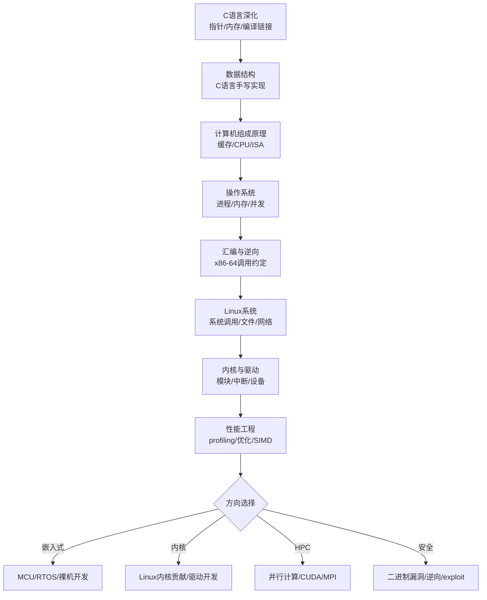

## 路径 -- 工程化底层方向

> 本路径面向系统编程、嵌入式开发、内核与驱动开发、高性能计算等底层工程方向。以 C 语言和汇编为工具，深入操作系统与计算机体系结构，建立从源代码到晶体管级的完整认知。
>
> 与 [[路径-考研408方向]] 侧重考试理论不同，本路径强调 **工程实现**——每学一个概念都用代码验证，每理解一个机制都追溯到汇编或内核源码。最终目标是能在没有魔法帮助的环境 (裸金属、嵌入式 RTOS、自研内核) 下独立完成系统级开发。

---

### 目标受众

| 维度 | 描述 |
|------|------|
| 目标 | 系统软件工程师、嵌入式开发、内核/驱动工程师、HPC/性能工程师 |
| 前置 | C 语言基本语法 (至少完成 [[路径A-C主线]] Phase 1) |
| 适用人群 | 想深入理解计算机底层运行机制的学生和工程师，对"为什么程序这么快/这么慢"有执念的人 |
| 建议周期 | 6-10 个月 (取决于深度) |

---

### 前置要求

| 科目 | 最低要求 | 推荐来源 |
|------|---------|---------|
| C 语言 | 指针、动态内存、结构体、多文件编译 | [[路径A-C主线]] Phase 1-2 |
| 命令行基础 | Linux 基本命令、gcc/clang 编译、make/CMake 构建 | [[../linux/README\|Linux教程]] 基础篇 |
| 数据表示 | 二进制、十六进制、字节序概念 | [[计算机原理/A_数据表示\|A 数据表示]] |
| 数学 | 离散数学基础概念 (集合、关系、图) | — |

---

### 学习路线总览

---

### Phase 1: C 语言深化 (建议 3-4 周)

> 本阶段的目标不是"能写 C 程序"，而是 **理解 C 程序在内存中是什么样子**。每一个语法特性都要能回答"编译器做了什么"。

| 序号 | 文件 | 核心内容 | 建议学时 |
|:----:|------|---------|:-------:|
| 1 | [[../c语言教程/2深化/01_指针深度剖析\|01 指针深度剖析]] | 指针与数组的关系、多级指针、void* | 5h |
| 2 | [[../c语言教程/2深化/02_内存模型与布局\|02 内存模型与布局]] | 栈段/堆段/BSS/data/text 段、静态 vs 动态 | 4h |
| 3 | [[../c语言教程/2深化/03_动态内存管理\|03 动态内存管理]] | malloc/free 底层、sbrk/mmap、内存泄漏检测 | 4h |
| 4 | [[../c语言教程/2深化/04_函数指针与回调\|04 函数指针与回调]] | 函数指针语法、qsort 回调模式、虚函数表雏形 | 3h |
| 5 | [[../c语言教程/2深化/05_位运算与硬件操作\|05 位运算与硬件操作]] | 位域、MMIO 模拟、volatile 语义 | 3h |
| 6 | [[../c语言教程/2深化/06_编译链接与ELF\|06 编译链接与ELF]] | 预处理/编译/汇编/链接四阶段、符号解析、静态库/动态库 | 5h |
| 7 | [[../c语言教程/2深化/07_面向对象C编程\|07 面向对象C编程]] | struct + 函数指针模拟类、继承、多态 | 3h |
| 8 | [[../c语言教程/2深化/08_标准库深度\|08 标准库深度]] | stdio/stdlib/string 的源码级理解 | 3h |
| 9 | [[../c语言教程/2深化/09_多文件与模块化\|09 多文件与模块化]] | 头文件设计、include guard、模块接口设计 | 2h |

> **检查点**: 能写出一个简单的内存分配器 (malloc 简化版)，能手工计算一个 struct 的内存布局和大小，能从 ELF 中找出一个函数的地址。

---

### Phase 2: 数据结构 -- C 语言手写实现 (建议 5-6 周)

> 所有数据结构用 C 语言手动实现，不依赖任何外部库。目标是理解 **数据在内存中的真实形态**，与 STL 封装好的数据结构建立底层对应。

| 序号 | 章节 | 实现重点 | 建议学时 |
|:----:|------|---------|:-------:|
| 1 | [[数据结构/A_数组_Array\|数组 Array]] | 动态扩容、内存拷贝 (memmove)、cache locality | 3h |
| 2 | [[数据结构/E_链表_LinkedList\|链表 LinkedList]] | 单向/双向链表的增删改查、dummy head 技巧 | 4h |
| 3 | [[数据结构/F_栈_Stack\|栈 Stack]] + [[数据结构/G_队列_Queue\|队列 Queue]] | 循环队列补码判满、链式栈 | 3h |
| 4 | [[数据结构/N_哈希表_HashTable\|哈希表 HashTable]] | 开放定址 vs 拉链、负载因子与 rehashing、murmur hash | 5h |
| 5 | [[数据结构/J_树_Tree_BST_AVL\|BST / AVL]] | BST 增删、AVL 旋转 (LL/RR/LR/RL)、递归与迭代对比 | 6h |
| 6 | [[数据结构/I_堆_Heap\|堆 Heap]] | 二叉堆上浮/下沉、堆排序原地化、优先队列 | 4h |
| 7 | [[数据结构/H_排序_八大排序_Sorting\|排序八大算法]] | qsort 源码对比、排序算法内存访问模式对比 | 4h |
| 8 | [[数据结构/S_图_Graph\|图 Graph]] | 邻接表 malloc 管理、DFS 栈/BFS 队列 | 4h |
| 9 | [[数据结构/O_并查集_UnionFind\|并查集]] + [[数据结构/L_字典树_Trie\|字典树]] | 路径压缩、内存池管理 | 3h |

> **C 语言参考实现** (所有结构的指针级完整源码):
> [[../c语言教程/3数据结构/01_动态数组\|01 动态数组]] /
> [[../c语言教程/3数据结构/02_链表\|02 链表]] /
> [[../c语言教程/3数据结构/03_栈\|03 栈]] /
> [[../c语言教程/3数据结构/04_队列\|04 队列]] /
> [[../c语言教程/3数据结构/05_哈希表\|05 哈希表]] /
> [[../c语言教程/3数据结构/06_树与二叉树\|06 树与二叉树]] /
> [[../c语言教程/3数据结构/07_堆\|07 堆]] /
> [[../c语言教程/3数据结构/08_图\|08 图]] /
> [[../c语言教程/3数据结构/09_高级数据结构\|09 高级数据结构]]

---

### Phase 3: 计算机组成原理 (建议 4-5 周)

> 从"知道数据结构怎么做"到**理解"为什么这样做快/慢"**。数据结构中读到的 cache line、内存对齐、分支预测——都在这里找到答案。

| 序号 | 章节 | 工程关联 | 建议学时 |
|:----:|------|---------|:-------:|
| 1 | [[计算机原理/B_缓存层级\|B 缓存层级]] | cache line 64B、伪共享、cache miss 代价量化 | 5h |
| 2 | [[计算机原理/A_数据表示\|A 数据表示]] | 大小端实战、内存对齐对 struct 大小的影响、浮点精度问题 | 4h |
| 3 | [[计算机原理/C_CPU架构\|C CPU架构]] | 流水线、分支预测 (likely/unlikely)、乱序执行 | 5h |
| 4 | [[计算机原理/D_内存层次结构\|D 内存层次结构]] | L1/L2/L3/DRAM 延迟表、prefetch 指令 | 3h |
| 5 | [[计算机原理/I_流水线与指令流水\|I 流水线与指令流水]] | 流水线停顿、SIMD 指令 (SSE/AVX) 基础 | 4h |
| 6 | [[计算机原理/E_指令集体系结构\|E 指令集体系结构]] | x86-64 vs ARM64 差异、RISC-V 引入 | 3h |

> **检查点**: 能用 perf 或 valgrind 测量一段代码的 cache miss 率和分支预测成功率，并根据测量结果优化代码。

---

### Phase 4: 操作系统 (建议 5-6 周)

> 数据结构和组成原理回答了"单机硬件怎么工作"，操作系统回答**"硬件和应用程序之间的协议是什么"**。

| 序号 | 章节 | 工程关联 | 建议学时 |
|:----:|------|---------|:-------:|
| 1 | [[操作系统/A_操作系统概述\|A 操作系统概述]] | 系统调用 (write/read/open/close) 的底层流程 | 3h |
| 2 | [[操作系统/B_进程管理\|B 进程管理]] | /proc/pid/maps 解读、进程内存布局、栈帧结构 | 5h |
| 3 | [[操作系统/F_内存管理\|F 内存管理]] | 虚拟内存 vs 物理内存、mmap/mprotect、缺页中断 | 6h |
| 4 | [[操作系统/G_内存分配器\|G 内存分配器]] | ptmalloc/jemalloc/tcmalloc 架构对比、碎片管理 | 4h |
| 5 | [[操作系统/C_线程与并发\|C 线程与并发]] + [[操作系统/E_同步与死锁\|E 同步与死锁]] | pthreads、mutex/spinlock/RCU/SMR、无锁编程 | 6h |
| 6 | [[操作系统/H_文件系统\|H 文件系统]] | VFS 架构、ext4 布局、O_DIRECT 绕过缓冲 | 4h |
| 7 | [[操作系统/D_CPU调度\|D CPU调度]] | CFS (vruntime/红黑树)、实时调度 (SCHED_FIFO/RR) | 3h |
| 8 | [[操作系统/J_IO管理\|J I/O管理]] | poll/epoll/io_uring、DMA vs PIO、零拷贝 sendfile | 4h |

---

### Phase 5: 汇编基础 (建议 3-4 周)

> 汇编不是用来写应用程序的，是用来看**C 代码在 CPU 上到底做了什么**。理解调用约定、栈帧、以及编译器生成的代码模式。

| 序号 | 文件 | 核心内容 | 建议学时 |
|:----:|------|---------|:-------:|
| 1 | [[../汇编基础/ASM_01_寄存器与指令基础\|ASM 01 寄存器与指令基础]] | 通用寄存器、mov/lea/add/sub、寻址模式 | 6h |
| 2 | [[../汇编基础/ASM_02_栈与调用约定\|ASM 02 栈与调用约定]] | System V AMD64 调用约定、栈帧、cdecl/stdcall/fastcall | 5h |
| 3 | [[../汇编基础/ASM_03_C++在汇编层的体现\|ASM 03 汇编层体现]] | 虚函数表、RTTI、异常处理在汇编层的实现 | 4h |

> **检查点**: 给一段 C 代码，能画出对应的栈帧布局；能用 GDB 或 LLDB 单步调试查看寄存器值；能用 Godbolt 阅读编译器生成的汇编。

---

### Phase 6: Linux 系统编程 (建议 4-5 周)

> 把操作系统理论转化为系统调用实践。写能看到结果的程序：端口扫描器、文件同步工具、简易 shell。

| 序号 | 文件 | 核心内容 | 建议学时 |
|:----:|------|---------|:-------:|
| 1 | [[../linux/README\|Linux教程基础篇]] | 文件系统导航、权限模型、Shell 脚本 | 4h |
| 2 | 文件 I/O 与系统调用 | open/read/write/lseek/stat、文件描述符本质 | 4h |
| 3 | 进程控制 | fork/exec/wait、守护进程、session/进程组 | 5h |
| 4 | 信号处理 | signal/sigaction、signal-safe 函数、SIGSEGV 捕获 | 4h |
| 5 | 网络编程 | BSD socket API、select/poll/epoll、多路复用模型 | 6h |
| 6 | 进程间通信 | pipe/FIFO/mmap/mq/Unix Domain Socket、共享内存 | 5h |
| 7 | 多线程编程 | pthread_create/join/detach、线程局部存储、Pthread 同步原语 | 4h |

---

### Phase 7: 内核与驱动 (建议 6-8 周)

> 操作系统不是你最终依赖的黑盒——你是能看、能改、能扩展它的人。从内核模块开始，理解内核如何管理资源。

| 序号 | 文件 | 核心内容 | 建议学时 |
|:----:|------|---------|:-------:|
| 1 | [[../内核/系统内核/01_C语言与操作系统\|01 C语言与操作系统]] | 内核开发环境、printk、内核编码规范 | 4h |
| 2 | [[../内核/系统内核/02_进程与内存管理\|02 进程与内存管理]] | task_struct、vm_area_struct、缺页处理 | 6h |
| 3 | [[../内核/系统内核/03_文件系统\|03 文件系统]] | VFS 四个核心结构、文件系统注册、简单 FS 实现 | 5h |
| 4 | [[../内核/系统内核/04_设备驱动\|04 设备驱动]] | 字符设备驱动框架、file_operations、ioctl | 6h |
| 5 | [[../内核/系统内核/05_中断与系统调用\|05 中断与系统调用]] | 中断上下文 vs 进程上下文、顶半部/底半部、tasklet/workqueue | 5h |
| 6 | [[../内核/系统内核/06_并发与同步\|06 并发与同步]] | 内核锁 (spinlock/mutex/semaphore)、RCU、per-CPU 变量 | 5h |
| 7 | [[../内核/系统内核/07_Linux内核源码导读\|07 Linux内核源码导读]] | 内核源码树结构、make menuconfig、内核调试 (kgdb/ftrace) | 5h |

> **检查点**: 能编写并加载一个字符设备驱动 (/dev/mydev)，响应用户态的 read/write/ioctl；能用 ftrace 追踪一次 open() 系统调用在内核中的完整路径。

---

### Phase 8: 性能工程 (建议 4-6 周)

> 底层工程的终极奥义：**让程序跑得更快，用得更少**。从 profiling 到优化，从单核到多核，从软件到硬件。

| 主题 | 工具 | 建议学时 |
|------|------|:-------:|
| CPU Profiling | perf /火焰图 / uftrace | 4h |
| 内存 Profiling | valgrind-massif / heaptrack / sanitizers | 3h |
| Cache 优化 | perf stat (cache-misses/stalled-cycles)、数据布局优化 | 5h |
| SIMD 向量化 | SSE/AVX intrinsics、编译器自动向量化 | 5h |
| 多线程优化 | 伪共享消除、无锁队列、并发哈希 | 5h |
| I/O 优化 | 零拷贝、io_uring、O_DIRECT、内存映射文件 | 4h |
| 编译器优化 | -O2/-O3 差异、LTO/PGO/BOLT | 4h |

---

### 交叉链接

- [[路径A-C主线]] — C 语言底层系统编程完整路线，本路径的 Phase 1-2 由此派生
- [[路径-考研408方向]] — 408 四科理论体系，为底层工程提供完整的计算机科学基础
- [[路径-工程化应用方向]] — 应用层开发方向，可与本路径互补形成全栈能力
- [[路径D-DSA算法刷题.md|竞赛策略路线图]] — 强化算法和数据结构的手写实现能力
- [[路径C-C向下兼容C++.md|C向下兼容C++]] — 先C后C++的学习路线，在底层认知基础上扩展应用层能力
- [[路径E-红队职业路径]] — 底层知识在二进制漏洞利用和逆向工程中的实战应用
- [[路径F-Rust学习路径]] — 用 Rust 重新实现底层组件，获得内存安全的同时保持零开销

---

### 推荐阅读物

| 书籍 | 说明 |
|------|------|
| Computer Systems: A Programmer's Perspective (CS:APP) | 底层方向圣经，必读 |
| Advanced Programming in the UNIX Environment (APUE) | UNIX/Linux 系统编程经典 |
| The Linux Programming Interface | Linux API 手册级书籍 |
| Linux Kernel Development (Robert Love) | 内核开发的入门最佳读物 |
| Understanding the Linux Kernel (Bovet & Cesati) | 内核深入教材 |
| Linux Device Drivers (3rd Edition) | LDD3，驱动开发入门经典 |
| UNIX Network Programming (Stevens) | 网络编程圣经 |

---

### 完成后方向

本路径覆盖了从 C 语言到内核开发的完整底层工程链路。完成后可以根据兴趣选择以下专业方向深入：

| 方向 | 内容 | 建议资源 |
|------|------|---------|
| **嵌入式系统** | ARM Cortex-M 裸机编程、RTOS (FreeRTOS/Zephyr)、I2C/SPI/UART 总线驱动 | ARM Cortex-M 技术参考手册、Yocto/OpenEmbedded 构建系统 |
| **Linux 内核开发** | 内核子系统深入、上游补丁提交、BPF/eBPF 可观测性 | kernelnewbies.org、LKML、Linux 驱动模型文档 |
| **高性能计算** | MPI/OpenMP 并行编程、GPU CUDA 编程、RDMA 网络 | HPC 会议论文、NVIDIA CUDA 编程指南 |
| **二进制安全** | fuzzing (AFL++/libFuzzer)、ROP/JOP 利用、内核漏洞挖掘 | [[路径E-红队职业路径]] 进阶模块 |
| **语言运行时** | 自研内存分配器、JIT 编译器、GC 实现 | GC Handbook、Dragon Book |
| **Rust 底层** | 用 Rust 写内核模块、嵌入式开发 (embedded-hal) | [[路径F-Rust学习路径]] |
