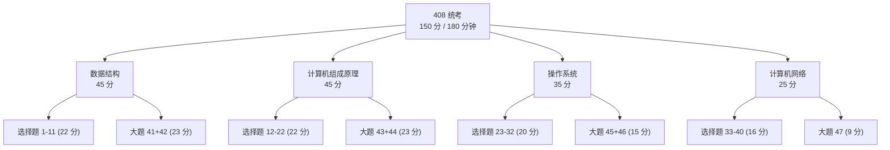
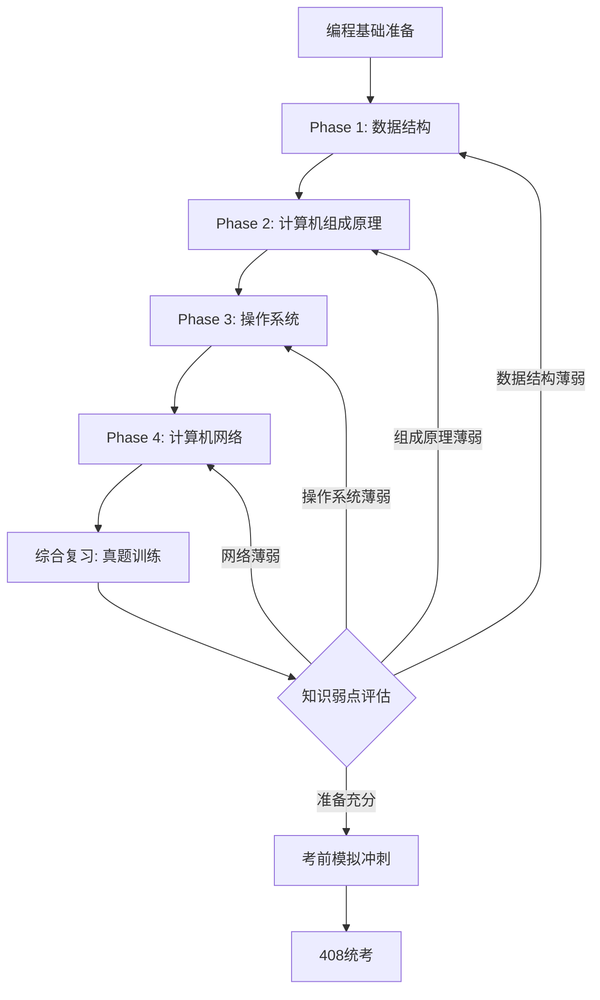
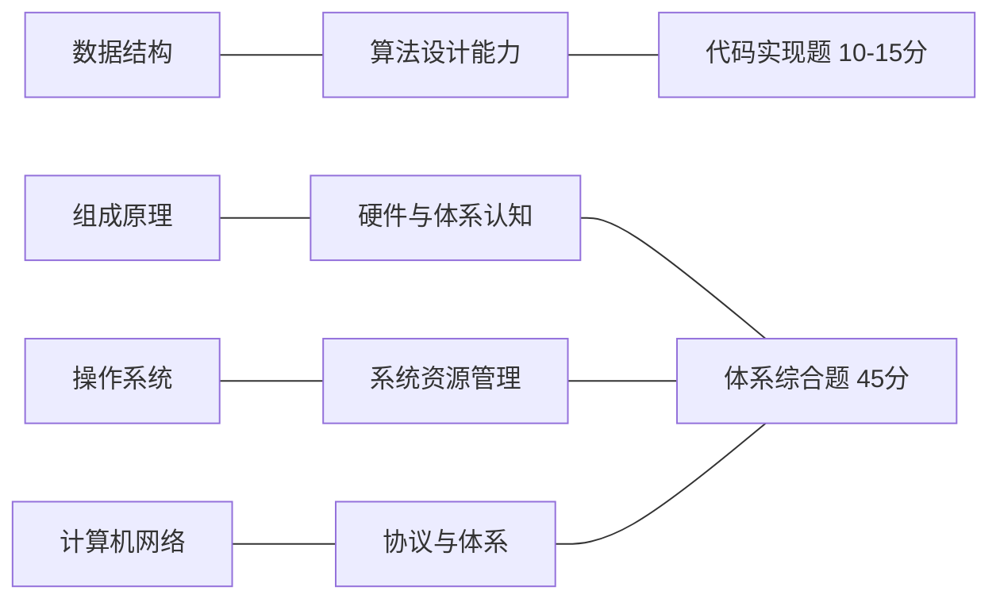

## 路径 — 考研408方向（408 四科统一入口）

> 本文件是 **408 计算机学科专业基础综合** 唯一入口：将四科阅读方向（数据结构、计算机组成原理、操作系统、计算机网络）与逐考点章节索引（覆盖度对照）整合于一体。
>
> 本路线图既是备考路线，也是计算机本科核心课程的全覆盖索引。无论最终是否参加统考，掌握这四门课的内容和思维方式，是成为合格计算机工程师的必要条件。各学科章节正文只按**学科本身**组织教学内容，不再内嵌考点对照。

---

### 408 考试构成

| 科目 | 分值 | 选择题 (1-40) | 综合应用题 (41-47) |
|------|:---:|:---:|:---:|
| 数据结构 | 45 分 | 1-11 题 (22 分) | 41 (算法设计, 13 分) / 42 (结构分析, 10 分) |
| 计算机组成原理 | 45 分 | 12-22 题 (22 分) | 43 (分析/设计, 8 分) / 44 (计算/分析, 15 分) |
| 操作系统 | 35 分 | 23-32 题 (20 分) | 45 (简答/分析, 7 分) / 46 (综合, 8 分) |
| 计算机网络 | 25 分 | 33-40 题 (16 分) | 47 (分析/计算, 9 分) |
| **合计** | **150 分** | **40 题 × 2 分 = 80 分** | **7 大题 = 70 分** |

---

### 目标受众

| 维度 | 描述 |
|------|------|
| 目标 | 408 统考备考 / 计算机科学四大核心课程系统学习 |
| 前置 | 任意一门编程语言的语法基础 (推荐 C 或 C++) |
| 适用人群 | 考研备考生、跨考转行人员、在校本科生、需要系统补全计算机基础的工程师 |
| 建议周期 | 6-8 个月 (全日制) / 10-12 个月 (在职) |

---

### 前置要求

| 科目 | 最低要求 | 推荐来源 |
|------|---------|---------|
| 编程基础 | 熟悉基本语法、循环、数组、函数 | [[路径A-C主线|C主线 Phase 1]] 或 [[路径B-CPP主线|C++主线 Phase 1]] |
| 数学基础 | 高中数学 + 线性代数 / 概率论基本概念 | 统考数学一/二同步复习 |
| 英语 | 能阅读教材和技术文档 (如 CS:APP 英文版) | 六级水平或同等 |

---

### 学习路线总览

> 四门课不是完全独立的：数据结构中"为什么 vector 比 list 快"需要计算机组成原理的缓存层级解释；操作系统的内存管理又依赖组成原理的地址空间概念。建议严格按照 Phase 1-4 的顺序推进，并在组原和操作系统中进行交叉回顾。

---

### Phase 1: 数据结构（45 分，基础核心）

> 数据结构是 408 中 **分值最高** 且必须写代码的科目，也是整个计算机科学的基石。**阅读方向**：先通读章节理解概念 → 手写核心结构 → 用标准库验证 → 力扣刷题自检 (每章 2-5 题)。完整入口: [[数据结构/DSA学习路线|DSA 学习路线]]。

#### 1.1 阅读方向与建议学时

| 序号 | 章节 | 408 考点 | 建议学时 | | |
| :-: | ------------------------- | ------------------------------ | :-------------------------------------------------------------------: | ------------------ | --- |
| 1 | [[数据结构/A_数组_Array | 数组 Array]] | 线性表的顺序存储、插入删除算法复杂度 | 4h | |
| 2 | [[数据结构/B_字符串_String | 字符串 String]] | 串的匹配 (KMP 算法及其 next 数组) | 4h | |
| 3 | [[数据结构/E_链表_LinkedList | 链表 LinkedList]] | 单/双向链表的增删、头插法/尾插法、循环链表 | 5h | |
| 4 | [[数据结构/F_栈_Stack | 栈 Stack]] | 栈的应用 (表达式求值、括号匹配、递归) | 4h | |
| 5 | [[数据结构/G_队列_Queue | 队列 Queue]] | 循环队列判空/判满、链式队列 | 4h | |
| 6 | [[数据结构/J_树_Tree_BST_AVL | 树与二叉树]] | 二叉树遍历非递归算法、线索二叉树、森林与树的转换、Huffman 树 | 8h | |
| 7 | [[数据结构/S_图_Graph | 图 Graph]] | 邻接矩阵/邻接表、DFS/BFS、最小生成树 (Prim/Kruskal)、最短路径 (Dijkstra/Floyd)、拓扑排序、关键路径 | 10h | |
| 8 | [[数据结构/H_排序_八大排序_Sorting | 排序八大算法]] | 插入/希尔/冒泡/快排/选择/堆排序/归并排序/基数排序的时间空间复杂度与稳定性对比 | 8h | |
| 9 | [[数据结构/N_哈希表_HashTable | 哈希表]] | 哈希函数构造、冲突解决 (开放定址/拉链)、平均查找长度 ASL 计算 | 5h | |
| 10 | [[数据结构/I_堆_Heap | 堆]] | 堆排序、堆的插入与删除、堆与优先队列 | 4h | |
| 11 | [[数据结构/L_字典树_Trie | 字典树]] + [[数据结构/O_并查集_UnionFind | 并查集]] | Trie 查找复杂度、并查集路径压缩 | 4h |
| 12 | [[数据结构/K_红黑树_RedBlackTree | 红黑树]] + [[数据结构/M_B树_BTree | B树]] | 红黑树性质、B树/B+树定义与查找 | 5h |

#### 1.2 章节索引（408 考点 → 文件映射）

**线性表**

| 408 考点 | 对应文件 | 覆盖度 |
|----------|---------|:---:|
| 线性表的定义与基本操作 | [[数据结构/D_容器_Container|D 容器]] — 连续存储 vs 节点存储 | 完整 |
| 顺序存储结构 (顺序表) | [[数据结构/A_数组_Array|A 数组]] — 寻址公式、静态/动态数组 | 完整 |
| 链式存储结构 (单链表/双链表/循环链表) | [[数据结构/E_链表_LinkedList|E 链表]] — 三种形态、插入删除 | 完整 |
| 顺序表与链表的比较 | [[数据结构/D_容器_Container|D 容器]] — CPU 缓存与空间局部性 | 完整 |
| 线性表的应用 | [[数据结构/D_容器_Container|D 容器]] — vector 扩容均摊分析 | 完整 |

**栈、队列和数组**

| 408 考点 | 对应文件 | 覆盖度 |
|----------|---------|:---:|
| 栈的基本概念 | [[数据结构/F_栈_Stack|F 栈]] — LIFO、操作表 | 完整 |
| 栈的顺序与链式存储 | [[数据结构/F_栈_Stack|F 栈]] — 数组 / 链表实现 | 完整 |
| 栈的应用 (括号/表达式/递归) | [[数据结构/F_栈_Stack|F 栈]] — 调用栈、栈溢出 | 完整 |
| 队列的基本概念 | [[数据结构/G_队列_Queue|G 队列]] — FIFO、操作表 | 完整 |
| 循环队列 | [[数据结构/G_队列_Queue|G 队列]] — 取模、假溢出、满判定 | 完整 |
| 双端队列 | [[数据结构/G_队列_Queue|G 队列]] — deque 分段连续存储 | 完整 |
| 特殊矩阵的压缩存储 (对称/三角/对角) | [[数据结构/C_稀疏矩阵_SparseMatrix|C 稀疏矩阵]] — 数组索引映射 | 部分 |
| 稀疏矩阵 (三元组/十字链表) | [[数据结构/C_稀疏矩阵_SparseMatrix|C 稀疏矩阵]] — COO/CSR 详解 | 完整 |

**串**

| 408 考点 | 对应文件 | 覆盖度 |
|----------|----------|:---:|
| 串的定义与基本操作 | [[数据结构/B_字符串_String|B 字符串]] — C 风格 vs Pascal 风格 | 完整 |
| 串的模式匹配 (暴力) | [[数据结构/B_字符串_String|B 字符串]] — BF 算法 | 完整 |
| KMP 算法 (next 数组、匹配过程) | [[数据结构/B_字符串_String|B 字符串]] — 前缀函数推导、自动机 | 完整 |
| KMP 的改进与优化 | [[算法/字符串扩展/Trie字典树|算法 字符串扩展]] — AC 自动机 (扩展) | 超纲 |

**树与二叉树**

| 408 考点 | 对应文件 | 覆盖度 |
|----------|----------|:---:|
| 树的基本概念 | [[数据结构/J_树_Tree_BST_AVL|J 树]] — 术语体系 (深度/高度/层) | 完整 |
| 二叉树的定义与性质 | [[数据结构/J_树_Tree_BST_AVL|J 树]] — 二叉树定义 | 完整 |
| 二叉树的顺序与链式存储 | [[数据结构/J_树_Tree_BST_AVL|J 树]] | 完整 |
| 二叉树的遍历 (前/中/后/层序) | [[数据结构/J_树_Tree_BST_AVL|J 树]] — 四种遍历详解 | 完整 |
| 线索二叉树 | — | 缺 |
| 树的存储结构 (双亲/孩子/孩子兄弟) | [[数据结构/J_树_Tree_BST_AVL|J 树]] | 部分 |
| 树与二叉树的转换 | — | 缺 |
| 森林的遍历 | — | 缺 |
| 哈夫曼树与哈夫曼编码 | — | 缺 |
| 并查集及其应用 | [[数据结构/O_并查集_UnionFind|O 并查集]] — 路径压缩、按秩合并 | 完整 |
| 二叉排序树 (BST) | [[数据结构/J_树_Tree_BST_AVL|J 树]] — 插入/查找/删除 | 完整 |
| 平衡二叉树 (AVL) | [[数据结构/J_树_Tree_BST_AVL|J 树]] — 四种旋转 | 完整 |
| 红黑树 (概念与性质) | [[数据结构/K_红黑树_RedBlackTree|K 红黑树]] — 五个性质、插入删除 | 超纲 |

**图**

| 408 考点 | 对应文件 | 覆盖度 |
|----------|----------|:---:|
| 图的基本概念 | [[数据结构/S_图_Graph|S 图]] — 图的分类 | 完整 |
| 图的存储 (邻接矩阵/邻接表) | [[数据结构/S_图_Graph|S 图]] — 两种存储对比 | 完整 |
| 图的遍历 (BFS/DFS) | [[数据结构/S_图_Graph|S 图]] — BFS/DFS 对比表格 | 完整 |
| 最小生成树 (Prim/Kruskal) | [[数据结构/S_图_Graph|S 图]] + [[算法/图论/最小生成树]] | 完整 |
| 最短路径 (Dijkstra) | [[数据结构/S_图_Graph|S 图]] — 正确性证明、复杂度分析 | 完整 |
| 最短路径 (Floyd) | [[数据结构/T_图的高级算法_AdvancedGraph|T 图高级算法]] — Floyd-Warshall | 完整 |
| 拓扑排序 | [[数据结构/T_图的高级算法_AdvancedGraph|T 图高级算法]] — Kahn/DFS 两种写法 | 完整 |
| 关键路径 (AOE 网) | — | 缺 |
| 有向无环图 (DAG) | [[数据结构/T_图的高级算法_AdvancedGraph|T 图高级算法]] — 拓扑排序 | 部分 |

**查找**

| 408 考点 | 对应文件 | 覆盖度 |
|----------|----------|:---:|
| 查找的基本概念 | [[数据结构/J_树_Tree_BST_AVL|J 树]] | 完整 |
| 顺序查找 | [[算法/算法技巧/暴力枚举|算法 暴力枚举]] | 部分 |
| 折半查找 | [[算法/算法技巧/二分查找|算法 二分查找]] — 详细实现与分析 | 完整 |
| 分块查找 | — | 缺 |
| B 树及其基本操作 | [[数据结构/M_B树_BTree|M B 树]] — 定义、高度分析、插入/删除 | 完整 |
| B+ 树的基本概念 | [[数据结构/M_B树_BTree|M B 树]] — B+ 树章节 | 完整 |
| 散列表 (哈希表) | [[数据结构/N_哈希表_HashTable|N 哈希表]] — 哈希函数、冲突处理 | 完整 |
| 冲突处理 (链地址/开放地址) | [[数据结构/N_哈希表_HashTable|N 哈希表]] — 两种方法详解 | 完整 |
| 查找效率分析 (ASL) | [[数据结构/N_哈希表_HashTable|N 哈希表]] — 装载因子、rehash | 部分 |
| 串的匹配 (KMP 应用) | [[数据结构/B_字符串_String|B 字符串]] | 完整 |

**排序**

| 408 考点 | 对应文件 | 覆盖度 |
|----------|----------|:---:|
| 排序基本概念 (稳定性/内排vs外排) | [[数据结构/H_排序_八大排序_Sorting|H 八大排序]] — 稳定性表格、比较下界 | 完整 |
| 插入排序 (直接/折半插入) | [[数据结构/H_排序_八大排序_Sorting|H 八大排序]] | 完整 |
| 希尔排序 | [[数据结构/H_排序_八大排序_Sorting|H 八大排序]] | 完整 |
| 冒泡排序 | [[数据结构/H_排序_八大排序_Sorting|H 八大排序]] — 优化、流程图 | 完整 |
| 快速排序 | [[数据结构/H_排序_八大排序_Sorting|H 八大排序]] — 枢轴选择、优化 | 完整 |
| 简单选择排序 | [[数据结构/H_排序_八大排序_Sorting|H 八大排序]] | 完整 |
| 堆排序 | [[数据结构/H_排序_八大排序_Sorting|H 八大排序]] + [[数据结构/I_堆_Heap|I 堆]] | 完整 |
| 二路归并排序 | [[数据结构/H_排序_八大排序_Sorting|H 八大排序]] | 完整 |
| 基数排序 | [[数据结构/H_排序_八大排序_Sorting|H 八大排序]] | 完整 |
| 各种排序算法的比较 | [[数据结构/H_排序_八大排序_Sorting|H 八大排序]] — 总览表 | 完整 |
| 外部排序 (多路归并/败者树/置换选择) | — | 缺 |

**数据结构覆盖度清单**

- **完整覆盖** (38 个考点): 线性表、栈队列串模式匹配、二叉树定义与遍历、BST/AVL、图存储与遍历、最小生成树、Dijkstra、拓扑排序、B 树/B+树、哈希表、八大排序
- **部分覆盖** (5): 特殊矩阵压缩（缺对称/三角/对角一维映射）、树与二叉树转换/森林遍历、DAG 关键路径、分块查找、ASL 分析
- **缺** (5): 线索二叉树、树/森林与二叉树的转换、哈夫曼树与哈夫曼编码、关键路径 (AOE)、外部排序
- **超纲但值得学**: COO/CSR 工程细节、红黑树旋转与染色、Trie/01-Trie、并查集路径压缩、跳表 (Redis zset 底层)、线段树/树状数组、Tarjan SCC/网络流 Dinic

> **学完本阶段后建议**: 回看 [[路径D-DSA算法刷题|竞赛策略路线图]] Phase 1-3 的算法技巧，将数据结构与算法竞赛刷题思维结合起来。

---

### Phase 2: 计算机组成原理（45 分，难点学科）

> 组成原理是 408 中 **最难但体系最严谨** 的科目。数据表示、存储系统、CPU 执行流程是核心。**阅读方向**：每掌握一个机制，就用工具验证 (gdb/godbolt/perf 或 C 程序仿真)，把硬件"看"见。完整教程入口: [[计算机原理/计算机原理_索引|计算机原理索引]]

#### 2.1 阅读顺序与建议学时

| 序号 | 章节 | 408 考点 | 建议学时 |
|:----:|------|---------|:-------:|
| 1 | [[计算机原理/A_数据表示\|A 数据表示]] | 数制转换、补码/移码、IEEE 754 浮点数、海明码/CRC 校验 | 6h |
| 2 | [[计算机原理/E_指令集体系结构\|E 指令集体系结构]] | 指令格式、寻址方式 (10种)、MIPS/x86 对比 | 5h |
| 3 | [[计算机原理/C_CPU架构\|C CPU架构]] | CPU 组成、指令周期、微程序控制、流水线 (五级流水) | 8h |
| 4 | [[计算机原理/I_流水线与指令流水\|I 流水线与指令流水]] | 数据相关/控制相关/结构相关、流水线性能计算、流水线冲突 | 6h |
| 5 | [[计算机原理/H_CPU数据通路与控制器\|H CPU数据通路]] | 单周期/多周期 CPU 数据通路设计、硬布线控制器 vs 微程序控制器 | 5h |
| 6 | [[计算机原理/B_缓存层级\|B 缓存层级]] + [[计算机原理/D_内存层次结构\|D 内存层次]] | Cache-主存-辅存三级结构、映射方式 (直接/全相连/组相连)、命中率计算 | 6h |
| 7 | [[计算机原理/F_总线系统\|F 总线系统]] | 总线仲裁、总线定时、PCIe 基础 | 3h |
| 8 | [[计算机原理/G_输入输出系统\|G 输入输出系统]] | 中断 (向量中断/中断嵌套)、DMA 三阶段、磁盘读写时间计算 | 5h |
| 9 | [[计算机原理/J_运算方法与运算器\|J 运算方法]] | 补码加减法、Booth 乘法、ALU 设计 | 4h |

#### 2.2 逐章索引（408 考点 → 参考实现）

**计算机系统概述**

| 408 考点 | 对应文件 | 覆盖度 |
|----------|---------|:---:|
| 计算机发展历程 | — | 缺 |
| 计算机系统层次结构 | [[计算机原理/C_CPU架构|C 架构]] — Von Neumann 架构 | 完整 |
| 计算机硬件的基本组成 (五部件) | [[计算机原理/C_CPU架构|C 架构]] — CU/ALU/寄存器/内存 | 完整 |
| 计算机软件的分类 | [[操作系统/A_操作系统概述|OS A 概述]] — 用户态/内核态 | 部分 |
| 计算机工作的执行过程 (取指-译码-执行) | [[计算机原理/C_CPU架构|C 架构]] + [[计算机原理/H_CPU数据通路与控制器|H 数据通路]] | 完整 |
| 计算机性能指标 (CPI/MIPS/MFLOPS/加速比) | [[计算机原理/I_流水线与指令流水|I 流水线]] — 量化参数 | 完整 |

**数据的表示和运算**

| 408 考点 | 对应文件 | 覆盖度 |
|----------|----------|:---:|
| 进位计数制与转换 | [[计算机原理/A_数据表示|A 数据表示]] | 部分 |
| 真值与操作数 | [[计算机原理/A_数据表示|A 数据表示]] | 部分 |
| 原码/反码/补码/移码 | [[计算机原理/A_数据表示|A 数据表示]] — 补码详解 | 部分 |
| 定点数的表示与运算 | [[计算机原理/A_数据表示|A 数据表示]] + [[计算机原理/J_运算方法与运算器|J 运算器]] | 完整 |
| 浮点数的表示 (IEEE 754) | [[计算机原理/A_数据表示|A 数据表示]] — s/E/M 格式、特殊值 | 完整 |
| 浮点数的加减运算 | [[计算机原理/J_运算方法与运算器|J 运算器]] — IEEE 754 浮点运算 | 完整 |
| ALU 的结构与功能 | [[计算机原理/J_运算方法与运算器|J 运算器]] — 半加器/全加器/行波进位 | 完整 |
| 串行进位与并行进位 (CLA) | [[计算机原理/J_运算方法与运算器|J 运算器]] — 超前进位加法器 | 完整 |

**存储系统**

| 408 考点 | 对应文件 | 覆盖度 |
|----------|----------|:---:|
| 存储系统的层次结构 | [[计算机原理/D_内存层次结构|D 内存层次]] — 金字塔模型 | 完整 |
| SRAM 与 DRAM | [[计算机原理/D_内存层次结构|D 内存层次]] — 6T SRAM vs 1T1C DRAM | 完整 |
| ROM (掩膜/PROM/EPROM/Flash) | — | 缺 |
| 存储芯片与扩展 | — | 缺 |
| 主存与 CPU 的连接 | [[计算机原理/F_总线系统|F 总线]] — 地址/数据/控制总线 | 部分 |
| Cache 的基本原理 | [[计算机原理/B_缓存层级|B 缓存]] — Line、命中/缺失 | 完整 |
| Cache 映射 (直接/全关联/组关联) | [[计算机原理/B_缓存层级|B 缓存]] — 关联度分析 | 完整 |
| Cache 替换算法 (LRU/RAND/FIFO) | [[计算机原理/B_缓存层级|B 缓存]] — 写策略 | 部分 |
| Cache 写策略 (写直达/写回) | [[计算机原理/B_缓存层级|B 缓存]] | 完整 |
| 虚拟存储器 | [[计算机原理/D_内存层次结构|D 内存层次]] — TLB + [[操作系统/F_内存管理|OS F 内存]] | 完整 |
| TLB (快表) | [[操作系统/F_内存管理|OS F 内存]] — TLB 详解 | 完整 |

**指令系统**

| 408 考点 | 对应文件 | 覆盖度 |
|----------|----------|:---:|
| 指令的基本格式 | [[计算机原理/E_指令集体系结构|E 指令集]] | 完整 |
| 定长/扩展操作码 | [[计算机原理/E_指令集体系结构|E 指令集]] | 部分 |
| 寻址方式 | [[计算机原理/E_指令集体系结构|E 指令集]] — 五种寻址模式 + 基址变址偏移 | 完整 |
| 有效地址的计算 | [[计算机原理/E_指令集体系结构|E 指令集]] | 完整 |
| CISC 与 RISC | [[计算机原理/E_指令集体系结构|E 指令集]] — 对比表 | 完整 |
| 常见指令类型 | [[计算机原理/E_指令集体系结构|E 指令集]] | 部分 |

**中央处理器 (CPU)**

| 408 考点 | 对应文件 | 覆盖度 |
|----------|----------|:---:|
| CPU 的功能与基本结构 | [[计算机原理/C_CPU架构|C 架构]] — Von Neumann + 流水线概念 | 完整 |
| 指令执行过程 | [[计算机原理/H_CPU数据通路与控制器|H 数据通路]] — 五阶段分解 | 完整 |
| 数据通路 (单/双/三总线) | [[计算机原理/H_CPU数据通路与控制器|H 数据通路]] | 完整 |
| 控制器的功能与原理 | [[计算机原理/H_CPU数据通路与控制器|H 数据通路]] | 完整 |
| 硬布线控制器 | [[计算机原理/H_CPU数据通路与控制器|H 数据通路]] | 部分 |
| 微程序控制器 | — | 缺 |
| 指令流水线的基本概念 | [[计算机原理/C_CPU架构|C 架构#指令流水线]] + [[计算机原理/I_流水线与指令流水|I 流水线]] | 完整 |
| 五级流水线 | [[计算机原理/I_流水线与指令流水|I 流水线]] — 时空图、量化参数 | 完整 |
| 流水线冒险 (结构/数据/控制) | [[计算机原理/C_CPU架构|C 架构#流水线冒险]] + [[计算机原理/I_流水线与指令流水|I 流水线]] | 完整 |
| 数据前推 (Forwarding) | [[计算机原理/I_流水线与指令流水|I 流水线]] | 完整 |
| 分支预测 | [[计算机原理/C_CPU架构|C 架构#分支预测]] | 完整 |
| 超标量与动态调度 | [[计算机原理/I_流水线与指令流水|I 流水线]] | 部分 |

**总线**

| 408 考点 | 对应文件 | 覆盖度 |
|----------|----------|:---:|
| 总线的基本概念 | [[计算机原理/F_总线系统|F 总线]] — 数据/地址/控制总线 | 完整 |
| 总线分类 (片内/系统/通信) | [[计算机原理/F_总线系统|F 总线]] | 完整 |
| 总线性能指标 | [[计算机原理/F_总线系统|F 总线]] — 带宽计算公式 | 完整 |
| 总线仲裁 (集中式/分布式) | [[计算机原理/F_总线系统|F 总线]] | 完整 |
| 总线操作与定时 | [[计算机原理/F_总线系统|F 总线]] — 同步/异步/半同步/分离 | 完整 |
| 总线标准 (PCI/PCIe/USB 等) | [[计算机原理/F_总线系统|F 总线]] — 总线类型总表 | 完整 |

**输入/输出系统**

| 408 考点 | 对应文件 | 覆盖 |
|----------|----------|:---:|
| I/O 接口的功能与结构 | [[计算机原理/G_输入输出系统|G I/O 系统]] — 接口内部寄存器 | 完整 |
| I/O 端口编址 (独立/统一) | [[计算机原理/G_输入输出系统|G I/O 系统]] — PMIO vs MMIO | 完整 |
| 程序查询方式 (轮询) | [[计算机原理/G_输入输出系统|G I/O 系统]] | 完整 |
| 中断方式 | [[计算机原理/G_输入输出系统|G I/O 系统]] — 完整流程 | 完整 |
| DMA 方式 | [[计算机原理/G_输入输出系统|G I/O 系统]] — DMA 控制器与传输 | 完整 |
| 通道方式 | — | 缺 |

**组成原理覆盖度清单**

- **完整覆盖**: 五部件组成、数据通路、流水线全部、缓存层次、总线与 I/O (查询/中断/DMA)、指令格式与寻址、CISC vs RISC、定点/浮点表示、加法器/ALU
- **部分覆盖**: 原码/反码/移码 (仅重点讲了补码)、Cache 替换算法 (LRU 深度不足)、扩展操作码、微程序控制器细节、主存与 CPU 连接
- **缺**: 计算机发展历程、进位制的系统讲解、ROM 分类、存储器芯片与扩展、微程序控制器完整设计、通道方式
- 工程扩展建议 (超越考点): 用 gdb/objdump 验证指令集、用 perf 测 cache 命中率、用 Logisim 仿真 CPU、大小端转换实验、IEEE 754 精度实验

> **学习完本阶段后建议**: 组成原理学完后，操作系统中的内存管理和 I/O 管理会极其自然。立即过渡到 Phase 3，并保持交叉回顾。

---

### Phase 3: 操作系统（35 分，承上启下）

> 操作系统是连接硬件 (组原) 与软件 (数据结构 + 网络) 的桥梁。内存管理、进程调度、文件系统是核心。完整教程入口: [[操作系统/操作系统_索引|操作系统索引]]。**此为系统级编程的基础**，可与 [[路径-工程化底层方向]] 的实操内容对齐。

#### 3.1 阅读顺序与建议学时

| 序号 | 章节 | 408 考点 | 建议学时 |
|:----:|------|---------|:-------:|
| 1 | [[操作系统/A_操作系统概述\|A 操作系统概述]] | 操作系统概念、中断/异常/系统调用 | 2h |
| 2 | [[操作系统/B_进程管理\|B 进程管理]] | 进程状态转换、PCB、上下文切换 | 5h |
| 3 | [[操作系统/D_CPU调度\|D CPU调度]] | FCFS/SJF/优先级/时间片轮转/多级反馈队列、周转时间计算 | 5h |
| 4 | [[操作系统/E_同步与死锁\|E 同步与死锁]] | 临界区、信号量、死锁必要条件、银行家算法 | 8h |
| 5 | [[操作系统/F_内存管理\|F 内存管理]] | 连续分配、分页/分段/段页式、页面置换算法 | 10h |
| 6 | [[操作系统/H_文件系统\|H 文件系统]] | FCB/inode、目录结构、文件分配、磁盘调度 | 6h |
| 7 | [[操作系统/J_IO管理\|J I/O管理]] | I/O控制方式 (程序/中断/DMA)、SPOOLing、缓冲 | 4h |
| 8 | [[操作系统/I_进程间通信\|I 进程间通信]] | 管道/共享内存/消息队列/Socket | 3h |
| 9 | [[操作系统/C_线程与并发\|C 线程与并发]] | 线程模型、进程 vs 线程 | 4h |

#### 3.2 逐章索引（408 考点 → 参考实现）

**操作系统概述**

| 408 考点 | 对应文件 | 覆盖度 |
|----------|----------|:---:|
| 操作系统的概念与特征 | [[操作系统/A_操作系统概述\|A 概述]] — 核心职责 | 完整 |
| 操作系统的发展与分类 | — | 缺 |
| 操作系统运行环境 (用户态/内核态) | [[操作系统/A_操作系统概述\|A 概述]] | 完整 |
| 中断与异常 | [[操作系统/A_操作系统概述\|A 概述]] | 完整 |
| 系统调用 | [[操作系统/A_操作系统概述\|A 概述]] | 完整 |
| 内核类型 | [[操作系统/A_操作系统概述\|A 概述]] | 完整 |
| 操作系统启动过程 | [[操作系统/A_操作系统概述\|A 概述]] | 完整 |

**进程管理**

| 408 考点 | 对应文件 | 覆盖度 |
|----------|----------|:---:|
| 进程的概念与特征 | [[操作系统/B_进程管理\|B 进程]] — 进程定义、PCB | 完整 |
| 进程的状态与转换 | [[操作系统/B_进程管理\|B 进程]] — 状态转换图 | 完整 |
| 进程控制 (创建/终止/阻塞/唤醒) | [[操作系统/B_进程管理\|B 进程]] — fork/exec | 完整 |
| 进程通信 | [[操作系统/I_进程间通信\|I 进程间通信]] — 七种 IPC 对比 | 完整 |
| 线程的概念与多线程模型 | [[操作系统/C_线程与并发\|C 线程]] — 进程 vs 线程、1:1/N:1/M:N | 完整 |
| 处理机调度概念与层次 | [[操作系统/D_CPU调度\|D CPU调度]] | 完整 |
| 调度算法 | [[操作系统/D_CPU调度\|D CPU调度]] — FCFS/SJF/RR/MLFQ/CFS | 完整 |
| 进程同步与互斥 | [[操作系统/E_同步与死锁\|E 同步]] — 临界区、信号量、PV | 完整 |
| 经典同步问题 | [[操作系统/E_同步与死锁\|E 同步]] — 生产者-消费者 | 部分 |
| 死锁概念与处理 | [[操作系统/E_同步与死锁\|E 同步]] — 死锁/银行家算法 | 完整 |
| 银行家算法 | [[操作系统/E_同步与死锁\|E 同步]] | 完整 |

**内存管理**

| 408 考点 | 对应文件 | 覆盖 |
|----------|----------|:---:|
| 内存管理的概念与功能 | [[操作系统/F_内存管理\|F 内存]] | 完整 |
| 连续分配 (单一/固定/动态分区) | [[操作系统/F_内存管理\|F 内存]] | 部分 |
| 分页存储管理 | [[操作系统/F_内存管理\|F 内存]] — 四级页表、地址转换 | 完整 |
| 分段存储管理 | — | 缺 |
| 段页式存储管理 | — | 缺 |
| 虚拟内存 | [[操作系统/F_内存管理\|F 内存]] | 完整 |
| 请求分页管理方式 | [[操作系统/F_内存管理\|F 内存]] — 缺页中断流程 | 完整 |
| 页面置换算法 | [[操作系统/F_内存管理\|F 内存]] — FIFO/LRU/CLOCK | 部分 |
| 抖动与工作集 | — | 缺 |
| malloc 底层 | [[操作系统/G_内存分配器\|G 内存分配器]] — ptmalloc、bin 体系 | 超纲 |

**文件管理**

| 408 考点 | 对应文件 | 覆盖度 |
|----------|----------|:---:|
| 文件系统的基本概念 | [[操作系统/H_文件系统\|H 文件系统]] — VFS、inode | 完整 |
| 文件的逻辑与物理结构 | [[操作系统/H_文件系统\|H 文件系统]] — 直接块/间接块 | 完整 |
| 目录结构 | [[操作系统/H_文件系统\|H 文件系统]] — 硬链接/软链接 | 完整 |
| 文件共享 | [[操作系统/H_文件系统\|H 文件系统]] | 完整 |
| 文件保护 | — | 缺 |
| 文件系统实现 (空闲空间管理) | — | 缺 |
| 磁盘组织与管理 | [[操作系统/J_IO管理\|J I/O 管理]] — 磁盘调度 | 完整 |

**输入/输出(I/O)管理**

| 408 考点 | 对应文件 | 覆盖 |
|----------|----------|:---:|
| I/O 管理概述 | [[操作系统/J_IO管理\|J I/O 管理]] | 完整 |
| I/O 控制方式 | [[操作系统/J_IO管理\|J I/O 管理]] — 四种方式 | 完整 |
| 缓冲区管理 | [[操作系统/J_IO管理\|J I/O 管理]] | 完整 |
| SPOOLing | [[操作系统/J_IO管理\|J I/O 管理]] | 完整 |
| I/O 软件层次 | [[操作系统/J_IO管理\|J I/O 管理]] | 完整 |
| 磁盘调度算法 | [[操作系统/J_IO管理\|J I/O 管理]] | 完整 |

**操作系统覆盖度清单**

- **完整覆盖**: 进程状态转换、PCB、上下文切换、fork/exec、线程模型、调度算法、信号量与 PV、死锁与银行家、分页与四级页表、TLB、缺页中断、VFS/inode、硬链接/软链接、文件描述符、I/O 控制方式、磁盘调度
- **部分覆盖**: 经典同步问题 (仅生产者-消费者)、连续分配细节、页面置换 (需练 CLOCK)、文件保护与空闲空间管理
- **缺**: OS 发展史与分类、分段/段页式存储管理、抖动与工作集
- **超纲但值得学**: ptmalloc/jemalloc/zmalloc 分配器体系 ([[操作系统/G_内存分配器|G 内存分配器]])

> **学习完本阶段后建议**: 死锁与 PV 操作需要大量练习。可结合 [[路径-工程化底层方向]] Phase 4 将理论转化为系统调用实践。

---

### Phase 4: 计算机网络（25 分，体系化收官）

> 计算机网络是 **体系性最强** 的科目。从物理层到应用层的五层体系、TCP/IP 协议族是核心。完整教程入口: [[计算机网络/计算机网络_索引|计算机网络索引]]。**动手建议**：每学一层尝试用抓包工具 (tcpdump/wireshark) 或命令行工具 (curl/nc/ss) 观测一次真实流量。

#### 4.1 阅读顺序与建议学时

| 序号 | 章节 | 408 考点 | 建议学时 |
|:--:|------|---------|:-------:|
| 1 | [[计算机网络/A_体系结构\|A 体系结构]] | OSI 七层 / TCP/IP 四层模型、性能指标 | 3h |
| 2 | [[计算机网络/B_物理层\|B 物理层]] | 奈奎斯特/香农定理、编码方式 (NRZ/曼彻斯特) | 4h |
| 3 | [[计算机网络/C_数据链路层\|C 数据链路层]] | 组帧、CRC/海明码、CSMA/CD、以太网、交换机 | 8h |
| 4 | [[计算机网络/D_网络层\|D 网络层]] | IPv4/子网/CIDR、ARP/ICMP/DHCP、路由协议、NAT | 10h |
| 5 | [[计算机网络/E_传输层\|E 传输层]] | TCP 报文段、握手挥手、可靠传输、流量/拥塞控制、UDP | 12h |
| 6 | [[计算机网络/F_应用层\|F 应用层]] | DNS、HTTP、FTP、电子邮件 | 6h |

#### 4.2 逐章索引（408 考点 → 参考实现）

**计算机网络体系结构**

| 408 考点 | 对应文件 | 覆盖 |
|----------|----------|:---:|
| 计算机网络的概念、组成与功能 | [[计算机网络/A_体系结构\|A 体系结构]] | 完整 |
| 计算机网络的分类 | [[计算机网络/A_体系结构\|A 体系结构]] — LAN/MAN/WAN | 完整 |
| 性能指标 | [[计算机网络/A_体系结构\|A 体系结构]] | 完整 |
| OSI 七层模型 | [[计算机网络/A_体系结构\|A 体系结构]] — OSI vs TCP/IP | 完整 |
| TCP/IP 四层模型 | [[计算机网络/A_体系结构\|A 体系结构]] | 完整 |
| 协议、接口、服务 | [[计算机网络/A_体系结构\|A 体系结构]] | 完整 |

**物理层**

| 408 考点 | 对应文件 | 覆盖 |
|----------|----------|:---:|
| 通信基础 | [[计算机网络/B_物理层\|B 物理层]] — 通信系统模型 | 完整 |
| 奈奎斯特定理 | [[计算机网络/B_物理层\|B 物理层]] — Nyquist 公式 + 例题 | 完整 |
| 香农定理 | [[计算机网络/B_物理层\|B 物理层]] — Shannon 公式 + 例题 | 完整 |
| 编码与调制 | [[计算机网络/B_物理层\|B 物理层]] — 基带/带通传输 | 完整 |
| 交换方式 | [[计算机网络/B_物理层\|B 物理层]] — 电路/报文/分组 | 完整 |
| 数据报与虚电路 | [[计算机网络/B_物理层\|B 物理层]] | 完整 |
| 传输介质 | [[计算机网络/B_物理层\|B 物理层]] | 完整 |
| 物理层设备 | [[计算机网络/B_物理层\|B 物理层]] | 完整 |

**数据链路层**

| 408 考点 | 对应文件 | 覆盖 |
|----------|----------|:---:|
| 数据链路层的功能 | [[计算机网络/C_数据链路层\|C 数据链路层]] | 完整 |
| 组帧 | [[计算机网络/C_数据链路层\|C 数据链路层]] — 四种组帧方法 | 完整 |
| 差错控制 | [[计算机网络/C_数据链路层\|C 数据链路层]] — CRC 计算 | 完整 |
| 流量控制与可靠传输 | [[计算机网络/C_数据链路层\|C 数据链路层]] — 三大协议 | 完整 |
| 介质访问控制 | [[计算机网络/C_数据链路层\|C 数据链路层]] — MAC 子层 | 完整 |
| ALOHA/CSMA/CSMA/CD | [[计算机网络/C_数据链路层\|C 数据链路层]] | 完整 |
| CSMA/CA | [[计算机网络/C_数据链路层\|C 数据链路层]] | 完整 |
| 局域网 | [[计算机网络/C_数据链路层\|C 数据链路层]] — 802.3、交换机 | 完整 |
| 广域网 (PPP) | [[计算机网络/C_数据链路层\|C 数据链路层]] | 完整 |
| VLAN | [[计算机网络/C_数据链路层\|C 数据链路层]] | 完整 |

**网络层**

| 408 考点 | 对应文件 | 覆盖 |
|----------|----------|:---:|
| 网络层的功能 | [[计算机网络/D_网络层\|D 网络层]] — 数据 / 控制平面 | 完整 |
| 路由算法 | [[计算机网络/D_网络层\|D 网络层]] | 完整 |
| IPv4 地址与子网划分 | [[计算机网络/D_网络层\|D 网络层]] — IP 分类、子网掩码、CIDR | 完整 |
| CIDR | [[计算机网络/D_网络层\|D 网络层]] — 路由聚合 | 完整 |
| ARP | [[计算机网络/D_网络层\|D 网络层]] | 完整 |
| IP 数据报格式与分片 | [[计算机网络/D_网络层\|D 网络层]] | 完整 |
| ICMP | [[计算机网络/D_网络层\|D 网络层]] | 完整 |
| DHCP | [[计算机网络/D_网络层\|D 网络层]] | 完整 |
| NAT | [[计算机网络/D_网络层\|D 网络层]] | 完整 |
| IPv6 | [[计算机网络/D_网络层\|D 网络层]] | 完整 |
| 路由协议 (RIP/OSPF/BGP) | [[计算机网络/D_网络层\|D 网络层]] | 完整 |
| IP 组播 | [[计算机网络/D_网络层\|D 网络层]] | 完整 |
| 移动 IP | — | 缺 |

**传输层**

| 408 考点 | 对应文件 | 覆盖 |
|----------|----------|:---:|
| 传输层的功能 | [[计算机网络/E_传输层\|E 传输层]] | 完整 |
| 端口与套接字 | [[计算机网络/E_传输层\|E 传输层]] — 五元组 | 完整 |
| UDP | [[计算机网络/E_传输层\|E 传输层]] | 完整 |
| TCP 报文段格式 | [[计算机网络/E_传输层\|E 传输层]] | 完整 |
| TCP 连接管理 | [[计算机网络/E_传输层\|E 传输层]] — 三次握手/四次挥手 | 完整 |
| TCP 可靠传输 | [[计算机网络/E_传输层\|E 传输层]] | 完整 |
| TCP 流量控制 | [[计算机网络/E_传输层\|E 传输层]] | 完整 |
| TCP 拥塞控制 | [[计算机网络/E_传输层\|E 传输层]] — 四个阶段 | 完整 |

**应用层**

| 408 考点 | 对应文件 | 覆盖 |
|----------|----------|:---:|
| 网络应用模型 (C/S / P2P) | [[计算机网络/F_应用层\|F 应用层]] | 完整 |
| DNS | [[计算机网络/F_应用层\|F 应用层]] — 层次/解析/缓存 | 完整 |
| FTP | [[计算机网络/F_应用层\|F 应用层]] — 控制/数据连接 | 完整 |
| 电子邮件 | [[计算机网络/F_应用层\|F 应用层]] — SMTP/POP3/IMAP/MIME | 完整 |
| HTTP | [[计算机网络/F_应用层\|F 应用层]] — HTTP/1.1、HTTP/2、HTTPS | 完整 |
| WWW | [[计算机网络/F_应用层\|F 应用层]] | 完整 |

**网络覆盖度清单**

- **完整覆盖**: 六层体系全部内容，包括 OSI 层模型、物理层双定理、链路层组帧/CRC/CSMA/CD、网络层 IPv4/子网/CIDR/路由协议/IP分片、传输层 TCP/UDP 全部、应用层 DNS/HTTP/FTP/电子邮件
- **缺**: 移动 IP
- **工程建议**: 每层配合抓包实验验证 (tcpdump + wireshark)，参考 [[../linux/11-网络配置基础|Linux 网络配置]] 等实操章节

> **学习完本阶段后建议**: TCP 拥塞控制是压轴重点。学习完可开展 2-3 次基于抓包的实验验证。

---

### 408 大题类型与覆盖统计

| 科目 | 常见题型 | 教程覆盖 | 备注 |
|------|---------|:---:|------|
| **DS** | 算法设计 (线性表/树/图) | 完整 | [[算法/算法技巧/]] 有大量例题 |
| **DS** | B+ 树插入/删除 | 完整 | [[数据结构/M_B树_BTree\|M B 树]] 完整内容 |
| **DS** | 哈希表构造与 ASL | 完整 | [[数据结构/N_哈希表_HashTable\|N 哈希表]] |
| **DS** | 排序对比 | 完整 | [[数据结构/H_排序_八大排序_Sorting\|H 八大排序]] |
| **DS** | 图 (MST/最短路/拓扑) | 完整 | [[数据结构/S_图_Graph\|S 图]] |
| **计组** | Cache 映射与命中率 | 完整 | [[计算机原理/B_缓存层级\|B 缓存]] |
| **计组** | 流水线时空图/CPI/加速比 | 完整 | [[计算机原理/I_流水线与指令流水\|I 流水线]] |
| **计组** | 浮点数 (IEEE 754) | 完整 | [[计算机原理/A_数据表示\|A 数据表示]] + [[计算机原理/J_运算方法与运算器\|J 运算器]] |
| **计组** | 数据通路与控制器 | 完整 | [[计算机原理/H_CPU数据通路与控制器\|H 数据通路]] |
| **计组** | 总线带宽计算 | 完整 | [[计算机原理/F_总线系统\|F 总线]] |
| **计组** | 指令格式/寻址 | 完整 | [[计算机原理/E_指令集体系结构\|E 指令集]] |
| **OS** | PV 操作 | 完整 | [[操作系统/E_同步与死锁\|E 同步]] |
| **OS** | 银行家算法 | 完整 | [[操作系统/E_同步与死锁\|E 同步]] |
| **OS** | 页面置换 | 部分 | [[操作系统/F_内存管理\|F 内存]] (CLOCK 需补) |
| **OS** | 磁盘调度 | 完整 | [[操作系统/J_IO管理\|J I/O]] |
| **OS** | 页表与地址转换 | 完整 | [[操作系统/F_内存管理\|F 内存]] |
| **网络** | IP 分片计算 | 完整 | [[计算机网络/D_网络层\|D 网络层]] |
| **网络** | 子网划分与 CIDR | 完整 | [[计算机网络/D_网络层\|D 网络层]] |
| **网络** | 路由表更新 (RIP/OSPF) | 完整 | [[计算机网络/D_网络层\|D 网络层]] |
| **网络** | TCP 拥塞控制 | 完整 | [[计算机网络/E_传输层\|E 传输层]] |
| **网络** | TCP 序号/确认号/窗口 | 完整 | [[计算机网络/E_传输层\|E 传输层]] |
| **网络** | 奈奎斯特/香农计算 | 完整 | [[计算机网络/B_物理层\|B 物理层]] |

---

### 综合复习策略

| 阶段 | 时间 | 目标 |
|------|:---:|------|
| 第一轮 (精读) | 4-5 月 | 逐章学习所有常规章，建立知识框架 |
| 第二轮 (专题) | 2-3 月 | 四科的 **大题专题** 集中突破 |
| 第三轮 (真题) | 1-2 月 | 近 10 年真题逐套计时模拟，分析错题 |
| 第四轮 (冲刺) | 1 月 | 错题回顾、高频考点速记、考前模拟 |

**推荐复习路径 (按阶段)**:

- **Phase 1 (4-6 周) 基础构建**: 数据结构 (线性表→栈队列→排序) + 计组 (数据表示→运算器) + OS (概述→进程管理)
- **Phase 2 (4-6 周) 核心深化**: 数据结构 (树→BST/AVL→红黑树→B/B+树→图) → 计组 (缓存→内存层次→指令集→CPU 数据通路→流水线) → OS (线程/并发→内存→同步死锁→文件系统) → 网络 (**传输层优先** + 网络层)
- **Phase 3 (2-3 周) 收尾补齐**: 计组总线 + IO、OS IO + 磁盘、网络物理/链路/应用层、定期补充缺项 (线索二叉树/哈夫曼/外部排序/)
- **Phase 4 (4-6 周) 综合大题训练**: 真题 2016-2024 两遍以上 + 题型专项突破 (PV、拥塞窗口、IP 分片、Cache 命中率、流水线加速比)

---

### 交叉模块知识点

408 中部分考点跨科目出现，需联合复习：

| 交叉知识点 | 涉及科目与文件 | 说明 |
|-----------|--------------|------|
| **DMA** | 计组 [[计算机原理/G_输入输出系统\|G I/O 系统]] + OS [[操作系统/J_IO管理\|J I/O]] | 硬件 DMA 原理 + 内核传输接口 |
| **中断** | 计组 [[计算机原理/G_输入输出系统\|G I/O 系统]] + OS [[操作系统/A_操作系统概述\|A 概述]] | 硬件中断流程 + 内核处理 |
| **虚拟内存 / TLB** | OS [[操作系统/F_内存管理\|F 内存]] + 计组 [[计算机原理/D_内存层次结构\|D 内存]] | 页表/TLB 双视图 |
| **Cache** | 计组 [[计算机原理/B_缓存层级\|B 缓存]] + DS [[数据结构/D_容器_Container\|D 容器]] | Cache 结构 + 空间局部性 |
| **指令流水线** | 计组 [[计算机原理/I_流水线与指令流水\|I 流水线]] + [[计算机原理/C_CPU架构\|C 架构]] | 五级流水 + 分支预测 |
| **I/O 控制方式** | 计组 [[计算机原理/G_输入输出系统\|G I/O 系统]] + OS [[操作系统/J_IO管理\|J I/O]] | 硬件 + 软件层次 |
| **总线 vs 设备控制器** | 计组 [[计算机原理/F_总线系统\|F 总线]] + OS [[操作系统/J_IO管理\|J I/O]] | 总线仲裁 + 设备控制器 |
| **多核缓存一致性** | DS [[数据结构/D_容器_Container\|D 容器]] + OS [[操作系统/C_线程与并发\|C 线程]] | 伪共享 + MESI |
| **系统调用** | OS [[操作系统/A_操作系统概述\|A 概述]] + 计组 [[计算机原理/E_指令集体系结构\|E 指令级]] | syscall 语义 + 指令实现 |

---

### 待补充缺口清单

> 以下清单同时是"考点缺口"与计算机科学学习缺口，按优先级推进。补齐计划可新建章节或并入现有文件。

| 缺项 | 所属科目 | 优先级 | 计划 |
|------|---------|:---:|------|
| 线索二叉树 + 哈夫曼树 | DS | 高 | 新建 K2 / 补充到 J 树文件中 |
| 关键路径 (AOE) | DS | 中 | 补到 T 图高级算法或 S 图 |
| 外部排序 | DS | 中 | 补到 H 排序 |
| 分段/段页式存储 | OS | 高 | 补到 F 内存管理 |
| 页面置换 CLOCK + 抖动 | OS | 中 | 补到 F 内存管理 |
| 微程序控制器 | 计组 | 中 | 补到 H 数据通路 |
| 原码/反码/移码系统讲解 | 计组 | 低 | 补到 A 数据表示 |
| ROM 分类 + 存储器扩展 | 计组 | 低 | 新建或补到 D 内存层次 |
| 移动 IP | 网络 | 低 | 补充到 D 网络层 |

---

### 快速链接

**四科入口**

| 科目 | 入口文件 | 文件数 | 分值 |
|------|---------|:---:|:---:|
| 数据结构 | [[数据结构/DSA学习路线\|DSA 学习路线]] | 21 个文件 | 45 分 |
| 计算机组成原理 | [[计算机原理/计算机原理_索引\|计算机原理 索引]] | 10 个文件 + 索引 | 45 分 |
| 操作系统 | [[操作系统/操作系统_索引\|操作系统 索引]] | 10 个文件 + 索引 | 35 分 |
| 计算机网络 | [[计算机网络/计算机网络_索引\|计算机网络 索引]] | 6 个文件 + 索引 | 25 分 |

**核心公式/表格速查**

| 主题 | 文件 | 关键内容 |
|------|------|---------|
| 八大排序对比 | [[数据结构/H_排序_八大排序_Sorting\|H 排序]] | 时间/空间/稳定性 |
| 图遍历与算法 | [[数据结构/S_图_Graph\|S 图]] | DFS/BFS/Dijkstra/Kruskal |
| IEEE 754 浮点数 | [[计算机原理/A_数据表示\|A 数据表示]] | s/E/M 格式、特殊值 |
| 流水线加速比 | [[计算机原理/I_流水线与指令流水\|I 流水线]] | S = n×k / (k+n-1) |
| 总线带宽 | [[计算机原理/F_总线系统\|F 总线]] | 带宽 = 宽度/8 × 频率 |
| PMIO vs MMIO | [[计算机原理/G_输入输出系统\|G I/O 系统]] | 独立编址 vs 统一编址 |
| 进程状态转换 | [[操作系统/B_进程管理\|B 进程]] | 五状态图 |
| 调度算法对比 | [[操作系统/D_CPU调度\|D CPU 调度]] | FCFS/SJF/RR/MLFQ/CFS |
| 四级页表 | [[操作系统/F_内存管理\|F 内存]] | PGD/PUD/PMD/PTE |
| OSI vs TCP/IP | [[计算机网络/A_体系结构\|A 体系结构]] | 七层 vs 四层 |
| 奈奎斯特/香农公式 | [[计算机网络/B_物理层\|B 物理层]] | C = 2W·log₂V / W·log₂(1+S/N) |
| CRC 计算 | [[计算机网络/C_数据链路层\|C 数据链路层]] | 模 2 除法 |
| IPv4 头部字段 | [[计算机网络/D_网络层\|D 网络层]] | 分片计算 |
| TCP 头部字段 | [[计算机网络/E_传输层\|E 传输层]] | 序号/确认号/窗口 |
| TCP 拥塞控制 | [[计算机网络/E_传输层\|E 传输层]] | 四个阶段 |

---

### 交叉链接

- [[路径A-C主线]] — C 语言底层系统编程，为组成原理和操作系统提供代码级验证工具
- [[路径B-CPP主线]] — 若使用 C++ 作为实现语言，参考 STL 容器的用法
- [[路径-工程化底层方向]] — 408 基础完成后的底层工程进阶方向
- [[路径-工程化应用方向]] — 408 基础完成后的应用开发方向
- [[路径D-DSA算法刷题.md\|竞赛策略路线图]] — 算法竞赛刷题方法论，强化代码题
- [[linux/README\|Linux 教程]] — 操作系统/网络章节的可视化实操环境

---

### 推荐阅读物

| 书籍 | 说明 |
|------|------|
| 王道考研系列 (4册) | 408 应试标准教材 |
| 天勤高分笔记系列 | 内容更详细，适合基础薄弱者 |
| Computer Systems: A Programmer's Perspective (CS:APP) | 组原与 OS 国际经典教材 |
| Computer Networking: A Top-Down Approach (Kurose & Ross) | 计算机网络最佳入门 |
| 算法导论 (CLRS) | 红黑树、B树、图算法严格推导 |

---

### 完成后方向

完成四科的系统学习后，已具备计算机科学的核心知识框架。可选方向：

| 方向 | 适用路径 | 说明 |
|------|---------|------|
| 系统底层 / 内核开发 | [[路径-工程化底层方向]] | C/汇编深入内核、驱动、性能工程 |
| 应用开发 / 后端 | [[路径-工程化应用方向]] | C++ 进入数据库、网络服务、分布式 |
| 算法竞赛 / 面试 | [[路径D-DSA算法刷题.md\|竞赛策略路线图]] | LeetCode 刷题、竞赛备赛 |
| 网络安全 / 红队 | [[路径E-红队职业路径]] | 渗透、CTF、漏洞利用 |
| Rust 系统编程 | [[路径F-Rust学习路径]] | 所有权与安全的内存管理 |
| C++ 模板元编程 | [[路径C-C向下兼容C++.md\|C向下兼容C++]] | 从 C 视角理解 C++ 现代特性 |

---

> **与四科的练习入口**: 章节正文为系统学习内容，本文件为 408 考点对应目录。两者配合使用：以正文学原理，以本文件对照考纲查漏补缺。