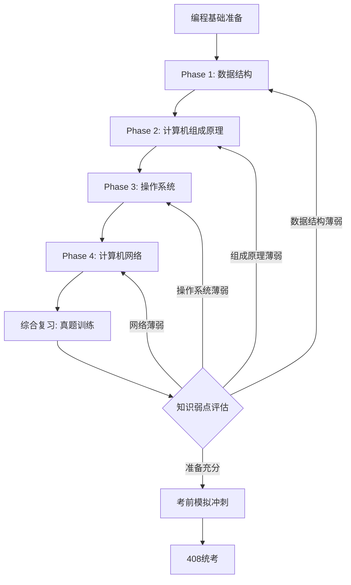
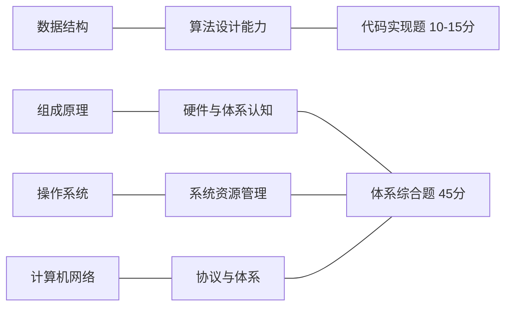

## 路径 -- 考研408方向

> 本路径以 **408 计算机学科专业基础综合** 全国统考为目标，将数据结构、计算机组成原理、计算机网络、操作系统四大学科组织为系统化备考方案。直接衔接 [[./408统考索引|408统考索引]]，逐考点进行对照复习。
>
> 本路线图既是备考路线，也是计算机本科核心课程的全覆盖索引。无论最终是否参加统考，掌握这四门课的内容和思维方式，是成为合格计算机工程师的必要条件。

---

### 目标受众

| 维度 | 描述 |
|------|------|
| 目标 | 408 统考备考 / 计算机科学基础系统学习 |
| 前置 | 任意一门编程语言的语法基础 (推荐 C 或 C++) |
| 适用人群 | 考研备考生、跨考转行人员、在校本科生、需要系统补全计算机基础的工程师 |
| 建议周期 | 6-8 个月 (全日制) / 10-12 个月 (在职) |

---

### 前置要求

| 科目 | 最低要求 | 推荐来源 |
|------|---------|---------|
| 编程基础 | 熟悉基本语法、循环、数组、函数 | [[路径A-C主线|C主线 Phase 1]] 或 [[路径B-CPP主线|C++主线 Phase 1]] |
| 数学基础 | 高中数学 + 线性代数 / 概率论基本概念 | 统考数学一/二同步复习 |
| 英语 | 能阅读教材和技术文档 (如 CS:APP 英文版) | 六级水平或同等 |

---

### 学习路线总览

> 四门课不是完全独立的：数据结构中"为什么 vector 比 list 快"需要计算机组成原理的缓存层级解释；操作系统的内存管理又依赖组成原理的地址空间概念。建议严格按照 Phase 1-4 的顺序推进，并在组原和操作系统中进行交叉回顾。

---

### Phase 1: 数据结构 (基础核心)

> 数据结构是 408 中 **分值最高** (约 45 分) 且代码实现题必考的学科。先掌握数据结构的核心逻辑，再在后续学科中理解"为什么"。

| 序号 | 章节 | 408 考点 | 建议学时 |
|:----:|------|---------|:-------:|
| 1 | [[数据结构/A_数组_Array\|数组 Array]] | 线性表的顺序存储、插入删除算法复杂度 | 4h |
| 2 | [[数据结构/B_字符串_String\|字符串 String]] | 串的匹配 (KMP 算法及其 next 数组) | 4h |
| 3 | [[数据结构/E_链表_LinkedList\|链表 LinkedList]] | 单/双向链表的增删、头插法/尾插法、循环链表 | 5h |
| 4 | [[数据结构/F_栈_Stack\|栈 Stack]] | 栈的应用 (表达式求值、括号匹配、递归) | 4h |
| 5 | [[数据结构/G_队列_Queue\|队列 Queue]] | 循环队列判空/判满、链式队列 | 4h |
| 6 | [[数据结构/J_树_Tree_BST_AVL\|树与二叉树]] | 二叉树遍历非递归算法、线索二叉树、森林与树的转换、Huffman 树 | 8h |
| 7 | [[数据结构/S_图_Graph\|图 Graph]] | 邻接矩阵/邻接表、DFS/BFS、最小生成树 (Prim/Kruskal)、最短路径 (Dijkstra/Floyd)、拓扑排序、关键路径 | 10h |
| 8 | [[数据结构/H_排序_八大排序_Sorting\|排序八大算法]] | 插入/希尔/冒泡/快排/选择/堆排序/归并排序/基数排序的时间空间复杂度与稳定性对比 | 8h |
| 9 | [[数据结构/N_哈希表_HashTable\|哈希表]] | 哈希函数构造、解决冲突 (开放定址/拉链)、平均查找长度 ASL 计算 | 5h |
| 10 | [[数据结构/I_堆_Heap\|堆 Heap]] | 堆排序、堆的插入与删除、堆与优先队列 | 4h |
| 11 | [[数据结构/L_字典树_Trie\|字典树]] + [[数据结构/O_并查集_UnionFind\|并查集]] | Trie 查找复杂度、并查集路径压缩 | 4h |
| 12 | [[数据结构/K_红黑树_RedBlackTree\|红黑树]] + [[数据结构/M_B树_BTree\|B树]] | 红黑树性质、B树/B+树定义与查找 | 5h |

| 408 大题关联 | 分值 | 常考题型 |
|-------------|:---:|---------|
| 算法设计题 | 10-15 | 线性表操作 (逆置/合并)、二叉树遍历应用 |
| 应用题 | 10-15 | Hash ASL、排序过程、图的遍历和最小生成树 |
| 选择题 | 20 | 概念辨析 (时间复杂度、稳定性、数据结构性质) |

> **学完 Phase 1 后建议**: 回看 [[路径D-DSA算法刷题.md|竞赛策略路线图]] Phase 1-3 的算法技巧，将 408 考察的数据结构与算法竞赛的刷题思维结合起来。

---

### Phase 2: 计算机组成原理 (难点学科)

> 组成原理是 408 中 **最难但体系最严谨** 的学科。数据表示、存储系统、CPU 执行流程是核心。强烈建议参考 [[计算机原理/计算机原理_索引|计算机原理索引]] 逐章学习。

| 序号 | 章节 | 408 考点 | 建议学时 |
|:----:|------|---------|:-------:|
| 1 | [[计算机原理/A_数据表示\|A 数据表示]] | 进位数制转换、补码/移码、IEEE 754 浮点数、海明码/CRC 校验 | 6h |
| 2 | [[计算机原理/E_指令集体系结构\|E 指令集体系结构]] | 指令格式、寻址方式 (10种)、MIPS/x86 对比 | 5h |
| 3 | [[计算机原理/C_CPU架构\|C CPU架构]] | CPU 组成、指令周期、微程序控制、流水线 (五级流水) | 8h |
| 4 | [[计算机原理/I_流水线与指令流水\|I 流水线与指令流水]] | 数据相关/控制相关/结构相关、流水线性能计算、流水线冲突 | 6h |
| 5 | [[计算机原理/H_CPU数据通路与控制器\|H CPU数据通路]] | 单周期/多周期 CPU 数据通路设计、硬布线控制器 vs 微程序控制器 | 5h |
| 6 | [[计算机原理/B_缓存层级\|B 缓存层级]] + [[计算机原理/D_内存层次结构\|D 内存层次]] | Cache-主存-辅存三级结构、映射方式 (直接/全相连/组相连)、Cache 命中率与访问时间计算 | 6h |
| 7 | [[计算机原理/F_总线系统\|F 总线系统]] | 总线仲裁、总线定时、PCIe 基础 | 3h |
| 8 | [[计算机原理/G_输入输出系统\|G 输入输出系统]] | 中断 (向量中断/中断嵌套)、DMA 三阶段、磁盘读写时间计算 | 5h |
| 9 | [[计算机原理/J_运算方法与运算器\|J 运算方法]] | 补码加减法、原码/补码一位乘法 (Booth 算法)、ALU 设计 | 4h |

| 408 大题关联 | 分值 | 常考题型 |
|-------------|:---:|---------|
| 综合应用题 | 12-15 | Cache 命中率计算、流水线时空图、数据通路分析 |
| 应用题 | 10-12 | IEEE 754 浮点数转换、补码运算、寻址方式计算 |
| 选择题 | 20 | 概念综合 (流水线阶段、Cache 映射、总线标准) |

> **学完 Phase 2 后建议**: 组成原理学完后，操作系统中的内存管理和 I/O 管理会变得极其自然。建议立即过渡到 Phase 3，并保持交叉回顾。

---

### Phase 3: 操作系统 (承上启下)

> 操作系统是连接硬件 (组原) 与软件 (数据结构 + 网络) 的桥梁。内存管理、进程调度、文件系统是 408 的核心考点。完整教程入口: [[操作系统/操作系统_索引|操作系统索引]]

| 序号 | 章节 | 408 考点 | 建议学时 |
|:----:|------|---------|:-------:|
| 1 | [[操作系统/A_操作系统概述\|A 操作系统概述]] | 操作系统概念、中断/异常/系统调用 | 2h |
| 2 | [[操作系统/B_进程管理\|B 进程管理]] | 进程状态转换、PCB、上下文切换、进程 vs 线程 | 5h |
| 3 | [[操作系统/D_CPU调度\|D CPU调度]] | FCFS/SJF/优先级/时间片轮转/多级反馈队列、周转时间计算 | 5h |
| 4 | [[操作系统/E_同步与死锁\|E 同步与死锁]] | 临界区、信号量与 PV 操作、管程、死锁必要条件、银行家算法、死锁检测 | 8h |
| 5 | [[操作系统/F_内存管理\|F 内存管理]] | 连续分配 (首次/最佳/最坏适应)、分页/分段/段页式、虚拟内存与请求分页、页面置换算法 (FIFO/LRU/LFU/CLOCK)、抖动与工作集 | 10h |
| 6 | [[操作系统/H_文件系统\|H 文件系统]] | FCB/inode、目录结构、文件分配 (连续/链接/索引)、空闲空间管理、磁盘调度 (FCFS/SSTF/SCAN/C-SCAN) | 6h |
| 7 | [[操作系统/J_IO管理\|J I/O管理]] | I/O控制方式 (程序/中断/DMA)、假脱机 (SPOOLing)、缓冲 | 4h |
| 8 | [[操作系统/I_进程间通信\|I 进程间通信]] | 管道/共享内存/消息队列/信号量/Socket | 3h |
| 9 | [[操作系统/C_线程与并发\|C 线程与并发]] | 内核线程 vs 用户级线程、线程上下文、并发模型 | 4h |

| 408 大题关联 | 分值 | 常考题型 |
|-------------|:---:|---------|
| PV 操作应用题 | 8-12 | 生产者-消费者、读者-写者、哲学家进餐等经典同步问题 |
| 页面置换大题 | 10-12 | 缺页率计算、LRU/FIFO 对比、Belady 异常 |
| 文件系统应用题 | 8-10 | 多级索引 inode 计算、混合索引最大文件容量 |
| 选择题 | 20 | 进程状态图、调度算法对比、死锁判断 |

> **学完 Phase 3 后建议**: PV 操作大题是 408 的"压轴题"之一，需要大量练习。学完后可使用 [[./408统考索引|408统考索引]] 中的历年 PV 真题做集中突破。

---

### Phase 4: 计算机网络 (体系化收官)

> 计算机网络是 408 中 **记忆量和体系性最强** 的学科。从物理层到应用层的五层体系，TCP/IP 协议簇是绝对核心。完整教程入口: [[计算机网络/计算机网络_索引|计算机网络索引]]

| 序号 | 章节 | 408 考点 | 建议学时 |
|:----:|------|---------|:-------:|
| 1 | [[计算机网络/A_体系结构\|A 体系结构]] | OSI 七层 / TCP/IP 四层模型、各层功能与协议数据单元 | 3h |
| 2 | [[计算机网络/B_物理层\|B 物理层]] | 奈奎斯特定理、香农定理、编码方式 (NRZ/曼彻斯特) | 4h |
| 3 | [[计算机网络/C_数据链路层\|C 数据链路层]] | 组帧、差错检测 (CRC/海明码)、CSMA/CD、以太网帧格式、交换机自学习与生成树 STP | 8h |
| 4 | [[计算机网络/D_网络层\|D 网络层]] | IPv4 地址/子网划分/CIDR、ARP/ICMP/DHCP、路由协议 (RIP/OSPF/BGP)、NAT | 10h |
| 5 | [[计算机网络/E_传输层\|E 传输层]] | TCP 报文段格式、三次握手/四次挥手 (连接管理状态机)、可靠传输 (ARQ/滑动窗口)、流量控制、拥塞控制 (慢开始/拥塞避免/快重传/快恢复)、UDP | 12h |
| 6 | [[计算机网络/F_应用层\|F 应用层]] | DNS (递归/迭代查询)、HTTP (报文/状态码/HTTPS 握手)、FTP (控制连接与数据连接) | 6h |

| 408 大题关联 | 分值 | 常考题型 |
|-------------|:---:|---------|
| 综合计算题 | 10-12 | TCP 拥塞窗口变化、子网划分、路由表更新 |
| 简述/分析题 | 8-10 | TCP 连接管理时序、路由算法对比 |
| 选择题 | 20 | 体系概念、协议端口号、设备所属层次 |

> **学完 Phase 4 后建议**: TCP 拥塞控制是 408 网络部分的压轴大题。学完传输层后，务必做至少 5 道拥塞控制窗口变化的真题进行巩固。

---

### 408 综合复习策略

| 阶段 | 时间 | 目标 |
|------|:---:|------|
| 第一轮 (精读) | 4-5 月 | 逐章学习所有常规章，建立知识框架 |
| 第二轮 (专题) | 2-3 月 | 四科的 **大题专题** 集中突破 (PV操作 / 流水线 / Cache计算 / TCP拥塞 / 算法设计) |
| 第三轮 (真题) | 1-2 月 | 近 10 年真题逐套计时模拟，分析错题 |
| 第四轮 (冲刺) | 1 月 | 错题回顾、高频考点速记、考前模拟 |

---

### 交叉链接

- [[路径A-C主线]] — C 语言底层系统编程，为组成原理和操作系统提供代码级验证工具
- [[路径B-CPP主线]] — 若使用 C++ 作为 408 算法题实现语言，参考 STL 容器的高效用法
- [[路径-工程化底层方向]] — 408 基础完成后的底层工程进阶方向
- [[路径-工程化应用方向]] — 408 基础完成后的应用开发方向
- [[路径D-DSA算法刷题.md|竞赛策略路线图]] — 算法竞赛刷题方法论，强化 408 代码题
- [[./408统考索引|408统考索引]] — 四科逐考点对照表、历年真题分类索引

---

### 推荐阅读物

| 书籍 | 说明 |
|------|------|
| 王道考研系列 (4册) | 408 应试标准教材，知识点与习题最贴近真题 |
| 天勤高分笔记系列 | 内容更详细，适合基础薄弱的同学 |
| Computer Systems: A Programmer's Perspective (CS:APP) | 计算机组成原理与操作系统的国际经典教材，建议作为补充阅读 |
| Computer Networking: A Top-Down Approach (Kurose & Ross) | 计算机网络领域最好入手的教材 |
| 算法导论 (CLRS) | 包含红黑树、B树、图算法的严格数学推导 |

---

### 完成后方向

完成 408 四科学系的系统学习后，你已具备计算机科学本科教育的核心知识框架。可以选择以下方向继续深耕：

| 方向 | 适用路径 | 说明 |
|------|---------|------|
| 系统底层 / 内核开发 | [[路径-工程化底层方向]] | 用 C/汇编深入操作系统内核、驱动开发、性能工程 |
| 应用开发 / 后端架构 | [[路径-工程化应用方向]] | 用 C++ 进入应用层、数据库、网络服务、分布式系统 |
| 算法竞赛 / 技术面试 | [[路径D-DSA算法刷题.md\|竞赛策略路线图]] | LeetCode/洛谷刷题、ACM/蓝桥杯备赛 |
| 网络安全 / 红队攻防 | [[路径E-红队职业路径]] | 渗透测试、CTF 竞赛、二进制漏洞利用 |
| Rust 系统编程 | [[路径F-Rust学习路径]] | 使用 Rust 重新审视所有权、并发、安全的内存管理 |
| C++ 模板元编程 | [[路径C-C向下兼容C++.md\|C向下兼容C++]] | 从 C 底层视角理解 C++ 的现代特性 |
