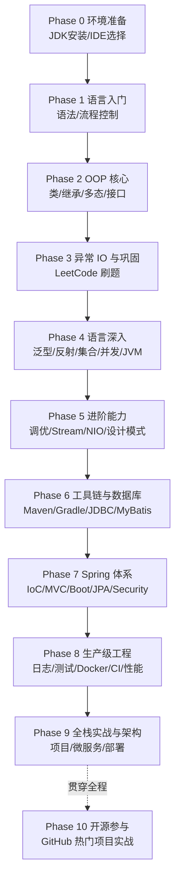

# 路径 G -- Java 全栈路径

> 本路径面向想直接进入全栈开发的学习者，以 Java 为后端核心语言。Java 是全球企业级开发的第一语言——银行、保险、电商、电信的后端系统绝大多数由 Java 构建，Spring 生态灵活庞大，从 Web 服务、数据访问到安全认证均有成熟方案。
>
> 本路径聚焦 **Java 部分**（语言入门 → 深入特性 → 工程化与 Spring 全家桶）。前端（HTML/CSS/JS/框架）与服务器运维（Linux/Docker 进阶/Nginx）后续会出专门目录，目前标注"规划中"，届时与本路径衔接形成完整全栈闭环。

---

### 目标受众

| 维度 | 描述 |
|------|------|
| 目标 | Java 后端工程师、全栈开发者、企业级应用开发 |
| 前置 | 零基础可入门；有其他语言经验者 Phase 0-1 可加速通过 |
| 适用人群 | 想以就业为导向系统学习 Java 的学生与转行者；需要补全 Spring 工程能力的初级开发者 |
| 建议周期 | 约 28 周（7 个月左右，含实战项目） |

---

### 前置要求

| 科目 | 最低要求 | 推荐来源 |
|------|---------|---------|
| 编程基础 | 变量、循环、函数等概念（零基础也可，Phase 0 起步） | 无需 |
| 命令行 | 终端基本操作、环境变量配置 | [[linux/README\|Linux 教程]] 入门篇 |
| SQL 基础 | 建议在 Phase 6 前具备增删改查能力 | [[数据库/数据库目录\|数据库教程]] |
| 英语 | 能阅读官方文档和 Stack Overflow 报错 | — |

---

### 学习路线总览

---

### Phase 0: 环境准备 (建议 3-4 天)

> 工欲善其事。JDK 版本建议直接上 LTS（17 或 21），IDE 选 IntelliJ IDEA 社区版即可起步。

| 序号 | 文件 | 核心内容 | 建议学时 |
|:----:|------|---------|:-------:|
| 1 | [[java/java目录\|Java 目录]] | 教程总索引，先通读建立全局地图 | 0.5h |
| 2 | [[java/1入门/00_Java是什么\|00 Java 是什么]] | 语言定位、JVM/JRE/JDK 关系、生态概览 | 2h |
| 3 | [[java/1入门/01_Windows环境配置\|01 Windows 环境配置]] | JDK 安装、JAVA_HOME 与 PATH 配置 | 2h |
| 4 | [[java/1入门/02_Linux环境配置\|02 Linux 环境配置]] | apt/yum 安装、多版本管理 (update-alternatives) | 2h |
| 5 | [[java/1入门/03_macOS环境配置\|03 macOS 环境配置]] | Homebrew 安装、SDKMAN 多版本切换 | 2h |
| 6 | [[java/1入门/04_编辑器与IDE选择\|04 编辑器与 IDE 选择]] | IDEA 安装与常用设置、VS Code 备选方案 | 2h |

> **检查点**: `java -version` 与 `javac -version` 输出正确版本；能用 IDEA 新建项目并运行第一个类；能解释 JDK、JRE、JVM 三者关系。

---

### Phase 1: 语言入门 (约 3 周)

> 建立语法基本功。这一阶段的目标不是"背语法"，而是能独立写出百行以内的小程序。

| 序号 | 文件 | 核心内容 | 建议学时 |
|:----:|------|---------|:-------:|
| 1 | [[java/1入门/05_第一个程序与jshell\|05 第一个程序与 jshell]] | main 方法结构、编译运行流程、jshell 交互式实验 | 3h |
| 2 | [[java/1入门/06_变量与数据类型\|06 变量与数据类型]] | 八大基本类型、引用类型、类型转换、var | 4h |
| 3 | [[java/1入门/07_运算符与表达式\|07 运算符与表达式]] | 算术/关系/逻辑/位运算、短路求值、优先级 | 3h |
| 4 | [[java/1入门/08_条件语句\|08 条件语句]] | if/else、switch 表达式（箭头语法） | 3h |
| 5 | [[java/1入门/09_循环结构\|09 循环结构]] | for/while/do-while/break/continue、嵌套循环 | 4h |

> **检查点**: 能独立写出猜数字游戏、九九乘法表、简单 ATM 菜单循环三个小程序；能解释基本类型与引用类型在内存中的区别。

### Phase 2: OOP 核心 (约 3 周)

> 面向对象是 Java 的灵魂，也是后续所有框架设计的底层语言。数组与字符串作为过渡章节一并掌握。

| 序号 | 文件 | 核心内容 | 建议学时 |
|:----:|------|---------|:-------:|
| 1 | [[java/1入门/10_数组\|10 数组]] | 一维/二维数组、遍历、Arrays 工具类 | 3h |
| 2 | [[java/1入门/11_字符串\|11 字符串]] | String 不可变性、StringBuilder、常用 API | 4h |
| 3 | [[java/1入门/12_方法\|12 方法]] | 参数传递、重载、递归、可变参数 | 3h |
| 4 | [[java/1入门/13_类与对象\|13 类与对象]] | 字段/方法/构造器、this、封装与访问控制 | 5h |
| 5 | [[java/1入门/14_继承与多态\|14 继承与多态]] | extends/super、方法重写、向上转型、动态绑定 | 5h |
| 6 | [[java/1入门/15_接口与抽象类\|15 接口与抽象类]] | interface/default 方法、抽象类、面向接口编程 | 5h |

> **检查点**: 能设计一个"图形"继承体系（Shape -> Circle/Rect）体现多态；能用接口 + 实现类重构一段 if-else 分支逻辑；能解释重载与重写的区别。

---

### Phase 3: 异常 IO 与巩固 (约 2 周)

> 收尾入门篇，补上异常处理和文件 IO 两块工程必备能力，然后进入刷题巩固期——算法能力从这一刻开始持续积累，而不是面试前突击。

| 序号 | 文件 | 核心内容 | 建议学时 |
|:----:|------|---------|:-------:|
| 1 | [[java/1入门/16_异常处理\|16 异常处理]] | try-catch-finally、受检/非受检异常、try-with-resources | 4h |
| 2 | [[java/1入门/17_文件IO\|17 文件 IO]] | File/Path、字节流/字符流、缓冲流、序列化 | 5h |
| 3 | LeetCode 刷题建议 | 见下方刷题路线 | 持续 |

> **LeetCode 刷题路线**（配合 [[路径D-DSA算法刷题.md|DSA 路线图]]）：
> - Phase 3 起：数组/字符串/双指针 easy 各 10 题，建立手感；
> - Phase 4 起：哈希表/栈/队列/链表 medium 各 10 题；
> - Phase 7 后：树/图/DP 按面试方向补齐，保持每周 3-5 题节奏。
>
> **检查点**: 能解释受检异常与非受检异常的设计意图；能读写文本文件并正确关闭资源；累计刷题不少于 30 道。

---

### Phase 4: 语言深入 (约 4 周)

> 从"会写 Java"到"懂 Java"。泛型、反射、集合源码、并发、JVM——这些是中高级面试的主战场，也是理解 Spring 等框架的前提。

| 序号 | 文件 | 核心内容 | 建议学时 |
|:----:|------|---------|:-------:|
| 1 | [[java/2深入/01_泛型深入\|01 泛型深入]] | 类型擦除、通配符上下界、泛型方法 | 6h |
| 2 | [[java/2深入/02_注解与反射\|02 注解与反射]] | Class 对象、Method/Field、自定义注解——Spring 的基石 | 6h |
| 3 | [[java/2深入/03_集合框架深入\|03 集合框架深入]] | ArrayList/HashMap 源码、扩容机制、ConcurrentHashMap | 8h |
| 4 | [[java/2深入/04_多线程基础\|04 多线程基础]] | Thread/Runnable、synchronized、volatile、线程通信 | 8h |
| 5 | [[java/2深入/05_并发包与线程池\|05 并发包与线程池]] | JUC、Lock/Condition、ThreadPoolExecutor 七参数 | 8h |
| 6 | [[java/2深入/06_JVM内存模型\|06 JVM 内存模型]] | 堆/栈/方法区、GC 基础、类加载机制 | 8h |

> **检查点**: 能画出 HashMap put 流程并解释 1.8 的红黑树化条件；能手写一个生产者-消费者模型；能解释 volatile 可见性与指令重排的关系。

---

### Phase 5: 进阶能力 (约 3 周)

> 补齐现代 Java 开发者的进阶武器库：性能调优、函数式编程、NIO 网络编程、设计模式与新版本特性。

| 序号 | 文件 | 核心内容 | 建议学时 |
|:----:|------|---------|:-------:|
| 1 | [[java/2深入/07_JVM调优\|07 JVM 调优]] | 常用参数、jstat/jmap/jstack、GC 日志分析 | 6h |
| 2 | [[java/2深入/08_Stream与函数式\|08 Stream 与函数式]] | Lambda、函数式接口、Stream API、Optional | 6h |
| 3 | [[java/2深入/09_NIO与网络编程\|09 NIO 与网络编程]] | Buffer/Channel/Selector、Socket 编程基础 | 6h |
| 4 | [[java/2深入/10_设计模式\|10 设计模式]] | 单例/工厂/建造者/代理/策略/模板方法——结合 JDK 与 Spring 源码讲 | 8h |
| 5 | [[java/2深入/11_Java新特性\|11 Java 新特性]] | record/sealed/模式匹配/虚拟线程 (LTS 版本速览) | 4h |
| 6 | [[java/2深入/12_算法与LeetCode\|12 算法与 LeetCode]] | 用 Java 刷高频题型，巩固数据结构 | 8h |

> **检查点**: 能用 jmap + MAT 分析一次内存泄漏 dump；能解释 Spring AOP 底层是 JDK 动态代理还是 CGLIB 及两者取舍；能熟练用 Stream 重写命令式集合操作。

---

### Phase 6: 工具链与数据库 (约 2 周)

> 进入工程世界。构建工具管理依赖，JDBC/MyBatis 打通数据库——这是从"写代码"到"做项目"的分水岭。

| 序号 | 文件 | 核心内容 | 建议学时 |
|:----:|------|---------|:-------:|
| 1 | [[java/3工程化/01_Maven构建\|01 Maven 构建]] | pom/GAV 坐标、依赖传递、生命周期、多模块聚合 | 6h |
| 2 | [[java/3工程化/02_Gradle构建\|02 Gradle 构建]] | Kotlin DSL、增量构建、与 Maven 对比选型 | 4h |
| 3 | [[java/3工程化/03_JDBC与数据库连接\|03 JDBC 与数据库连接]] | Connection/PreparedStatement、连接池 (HikariCP)、事务 | 6h |
| 4 | [[java/3工程化/04_MyBatis\|04 MyBatis]] | mapper 映射、动态 SQL、缓存机制、与 JDBC 对比 | 8h |

> **检查点**: 能配置一个多模块 Maven 工程并用父 pom 统一依赖版本；能解释 PreparedStatement 如何防止 SQL 注入；能写出含动态 SQL 的多条件分页查询。

---

### Phase 7: Spring 体系 (约 4 周)

> 本路径的重头戏。Spring 是 Java 企业级开发的事实标准，IoC/AOP 思想 + MVC 三层架构 + Boot 自动装配，一个都绕不开。

| 序号 | 文件 | 核心内容 | 建议学时 |
|:----:|------|---------|:-------:|
| 1 | [[java/3工程化/05_Spring IoC与AOP\|05 Spring IoC 与 AOP]] | Bean 生命周期、依赖注入、切面编程、事务传播 | 10h |
| 2 | [[java/3工程化/06_Spring Boot快速开发\|06 Spring Boot 快速开发]] | starter/auto-configuration、application.yml、Actuator | 8h |
| 3 | [[java/3工程化/07_Spring MVC\|07 Spring MVC]] | DispatcherServlet、RESTful 控制器、参数校验、全局异常 | 8h |
| 4 | [[java/3工程化/08_Spring Data JPA\|08 Spring Data JPA]] | Repository 抽象、实体映射、派生查询、事务集成 | 8h |
| 5 | [[java/3工程化/09_Spring Security\|09 Spring Security]] | 过滤器链、认证授权、JWT 集成、RBAC 权限模型 | 10h |

> **实战练习**: 用 Spring Boot + JPA + MySQL 实现一套用户-文章 REST API，
> 含 JWT 登录、分页、全局异常处理——这是 Phase 9 大项目的前置热身。
>
> **检查点**: 能手写一个 BeanPostProcessor 并说明其执行时机；能解释 Boot 自动装配原理 (@EnableAutoConfiguration + spring.factories)；能独立完成登录鉴权全流程。

---

### Phase 8: 生产级工程 (约 3 周)

> 从"能跑"到"能上线"。日志、测试、容器化、CI、性能优化——企业开发的最后一公里。

| 序号 | 文件 | 核心内容 | 建议学时 |
|:----:|------|---------|:-------:|
| 1 | [[java/3工程化/10_日志框架\|10 日志框架]] | SLF4J 门面、Logback 配置、MDC 链路追踪 | 4h |
| 2 | [[java/3工程化/11_单元测试\|11 单元测试]] | JUnit 5、Mockito、覆盖率、测试金字塔 | 6h |
| 3 | [[java/3工程化/12_Docker容器化\|12 Docker 容器化]] | Dockerfile 多阶段构建、分层镜像、docker-compose 编排 | 6h |
| 4 | [[java/3工程化/13_CICD流水线\|13 CICD 流水线]] | GitHub Actions/Jenkins：测试-构建-镜像-部署 | 6h |
| 5 | [[java/3工程化/14_性能调优与监控\|14 性能调优与监控]] | 压测 (JMeter)、慢 SQL 定位、JVM 参数实战、Arthas | 8h |

> **检查点**: 能为项目配置分级日志并在 MDC 中注入 traceId；能把核心模块测试覆盖率提到 60% 以上；能编写一条完整 CI 流水线把 jar 打成镜像推送到仓库。

---

### Phase 9: 全栈实战与架构 (约 4 周)

> 综合运用全部所学，完成一个可写进简历的生产级项目，并向微服务与架构视角延伸。

| 序号 | 文件 | 核心内容 | 建议学时 |
|:----:|------|---------|:-------:|
| 1 | [[java/3工程化/15_全栈开发技巧\|15 全栈开发技巧]] | 前后端联调、接口设计、完整业务项目实战 | 30h |
| 2 | [[java/3工程化/16_应急处理与线上问题排查\|16 应急处理与线上问题排查]] | CPU 飙高/内存泄漏/死锁排查、止血三板斧、复盘 | 12h |
| 3 | [[java/3工程化/17_GitHub热门Java项目实战\|17 GitHub 热门项目实战]] | 读源码、提 PR、参与开源——详见 Phase 10 | 20h |
| 4 | [[java/3工程化/18_架构设计入门\|18 架构设计入门]] | DDD、微服务拆分、分布式事务、限流降级 | 12h |

> **检查点**: 独立完成一个含前端页面（可用模板引擎或后续前端目录）的部署上线项目；能画出自己项目的架构图并回答"为什么这么拆"；向任一开源项目提交过至少一个被合并的 PR。

---

### Phase 10: 开源参与 (贯穿全程)

> [[java/3工程化/17_GitHub热门Java项目实战|GitHub 热门 Java 项目实战]]不是一次性章节，而是从 Phase 3 就可以启动的长期动作：
>
> - **Phase 3-5**: 给文档/翻译类 issue 提交修正，熟悉协作流程；
> - **Phase 6-7**: 为工具库修小 bug、补单元测试，读懂中型项目结构；
- **Phase 8-9**: 向 Spring 生态周边、MyBatis 扩展等项目提交功能级 PR；
> - 持续输出：把每个 Phase 的实战项目整理成 GitHub 仓库，作为求职作品集。

---

### 相关路径

- [[路径A-C主线]] — C 语言主线，理解内存与底层，反哺 JVM 认知
- [[路径B-CPP主线]] — C++ 主线，对比两门静态强类型语言的设计哲学
- [[路径F-Rust学习路径]] — Rust 主线，体验无 GC 内存安全模型的另一极端
- [[路径-工程化应用方向]] — 以 C++ 为核心的工程化应用路线，与本路径互为参照
- [[java/java目录|Java 教程目录]] — 本路径全部章节的总索引
- [[数据库/数据库目录|数据库教程]] — Phase 6 前置的 SQL 基础

---

### 规划中的配套目录

| 目录 | 内容 | 状态 |
|------|------|------|
| 前端目录 | HTML/CSS/JavaScript、Vue 或 React、与后端 API 联调 | 规划中 |
| 服务器运维目录 | Linux 进阶、Nginx、Docker/Kubernetes、监控告警 | 规划中 |

上述目录发布后，将并入本路径形成 Phase 11+ 的完整全栈闭环。
